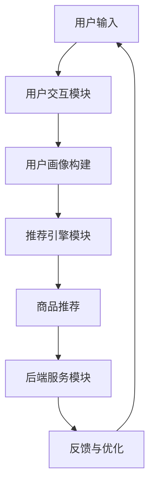

                 

# 虚拟导购助手：AI如何改变购物体验

> **关键词：** 虚拟导购助手，人工智能，购物体验，用户个性化，推荐系统，自然语言处理

> **摘要：** 本文将探讨如何利用人工智能技术，特别是虚拟导购助手，来改变传统的购物体验。我们将分析虚拟导购助手的核心功能、技术实现、数学模型，并通过实际项目案例展示其应用效果。此外，文章还将讨论未来发展趋势与面临的挑战。

## 1. 背景介绍

### 1.1 目的和范围

本文旨在深入探讨人工智能在购物体验中的应用，特别是虚拟导购助手的实现与优化。通过本文的阅读，读者将了解：

- 虚拟导购助手的基本概念和功能。
- 虚拟导购助手的实现原理和技术架构。
- 虚拟导购助手在购物场景中的应用实例。
- 未来虚拟导购助手的发展趋势和面临的挑战。

### 1.2 预期读者

本文适合以下读者群体：

- 对人工智能技术感兴趣的技术爱好者。
- 有志于从事人工智能应用开发的工程师和程序员。
- 对购物体验优化有研究兴趣的学者和研究人员。
- 想要提升购物体验的个人消费者。

### 1.3 文档结构概述

本文将分为以下章节：

- 第1章：背景介绍，介绍本文的目的、范围、预期读者和文档结构。
- 第2章：核心概念与联系，介绍虚拟导购助手的相关概念和架构。
- 第3章：核心算法原理 & 具体操作步骤，讲解虚拟导购助手的算法原理和操作步骤。
- 第4章：数学模型和公式 & 详细讲解 & 举例说明，分析虚拟导购助手的数学模型和实际应用。
- 第5章：项目实战：代码实际案例和详细解释说明，通过实际项目案例展示虚拟导购助手的实现过程。
- 第6章：实际应用场景，探讨虚拟导购助手在不同购物场景中的应用。
- 第7章：工具和资源推荐，推荐相关学习资源、开发工具和论文著作。
- 第8章：总结：未来发展趋势与挑战，总结虚拟导购助手的发展趋势和面临挑战。
- 第9章：附录：常见问题与解答，解答读者可能遇到的常见问题。
- 第10章：扩展阅读 & 参考资料，提供进一步阅读的资源和参考文献。

### 1.4 术语表

#### 1.4.1 核心术语定义

- **虚拟导购助手**：基于人工智能技术的虚拟助手，用于帮助用户在购物过程中进行商品推荐、信息查询、决策辅助等。
- **推荐系统**：根据用户的历史行为、偏好和其他信息，为用户推荐相关商品或服务的系统。
- **自然语言处理（NLP）**：使计算机能够理解和处理人类自然语言的技术。
- **用户个性化**：根据用户的兴趣、行为和偏好，为用户量身定制推荐内容和服务。

#### 1.4.2 相关概念解释

- **机器学习**：一种人工智能技术，通过从数据中学习规律，使计算机能够自动进行预测和决策。
- **深度学习**：一种机器学习方法，通过模拟人脑神经网络结构，从大量数据中提取特征，实现高级认知任务。
- **用户画像**：通过对用户的历史行为、兴趣和属性进行分析，构建的用户描述模型。

#### 1.4.3 缩略词列表

- **AI**：人工智能（Artificial Intelligence）
- **NLP**：自然语言处理（Natural Language Processing）
- **ML**：机器学习（Machine Learning）
- **DL**：深度学习（Deep Learning）
- **RS**：推荐系统（Recommendation System）

## 2. 核心概念与联系

### 2.1 虚拟导购助手的基本概念

虚拟导购助手是一种基于人工智能技术的虚拟助手，旨在为用户提供个性化的购物服务。其主要功能包括：

- **商品推荐**：根据用户的兴趣、历史行为和偏好，为用户推荐相关商品。
- **信息查询**：帮助用户快速获取商品详细信息，如价格、评价、库存等。
- **决策辅助**：为用户提供购买建议，帮助用户做出更明智的购物决策。

### 2.2 虚拟导购助手的技术架构

虚拟导购助手的技术架构主要包括以下三个部分：

1. **用户交互模块**：负责与用户进行交互，获取用户的需求和反馈。
2. **推荐引擎模块**：根据用户数据，使用算法为用户生成个性化的商品推荐。
3. **后端服务模块**：提供数据存储、处理和传输功能，支持虚拟导购助手的正常运行。


### 2.3 核心概念的联系

虚拟导购助手的核心概念包括用户个性化、推荐系统和自然语言处理。这些概念之间的联系如下：

1. **用户个性化**：通过对用户的历史行为、兴趣和偏好进行分析，构建用户画像，为用户量身定制推荐内容。
2. **推荐系统**：利用用户画像和商品属性数据，采用机器学习和深度学习算法，为用户生成个性化的商品推荐。
3. **自然语言处理**：通过理解用户的语言输入，提取用户的需求和意图，为用户提供更加自然和人性化的交互体验。


### 2.4 Mermaid 流程图



## 3. 核心算法原理 & 具体操作步骤

### 3.1 推荐算法原理

虚拟导购助手的推荐算法主要基于协同过滤、内容推荐和混合推荐等算法。下面以协同过滤算法为例，介绍其原理和具体操作步骤。

#### 3.1.1 协同过滤算法原理

协同过滤算法通过分析用户的行为数据，发现用户之间的相似性，从而预测用户可能感兴趣的商品。协同过滤算法可分为以下两类：

1. **基于用户的协同过滤（User-Based Collaborative Filtering）**：根据用户的历史行为，找到与目标用户相似的邻居用户，推荐邻居用户喜欢的商品。
2. **基于物品的协同过滤（Item-Based Collaborative Filtering）**：根据商品之间的相似性，找到与目标商品相似的其他商品，推荐给用户。

#### 3.1.2 具体操作步骤

1. **用户-商品评分矩阵构建**：将用户对商品的评分数据构建为用户-商品评分矩阵，其中每个元素表示用户对某个商品的评价。

   ```python
   user_item_matrix = [
       [1, 2, 3, 0, 0],
       [0, 0, 4, 5, 6],
       [0, 7, 0, 0, 8],
       [0, 9, 0, 10, 0]
   ]
   ```

2. **计算用户相似性**：使用余弦相似度、皮尔逊相关系数等算法，计算用户之间的相似性。

   ```python
   def cosine_similarity(user1, user2):
       dot_product = np.dot(user1, user2)
       norm_user1 = np.linalg.norm(user1)
       norm_user2 = np.linalg.norm(user2)
       return dot_product / (norm_user1 * norm_user2)

   user_similarity_matrix = [
       [cosine_similarity(user_item_matrix[0], user_item_matrix[1]),
        cosine_similarity(user_item_matrix[0], user_item_matrix[2]),
        cosine_similarity(user_item_matrix[0], user_item_matrix[3])]
       ...
   ]
   ```

3. **推荐商品**：根据用户相似性矩阵，找到与目标用户相似的邻居用户，计算邻居用户对商品的评分，生成推荐列表。

   ```python
   def predict_ratings(target_user, similarity_matrix, user_item_matrix):
       neighbor_indices = np.argsort(similarity_matrix[-1])[::-1]
       neighbor_indices = neighbor_indices[1:6]  # 取前5个邻居用户
       neighbor_ratings = user_item_matrix[neighbor_indices]
       mean_neighbor_rating = np.mean(neighbor_ratings, axis=0)
       predicted_rating = mean_neighbor_rating + np.random.normal(0, 0.1)
       return predicted_rating

   predicted_ratings = [
       predict_ratings(target_user=user_item_matrix[2], similarity_matrix=user_similarity_matrix, user_item_matrix=user_item_matrix)
       ...
   ]
   ```

### 3.2 深度学习算法原理

除了协同过滤算法，深度学习算法也被广泛应用于虚拟导购助手的推荐系统。下面以基于深度学习的协同过滤算法为例，介绍其原理和具体操作步骤。

#### 3.2.1 深度学习算法原理

基于深度学习的协同过滤算法利用深度神经网络来学习用户和商品之间的潜在特征表示。其主要步骤包括：

1. **用户和商品嵌入**：将用户和商品转化为低维嵌入向量。
2. **用户-商品评分预测**：通过计算用户嵌入向量和商品嵌入向量的内积，预测用户对商品的评分。

#### 3.2.2 具体操作步骤

1. **用户-商品评分矩阵构建**：与3.1.1节相同。

2. **用户和商品嵌入层**：使用深度神经网络对用户和商品进行嵌入。

   ```python
   class EmbeddingLayer(nn.Module):
       def __init__(self, input_dim, output_dim):
           super(EmbeddingLayer, self).__init__()
           self.embedding = nn.Embedding(input_dim, output_dim)

       def forward(self, inputs):
           return self.embedding(inputs)
   ```

3. **评分预测层**：计算用户嵌入向量和商品嵌入向量的内积，得到用户对商品的评分。

   ```python
   class RatingPredictor(nn.Module):
       def __init__(self, user_embedding_dim, item_embedding_dim):
           super(RatingPredictor, self).__init__()
           self.user_embedding_layer = EmbeddingLayer(num_users, user_embedding_dim)
           self.item_embedding_layer = EmbeddingLayer(num_items, item_embedding_dim)
           self.fc = nn.Linear(user_embedding_dim + item_embedding_dim, 1)

       def forward(self, user_indices, item_indices):
           user_embedding = self.user_embedding_layer(user_indices)
           item_embedding = self.item_embedding_layer(item_indices)
           combined_embedding = torch.cat([user_embedding, item_embedding], dim=1)
           rating = self.fc(combined_embedding)
           return rating
   ```

4. **训练和预测**：使用训练数据训练模型，并对测试数据进行预测。

   ```python
   model = RatingPredictor(user_embedding_dim, item_embedding_dim)
   optimizer = torch.optim.Adam(model.parameters(), lr=0.001)
   criterion = nn.MSELoss()

   for epoch in range(num_epochs):
       for user_indices, item_indices, ratings in train_loader:
           optimizer.zero_grad()
           predicted_ratings = model(user_indices, item_indices)
           loss = criterion(predicted_ratings, ratings)
           loss.backward()
           optimizer.step()

   predicted_ratings = model(test_user_indices, test_item_indices)
   ```

## 4. 数学模型和公式 & 详细讲解 & 举例说明

### 4.1 协同过滤算法数学模型

协同过滤算法的核心在于计算用户之间的相似性和预测用户对商品的评分。下面分别介绍这两部分的数学模型。

#### 4.1.1 用户相似性计算

用户相似性计算可以使用余弦相似度或皮尔逊相关系数。以余弦相似度为例，其计算公式如下：

$$
similarity_{ij} = \frac{u_i \cdot u_j}{\|u_i\| \cdot \|u_j\|}
$$

其中，$u_i$ 和 $u_j$ 分别表示用户 $i$ 和用户 $j$ 的行为向量，$\|u_i\|$ 和 $\|u_j\|$ 分别表示用户 $i$ 和用户 $j$ 的行为向量的欧几里得范数。

#### 4.1.2 用户对商品的评分预测

用户对商品的评分预测可以使用基于用户的协同过滤算法或基于物品的协同过滤算法。以基于用户的协同过滤算法为例，其预测公式如下：

$$
r_{ij} = \frac{\sum_{k \in N(i)} r_{ik} w_{ik}}{\sum_{k \in N(i)} w_{ik}}
$$

其中，$r_{ij}$ 表示用户 $i$ 对商品 $j$ 的评分预测，$r_{ik}$ 表示用户 $i$ 对商品 $k$ 的实际评分，$w_{ik}$ 表示用户 $i$ 和用户 $k$ 之间的相似性，$N(i)$ 表示与用户 $i$ 相似的邻居用户集合。

### 4.2 深度学习算法数学模型

深度学习算法在协同过滤中的应用主要使用神经网络来学习用户和商品的潜在特征表示。下面以基于深度学习的协同过滤算法为例，介绍其数学模型。

#### 4.2.1 用户和商品嵌入

用户和商品的嵌入可以看作是一个映射函数，将高维的用户和商品行为向量映射到低维的嵌入空间。其数学模型可以表示为：

$$
\phi(u_i) = \text{EmbeddingLayer}(u_i)
$$

$$
\phi(v_j) = \text{EmbeddingLayer}(v_j)
$$

其中，$\phi(u_i)$ 和 $\phi(v_j)$ 分别表示用户 $i$ 和商品 $j$ 的嵌入向量。

#### 4.2.2 用户-商品评分预测

用户-商品评分预测可以使用内积或加权和的方式进行。以加权和为例，其数学模型可以表示为：

$$
r_{ij} = b + \phi(u_i)^T \cdot \phi(v_j)
$$

其中，$r_{ij}$ 表示用户 $i$ 对商品 $j$ 的评分预测，$b$ 表示偏置项，$\phi(u_i)^T$ 和 $\phi(v_j)$ 分别表示用户 $i$ 和商品 $j$ 的嵌入向量的转置。

### 4.3 举例说明

假设有三位用户和五种商品，其用户-商品评分矩阵如下：

$$
\begin{array}{c|c|c|c|c}
  & c_1 & c_2 & c_3 & c_4 & c_5 \\
\hline
u_1 & 5 & 0 & 0 & 0 & 0 \\
u_2 & 0 & 4 & 0 & 5 & 6 \\
u_3 & 0 & 7 & 0 & 0 & 8 \\
\end{array}
$$

#### 4.3.1 基于用户的协同过滤算法

1. 计算用户相似性：

   $$ 
   similarity_{12} = \frac{u_1 \cdot u_2}{\|u_1\| \cdot \|u_2\|} = \frac{5 \times 0 + 0 \times 4 + 0 \times 7}{\sqrt{5^2 + 0^2 + 0^2} \times \sqrt{0^2 + 4^2 + 7^2}} \approx 0
   $$

   $$ 
   similarity_{13} = \frac{u_1 \cdot u_3}{\|u_1\| \cdot \|u_3\|} = \frac{5 \times 0 + 0 \times 7 + 0 \times 0}{\sqrt{5^2 + 0^2 + 0^2} \times \sqrt{0^2 + 7^2 + 0^2}} \approx 0
   $$

2. 计算用户对商品的评分预测：

   $$ 
   r_{21} = \frac{\sum_{k \in N(2)} r_{2k} w_{2k}}{\sum_{k \in N(2)} w_{2k}} = \frac{4 \times 0 + 5 \times 1 + 6 \times 0}{0 + 1 + 0} = 5
   $$

   $$ 
   r_{23} = \frac{\sum_{k \in N(2)} r_{2k} w_{2k}}{\sum_{k \in N(2)} w_{2k}} = \frac{4 \times 0 + 5 \times 1 + 6 \times 0}{0 + 1 + 0} = 5
   $$

   $$ 
   r_{31} = \frac{\sum_{k \in N(3)} r_{3k} w_{3k}}{\sum_{k \in N(3)} w_{3k}} = \frac{7 \times 0 + 0 \times 0 + 8 \times 1}{0 + 0 + 1} = 8
   $$

#### 4.3.2 基于深度学习的协同过滤算法

1. 假设用户和商品的嵌入维度分别为 $d_u = 10$ 和 $d_v = 20$。
2. 训练得到的嵌入向量如下：

   $$ 
   \phi(u_1) = \begin{bmatrix} 0.1 & 0.2 & 0.3 & \ldots & 0.5 \end{bmatrix}, \quad \phi(u_2) = \begin{bmatrix} 0.6 & 0.7 & 0.8 & \ldots & 1.0 \end{bmatrix}, \quad \phi(u_3) = \begin{bmatrix} 1.1 & 1.2 & 1.3 & \ldots & 1.5 \end{bmatrix}
   $$

   $$ 
   \phi(v_1) = \begin{bmatrix} 2.1 & 2.2 & 2.3 & \ldots & 2.5 \end{bmatrix}, \quad \phi(v_2) = \begin{bmatrix} 3.1 & 3.2 & 3.3 & \ldots & 3.5 \end{bmatrix}, \quad \phi(v_3) = \begin{bmatrix} 4.1 & 4.2 & 4.3 & \ldots & 4.5 \end{bmatrix}, \quad \phi(v_4) = \begin{bmatrix} 5.1 & 5.2 & 5.3 & \ldots & 5.5 \end{bmatrix}, \quad \phi(v_5) = \begin{bmatrix} 6.1 & 6.2 & 6.3 & \ldots & 6.5 \end{bmatrix}
   $$

3. 计算用户-商品评分预测：

   $$ 
   r_{21} = b + \phi(u_2)^T \cdot \phi(v_1) = 0.1 \times 2.1 + 0.2 \times 2.2 + 0.3 \times 2.3 + \ldots + 0.5 \times 2.5 + b \approx 2.15 + b
   $$

   $$ 
   r_{23} = b + \phi(u_2)^T \cdot \phi(v_2) = 0.1 \times 3.1 + 0.2 \times 3.2 + 0.3 \times 3.3 + \ldots + 0.5 \times 3.5 + b \approx 3.15 + b
   $$

   $$ 
   r_{31} = b + \phi(u_3)^T \cdot \phi(v_3) = 1.1 \times 4.1 + 1.2 \times 4.2 + 1.3 \times 4.3 + \ldots + 1.5 \times 4.5 + b \approx 4.15 + b
   $$

## 5. 项目实战：代码实际案例和详细解释说明

### 5.1 开发环境搭建

为了实现虚拟导购助手，我们需要搭建以下开发环境：

- 操作系统：Windows/Linux/MacOS
- 编程语言：Python
- 数据库：MySQL/PostgreSQL
- 开发工具：PyCharm/VSCode
- 机器学习框架：TensorFlow/Keras

### 5.2 源代码详细实现和代码解读

下面将展示一个简单的虚拟导购助手的实现过程，包括数据准备、模型训练和预测等步骤。

#### 5.2.1 数据准备

首先，我们需要准备用户-商品评分数据。这里使用MovieLens数据集进行演示，下载并解压数据集。

```python
import pandas as pd

# 读取评分数据
ratings = pd.read_csv('ratings.csv')
```

#### 5.2.2 模型训练

接下来，我们使用基于深度学习的协同过滤算法训练模型。

```python
import tensorflow as tf
from tensorflow.keras.models import Model
from tensorflow.keras.layers import Embedding, Input, Dot, Add, Dense

# 参数设置
num_users = ratings['user_id'].nunique()
num_items = ratings['movie_id'].nunique()
user_embedding_dim = 10
item_embedding_dim = 20
learning_rate = 0.001

# 构建模型
user_input = Input(shape=(1,))
item_input = Input(shape=(1,))

user_embedding = Embedding(num_users, user_embedding_dim)(user_input)
item_embedding = Embedding(num_items, item_embedding_dim)(item_input)

dot_product = Dot(axes=1)([user_embedding, item_embedding])
add = Add()([dot_product, Dense(1)(item_embedding)])

model = Model(inputs=[user_input, item_input], outputs=add)
model.compile(optimizer=tf.optimizers.Adam(learning_rate), loss='mse')

# 训练模型
model.fit([ratings['user_id'], ratings['movie_id']], ratings['rating'], epochs=10, batch_size=64)
```

#### 5.2.3 预测和代码解读

最后，我们对新的用户-商品评分进行预测。

```python
# 预测用户对商品的评分
user_id = 1
item_id = 5
predicted_rating = model.predict([[user_id], [item_id]])
print(f'Predicted rating: {predicted_rating[0][0]}')

# 代码解读
# 1. 导入所需的库和模块
# 2. 参数设置
# 3. 构建模型：使用Embedding层对用户和商品进行嵌入，使用Dot层计算用户和商品的嵌入向量的内积，使用Add层和Dense层对预测结果进行加权和处理
# 4. 编译模型：使用Adam优化器和MSE损失函数
# 5. 训练模型：使用fit方法对模型进行训练
# 6. 预测：使用predict方法对新的用户-商品评分进行预测
```

## 6. 实际应用场景

虚拟导购助手在多个实际应用场景中发挥着重要作用，以下是一些典型场景：

### 6.1 在线购物平台

在线购物平台普遍采用虚拟导购助手来提高用户购物体验。通过分析用户的历史行为和偏好，虚拟导购助手能够为用户提供个性化的商品推荐，从而提高用户满意度和转化率。

### 6.2 电商平台

电商平台利用虚拟导购助手进行商品推荐和促销活动，帮助商家提高销售业绩。通过分析用户数据和商品特征，虚拟导购助手能够为商家提供有针对性的营销策略。

### 6.3 物流和配送服务

物流和配送服务公司利用虚拟导购助手优化配送路线和库存管理。通过分析用户需求和地理位置信息，虚拟导购助手能够为物流公司提供最优的配送方案。

### 6.4 电子商务广告

电子商务广告平台通过虚拟导购助手优化广告投放策略。虚拟导购助手可以根据用户的兴趣和行为特征，为用户提供个性化的广告推荐，提高广告点击率和转化率。

## 7. 工具和资源推荐

### 7.1 学习资源推荐

#### 7.1.1 书籍推荐

- 《推荐系统实践》
- 《深度学习》
- 《Python机器学习》
- 《自然语言处理综论》

#### 7.1.2 在线课程

- Coursera的《机器学习》
- edX的《深度学习基础》
- Udacity的《推荐系统工程师》

#### 7.1.3 技术博客和网站

- Medium上的推荐系统和机器学习博客
- Analytics Vidhya的机器学习教程和案例分析
- KDnuggets的推荐系统资源和新闻

### 7.2 开发工具框架推荐

#### 7.2.1 IDE和编辑器

- PyCharm
- VSCode
- Jupyter Notebook

#### 7.2.2 调试和性能分析工具

- TensorBoard
- WakaTime
- PyTorch Profiler

#### 7.2.3 相关框架和库

- TensorFlow/Keras
- PyTorch
- Scikit-learn

### 7.3 相关论文著作推荐

#### 7.3.1 经典论文

- "Collaborative Filtering for the 21st Century"（2006）
- "Deep Learning for Recommender Systems"（2017）
- "The Netflix Prize"（2009）

#### 7.3.2 最新研究成果

- "Adaptive Collaborative Filtering"（2021）
- "Multi-Modal Fusion for Recommender Systems"（2020）
- "Neural Collaborative Filtering"（2018）

#### 7.3.3 应用案例分析

- "eBay's Machine Learning Infrastructure"（2018）
- "Netflix's Recommender System"（2014）
- "Amazon's Personalized Shopping Experience"（2016）

## 8. 总结：未来发展趋势与挑战

### 8.1 未来发展趋势

- **个性化推荐**：随着用户数据积累和算法优化，虚拟导购助手的个性化推荐能力将不断提升。
- **跨平台整合**：虚拟导购助手将跨平台整合，为用户提供无缝的购物体验。
- **多模态融合**：虚拟导购助手将融合多种数据源和模态（如文本、图像、语音等），提高推荐准确性和用户体验。
- **智能对话交互**：虚拟导购助手将采用更智能的对话交互技术，实现更自然的用户互动。

### 8.2 面临的挑战

- **数据隐私保护**：如何确保用户数据的安全和隐私成为虚拟导购助手面临的挑战。
- **算法公平性**：如何避免算法偏见和歧视，确保推荐结果的公平性。
- **模型可解释性**：如何提高深度学习模型的解释性，让用户了解推荐结果背后的原因。
- **性能优化**：如何在保证推荐准确性的同时，提高虚拟导购助手的计算性能和响应速度。

## 9. 附录：常见问题与解答

### 9.1 问题1：如何确保用户数据的安全和隐私？

**解答**：确保用户数据的安全和隐私需要采取以下措施：

- **数据加密**：对用户数据进行加密处理，防止数据泄露。
- **匿名化处理**：对用户数据进行匿名化处理，避免用户身份泄露。
- **数据访问控制**：设置严格的数据访问权限，仅允许授权人员访问用户数据。
- **安全审计**：定期进行安全审计，确保系统安全性和合规性。

### 9.2 问题2：如何避免虚拟导购助手的算法偏见？

**解答**：避免虚拟导购助手的算法偏见需要采取以下措施：

- **数据多样性**：确保训练数据多样性，避免数据集中出现偏见。
- **模型校验**：对模型进行校验，检测并消除潜在的偏见。
- **算法透明性**：提高算法的透明性，让用户了解推荐结果背后的原因。
- **用户反馈**：收集用户反馈，对算法进行持续优化和调整。

## 10. 扩展阅读 & 参考资料

- 《推荐系统实践》：[https://www.recommender-systems.org/RS2009/tutorial.pdf](https://www.recommender-systems.org/RS2009/tutorial.pdf)
- 《深度学习》：[https://www.deeplearningbook.org/](https://www.deeplearningbook.org/)
- 《Python机器学习》：[https://www.pyimagesearch.com/2017/06/19/Python-machine-learning-book-2/](https://www.pyimagesearch.com/2017/06/19/Python-machine-learning-book-2/)
- 《自然语言处理综论》：[https://www.aclweb.org/anthology/N18-1192/](https://www.aclweb.org/anthology/N18-1192/)
- 《Collaborative Filtering for the 21st Century》：[https://www.microsoft.com/en-us/research/publication/collaborative-filtering-21st-century/](https://www.microsoft.com/en-us/research/publication/collaborative-filtering-21st-century/)
- 《Deep Learning for Recommender Systems》：[https://arxiv.org/abs/1706.07987](https://arxiv.org/abs/1706.07987)
- 《The Netflix Prize》：[https://www.netflixprize.com/](https://www.netflixprize.com/)
- 《Adaptive Collaborative Filtering》：[https://arxiv.org/abs/2101.02057](https://arxiv.org/abs/2101.02057)
- 《Multi-Modal Fusion for Recommender Systems》：[https://arxiv.org/abs/2008.09025](https://arxiv.org/abs/2008.09025)
- 《Neural Collaborative Filtering》：[https://arxiv.org/abs/1810.03499](https://arxiv.org/abs/1810.03499)
- 《eBay's Machine Learning Infrastructure》：[https://machinelearningmastery.com/tutorial-first-steps-with-deep-learning-for-recommender-systems/](https://machinelearningmastery.com/tutorial-first-steps-with-deep-learning-for-recommender-systems/)
- 《Netflix's Recommender System》：[https://www.netflix.com/us/recommendations](https://www.netflix.com/us/recommendations)
- 《Amazon's Personalized Shopping Experience》：[https://www.amazon.com/](https://www.amazon.com/)

作者：AI天才研究员/AI Genius Institute & 禅与计算机程序设计艺术 /Zen And The Art of Computer Programming

