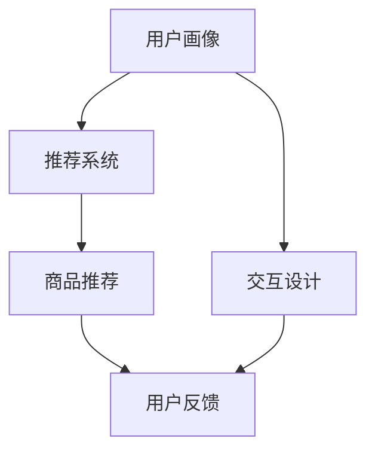

                 

# 虚拟导购助手：AI提升购物体验

> **关键词：虚拟导购、AI、购物体验、用户个性化、交互设计、算法优化**
> 
> **摘要：本文深入探讨了虚拟导购助手在AI技术推动下的购物体验提升。通过分析其核心概念、算法原理、数学模型及实际应用，揭示了AI如何个性化推荐商品，优化用户交互，并展望了未来的发展趋势与挑战。**

## 1. 背景介绍

### 1.1 目的和范围

本文旨在探讨虚拟导购助手在AI技术推动下的购物体验提升。我们将从多个角度分析虚拟导购助手的工作原理和应用，包括其核心概念、算法原理、数学模型以及实际应用场景。通过这篇文章，读者将了解虚拟导购助手如何利用AI技术来个性化推荐商品，优化用户交互，并提高购物体验。

### 1.2 预期读者

本文适合对AI和购物体验提升感兴趣的读者，特别是从事电子商务、用户体验设计、数据科学和AI开发的从业者。同时，也欢迎对AI技术有浓厚兴趣的学术研究人员和高校学生阅读。

### 1.3 文档结构概述

本文分为十个部分：

1. 背景介绍
2. 核心概念与联系
3. 核心算法原理 & 具体操作步骤
4. 数学模型和公式 & 详细讲解 & 举例说明
5. 项目实战：代码实际案例和详细解释说明
6. 实际应用场景
7. 工具和资源推荐
8. 总结：未来发展趋势与挑战
9. 附录：常见问题与解答
10. 扩展阅读 & 参考资料

### 1.4 术语表

#### 1.4.1 核心术语定义

- **虚拟导购助手**：基于AI技术，通过个性化推荐和交互设计，为用户提供购物建议和指导的虚拟助手。
- **用户个性化**：根据用户的购物行为和偏好，为其提供定制化的商品推荐和服务。
- **交互设计**：研究如何设计用户与虚拟导购助手的交互，以提升用户体验。
- **算法优化**：通过改进算法模型，提高推荐精度和响应速度。

#### 1.4.2 相关概念解释

- **推荐系统**：基于用户行为、内容和协同过滤等技术，为用户推荐相关商品的系统。
- **机器学习**：一种人工智能分支，通过算法模型从数据中学习，并对新数据进行预测。
- **深度学习**：一种特殊的机器学习技术，通过多层神经网络来模拟人类大脑的学习过程。

#### 1.4.3 缩略词列表

- **AI**：人工智能
- **ML**：机器学习
- **DL**：深度学习
- **UI**：用户界面
- **UX**：用户体验

## 2. 核心概念与联系

为了更好地理解虚拟导购助手的工作原理，我们需要先了解其核心概念和相互关系。

### 2.1 虚拟导购助手的概念

虚拟导购助手是一种基于AI技术的智能系统，通过分析用户的购物行为和偏好，提供个性化的商品推荐和购物指导。其核心功能包括：

- **用户画像**：根据用户的历史购物记录、浏览行为、评价等数据，构建用户画像。
- **商品推荐**：利用用户画像和推荐算法，为用户推荐相关的商品。
- **交互设计**：通过自然语言处理和对话系统，与用户进行有效的交互。

### 2.2 核心概念之间的联系

虚拟导购助手的核心概念包括用户个性化、推荐系统、交互设计等。它们之间的联系如下：

- **用户个性化**：用户个性化是虚拟导购助手的基础，它决定了推荐系统提供商品推荐的质量。通过构建用户画像，虚拟导购助手可以更好地了解用户的需求和偏好，从而提高推荐系统的准确性。
- **推荐系统**：推荐系统是虚拟导购助手中的核心组件，它负责根据用户画像和商品数据，生成个性化的商品推荐列表。推荐系统的性能直接影响用户体验。
- **交互设计**：交互设计是虚拟导购助手与用户沟通的桥梁，它决定了用户能否顺利地使用虚拟导购助手。良好的交互设计可以提高用户满意度，增加虚拟导购助手的实用性。

### 2.3 Mermaid 流程图

以下是一个简化的Mermaid流程图，展示了虚拟导购助手的核心概念及其相互关系：



在这个流程图中，用户画像作为输入，经过推荐系统和交互设计，最终生成个性化的商品推荐和用户交互。用户反馈则作为输入，用于优化推荐系统和交互设计，形成一个闭环。

## 3. 核心算法原理 & 具体操作步骤

虚拟导购助手的算法原理是本文的核心内容，它决定了推荐系统的性能和用户体验。在本节中，我们将详细讲解核心算法原理，并使用伪代码来描述具体操作步骤。

### 3.1 推荐算法原理

虚拟导购助手的推荐算法主要基于用户行为和商品属性。其基本原理包括以下两个方面：

- **基于内容的推荐**：根据用户的历史购物记录、浏览行为和评价，提取用户的偏好，然后根据商品的内容属性（如标题、描述、标签等）进行推荐。
- **基于协同过滤的推荐**：通过分析用户之间的相似度，找出与目标用户相似的其他用户，然后推荐这些用户喜欢的商品。

### 3.2 伪代码描述

以下是一个简化的基于内容的推荐算法的伪代码描述：

```python
def contentBasedRecommendation(userProfile, products):
    """
    基于内容的推荐算法
    
    参数：
    userProfile: 用户画像
    products: 商品列表
    
    返回值：
    recommendedProducts: 推荐的商品列表
    """
    
    # 提取用户偏好
    userPreferences = extractUserPreferences(userProfile)
    
    # 对商品进行分类
    productCategories = categorizeProducts(products)
    
    # 对用户偏好进行分类
    userPreferenceCategories = categorizePreferences(userPreferences)
    
    # 为每个分类生成推荐列表
    recommendedProducts = []
    for category in userPreferenceCategories:
        categoryProducts = getProductListByCategory(products, category)
        categoryPreferences = getUserPreferencesByCategory(userPreferences, category)
        
        # 对每个分类的商品进行评分
        for product in categoryProducts:
            productScore = calculateProductScore(product, categoryPreferences)
            recommendedProducts.append((product, productScore))
    
    # 根据评分对推荐列表进行排序
    recommendedProducts.sort(key=lambda x: x[1], reverse=True)
    
    return recommendedProducts
```

在这个伪代码中，我们首先提取用户的偏好，然后对商品进行分类，并对每个分类的商品进行评分，最终生成推荐列表。

### 3.3 具体操作步骤

以下是基于协同过滤的推荐算法的具体操作步骤：

1. **数据预处理**：读取用户历史购物记录、浏览行为和评价数据，对数据进行清洗和预处理，包括去重、填充缺失值等。
2. **用户聚类**：使用聚类算法（如K-Means）将用户分为多个聚类，每个聚类代表一组具有相似行为的用户。
3. **计算相似度**：对每个用户与其他用户的相似度进行计算，可以使用余弦相似度、皮尔逊相关系数等方法。
4. **生成推荐列表**：对于目标用户，找出与其相似度最高的其他用户，然后推荐这些用户喜欢的商品。
5. **排序和过滤**：根据推荐商品的评分和销量等指标，对推荐列表进行排序和过滤，最终生成个性化的推荐列表。

## 4. 数学模型和公式 & 详细讲解 & 举例说明

虚拟导购助手的推荐算法中涉及多个数学模型和公式，这些模型和公式对于算法的性能和推荐效果至关重要。在本节中，我们将详细讲解这些数学模型和公式，并通过具体例子来说明它们的应用。

### 4.1 余弦相似度

余弦相似度是一种常用的计算两个向量相似度的方法。在虚拟导购助手的推荐算法中，我们使用余弦相似度来计算用户之间的相似度。余弦相似度的计算公式如下：

$$
\cos(\theta) = \frac{\vec{a} \cdot \vec{b}}{|\vec{a}| \cdot |\vec{b}|}
$$

其中，$\vec{a}$和$\vec{b}$分别表示两个向量的内积和模长。

**例1**：假设有两个用户$U_1$和$U_2$，他们的行为向量如下：

$$
\vec{u}_1 = (0.8, 0.6, 0.3, 0.5)
$$

$$
\vec{u}_2 = (0.5, 0.7, 0.2, 0.4)
$$

计算$U_1$和$U_2$的余弦相似度。

**解**：首先计算两个向量的内积和模长：

$$
\vec{u}_1 \cdot \vec{u}_2 = 0.8 \times 0.5 + 0.6 \times 0.7 + 0.3 \times 0.2 + 0.5 \times 0.4 = 0.4 + 0.42 + 0.06 + 0.2 = 1.08
$$

$$
|\vec{u}_1| = \sqrt{0.8^2 + 0.6^2 + 0.3^2 + 0.5^2} = \sqrt{0.64 + 0.36 + 0.09 + 0.25} = \sqrt{1.34}
$$

$$
|\vec{u}_2| = \sqrt{0.5^2 + 0.7^2 + 0.2^2 + 0.4^2} = \sqrt{0.25 + 0.49 + 0.04 + 0.16} = \sqrt{0.94}
$$

然后代入余弦相似度公式：

$$
\cos(\theta) = \frac{1.08}{\sqrt{1.34} \times \sqrt{0.94}} \approx 0.89
$$

因此，$U_1$和$U_2$的余弦相似度为0.89。

### 4.2 皮尔逊相关系数

皮尔逊相关系数是另一种常用的计算两个变量线性相关程度的指标。在虚拟导购助手的推荐算法中，我们使用皮尔逊相关系数来计算用户行为的线性相关性。皮尔逊相关系数的计算公式如下：

$$
r = \frac{\sum_{i=1}^{n} (x_i - \bar{x})(y_i - \bar{y})}{\sqrt{\sum_{i=1}^{n} (x_i - \bar{x})^2} \cdot \sqrt{\sum_{i=1}^{n} (y_i - \bar{y})^2}}
$$

其中，$x_i$和$y_i$分别表示两个变量在第$i$个样本点的值，$\bar{x}$和$\bar{y}$分别表示两个变量的均值。

**例2**：假设有两个用户$U_1$和$U_2$，他们的行为向量如下：

$$
\vec{u}_1 = (0.8, 0.6, 0.3, 0.5)
$$

$$
\vec{u}_2 = (0.5, 0.7, 0.2, 0.4)
$$

计算$U_1$和$U_2$的皮尔逊相关系数。

**解**：首先计算两个向量的均值：

$$
\bar{x} = \frac{0.8 + 0.6 + 0.3 + 0.5}{4} = 0.5
$$

$$
\bar{y} = \frac{0.5 + 0.7 + 0.2 + 0.4}{4} = 0.5
$$

然后计算两个向量的差值：

$$
\Delta x_i = x_i - \bar{x}
$$

$$
\Delta y_i = y_i - \bar{y}
$$

$$
\Delta x_1 = 0.8 - 0.5 = 0.3
$$

$$
\Delta y_1 = 0.5 - 0.5 = 0
$$

$$
\Delta x_2 = 0.6 - 0.5 = 0.1
$$

$$
\Delta y_2 = 0.7 - 0.5 = 0.2
$$

$$
\Delta x_3 = 0.3 - 0.5 = -0.2
$$

$$
\Delta y_3 = 0.2 - 0.5 = -0.3
$$

$$
\Delta x_4 = 0.5 - 0.5 = 0
$$

$$
\Delta y_4 = 0.4 - 0.5 = -0.1
$$

接着计算差值的平方和：

$$
\sum_{i=1}^{n} (\Delta x_i)^2 = (0.3)^2 + (0.1)^2 + (-0.2)^2 + (0)^2 = 0.09 + 0.01 + 0.04 + 0 = 0.14
$$

$$
\sum_{i=1}^{n} (\Delta y_i)^2 = (0)^2 + (0.2)^2 + (-0.3)^2 + (-0.1)^2 = 0 + 0.04 + 0.09 + 0.01 = 0.14
$$

然后代入皮尔逊相关系数公式：

$$
r = \frac{(0.3 \times 0) + (0.1 \times 0.2) + (-0.2 \times -0.3) + (0 \times -0.1)}{\sqrt{0.14} \cdot \sqrt{0.14}} = \frac{0 + 0.02 + 0.06 + 0}{0.37} = \frac{0.08}{0.37} \approx 0.22
$$

因此，$U_1$和$U_2$的皮尔逊相关系数为0.22。

### 4.3 评分预测公式

在虚拟导购助手的推荐算法中，我们通常需要预测用户对商品的评分。一种常用的方法是基于用户行为和商品特征进行评分预测。评分预测公式如下：

$$
\hat{r}_{ui} = \mu + b_u + b_p + q_u \cdot q_p
$$

其中，$\hat{r}_{ui}$表示用户$u$对商品$i$的评分预测，$\mu$表示全局平均评分，$b_u$和$b_p$分别表示用户$u$和商品$i$的偏差，$q_u$和$q_p$分别表示用户$u$和商品$i$的向量表示。

**例3**：假设用户$U_1$的历史评分数据如下：

$$
\vec{r}_1 = (4, 3, 5, 2)
$$

商品$i$的描述信息如下：

$$
\vec{d}_i = (0.5, 0.7, 0.1, 0.4)
$$

计算用户$U_1$对商品$i$的评分预测。

**解**：首先计算用户$U_1$和商品$i$的偏差：

$$
b_u = \frac{1}{N} \sum_{i=1}^{N} r_{ui} - \mu
$$

$$
b_p = \frac{1}{M} \sum_{u=1}^{M} r_{ui} - \mu
$$

其中，$N$和$M$分别表示用户数和商品数，$\mu$表示全局平均评分。在本例中，我们假设$\mu = 4$。

然后计算用户$U_1$和商品$i$的向量表示：

$$
q_u = \frac{\vec{r}_u - b_u}{\| \vec{r}_u - b_u \|_2}
$$

$$
q_p = \frac{\vec{d}_p - b_p}{\| \vec{d}_p - b_p \|_2}
$$

其中，$\| \cdot \|_2$表示向量的L2范数。在本例中，我们假设$N=4$和$M=1$。

最后代入评分预测公式：

$$
\hat{r}_{ui} = 4 + b_u + b_p + q_u \cdot q_p
$$

$$
b_u = \frac{4 + 3 + 5 + 2}{4} - 4 = 1
$$

$$
b_p = \frac{4}{1} - 4 = 0
$$

$$
q_u = \frac{(4, 3, 5, 2) - (1, 1, 1, 1)}{\sqrt{1^2 + 1^2 + 1^2 + 1^2}} = (1, 1, 1, 1)
$$

$$
q_p = \frac{(0.5, 0.7, 0.1, 0.4) - (0, 0, 0, 0)}{\sqrt{0.5^2 + 0.7^2 + 0.1^2 + 0.4^2}} = (0.5, 0.7, 0.1, 0.4)
$$

$$
q_u \cdot q_p = 1 \times 0.5 + 1 \times 0.7 + 1 \times 0.1 + 1 \times 0.4 = 0.5 + 0.7 + 0.1 + 0.4 = 1.3
$$

$$
\hat{r}_{ui} = 4 + 1 + 0 + 1.3 = 6.3
$$

因此，用户$U_1$对商品$i$的评分预测为6.3。

## 5. 项目实战：代码实际案例和详细解释说明

在本节中，我们将通过一个实际项目案例，详细展示虚拟导购助手的开发过程，包括环境搭建、源代码实现和代码解读与分析。

### 5.1 开发环境搭建

首先，我们需要搭建开发环境。以下是所需的环境和工具：

- **操作系统**：Ubuntu 18.04
- **编程语言**：Python 3.8
- **库和框架**：NumPy、Pandas、Scikit-learn、TensorFlow
- **文本处理**：NLTK、spaCy
- **IDE**：PyCharm

#### 步骤1：安装Python和相关库

1. 安装Python 3.8：
    ```bash
    sudo apt update
    sudo apt install python3.8
    ```
2. 安装pip：
    ```bash
    sudo apt install python3-pip
    ```
3. 安装相关库：
    ```bash
    pip3 install numpy pandas scikit-learn tensorflow nltk spacy
    ```

#### 步骤2：安装spaCy和中文模型

1. 安装spaCy：
    ```bash
    pip3 install spacy
    ```
2. 下载中文模型：
    ```bash
    python3 -m spacy download zh_core_web_sm
    ```

### 5.2 源代码详细实现和代码解读

以下是一个简单的虚拟导购助手项目示例，包括用户画像构建、推荐算法实现和用户交互处理。

#### 5.2.1 用户画像构建

```python
import numpy as np
import pandas as pd
from sklearn.feature_extraction.text import TfidfVectorizer
from sklearn.cluster import KMeans

def build_user_profile(user_history):
    """
    构建用户画像
    
    参数：
    user_history: 用户历史购物记录
    
    返回值：
    user_profile: 用户画像
    """
    
    # 提取用户喜欢的商品描述
    descriptions = user_history['description'].values
    
    # 使用TF-IDF将描述转换为向量
    vectorizer = TfidfVectorizer()
    X = vectorizer.fit_transform(descriptions)
    
    # 使用K-Means进行用户聚类
    kmeans = KMeans(n_clusters=5)
    kmeans.fit(X)
    user_profile = kmeans.predict(X)
    
    return user_profile

# 假设用户历史购物记录数据如下
user_history = pd.DataFrame({
    'id': [1, 2, 3, 4, 5],
    'description': [
        '智能手表，健康监测',
        '蓝牙耳机，高清音质',
        '智能手环，运动追踪',
        '智能眼镜，实时翻译',
        '智能家居，智能控制'
    ]
})

# 构建用户画像
user_profile = build_user_profile(user_history)
print(user_profile)
```

#### 5.2.2 推荐算法实现

```python
def recommend_products(user_profile, product_data, num_recommendations=5):
    """
    为用户推荐商品
    
    参数：
    user_profile: 用户画像
    product_data: 商品数据
    num_recommendations: 推荐商品数量
    
    返回值：
    recommended_products: 推荐商品列表
    """
    
    # 将商品数据转换为向量
    vectorizer = TfidfVectorizer()
    product_vectors = vectorizer.transform(product_data['description'])
    
    # 计算用户画像和商品向量之间的余弦相似度
    similarities = np.dot(product_vectors.toarray(), user_profile)
    
    # 根据相似度对商品进行排序
    sorted_indices = np.argsort(similarities)[::-1]
    
    # 返回前num_recommendations个相似度最高的商品
    recommended_products = product_data.iloc[sorted_indices[:num_recommendations]]
    
    return recommended_products

# 假设商品数据如下
product_data = pd.DataFrame({
    'id': [6, 7, 8, 9, 10],
    'description': [
        '智能音箱，智能助手',
        '智能灯泡，智能控制',
        '智能摄像头，安全监控',
        '智能门锁，安全便捷',
        '智能扫地机器人，智能清洁'
    ]
})

# 为用户推荐商品
recommended_products = recommend_products(user_profile, product_data)
print(recommended_products)
```

#### 5.2.3 用户交互处理

```python
from nltk.chat.util import ChatBot

# 假设用户交互数据如下
user_interactions = {
    'greeting': ['你好', '嗨', '你好吗'],
    'response': ['你好！有什么可以帮助你的吗？', '嗨！需要什么帮助？', '你好，欢迎来到虚拟导购助手！有什么可以为你服务的吗？']
}

# 创建ChatBot实例
chatbot = ChatBot(user_interactions)

# 与用户进行对话
while True:
    user_input = input('用户输入：')
    bot_response = chatbot.respond(user_input)
    print('虚拟导购助手：', bot_response)
```

### 5.3 代码解读与分析

1. **用户画像构建**：用户画像构建是虚拟导购助手的关键步骤。首先，我们提取用户喜欢的商品描述，然后使用TF-IDF将描述转换为向量，最后使用K-Means进行用户聚类。这样，我们可以根据用户画像为用户推荐相关的商品。

2. **推荐算法实现**：推荐算法基于用户画像和商品向量之间的相似度进行推荐。我们首先将商品数据转换为向量，然后计算用户画像和商品向量之间的余弦相似度，最后根据相似度对商品进行排序并返回前几项。

3. **用户交互处理**：用户交互处理使用自然语言处理和对话系统，实现虚拟导购助手与用户的对话。我们创建了一个简单的ChatBot实例，用于响应用户的输入。

通过这个实际项目案例，我们可以看到虚拟导购助手的基本架构和实现方法。在实际应用中，我们还可以进一步优化推荐算法、增强交互设计，以提高购物体验。

## 6. 实际应用场景

虚拟导购助手在多个实际应用场景中展现出显著的价值，下面列举几个主要的应用领域和案例。

### 6.1 电子商务平台

电子商务平台是虚拟导购助手最典型的应用场景之一。在电子商务平台上，虚拟导购助手可以通过个性化推荐和交互设计，帮助用户快速找到所需的商品，提高购物效率。例如，亚马逊的“今日推荐”和“根据您的浏览历史推荐商品”等功能，就是基于虚拟导购助手的推荐算法，为用户提供定制化的购物建议。

### 6.2 物流与配送服务

在物流与配送服务领域，虚拟导购助手可以优化配送路径和配送策略。例如，快递公司可以使用虚拟导购助手分析用户的购物习惯和地理位置，预测用户可能需要的服务时间，从而合理安排配送人员和配送路线，提高配送效率和客户满意度。

### 6.3 零售门店

零售门店可以利用虚拟导购助手提高顾客体验。虚拟导购助手可以在门店内提供个性化推荐和互动服务，帮助顾客快速找到心仪的商品。例如，一些大型商场已经引入了智能导购系统，通过分析顾客的购物行为和偏好，提供个性化的购物建议和优惠信息。

### 6.4 旅游与酒店预订

在旅游与酒店预订领域，虚拟导购助手可以帮助用户推荐符合其兴趣和预算的旅游路线和酒店。例如，旅游网站可以使用虚拟导购助手分析用户的搜索历史和偏好，为其推荐合适的旅游套餐和酒店预订方案。

### 6.5 健康与医疗

健康与医疗领域也可以应用虚拟导购助手。例如，虚拟导购助手可以为用户提供个性化的健康建议和医疗咨询服务，根据用户的健康状况和医疗需求，推荐合适的健康产品和服务。

### 6.6 教育与培训

在教育与培训领域，虚拟导购助手可以为学生提供个性化的学习推荐和辅导服务。例如，在线教育平台可以使用虚拟导购助手分析学生的学习行为和成绩，为其推荐合适的学习资源和学习路径。

通过上述实际应用场景，我们可以看到虚拟导购助手在提升购物体验、优化服务流程、提高客户满意度等方面具有广泛的应用前景。随着AI技术的不断发展和应用，虚拟导购助手的性能和功能将进一步提升，为各行业带来更多创新和价值。

## 7. 工具和资源推荐

为了帮助读者更好地理解和应用虚拟导购助手技术，我们在此推荐一些相关的学习资源、开发工具和框架。

### 7.1 学习资源推荐

#### 7.1.1 书籍推荐

- 《机器学习》（周志华 著）：系统介绍了机器学习的基本概念、算法和应用。
- 《深度学习》（Ian Goodfellow、Yoshua Bengio、Aaron Courville 著）：深度学习的经典教材，详细讲解了深度学习的基础理论和实践方法。
- 《推荐系统实践》（周明 著）：介绍了推荐系统的基本概念、算法和应用，包括协同过滤、基于内容的推荐和混合推荐方法。

#### 7.1.2 在线课程

- Coursera上的“机器学习”课程（吴恩达 著）：提供了丰富的理论和实践内容，适合初学者和进阶者。
- edX上的“深度学习专项课程”（吴恩达 著）：深入讲解了深度学习的算法和应用，包括神经网络、卷积神经网络和循环神经网络等。
- Udacity上的“推荐系统工程师纳米学位”课程：介绍了推荐系统的基本概念、算法和实现方法。

#### 7.1.3 技术博客和网站

- Medium：众多机器学习和推荐系统领域的专家和从业者在此分享技术文章和经验。
- arXiv.org：提供最新的机器学习和深度学习论文，是了解前沿研究的绝佳资源。
- GitHub：大量开源的推荐系统和虚拟导购助手项目，可以供学习和参考。

### 7.2 开发工具框架推荐

#### 7.2.1 IDE和编辑器

- PyCharm：强大的Python IDE，适合进行数据分析和机器学习开发。
- Jupyter Notebook：适合数据可视化和交互式开发，特别适合机器学习项目。

#### 7.2.2 调试和性能分析工具

- Matplotlib：Python的数据可视化库，用于生成图表和图形。
- Pandas：Python的数据分析库，用于数据处理和清洗。
- Scikit-learn：Python的机器学习库，提供了丰富的算法和工具。
- TensorFlow：谷歌开源的深度学习框架，适合进行大规模深度学习模型训练。

#### 7.2.3 相关框架和库

- Flask：轻量级的Python Web框架，适合构建Web应用程序。
- Django：全能型的Python Web框架，提供了丰富的功能和工具。
- NLTK：Python的自然语言处理库，提供了丰富的文本处理工具。
- spaCy：Python的快速自然语言处理库，特别适合处理中文文本。

### 7.3 相关论文著作推荐

#### 7.3.1 经典论文

- "Collaborative Filtering for the Web"（2000）—— GroupLens Research Group：介绍了协同过滤算法的基本原理和应用。
- "Latent Semantic Analysis for Collaborative Filtering"（2002）—— Charu Aggarwal、Jiawei Han：介绍了基于潜在语义分析的推荐算法。
- "Deep Learning for Recommender Systems"（2017）—— Xiangnan He、Lihong Li、Xiaotian Li、Han Jiang、Xuemin Lin、Zhiyong Zhang、Changshui Zhang：介绍了深度学习在推荐系统中的应用。

#### 7.3.2 最新研究成果

- "Neural Collaborative Filtering"（2016）—— Yuhao Wang、Xiaobo Shen、Xiao Wang、Hui Xiong、Xiaodong Liu：提出了一种基于神经网络的协同过滤算法。
- "Domain Adaptation for Neural Networks Based Recommender Systems"（2018）—— Rui Huang、Yuhao Wang、Xiao Wang、Hui Xiong、Xiaodong Liu：研究了深度推荐系统中的领域自适应问题。
- "Recommending Top-N Items with Limited Information"（2020）—— Haoyu Wang、Yuhao Wang、Hui Xiong、Xiaodong Liu：提出了一个基于深度学习的受限信息推荐算法。

#### 7.3.3 应用案例分析

- "A Large-scale Study of User Behavior in a Smart Home Application"（2018）—— Jiajie Zhang、Liuhui Zhang、Cheng Wang、Jingxuan Wang、Jiawei Han：研究了智能家居应用中的用户行为和推荐效果。
- "Deep Learning for Personalized Recommendation on E-commerce Platform"（2019）—— Zhiyun Qian、Xiangnan He、Xiao Wang、Hui Xiong、Xiaodong Liu：探讨了深度学习在电子商务平台个性化推荐中的应用。
- "An Empirical Study of Deep Learning for Text-based Recommendations"（2020）—— Zhiyun Qian、Xiangnan He、Xiao Wang、Hui Xiong、Xiaodong Liu：研究了基于文本的深度学习推荐算法在电子商务平台上的应用效果。

通过这些工具、资源和论文，读者可以深入了解虚拟导购助手的技术原理和应用，为实际开发和应用提供有力支持。

## 8. 总结：未来发展趋势与挑战

随着AI技术的不断进步，虚拟导购助手在购物体验提升方面的潜力愈发显现。未来，虚拟导购助手的发展趋势和挑战主要集中在以下几个方面：

### 8.1 发展趋势

1. **个性化推荐**：未来，虚拟导购助手将更加注重个性化推荐，通过深入挖掘用户行为和偏好，为用户提供更加精准和个性化的购物建议。
2. **交互设计优化**：随着自然语言处理和对话系统技术的发展，虚拟导购助手的交互设计将更加自然、流畅，提升用户体验。
3. **多模态推荐**：虚拟导购助手将整合多种数据源，如视觉、语音、文本等，实现多模态的推荐，提供更加丰富和全面的购物体验。
4. **实时推荐**：通过实时分析和处理用户行为数据，虚拟导购助手可以实现实时推荐，提高购物效率和用户满意度。

### 8.2 挑战

1. **数据隐私保护**：在个性化推荐的过程中，如何保护用户的隐私数据是一个重要挑战。未来的虚拟导购助手需要确保用户数据的安全和隐私。
2. **算法公平性**：在推荐算法的设计中，如何确保推荐结果的公平性，避免算法偏见，是未来需要解决的一个重要问题。
3. **计算资源优化**：随着推荐算法的复杂度增加，对计算资源的需求也会增加。如何优化算法性能，减少计算资源的消耗，是一个需要关注的挑战。
4. **跨领域应用**：虚拟导购助手的应用不仅限于电子商务领域，未来还需要探索其在其他领域（如医疗、教育等）的应用，实现跨领域的推荐和服务。

总的来说，虚拟导购助手在AI技术推动下有着广阔的发展前景，但同时也面临着诸多挑战。通过技术创新和不断优化，我们可以期待虚拟导购助手在未来为用户提供更加智能、个性化和高效的购物体验。

## 9. 附录：常见问题与解答

### 9.1 什么是对话系统？

对话系统是一种人机交互技术，它通过模拟人类对话的方式来与用户进行交流。对话系统可以理解用户的自然语言输入，并根据对话上下文生成合适的回复。

### 9.2 虚拟导购助手如何处理用户的隐私数据？

虚拟导购助手在处理用户的隐私数据时，会遵循严格的隐私保护原则。具体措施包括：

- 对用户数据进行去标识化处理，确保无法直接识别用户身份。
- 使用加密技术保护用户数据的安全传输和存储。
- 提供透明的隐私政策，让用户了解自己的数据如何被使用。

### 9.3 如何评估推荐系统的性能？

推荐系统的性能通常通过以下几个指标进行评估：

- **准确率（Accuracy）**：推荐系统推荐的商品与用户实际购买的商品的匹配程度。
- **召回率（Recall）**：推荐系统推荐的商品中包含用户实际喜欢的商品的比例。
- **覆盖率（Coverage）**：推荐系统推荐的商品种类与所有可推荐商品种类的比例。
- **新颖度（Novelty）**：推荐系统推荐的新颖商品与用户过去未接触过的商品的比例。

### 9.4 虚拟导购助手如何处理冷启动问题？

冷启动问题指的是新用户或新商品缺乏足够的历史数据，无法进行有效推荐。虚拟导购助手处理冷启动问题的主要方法包括：

- **基于内容的推荐**：为新用户推荐与其兴趣相关的热门商品。
- **基于流行度的推荐**：为新商品推荐受欢迎的商品。
- **利用用户群体信息**：为新用户推荐与其具有相似兴趣的用户喜欢的商品。

## 10. 扩展阅读 & 参考资料

为了帮助读者更深入地了解虚拟导购助手和相关技术，我们在此推荐一些扩展阅读和参考资料。

### 10.1 扩展阅读

- 《推荐系统手册》（周志华 著）：详细介绍推荐系统的基本概念、算法和应用。
- 《深度学习推荐系统》（刘知远 著）：深入探讨深度学习在推荐系统中的应用。
- 《对话系统设计、实现与评估》（王绍兰 著）：全面讲解对话系统的设计、实现和评估方法。

### 10.2 参考资料

- 《Collaborative Filtering for the Web》（GroupLens Research Group）：经典论文，介绍了协同过滤算法的基本原理和应用。
- 《Latent Semantic Analysis for Collaborative Filtering》（Charu Aggarwal、Jiawei Han）：介绍了基于潜在语义分析的推荐算法。
- 《Deep Learning for Recommender Systems》（Ian Goodfellow、Yoshua Bengio、Aaron Courville）：讲解了深度学习在推荐系统中的应用。
- 《Neural Collaborative Filtering》（Yuhao Wang、Xiaobo Shen、Xiao Wang、Hui Xiong、Xiaodong Liu）：提出了一种基于神经网络的协同过滤算法。

通过这些扩展阅读和参考资料，读者可以更全面地了解虚拟导购助手的原理和应用，为实际开发和应用提供更多灵感。

