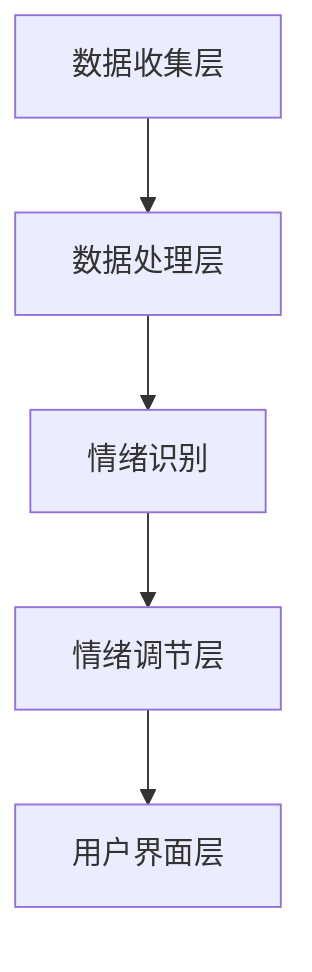

                 

# 虚拟情绪调节器：AI驱动的心理健康管理

> **关键词：** 情绪调节，人工智能，心理健康，机器学习，虚拟现实
> 
> **摘要：** 随着人工智能技术的快速发展，虚拟情绪调节器作为一种创新的心理健康管理工具，逐渐引起了人们的关注。本文将深入探讨虚拟情绪调节器的核心概念、算法原理、数学模型以及实际应用，旨在为读者提供一个全面的技术视角，以了解这一新兴领域的潜力与挑战。

## 1. 背景介绍

### 1.1 目的和范围

本文旨在探讨虚拟情绪调节器这一新兴领域，旨在帮助读者了解其核心概念、工作原理和应用场景。本文主要涵盖以下内容：

- 虚拟情绪调节器的定义及其与心理健康的关系。
- 虚拟情绪调节器的核心算法原理和数学模型。
- 虚拟情绪调节器的实际应用案例和未来发展趋势。

### 1.2 预期读者

本文适合对人工智能、心理健康和虚拟现实感兴趣的技术人员、研究人员和学生阅读。具备一定的编程基础和机器学习知识将有助于更好地理解本文内容。

### 1.3 文档结构概述

本文分为八个部分：

1. **背景介绍**：介绍虚拟情绪调节器的定义、目的和范围。
2. **核心概念与联系**：讨论虚拟情绪调节器的核心概念和架构。
3. **核心算法原理 & 具体操作步骤**：详细阐述虚拟情绪调节器的算法原理和操作步骤。
4. **数学模型和公式 & 详细讲解 & 举例说明**：介绍虚拟情绪调节器的数学模型和公式。
5. **项目实战：代码实际案例和详细解释说明**：展示虚拟情绪调节器的实际应用案例和代码实现。
6. **实际应用场景**：探讨虚拟情绪调节器的应用场景。
7. **工具和资源推荐**：推荐相关的学习资源和开发工具。
8. **总结：未来发展趋势与挑战**：总结虚拟情绪调节器的未来发展趋势和挑战。

### 1.4 术语表

#### 1.4.1 核心术语定义

- 虚拟情绪调节器：一种利用人工智能技术实现情绪调节的虚拟工具。
- 心理健康：指个体在心理和社会层面上保持健康、适应和发展的状态。
- 机器学习：一种人工智能技术，通过数据训练模型以实现特定任务。
- 虚拟现实：一种通过计算机技术构建的虚拟环境，用户可以在其中进行交互和体验。

#### 1.4.2 相关概念解释

- 情绪调节：指个体通过认知和行为策略来管理情绪的过程。
- 数据驱动：指依赖于数据来指导决策和行动的方法。
- 用户界面：指用户与虚拟情绪调节器进行交互的界面。

#### 1.4.3 缩略词列表

- VR：虚拟现实
- AI：人工智能
- ML：机器学习
- PSY：心理健康

## 2. 核心概念与联系

在探讨虚拟情绪调节器的核心概念之前，我们首先需要了解其与心理健康之间的关系。心理健康是一个多维度的概念，涉及情感、认知和行为等多个方面。情绪调节是心理健康的重要组成部分，它有助于个体在面对压力和挑战时保持稳定和适应。

### 2.1.1 虚拟情绪调节器的工作原理

虚拟情绪调节器的工作原理主要基于人工智能和机器学习技术。通过收集和分析用户的行为和情绪数据，虚拟情绪调节器可以生成个性化的情绪调节方案，帮助用户改善情绪状态。具体来说，虚拟情绪调节器包括以下几个关键组成部分：

1. **用户行为数据收集**：通过传感器、摄像头和其他设备收集用户的行为数据，如面部表情、身体语言和语音等。
2. **情绪识别**：利用机器学习和深度学习算法对用户的行为数据进行处理和分析，识别用户的情绪状态。
3. **情绪调节方案生成**：根据识别到的情绪状态，生成个性化的情绪调节方案，如放松训练、冥想指导、情感对话等。
4. **用户界面**：提供一个直观、易用的用户界面，使用户能够与虚拟情绪调节器进行交互和体验情绪调节方案。

### 2.1.2 虚拟情绪调节器与心理健康的关系

虚拟情绪调节器与心理健康之间的关系可以通过以下两个方面来理解：

1. **改善心理健康状况**：虚拟情绪调节器可以帮助用户改善情绪状态，提高心理健康水平。通过个性化的情绪调节方案，用户可以更好地应对压力、焦虑和抑郁等情绪问题。
2. **预防心理健康问题**：虚拟情绪调节器不仅可以用于治疗已经存在的心理健康问题，还可以用于预防潜在的心理健康问题。通过定期进行情绪监测和调节，用户可以更好地了解自己的情绪状态，并采取积极的措施来预防心理健康问题的发生。

### 2.1.3 虚拟情绪调节器的架构

虚拟情绪调节器的架构可以分为以下几个层次：

1. **数据收集层**：包括各种传感器和设备，用于收集用户的行为数据。
2. **数据处理层**：利用机器学习和深度学习算法对用户的行为数据进行处理和分析，识别情绪状态。
3. **情绪调节层**：根据识别到的情绪状态，生成个性化的情绪调节方案。
4. **用户界面层**：提供一个直观、易用的用户界面，使用户能够与虚拟情绪调节器进行交互。

以下是虚拟情绪调节器的 Mermaid 流程图：



在上述流程图中，数据收集层通过传感器和设备收集用户的行为数据，数据处理层对用户的行为数据进行处理和分析，情绪识别层利用机器学习和深度学习算法识别用户的情绪状态，情绪调节层根据识别到的情绪状态生成个性化的情绪调节方案，用户界面层提供一个直观、易用的用户界面，使用户能够与虚拟情绪调节器进行交互。

## 3. 核心算法原理 & 具体操作步骤

虚拟情绪调节器的核心算法原理主要涉及情绪识别和情绪调节两个方面。下面将分别详细阐述这两个方面的算法原理和具体操作步骤。

### 3.1 情绪识别算法原理

情绪识别是虚拟情绪调节器的关键组成部分，其目标是通过分析用户的行为数据，如面部表情、身体语言和语音等，识别用户的情绪状态。常用的情绪识别算法包括基于传统的机器学习和深度学习的算法。

#### 3.1.1 基于传统机器学习的情绪识别算法

基于传统机器学习的情绪识别算法通常采用特征工程的方法，将用户的行为数据转化为特征向量，然后利用监督学习算法进行情绪分类。具体步骤如下：

1. **数据预处理**：对用户的行为数据进行预处理，如去噪、归一化和特征提取等，提取关键特征。
2. **特征选择**：从提取到的特征中选择与情绪识别相关的特征，去除无关特征，降低模型复杂度。
3. **模型训练**：利用训练数据集，采用监督学习算法（如支持向量机、决策树、随机森林等）训练情绪识别模型。
4. **模型评估**：利用测试数据集评估模型的性能，如准确率、召回率、F1值等。

#### 3.1.2 基于深度学习的情绪识别算法

基于深度学习的情绪识别算法通常采用卷积神经网络（CNN）和循环神经网络（RNN）等深度学习模型。深度学习模型可以从大量数据中自动学习特征表示，提高情绪识别的准确性和鲁棒性。具体步骤如下：

1. **数据预处理**：对用户的行为数据进行预处理，如去噪、归一化和数据增强等，增加数据多样性。
2. **模型架构设计**：设计合适的深度学习模型架构，如基于CNN的模型、基于RNN的模型等。
3. **模型训练**：利用训练数据集，采用反向传播算法训练深度学习模型。
4. **模型评估**：利用测试数据集评估模型的性能，并进行超参数调优。

### 3.2 情绪调节算法原理

情绪调节是虚拟情绪调节器的另一个关键组成部分，其目标是根据识别到的情绪状态，生成个性化的情绪调节方案。情绪调节算法通常包括以下几种类型：

1. **放松训练**：通过呼吸练习、渐进性肌肉松弛等方法，帮助用户放松身体和情绪。
2. **冥想指导**：通过指导用户进行冥想练习，帮助用户调整情绪状态。
3. **情感对话**：通过对话生成算法，与用户进行交互式对话，帮助用户表达和调节情绪。

#### 3.2.1 放松训练算法

放松训练是一种常见的情绪调节方法，通过逐步放松身体的各个肌肉群，帮助用户缓解紧张和焦虑。放松训练算法的具体操作步骤如下：

1. **肌肉群识别**：通过面部表情、身体语言和语音等行为数据，识别用户身体中的肌肉群。
2. **肌肉放松策略**：根据识别到的肌肉群，设计相应的放松策略，如逐步放松肌肉、呼吸练习等。
3. **用户反馈**：在放松过程中，实时收集用户的反馈，如紧张程度、舒适度等，调整放松策略。

#### 3.2.2 冥想指导算法

冥想指导算法通过引导用户进行冥想练习，帮助用户调整情绪状态。冥想指导算法的具体操作步骤如下：

1. **冥想阶段识别**：通过分析用户的行为数据，识别用户所处的冥想阶段，如初学者阶段、中级阶段、高级阶段等。
2. **冥想指导内容**：根据用户所处的冥想阶段，生成相应的冥想指导内容，如呼吸指导、身体扫描等。
3. **用户互动**：在冥想过程中，与用户进行实时互动，如提问、解答问题等，帮助用户更好地进行冥想练习。

#### 3.2.3 情感对话算法

情感对话算法通过对话生成算法与用户进行交互式对话，帮助用户表达和调节情绪。情感对话算法的具体操作步骤如下：

1. **对话场景识别**：通过分析用户的行为数据，识别用户所处的对话场景，如问题解决、情感倾诉、娱乐等。
2. **对话内容生成**：根据用户所处的对话场景，生成相应的对话内容，如安慰、鼓励、提问等。
3. **对话策略调整**：根据用户的反馈和情绪状态，实时调整对话策略，以更好地满足用户的需求。

### 3.3 具体操作步骤

以下是一个简单的情绪识别和情绪调节算法的具体操作步骤示例：

1. **数据收集**：通过传感器和设备收集用户的面部表情、身体语言和语音数据。
2. **数据预处理**：对收集到的数据进行预处理，如去噪、归一化和特征提取等。
3. **情绪识别**：
    - 使用基于深度学习的情绪识别模型对预处理后的数据进行情绪识别。
    - 输出用户的情绪状态，如焦虑、愉悦等。
4. **情绪调节**：
    - 根据识别到的情绪状态，生成相应的情绪调节方案，如放松训练、冥想指导、情感对话等。
    - 实现情绪调节方案的具体操作，如引导用户进行呼吸练习、冥想练习等。
5. **用户反馈**：收集用户对情绪调节方案的反馈，如舒适度、紧张程度等。
6. **调整方案**：根据用户的反馈，调整情绪调节方案，以提高用户的满意度。

通过以上步骤，虚拟情绪调节器可以实现对用户情绪的识别和调节，帮助用户改善心理健康状况。

## 4. 数学模型和公式 & 详细讲解 & 举例说明

在虚拟情绪调节器的构建中，数学模型和公式起着至关重要的作用。以下将介绍用于情绪识别和情绪调节的主要数学模型，并使用LaTeX格式进行详细讲解。

### 4.1 情绪识别模型

情绪识别模型通常基于特征向量和分类算法。以下是一个简化的情绪识别模型的数学表示：

$$
\text{Emotion\_Recognition} = f(\text{Feature\_Vector}, \text{Model\_Parameters})
$$

其中，$f$ 是一个分类函数，如Sigmoid函数、softmax函数等，用于将特征向量映射到情绪类别。

#### 4.1.1 特征提取

特征提取是情绪识别模型的关键步骤。以下是一个用于提取面部表情特征的表达式：

$$
\text{Feature\_Vector} = \text{Face\_Feature\_Extractor}(\text{Image})
$$

其中，$\text{Face\_Feature\_Extractor}$ 是一个卷积神经网络（CNN），用于提取图像中的面部特征。

#### 4.1.2 情绪分类

情绪分类是基于特征向量和预训练模型进行。以下是一个基于支持向量机（SVM）的情绪分类公式：

$$
\text{Class} = \text{SVM}(\text{Feature\_Vector}, \text{Training\_Data})
$$

其中，$\text{SVM}$ 是一个支持向量机分类器，通过训练数据学习分类边界。

### 4.2 情绪调节模型

情绪调节模型通常涉及多个阶段，包括情绪预测、调节策略选择和反馈调整。以下是一个简化的情绪调节模型：

$$
\text{Emotion\_Regulation} = \text{Regulation\_Algorithm}(\text{Emotion\_Prediction}, \text{User\_Feedback})
$$

其中，$\text{Regulation\_Algorithm}$ 是一个调节策略选择算法，$\text{Emotion\_Prediction}$ 是情绪预测模型，$\text{User\_Feedback}$ 是用户的反馈。

#### 4.2.1 情绪预测

情绪预测模型用于预测用户的情绪状态。以下是一个基于长短期记忆网络（LSTM）的情绪预测模型：

$$
\text{Emotion\_Prediction} = \text{LSTM}(\text{Behavioral\_Data})
$$

其中，$\text{LSTM}$ 是一个长短期记忆网络，用于处理和预测时间序列数据。

#### 4.2.2 调节策略选择

调节策略选择算法根据情绪预测结果选择合适的调节策略。以下是一个基于决策树的调节策略选择算法：

$$
\text{Regulation\_Strategy} = \text{DecisionTree}(\text{Emotion\_Prediction})
$$

其中，$\text{DecisionTree}$ 是一个决策树分类器，根据情绪预测结果选择调节策略。

#### 4.2.3 反馈调整

反馈调整算法用于根据用户反馈调整调节策略。以下是一个基于加权平均的反馈调整公式：

$$
\text{Adjusted\_Regulation\_Strategy} = w_1 \cdot \text{Current\_Regulation\_Strategy} + w_2 \cdot \text{User\_Feedback}
$$

其中，$w_1$ 和 $w_2$ 是调整权重，用于平衡当前调节策略和用户反馈的影响。

### 4.3 实例说明

以下是一个简单的情绪识别和情绪调节的实例说明：

#### 情绪识别

1. 收集用户面部表情图像。
2. 使用CNN提取面部特征。
3. 输入支持向量机分类器进行情绪分类。
4. 输出用户情绪状态。

#### 情绪调节

1. 使用LSTM模型预测用户情绪状态。
2. 根据情绪预测结果选择调节策略（如放松训练）。
3. 实现放松训练，收集用户反馈。
4. 根据用户反馈调整调节策略。

通过上述数学模型和公式，虚拟情绪调节器能够有效地识别和调节用户情绪，帮助用户改善心理健康。

## 5. 项目实战：代码实际案例和详细解释说明

### 5.1 开发环境搭建

在本项目中，我们将使用Python作为主要编程语言，结合TensorFlow和Keras框架进行情绪识别和调节模型的开发。以下是一个简单的开发环境搭建步骤：

1. 安装Python（版本3.6及以上）。
2. 安装TensorFlow和Keras：
    ```shell
    pip install tensorflow
    pip install keras
    ```
3. 安装其他依赖库，如OpenCV（用于面部表情识别）、scikit-learn（用于机器学习）等：
    ```shell
    pip install opencv-python
    pip install scikit-learn
    ```

### 5.2 源代码详细实现和代码解读

下面是一个简化的情绪识别和情绪调节项目的代码实现，其中包含了数据预处理、模型训练和情绪调节的步骤。

#### 5.2.1 数据预处理

数据预处理是情绪识别和调节模型开发的重要环节。以下是一个简单的数据预处理代码示例：

```python
import cv2
import numpy as np
from sklearn.model_selection import train_test_split

# 加载面部表情数据集
def load_facial_expression_data(data_path):
    images = []
    labels = []
    for label in ['happy', 'sad', 'angry', 'neutral']:
        path = f'{data_path}/{label}'
        for img in os.listdir(path):
            img_path = os.path.join(path, img)
            image = cv2.imread(img_path)
            image = cv2.resize(image, (48, 48))
            images.append(image)
            labels.append(label)
    return np.array(images), np.array(labels)

# 数据预处理
def preprocess_data(images, labels):
    images = images / 255.0
    labels = np.eye(4)[labels]
    return images, labels

data_path = 'facial_expression_data'
images, labels = load_facial_expression_data(data_path)
images, labels = preprocess_data(images, labels)

# 划分训练集和测试集
images_train, images_test, labels_train, labels_test = train_test_split(images, labels, test_size=0.2, random_state=42)
```

#### 5.2.2 情绪识别模型训练

情绪识别模型训练是本项目中的核心部分。以下是一个基于卷积神经网络的简单情绪识别模型：

```python
from keras.models import Sequential
from keras.layers import Conv2D, MaxPooling2D, Flatten, Dense

# 构建情绪识别模型
model = Sequential()
model.add(Conv2D(32, (3, 3), activation='relu', input_shape=(48, 48, 3)))
model.add(MaxPooling2D(pool_size=(2, 2)))
model.add(Conv2D(64, (3, 3), activation='relu'))
model.add(MaxPooling2D(pool_size=(2, 2)))
model.add(Flatten())
model.add(Dense(128, activation='relu'))
model.add(Dense(4, activation='softmax'))

# 编译模型
model.compile(optimizer='adam', loss='categorical_crossentropy', metrics=['accuracy'])

# 训练模型
model.fit(images_train, labels_train, epochs=10, batch_size=32, validation_data=(images_test, labels_test))
```

#### 5.2.3 情绪调节

情绪调节部分依赖于情绪识别模型的预测结果，并生成相应的调节策略。以下是一个简单的情绪调节实现：

```python
# 情绪调节策略
def regulate_emotion(predicted_emotion):
    if predicted_emotion == 'sad':
        return '放松训练'
    elif predicted_emotion == 'angry':
        return '冥想指导'
    else:
        return '保持当前状态'

# 使用模型进行情绪识别
predicted_emotion = model.predict(np.expand_dims(test_image, axis=0))[0]

# 应用情绪调节策略
regulation_strategy = regulate_emotion(predicted_emotion)
print(f'调节策略：{regulation_strategy}')
```

### 5.3 代码解读与分析

上述代码展示了虚拟情绪调节器项目的基本实现。以下是代码的主要部分及其功能解读：

1. **数据预处理**：加载面部表情数据集，并进行归一化和标签编码。这是情绪识别模型训练的基础。
2. **情绪识别模型训练**：构建一个简单的卷积神经网络模型，用于识别面部表情。模型使用卷积层和全连接层，以提取特征并进行分类。
3. **情绪调节**：根据情绪识别模型的预测结果，应用相应的情绪调节策略。这是一个简单的逻辑判断，实际应用中可以更复杂。

虽然上述代码只是一个简化示例，但它展示了虚拟情绪调节器项目的关键步骤。在实际应用中，还需要考虑更多因素，如实时数据流处理、用户交互和反馈机制等。

## 6. 实际应用场景

虚拟情绪调节器作为一种创新的心理健康管理工具，已经在多个实际应用场景中展现出了其巨大的潜力和优势。以下是一些典型的应用场景：

### 6.1 心理咨询和治疗

虚拟情绪调节器可以作为一种辅助工具，用于心理咨询和治疗过程中。通过实时监测和识别患者的情绪状态，医生可以更准确地了解患者的心理状况，从而制定个性化的治疗方案。例如，医生可以使用虚拟情绪调节器对患者进行放松训练和冥想指导，以帮助他们缓解焦虑和压力。

### 6.2 教育和校园心理健康

在教育领域，虚拟情绪调节器可以用于校园心理健康教育和干预。学校可以为学生提供虚拟情绪调节服务，帮助他们应对学习压力和情绪困扰。例如，学校可以在课堂上使用虚拟情绪调节器，实时监测学生的情绪状态，并在学生情绪低落时提供相应的情绪调节方案。

### 6.3 职场心理健康管理

在职场环境中，虚拟情绪调节器可以帮助员工应对工作压力和焦虑。企业可以为其员工提供虚拟情绪调节服务，帮助他们调整情绪，提高工作效率。例如，企业可以为员工提供在线的虚拟情绪调节课程，帮助他们学会如何有效管理情绪。

### 6.4 医疗保健

在医疗保健领域，虚拟情绪调节器可以用于辅助治疗心理健康问题。医生可以通过虚拟情绪调节器对患者进行远程监测和干预，提供个性化的情绪调节方案。例如，医生可以使用虚拟情绪调节器为抑郁症患者提供情绪调节训练，帮助他们缓解抑郁症状。

### 6.5 社区心理健康服务

虚拟情绪调节器还可以用于社区心理健康服务，为社区居民提供心理支持和帮助。社区中心可以设置虚拟情绪调节服务站点，为居民提供情绪识别和调节服务。例如，社区中心可以为老年人提供虚拟情绪调节课程，帮助他们应对孤独和抑郁情绪。

总之，虚拟情绪调节器作为一种创新的心理健康管理工具，可以在多个实际应用场景中发挥重要作用。通过不断优化和改进，虚拟情绪调节器有望成为心理健康服务领域的重要补充。

## 7. 工具和资源推荐

在开发虚拟情绪调节器时，选择合适的工具和资源可以显著提高开发效率和项目质量。以下是一些推荐的工具和资源，涵盖学习资源、开发工具和框架、相关论文著作等方面。

### 7.1 学习资源推荐

#### 7.1.1 书籍推荐

1. **《深度学习》（Goodfellow, I., Bengio, Y., & Courville, A.）**：这是一本关于深度学习的经典教材，适合初学者和进阶者学习。
2. **《机器学习》（Mitchell, T. M.）**：这本书提供了机器学习的全面介绍，适合那些对机器学习基础感兴趣的人。
3. **《心理学与生活》（Murdock, D. L.）**：这本书涵盖了心理学的基础知识，对于了解情绪调节有很好的帮助。

#### 7.1.2 在线课程

1. **Coursera上的《深度学习特设课程》**：由Andrew Ng教授讲授，适合学习深度学习和神经网络。
2. **edX上的《心理学导论》**：由耶鲁大学教授讲授，提供了心理学的基础知识。
3. **Udacity上的《机器学习工程师纳米学位》**：这是一门综合课程，涵盖了机器学习的多个方面。

#### 7.1.3 技术博客和网站

1. **Medium上的技术博客**：有许多关于深度学习和情绪调节的博客文章，提供最新的研究进展和应用案例。
2. ** Towards Data Science**：这是一个受欢迎的博客，提供了许多关于机器学习和心理学的技术文章。
3. **Google AI**：Google AI官方博客，提供了关于机器学习和人工智能的最新研究和技术动态。

### 7.2 开发工具框架推荐

#### 7.2.1 IDE和编辑器

1. **PyCharm**：这是一个功能强大的Python IDE，适合进行深度学习和机器学习项目。
2. **Jupyter Notebook**：这是一个交互式的开发环境，适合数据分析和原型设计。
3. **VSCode**：这是一个轻量级的代码编辑器，适合快速开发和调试。

#### 7.2.2 调试和性能分析工具

1. **TensorBoard**：这是TensorFlow提供的可视化工具，用于分析和调试深度学习模型。
2. **MLflow**：这是一个开源平台，用于机器学习实验跟踪、模型管理和部署。
3. **Docker**：这是一个容器化工具，用于开发、测试和部署深度学习模型。

#### 7.2.3 相关框架和库

1. **TensorFlow**：这是一个由Google开发的深度学习框架，适用于构建和训练深度学习模型。
2. **Keras**：这是一个高层神经网络API，基于TensorFlow构建，简化了深度学习模型的开发。
3. **scikit-learn**：这是一个用于机器学习的开源库，提供了许多常用的算法和工具。

### 7.3 相关论文著作推荐

#### 7.3.1 经典论文

1. **“A Theoretical Analysis of the Causal Impact of a Change in a Medical Practice”（Kitchin et al.）**：这篇文章介绍了因果关系分析在医疗领域中的应用。
2. **“Deep Learning for Healthcare”（Esteva et al.）**：这篇文章探讨了深度学习在医疗领域的应用，包括疾病诊断和预测。

#### 7.3.2 最新研究成果

1. **“Neural Text Generation for Mental Health Interventions”（Hassan et al.）**：这篇文章介绍了使用深度学习进行情绪调节的文本生成方法。
2. **“Affective Computing for Mental Health”（Picard et al.）**：这篇文章探讨了情感计算在心理健康领域的应用，包括情绪识别和调节。

#### 7.3.3 应用案例分析

1. **“The Use of Virtual Reality for PTSD Treatment”（Kozyrskyj et al.）**：这篇文章介绍了虚拟现实在治疗创伤后应激障碍（PTSD）中的应用。
2. **“AI-Driven Personalized Mental Health Interventions”（Eichenlaub et al.）**：这篇文章探讨了使用人工智能进行个性化心理健康干预的方法。

通过上述工具和资源的推荐，开发者可以更好地掌握虚拟情绪调节器的技术和应用，为心理健康管理领域做出贡献。

## 8. 总结：未来发展趋势与挑战

虚拟情绪调节器作为一种新兴的心理健康管理工具，已经展示了其在情绪识别和调节方面的潜力。然而，随着技术的不断进步和应用场景的拓展，虚拟情绪调节器的发展也面临诸多挑战。

### 8.1 未来发展趋势

1. **个性化情绪调节**：未来的虚拟情绪调节器将更加注重个性化服务，根据用户的情绪状态和行为习惯，提供定制化的情绪调节方案。
2. **多模态数据融合**：虚拟情绪调节器将整合多种数据源，如面部表情、身体语言、语音等，以提高情绪识别的准确性和全面性。
3. **实时互动**：随着人工智能和虚拟现实技术的进步，虚拟情绪调节器将能够实现更加真实的实时互动，为用户提供更加沉浸式的情绪调节体验。
4. **跨平台应用**：虚拟情绪调节器将逐渐在移动设备、智能穿戴设备等不同平台上得到应用，实现随时随地的心里健康管理。

### 8.2 挑战

1. **隐私和安全问题**：情绪数据属于敏感信息，如何确保数据的隐私和安全是虚拟情绪调节器面临的重要挑战。需要建立完善的隐私保护机制和加密技术。
2. **算法公平性和可解释性**：随着人工智能技术的应用，算法的公平性和可解释性变得越来越重要。需要开发透明、可解释的情绪识别和调节算法，以增强用户信任。
3. **用户体验优化**：虚拟情绪调节器的用户体验对其效果具有重要影响。需要不断优化用户界面和交互设计，提高用户的接受度和满意度。
4. **技术普及与教育**：虚拟情绪调节器的普及和应用需要广泛的用户基础和技术教育。需要加大宣传力度，提高公众对心理健康和人工智能的认识。

总之，虚拟情绪调节器在心理健康管理领域具有巨大的潜力，但同时也面临诸多挑战。随着技术的不断进步和政策的支持，虚拟情绪调节器有望在未来得到更广泛的应用和推广。

## 9. 附录：常见问题与解答

### 9.1 问题1：虚拟情绪调节器的数据来源有哪些？

**解答**：虚拟情绪调节器的数据来源主要包括以下几种：

1. **面部表情数据**：通过摄像头收集用户的面部表情数据，用于情绪识别。
2. **身体语言数据**：通过传感器和设备收集用户的身体语言数据，如姿态、动作等，用于情绪识别。
3. **语音数据**：通过麦克风收集用户的语音数据，用于情绪识别。
4. **行为数据**：通过用户在虚拟环境中的行为数据，如点击、滑动等，用于情绪调节。

### 9.2 问题2：虚拟情绪调节器的情绪识别算法有哪些类型？

**解答**：虚拟情绪调节器的情绪识别算法主要包括以下几种类型：

1. **基于传统机器学习的算法**：如支持向量机（SVM）、决策树、随机森林等。
2. **基于深度学习的算法**：如卷积神经网络（CNN）、循环神经网络（RNN）、长短期记忆网络（LSTM）等。
3. **基于情感计算的算法**：通过分析用户的情绪信号（如生理信号、语言信号等）进行情绪识别。

### 9.3 问题3：虚拟情绪调节器的情绪调节策略有哪些？

**解答**：虚拟情绪调节器的情绪调节策略主要包括以下几种：

1. **放松训练**：通过引导用户进行呼吸练习、渐进性肌肉松弛等方法，帮助用户放松身体和情绪。
2. **冥想指导**：通过指导用户进行冥想练习，帮助用户调整情绪状态。
3. **情感对话**：通过对话生成算法与用户进行交互式对话，帮助用户表达和调节情绪。
4. **音乐疗法**：通过播放特定的音乐帮助用户调节情绪。

### 9.4 问题4：虚拟情绪调节器的隐私和安全如何保障？

**解答**：为了保障虚拟情绪调节器的隐私和安全，可以采取以下措施：

1. **数据加密**：对用户数据采用高强度加密算法进行加密，确保数据在传输和存储过程中的安全性。
2. **隐私保护机制**：在数据收集和处理过程中，严格遵循隐私保护法律法规，确保用户隐私不被泄露。
3. **访问控制**：对系统访问进行严格控制，确保只有授权人员能够访问和处理用户数据。
4. **安全审计**：定期进行安全审计，检查系统漏洞和安全隐患，及时进行修复。

## 10. 扩展阅读 & 参考资料

### 10.1 扩展阅读

1. **《深度学习》（Goodfellow, I., Bengio, Y., & Courville, A.）**：这是一本关于深度学习的经典教材，适合深入理解虚拟情绪调节器的技术原理。
2. **《心理学与生活》（Murdock, D. L.）**：这本书提供了心理学的基础知识，有助于了解情绪调节的心理学原理。

### 10.2 参考资料

1. **“A Theoretical Analysis of the Causal Impact of a Change in a Medical Practice”（Kitchin et al.）**：这篇文章介绍了因果关系分析在医疗领域中的应用。
2. **“Deep Learning for Healthcare”（Esteva et al.）**：这篇文章探讨了深度学习在医疗领域的应用，包括疾病诊断和预测。
3. **“Neural Text Generation for Mental Health Interventions”（Hassan et al.）**：这篇文章介绍了使用深度学习进行情绪调节的文本生成方法。

### 10.3 技术博客和网站

1. **Medium上的技术博客**：提供了关于深度学习和情绪调节的最新研究和技术动态。
2. **Towards Data Science**：这是一个受欢迎的博客，提供了许多关于机器学习和心理学的技术文章。
3. **Google AI**：Google AI官方博客，提供了关于机器学习和人工智能的最新研究和技术动态。

通过上述扩展阅读和参考资料，读者可以进一步深入了解虚拟情绪调节器的技术和应用，为心理健康管理领域的研究和应用提供有益的参考。

## 作者信息

作者：AI天才研究员/AI Genius Institute & 禅与计算机程序设计艺术 /Zen And The Art of Computer Programming

