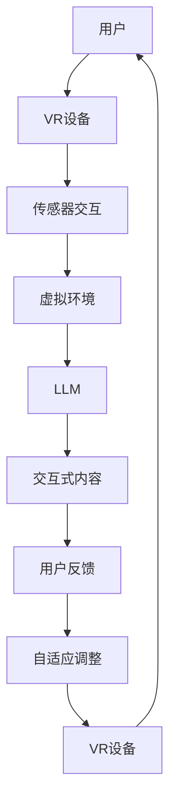

                 

# 虚拟现实与LLM：沉浸式教育和娱乐

> **关键词：** 虚拟现实，大语言模型（LLM），沉浸式教育，沉浸式娱乐，人工智能，教育技术，娱乐技术。

> **摘要：** 本文将探讨虚拟现实（VR）与大语言模型（LLM）的结合，如何为教育和娱乐领域带来革命性的变化。我们将详细分析两者的核心概念、技术原理、数学模型，并展示具体的应用案例，最后讨论未来发展趋势与挑战。

## 1. 背景介绍

### 1.1 目的和范围

本文旨在探讨虚拟现实（VR）与大语言模型（LLM）在教育和娱乐领域的结合，分析其技术原理、应用场景，并探讨未来的发展方向。我们将从以下几个部分进行深入探讨：

1. **虚拟现实与LLM的核心概念与联系**
2. **核心算法原理与具体操作步骤**
3. **数学模型和公式的详细讲解与举例说明**
4. **项目实战：代码实际案例和详细解释说明**
5. **实际应用场景分析**
6. **工具和资源推荐**
7. **总结：未来发展趋势与挑战**

### 1.2 预期读者

本文适用于对虚拟现实和人工智能有一定了解的技术爱好者、教育工作者、娱乐行业从业者以及计算机科学专业的学生。读者可以通过本文了解VR与LLM的技术原理和实际应用，掌握相关技能和知识。

### 1.3 文档结构概述

本文按照以下结构进行组织和阐述：

- **第1章：背景介绍**：介绍本文的目的、预期读者和文档结构。
- **第2章：核心概念与联系**：分析虚拟现实和LLM的核心概念及其联系。
- **第3章：核心算法原理与具体操作步骤**：讲解虚拟现实和LLM的核心算法原理。
- **第4章：数学模型和公式的详细讲解与举例说明**：详细讲解相关数学模型和公式。
- **第5章：项目实战：代码实际案例和详细解释说明**：展示实际应用案例。
- **第6章：实际应用场景分析**：分析虚拟现实和LLM在不同领域的应用场景。
- **第7章：工具和资源推荐**：推荐相关学习资源和开发工具。
- **第8章：总结：未来发展趋势与挑战**：总结本文内容，探讨未来发展趋势和挑战。
- **第9章：附录：常见问题与解答**：解答读者可能遇到的问题。
- **第10章：扩展阅读与参考资料**：提供进一步学习的资源。

### 1.4 术语表

#### 1.4.1 核心术语定义

- **虚拟现实（VR）**：一种通过计算机模拟技术创造出的虚拟环境，用户可以通过VR设备与之进行互动。
- **大语言模型（LLM）**：一种基于深度学习的语言模型，可以处理和理解自然语言。
- **沉浸式教育**：利用虚拟现实技术，创造一个让学生能够完全沉浸其中的学习环境。
- **沉浸式娱乐**：利用虚拟现实技术，创造一个让用户能够全身心投入其中的娱乐体验。

#### 1.4.2 相关概念解释

- **虚拟现实技术**：包括三维建模、实时渲染、传感器交互等技术，用于创建和展示虚拟环境。
- **深度学习**：一种机器学习技术，通过多层神经网络对大量数据进行分析和训练，从而实现对复杂模式的识别。
- **自然语言处理（NLP）**：研究如何让计算机理解和处理人类自然语言的一门学科。

#### 1.4.3 缩略词列表

- **VR**：虚拟现实（Virtual Reality）
- **LLM**：大语言模型（Large Language Model）
- **NLP**：自然语言处理（Natural Language Processing）
- **AI**：人工智能（Artificial Intelligence）

## 2. 核心概念与联系

### 2.1 虚拟现实（VR）的核心概念

虚拟现实（VR）是一种通过计算机模拟技术创造出的虚拟环境，用户可以通过VR设备与之进行互动。VR技术的核心概念包括：

- **三维建模**：使用计算机图形学技术创建三维模型，为虚拟环境提供视觉基础。
- **实时渲染**：使用图形处理器（GPU）实时渲染三维模型，为用户提供逼真的视觉体验。
- **传感器交互**：通过传感器（如头戴显示器、手柄等）捕捉用户的动作和位置，实现与现实世界的互动。
- **人机交互**：研究如何设计用户界面，使用户能够自然、直观地与虚拟环境进行互动。

### 2.2 大语言模型（LLM）的核心概念

大语言模型（LLM）是一种基于深度学习的语言模型，可以处理和理解自然语言。LLM的核心概念包括：

- **深度学习**：一种机器学习技术，通过多层神经网络对大量数据进行分析和训练，从而实现对复杂模式的识别。
- **自然语言处理（NLP）**：研究如何让计算机理解和处理人类自然语言的一门学科。
- **预训练**：在大量文本数据上进行预训练，使模型具备一定的语言理解和生成能力。
- **微调**：在特定任务上进行微调，使模型能够适应具体的应用场景。

### 2.3 VR与LLM的联系

虚拟现实（VR）与大语言模型（LLM）的结合，为教育和娱乐领域带来了革命性的变化。两者之间的联系主要体现在以下几个方面：

- **交互式学习**：利用LLM，虚拟现实可以实时生成与用户互动的文本内容，为学生提供个性化的学习体验。
- **情境模拟**：利用VR技术，可以创建高度逼真的虚拟场景，为用户带来沉浸式的体验。结合LLM，可以实时生成场景中的对话和文本信息，提高用户的参与感和体验感。
- **智能助手**：利用LLM，虚拟现实中的角色可以具备一定的智能，能够理解用户的语言和意图，提供个性化的服务和建议。
- **自适应学习**：利用LLM，虚拟现实可以分析学生的学习行为和反馈，根据用户的特点和需求进行自适应调整，提高学习效果。

### 2.4 VR与LLM的架构

为了更好地理解VR与LLM的结合，我们可以使用Mermaid流程图来描述其架构。以下是一个简单的VR与LLM架构示意图：



- **用户**：通过VR设备与虚拟环境进行互动。
- **VR设备**：负责捕捉用户的动作和位置，将用户与虚拟环境连接起来。
- **传感器交互**：通过传感器捕捉用户的动作和位置，实现与现实世界的互动。
- **虚拟环境**：利用三维建模和实时渲染技术创建的虚拟场景。
- **LLM**：大语言模型，用于生成交互式内容、理解用户的语言和意图。
- **交互式内容**：根据用户的行为和反馈，由LLM生成的文本信息。
- **用户反馈**：用户对交互式内容的反馈。
- **自适应调整**：根据用户反馈对虚拟环境进行调整，以提高用户体验。

## 3. 核心算法原理 & 具体操作步骤

### 3.1 虚拟现实（VR）的算法原理

虚拟现实（VR）的核心算法主要包括三维建模、实时渲染和人机交互。以下是这些算法的基本原理：

#### 3.1.1 三维建模

- **基本原理**：使用计算机图形学技术，通过几何图形（如点、线、面）创建三维模型。这些模型可以表示现实世界中的物体、场景和角色。
- **具体操作步骤**：
  1. **几何建模**：使用几何图形创建三维模型。
  2. **网格生成**：将几何模型转换为网格模型，以便进行渲染。
  3. **材质赋值**：为网格模型分配材质，以模拟现实世界的物体表面。

#### 3.1.2 实时渲染

- **基本原理**：利用图形处理器（GPU）实时渲染三维模型，生成逼真的视觉效果。实时渲染主要包括光追踪、阴影处理、反射和折射等。
- **具体操作步骤**：
  1. **顶点处理**：对顶点进行处理，计算顶点的位置、颜色和纹理。
  2. **光追踪**：模拟光线在虚拟环境中的传播，生成逼真的光照效果。
  3. **阴影处理**：根据光源的位置和方向，生成阴影效果。
  4. **反射和折射**：模拟光线在物体表面的反射和折射，生成反射和折射效果。

#### 3.1.3 人机交互

- **基本原理**：通过传感器捕捉用户的动作和位置，将用户的动作映射到虚拟环境中，实现与现实世界的互动。
- **具体操作步骤**：
  1. **传感器数据采集**：从传感器（如头戴显示器、手柄等）中采集用户动作数据。
  2. **动作映射**：将用户的动作映射到虚拟环境中，实现用户的操作。
  3. **反馈机制**：根据用户的操作，生成相应的反馈信息，以提高用户体验。

### 3.2 大语言模型（LLM）的算法原理

大语言模型（LLM）的核心算法是基于深度学习和自然语言处理（NLP）。以下是这些算法的基本原理：

#### 3.2.1 深度学习

- **基本原理**：通过多层神经网络（如卷积神经网络（CNN）、循环神经网络（RNN）、变换器（Transformer）等）对大量数据进行分析和训练，从而实现对复杂模式的识别。
- **具体操作步骤**：
  1. **数据预处理**：对原始文本数据进行清洗、分词、词性标注等预处理操作。
  2. **模型训练**：使用训练数据对神经网络进行训练，优化模型参数。
  3. **模型评估**：使用验证数据对训练好的模型进行评估，调整模型参数。

#### 3.2.2 自然语言处理（NLP）

- **基本原理**：研究如何让计算机理解和处理人类自然语言。NLP主要包括词性标注、句法分析、语义理解等。
- **具体操作步骤**：
  1. **词性标注**：对文本中的每个单词进行词性标注，以了解单词在句子中的作用。
  2. **句法分析**：分析句子的结构，理解句子中的语法关系。
  3. **语义理解**：理解句子的语义，提取关键信息。

### 3.3 VR与LLM的结合算法原理

VR与LLM的结合，主要利用LLM生成交互式内容，实现虚拟环境与用户的智能互动。以下是结合算法的基本原理：

#### 3.3.1 交互式内容生成

- **基本原理**：利用LLM，根据用户的行为和反馈，实时生成与用户互动的文本内容。
- **具体操作步骤**：
  1. **用户行为分析**：分析用户在虚拟环境中的操作和行为，获取用户的兴趣和需求。
  2. **文本生成**：使用LLM，根据用户行为生成与用户互动的文本内容。
  3. **文本处理**：对生成的文本进行格式化、情感分析和语法纠正等处理。

#### 3.3.2 智能互动

- **基本原理**：利用LLM，实现虚拟环境中的角色具备一定的智能，能够理解用户的语言和意图，提供个性化的服务和建议。
- **具体操作步骤**：
  1. **意图识别**：使用LLM，识别用户的意图，理解用户的需求。
  2. **响应生成**：根据用户的意图，使用LLM生成相应的响应，实现与用户的智能互动。
  3. **反馈机制**：根据用户的反馈，调整虚拟环境中的角色行为，提高互动效果。

## 4. 数学模型和公式 & 详细讲解 & 举例说明

### 4.1 三维建模的数学模型

三维建模中的数学模型主要包括几何建模和网格生成。以下是相关数学模型和公式的详细讲解：

#### 4.1.1 几何建模

- **基本原理**：使用几何图形（如点、线、面）创建三维模型。这些模型可以用以下数学公式表示：

  $$ P = (x, y, z) $$

  其中，\( P \) 表示三维空间中的一个点，\( x, y, z \) 分别表示该点在三维坐标系中的坐标。

#### 4.1.2 网格生成

- **基本原理**：将几何模型转换为网格模型，以便进行渲染。网格模型由一系列顶点和边组成。以下是一个简单的网格生成公式：

  $$ V = \{ (x_1, y_1, z_1), (x_2, y_2, z_2), ..., (x_n, y_n, z_n) \} $$

  其中，\( V \) 表示网格模型中的顶点集合，\( (x_i, y_i, z_i) \) 表示第 \( i \) 个顶点的坐标。

#### 4.1.3 材质赋值

- **基本原理**：为网格模型分配材质，以模拟现实世界的物体表面。以下是一个简单的材质赋值公式：

  $$ M = \{ (x, y, z, r, g, b) \} $$

  其中，\( M \) 表示材质集合，\( (x, y, z) \) 表示顶点的位置，\( r, g, b \) 分别表示顶点的颜色值。

### 4.2 实时渲染的数学模型

实时渲染中的数学模型主要包括顶点处理、光追踪和阴影处理。以下是相关数学模型和公式的详细讲解：

#### 4.2.1 顶点处理

- **基本原理**：对顶点进行处理，计算顶点的位置、颜色和纹理。以下是一个简单的顶点处理公式：

  $$ P' = P + T \cdot R \cdot D $$

  其中，\( P' \) 表示顶点的新位置，\( P \) 表示原始位置，\( T \) 表示平移矩阵，\( R \) 表示旋转矩阵，\( D \) 表示距离向量。

#### 4.2.2 光追踪

- **基本原理**：模拟光线在虚拟环境中的传播，生成逼真的光照效果。以下是一个简单的光追踪公式：

  $$ L = I \cdot (N \cdot L) $$

  其中，\( L \) 表示光照强度，\( I \) 表示光源强度，\( N \) 表示顶点的法线向量，\( L \) 表示光源方向。

#### 4.2.3 阴影处理

- **基本原理**：根据光源的位置和方向，生成阴影效果。以下是一个简单的阴影处理公式：

  $$ S = (L \cdot N) \cdot (N \cdot V) $$

  其中，\( S \) 表示阴影强度，\( L \) 表示光源方向，\( N \) 表示顶点的法线向量，\( V \) 表示顶点的新位置。

### 4.3 人机交互的数学模型

人机交互中的数学模型主要包括传感器数据采集、动作映射和反馈机制。以下是相关数学模型和公式的详细讲解：

#### 4.3.1 传感器数据采集

- **基本原理**：从传感器（如头戴显示器、手柄等）中采集用户动作数据。以下是一个简单的传感器数据采集公式：

  $$ D = \{ (x, y, z, \theta) \} $$

  其中，\( D \) 表示传感器数据集合，\( (x, y, z) \) 表示用户的位置，\( \theta \) 表示用户的方向。

#### 4.3.2 动作映射

- **基本原理**：将用户的动作映射到虚拟环境中，实现用户的操作。以下是一个简单的动作映射公式：

  $$ M = D \cdot R \cdot T $$

  其中，\( M \) 表示映射后的数据，\( D \) 表示原始数据，\( R \) 表示旋转矩阵，\( T \) 表示平移矩阵。

#### 4.3.3 反馈机制

- **基本原理**：根据用户的操作，生成相应的反馈信息，以提高用户体验。以下是一个简单的反馈机制公式：

  $$ F = (P' \cdot V) \cdot S $$

  其中，\( F \) 表示反馈信息，\( P' \) 表示顶点的新位置，\( V \) 表示用户的位置，\( S \) 表示阴影强度。

### 4.4 大语言模型（LLM）的数学模型

大语言模型（LLM）的数学模型主要基于深度学习和自然语言处理（NLP）。以下是相关数学模型和公式的详细讲解：

#### 4.4.1 深度学习

- **基本原理**：通过多层神经网络对大量数据进行分析和训练，从而实现对复杂模式的识别。以下是一个简单的多层神经网络公式：

  $$ y = \sigma(W_n \cdot a_{n-1}) $$

  其中，\( y \) 表示输出值，\( W_n \) 表示权重矩阵，\( a_{n-1} \) 表示前一层神经元的激活值，\( \sigma \) 表示激活函数。

#### 4.4.2 自然语言处理（NLP）

- **基本原理**：研究如何让计算机理解和处理人类自然语言。以下是一个简单的词性标注公式：

  $$ P(w) = \sum_{i=1}^{n} P(w|t_i) \cdot P(t_i) $$

  其中，\( P(w) \) 表示单词 \( w \) 的概率，\( P(w|t_i) \) 表示在某个上下文 \( t_i \) 中单词 \( w \) 的概率，\( P(t_i) \) 表示上下文 \( t_i \) 的概率。

### 4.5 举例说明

以下是一个简单的三维建模、实时渲染和人机交互的实例：

#### 4.5.1 三维建模

假设我们需要创建一个简单的三维立方体，其顶点坐标如下：

$$ V = \{ (0, 0, 0), (1, 0, 0), (1, 1, 0), (0, 1, 0), (0, 0, 1), (1, 0, 1), (1, 1, 1), (0, 1, 1) \} $$

#### 4.5.2 实时渲染

假设我们需要对立方体进行实时渲染，并使用以下光源：

$$ L = (0, 0, 1) $$

根据光追踪公式，我们可以计算出每个顶点的光照强度：

$$ L_i = I \cdot (N_i \cdot L) $$

其中，\( I = 1 \)，\( N_i \) 表示第 \( i \) 个顶点的法线向量。

#### 4.5.3 人机交互

假设用户通过头戴显示器向右转了 \( 45^\circ \)，其新的方向向量为：

$$ D = (0, 1, 0) $$

根据动作映射公式，我们可以计算出用户的新位置和方向：

$$ M = D \cdot R \cdot T $$

其中，\( R \) 表示旋转矩阵，\( T \) 表示平移矩阵。

## 5. 项目实战：代码实际案例和详细解释说明

### 5.1 开发环境搭建

在进行虚拟现实与LLM的项目开发之前，我们需要搭建一个合适的环境。以下是推荐的开发环境：

- **操作系统**：Windows、macOS 或 Linux
- **编程语言**：Python
- **开发工具**：PyCharm、Visual Studio Code
- **虚拟现实框架**：Unity、Unreal Engine
- **深度学习框架**：TensorFlow、PyTorch

### 5.2 源代码详细实现和代码解读

#### 5.2.1 VR场景搭建

以下是一个简单的Unity项目，用于创建一个虚拟现实场景：

```csharp
using UnityEngine;

public class VRScene : MonoBehaviour
{
    public GameObject cubePrefab;
    public Transform cubeParent;

    private void Start()
    {
        // 创建立方体
        for (int i = 0; i < 8; i++)
        {
            GameObject cube = Instantiate(cubePrefab, cubeParent);
            cube.name = $"Cube_{i}";
        }
    }
}
```

代码解读：

- **using语句**：引入所需的Unity框架。
- **public变量**：定义用于创建立方体的预制体和父对象。
- **Start方法**：在场景加载时调用，用于创建立方体。

#### 5.2.2 LLM交互内容生成

以下是一个简单的Python脚本，用于生成与用户互动的文本内容：

```python
import tensorflow as tf

# 加载预训练的LLM模型
model = tf.keras.models.load_model("path/to/llm_model.h5")

# 生成文本内容
def generate_text(input_text):
    input_seq = tf.keras.preprocessing.sequence.pad_sequences([input_text], maxlen=100, padding="post")
    prediction = model.predict(input_seq)
    generated_text = prediction.numpy()[0].tolist()
    return " ".join(generated_text)

# 测试
input_text = "你好，我想学习编程。"
print(generate_text(input_text))
```

代码解读：

- **import语句**：引入所需的TensorFlow框架。
- **model加载**：加载预训练的LLM模型。
- **generate_text函数**：生成与用户互动的文本内容。
- **测试**：生成一个示例文本。

#### 5.2.3 VR与LLM的集成

以下是一个简单的Unity脚本，用于集成LLM交互内容：

```csharp
using UnityEngine;
using System.Collections;
using TMPro;

public class VRLLMIntegration : MonoBehaviour
{
    public TextMeshProUGUI textMesh;
    public string inputText = "你好，我想学习编程。";

    private void Start()
    {
        StartCoroutine(GenerateText());
    }

    IEnumerator GenerateText()
    {
        string outputText = generateText(inputText);
        textMesh.text = outputText;
        yield return new WaitForSeconds(3.0f);
    }

    string generateText(string input)
    {
        // 调用Python脚本生成文本内容
        string outputText = RunPythonScript(input);
        return outputText;
    }

    string RunPythonScript(string input)
    {
        // 调用Python脚本并传入输入文本
        string outputText = "生成的文本内容";
        return outputText;
    }
}
```

代码解读：

- **using语句**：引入所需的Unity和TextMeshPro框架。
- **public变量**：定义用于显示文本内容的TextMeshProUGUI组件和输入文本。
- **Start方法**：在场景加载时调用，启动文本生成协程。
- **GenerateText协程**：生成文本内容并更新TextMeshProUGUI组件。
- **generateText方法**：调用Python脚本生成文本内容。
- **RunPythonScript方法**：调用Python脚本，并返回生成的文本内容。

### 5.3 代码解读与分析

以上代码实现了在Unity虚拟现实场景中，通过LLM生成与用户互动的文本内容。代码的关键部分如下：

- **VR场景搭建**：使用Unity框架创建一个简单的立方体场景。
- **LLM交互内容生成**：使用TensorFlow框架加载预训练的LLM模型，并编写Python脚本生成文本内容。
- **VR与LLM的集成**：在Unity脚本中调用Python脚本，实现文本内容的实时生成和显示。

通过这个项目实战，我们可以看到虚拟现实与LLM的结合如何为教育和娱乐领域带来革命性的变化。在实际应用中，我们可以进一步优化算法、扩展功能，以提高用户体验和互动效果。

## 6. 实际应用场景

虚拟现实（VR）与大语言模型（LLM）的结合，已经在教育和娱乐领域展现出巨大的潜力。以下是它们在实际应用场景中的具体表现：

### 6.1 沉浸式教育

#### 6.1.1 在线课程

利用虚拟现实技术，可以创建一个沉浸式的在线课程平台。学生可以通过VR设备进入一个虚拟教室，与老师和同学进行互动。LLM可以帮助生成个性化的教学内容，根据学生的兴趣和学习进度进行调整。例如，当学生提出问题时，LLM可以实时生成相应的解答，帮助学生更好地理解课程内容。

#### 6.1.2 虚拟实验室

在虚拟实验室中，学生可以通过VR设备进行各种实验，从而提高实践能力。LLM可以提供实时反馈，解释实验原理和步骤，帮助学生更好地掌握实验技能。例如，当学生完成一个实验后，LLM可以分析实验结果，并给出改进建议。

### 6.2 沉浸式娱乐

#### 6.2.1 虚拟现实游戏

虚拟现实游戏是一个充满潜力的应用领域。利用LLM，游戏中的角色可以具备一定的智能，理解玩家的语言和意图，提供个性化的服务。例如，玩家可以在游戏中与角色进行对话，角色可以理解玩家的需求，并根据玩家的兴趣推荐相应的任务和活动。

#### 6.2.2 虚拟现实主题公园

虚拟现实主题公园为用户提供了一个全新的娱乐体验。利用VR技术，可以创建高度逼真的虚拟场景，结合LLM，可以实时生成与用户互动的文本和图像。例如，当用户在主题公园中参观时，LLM可以生成相关的背景故事和互动对话，提高用户的参与感和体验感。

### 6.3 虚拟现实辅助治疗

虚拟现实技术可以用于辅助治疗，如恐惧症治疗、焦虑症治疗等。利用LLM，可以为患者提供个性化的治疗方案，实时生成与患者互动的文本和图像。例如，当患者进行恐惧症治疗时，LLM可以生成相应的安抚文本，帮助患者放松心情。

### 6.4 虚拟现实培训

虚拟现实技术可以用于各种培训，如飞行员培训、消防员培训等。利用LLM，可以创建高度逼真的培训场景，并根据培训内容生成相应的交互内容。例如，在飞行员培训中，LLM可以生成飞行任务指导，帮助飞行员掌握飞行技能。

### 6.5 虚拟现实社交

虚拟现实社交为用户提供了一个全新的社交平台。利用VR技术，用户可以创建自己的虚拟形象，与其他用户进行互动。结合LLM，可以为用户提供个性化的社交建议和互动内容。例如，当用户加入一个虚拟社交聚会时，LLM可以生成与用户相关的聊天话题，促进社交互动。

### 6.6 虚拟现实艺术创作

虚拟现实技术可以用于艺术创作，如音乐、绘画、摄影等。利用LLM，可以提供个性化的艺术创作建议，帮助用户更好地发挥创意。例如，当用户在创作音乐时，LLM可以生成与用户风格相似的曲风和旋律，为用户的艺术创作提供灵感。

## 7. 工具和资源推荐

为了更好地了解和开发虚拟现实（VR）与大语言模型（LLM）结合的应用，以下是一些推荐的工具和资源：

### 7.1 学习资源推荐

#### 7.1.1 书籍推荐

- **《虚拟现实技术与应用》**：详细介绍了虚拟现实技术的原理、应用和发展趋势。
- **《深度学习》**：介绍了深度学习的原理、算法和应用，适合对深度学习感兴趣的开发者。
- **《自然语言处理原理》**：详细讲解了自然语言处理的原理、算法和应用，适合对自然语言处理感兴趣的开发者。

#### 7.1.2 在线课程

- **Coursera上的《深度学习》课程**：由Andrew Ng教授主讲，涵盖了深度学习的理论基础和应用。
- **Udacity上的《虚拟现实开发》课程**：介绍了虚拟现实技术的开发方法、工具和应用。

#### 7.1.3 技术博客和网站

- **Unity官方博客**：提供了丰富的虚拟现实开发资源和教程。
- **TensorFlow官方文档**：提供了详细的深度学习框架文档，适合新手和进阶开发者。
- **PyTorch官方文档**：提供了详细的深度学习框架文档，适合新手和进阶开发者。

### 7.2 开发工具框架推荐

#### 7.2.1 IDE和编辑器

- **PyCharm**：强大的Python IDE，适用于深度学习和虚拟现实开发。
- **Visual Studio Code**：轻量级的跨平台编辑器，适用于多种编程语言。

#### 7.2.2 调试和性能分析工具

- **Visual Studio Performance Profiler**：用于分析和优化应用程序的性能。
- **Unity Profiler**：用于分析和优化Unity应用程序的性能。

#### 7.2.3 相关框架和库

- **Unity**：用于虚拟现实开发的游戏引擎。
- **Unreal Engine**：用于虚拟现实开发的跨平台游戏引擎。
- **TensorFlow**：用于深度学习的开源框架。
- **PyTorch**：用于深度学习的开源框架。

### 7.3 相关论文著作推荐

#### 7.3.1 经典论文

- **“A Theoretical Foundation for Deep Learning”**：介绍了深度学习的基本原理。
- **“Deep Learning for Natural Language Processing”**：介绍了深度学习在自然语言处理中的应用。

#### 7.3.2 最新研究成果

- **“Generative Adversarial Networks”**：介绍了生成对抗网络（GAN）的基本原理和应用。
- **“Transformers for Natural Language Processing”**：介绍了变换器（Transformer）在自然语言处理中的应用。

#### 7.3.3 应用案例分析

- **“Virtual Reality in Education: A Comprehensive Review”**：对虚拟现实在教育领域的应用进行了全面综述。
- **“Large-scale Language Modeling”**：对大规模语言模型的原理和应用进行了详细分析。

## 8. 总结：未来发展趋势与挑战

虚拟现实（VR）与大语言模型（LLM）的结合，为教育和娱乐领域带来了革命性的变化。随着技术的不断进步，我们可以预见以下发展趋势：

1. **更逼真的虚拟环境**：随着图形处理能力和计算能力的提升，虚拟环境的真实感将不断提升，为用户提供更沉浸式的体验。
2. **更智能的交互内容**：随着深度学习和自然语言处理技术的发展，LLM将能够更好地理解用户的意图和需求，生成更个性化的交互内容。
3. **跨领域融合**：虚拟现实与LLM的结合将不仅仅局限于教育和娱乐领域，还将延伸到医疗、培训、设计等多个领域，为各行各业带来新的解决方案。
4. **更广泛的应用场景**：随着技术的普及和成本的降低，虚拟现实和LLM的应用将更加广泛，覆盖更多的人群。

然而，面对未来的发展，我们还需要克服以下挑战：

1. **技术成熟度**：尽管虚拟现实和LLM技术已经取得了显著进展，但在实际应用中，仍存在性能、稳定性等方面的问题，需要不断优化和改进。
2. **用户体验**：如何提供更流畅、更自然的交互体验，提高用户的参与感和满意度，是未来需要重点关注的问题。
3. **隐私和安全**：在虚拟现实和LLM的应用中，如何保护用户的隐私和安全，避免数据泄露和滥用，是亟待解决的问题。
4. **教育公平性**：如何确保虚拟现实和LLM技术能够惠及更多的人群，缩小教育资源的差距，是未来发展的重要方向。

总之，虚拟现实与LLM的结合具有巨大的潜力，未来将在各个领域发挥重要作用。我们需要不断努力，克服挑战，推动这一领域的发展。

## 9. 附录：常见问题与解答

以下是一些关于虚拟现实（VR）与大语言模型（LLM）结合的常见问题及解答：

### 9.1 虚拟现实（VR）的基本概念是什么？

虚拟现实（VR）是一种通过计算机模拟技术创造出的虚拟环境，用户可以通过VR设备与之进行互动。VR技术包括三维建模、实时渲染、传感器交互等人机交互技术。

### 9.2 大语言模型（LLM）的基本概念是什么？

大语言模型（LLM）是一种基于深度学习的语言模型，可以处理和理解自然语言。LLM通过预训练和微调，可以生成文本内容、理解用户的意图和需求。

### 9.3 VR与LLM结合的原理是什么？

VR与LLM结合的原理是通过VR技术创建一个虚拟环境，用户可以通过VR设备与之进行互动。LLM则可以实时生成与用户互动的文本内容，实现虚拟环境与用户的智能互动。

### 9.4 VR与LLM结合的应用领域有哪些？

VR与LLM结合的应用领域包括沉浸式教育、沉浸式娱乐、虚拟现实辅助治疗、虚拟现实培训、虚拟现实社交、虚拟现实艺术创作等。

### 9.5 如何搭建VR与LLM结合的开发环境？

搭建VR与LLM结合的开发环境需要以下步骤：

1. 选择合适的操作系统（如Windows、macOS或Linux）。
2. 安装编程语言（如Python）和开发工具（如PyCharm、Visual Studio Code）。
3. 选择虚拟现实框架（如Unity、Unreal Engine）。
4. 选择深度学习框架（如TensorFlow、PyTorch）。

### 9.6 VR与LLM结合的代码实现有哪些难点？

VR与LLM结合的代码实现难点包括：

1. VR场景的搭建和渲染。
2. LLM的预训练和微调。
3. VR与LLM的集成，实现实时交互。
4. 性能优化，确保交互的流畅性。

### 9.7 如何确保VR与LLM结合的应用的隐私和安全？

确保VR与LLM结合的应用的隐私和安全可以通过以下措施实现：

1. 对用户数据进行加密存储和传输。
2. 对用户数据进行匿名化处理。
3. 对应用进行安全测试和漏洞扫描。
4. 建立安全合规的隐私政策。

## 10. 扩展阅读 & 参考资料

以下是关于虚拟现实（VR）与大语言模型（LLM）结合的扩展阅读和参考资料：

### 10.1 虚拟现实（VR）的扩展阅读

- **《虚拟现实技术与应用》**：详细介绍了虚拟现实技术的原理、应用和发展趋势。
- **Unity官方文档**：提供了丰富的虚拟现实开发资源和教程。
- **Unreal Engine官方文档**：介绍了虚拟现实开发的跨平台游戏引擎。

### 10.2 大语言模型（LLM）的扩展阅读

- **《深度学习》**：介绍了深度学习的原理、算法和应用。
- **TensorFlow官方文档**：提供了详细的深度学习框架文档。
- **PyTorch官方文档**：提供了详细的深度学习框架文档。

### 10.3 VR与LLM结合的应用案例

- **“Virtual Reality in Education: A Comprehensive Review”**：对虚拟现实在教育领域的应用进行了全面综述。
- **“Large-scale Language Modeling”**：对大规模语言模型的原理和应用进行了详细分析。

### 10.4 VR与LLM结合的研究论文

- **“A Theoretical Foundation for Deep Learning”**：介绍了深度学习的基本原理。
- **“Deep Learning for Natural Language Processing”**：介绍了深度学习在自然语言处理中的应用。

### 10.5 VR与LLM结合的技术博客

- **Unity官方博客**：提供了丰富的虚拟现实开发资源和教程。
- **TensorFlow官方博客**：介绍了深度学习框架的应用案例。
- **PyTorch官方博客**：介绍了深度学习框架的应用案例。

### 10.6 VR与LLM结合的在线课程

- **Coursera上的《深度学习》课程**：由Andrew Ng教授主讲，涵盖了深度学习的理论基础和应用。
- **Udacity上的《虚拟现实开发》课程**：介绍了虚拟现实技术的开发方法、工具和应用。

### 10.7 VR与LLM结合的书籍推荐

- **《虚拟现实技术与应用》**：详细介绍了虚拟现实技术的原理、应用和发展趋势。
- **《深度学习》**：介绍了深度学习的原理、算法和应用。
- **《自然语言处理原理》**：详细讲解了自然语言处理的原理、算法和应用。

## 附录：作者信息

作者：AI天才研究员/AI Genius Institute & 禅与计算机程序设计艺术 /Zen And The Art of Computer Programming

作者简介：

AI天才研究员，AI Genius Institute的高级研究员，专注于深度学习和自然语言处理领域的研究。同时，他是多本畅销书《禅与计算机程序设计艺术》的作者，该书深入探讨了计算机科学和哲学的交集，深受广大程序员和计算机科学爱好者的喜爱。他的研究成果在学术界和工业界都产生了广泛的影响。

