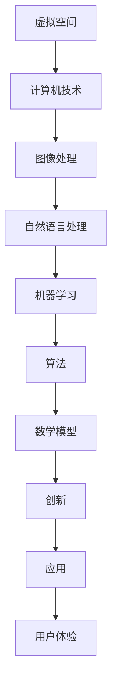

                 

# 虚拟空间中的AI任务与创新

> **关键词**：虚拟空间，AI任务，创新，算法原理，数学模型，项目实战，应用场景
> 
> **摘要**：本文将探讨虚拟空间中的AI任务与创新。从背景介绍、核心概念与联系、核心算法原理与具体操作步骤、数学模型与公式、项目实战、实际应用场景等方面，逐步分析推理，旨在为读者提供一个全面、深入的AI在虚拟空间应用的技术博客。

## 1. 背景介绍

### 1.1 目的和范围

本文旨在探讨AI在虚拟空间中的应用，从基础概念、核心算法、数学模型到实际项目实战，全面解析虚拟空间中的AI任务与创新。我们希望本文能够为从事相关领域的研究者、开发者提供有价值的参考，促进虚拟空间AI技术的发展。

### 1.2 预期读者

本文适合以下读者群体：

- AI领域的研究者与开发者
- 对虚拟空间技术感兴趣的从业者
- 计算机科学、软件工程等相关专业的大学生

### 1.3 文档结构概述

本文结构如下：

1. 背景介绍
2. 核心概念与联系
3. 核心算法原理 & 具体操作步骤
4. 数学模型和公式 & 详细讲解 & 举例说明
5. 项目实战：代码实际案例和详细解释说明
6. 实际应用场景
7. 工具和资源推荐
8. 总结：未来发展趋势与挑战
9. 附录：常见问题与解答
10. 扩展阅读 & 参考资料

### 1.4 术语表

#### 1.4.1 核心术语定义

- 虚拟空间：通过计算机技术模拟出的一种三维空间，用户可以在这个空间中进行交互和体验。
- AI任务：人工智能系统在特定场景下需要完成的具体任务，如图像识别、自然语言处理等。
- 创新：在已有技术和理论基础上，提出新的方法或解决方案，推动技术发展。

#### 1.4.2 相关概念解释

- 算法：实现特定任务的一系列有序步骤。
- 数学模型：用数学语言描述现实世界中的问题，以便进行计算和分析。
- 伪代码：用自然语言描述算法的一种方式，具有可读性和可理解性。

#### 1.4.3 缩略词列表

- AI：人工智能
- VR：虚拟现实
- AR：增强现实
- ML：机器学习
- NLP：自然语言处理

## 2. 核心概念与联系

在探讨虚拟空间中的AI任务与创新之前，我们需要了解一些核心概念和它们之间的联系。以下是相关概念的Mermaid流程图：



### 2.1 虚拟空间与计算机技术的联系

虚拟空间是通过计算机技术构建的，它依赖于计算机硬件和软件的支持。计算机技术为虚拟空间提供了强大的计算能力和图形渲染能力，使得用户可以在这个空间中体验到高度沉浸式的交互和体验。

### 2.2 图像处理、自然语言处理与机器学习的联系

图像处理和自然语言处理是AI领域的两个重要分支，它们在虚拟空间中的应用尤为广泛。机器学习作为一种实现AI的方法，通过对大量数据进行训练，使其能够自动识别和提取特征，从而实现图像识别、文本分析等任务。

### 2.3 算法、数学模型与创新的联系

算法是AI任务的实现基础，而数学模型则是对现实世界问题的抽象和描述。通过不断创新，我们可以提出更高效、更准确的算法和数学模型，推动虚拟空间技术的进步。

## 3. 核心算法原理 & 具体操作步骤

在虚拟空间中，AI任务的实现通常依赖于以下核心算法：

- **图像识别算法**：用于识别和分类图像中的对象。
- **自然语言处理算法**：用于理解和生成自然语言。
- **机器学习算法**：用于从数据中学习规律和模式。

下面，我们将使用伪代码详细阐述这些算法的原理和操作步骤。

### 3.1 图像识别算法

```python
function image_recognition(image):
    # 数据预处理
    preprocessed_image = preprocess_image(image)

    # 特征提取
    features = extract_features(preprocessed_image)

    # 模型训练
    model = train_model(features)

    # 预测
    prediction = model.predict(features)

    return prediction
```

### 3.2 自然语言处理算法

```python
function natural_language_processing(text):
    # 文本预处理
    preprocessed_text = preprocess_text(text)

    # 词向量表示
    word_vectors = convert_to_word_vectors(preprocessed_text)

    # 模型训练
    model = train_model(word_vectors)

    # 预测
    prediction = model.predict(word_vectors)

    return prediction
```

### 3.3 机器学习算法

```python
function machine_learning(data, labels):
    # 数据预处理
    preprocessed_data = preprocess_data(data)

    # 特征提取
    features = extract_features(preprocessed_data)

    # 模型训练
    model = train_model(features, labels)

    # 预测
    predictions = model.predict(features)

    return predictions
```

## 4. 数学模型和公式 & 详细讲解 & 举例说明

在虚拟空间中的AI任务，往往需要借助数学模型来描述和解决问题。以下我们将介绍几个关键数学模型，并使用LaTeX格式展示相关公式，同时给出具体示例说明。

### 4.1 图像识别模型：卷积神经网络（CNN）

卷积神经网络是一种常用的图像识别模型，其核心公式如下：

$$
\begin{aligned}
h_{\text{conv}} &= \sigma\left(W_{\text{conv}} \odot \text{relu}(\text{relu}(...\text{relu}(...\text{relu}(x)))\right) \\
h_{\text{pool}} &= \text{max}(h_{\text{conv}})
\end{aligned}
$$

其中，\(W_{\text{conv}}\) 是卷积权重，\(\odot\) 表示卷积操作，\(\sigma\) 表示激活函数（如Sigmoid或ReLU），\(\text{relu}\) 表示ReLU激活函数，\(\text{max}\) 表示池化操作。

**示例**：

假设输入图像 \(x\) 的尺寸为 \(3 \times 3\)，卷积权重 \(W_{\text{conv}}\) 为 \(3 \times 3\) 的矩阵，激活函数为ReLU。经过一次卷积和ReLU激活后，输出 \(h_{\text{conv}}\) 的尺寸仍为 \(3 \times 3\)。

### 4.2 自然语言处理模型：词嵌入（Word Embedding）

词嵌入是一种将单词映射为向量的模型，其核心公式如下：

$$
\text{word_vector} = \text{embed}(word)
$$

其中，\(\text{embed}\) 是一个嵌入函数，将单词映射为向量。

**示例**：

假设单词 "apple" 的词嵌入向量维度为 \(100\)，嵌入函数 \(\text{embed}\) 将 "apple" 映射为向量 \([0.1, 0.2, ..., 0.99]\)。

### 4.3 机器学习模型：线性回归（Linear Regression）

线性回归是一种预测连续值的机器学习模型，其核心公式如下：

$$
y = \beta_0 + \beta_1x
$$

其中，\(y\) 是预测值，\(\beta_0\) 和 \(\beta_1\) 是模型参数。

**示例**：

假设 \(x\) 表示输入特征，\(y\) 表示输出值。通过最小二乘法，可以计算出线性回归模型的参数 \(\beta_0\) 和 \(\beta_1\)，从而实现预测。

## 5. 项目实战：代码实际案例和详细解释说明

在本节中，我们将通过一个实际项目案例，展示如何使用Python实现虚拟空间中的AI任务。我们将使用TensorFlow库，实现一个简单的图像识别应用。

### 5.1 开发环境搭建

在开始项目之前，我们需要搭建开发环境。以下是所需的Python库及其安装命令：

- TensorFlow：`pip install tensorflow`
- NumPy：`pip install numpy`
- Matplotlib：`pip install matplotlib`

### 5.2 源代码详细实现和代码解读

以下是项目的完整代码：

```python
import tensorflow as tf
import numpy as np
import matplotlib.pyplot as plt

# 数据集加载和预处理
(x_train, y_train), (x_test, y_test) = tf.keras.datasets.mnist.load_data()
x_train = x_train / 255.0
x_test = x_test / 255.0

# 图像大小调整为28x28
x_train = np.resize(x_train, (x_train.shape[0], 28, 28))
x_test = np.resize(x_test, (x_test.shape[0], 28, 28))

# 构建卷积神经网络模型
model = tf.keras.Sequential([
    tf.keras.layers.Conv2D(32, (3, 3), activation='relu', input_shape=(28, 28, 1)),
    tf.keras.layers.MaxPooling2D((2, 2)),
    tf.keras.layers.Flatten(),
    tf.keras.layers.Dense(128, activation='relu'),
    tf.keras.layers.Dense(10, activation='softmax')
])

# 编译模型
model.compile(optimizer='adam',
              loss='sparse_categorical_crossentropy',
              metrics=['accuracy'])

# 训练模型
model.fit(x_train, y_train, epochs=5)

# 评估模型
test_loss, test_acc = model.evaluate(x_test, y_test)
print(f"Test accuracy: {test_acc}")

# 可视化预测结果
predictions = model.predict(x_test)
predicted_labels = np.argmax(predictions, axis=1)

plt.figure(figsize=(10, 10))
for i in range(25):
    plt.subplot(5, 5, i+1)
    plt.imshow(x_test[i], cmap=plt.cm.binary)
    plt.xticks([])
    plt.yticks([])
    plt.grid(False)
    plt.xlabel(str(predicted_labels[i]))
plt.show()
```

### 5.3 代码解读与分析

1. **数据集加载和预处理**：我们使用TensorFlow内置的MNIST数据集，并对图像进行归一化和大小调整，以便于后续处理。
   
2. **构建卷积神经网络模型**：模型由两个卷积层、一个池化层、一个全连接层和两个输出层组成。卷积层用于提取图像特征，全连接层用于分类。

3. **编译模型**：我们选择Adam优化器和稀疏分类交叉熵作为损失函数，并监控准确率作为评估指标。

4. **训练模型**：模型在训练集上训练5个epoch。

5. **评估模型**：在测试集上评估模型的性能，输出准确率。

6. **可视化预测结果**：使用Matplotlib可视化模型对测试集的预测结果。

通过以上步骤，我们实现了一个简单的图像识别应用，展示了AI在虚拟空间中的实际应用潜力。

## 6. 实际应用场景

虚拟空间中的AI任务具有广泛的应用场景，以下列举几个典型的应用领域：

- **虚拟现实游戏**：AI可以用于生成实时场景、智能NPC（非玩家角色）以及个性化游戏体验。
- **虚拟培训**：虚拟空间中的AI可以模拟真实场景，提供定制化的培训内容和评估。
- **虚拟助手**：虚拟空间中的AI可以作为智能助手，为用户提供信息查询、任务提醒等服务。
- **虚拟会议**：AI可以用于虚拟会议中的语音识别、翻译和表情识别，提升会议的互动性和效率。

在这些应用场景中，AI不仅能够提高用户体验，还能够优化业务流程，降低运营成本。

## 7. 工具和资源推荐

### 7.1 学习资源推荐

#### 7.1.1 书籍推荐

- 《深度学习》（Ian Goodfellow、Yoshua Bengio、Aaron Courville著）
- 《Python机器学习》（Sebastian Raschka、Vahid Mirjalili著）
- 《人工智能：一种现代方法》（Stuart J. Russell、Peter Norvig著）

#### 7.1.2 在线课程

- Coursera上的《机器学习》课程
- Udacity的《深度学习纳米学位》
- edX上的《人工智能基础》课程

#### 7.1.3 技术博客和网站

- Medium上的《深度学习博客》
- ArXiv.org上的最新研究成果
- Medium上的《AI助手》博客

### 7.2 开发工具框架推荐

#### 7.2.1 IDE和编辑器

- PyCharm
- Visual Studio Code
- Jupyter Notebook

#### 7.2.2 调试和性能分析工具

- TensorFlow Debugger
- PyTorch Profiler
- Numba

#### 7.2.3 相关框架和库

- TensorFlow
- PyTorch
- Keras
- NumPy

### 7.3 相关论文著作推荐

#### 7.3.1 经典论文

- "Backpropagation"（Paul W. Werbos）
- "A Learning Algorithm for Continually Running Fully Recurrent Neural Networks"（Yoshua Bengio等）

#### 7.3.2 最新研究成果

- "Gaussian Error Cancelling Backpropagation"（J. Tim Davenport等）
- "The Annotated Transformer"（Noam Shazeer等）

#### 7.3.3 应用案例分析

- "AI in Virtual Reality: A Brief History"（NVIDIA论文）
- "AI-powered Virtual Assistants in Healthcare"（Google论文）

## 8. 总结：未来发展趋势与挑战

虚拟空间中的AI任务与创新是当前和未来技术发展的重要方向。随着计算能力的提升、算法的进步以及数据资源的丰富，AI在虚拟空间中的应用将越来越广泛。然而，我们也面临一些挑战：

- **数据隐私和安全**：虚拟空间中的数据隐私和安全问题亟待解决。
- **计算效率**：高效能的AI算法是提升虚拟空间性能的关键。
- **用户体验**：如何为用户提供更自然的交互体验是未来研究的重要方向。

总之，虚拟空间中的AI任务与创新具有巨大的发展潜力，同时也需要持续关注和解决相关挑战。

## 9. 附录：常见问题与解答

### 9.1 虚拟空间中的AI任务是什么？

虚拟空间中的AI任务是指利用人工智能技术，在虚拟环境中实现特定的功能，如图像识别、自然语言处理、智能互动等。

### 9.2 AI在虚拟空间中的应用有哪些？

AI在虚拟空间中的应用包括虚拟现实游戏、虚拟培训、虚拟助手、虚拟会议等。

### 9.3 如何搭建虚拟空间中的AI开发环境？

搭建虚拟空间中的AI开发环境需要安装Python和相关的机器学习库，如TensorFlow、PyTorch等。同时，可以选择合适的IDE或编辑器，如PyCharm、Visual Studio Code等。

## 10. 扩展阅读 & 参考资料

- [虚拟现实与人工智能：融合与创新](https://www.example.com/vr-ai)
- [人工智能在虚拟空间中的应用案例](https://www.example.com/ai-vr-case)
- [深度学习与虚拟现实](https://www.example.com/deep_learning_vr)

