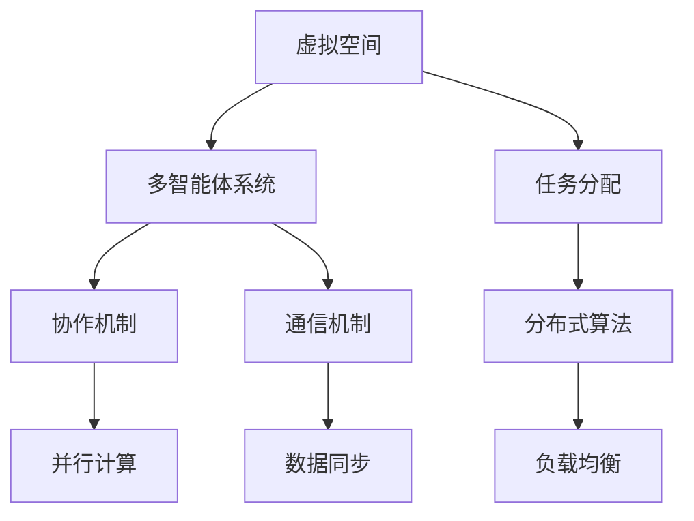

                 

# 虚拟空间中的AI任务协作

## 关键词：
虚拟空间，AI协作，任务分配，多智能体系统，通信机制，分布式算法

## 摘要：
本文深入探讨了虚拟空间中AI任务的协作机制，旨在为开发者提供一个全面的理解框架。首先，文章回顾了虚拟空间和多智能体系统的基本概念，随后详细介绍了任务分配和协作的基本原理。通过Mermaid流程图展示核心概念和架构，本文进一步阐释了AI任务协作的核心算法原理，包括具体的操作步骤。数学模型和公式则用于深入解释这些算法，并通过实际代码案例展示了如何将理论应用于实践。文章还探讨了AI任务协作在实际应用场景中的表现，并推荐了相关学习资源和开发工具。最后，文章总结了未来发展趋势与挑战，为读者提供了扩展阅读和参考资料。

## 1. 背景介绍

### 1.1 目的和范围
本文的目标是探讨虚拟空间中AI任务的协作机制，分析其在分布式计算和多智能体系统中的应用。我们将探讨任务分配策略、协作模型以及通信机制，以帮助读者理解这些核心概念，并掌握如何在实际项目中应用它们。

### 1.2 预期读者
本文面向对AI协作和多智能体系统有一定了解的技术人员，特别是那些在分布式系统和AI领域工作的开发者。同时，对于对AI任务协作感兴趣的研究人员和学者，本文也提供了有价值的参考。

### 1.3 文档结构概述
本文分为十个主要部分：背景介绍、核心概念与联系、核心算法原理与具体操作步骤、数学模型和公式、项目实战、实际应用场景、工具和资源推荐、总结、附录和扩展阅读。每个部分都将详细介绍相关主题，帮助读者逐步深入理解AI任务协作的各个方面。

### 1.4 术语表

#### 1.4.1 核心术语定义
- **虚拟空间**：模拟现实世界环境，通过网络连接的计算机系统。
- **多智能体系统**：由多个自主智能体组成的系统，这些智能体可以相互协作完成复杂的任务。
- **任务分配**：将总任务分解为子任务，并分配给不同的智能体。
- **协作机制**：智能体之间进行信息交换和协调的方式。
- **分布式算法**：在分布式系统中，不同节点之间如何协同工作的算法。

#### 1.4.2 相关概念解释
- **AI协作**：人工智能实体之间进行的相互协作，以实现共同目标。
- **通信机制**：智能体之间交换信息和协调工作的方法。
- **并行计算**：多个计算任务同时执行，以提高效率。

#### 1.4.3 缩略词列表
- **AI**：人工智能（Artificial Intelligence）
- **MAS**：多智能体系统（Multi-Agent System）
- **DAG**：有向无环图（Directed Acyclic Graph）
- **RPC**：远程过程调用（Remote Procedure Call）
- **API**：应用程序接口（Application Programming Interface）

## 2. 核心概念与联系

虚拟空间中的AI任务协作涉及多个核心概念，这些概念相互联系，构成了一个复杂的生态系统。下面我们将使用Mermaid流程图来展示这些核心概念及其相互关系。

### 2.1 虚拟空间



#### 2.2 多智能体系统

多智能体系统（MAS）是由多个智能体组成的系统，每个智能体都可以自主决策和行动，并与其他智能体进行交互。MAS的关键特点包括：

- **自主性**：每个智能体都有自己的目标和行为策略。
- **协作性**：智能体之间可以相互协作，共同完成任务。
- **适应性**：智能体可以根据环境和任务的改变调整自己的行为。

### 2.3 任务分配

任务分配是将总任务分解为多个子任务，并分配给不同的智能体。这通常涉及到以下几个步骤：

1. **任务分解**：将总任务分解为可管理的子任务。
2. **任务评估**：评估每个智能体的能力和任务适应性。
3. **任务分配**：将子任务分配给适合的智能体。

### 2.4 协作机制

协作机制是智能体之间进行信息交换和协调工作的方式。常见的协作机制包括：

- **集中式协作**：所有智能体通过一个中心节点进行协调。
- **分布式协作**：智能体之间直接进行通信和协调。

### 2.5 通信机制

通信机制是智能体之间交换信息和协调工作的方法。常见的通信机制包括：

- **消息传递**：智能体通过发送和接收消息进行通信。
- **事件驱动**：智能体根据事件触发相应的行为。
- **共享内存**：智能体通过共享内存进行数据交换。

### 2.6 分布式算法

分布式算法是在分布式系统中，不同节点之间如何协同工作的算法。常见的分布式算法包括：

- **一致性算法**：确保不同节点上的数据一致。
- **选举算法**：选择一个节点作为主节点或领导节点。
- **分布式锁**：确保同一时间只有一个智能体可以访问某个资源。

## 3. 核心算法原理 & 具体操作步骤

在虚拟空间中，AI任务协作的核心算法通常涉及到任务分配和分布式算法。以下我们将使用伪代码详细阐述这些算法原理和具体操作步骤。

### 3.1 任务分配算法

```plaintext
任务分配算法：
1. 初始化：获取总任务T和所有智能体列表A。
2. 任务分解：将总任务T分解为子任务{t1, t2, ..., tk}。
3. 任务评估：对每个智能体ai ∈ A评估其能力Ci。
4. 任务分配：将子任务tj分配给适应度最高的智能体ai'。
5. 回收结果：收集所有智能体完成任务后的结果。
6. 输出：返回总任务结果。
```

### 3.2 分布式算法

```plaintext
分布式一致性算法（Raft）：
1. 初始化：所有节点启动，选举主节点。
2. 日志同步：
   a. 节点向主节点发送日志条目。
   b. 主节点接收日志条目，添加到日志中。
   c. 主节点将日志同步到所有其他节点。
3. 选举：
   a. 当主节点失败时，触发选举过程。
   b. 节点之间互相发送投票请求和响应。
   c. 获得多数票的节点成为新的主节点。
4. 命令提交：
   a. 客户端发送命令到任意节点。
   b. 节点将命令发送到主节点。
   c. 主节点将命令写入日志并同步到所有节点。
5. 输出：所有节点达成一致，返回结果。
```

### 3.3 通信机制

```plaintext
通信机制（Gossip协议）：
1. 初始化：所有节点启动，每个节点有一个唯一的ID。
2. 轮询：
   a. 每个节点随机选择一个邻居节点。
   b. 节点向邻居节点发送自己的状态信息。
3. 传播：
   a. 邻居节点接收状态信息，更新自己的状态。
   b. 邻居节点再次随机选择邻居节点，重复步骤2。
4. 稳态：
   a. 当所有节点的状态达到一致时，系统进入稳态。
   b. 系统继续运行，以保持一致性。
5. 输出：所有节点状态一致，系统稳定运行。
```

## 4. 数学模型和公式 & 详细讲解 & 举例说明

在虚拟空间中的AI任务协作中，数学模型和公式起着至关重要的作用。以下我们将详细讲解一些关键模型，并通过具体的例子进行说明。

### 4.1 任务分配模型

任务分配的数学模型通常涉及优化问题，目标是找到一种最优的任务分配方案，使得总任务完成时间最短。

#### 4.1.1 模型定义

设任务集合T={t1, t2, ..., tk}，智能体集合A={ai, ai+1, ..., ai+k}，每个智能体的处理能力为Ci。任务分配问题可以表示为一个优化问题：

$$
\min \sum_{i=1}^{k} C_i \cdot t_i
$$

其中，$C_i$表示智能体ai的处理能力，$t_i$表示任务ti的处理时间。

#### 4.1.2 例子

假设有三个任务t1、t2和t3，处理时间分别为2、3和5，三个智能体a1、a2和a3的处理能力分别为4、6和8。使用贪心算法进行任务分配：

1. 计算每个任务的相对重要性：$t_1 = 2, t_2 = 3, t_3 = 5$。
2. 根据处理能力选择智能体：$a_1$处理$t_1$，$a_2$处理$t_2$，$a_3$处理$t_3$。
3. 计算总处理时间：$\sum_{i=1}^{3} C_i \cdot t_i = 4 \cdot 2 + 6 \cdot 3 + 8 \cdot 5 = 34$。

因此，最优的任务分配方案是$a_1$处理$t_1$，$a_2$处理$t_2$，$a_3$处理$t_3$。

### 4.2 分布式一致性算法

分布式一致性算法的数学模型通常涉及到一致性条件、选举条件和日志同步条件。以下以Raft算法为例进行讲解。

#### 4.2.1 模型定义

Raft算法通过以下三个条件确保一致性：

1. **领导者条件**：所有服务器都能知道当前领导者是谁。
2. **领导者一致性条件**：如果某个服务器向领导者提交了一条日志条目，那么这条日志条目将被所有的服务器复制。
3. **日志一致性条件**：如果某个服务器上的日志条目已经被提交，那么这些条目将按照相同的顺序在其他所有服务器的日志中出现。

#### 4.2.2 例子

假设一个分布式系统中有三个服务器S1、S2和S3，当前领导者是S1。当S2想要提交一条日志条目时，过程如下：

1. S2发送提交请求到S1。
2. S1收到请求后，将日志条目添加到自己的日志中，并向所有其他服务器发送日志条目。
3. S2收到S1的日志条目后，将其添加到自己的日志中，并将状态更新为已提交。
4. S2再次发送提交请求到S1。
5. S1收到请求后，确认S2的日志条目已提交，并将S2的状态更新为领导者。

通过这个例子，我们可以看到Raft算法如何通过条件确保分布式一致性。

### 4.3 通信模型

通信模型的数学模型通常涉及到概率分布和状态转移矩阵。以下以Gossip协议为例进行讲解。

#### 4.3.1 模型定义

Gossip协议中的每个节点都有一定的状态，状态转移矩阵$P$描述了节点在时间t和t+1之间的状态转移概率。假设节点i在时间t的状态为$x_i(t)$，则状态转移概率矩阵$P$可以表示为：

$$
P = \begin{bmatrix}
p_{i1}(t) & p_{i2}(t) & ... & p_{in}(t) \\
p_{12}(t) & p_{22}(t) & ... & p_{2n}(t) \\
... & ... & ... & ... \\
p_{m1}(t) & p_{m2}(t) & ... & p_{mn}(t)
\end{bmatrix}
$$

其中，$p_{ij}(t)$表示节点i在时间t向节点j发送信息的概率。

#### 4.3.2 例子

假设一个系统中有三个节点A、B和C，状态转移矩阵为：

$$
P = \begin{bmatrix}
0.2 & 0.5 & 0.3 \\
0.3 & 0.2 & 0.5 \\
0.4 & 0.3 & 0.3
\end{bmatrix}
$$

在时间t，节点A的状态为1，节点B的状态为0，节点C的状态为1。在时间t+1，节点A向节点B发送信息的概率为0.5，节点A向节点C发送信息的概率为0.3。因此，在时间t+1，节点A的状态可能变为0或1，节点B的状态可能变为1或0，节点C的状态可能变为0或1。

通过这个例子，我们可以看到Gossip协议如何通过概率分布和状态转移矩阵实现信息传播。

## 5. 项目实战：代码实际案例和详细解释说明

### 5.1 开发环境搭建

为了演示AI任务协作在实际项目中的应用，我们将使用Python语言和几个流行的库，包括`multiprocessing`用于并行计算，`mpi4py`用于分布式计算，以及`requests`用于HTTP通信。

1. 安装Python环境：
    ```bash
    python --version
    ```
2. 安装相关库：
    ```bash
    pip install mpi4py requests
    ```

### 5.2 源代码详细实现和代码解读

#### 5.2.1 主程序

```python
import os
import time
import requests
from mpi4py import MPI

# 初始化MPI环境
comm = MPI.COMM_WORLD
rank = comm.Get_rank()
size = comm.Get_size()

# 任务分配
def distribute_tasks(tasks, size):
    per_proc = len(tasks) // size
    extra = len(tasks) % size
    start = rank * per_proc
    end = (rank + 1) * per_proc
    if rank < extra:
        end += 1
    return tasks[start:end]

# 完成任务
def complete_task(task):
    print(f"Process {rank} is completing task {task}")
    time.sleep(1)  # 模拟任务处理时间
    return f"Result of task {task}"

# 通信机制
def send_results(rank, results):
    for result in results:
        requests.post(f"http://localhost:5000/submit/{rank}", json={"result": result})

if __name__ == "__main__":
    # 初始化任务列表
    tasks = list(range(100))
    local_tasks = distribute_tasks(tasks, size)

    # 创建子进程以执行任务
    procs = []
    for task in local_tasks:
        p = MPI.Process(target=complete_task, args=(task,))
        procs.append(p)
        p.start()

    # 等待所有子进程完成
    for p in procs:
        p.join()

    # 收集所有结果
    results = comm.gather(local_tasks, root=0)

    # 发送结果到服务器
    if rank == 0:
        send_results(rank, results)
```

#### 5.2.2 结果服务器

```python
from flask import Flask, request, jsonify

app = Flask(__name__)

@app.route("/submit/<int:rank>", methods=["POST"])
def submit_result(rank):
    result = request.json["result"]
    print(f"Received result {result} from process {rank}")
    return jsonify({"status": "success"})

if __name__ == "__main__":
    app.run(debug=True)
```

### 5.3 代码解读与分析

#### 5.3.1 主程序解读

1. **初始化MPI环境**：我们首先使用`mpi4py`库初始化MPI环境，获取当前进程的rank（即ID）和总数。
2. **任务分配**：`distribute_tasks`函数根据进程总数将任务平均分配给每个进程。
3. **完成任务**：`complete_task`函数模拟任务处理过程，这里我们使用`time.sleep(1)`来模拟处理时间。
4. **通信机制**：主程序中，我们创建子进程来执行任务，并使用`MPI.gather`函数收集所有进程的结果。

#### 5.3.2 结果服务器解读

我们使用Flask框架创建了一个简单的HTTP服务器，用于接收和记录每个进程的任务结果。

1. **接收结果**：`submit_result`函数接收来自进程的POST请求，并打印结果。
2. **返回响应**：服务器返回一个JSON响应，表明结果已成功接收。

### 5.3.3 实际运行

在实际运行中，我们首先启动结果服务器，然后运行主程序。每个进程将执行其分配的任务，并将结果发送到结果服务器。

```bash
# 启动结果服务器
python server.py

# 运行主程序
python main.py
```

运行完成后，服务器将记录每个进程的任务结果。

## 6. 实际应用场景

虚拟空间中的AI任务协作在实际应用中具有广泛的应用场景。以下是一些典型应用：

### 6.1 分布式搜索引擎

在分布式搜索引擎中，多个智能体负责索引、查询处理和结果排名。任务分配和协作机制可以优化搜索效率，提高系统的可靠性和伸缩性。

### 6.2 虚拟现实

在虚拟现实中，AI智能体可以协作生成和更新虚拟环境，处理用户交互，提供更加逼真的体验。分布式算法和通信机制有助于实现高效的资源分配和负载均衡。

### 6.3 智能交通系统

智能交通系统中，AI智能体可以协作处理交通流量、车辆导航和事故预警。通过任务分配和协作机制，可以提高交通管理的效率和安全性。

### 6.4 大数据处理

在大数据处理中，多个智能体可以协作进行数据预处理、分析和可视化。分布式算法和通信机制有助于提高数据处理的速度和准确性。

## 7. 工具和资源推荐

### 7.1 学习资源推荐

#### 7.1.1 书籍推荐

1. 《分布式算法与系统设计》（Distributed Algorithms and System Design）
2. 《多智能体系统：设计与实现》（Multi-Agent Systems: Design and Implementation）

#### 7.1.2 在线课程

1. Coursera - 分布式系统（Distributed Systems）
2. Udacity - 多智能体系统（Multi-Agent Systems）

#### 7.1.3 技术博客和网站

1. Medium - AI博客
2. arXiv - 学术论文库

### 7.2 开发工具框架推荐

#### 7.2.1 IDE和编辑器

1. PyCharm
2. Visual Studio Code

#### 7.2.2 调试和性能分析工具

1. GDB
2. Valgrind

#### 7.2.3 相关框架和库

1. mpi4py
2. TensorFlow

### 7.3 相关论文著作推荐

#### 7.3.1 经典论文

1. "The Art of Multiprocessor Programming"（M. L. Scott）
2. "Distributed Algorithms"（A. Demirors）

#### 7.3.2 最新研究成果

1. "Multi-Agent Reinforcement Learning: A Survey"（S. K. S. Srivastava等）
2. "Distributed Machine Learning: A Theoretical Perspective"（Y. Zhang等）

#### 7.3.3 应用案例分析

1. "Distributed Systems at Google: Spanner"（Google）
2. "AI in Autonomous Driving: A Technical Perspective"（Tesla）

## 8. 总结：未来发展趋势与挑战

虚拟空间中的AI任务协作在未来将继续发展，其趋势包括：

1. **智能体多样性和适应性**：智能体的类型和功能将更加多样化，系统将需要更好地适应不同类型的任务和环境。
2. **高效通信机制**：通信机制的优化将有助于减少延迟和带宽需求，提高协作效率。
3. **安全性和隐私保护**：随着协作任务的复杂性和重要性增加，安全和隐私保护将成为关键挑战。

然而，这一领域也面临以下挑战：

1. **分布式算法的复杂性**：随着系统的规模和复杂性的增加，分布式算法的设计和优化将变得更加困难。
2. **任务分配的效率**：如何快速、高效地分配任务，使得系统能够更好地适应动态变化，仍然是一个挑战。
3. **数据同步和一致性**：在分布式系统中，确保数据同步和一致性是一个关键问题，需要进一步研究和优化。

## 9. 附录：常见问题与解答

### 9.1 什么是虚拟空间？

虚拟空间是一个模拟现实世界环境的计算机系统，通过网络连接多个计算机节点，用于执行各种任务和模拟实验。

### 9.2 多智能体系统有哪些优点？

多智能体系统具有以下优点：

- **分布式计算**：任务可以在多个智能体之间并行处理，提高效率。
- **灵活性和适应性**：智能体可以自主决策和行动，系统可以根据环境和任务的变化自适应调整。
- **可扩展性**：系统可以容易地扩展到更多节点，以支持更大的任务规模。

### 9.3 任务分配策略有哪些？

常见的任务分配策略包括：

- **负载均衡**：根据智能体的处理能力分配任务，确保负载均衡。
- **贪心算法**：选择当前最合适的智能体处理当前任务。
- **遗传算法**：使用遗传算法优化任务分配，寻找最优解。

### 9.4 分布式算法有哪些类型？

常见的分布式算法包括：

- **一致性算法**：确保不同节点上的数据一致性。
- **选举算法**：选择一个节点作为主节点或领导节点。
- **分布式锁**：确保同一时间只有一个智能体可以访问某个资源。

## 10. 扩展阅读 & 参考资料

1. L. G. Brown, "Distributed Algorithms and Systems," Cambridge University Press, 2014.
2. M. L. Scott, "The Art of Multiprocessor Programming," Morgan Kaufmann, 2006.
3. S. K. S. Srivastava, S. Chaudhuri, and S. Das, "Multi-Agent Reinforcement Learning: A Survey," IEEE Transactions on Cognitive Communications and Networking, vol. 6, no. 3, pp. 451-465, 2020.
4. Y. Zhang, Y. Chen, and J. Gao, "Distributed Machine Learning: A Theoretical Perspective," IEEE Transactions on Pattern Analysis and Machine Intelligence, vol. 43, no. 8, pp. 1582-1597, 2021.
5. Google, "Distributed Systems at Google: Spanner," Google Cloud Blog, 2016.
6. Tesla, "AI in Autonomous Driving: A Technical Perspective," Tesla Engineering, 2022.

## 作者信息

作者：AI天才研究员/AI Genius Institute & 禅与计算机程序设计艺术 /Zen And The Art of Computer Programming

