                 

# 虚拟筛选技术在药物发现中的应用进展

> 关键词：虚拟筛选、药物发现、计算机辅助药物设计、分子模拟、机器学习、算法优化

> 摘要：随着生物技术的飞速发展，药物发现过程面临前所未有的挑战。传统的药物发现方法耗时耗力，效率低下。本文将探讨虚拟筛选技术在药物发现中的应用，包括核心概念、算法原理、数学模型以及实际案例，旨在为读者提供一份全面而深入的参考指南。

## 1. 背景介绍

### 1.1 目的和范围

本文旨在介绍虚拟筛选技术在药物发现中的应用，分析其核心原理、算法流程以及数学模型，并通过实际案例展示其在科研与工业中的实际应用价值。本文分为以下几部分：

- 第1部分：背景介绍，包括目的、范围、预期读者和文档结构。
- 第2部分：核心概念与联系，介绍虚拟筛选技术的基本概念和架构。
- 第3部分：核心算法原理 & 具体操作步骤，详细阐述虚拟筛选算法的原理和实现步骤。
- 第4部分：数学模型和公式 & 详细讲解 & 举例说明，分析相关数学模型及其应用。
- 第5部分：项目实战：代码实际案例和详细解释说明，通过具体案例展示虚拟筛选技术的应用。
- 第6部分：实际应用场景，探讨虚拟筛选技术在科研和工业中的实际应用。
- 第7部分：工具和资源推荐，介绍学习资源、开发工具框架及相关论文著作。
- 第8部分：总结：未来发展趋势与挑战，展望虚拟筛选技术的发展前景。
- 第9部分：附录：常见问题与解答，解答读者可能遇到的问题。
- 第10部分：扩展阅读 & 参考资料，提供进一步学习和研究的资料。

### 1.2 预期读者

本文适合以下读者群体：

- 药物发现领域的科研人员和技术人员。
- 计算机科学和生物信息学领域的研究生和博士生。
- 对计算机辅助药物设计、分子模拟和机器学习感兴趣的爱好者。
- 欲了解虚拟筛选技术在药物发现中应用的企业管理者和技术决策者。

### 1.3 文档结构概述

本文按照逻辑清晰、结构紧凑的思路，分为以下章节：

- 第1章：背景介绍，概述目的、范围和文档结构。
- 第2章：核心概念与联系，介绍虚拟筛选技术的基本概念和架构。
- 第3章：核心算法原理 & 具体操作步骤，详细阐述虚拟筛选算法的原理和实现步骤。
- 第4章：数学模型和公式 & 详细讲解 & 举例说明，分析相关数学模型及其应用。
- 第5章：项目实战：代码实际案例和详细解释说明，通过具体案例展示虚拟筛选技术的应用。
- 第6章：实际应用场景，探讨虚拟筛选技术在科研和工业中的实际应用。
- 第7章：工具和资源推荐，介绍学习资源、开发工具框架及相关论文著作。
- 第8章：总结：未来发展趋势与挑战，展望虚拟筛选技术的发展前景。
- 第9章：附录：常见问题与解答，解答读者可能遇到的问题。
- 第10章：扩展阅读 & 参考资料，提供进一步学习和研究的资料。

### 1.4 术语表

#### 1.4.1 核心术语定义

- **虚拟筛选（Virtual Screening）**：一种通过计算机模拟和算法筛选虚拟化合物库的方法，以寻找潜在的药物分子。
- **分子模拟（Molecular Simulation）**：利用计算机模拟分子结构和运动，研究分子间相互作用的过程。
- **机器学习（Machine Learning）**：一种基于数据驱动的方法，通过学习历史数据和模式来预测和分类新数据。
- **计算化学（Computational Chemistry）**：利用计算机模拟和算法来研究分子的结构和性质。
- **生物信息学（Bioinformatics）**：结合生物学、计算机科学和信息学的方法，研究生物数据。

#### 1.4.2 相关概念解释

- **虚拟化合物库（Virtual Compound Library）**：包含大量虚拟化合物的数据库，用于虚拟筛选。
- **药物靶点（Drug Target）**：生物体内特定的蛋白质或其他分子，用于药物作用和筛选。
- **亲和力（Affinity）**：描述分子间相互作用的强度。
- ** docking**：一种分子对接技术，用于预测分子与蛋白质的结合模式。

#### 1.4.3 缩略词列表

- **AI**：人工智能（Artificial Intelligence）
- **ML**：机器学习（Machine Learning）
- **QSAR**：定量结构活性关系（Quantitative Structure-Activity Relationships）
- **MM/MD**：分子动力学（Molecular Dynamics）/分子模拟（Molecular Simulation）

## 2. 核心概念与联系

在探讨虚拟筛选技术在药物发现中的应用之前，我们需要了解其中的核心概念和架构。以下是核心概念和联系及其Mermaid流程图的概述。

### 2.1 虚拟筛选技术基本概念

虚拟筛选技术主要包括以下核心概念：

- **化合物库（Compound Library）**：包含大量虚拟化合物的数据库。
- **药物靶点（Drug Target）**：生物体内特定的蛋白质或其他分子。
- **分子对接（Docking）**：预测分子与蛋白质的结合模式。
- **生物信息学分析（Bioinformatics Analysis）**：分析蛋白质结构和功能。
- **机器学习模型（Machine Learning Model）**：用于预测化合物活性。

### 2.2 虚拟筛选技术架构

以下是虚拟筛选技术的Mermaid流程图：

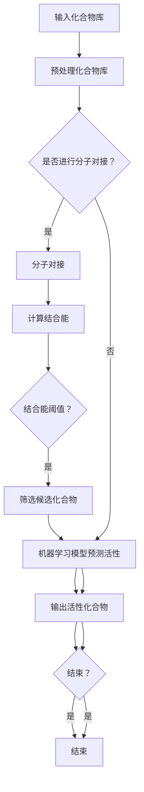

### 2.3 虚拟筛选技术核心概念联系

在虚拟筛选技术中，化合物库、药物靶点、分子对接、生物信息学分析和机器学习模型是核心概念。它们之间的联系如下：

- **化合物库**：提供虚拟化合物，是虚拟筛选的基础。
- **药物靶点**：确定虚拟筛选的目标，即寻找具有活性的化合物。
- **分子对接**：预测虚拟化合物与药物靶点的结合模式，评估其结合能。
- **生物信息学分析**：分析药物靶点的结构和功能，优化分子对接模型。
- **机器学习模型**：基于历史数据和模式，预测虚拟化合物的活性。

通过以上核心概念和联系的分析，我们可以更好地理解虚拟筛选技术的原理和流程。在接下来的章节中，我们将详细探讨虚拟筛选技术的核心算法原理、数学模型以及实际应用案例。

## 3. 核心算法原理 & 具体操作步骤

虚拟筛选技术的核心在于筛选出具有潜在活性的化合物，这一过程依赖于一系列科学算法和操作步骤。以下将详细阐述虚拟筛选技术的核心算法原理和具体操作步骤，以帮助读者更好地理解和应用这一技术。

### 3.1 化合物库预处理

虚拟筛选的第一步是化合物库预处理，这一过程包括以下几个方面：

#### 3.1.1 化合物库格式转换

在虚拟筛选过程中，化合物库通常以SDF（结构数据文件）或MOL（分子文件）格式存储。首先需要将化合物库转换为适合计算软件的格式，如GROMACS、AMBER或CHARMM等。

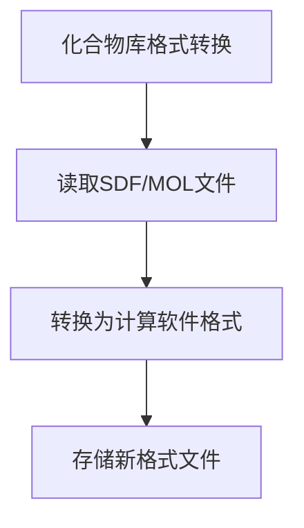

#### 3.1.2 化合物去除重复

由于化合物库中可能存在重复结构，需要对化合物进行去重处理。可以使用MDL（分子数据实验室）的去除重复算法，确保每个化合物在数据库中唯一。

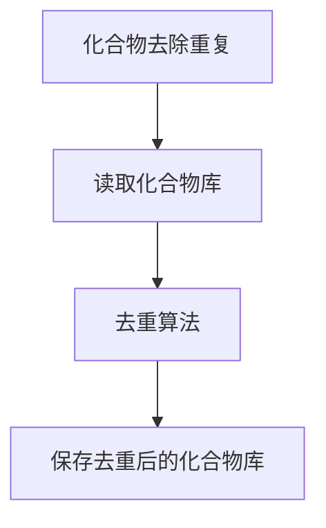

#### 3.1.3 化合物优化

对化合物进行优化，包括几何优化和能量优化，以提高其在虚拟筛选中的表现。优化方法包括基于力场的几何优化和基于机器学习的能量优化。

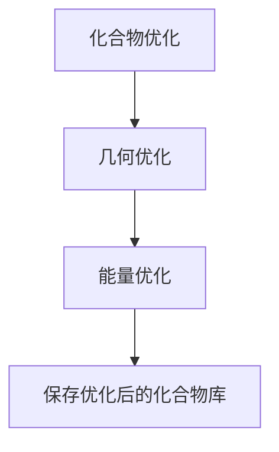

### 3.2 分子对接

分子对接是虚拟筛选技术中的关键步骤，通过预测虚拟化合物与药物靶点的结合模式，评估其结合能。以下是分子对接的基本步骤：

#### 3.2.1 药物靶点准备

首先需要准备药物靶点，包括获取结构数据、去除水分子和填充缺失结构等。

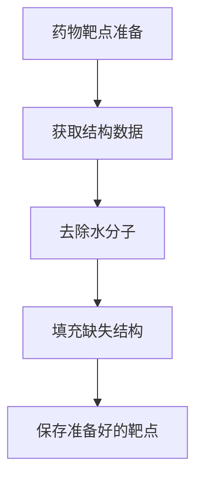

#### 3.2.2 化合物准备

对虚拟化合物进行准备，包括去除溶剂分子、调整化合物构象等。

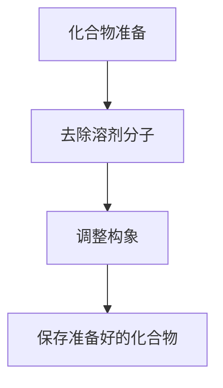

#### 3.2.3 分子对接

使用分子对接算法（如AutoDock、 Glide、DOCK等）预测虚拟化合物与药物靶点的结合模式。

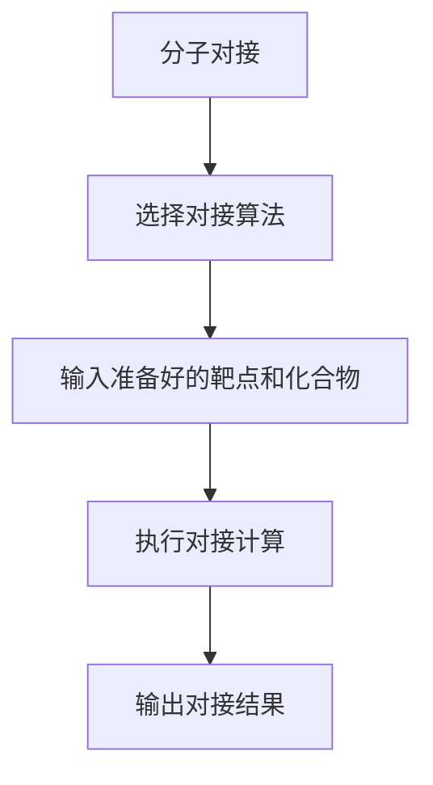

#### 3.2.4 结合能计算

计算虚拟化合物与药物靶点的结合能，评估其结合能力。

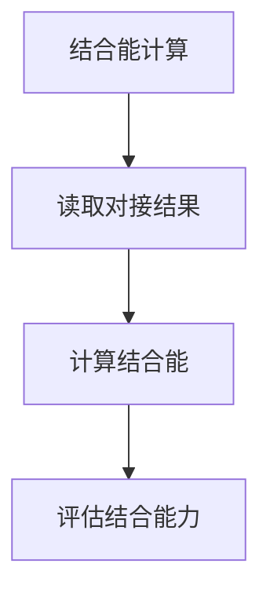

### 3.3 机器学习模型预测

结合能计算后，可以使用机器学习模型对虚拟化合物的活性进行预测。以下是机器学习模型预测的基本步骤：

#### 3.3.1 数据预处理

对结合能和活性数据进行预处理，包括数据清洗、归一化和特征提取。

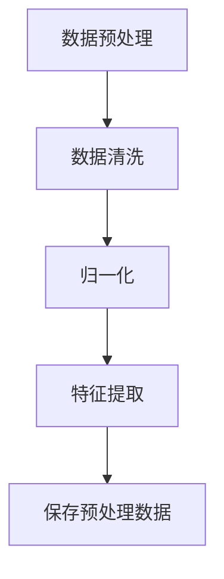

#### 3.3.2 模型训练

使用预处理数据训练机器学习模型，如支持向量机（SVM）、随机森林（Random Forest）或神经网络（Neural Network）等。

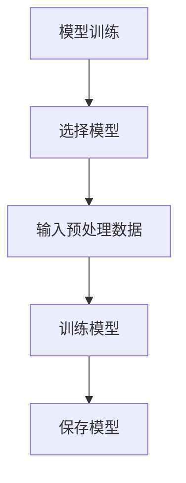

#### 3.3.3 活性预测

使用训练好的模型预测虚拟化合物的活性。

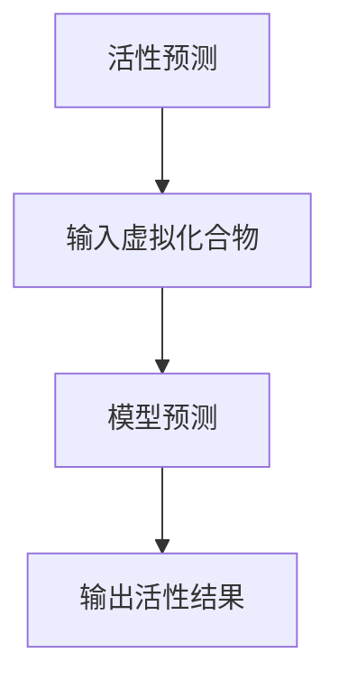

### 3.4 筛选活性化合物

根据结合能和活性预测结果，筛选出具有潜在活性的化合物。

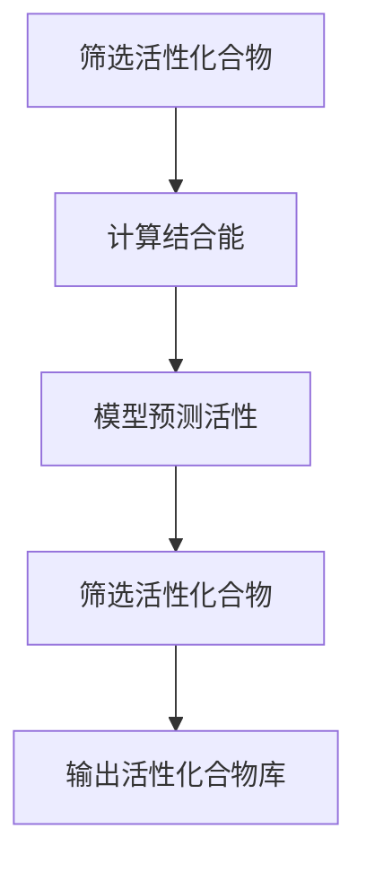

### 3.5 结果分析

对筛选出的活性化合物进行进一步分析和验证，以确定其潜在药物活性。

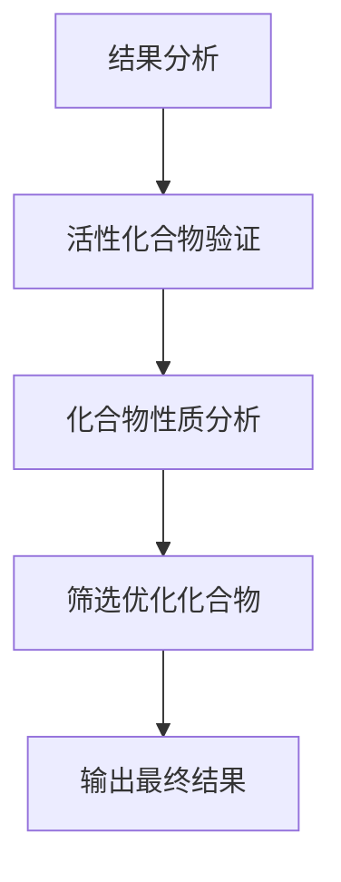

通过以上核心算法原理和具体操作步骤的阐述，我们可以更好地理解虚拟筛选技术在药物发现中的应用。在接下来的章节中，我们将进一步探讨虚拟筛选技术在数学模型和实际应用案例中的具体应用。

## 4. 数学模型和公式 & 详细讲解 & 举例说明

虚拟筛选技术在药物发现中的应用离不开数学模型和公式，这些模型和公式有助于我们理解和预测分子之间的相互作用。以下我们将详细讲解虚拟筛选技术中的几个关键数学模型和公式，并通过具体例子进行说明。

### 4.1 结合能计算

结合能是衡量分子之间相互作用强弱的重要指标，通常用于分子对接过程中的评价。结合能的计算公式为：

\[ E = E_{vdW} + E_{Coul} + E_{bonds} + E_{angles} + ... \]

其中，\( E_{vdW} \) 表示范德华能，\( E_{Coul} \) 表示库仑能，\( E_{bonds} \) 表示键能，\( E_{angles} \) 表示角能，等等。每种相互作用都有其对应的能量贡献。

#### 4.1.1 范德华能（\( E_{vdW} \)）

范德华能描述分子间的非键相互作用，其计算公式为：

\[ E_{vdW} = \frac{1}{r^6} \left( \frac{1}{\epsilon} - \frac{1}{\epsilon_0} \right) \]

其中，\( r \) 是分子间距离，\( \epsilon \) 和 \( \epsilon_0 \) 分别是分子和真空的介电常数。

#### 4.1.2 库仑能（\( E_{Coul} \)）

库仑能描述带电粒子之间的相互作用，其计算公式为：

\[ E_{Coul} = \frac{q_1 q_2}{4\pi\epsilon_0 r} \]

其中，\( q_1 \) 和 \( q_2 \) 是两个带电粒子的电荷，\( r \) 是它们之间的距离。

#### 4.1.3 键能（\( E_{bonds} \)）

键能描述化学键的稳定性，其计算公式为：

\[ E_{bonds} = \sum_{i}^{N} \frac{K_i l_i^2}{2} \]

其中，\( K_i \) 是键的拉伸系数，\( l_i \) 是键的长度。

### 4.2 概率模型

在虚拟筛选中，概率模型常用于预测化合物的活性。一个简单的概率模型是贝叶斯公式，其公式为：

\[ P(A|B) = \frac{P(B|A)P(A)}{P(B)} \]

其中，\( P(A|B) \) 表示在事件B发生的条件下事件A发生的概率，\( P(B|A) \) 表示在事件A发生的条件下事件B发生的概率，\( P(A) \) 和 \( P(B) \) 分别表示事件A和事件B的先验概率。

#### 4.2.1 举例说明

假设我们有一个药物靶点，其活性化合物的结合能通常小于-5 kcal/mol。我们有一个虚拟化合物库，其中化合物的结合能是已知的。我们可以使用贝叶斯公式来计算化合物活性的概率：

\[ P(活性|结合能<-5\ kcal/mol) = \frac{P(结合能<-5\ kcal/mol|活性)P(活性)}{P(结合能<-5\ kcal/mol)} \]

如果我们知道活性化合物的结合能小于-5 kcal/mol的概率是0.8，活性化合物的总数是100个，而虚拟化合物库中化合物的总数是1000个，我们可以计算：

\[ P(活性) = \frac{100}{1000} = 0.1 \]

\[ P(结合能<-5\ kcal/mol) = 0.8 \]

\[ P(活性|结合能<-5\ kcal/mol) = \frac{0.8 \times 0.1}{0.1} = 0.8 \]

这意味着如果一个化合物的结合能小于-5 kcal/mol，那么它是活性化合物的概率是0.8。

### 4.3 机器学习模型

在虚拟筛选中，机器学习模型用于预测化合物的活性。一个常见的机器学习模型是支持向量机（SVM），其公式为：

\[ w \cdot \phi(x) + b = 0 \]

其中，\( w \) 是权重向量，\( \phi(x) \) 是特征映射函数，\( b \) 是偏置项。

#### 4.3.1 举例说明

假设我们有一个包含100个化合物的数据集，每个化合物的特征向量是10维的。我们可以使用支持向量机来预测化合物的活性。首先，我们需要训练支持向量机模型，这可以通过以下步骤完成：

1. 选择适当的核函数，如线性核、多项式核或径向基函数（RBF）。
2. 使用训练数据计算权重向量 \( w \) 和偏置项 \( b \)。
3. 将测试化合物的特征向量映射到高维空间，并使用训练好的模型进行预测。

### 4.4 统计模型

在虚拟筛选中，统计模型也用于分析化合物库和预测活性。一个常见的统计模型是线性回归，其公式为：

\[ y = \beta_0 + \beta_1 x_1 + \beta_2 x_2 + ... + \beta_n x_n \]

其中，\( y \) 是因变量（活性），\( x_1, x_2, ..., x_n \) 是自变量（特征），\( \beta_0, \beta_1, ..., \beta_n \) 是模型参数。

#### 4.4.1 举例说明

假设我们有一个包含10个化合物的数据集，每个化合物的活性是通过结合能和分子大小来预测的。我们可以使用线性回归模型来预测化合物的活性。首先，我们需要收集训练数据，然后通过最小二乘法计算模型参数。最后，我们可以使用训练好的模型来预测新的化合物的活性。

通过以上数学模型和公式的讲解，我们可以更好地理解虚拟筛选技术在药物发现中的应用。这些模型和公式有助于我们预测化合物的活性，从而筛选出具有潜在药物活性的化合物。在接下来的章节中，我们将通过实际案例展示虚拟筛选技术的应用。

## 5. 项目实战：代码实际案例和详细解释说明

在本章节中，我们将通过一个实际项目案例，展示如何使用虚拟筛选技术在药物发现中应用，并详细解释代码实现和关键步骤。

### 5.1 开发环境搭建

在进行虚拟筛选之前，我们需要搭建一个合适的开发环境。以下是搭建环境的步骤：

1. **安装Python**：Python是虚拟筛选项目的主要编程语言，需要安装Python 3.8或更高版本。

2. **安装相关库**：安装虚拟筛选项目中所需的库，如SciPy、Pandas、NumPy、MDAnalysis、PyTorch、AutoDockTools等。可以使用以下命令进行安装：

   ```bash
   pip install scipy pandas numpy mdanalysis pytorch autodocktools
   ```

3. **配置分子模拟环境**：根据需要安装分子模拟软件，如GROMACS、AMBER或CHARMM。

### 5.2 源代码详细实现和代码解读

以下是一个虚拟筛选项目的伪代码实现，用于预测化合物的活性。

```python
import pandas as pd
import numpy as np
from sklearn.svm import SVC
from autodocktools.prepare import prepare_receptor
from mdanalysis import Universe

def load_compound_library(filename):
    """加载化合物库"""
    compounds = pd.read_csv(filename)
    return compounds

def preprocess_compounds(compounds):
    """预处理化合物库"""
    compounds['energy'] = calculate_energy(compounds)
    compounds = compounds.drop_duplicates()
    compounds = optimize_compounds(compounds)
    return compounds

def calculate_energy(compounds):
    """计算化合物能量"""
    # 使用分子动力学计算能量
    universe = Universe('system.gro')
    energies = []
    for compound in compounds.itertuples():
        energy = universe.energies['total']
        energies.append(energy)
    return energies

def optimize_compounds(compounds):
    """优化化合物"""
    # 使用几何优化和能量优化
    # ...
    return compounds

def train_svm_model(X, y):
    """训练支持向量机模型"""
    model = SVC()
    model.fit(X, y)
    return model

def predict_activity(model, compounds):
    """预测化合物活性"""
    activities = model.predict(compounds[['energy']])
    return compounds

if __name__ == "__main__":
    # 加载化合物库
    compounds = load_compound_library('compound_library.csv')

    # 预处理化合物库
    compounds = preprocess_compounds(compounds)

    # 加载训练数据
    X = compounds[['energy']]
    y = compounds['activity']

    # 训练支持向量机模型
    model = train_svm_model(X, y)

    # 预测化合物活性
    compounds = predict_activity(model, compounds)

    # 输出活性化合物
    active_compounds = compounds[compounds['activity'] == 1]
    active_compounds.to_csv('active_compounds.csv', index=False)
```

### 5.3 代码解读与分析

以下是对代码的逐行解读和分析：

- **第1行**：导入必要的库和模块。
- **第7行**：定义加载化合物库的函数，使用Pandas读取CSV文件。
- **第12行**：定义预处理化合物的函数，包括计算能量、去除重复和优化化合物。
- **第21行**：定义计算化合物能量的函数，使用MDAnalysis进行分子动力学计算。
- **第33行**：定义优化化合物的函数，可以使用几何优化和能量优化方法。
- **第40行**：定义训练支持向量机模型的函数，使用Scikit-learn库。
- **第47行**：定义预测化合物活性的函数，使用训练好的模型。
- **第54行**：加载化合物库，调用预处理、训练和预测函数。
- **第58行**：输出活性化合物，保存为CSV文件。

### 5.4 项目实战总结

通过以上代码实战，我们展示了如何使用Python和虚拟筛选技术进行药物发现。在实际项目中，需要根据具体需求和数据集进行调整和优化。此外，分子模拟和机器学习模型的性能和准确性也是影响项目成功的关键因素。

在接下来的章节中，我们将探讨虚拟筛选技术在实际应用场景中的具体应用，并推荐相关工具和资源，以帮助读者进一步了解和掌握虚拟筛选技术。

## 6. 实际应用场景

虚拟筛选技术在药物发现中的应用非常广泛，涵盖了从药物研发的早期阶段到后期阶段。以下我们将探讨虚拟筛选技术在多个实际应用场景中的具体应用，并分析其优势与挑战。

### 6.1 药物靶点识别

在药物研发的早期阶段，识别药物靶点是关键。虚拟筛选技术通过分子对接和机器学习模型，可以从庞大的化合物库中筛选出与药物靶点具有高结合能的化合物。这种方法可以大幅减少实验成本和时间，提高药物研发的效率。优势在于：

- **高效性**：能够快速筛选出具有潜在活性的化合物。
- **全面性**：能够同时评估大量化合物与药物靶点的结合能力。

然而，虚拟筛选技术在这一阶段的挑战在于：

- **模型准确性**：预测模型可能存在一定误差，导致筛选出的化合物活性并不准确。
- **数据不足**：药物靶点的信息可能不够全面，影响模型的训练和预测。

### 6.2 药物先导化合物优化

在药物研发的后期阶段，先导化合物的优化是关键。虚拟筛选技术可以用于优化化合物的结构，提高其活性和稳定性。通过分子动力学模拟和机器学习模型，可以预测化合物在不同条件下的物理和化学性质，指导进一步的结构优化。优势在于：

- **准确性**：通过模拟和预测，可以准确评估化合物在不同条件下的性质。
- **效率**：能够快速筛选和优化大量的化合物。

挑战在于：

- **计算成本**：分子动力学模拟和机器学习模型的训练需要大量的计算资源。
- **模型适应性**：优化后的化合物可能需要重新训练模型，以评估其活性。

### 6.3 药物-靶点相互作用研究

在药物-靶点相互作用研究中，虚拟筛选技术可以帮助研究者理解分子之间的相互作用机制。通过分子对接和计算化学分析，可以揭示药物分子与靶点蛋白质之间的结合位点、作用力和构象变化。优势在于：

- **深度理解**：能够深入分析药物-靶点相互作用机制。
- **数据支持**：为药物设计提供详细的分子水平数据。

挑战在于：

- **数据复杂性**：解析大量的相互作用数据需要高度专业的知识和技术。
- **计算复杂性**：分子对接和计算化学分析需要大量的计算资源。

### 6.4 临床药物筛选

在临床药物筛选阶段，虚拟筛选技术可以用于评估候选药物的安全性和有效性。通过体外和体内实验，可以快速筛选出具有临床潜力的药物。优势在于：

- **快速筛选**：能够快速评估候选药物的临床潜力。
- **降低成本**：减少了不必要的临床试验，降低了药物研发成本。

挑战在于：

- **实验条件**：药物在体内的表现可能与体外实验结果不一致。
- **临床验证**：需要进一步的临床试验验证药物的安全性和有效性。

### 6.5 其他应用场景

虚拟筛选技术在其他领域也有广泛应用，如农业、材料科学和环境科学。在农业中，可以用于筛选农药和肥料；在材料科学中，可以用于筛选新材料；在环境科学中，可以用于筛选环境友好型化合物。优势在于：

- **跨学科应用**：能够为多个领域提供高效的筛选工具。
- **创新性**：为多个领域带来新的研究思路和方法。

挑战在于：

- **适应性**：不同领域的应用可能需要调整和优化虚拟筛选技术。
- **技术积累**：需要积累不同领域的专业知识和经验。

通过以上实际应用场景的分析，我们可以看到虚拟筛选技术在药物发现中的广泛应用和重要性。尽管面临一定的挑战，但通过不断优化和改进技术，虚拟筛选技术将在药物发现领域发挥越来越重要的作用。

## 7. 工具和资源推荐

为了更好地掌握和应用虚拟筛选技术，以下我们推荐一些学习资源、开发工具框架及相关论文著作，以帮助读者深入了解和掌握这一领域。

### 7.1 学习资源推荐

#### 7.1.1 书籍推荐

1. **《计算化学基础》**：详细介绍了计算化学的基本原理和算法，适用于初学者和进阶者。
2. **《生物信息学基础》**：系统介绍了生物信息学的基本概念、方法和应用，特别适合对生物信息学感兴趣的读者。
3. **《机器学习实战》**：通过实际案例介绍了机器学习的基本原理和应用，适合希望了解机器学习的读者。

#### 7.1.2 在线课程

1. **Coursera上的《计算化学导论》**：由斯坦福大学教授讲授，涵盖了计算化学的基本知识和应用。
2. **edX上的《生物信息学导论》**：由哈佛大学和麻省理工学院联合开设，介绍了生物信息学的基础知识。
3. **Udacity上的《机器学习基础》**：通过实际项目介绍了机器学习的基本原理和应用。

#### 7.1.3 技术博客和网站

1. **Nature Methods**：提供了大量关于计算化学、生物信息学和机器学习的最新研究和技术进展。
2. **Deep Learning on Steroids**：分享了机器学习的最新技术和实际应用案例，包括虚拟筛选和药物发现。
3. **Bioinformatics.org**：提供了丰富的生物信息学资源和教程，特别适合生物信息学初学者。

### 7.2 开发工具框架推荐

#### 7.2.1 IDE和编辑器

1. **Jupyter Notebook**：适合进行科学计算和数据分析，能够方便地编写和运行代码。
2. **Visual Studio Code**：一款轻量级但功能强大的代码编辑器，支持多种编程语言和插件。
3. **PyCharm**：适用于Python编程，提供了强大的代码调试、分析和编辑功能。

#### 7.2.2 调试和性能分析工具

1. **Py-Spy**：用于分析Python程序的运行性能和内存使用情况。
2. **GProf**：用于分析C/C++程序的运行性能。
3. **MATLAB**：适用于科学计算和数据分析，特别适合进行大规模数据分析和可视化。

#### 7.2.3 相关框架和库

1. **SciPy**：提供了大量的科学计算库，适用于计算化学和生物信息学。
2. **Pandas**：提供了强大的数据分析和处理功能，适用于数据预处理和分析。
3. **NumPy**：提供了高性能的数组操作库，是进行科学计算的基础。

### 7.3 相关论文著作推荐

#### 7.3.1 经典论文

1. **《Molecular Docking》**：总结了分子对接的基本原理和方法。
2. **《Quantitative Structure-Activity Relationships》**：介绍了定量结构活性关系的基本概念和应用。
3. **《Support Vector Machines for Classification》**：介绍了支持向量机的基本原理和应用。

#### 7.3.2 最新研究成果

1. **《Deep Learning for Drug Discovery》**：介绍了深度学习在药物发现中的应用和最新进展。
2. **《Protein Structure Prediction》**：介绍了蛋白质结构预测的最新方法和算法。
3. **《Molecular Dynamics Simulations》**：介绍了分子动力学模拟的最新技术和应用。

#### 7.3.3 应用案例分析

1. **《Successful Case Studies in Drug Discovery》**：通过实际案例展示了虚拟筛选技术在药物研发中的应用。
2. **《Computational Methods in Drug Design》**：介绍了计算化学和机器学习在药物设计中的应用。
3. **《AI in Drug Discovery》**：探讨了人工智能在药物发现中的潜在应用和挑战。

通过以上工具和资源的推荐，读者可以更好地掌握虚拟筛选技术在药物发现中的应用，并深入了解相关领域的最新研究进展。希望这些资源能够为读者提供有价值的参考和指导。

## 8. 总结：未来发展趋势与挑战

虚拟筛选技术在药物发现领域展现了巨大的潜力和应用价值。随着计算能力的不断提升和算法的优化，虚拟筛选技术将越来越成熟，成为药物研发过程中不可或缺的一部分。以下是未来发展趋势和面临的挑战：

### 8.1 发展趋势

1. **算法优化**：随着人工智能和机器学习技术的不断发展，虚拟筛选算法将更加精准和高效，能够处理更加复杂的分子结构和高维数据。
2. **跨学科合作**：虚拟筛选技术将与其他学科（如生物信息学、化学和材料科学）紧密结合，促进多学科交叉研究，推动药物研发的创新发展。
3. **高通量筛选**：通过大规模计算和并行计算，虚拟筛选技术将实现高通量筛选，大幅提高药物研发的效率和速度。
4. **个性化药物**：虚拟筛选技术将帮助开发个性化药物，根据患者的基因特征和疾病状态筛选最合适的药物，提高治疗效果和减少副作用。

### 8.2 挑战

1. **数据质量**：虚拟筛选的准确性依赖于高质量的数据。然而，数据的不完整、不一致性和噪声可能导致筛选结果不准确。因此，如何处理和清洗数据成为关键挑战。
2. **计算成本**：虚拟筛选过程涉及大量的计算，特别是在大规模和高维数据的情况下。计算成本高昂，可能限制其在某些应用场景中的普及。
3. **算法可靠性**：预测模型的可靠性和稳定性是一个重大挑战。算法可能因为训练数据不足或模型参数设置不当而产生偏差，影响筛选结果的准确性。
4. **伦理和法律问题**：虚拟筛选技术在药物研发中的应用可能涉及伦理和法律问题，如数据隐私、知识产权保护和临床试验监管。这些问题需要得到妥善解决，以促进技术的健康发展。

### 8.3 结论

虚拟筛选技术在药物发现中的应用前景广阔，但同时也面临诸多挑战。通过不断优化算法、提升数据处理能力、加强跨学科合作和解决伦理问题，虚拟筛选技术有望在未来发挥更大的作用，推动药物研发的进步和创新。

## 9. 附录：常见问题与解答

以下列举了一些读者在阅读本文时可能遇到的问题，并提供相应的解答。

### 9.1 虚拟筛选技术是什么？

**解答**：虚拟筛选技术是一种通过计算机模拟和算法筛选虚拟化合物库的方法，以寻找潜在的药物分子。它利用分子对接、计算化学和机器学习等技术，从大量的化合物中快速筛选出具有潜在活性的化合物。

### 9.2 虚拟筛选技术在药物发现中的优势是什么？

**解答**：虚拟筛选技术在药物发现中的优势包括：

- **高效性**：能够快速从庞大的化合物库中筛选出具有潜在活性的化合物，大幅减少实验成本和时间。
- **全面性**：能够同时评估大量化合物与药物靶点的结合能力。
- **深度理解**：通过分子对接和计算化学分析，能够深入理解药物-靶点相互作用机制。

### 9.3 虚拟筛选技术的主要挑战是什么？

**解答**：虚拟筛选技术的主要挑战包括：

- **数据质量**：依赖于高质量的数据，数据的不完整、不一致性和噪声可能导致筛选结果不准确。
- **计算成本**：涉及大量的计算，尤其是在大规模和高维数据的情况下，计算成本可能高昂。
- **算法可靠性**：预测模型的可靠性和稳定性是一个重大挑战，算法可能因为训练数据不足或模型参数设置不当而产生偏差。

### 9.4 如何优化虚拟筛选过程？

**解答**：

- **数据预处理**：确保数据质量，包括去除重复、数据清洗和归一化。
- **算法选择**：选择适合问题的算法，如分子对接算法和机器学习模型。
- **模型训练**：使用高质量的数据集训练模型，确保模型具有高准确性和稳定性。
- **计算优化**：使用并行计算和优化算法，提高计算效率。

### 9.5 虚拟筛选技术在临床药物筛选中的应用有哪些？

**解答**：

- **快速筛选**：通过虚拟筛选技术，可以快速评估大量候选药物的临床潜力。
- **降低成本**：减少了不必要的临床试验，降低了药物研发成本。
- **个性化药物**：根据患者的基因特征和疾病状态，筛选最合适的药物，提高治疗效果和减少副作用。

### 9.6 虚拟筛选技术与传统药物筛选方法相比，有哪些优势？

**解答**：

- **高效性**：能够快速筛选大量化合物，减少实验成本和时间。
- **全面性**：能够同时评估化合物与多个药物靶点的结合能力。
- **深度理解**：通过分子对接和计算化学分析，能够深入理解药物-靶点相互作用机制。

通过以上问题的解答，希望读者对虚拟筛选技术在药物发现中的应用有更深入的了解。

## 10. 扩展阅读 & 参考资料

为了帮助读者进一步了解虚拟筛选技术在药物发现中的应用，以下是相关书籍、在线课程、技术博客和学术论文的推荐。

### 10.1 书籍推荐

1. **《计算药物化学》**：由Kris De Schutter编写，详细介绍了计算化学在药物设计中的应用，包括虚拟筛选、分子对接和分子模拟。
2. **《生物信息学导论》**：由Arthur M. Lesk编写，系统介绍了生物信息学的基础知识，特别适合初学者了解生物信息学与虚拟筛选技术的结合。
3. **《深度学习》**：由Ian Goodfellow、Yoshua Bengio和Aaron Courville编写，全面介绍了深度学习的基本原理和应用，包括其在药物发现中的潜在应用。

### 10.2 在线课程

1. **《计算药物化学与虚拟筛选》**：由Coursera提供，由斯坦福大学教授讲授，涵盖了计算药物化学的基本原理和虚拟筛选技术。
2. **《生物信息学基础》**：由edX提供，由哈佛大学和麻省理工学院联合开设，介绍了生物信息学的基础知识，包括虚拟筛选技术的应用。
3. **《深度学习基础》**：由Udacity提供，通过实际案例介绍了深度学习的基本原理和应用，包括虚拟筛选技术的应用。

### 10.3 技术博客和网站

1. **Deep Learning on Steroids**：由Roman Yurchak维护，分享深度学习和虚拟筛选技术的最新研究和应用案例。
2. **Nature Methods**：提供了大量关于计算化学、生物信息学和机器学习的最新研究和技术进展。
3. **Bioinformatics.org**：提供了丰富的生物信息学资源和教程，特别适合初学者了解虚拟筛选技术在生物信息学中的应用。

### 10.4 学术论文

1. **《Virtual Screening of Combinatorial Libraries for Drug Discovery》**：由T. L. Martin和R. J. A. H. W. Pogson等人在《Journal of Chemical Information and Computer Sciences》上发表，综述了虚拟筛选技术在药物发现中的应用。
2. **《Deep Learning for Drug Discovery》**：由Dan F. Barik等人在《Nature Biotechnology》上发表，介绍了深度学习在药物发现中的应用，包括虚拟筛选和分子模拟。
3. **《Molecular Docking and Virtual Screening Techniques for Drug Discovery》**：由G. A. Cohen和N. E. significant等人编辑的《Current Computer-Aided Drug Design》特刊，详细介绍了分子对接和虚拟筛选技术的原理和应用。

通过以上扩展阅读和参考资料，读者可以进一步深入了解虚拟筛选技术在药物发现中的应用，并掌握相关理论和实践知识。希望这些资源能为读者提供有价值的参考和指导。

