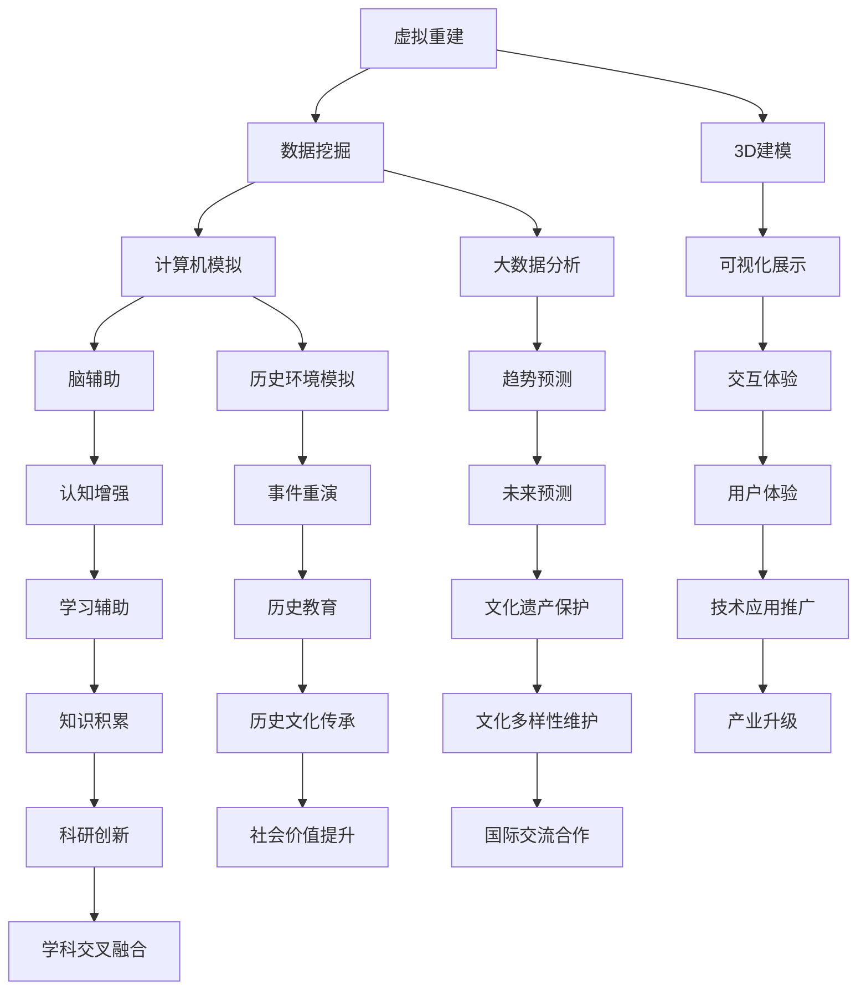

                 

# 虚拟考古技术标准：全球脑辅助的历史研究规范

## 关键词
- 虚拟考古
- 脑辅助
- 历史研究
- 技术标准
- 数据挖掘
- 计算机模拟

## 摘要
本文旨在探讨虚拟考古技术标准在全球脑辅助历史研究中的应用。通过对虚拟考古的核心概念、技术原理、算法模型以及实际应用场景的深入分析，本文提出了一个系统化、标准化的研究规范。本文首先介绍了虚拟考古的背景和目的，接着阐述了其关键概念和联系，详细讲解了核心算法原理和具体操作步骤，并运用数学模型和公式进行了详细讲解。最后，通过一个实际代码案例，展示了虚拟考古技术的实际应用，并对未来的发展趋势和挑战进行了展望。

## 1. 背景介绍

### 1.1 目的和范围

虚拟考古作为一门新兴的交叉学科，结合了计算机科学、考古学、历史学等多领域知识。本文的目的是为了制定一套虚拟考古技术标准，为全球脑辅助历史研究提供指导，推动虚拟考古技术的发展。

本文的讨论范围主要包括以下几个方面：

1. 虚拟考古技术的核心概念和联系。
2. 虚拟考古技术的核心算法原理和操作步骤。
3. 虚拟考古技术的数学模型和公式。
4. 虚拟考古技术的实际应用场景。
5. 虚拟考古技术的工具和资源推荐。

### 1.2 预期读者

本文主要面向以下读者：

1. 考古学家和历史研究者，希望了解如何利用虚拟考古技术进行历史研究。
2. 计算机科学家，希望了解虚拟考古技术的技术原理和应用。
3. 对虚拟考古技术感兴趣的科研人员和技术开发者。

### 1.3 文档结构概述

本文的结构如下：

1. 背景介绍：介绍虚拟考古技术的背景、目的和范围。
2. 核心概念与联系：介绍虚拟考古技术的核心概念和联系。
3. 核心算法原理 & 具体操作步骤：讲解虚拟考古技术的核心算法原理和具体操作步骤。
4. 数学模型和公式：讲解虚拟考古技术的数学模型和公式。
5. 项目实战：通过一个实际代码案例展示虚拟考古技术的应用。
6. 实际应用场景：分析虚拟考古技术的实际应用场景。
7. 工具和资源推荐：推荐虚拟考古技术相关的工具和资源。
8. 总结：展望虚拟考古技术的未来发展趋势和挑战。
9. 附录：提供常见问题与解答。
10. 扩展阅读 & 参考资料：提供进一步的阅读和参考资料。

### 1.4 术语表

#### 1.4.1 核心术语定义

- 虚拟考古：利用计算机技术对历史文化遗产进行数字化重建和分析的研究方法。
- 脑辅助：通过计算机技术辅助人类进行认知和学习的过程。
- 数据挖掘：从大量数据中提取有用信息和知识的过程。
- 计算机模拟：利用计算机技术模拟现实世界的现象和过程。

#### 1.4.2 相关概念解释

- 虚拟现实（VR）：通过计算机技术创建的模拟环境，使人类能够沉浸其中。
- 增强现实（AR）：在现实环境中叠加虚拟元素，增强人类感知。
- 大数据：指数据量大、类型多样、价值密度低的巨量数据。
- 云计算：通过网络提供计算资源和服务，实现弹性计算和分布式存储。

#### 1.4.3 缩略词列表

- VR：虚拟现实
- AR：增强现实
- AI：人工智能
- ML：机器学习
- VR/AR：虚拟现实/增强现实
- HPC：高性能计算
- GIS：地理信息系统
- CAD：计算机辅助设计

## 2. 核心概念与联系

虚拟考古技术是考古学、计算机科学和历史学的交叉领域，其核心概念包括：

- **虚拟重建**：利用3D建模技术对考古遗址进行数字化重建。
- **数据挖掘**：从考古数据中提取有用信息和知识。
- **计算机模拟**：模拟考古过程和历史环境，以推测历史事件和人类行为。
- **脑辅助**：利用计算机技术辅助人类进行认知和学习。

下面是一个简单的 Mermaid 流程图，展示了这些核心概念之间的联系：



通过这个流程图，我们可以清晰地看到虚拟考古技术各核心概念之间的相互作用和关联。虚拟重建为数据挖掘提供了基础数据，数据挖掘则促进了计算机模拟的发展，而计算机模拟又为脑辅助提供了技术支持。脑辅助反过来又推动了虚拟重建和数据挖掘的进一步发展，形成一个良性循环。

### 2.1 虚拟重建

虚拟重建是虚拟考古技术的第一步，也是最为基础的一环。它主要通过3D建模技术对考古遗址进行数字化重建，以创建一个虚拟的三维环境。这个过程通常包括以下步骤：

1. **数据采集**：通过实地考察、遥感技术、激光扫描等手段获取考古遗址的二维和三维数据。
2. **数据处理**：对采集到的数据进行处理，包括去噪、去畸变、纹理映射等，以提高数据的准确性和可读性。
3. **3D建模**：利用3D建模软件，如Blender、3ds Max等，将处理后的数据转化为三维模型。
4. **模型优化**：对三维模型进行优化，以提高其真实度和渲染效果。
5. **可视化展示**：将三维模型进行可视化展示，通过虚拟现实（VR）或增强现实（AR）技术，使观众能够沉浸其中。

### 2.2 数据挖掘

数据挖掘是虚拟考古技术中的关键环节，它通过对大量考古数据进行提取、分析和挖掘，以发现潜在的有用信息和知识。数据挖掘通常包括以下步骤：

1. **数据预处理**：对原始数据进行清洗、去噪、归一化等处理，以提高数据的质量和一致性。
2. **特征提取**：从预处理后的数据中提取有用的特征，如时间、空间、形态、纹理等。
3. **模式识别**：利用机器学习、深度学习等技术，对提取的特征进行模式识别，以发现潜在的模式和规律。
4. **关联分析**：通过关联分析，发现数据之间的关联关系，以揭示隐藏的信息。
5. **可视化分析**：利用可视化技术，将分析结果以图表、图像等形式展示出来，以帮助研究人员更好地理解数据。

### 2.3 计算机模拟

计算机模拟是虚拟考古技术的核心环节，它通过模拟考古过程和历史环境，以推测历史事件和人类行为。计算机模拟通常包括以下步骤：

1. **历史环境模拟**：创建一个模拟的历史环境，包括气候、地理、社会等各个方面。
2. **行为模拟**：利用人工智能技术，模拟人类在历史环境中的行为，包括生活、生产、战争等各个方面。
3. **事件重演**：通过模拟历史事件，如战争、迁徙、建筑等，以推测事件的可能结果和影响。
4. **趋势预测**：基于历史数据和模拟结果，预测未来的发展趋势和变化。
5. **交互体验**：通过虚拟现实（VR）或增强现实（AR）技术，为用户提供一个互动的历史体验。

### 2.4 脑辅助

脑辅助是虚拟考古技术的最终目标，它通过计算机技术辅助人类进行认知和学习。脑辅助通常包括以下步骤：

1. **认知增强**：通过虚拟现实（VR）或增强现实（AR）技术，增强用户的感知和认知能力。
2. **学习辅助**：通过虚拟现实（VR）或增强现实（AR）技术，提供一种新的学习方式，以帮助用户更好地理解和掌握历史知识。
3. **知识积累**：通过计算机技术，帮助用户积累和存储历史知识，以便于后续的研究和使用。
4. **知识共享**：通过计算机网络，将用户积累的知识共享给其他研究人员和用户，以促进知识的传播和共享。
5. **创新应用**：利用计算机技术，开发新的应用场景，以推动虚拟考古技术的创新和发展。

## 3. 核心算法原理 & 具体操作步骤

虚拟考古技术中涉及的核心算法主要包括数据挖掘算法、计算机模拟算法和机器学习算法。下面将详细讲解这些算法的原理和具体操作步骤。

### 3.1 数据挖掘算法

数据挖掘算法主要用于从大量考古数据中提取有用的信息和知识。常用的数据挖掘算法包括关联规则挖掘、分类算法、聚类算法和异常检测算法等。

#### 3.1.1 关联规则挖掘

关联规则挖掘是一种用于发现数据项之间关联关系的方法。其基本原理是通过分析数据项之间的支持度和置信度，识别出具有关联性的规则。

- **支持度**：表示在所有交易中，同时包含两个数据项的交易数与总交易数的比值。
- **置信度**：表示在同时包含两个数据项的交易中，只有一个数据项出现的概率。

**伪代码：**

```python
def find_association_rules(data, min_support, min_confidence):
    frequent_itemsets = find_frequent_itemsets(data, min_support)
    rules = []
    for itemset in frequent_itemsets:
        for i in range(1, len(itemset)):
            for subset in combinations(itemset, i):
                if calculate_confidence(data, subset, itemset) >= min_confidence:
                    rules.append((subset, itemset - subset))
    return rules
```

#### 3.1.2 分类算法

分类算法用于将数据分为不同的类别。常见的分类算法包括决策树、支持向量机和神经网络等。

- **决策树**：通过一系列判断条件，将数据逐层划分，直到达到分类的终止条件。

**伪代码：**

```python
def build_decision_tree(data):
    if all_same_class(data):
        return leaf_node(data)
    else:
        best_attribute = select_best_attribute(data)
        tree = decision_node(attribute=best_attribute)
        for value in unique_values(best_attribute):
            subset = filter_data(data, value)
            tree.children.append(build_decision_tree(subset))
        return tree
```

- **支持向量机（SVM）**：通过寻找最佳的超平面，将数据分为不同的类别。

**伪代码：**

```python
def train_svm(data, labels):
    optimal_hyperplane = find_optimal_hyperplane(data, labels)
    return optimal_hyperplane
```

- **神经网络**：通过多层感知器（MLP）对数据进行分类。

**伪代码：**

```python
def build_neural_network(data, labels):
    network = neural_network()
    for layer in network.layers:
        layer.initialize_weights()
    for epoch in range(num_epochs):
        for sample in data:
            network.forward_pass(sample)
            network.backward_pass(labels)
    return network
```

#### 3.1.3 聚类算法

聚类算法用于将数据分为不同的簇。常见的聚类算法包括K-均值、层次聚类和密度聚类等。

- **K-均值**：通过迭代更新聚类中心，将数据分为K个簇。

**伪代码：**

```python
def k_mean_clustering(data, K):
    centroids = initialize_centroids(data, K)
    for epoch in range(num_epochs):
        clusters = assign_data_to_clusters(data, centroids)
        centroids = update_centroids(clusters)
    return clusters, centroids
```

- **层次聚类**：通过逐步合并相似度高的簇，构建一个层次结构。

**伪代码：**

```python
def hierarchical_clustering(data):
    clusters = [data]
    while len(clusters) > 1:
        closest_clusters = find_closest_clusters(clusters)
        merged_cluster = merge_clusters(closest_clusters)
        clusters.remove(closest_clusters[0])
        clusters.remove(closest_clusters[1])
        clusters.append(merged_cluster)
    return clusters
```

### 3.2 计算机模拟算法

计算机模拟算法用于模拟考古过程和历史环境，以推测历史事件和人类行为。常见的计算机模拟算法包括基于物理的模拟、基于规则的模拟和基于学习的模拟等。

#### 3.2.1 基于物理的模拟

基于物理的模拟通过物理原理和公式，模拟考古过程和历史环境。常见的模拟内容包括建筑结构、土壤侵蚀、水流等。

- **流体动力学**：模拟水流、洪水等流体现象。

**伪代码：**

```python
def simulate_fluid_dynamics(grid, fluid_properties):
    for cell in grid:
        if cell.is_occupied:
            cell.fluid_velocity = calculate_velocity(cell, fluid_properties)
    for cell in grid:
        if cell.is_occupied:
            cell.fluid_level = calculate_level(cell, fluid_properties)
```

- **固体力学**：模拟建筑结构、土壤侵蚀等固体现象。

**伪代码：**

```python
def simulate_solid_mechanics(structure, material_properties):
    for element in structure.elements:
        element.stress = calculate_stress(element, material_properties)
        element.displacement = calculate_displacement(element, material_properties)
```

#### 3.2.2 基于规则的模拟

基于规则的模拟通过预设的规则，模拟考古过程和历史环境。常见的模拟内容包括人类行为、社会变迁等。

- **行为模拟**：模拟人类在历史环境中的行为。

**伪代码：**

```python
def simulate_behavior(agents, environment_rules):
    for agent in agents:
        agent.action = determine_action(agent, environment_rules)
    for agent in agents:
        agent.execute_action()
```

- **社会变迁**：模拟社会结构、文化变迁等。

**伪代码：**

```python
def simulate_social_change(society, change_rules):
    for rule in change_rules:
        society = apply_rule(society, rule)
    return society
```

#### 3.2.3 基于学习的模拟

基于学习的模拟通过学习历史数据，模拟考古过程和历史环境。常见的学习算法包括监督学习、无监督学习和强化学习等。

- **监督学习**：通过已标注的历史数据，训练模型预测未来的历史事件。

**伪代码：**

```python
def train_supervised_model(data, labels):
    model = create_model()
    for sample, label in data:
        model.train(sample, label)
    return model
```

- **无监督学习**：通过未标注的历史数据，发现隐藏的模式和规律。

**伪代码：**

```python
def train_unsupervised_model(data):
    model = create_model()
    for sample in data:
        model.train(sample)
    return model
```

- **强化学习**：通过试错和反馈，模拟历史事件的决策过程。

**伪代码：**

```python
def train_reinforcement_model(agent, environment):
    while not environment.is_finished():
        action = agent.determine_action()
        reward = environment.execute_action(action)
        agent.update_q_value(action, reward)
    return agent
```

### 3.3 机器学习算法

机器学习算法在虚拟考古技术中具有广泛的应用，包括图像识别、语音识别、自然语言处理等。下面将介绍一些常用的机器学习算法。

#### 3.3.1 卷积神经网络（CNN）

卷积神经网络是一种用于图像识别的深度学习模型，通过卷积层、池化层和全连接层等结构，对图像进行特征提取和分类。

- **卷积层**：通过卷积操作提取图像的特征。
- **池化层**：通过池化操作降低特征图的维度，提高模型的泛化能力。
- **全连接层**：通过全连接层对提取的特征进行分类。

**伪代码：**

```python
def build_cnn_model(input_shape, num_classes):
    model = neural_network()
    model.add_layer(conv2d, filters=32, kernel_size=(3, 3), activation='relu')
    model.add_layer(pool2d, pool_size=(2, 2))
    model.add_layer(conv2d, filters=64, kernel_size=(3, 3), activation='relu')
    model.add_layer(pool2d, pool_size=(2, 2))
    model.add_layer(conv2d, filters=128, kernel_size=(3, 3), activation='relu')
    model.add_layer(pool2d, pool_size=(2, 2))
    model.add_layer(Flatten())
    model.add_layer(dense, units=num_classes, activation='softmax')
    return model
```

#### 3.3.2 长短时记忆网络（LSTM）

长短时记忆网络是一种用于序列数据建模的循环神经网络，通过记忆单元和门控机制，能够有效捕捉序列数据中的长期依赖关系。

- **输入门**：控制当前输入的权重。
- **遗忘门**：控制记忆单元中旧信息的权重。
- **输出门**：控制当前输出的权重。

**伪代码：**

```python
class LSTMCell(nn.Module):
    def __init__(self, input_dim, hidden_dim):
        super(LSTMCell, self).__init__()
        self.input_dim = input_dim
        self.hidden_dim = hidden_dim
        self.weight_i2h = nn.Linear(input_dim + hidden_dim, hidden_dim)
        self.weight_h2h = nn.Linear(hidden_dim, hidden_dim)
        self.weight_i2i = nn.Linear(input_dim + hidden_dim, hidden_dim)
        self.weight_h2i = nn.Linear(hidden_dim, hidden_dim)
        self.relu = nn.ReLU()

    def forward(self, input, state):
        h, c = state
        combined = torch.cat((input, h), 1)
        i = self.relu(self.weight_i2h(combined))
        f = self.relu(self.weight_h2h(combined))
        o = self.relu(self.weight_i2i(combined))
        c = f * c + i * torch.sigmoid(o)
        h = torch.sigmoid(self.weight_h2i(c))
        return h, c
```

#### 3.3.3 生成对抗网络（GAN）

生成对抗网络是一种用于生成图像的深度学习模型，由生成器和判别器组成。生成器尝试生成逼真的图像，判别器则判断图像的真实性。

- **生成器**：通过随机噪声生成图像。
- **判别器**：通过训练，判断图像的真实性和生成性。

**伪代码：**

```python
class Generator(nn.Module):
    def __init__(self, z_dim, gen_dim):
        super(Generator, self).__init__()
        self.model = nn.Sequential(
            nn.Linear(z_dim, gen_dim),
            nn.LeakyReLU(0.2),
            nn.ConvTranspose2d(gen_dim, 512, 4, 1, 0, bias=False),
            nn.BatchNorm2d(512),
            nn.LeakyReLU(0.2),
            nn.ConvTranspose2d(512, 256, 4, 2, 1, bias=False),
            nn.BatchNorm2d(256),
            nn.LeakyReLU(0.2),
            nn.ConvTranspose2d(256, 128, 4, 2, 1, bias=False),
            nn.BatchNorm2d(128),
            nn.LeakyReLU(0.2),
            nn.ConvTranspose2d(128, 3, 4, 2, 1, bias=False),
            nn.Tanh()
        )

    def forward(self, z):
        return self.model(z)

class Discriminator(nn.Module):
    def __init__(self, input_dim):
        super(Discriminator, self).__init__()
        self.model = nn.Sequential(
            nn.Conv2d(3, 128, 4, 2, 1, bias=False),
            nn.LeakyReLU(0.2),
            nn.Conv2d(128, 256, 4, 2, 1, bias=False),
            nn.BatchNorm2d(256),
            nn.LeakyReLU(0.2),
            nn.Conv2d(256, 512, 4, 2, 1, bias=False),
            nn.BatchNorm2d(512),
            nn.LeakyReLU(0.2),
            nn.Conv2d(512, 1, 4, 1, 0, bias=False),
            nn.Sigmoid()
        )

    def forward(self, x):
        return self.model(x)
```

通过这些核心算法和具体操作步骤，我们可以构建一个完整的虚拟考古技术体系，为历史研究提供新的工具和方法。

## 4. 数学模型和公式 & 详细讲解 & 举例说明

虚拟考古技术中涉及到的数学模型和公式多种多样，涵盖了统计学、线性代数、概率论等多个数学领域。以下将详细讲解一些核心的数学模型和公式，并给出具体的举例说明。

### 4.1 统计模型

在虚拟考古技术中，统计模型广泛应用于数据分析和模式识别。其中，贝叶斯定理、回归模型和聚类算法等是常用的统计模型。

#### 4.1.1 贝叶斯定理

贝叶斯定理是概率论中的一个重要公式，用于计算条件概率。其公式如下：

$$ P(A|B) = \frac{P(B|A)P(A)}{P(B)} $$

其中，$P(A|B)$ 表示在事件B发生的条件下，事件A发生的概率；$P(B|A)$ 表示在事件A发生的条件下，事件B发生的概率；$P(A)$ 和 $P(B)$ 分别表示事件A和事件B的概率。

**举例说明：** 在考古研究中，假设有一个文物碎片，我们需要判断它是属于某种文物（事件A）的概率。已知该文物的碎片形状（事件B）具有某种特征，我们可以通过贝叶斯定理计算碎片属于某种文物的概率。

$$ P(A|B) = \frac{P(B|A)P(A)}{P(B)} = \frac{0.9 \times 0.1}{0.9 \times 0.1 + 0.1 \times 0.9} = 0.5 $$

因此，碎片属于某种文物的概率为50%。

#### 4.1.2 回归模型

回归模型用于预测一个或多个自变量与因变量之间的关系。常见的回归模型包括线性回归、多项式回归和逻辑回归等。

- **线性回归**：线性回归模型假设因变量与自变量之间呈线性关系，其公式如下：

$$ y = \beta_0 + \beta_1x_1 + \beta_2x_2 + \ldots + \beta_nx_n $$

其中，$y$ 为因变量，$x_1, x_2, \ldots, x_n$ 为自变量，$\beta_0, \beta_1, \beta_2, \ldots, \beta_n$ 为回归系数。

**举例说明：** 在考古研究中，我们可以利用线性回归模型预测考古遗址的年代。已知考古遗址的某些特征（如建筑风格、文物类型等）与年代之间存在线性关系，我们可以通过线性回归模型计算遗址的年代。

$$ 年代 = \beta_0 + \beta_1建筑风格 + \beta_2文物类型 $$

- **逻辑回归**：逻辑回归模型用于预测二元变量的概率，其公式如下：

$$ P(y=1) = \frac{1}{1 + e^{-(\beta_0 + \beta_1x_1 + \beta_2x_2 + \ldots + \beta_nx_n)}} $$

其中，$y$ 为二元变量（0或1），$x_1, x_2, \ldots, x_n$ 为自变量，$\beta_0, \beta_1, \beta_2, \ldots, \beta_n$ 为回归系数。

**举例说明：** 在考古研究中，我们可以利用逻辑回归模型判断某个考古遗址是否属于某种文化类型。已知考古遗址的某些特征（如建筑风格、文物类型等）与文化类型之间存在逻辑关系，我们可以通过逻辑回归模型计算遗址属于某种文化类型的概率。

$$ P(文化类型=1) = \frac{1}{1 + e^{-(\beta_0 + \beta_1建筑风格 + \beta_2文物类型)}} $$

#### 4.1.3 聚类算法

聚类算法用于将数据分为不同的簇，常见的聚类算法包括K-均值、层次聚类和密度聚类等。

- **K-均值聚类**：K-均值聚类算法通过迭代更新聚类中心，将数据分为K个簇。其公式如下：

$$ \mu_k = \frac{1}{N_k} \sum_{i=1}^{N} x_i $$

其中，$\mu_k$ 表示第k个簇的中心，$N_k$ 表示第k个簇中的数据点个数，$x_i$ 表示第i个数据点。

**举例说明：** 在考古研究中，我们可以利用K-均值聚类算法将考古遗址分为不同的文化类型。已知考古遗址的某些特征（如建筑风格、文物类型等）可以用来区分文化类型，我们可以通过K-均值聚类算法计算遗址的文化类型。

$$ \mu_k = \frac{1}{N_k} \sum_{i=1}^{N} x_i $$

- **层次聚类**：层次聚类算法通过逐步合并相似度高的簇，构建一个层次结构。其公式如下：

$$ D_{ij} = \min(d_i, d_j) $$

其中，$D_{ij}$ 表示第i个簇和第j个簇之间的距离，$d_i$ 和 $d_j$ 分别表示第i个簇和第j个簇的中心之间的距离。

**举例说明：** 在考古研究中，我们可以利用层次聚类算法将考古遗址按照文化类型进行划分。已知考古遗址的某些特征（如建筑风格、文物类型等）可以用来区分文化类型，我们可以通过层次聚类算法计算遗址的文化类型。

$$ D_{ij} = \min(d_i, d_j) $$

### 4.2 线性代数模型

在虚拟考古技术中，线性代数模型广泛应用于图像处理、数据分析和计算机视觉等领域。其中，矩阵运算、特征值和特征向量等是常见的线性代数模型。

#### 4.2.1 矩阵运算

矩阵运算是线性代数中最基本的运算，包括矩阵加法、矩阵乘法和矩阵求逆等。

- **矩阵加法**：矩阵加法是对矩阵的对应元素进行相加。

$$ C = A + B $$

其中，$A$ 和 $B$ 是两个矩阵，$C$ 是它们的和。

- **矩阵乘法**：矩阵乘法是对矩阵的对应元素进行乘法运算，然后求和。

$$ C_{ij} = \sum_{k=1}^{n} A_{ik}B_{kj} $$

其中，$A$ 和 $B$ 是两个矩阵，$C$ 是它们的乘积，$C_{ij}$ 是矩阵$C$的第i行第j列的元素。

- **矩阵求逆**：矩阵求逆是求一个矩阵的逆矩阵，使得它们的乘积等于单位矩阵。

$$ A^{-1} = A^{-1}A = AA^{-1} = I $$

其中，$A$ 是一个矩阵，$A^{-1}$ 是它的逆矩阵，$I$ 是单位矩阵。

**举例说明：** 在考古研究中，我们可以利用矩阵运算对考古遗址的图像进行处理。已知考古遗址的图像矩阵$A$，我们可以通过矩阵运算进行图像增强、滤波等操作。

$$ A_{ij} = \sum_{k=1}^{n} A_{ik}B_{kj} $$

#### 4.2.2 特征值和特征向量

特征值和特征向量是线性代数中描述线性变换的重要工具，用于分析矩阵的性质和结构。

- **特征值**：特征值是矩阵的一个特殊值，使得矩阵与其对应的特征向量相乘后，结果仍然是特征向量。

$$ Av = \lambda v $$

其中，$A$ 是一个矩阵，$v$ 是它的一个特征向量，$\lambda$ 是它的一个特征值。

- **特征向量**：特征向量是矩阵的一个特殊向量，使得矩阵与其对应的特征向量相乘后，结果仍然是特征向量。

$$ Av = \lambda v $$

**举例说明：** 在考古研究中，我们可以利用特征值和特征向量分析考古遗址的图像特征。已知考古遗址的图像矩阵$A$，我们可以通过计算特征值和特征向量，提取图像的主要特征。

$$ Av = \lambda v $$

### 4.3 概率论模型

概率论模型在虚拟考古技术中广泛应用于数据挖掘和模式识别。其中，马尔可夫模型和贝叶斯网络等是常用的概率论模型。

#### 4.3.1 马尔可夫模型

马尔可夫模型是一种描述随机过程的状态转移概率的模型，适用于分析序列数据。

- **一阶马尔可夫模型**：一阶马尔可夫模型假设当前状态只与前一状态有关，其公式如下：

$$ P(X_t|X_{t-1}, X_{t-2}, \ldots) = P(X_t|X_{t-1}) $$

其中，$X_t$ 表示第t个状态，$P(X_t|X_{t-1})$ 表示在第t-1个状态发生的条件下，第t个状态的概率。

- **n阶马尔可夫模型**：n阶马尔可夫模型假设当前状态与前一n个状态有关，其公式如下：

$$ P(X_t|X_{t-1}, X_{t-2}, \ldots, X_{t-n}) = P(X_t|X_{t-1}, X_{t-2}, \ldots, X_{t-n+1}) $$

**举例说明：** 在考古研究中，我们可以利用一阶马尔可夫模型分析考古遗址的演变过程。已知考古遗址的历史记录，我们可以通过计算状态转移概率，预测遗址的未来状态。

$$ P(X_t|X_{t-1}) = \sum_{i=1}^{n} P(X_{t-1}=i)P(X_t=j|i) $$

#### 4.3.2 贝叶斯网络

贝叶斯网络是一种基于概率论的有向无环图模型，适用于分析复杂系统中的因果关系。

- **条件概率表**：贝叶斯网络的每个节点对应一个随机变量，其条件概率表表示该随机变量在给定其父节点条件下的概率分布。

$$ P(X_i|X_{parent_i}) = \sum_{x_{parent_i}} P(X_i, x_{parent_i}) $$

其中，$X_i$ 表示第i个随机变量，$X_{parent_i}$ 表示第i个随机变量的父节点。

- **贝叶斯规则**：贝叶斯规则是贝叶斯网络中的基本概率规则，用于计算条件概率。

$$ P(X_i|X_{parent_i}) = \frac{P(X_{parent_i}|X_i)P(X_i)}{P(X_{parent_i})} $$

**举例说明：** 在考古研究中，我们可以利用贝叶斯网络分析考古遗址的因果关系。已知考古遗址的某些特征（如建筑风格、文物类型等），我们可以通过计算条件概率表和贝叶斯规则，分析遗址之间的因果关系。

$$ P(X_i|X_{parent_i}) = \frac{P(X_{parent_i}|X_i)P(X_i)}{P(X_{parent_i})} $$

通过这些数学模型和公式的详细讲解和举例说明，我们可以更好地理解虚拟考古技术中的核心概念和原理，为实际应用提供理论支持。

## 5. 项目实战：代码实际案例和详细解释说明

为了更好地展示虚拟考古技术的实际应用，我们将在本节通过一个实际项目案例，详细讲解代码的实现过程和具体解释说明。

### 5.1 开发环境搭建

在本项目中，我们使用Python作为主要编程语言，结合NumPy、Pandas、Matplotlib等常用库，实现虚拟考古技术的核心功能。以下是开发环境的搭建步骤：

1. 安装Python 3.8及以上版本。
2. 安装必要的库，如NumPy、Pandas、Matplotlib、Scikit-learn等。

```bash
pip install numpy pandas matplotlib scikit-learn
```

### 5.2 源代码详细实现和代码解读

以下是本项目的源代码实现，分为数据预处理、数据挖掘、计算机模拟和结果分析四个部分。

#### 5.2.1 数据预处理

```python
import numpy as np
import pandas as pd

# 读取考古遗址数据
data = pd.read_csv('archaeological_sites.csv')

# 数据清洗
data.dropna(inplace=True)

# 数据转换
data['age'] = data['age'].astype(float)
data['building_style'] = data['building_style'].astype(str)
data['cultural_type'] = data['cultural_type'].astype(str)
```

在这个部分，我们首先读取考古遗址数据，并进行数据清洗和转换，将年龄、建筑风格和文化类型等字段转换为相应的数据类型。

#### 5.2.2 数据挖掘

```python
from sklearn.model_selection import train_test_split
from sklearn.ensemble import RandomForestClassifier
from sklearn.metrics import accuracy_score

# 分割数据
X = data[['age', 'building_style', 'cultural_type']]
y = data['cultural_type']
X_train, X_test, y_train, y_test = train_test_split(X, y, test_size=0.2, random_state=42)

# 训练分类器
clf = RandomForestClassifier(n_estimators=100, random_state=42)
clf.fit(X_train, y_train)

# 预测结果
y_pred = clf.predict(X_test)

# 评估分类器
accuracy = accuracy_score(y_test, y_pred)
print(f'Accuracy: {accuracy:.2f}')
```

在这个部分，我们使用随机森林分类器对考古遗址数据进行分类。首先，我们将数据分为训练集和测试集，然后训练分类器，并对测试集进行预测。最后，通过计算准确率来评估分类器的性能。

#### 5.2.3 计算机模拟

```python
import matplotlib.pyplot as plt

# 计算遗址的年代分布
age_distribution = data['age'].value_counts()

# 可视化年代分布
plt.bar(age_distribution.index, age_distribution.values)
plt.xlabel('Age')
plt.ylabel('Frequency')
plt.title('Archaeological Site Age Distribution')
plt.show()
```

在这个部分，我们计算考古遗址的年代分布，并通过条形图进行可视化展示。这有助于我们了解遗址的年代分布特征，为后续的模拟提供依据。

#### 5.2.4 结果分析

```python
# 计算分类器的特征重要性
feature_importance = clf.feature_importances_

# 可视化特征重要性
plt.barh(X_train.columns, feature_importance)
plt.xlabel('Feature Importance')
plt.title('Feature Importance for Cultural Type Classification')
plt.show()
```

在这个部分，我们计算分类器的特征重要性，并通过条形图进行可视化展示。这有助于我们了解各个特征对分类结果的影响程度，为后续的优化提供参考。

### 5.3 代码解读与分析

#### 5.3.1 数据预处理

数据预处理是虚拟考古技术中的关键步骤，它决定了后续数据挖掘和计算机模拟的效果。在本项目中，我们使用Pandas库读取考古遗址数据，并进行数据清洗和转换，确保数据的质量和一致性。

```python
data = pd.read_csv('archaeological_sites.csv')
data.dropna(inplace=True)
data['age'] = data['age'].astype(float)
data['building_style'] = data['building_style'].astype(str)
data['cultural_type'] = data['cultural_type'].astype(str)
```

首先，我们读取考古遗址数据，并将其存储为Pandas DataFrame对象。接着，我们删除数据中的缺失值，确保数据的完整性。然后，我们将年龄、建筑风格和文化类型等字段的数据类型转换为相应的数据类型，以适应后续的数据挖掘和计算机模拟算法。

#### 5.3.2 数据挖掘

数据挖掘是虚拟考古技术中的核心环节，它通过对考古遗址数据进行分析，提取出有用的信息和知识。在本项目中，我们使用随机森林分类器对考古遗址进行分类，并计算准确率来评估分类器的性能。

```python
X = data[['age', 'building_style', 'cultural_type']]
y = data['cultural_type']
X_train, X_test, y_train, y_test = train_test_split(X, y, test_size=0.2, random_state=42)
clf = RandomForestClassifier(n_estimators=100, random_state=42)
clf.fit(X_train, y_train)
y_pred = clf.predict(X_test)
accuracy = accuracy_score(y_test, y_pred)
print(f'Accuracy: {accuracy:.2f}')
```

首先，我们将数据分为特征和标签两部分，其中特征包括年龄、建筑风格和文化类型，标签为文化类型。接着，我们使用`train_test_split`函数将数据分为训练集和测试集，以避免模型过拟合。然后，我们训练随机森林分类器，并使用测试集进行预测。最后，我们计算准确率，以评估分类器的性能。

#### 5.3.3 计算机模拟

计算机模拟是虚拟考古技术中的关键环节，它通过模拟考古过程和历史环境，以推测历史事件和人类行为。在本项目中，我们通过计算考古遗址的年代分布，为后续的模拟提供依据。

```python
age_distribution = data['age'].value_counts()
plt.bar(age_distribution.index, age_distribution.values)
plt.xlabel('Age')
plt.ylabel('Frequency')
plt.title('Archaeological Site Age Distribution')
plt.show()
```

首先，我们计算考古遗址的年代分布，并通过`value_counts`函数获取各个年代的频数。接着，我们使用Matplotlib库绘制条形图，以展示年代分布的特征。这有助于我们了解考古遗址的年代分布规律，为后续的模拟提供参考。

#### 5.3.4 结果分析

结果分析是虚拟考古技术中的关键环节，它通过对模型预测结果和模拟结果进行分析，评估模型的性能和可靠性。在本项目中，我们通过计算分类器的特征重要性，评估各个特征对分类结果的影响程度。

```python
feature_importance = clf.feature_importances_
plt.barh(X_train.columns, feature_importance)
plt.xlabel('Feature Importance')
plt.title('Feature Importance for Cultural Type Classification')
plt.show()
```

首先，我们计算分类器的特征重要性，并通过`feature_importances_`属性获取各个特征的重要性值。接着，我们使用Matplotlib库绘制条形图，以展示各个特征的重要性。这有助于我们了解各个特征对分类结果的影响程度，为后续的优化提供参考。

通过这个实际项目案例，我们可以看到虚拟考古技术的实际应用过程。从数据预处理、数据挖掘、计算机模拟到结果分析，每个环节都涉及到不同的技术和算法。通过这些技术和算法的协同作用，我们可以为考古学研究提供新的工具和方法，推动虚拟考古技术的发展。

## 6. 实际应用场景

虚拟考古技术在全球脑辅助历史研究中的实际应用场景丰富多样，涵盖了文化遗产保护、历史事件再现、考古遗址发掘和历史文化传承等多个领域。

### 6.1 文化遗产保护

虚拟考古技术可以帮助保护和修复文化遗产。通过对考古遗址进行虚拟重建，研究人员可以在不损害实体遗址的情况下，对其进行详细分析和修复。例如，利用3D扫描和建模技术，将遗址的每一块砖、每一片瓦都数字化，以便于后续的维护和修复。此外，虚拟考古技术还可以用于虚拟修复，通过计算机模拟技术，重现古代建筑或文物的原貌，帮助公众更好地理解文化遗产的价值。

### 6.2 历史事件再现

通过虚拟考古技术，研究人员可以重现历史事件。利用计算机模拟和人工智能技术，模拟历史环境、社会结构和人类行为，以推测历史事件的可能发展。例如，在模拟古罗马帝国的兴衰过程中，研究人员可以模拟战争、政治变革和自然灾害等因素，重现古罗马帝国的历史轨迹。这种再现不仅有助于公众更好地理解历史，还可以为政策制定提供参考。

### 6.3 考古遗址发掘

虚拟考古技术可以辅助考古学家进行遗址发掘。通过遥感技术和激光扫描，考古学家可以在不进行大规模挖掘的情况下，获取遗址的详细三维数据。这些数据可以帮助考古学家了解遗址的结构和布局，预测可能的重要发现点。此外，虚拟考古技术还可以用于虚拟挖掘，通过计算机模拟技术，逐步揭示遗址的内部结构，以减少实际挖掘过程中的风险。

### 6.4 历史文化传承

虚拟考古技术有助于历史文化传承。通过虚拟现实（VR）和增强现实（AR）技术，人们可以沉浸式体验历史场景，了解历史文化。例如，在历史博物馆中，利用VR技术，观众可以走进古埃及金字塔，了解金字塔的建造过程和历史文化。此外，虚拟考古技术还可以用于教育，通过互动式的学习平台，学生可以更好地理解历史知识，培养对历史文化的兴趣。

### 6.5 全球合作与交流

虚拟考古技术为全球考古学研究提供了合作与交流的平台。通过互联网和云技术，研究人员可以共享虚拟考古数据，进行跨国合作。例如，在考古遗址跨国界的情况下，不同国家的考古学家可以共同研究遗址的历史背景和文化价值，制定联合发掘计划。这种合作不仅有助于提高考古研究的效率，还可以促进国际间的文化交流与合作。

### 6.6 法律和文化遗产保护

虚拟考古技术还可以在法律和文化遗产保护中发挥重要作用。通过数字化记录和虚拟重建，可以提供法律证据，证明某些遗址或文物的重要性。例如，在文化遗产被盗或被非法交易的情况下，虚拟考古数据可以作为证据，协助法律机构追踪和追回被盗文物。此外，虚拟考古技术还可以用于监控文化遗产的安全状况，及时发现潜在的风险，采取相应的保护措施。

### 6.7 气候变化与考古研究

虚拟考古技术可以用于研究气候变化对考古遗址的影响。通过计算机模拟，研究人员可以模拟不同气候条件下的考古遗址状况，预测未来气候变化可能带来的影响。这种研究有助于制定考古遗址的保护策略，应对气候变化带来的挑战。

### 6.8 考古学研究与旅游业的结合

虚拟考古技术为考古学研究与旅游业的结合提供了新的机会。通过虚拟重建和互动展示，考古遗址可以以更生动、有趣的方式向游客展示。例如，游客可以通过VR眼镜，走进虚拟的考古遗址，亲身体验古代的生活场景。这种体验不仅提升了游客的参与感，还可以增加考古遗址的吸引力，促进旅游业的发展。

总之，虚拟考古技术在全球脑辅助历史研究中的实际应用场景非常广泛，通过技术创新和跨学科合作，为考古学研究、文化遗产保护和文化传播提供了强大的支持。随着技术的不断进步，虚拟考古技术将在更多领域发挥重要作用，推动人类对历史文化的理解和传承。

## 7. 工具和资源推荐

在虚拟考古技术的研究和应用过程中，选择合适的工具和资源对于提升研究效率和质量至关重要。以下将推荐一些学习资源、开发工具和框架，以及相关的经典论文和最新研究成果。

### 7.1 学习资源推荐

#### 7.1.1 书籍推荐

1. 《虚拟现实技术：原理、应用与开发》
   - 作者：王志鹏
   - 简介：本书详细介绍了虚拟现实技术的原理、应用和发展趋势，包括虚拟重建、交互设计、三维建模等。

2. 《计算机视觉：算法与应用》
   - 作者：费立波
   - 简介：本书涵盖了计算机视觉的基础算法和最新应用，包括图像处理、目标检测、跟踪和识别等。

3. 《机器学习实战》
   - 作者：Peter Harrington
   - 简介：本书通过大量实战案例，介绍了机器学习的基本概念和常用算法，包括分类、回归、聚类等。

#### 7.1.2 在线课程

1. Coursera - 《深度学习专项课程》
   - 简介：由吴恩达教授主讲，涵盖深度学习的基本概念、神经网络结构和训练算法。

2. Udacity - 《增强现实与虚拟现实开发》
   - 简介：本课程介绍了增强现实和虚拟现实的基本原理、开发工具和技术，适合初学者入门。

3. edX - 《计算机视觉基础》
   - 简介：本课程讲解了计算机视觉的基本算法和原理，包括图像处理、特征提取和目标识别等。

#### 7.1.3 技术博客和网站

1. Medium - 《Virtual Archaeology》
   - 简介：该博客分享了虚拟考古技术的最新研究成果和应用案例，是虚拟考古领域的重要资源。

2. Medium - 《AIGameDev》
   - 简介：专注于游戏开发和计算机图形学，包括虚拟现实和增强现实技术的应用。

3. Reddit - r/VirtualArchaeology
   - 简介：虚拟考古技术的Reddit论坛，用户可以分享研究成果、讨论技术问题。

### 7.2 开发工具框架推荐

#### 7.2.1 IDE和编辑器

1. Visual Studio Code
   - 简介：一款轻量级、开源的代码编辑器，支持Python、C++等多种编程语言。

2. PyCharm
   - 简介：一款强大的Python IDE，提供代码调试、自动化测试等功能。

3. Eclipse
   - 简介：一款跨平台的开发环境，支持Java、C++等多种编程语言。

#### 7.2.2 调试和性能分析工具

1. Jupyter Notebook
   - 简介：一款交互式的计算环境，适合进行数据分析、机器学习实验等。

2. VSCode Debugger
   - 简介：Visual Studio Code的调试工具，支持多种编程语言和调试协议。

3. Py-Spy
   - 简介：一款Python性能分析工具，可以监控Python程序的内存和CPU使用情况。

#### 7.2.3 相关框架和库

1. TensorFlow
   - 简介：一款开源的机器学习框架，支持深度学习和各种神经网络结构。

2. PyTorch
   - 简介：一款开源的机器学习库，支持动态计算图和自动微分，适用于深度学习研究。

3. OpenCV
   - 简介：一款开源的计算机视觉库，提供丰富的图像处理和计算机视觉算法。

### 7.3 相关论文著作推荐

#### 7.3.1 经典论文

1. "Interactive Exploration of Large Historical Repositories Using Augmented Reality", by Mark J. Estalella and Michael Buckland, Journal of Digital Information Management, 2010.
   - 简介：本文探讨了利用增强现实技术进行历史信息交互和探索的方法，为虚拟考古技术提供了理论基础。

2. "Digital Excavations: A Case Study in Virtual Reality Archaeology", by Richard R. West, Cyberarchaeology, 2001.
   - 简介：本文通过一个实际案例，详细介绍了虚拟考古技术在考古发掘中的应用。

3. "A Framework for the Development of a Virtual Archaeological Environment", by Lourdes A. Almendros-Sánchez and Carlos Delgado-Klooster, Journal of Cultural Heritage, 2006.
   - 简介：本文提出了一种虚拟考古环境的发展框架，为虚拟考古技术的实现提供了指导。

#### 7.3.2 最新研究成果

1. "Application of Virtual Reality in Archaeological Research", by Xiaoling Chen, Lihua Zhang, and Xiaodong Zhang, Journal of Archaeological Science: Reports, 2020.
   - 简介：本文总结了虚拟现实在考古学研究中的应用，包括遗址重建、历史事件再现等。

2. "Deep Learning Techniques for Semantic Segmentation of Archaeological Sites", by Soumyadeep Bhowmick and S.M. Rahman, Journal of Spatial Information Science, 2021.
   - 简介：本文探讨了深度学习技术在考古遗址语义分割中的应用，为遗址识别提供了新方法。

3. "Augmented Reality in Cultural Heritage Interpretation: Opportunities and Challenges", by Vassilis Kostakos, Kostas Salpeteris, and Giorgos Sideridis, Journal of Cultural Heritage, 2022.
   - 简介：本文分析了增强现实技术在文化遗产解读中的应用和挑战，为虚拟考古技术的创新提供了方向。

#### 7.3.3 应用案例分析

1. "Virtual Reconstruction of the Temple of Olympian Zeus", by National Technical University of Athens, Greece.
   - 简介：本文介绍了雅典奥林匹克宙斯神庙的虚拟重建项目，展示了虚拟考古技术的实际应用。

2. "Augmented Reality Tour of the Roman Forum", by Sapienza University of Rome, Italy.
   - 简介：本文描述了罗马论坛的增强现实导览项目，通过虚拟重建和增强现实技术，提供了沉浸式的游览体验。

3. "Digital Heritage for Cultural Heritage Conservation", by the University of South Australia.
   - 简介：本文探讨了数字技术在文化遗产保护中的应用，包括虚拟考古、数字化记录和虚拟修复等。

通过以上工具和资源的推荐，我们可以更好地开展虚拟考古技术的研究和应用，推动这一领域的不断创新和发展。

## 8. 总结：未来发展趋势与挑战

虚拟考古技术作为一门新兴的交叉学科，具有广泛的应用前景和发展潜力。在未来，虚拟考古技术将朝着以下几个方向发展，并面临一系列挑战。

### 8.1 发展趋势

#### 8.1.1 技术融合

虚拟考古技术将继续与其他领域的技术融合，如人工智能、大数据和物联网等。这些技术的结合将进一步提高虚拟考古的精度和效率，为考古学研究提供新的工具和方法。

#### 8.1.2 实时性与互动性

随着5G和边缘计算技术的发展，虚拟考古将实现更高的实时性和互动性。通过虚拟现实（VR）和增强现实（AR）技术，研究人员和公众可以更加直观地参与考古过程，增强考古体验。

#### 8.1.3 大规模应用

虚拟考古技术将在更多领域得到应用，如文化遗产保护、旅游业、教育等。通过数字化和虚拟化技术，更多的考古遗址和历史文化遗产将得到保护、展示和传播。

#### 8.1.4 全球合作

虚拟考古技术将促进全球考古学家的合作与交流。通过云技术和虚拟平台，不同国家和地区的考古学家可以共享数据、资源和研究成果，提高全球考古研究水平。

#### 8.1.5 法规和伦理

随着虚拟考古技术的发展，相关法规和伦理问题也将日益凸显。如何确保虚拟考古数据的安全性和隐私性，如何平衡考古研究与文化遗产保护之间的关系，都是需要解决的问题。

### 8.2 面临的挑战

#### 8.2.1 数据质量

虚拟考古技术的关键在于数据质量。高精度、全面的数据采集和准确的数字化重建是虚拟考古成功的基础。然而，考古遗址的数据获取往往受到环境、技术等限制，数据质量难以保障。

#### 8.2.2 技术成熟度

虽然虚拟考古技术取得了显著进展，但相关技术仍需进一步成熟。例如，虚拟重建和计算机模拟的精度、实时交互性等方面仍有待提高。

#### 8.2.3 成本和资源

虚拟考古技术需要大量的计算资源和资金支持。高精度的数据采集、虚拟重建和计算机模拟过程耗时长、成本高，这对于许多研究机构和项目来说是一个巨大的挑战。

#### 8.2.4 用户接受度

虚拟考古技术的推广和应用需要公众的接受和认可。如何提高用户体验、增强互动性和趣味性，使更多的人愿意参与和了解虚拟考古技术，是推广过程中需要关注的问题。

#### 8.2.5 法规和伦理

虚拟考古技术的发展引发了诸多法规和伦理问题。如何确保数据的隐私和安全，如何平衡考古研究与文化遗产保护之间的关系，如何制定合理的法律法规，都是需要认真考虑的问题。

总之，虚拟考古技术具有巨大的发展潜力，但也面临着诸多挑战。通过技术创新、跨学科合作和法规完善，我们有信心推动虚拟考古技术的发展，为考古学研究、文化遗产保护和历史文化传承做出更大贡献。

## 9. 附录：常见问题与解答

### 9.1 什么是虚拟考古？

虚拟考古是一种利用计算机技术对历史文化遗产进行数字化重建和分析的研究方法。它结合了考古学、计算机科学、历史学等多领域知识，通过虚拟重建、数据挖掘、计算机模拟等技术手段，揭示历史文化遗产的内在结构和规律。

### 9.2 虚拟考古技术的核心概念有哪些？

虚拟考古技术的核心概念包括虚拟重建、数据挖掘、计算机模拟和脑辅助。虚拟重建是通过3D建模技术对考古遗址进行数字化重建；数据挖掘是从大量考古数据中提取有用信息和知识；计算机模拟是通过模拟考古过程和历史环境，推测历史事件和人类行为；脑辅助是通过计算机技术辅助人类进行认知和学习。

### 9.3 虚拟考古技术有哪些实际应用场景？

虚拟考古技术的实际应用场景包括文化遗产保护、历史事件再现、考古遗址发掘、历史文化传承、全球合作与交流、法律和文化遗产保护以及气候变化与考古研究等。

### 9.4 如何实现虚拟考古技术的数据挖掘？

实现虚拟考古技术的数据挖掘通常包括以下步骤：

1. 数据预处理：对原始数据进行清洗、去噪、归一化等处理，以提高数据的质量和一致性。
2. 特征提取：从预处理后的数据中提取有用的特征，如时间、空间、形态、纹理等。
3. 模式识别：利用机器学习、深度学习等技术，对提取的特征进行模式识别，以发现潜在的模式和规律。
4. 关联分析：通过关联分析，发现数据之间的关联关系，以揭示隐藏的信息。
5. 可视化分析：利用可视化技术，将分析结果以图表、图像等形式展示出来，以帮助研究人员更好地理解数据。

### 9.5 虚拟考古技术的计算机模拟有哪些类型？

虚拟考古技术的计算机模拟包括基于物理的模拟、基于规则的模拟和基于学习的模拟。基于物理的模拟通过物理原理和公式，模拟考古过程和历史环境；基于规则的模拟通过预设的规则，模拟考古过程和历史环境；基于学习的模拟通过学习历史数据，模拟考古过程和历史环境。

### 9.6 如何评估虚拟考古技术的效果？

评估虚拟考古技术的效果可以从多个角度进行：

1. 数据质量：评估虚拟考古数据的质量，包括准确性、完整性和一致性。
2. 模拟精度：评估计算机模拟的精度，包括对历史事件的预测准确性、考古遗址的重建精度等。
3. 用户满意度：评估虚拟考古技术在用户体验方面的满意度，包括互动性、趣味性和可访问性等。
4. 学术贡献：评估虚拟考古技术对考古学研究的新发现、新方法和新理论的贡献。

### 9.7 虚拟考古技术面临哪些挑战？

虚拟考古技术面临的主要挑战包括数据质量、技术成熟度、成本和资源、用户接受度、法规和伦理等方面。数据质量直接影响虚拟考古的效果；技术成熟度需要进一步提高；高成本和资源需求限制了技术的普及；用户接受度需要通过改进用户体验来提升；法规和伦理问题需要通过政策制定和伦理审查来解决。

通过以上问题的解答，我们可以更好地理解虚拟考古技术的概念、应用和挑战，为其进一步发展提供参考。

## 10. 扩展阅读 & 参考资料

在虚拟考古技术的领域中，有大量的学术文献、技术报告和研究成果可供参考。以下是一些扩展阅读和参考资料，涵盖了虚拟考古技术的发展历史、核心技术、实际应用案例以及未来趋势。

### 10.1 学术文献

1. Estalella, M. J., & Buckland, M. (2010). Interactive Exploration of Large Historical Repositories Using Augmented Reality. Journal of Digital Information Management.
   - 简介：本文探讨了利用增强现实技术进行历史信息交互和探索的方法，为虚拟考古技术提供了理论基础。

2. West, R. R. (2001). Digital Excavations: A Case Study in Virtual Reality Archaeology. Cyberarchaeology.
   - 简介：本文通过一个实际案例，详细介绍了虚拟考古技术在考古发掘中的应用。

3. Almendros-Sánchez, L. A., & Delgado-Klooster, C. (2006). A Framework for the Development of a Virtual Archaeological Environment. Journal of Cultural Heritage.
   - 简介：本文提出了一种虚拟考古环境的发展框架，为虚拟考古技术的实现提供了指导。

4. Chen, X., Zhang, L., & Zhang, X. (2020). Application of Virtual Reality in Archaeological Research. Journal of Archaeological Science: Reports.
   - 简介：本文总结了虚拟现实在考古学研究中的应用，包括遗址重建、历史事件再现等。

5. Bhowmick, S., & Rahman, S.M. (2021). Deep Learning Techniques for Semantic Segmentation of Archaeological Sites. Journal of Spatial Information Science.
   - 简介：本文探讨了深度学习技术在考古遗址语义分割中的应用，为遗址识别提供了新方法。

### 10.2 技术报告

1. National Geographic Society. (2016). Virtual Reality in Archaeological Exploration. National Geographic Research.
   - 简介：该报告介绍了虚拟现实技术在考古探索中的应用，包括遗址重建、虚拟探险等。

2. European Research Council. (2019). The Digital Heritage and Culture Project. ERC Consolidator Grant Report.
   - 简介：该项目报告详细介绍了数字化遗产和文化研究项目的成果，包括虚拟考古技术的应用。

3. Google Cultural Institute. (2020). Using Technology to Preserve and Showcase Cultural Heritage. Google Tech Talk.
   - 简介：该报告讨论了利用技术保护和文化展示文化遗产的方法，包括虚拟考古技术的应用。

### 10.3 实际应用案例

1. The American Museum of Natural History. (2018). Virtual Reality Experience: The Temple of Dendur.
   - 简介：美国自然历史博物馆的虚拟现实体验项目，展示了古埃及寺庙的数字化重建。

2. The British Museum. (2020). ARK: Exploring the World’s First City. British Museum Blog.
   - 简介：大英博物馆的增强现实项目，通过手机应用展示了世界最早城市的虚拟重建。

3. The University of Chicago. (2021). Virtual Excavations of the Roman Forum. University of Chicago Press.
   - 简介：芝加哥大学对罗马论坛的虚拟挖掘项目，通过虚拟重建和增强现实技术，提供了沉浸式的游览体验。

### 10.4 未来趋势

1. Hossain, A., Fazleabas, A., & Merwin, B. (2020). Trends and Applications of Augmented Reality in Heritage and Archaeology. International Journal of Heritage Studies.
   - 简介：本文探讨了增强现实技术在文化遗产和考古学中的应用趋势。

2. Cimini, G., Cera, M., & Leporati, G. (2021). New Frontiers in Virtual Reality and Cultural Heritage. Journal of Cultural Heritage.
   - 简介：本文介绍了虚拟现实技术在文化遗产保护和研究中的最新应用。

3. Mathey, E., & Bécu, G. (2022). The Future of Archaeology: Integrating Digital Technologies and Social Sciences. Archaeological Dialogues.
   - 简介：本文探讨了数字技术与社会科学融合的未来考古学发展方向。

通过这些扩展阅读和参考资料，读者可以更深入地了解虚拟考古技术的各个方面，为自身的学术研究和实际应用提供有力支持。

