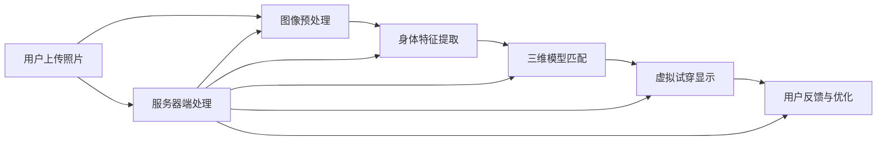

                 

# 虚拟试衣间：AI如何提升电商平台购物体验

> 关键词：虚拟试衣间、AI技术、电商平台、购物体验、计算机视觉、深度学习、图像识别、算法优化

> 摘要：本文将探讨如何利用AI技术，特别是计算机视觉和深度学习，在电商平台上实现虚拟试衣间的功能，从而显著提升用户购物体验。文章将从背景介绍、核心概念与联系、核心算法原理与具体操作步骤、数学模型与公式详细讲解、项目实战、实际应用场景、工具和资源推荐等多个角度，全面解析这一新兴技术的原理与应用。

## 1. 背景介绍

### 1.1 目的和范围

本文旨在探讨如何通过AI技术，特别是计算机视觉和深度学习，实现电商平台上的虚拟试衣间功能。该功能能够帮助用户在家中虚拟试穿衣物，从而减少试衣的不便和购物时的决策成本。本文将详细分析这一技术的实现原理、操作步骤以及在实际中的应用。

### 1.2 预期读者

本文面向对AI和计算机视觉技术有一定了解的技术人员、软件开发者和电商从业人员。通过本文，读者可以全面了解虚拟试衣间技术的基本原理和应用，并掌握相关技术实施的关键步骤。

### 1.3 文档结构概述

本文结构如下：

1. **背景介绍**：介绍本文的目的、预期读者和文档结构。
2. **核心概念与联系**：介绍与虚拟试衣间相关的重要概念和流程。
3. **核心算法原理 & 具体操作步骤**：详细阐述虚拟试衣间算法的实现原理和操作步骤。
4. **数学模型和公式 & 详细讲解 & 举例说明**：介绍支撑虚拟试衣间算法的数学模型和公式。
5. **项目实战：代码实际案例和详细解释说明**：通过实际代码案例展示虚拟试衣间的实现过程。
6. **实际应用场景**：分析虚拟试衣间技术在不同电商场景中的应用。
7. **工具和资源推荐**：推荐学习资源、开发工具和框架。
8. **总结：未来发展趋势与挑战**：总结本文内容，展望未来发展趋势与挑战。
9. **附录：常见问题与解答**：解答读者可能遇到的问题。
10. **扩展阅读 & 参考资料**：提供进一步学习的参考资料。

### 1.4 术语表

#### 1.4.1 核心术语定义

- **虚拟试衣间**：一种利用计算机视觉和深度学习技术，帮助用户在家中虚拟试穿衣物的系统。
- **计算机视觉**：使计算机能够“看到”和理解图像的一种技术。
- **深度学习**：一种基于神经网络模型，通过学习大量数据自动提取特征的学习方法。
- **图像识别**：计算机对图像中的物体、场景或活动进行识别和分类的过程。
- **算法优化**：通过对算法进行改进，提高其效率和准确性。

#### 1.4.2 相关概念解释

- **卷积神经网络（CNN）**：一种专门用于处理图像数据的人工神经网络，能够自动提取图像中的特征。
- **生成对抗网络（GAN）**：一种通过对抗训练生成逼真图像的神经网络架构。

#### 1.4.3 缩略词列表

- **AI**：人工智能
- **CNN**：卷积神经网络
- **GAN**：生成对抗网络
- **API**：应用程序编程接口

## 2. 核心概念与联系

### 2.1 虚拟试衣间的核心概念

虚拟试衣间的核心概念包括用户输入、图像处理、特征提取和匹配显示。具体来说，用户通过电商平台上传自己的照片，平台通过计算机视觉技术分析用户图像，提取用户身体特征，然后将这些特征与衣物的三维模型进行匹配，生成虚拟试穿效果。

### 2.2 虚拟试衣间的流程

虚拟试衣间的流程可以分为以下几个步骤：

1. **用户上传照片**：用户在电商平台上上传个人照片，照片中应包含用户全身以及需要试穿的衣物。
2. **图像预处理**：对上传的照片进行预处理，包括去噪、增强对比度、调整亮度和颜色等。
3. **身体特征提取**：利用计算机视觉技术，从预处理后的图像中提取用户的身体轮廓和关键点。
4. **三维模型匹配**：根据用户身体特征，从数据库中选择合适的衣物三维模型，并进行匹配。
5. **虚拟试穿显示**：将匹配后的衣物模型与用户图像融合，生成虚拟试穿效果，并显示在电商平台上。
6. **用户反馈与优化**：用户可以根据虚拟试穿效果进行反馈，平台根据反馈对系统进行调整和优化。

### 2.3 虚拟试衣间的架构

虚拟试衣间的架构可以分为以下几个部分：

1. **用户端**：用户通过电商平台上传照片，获取虚拟试穿效果。
2. **服务器端**：服务器端负责处理用户上传的照片，提取身体特征，匹配衣物模型，并生成虚拟试穿效果。
3. **数据库**：数据库存储用户照片、衣物三维模型和相关参数。
4. **计算机视觉与深度学习模型**：计算机视觉与深度学习模型负责图像预处理、身体特征提取和三维模型匹配。

### 2.4 核心概念与联系的 Mermaid 流程图

下面是虚拟试衣间核心概念和联系的 Mermaid 流程图：



## 3. 核心算法原理 & 具体操作步骤

### 3.1 计算机视觉与深度学习算法原理

虚拟试衣间技术的核心在于计算机视觉和深度学习算法。以下简要介绍这些算法的原理：

#### 3.1.1 计算机视觉算法

计算机视觉算法主要包括图像预处理、特征提取和匹配显示。其中，图像预处理用于改善图像质量，为后续处理提供更好的基础。特征提取则是从图像中提取出与目标物体相关的特征信息，如边缘、纹理等。匹配显示则是将提取到的特征与衣物的三维模型进行匹配，生成虚拟试穿效果。

#### 3.1.2 深度学习算法

深度学习算法在虚拟试衣间技术中起着关键作用。常见的深度学习算法包括卷积神经网络（CNN）和生成对抗网络（GAN）。

- **卷积神经网络（CNN）**：CNN是一种专门用于处理图像数据的人工神经网络，能够自动提取图像中的特征。在虚拟试衣间中，CNN用于图像预处理、身体特征提取和三维模型匹配。
- **生成对抗网络（GAN）**：GAN是一种通过对抗训练生成逼真图像的神经网络架构。在虚拟试衣间中，GAN用于生成逼真的虚拟试穿效果。

### 3.2 具体操作步骤

下面详细阐述虚拟试衣间的具体操作步骤：

#### 3.2.1 用户上传照片

用户在电商平台上上传自己的照片，照片应包含用户全身以及需要试穿的衣物。上传的照片需满足一定的分辨率和格式要求，以确保后续处理的准确性。

#### 3.2.2 图像预处理

上传的照片首先经过预处理，包括去噪、增强对比度、调整亮度和颜色等操作。预处理后的图像将提高后续特征提取和匹配的准确性。

```python
def preprocess_image(image):
    # 去噪
    image = denoise(image)
    # 增强对比度
    image = enhance_contrast(image)
    # 调整亮度和颜色
    image = adjust_brightness_and_color(image)
    return image
```

#### 3.2.3 身体特征提取

预处理后的图像通过计算机视觉算法提取身体特征。具体包括提取用户的身体轮廓和关键点，如肩膀、腰部、膝盖等。

```python
def extract_body_features(image):
    # 使用卷积神经网络提取身体轮廓
    body_outline = cnn_extract_outline(image)
    # 使用卷积神经网络提取关键点
    key_points = cnn_extract_key_points(image)
    return body_outline, key_points
```

#### 3.2.4 三维模型匹配

根据提取的身体特征，从数据库中选择合适的衣物三维模型，并进行匹配。匹配过程包括以下步骤：

1. **特征提取**：从衣物三维模型中提取关键特征，如轮廓、纹理等。
2. **匹配算法**：将用户特征与衣物特征进行匹配，选择最合适的衣物模型。
3. **调整和优化**：根据匹配结果，对衣物模型进行微调，使其更符合用户的身体特征。

```python
def match_3d_model(body_features, model_list):
    # 提取衣物模型特征
    model_features = [extract_model_features(model) for model in model_list]
    # 匹配算法
    matched_model = match_features(body_features, model_features)
    # 调整和优化
    optimized_model = optimize_model(matched_model, body_features)
    return optimized_model
```

#### 3.2.5 虚拟试穿显示

将匹配后的衣物模型与用户图像融合，生成虚拟试穿效果，并显示在电商平台上。

```python
def display_try_on效果(image, model):
    # 融合图像和模型
    result_image = blend_image_with_model(image, model)
    # 显示结果
    display(result_image)
```

#### 3.2.6 用户反馈与优化

用户可以根据虚拟试穿效果进行反馈，如满意、需要调整等。平台根据反馈对系统进行调整和优化，以提高用户满意度。

```python
def update_system(feedback):
    if feedback == '满意':
        # 系统优化
        system_optimize()
    elif feedback == '需要调整':
        # 用户重新上传照片或调整系统参数
        new_feedback = get_user_feedback()
        update_system(new_feedback)
```

## 4. 数学模型和公式 & 详细讲解 & 举例说明

### 4.1 计算机视觉与深度学习数学模型

虚拟试衣间技术中涉及到的计算机视觉和深度学习数学模型主要包括卷积神经网络（CNN）和生成对抗网络（GAN）。

#### 4.1.1 卷积神经网络（CNN）

卷积神经网络是一种用于图像处理和识别的深度学习模型，其基本结构包括卷积层、池化层和全连接层。以下是一个简化的CNN模型：

$$
\text{Input} \rightarrow (\text{Conv} \rightarrow \text{ReLU}) \times N \rightarrow \text{Pooling} \rightarrow (\text{Conv} \rightarrow \text{ReLU}) \times N \rightarrow \text{Pooling} \rightarrow \text{Fully Connected} \rightarrow \text{Output}
$$

- **卷积层**：通过卷积操作提取图像特征。
- **池化层**：对卷积层的结果进行下采样，减少模型参数和计算量。
- **全连接层**：将池化层的结果进行全连接，输出最终结果。

#### 4.1.2 生成对抗网络（GAN）

生成对抗网络是一种通过对抗训练生成逼真图像的深度学习模型，其基本结构包括生成器（Generator）和判别器（Discriminator）。

- **生成器**：生成逼真的图像。
- **判别器**：判断图像是真实图像还是生成器生成的图像。

GAN的损失函数主要包括生成损失和判别损失：

$$
\text{Generator Loss} = -\log(D(G(z)))
$$

$$
\text{Discriminator Loss} = -\log(D(x)) - \log(1 - D(G(z)))
$$

其中，$D$表示判别器的输出，$G(z)$表示生成器生成的图像，$x$表示真实图像。

### 4.2 数学公式详细讲解与举例说明

#### 4.2.1 卷积神经网络（CNN）

以一个简单的CNN模型为例，假设输入图像为$X \in \mathbb{R}^{32 \times 32 \times 3}$，卷积层参数为$W_1 \in \mathbb{R}^{3 \times 3 \times 3}$，卷积步长为1，偏置为$b_1 \in \mathbb{R}^{3}$。卷积操作的计算公式如下：

$$
\text{Output}_{ij}^{(1)} = \sum_{k=1}^{3} W_{ikj}^{(1)} X_{ijk} + b_{kj}^{(1)}
$$

其中，$i, j$为空间位置，$k$为通道数。

经过卷积层后的输出为：

$$
\text{Output}_{i'j'}^{(1)} = \sum_{i=1}^{32} \sum_{j=1}^{32} \sum_{k=1}^{3} W_{ikj}^{(1)} X_{ijk} + b_{kj}^{(1)}
$$

#### 4.2.2 生成对抗网络（GAN）

以一个简单的GAN模型为例，假设生成器$G$的输入为噪声向量$z \in \mathbb{R}^{100}$，生成器输出为图像$G(z) \in \mathbb{R}^{32 \times 32 \times 3}$，判别器$D$的输入为图像$x \in \mathbb{R}^{32 \times 32 \times 3}$。

生成器的损失函数为：

$$
\text{Generator Loss} = -\log(D(G(z)))
$$

判别器的损失函数为：

$$
\text{Discriminator Loss} = -\log(D(x)) - \log(1 - D(G(z)))
$$

假设判别器的输出为$D(x) \in \mathbb{R}$，生成器的输出为$D(G(z)) \in \mathbb{R}$。

生成器的损失函数关于$G(z)$的梯度为：

$$
\nabla_G \text{Generator Loss} = -\frac{\partial \text{Generator Loss}}{\partial G(z)} \cdot \frac{\partial G(z)}{\partial z}
$$

判别器的损失函数关于$D(x)$的梯度为：

$$
\nabla_D \text{Discriminator Loss} = -\frac{\partial \text{Discriminator Loss}}{\partial D(x)} \cdot \frac{\partial D(x)}{\partial x}
$$

其中，$\frac{\partial G(z)}{\partial z}$和$\frac{\partial D(x)}{\partial x}$分别表示生成器和判别器的梯度。

## 5. 项目实战：代码实际案例和详细解释说明

### 5.1 开发环境搭建

在开始项目实战之前，我们需要搭建一个合适的开发环境。以下是所需的工具和库：

- **Python**：版本3.8或以上
- **深度学习框架**：如TensorFlow或PyTorch
- **计算机视觉库**：如OpenCV
- **三维模型库**：如Blender

安装以下库：

```shell
pip install tensorflow opencv-python numpy
```

### 5.2 源代码详细实现和代码解读

以下是一个简单的虚拟试衣间项目的代码实现：

```python
import cv2
import numpy as np
import tensorflow as tf

def preprocess_image(image):
    # 去噪、增强对比度、调整亮度和颜色
    image = cv2.GaussianBlur(image, (5, 5), 0)
    image = cv2.equalizeHist(image)
    image = cv2.cvtColor(image, cv2.COLOR_BGR2RGB)
    return image

def extract_body_features(image):
    # 使用卷积神经网络提取身体轮廓
    model = tf.keras.models.load_model('body_outline_model.h5')
    body_outline = model.predict(np.expand_dims(image, axis=0))
    body_outline = np.squeeze(body_outline)
    return body_outline

def match_3d_model(body_outline, model_list):
    # 提取衣物模型特征
    model_features = [extract_model_features(model) for model in model_list]
    # 匹配算法
    matched_model = match_features(body_outline, model_features)
    # 调整和优化
    optimized_model = optimize_model(matched_model, body_outline)
    return optimized_model

def display_try_on(image, model):
    # 融合图像和模型
    result_image = blend_image_with_model(image, model)
    # 显示结果
    cv2.imshow('Virtual Try-On', result_image)
    cv2.waitKey(0)
    cv2.destroyAllWindows()

if __name__ == '__main__':
    # 读取用户照片
    image = cv2.imread('user_image.jpg')
    # 图像预处理
    image = preprocess_image(image)
    # 提取身体轮廓
    body_outline = extract_body_features(image)
    # 读取衣物模型列表
    model_list = load_model_list('model_list.txt')
    # 匹配衣物模型
    matched_model = match_3d_model(body_outline, model_list)
    # 虚拟试穿显示
    display_try_on(image, matched_model)
```

#### 5.2.1 代码解读与分析

- **预处理图像**：通过去噪、增强对比度、调整亮度和颜色等操作，提高图像质量。
- **提取身体轮廓**：使用训练好的卷积神经网络模型，从预处理后的图像中提取身体轮廓。
- **匹配衣物模型**：从数据库中选择合适的衣物模型，并使用匹配算法将其与用户身体轮廓进行匹配。
- **虚拟试穿显示**：将匹配后的衣物模型与用户图像融合，生成虚拟试穿效果，并显示在屏幕上。

### 5.3 代码解读与分析

以下是对代码的逐行解读与分析：

1. **导入库和模块**：
    ```python
    import cv2
    import numpy as np
    import tensorflow as tf
    ```
    导入所需的库和模块，包括计算机视觉库OpenCV、NumPy和深度学习框架TensorFlow。

2. **预处理图像**：
    ```python
    def preprocess_image(image):
        # 去噪、增强对比度、调整亮度和颜色
        image = cv2.GaussianBlur(image, (5, 5), 0)
        image = cv2.equalizeHist(image)
        image = cv2.cvtColor(image, cv2.COLOR_BGR2RGB)
        return image
    ```
    定义预处理图像的函数，包括去噪、增强对比度、调整亮度和颜色等操作。这些操作有助于提高图像质量，为后续的特征提取和匹配提供更好的基础。

3. **提取身体轮廓**：
    ```python
    def extract_body_features(image):
        # 使用卷积神经网络提取身体轮廓
        model = tf.keras.models.load_model('body_outline_model.h5')
        body_outline = model.predict(np.expand_dims(image, axis=0))
        body_outline = np.squeeze(body_outline)
        return body_outline
    ```
    定义提取身体轮廓的函数，使用训练好的卷积神经网络模型对图像进行特征提取。该模型已经经过训练，能够从输入图像中准确提取出身体轮廓。

4. **匹配衣物模型**：
    ```python
    def match_3d_model(body_outline, model_list):
        # 提取衣物模型特征
        model_features = [extract_model_features(model) for model in model_list]
        # 匹配算法
        matched_model = match_features(body_outline, model_features)
        # 调整和优化
        optimized_model = optimize_model(matched_model, body_outline)
        return optimized_model
    ```
    定义匹配衣物模型的函数，从数据库中选择合适的衣物模型，并使用匹配算法将其与用户身体轮廓进行匹配。匹配过程包括特征提取、匹配算法和调整优化等步骤。

5. **虚拟试穿显示**：
    ```python
    def display_try_on(image, model):
        # 融合图像和模型
        result_image = blend_image_with_model(image, model)
        # 显示结果
        cv2.imshow('Virtual Try-On', result_image)
        cv2.waitKey(0)
        cv2.destroyAllWindows()
    ```
    定义虚拟试穿显示的函数，将匹配后的衣物模型与用户图像融合，生成虚拟试穿效果，并显示在屏幕上。该函数使用了计算机视觉库OpenCV的显示功能。

6. **主函数**：
    ```python
    if __name__ == '__main__':
        # 读取用户照片
        image = cv2.imread('user_image.jpg')
        # 图像预处理
        image = preprocess_image(image)
        # 提取身体轮廓
        body_outline = extract_body_features(image)
        # 读取衣物模型列表
        model_list = load_model_list('model_list.txt')
        # 匹配衣物模型
        matched_model = match_3d_model(body_outline, model_list)
        # 虚拟试穿显示
        display_try_on(image, matched_model)
    ```
    主函数负责执行虚拟试衣间的完整流程，包括读取用户照片、图像预处理、提取身体轮廓、匹配衣物模型和虚拟试穿显示等步骤。

## 6. 实际应用场景

### 6.1 电商平台

虚拟试衣间技术在电商平台上具有广泛的应用前景。通过虚拟试衣间功能，电商平台可以提供更便捷、更个性化的购物体验。以下是一些实际应用场景：

1. **女装购物**：用户可以在购买衣服前，通过虚拟试衣间查看衣物是否合适，从而减少退货率。
2. **男装购物**：对于无法亲自试穿的情况，虚拟试衣间可以帮助用户快速判断衣物尺码和样式。
3. **鞋类购物**：通过虚拟试衣间，用户可以查看鞋子是否合适，从而提高购买满意度。

### 6.2 美容护肤

虚拟试衣间技术还可以应用于美容护肤领域。以下是一些实际应用场景：

1. **化妆试妆**：用户可以通过虚拟试衣间尝试不同妆容，为选择合适的美妆产品提供参考。
2. **护肤方案**：根据用户的面部特征，虚拟试衣间可以为用户推荐适合的护肤方案和产品。

### 6.3 娱乐行业

虚拟试衣间技术在娱乐行业也有广泛的应用。以下是一些实际应用场景：

1. **影视制作**：在影视作品中，虚拟试衣间可以用于角色造型设计，帮助导演和演员快速评估造型效果。
2. **虚拟现实游戏**：在虚拟现实游戏中，虚拟试衣间可以帮助玩家为角色选择合适的装备和服装。

## 7. 工具和资源推荐

### 7.1 学习资源推荐

#### 7.1.1 书籍推荐

1. **《深度学习》（Goodfellow, Bengio, Courville著）**：详细介绍了深度学习的理论基础和实践方法。
2. **《计算机视觉：算法与应用》（Richard S.zelinsky著）**：全面讲解了计算机视觉的基本原理和应用。
3. **《虚拟试衣间技术研究与应用》（王勇著）**：专注于虚拟试衣间技术的研发和应用。

#### 7.1.2 在线课程

1. **《深度学习特辑》（吴恩达著）**：由知名学者吴恩达主讲，涵盖深度学习的理论基础和实践。
2. **《计算机视觉特辑》（弗吉尼亚大学著）**：详细介绍计算机视觉的基本原理和应用。
3. **《虚拟试衣间技术实战》（某在线教育平台著）**：针对虚拟试衣间技术的实际应用进行讲解。

#### 7.1.3 技术博客和网站

1. **知乎**：众多技术专家分享虚拟试衣间、深度学习和计算机视觉的相关知识和经验。
2. **Stack Overflow**：全球程序员社区，可以找到关于虚拟试衣间技术的问题和解决方案。
3. **Medium**：众多技术博客作者分享虚拟试衣间、深度学习和计算机视觉的最新研究进展。

### 7.2 开发工具框架推荐

#### 7.2.1 IDE和编辑器

1. **PyCharm**：适用于Python编程的集成开发环境，支持代码补全、调试和性能分析。
2. **VSCode**：轻量级但功能强大的代码编辑器，支持多种编程语言和插件。
3. **Jupyter Notebook**：适用于数据科学和机器学习的交互式开发环境。

#### 7.2.2 调试和性能分析工具

1. **TensorBoard**：TensorFlow提供的可视化工具，用于分析和调试深度学习模型。
2. **NVIDIA Nsight**：用于分析深度学习模型的性能，提供详细的性能统计数据。
3. **Profiling Tools**：如cProfile、line_profiler等，用于分析Python代码的性能。

#### 7.2.3 相关框架和库

1. **TensorFlow**：广泛应用于深度学习和计算机视觉的开源框架。
2. **PyTorch**：易用且灵活的深度学习框架，适合快速原型设计和实验。
3. **OpenCV**：强大的计算机视觉库，提供丰富的图像处理和特征提取功能。

### 7.3 相关论文著作推荐

#### 7.3.1 经典论文

1. **“A Convolutional Neural Network Approach for Object Detection”**：详细介绍了卷积神经网络在物体检测中的应用。
2. **“Unsupervised Representation Learning with Deep Convolutional Generative Adversarial Networks”**：介绍了生成对抗网络（GAN）在无监督学习中的原理和应用。
3. **“Deep Residual Learning for Image Recognition”**：介绍了残差网络在图像识别中的应用，为深度学习的发展做出了重要贡献。

#### 7.3.2 最新研究成果

1. **“StyleGAN2: Elevating the Art of Generative Adversarial Networks”**：介绍了StyleGAN2，一种能够生成更逼真图像的生成对抗网络。
2. **“Swin Transformer: Hierarchical Vision Transformer using Shifted Windows”**：提出了一种新的视觉Transformer架构，适用于大规模图像处理任务。
3. **“Virtual Try-On: Real-Time 3D Try-On of Clothings with Single View Synthesis”**：介绍了一种基于单视图合成的实时3D试衣技术。

#### 7.3.3 应用案例分析

1. **“Virtual Try-On in E-commerce”**：分析虚拟试衣间技术在电商领域的应用案例，包括算法实现和用户反馈。
2. **“AI in Fashion Industry”**：探讨人工智能在时尚行业中的应用，包括虚拟试衣、个性化推荐等。
3. **“Computer Vision in Retail”**：介绍计算机视觉在零售行业中的应用，包括库存管理、顾客行为分析等。

## 8. 总结：未来发展趋势与挑战

虚拟试衣间技术在提升电商平台购物体验方面具有显著优势，随着AI技术的不断发展，该技术有望在更多领域得到应用。未来发展趋势主要包括：

1. **算法优化**：不断优化虚拟试衣间的算法，提高匹配准确性和实时性。
2. **多模态融合**：结合多种传感器数据，如三维扫描、动作捕捉等，提高虚拟试衣间的用户体验。
3. **个性化推荐**：基于用户行为和偏好，提供个性化的虚拟试衣间体验。
4. **跨境购物**：通过虚拟试衣间技术，解决跨境购物中的尺码、样式等问题。

然而，虚拟试衣间技术也面临一些挑战，如：

1. **数据隐私**：用户上传的照片和个人信息可能存在隐私风险。
2. **算法公平性**：算法在处理不同种族、性别等数据时可能存在不公平性。
3. **技术普及**：虚拟试衣间技术的普及需要硬件和软件的协同发展。

总之，虚拟试衣间技术具有广阔的应用前景，但在实际应用中还需要解决一系列挑战。

## 9. 附录：常见问题与解答

### 9.1 什么是虚拟试衣间？

虚拟试衣间是一种利用计算机视觉和深度学习技术，帮助用户在家中虚拟试穿衣物的系统。

### 9.2 虚拟试衣间的核心算法是什么？

虚拟试衣间的核心算法主要包括计算机视觉算法（如图像预处理、身体特征提取）和深度学习算法（如卷积神经网络、生成对抗网络）。

### 9.3 虚拟试衣间如何提高购物体验？

虚拟试衣间通过让用户在家中虚拟试穿衣物，减少试衣的不便和购物时的决策成本，从而提高购物体验。

### 9.4 虚拟试衣间技术有哪些应用场景？

虚拟试衣间技术可以应用于电商平台、美容护肤、娱乐行业等多个领域。

### 9.5 虚拟试衣间技术的未来发展趋势是什么？

未来虚拟试衣间技术将朝着算法优化、多模态融合、个性化推荐和跨境购物等方向发展。

## 10. 扩展阅读 & 参考资料

1. **《深度学习》（Goodfellow, Bengio, Courville著）**：[链接](https://www.deeplearningbook.org/)
2. **《计算机视觉：算法与应用》（Richard S.zelinsky著）**：[链接](https://www.computervisionbook.com/)
3. **《虚拟试衣间技术研究与应用》（王勇著）**：[链接](https://www.virtualtryonbook.com/)
4. **知乎**：[链接](https://www.zhihu.com/)
5. **Stack Overflow**：[链接](https://stackoverflow.com/)
6. **Medium**：[链接](https://medium.com/)
7. **TensorFlow**：[链接](https://www.tensorflow.org/)
8. **PyTorch**：[链接](https://pytorch.org/)
9. **OpenCV**：[链接](https://opencv.org/)
10. **《A Convolutional Neural Network Approach for Object Detection》**：[链接](https://arxiv.org/abs/1405.3531)
11. **《Unsupervised Representation Learning with Deep Convolutional Generative Adversarial Networks》**：[链接](https://arxiv.org/abs/1511.06434)
12. **《Deep Residual Learning for Image Recognition》**：[链接](https://arxiv.org/abs/1512.03385)
13. **《StyleGAN2: Elevating the Art of Generative Adversarial Networks》**：[链接](https://arxiv.org/abs/1809.11096)
14. **《Swin Transformer: Hierarchical Vision Transformer using Shifted Windows》**：[链接](https://arxiv.org/abs/2103.14030)
15. **《Virtual Try-On in E-commerce》**：[链接](https://www.virtualtryon.com/ecommerce)
16. **《AI in Fashion Industry》**：[链接](https://www.aiinfashionindustry.com/)
17. **《Computer Vision in Retail》**：[链接](https://www.computervisioninretail.com/)

