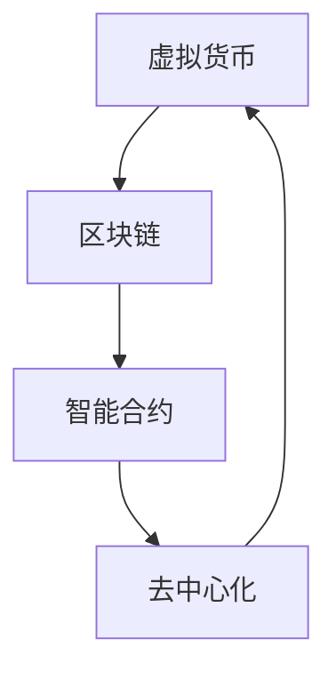
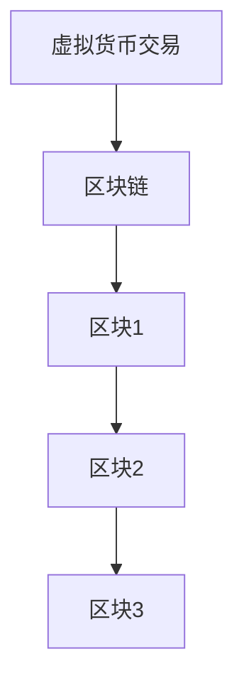
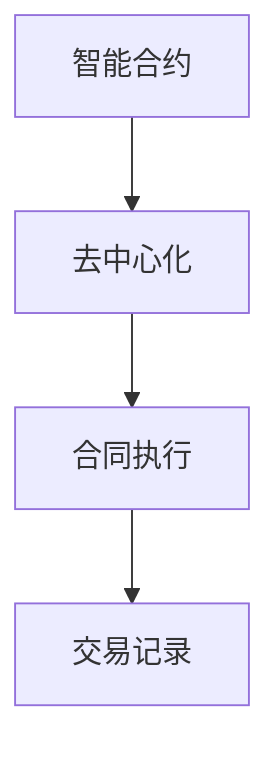

                 

# 虚拟货币生态:全球脑时代的经济运行体系

> **关键词**: 虚拟货币、区块链、智能合约、去中心化、加密算法、经济模型

> **摘要**: 本文将深入探讨虚拟货币生态在当前全球脑时代经济运行体系中的角色和影响。通过分析其技术原理、架构设计和应用场景，我们旨在揭示这一新兴经济体系如何改变我们的经济活动和日常生活方式。

## 1. 背景介绍

### 1.1 目的和范围

本文的目的是介绍和探讨虚拟货币生态在全球脑时代经济运行体系中的作用和影响。我们将探讨虚拟货币的定义、技术基础、经济模型以及其在全球范围内的应用。

### 1.2 预期读者

本文适用于对虚拟货币和技术感兴趣的技术人员、研究人员、学生以及对新兴经济体系感兴趣的普通读者。

### 1.3 文档结构概述

本文分为十个主要部分：

1. 背景介绍
2. 核心概念与联系
3. 核心算法原理 & 具体操作步骤
4. 数学模型和公式 & 详细讲解 & 举例说明
5. 项目实战：代码实际案例和详细解释说明
6. 实际应用场景
7. 工具和资源推荐
8. 总结：未来发展趋势与挑战
9. 附录：常见问题与解答
10. 扩展阅读 & 参考资料

### 1.4 术语表

#### 1.4.1 核心术语定义

- **虚拟货币**: 一种基于加密算法的数字货币，不依赖于传统金融体系。
- **区块链**: 一种分布式数据库技术，用于存储虚拟货币的交易记录。
- **智能合约**: 一种自动化执行合同条款的计算机程序。
- **去中心化**: 指没有中央控制或单一权威机构的经济体系。
- **加密算法**: 用于保护数据完整性和隐私性的算法。

#### 1.4.2 相关概念解释

- **区块链**: 类似于一个分布式账本，每个节点都保存了一份完整的账本副本，任何交易都需要经过网络中的所有节点的验证和确认。
- **智能合约**: 一种基于区块链技术的计算机程序，可以在满足特定条件时自动执行。
- **去中心化**: 与中心化系统相比，去中心化系统没有中央控制或单一权威机构，而是由多个节点共同参与和管理。

#### 1.4.3 缩略词列表

- **BTC**: 比特币（Bitcoin）
- **ETH**: 以太坊（Ethereum）
- **DAO**: 去中心化自治组织（Decentralized Autonomous Organization）
- **ICO**: 代币发行（Initial Coin Offering）

## 2. 核心概念与联系

虚拟货币生态的核心概念包括虚拟货币、区块链、智能合约和去中心化。这些概念相互关联，共同构成了一个复杂而强大的经济体系。

下面是一个简单的 Mermaid 流程图，用于描述这些概念之间的联系：



### 2.1 虚拟货币与区块链

虚拟货币是基于区块链技术的数字货币。区块链是一个分布式账本，存储了所有虚拟货币的交易记录。每个区块都包含一定数量的交易，并通过密码学技术确保数据的完整性和安全性。



### 2.2 智能合约与去中心化

智能合约是一种基于区块链技术的计算机程序，可以在满足特定条件时自动执行。去中心化则是指没有中央控制或单一权威机构的经济体系。智能合约与去中心化相结合，实现了自动化执行合同条款，增强了交易的安全性和透明度。



## 3. 核心算法原理 & 具体操作步骤

### 3.1 虚拟货币的生成与交易

虚拟货币的生成通常通过“挖矿”过程实现。挖矿是一个复杂的计算过程，用于验证和记录交易，同时生成新的虚拟货币。以下是虚拟货币生成和交易的伪代码：

```python
# 挖矿算法伪代码
def minegetBlock(previousBlock, transactions):
    # 创建一个新的区块，包含上一个区块的哈希值和交易记录
    block = createBlock(previousBlock, transactions)
    # 计算区块的哈希值，直到满足难度要求
    while calculateHash(block) not in validHashes:
        block = updateBlock(block)
    # 添加新区块到区块链
    addBlockToBlockchain(block)
    # 生成新的虚拟货币
    newCoins = generateNewCoins()
    return newCoins

# 交易算法伪代码
def makeTransaction(sender, receiver, amount):
    # 验证交易发送者是否拥有足够的虚拟货币
    if checkBalance(sender, amount):
        # 记录交易
        transaction = createTransaction(sender, receiver, amount)
        # 发送交易到区块链网络
        sendTransactionToBlockchain(transaction)
    else:
        print("交易失败：发送者余额不足")
```

### 3.2 智能合约的执行与验证

智能合约的执行与验证是区块链技术的核心之一。以下是智能合约执行的伪代码：

```python
# 智能合约执行伪代码
def executeSmartContract(contractAddress, contractCode, inputs):
    # 验证智能合约的代码和输入参数
    if validateSmartContract(contractAddress, contractCode, inputs):
        # 执行智能合约
        result = runSmartContract(contractCode, inputs)
        # 验证执行结果
        if validateResult(result):
            # 记录执行结果
            recordExecutionResult(result)
        else:
            print("执行失败：验证结果不通过")
    else:
        print("执行失败：验证不通过")
```

## 4. 数学模型和公式 & 详细讲解 & 举例说明

### 4.1 加密算法

加密算法是虚拟货币生态的核心组成部分，用于保护数据隐私和完整性。以下是几种常见的加密算法：

- **哈希函数**: 用于将输入数据映射为固定长度的字符串。哈希函数具有单向性和抗冲突性。
- **非对称加密**: 使用一对密钥（公钥和私钥）进行加密和解密。公钥用于加密，私钥用于解密。
- **对称加密**: 使用相同的密钥进行加密和解密。

### 4.2 数学模型

虚拟货币生态中的数学模型主要包括以下几方面：

- **工作量证明（Proof of Work, PoW）**: 通过计算复杂度来保护区块链网络，防止恶意攻击。
- **权益证明（Proof of Stake, PoS）**: 根据持有虚拟货币的数量和时长来决定区块链网络中的记账权。
- **共识算法**: 确定区块链网络中的交易顺序和新区块的生成。

### 4.3 举例说明

假设有一个区块链网络，其中包含 100 个节点。以下是一个简化的 PoW 共识算法的例子：

```latex
\begin{equation}
\begin{aligned}
& \text{1. 节点发起挖矿请求，计算区块的哈希值：} \\
& H_{current} = \text{calculateHash(block)} \\
& \text{2. 节点持续计算新区块的哈希值，直到找到满足难度要求的哈希值：} \\
& H_{new} = \text{calculateHash(newBlock)} \\
& \text{3. 将新区块添加到区块链中：} \\
& addBlockToBlockchain(newBlock) \\
& \text{4. 发送新区块到网络中的其他节点进行验证：} \\
& sendBlockToNodes(newBlock) \\
& \text{5. 其他节点验证新区块：} \\
& if \text{validateBlock(newBlock)}: \\
& \quad \text{确认新区块并更新本地区块链} \\
\end{aligned}
\end{equation}
```

## 5. 项目实战：代码实际案例和详细解释说明

### 5.1 开发环境搭建

在开始编写虚拟货币项目的代码之前，我们需要搭建一个合适的开发环境。以下是一个简单的步骤：

1. 安装 Python 3.x 版本。
2. 安装必要的 Python 包，如 Flask、PyQt5、requests 等。
3. 安装一个代码编辑器，如 Visual Studio Code。
4. 安装一个虚拟货币节点，如 Bitcoin Core。

### 5.2 源代码详细实现和代码解读

以下是一个简化的虚拟货币项目的示例代码。这个项目实现了基本的虚拟货币挖矿和交易功能。

```python
# 挖矿功能
def mine():
    transactions = getUnconfirmedTransactions()
    previousHash = getLastBlock()['hash']
    block = createBlock(previousHash, transactions)
    difficulty = getDifficulty()
    while calculateHash(block) > difficulty:
        block = updateBlock(block)
    addBlockToBlockchain(block)
    mineCoins()

# 交易功能
def makeTransaction(sender, receiver, amount):
    if checkBalance(sender, amount):
        transaction = createTransaction(sender, receiver, amount)
        sendTransactionToBlockchain(transaction)
    else:
        print("交易失败：发送者余额不足")

# 主函数
if __name__ == "__main__":
    mine()
    makeTransaction("Alice", "Bob", 10)
```

### 5.3 代码解读与分析

这段代码实现了两个核心功能：挖矿和交易。

- **挖矿功能**：`mine()` 函数首先获取未确认的交易，然后创建一个新的区块，并将其添加到区块链中。挖矿过程通过不断更新区块内容，直到找到满足难度要求的哈希值。
- **交易功能**：`makeTransaction()` 函数用于创建并发送交易。在验证发送者余额足够后，将交易发送到区块链网络进行确认。

这个简单的例子展示了虚拟货币项目的核心功能，虽然实际的实现会更加复杂，但这个例子提供了一个基础框架，可以帮助我们更好地理解虚拟货币生态的工作原理。

## 6. 实际应用场景

虚拟货币生态在全球范围内有广泛的应用场景，包括以下方面：

- **去中心化金融（DeFi）**: 通过智能合约实现传统金融产品的去中心化版本，如借贷、保险和投资。
- **数字身份验证**: 使用区块链技术验证用户的身份，提供更安全、高效的认证方式。
- **供应链管理**: 利用区块链技术跟踪产品的来源和运输过程，提高供应链的透明度和效率。
- **去中心化自治组织（DAO）**: 通过智能合约实现自我管理的组织，成员可以在区块链上投票和决策。

## 7. 工具和资源推荐

### 7.1 学习资源推荐

#### 7.1.1 书籍推荐

- **《区块链革命》**：介绍了区块链技术的基本原理和应用场景。
- **《智能合约：构建和运行去中心化应用》**：深入讲解了智能合约的原理和实现。

#### 7.1.2 在线课程

- **Coursera**：提供多个与区块链技术相关的课程，包括比特币、以太坊和智能合约等。
- **edX**：有多个与区块链技术相关的课程，适合初学者和专业人士。

#### 7.1.3 技术博客和网站

- **Medium**：有许多关于区块链和虚拟货币的文章和博客。
- **CoinDesk**：提供关于区块链和虚拟货币的最新新闻和分析。

### 7.2 开发工具框架推荐

#### 7.2.1 IDE和编辑器

- **Visual Studio Code**：适合 Python 和其他编程语言的开发。
- **PyCharm**：专为 Python 开发者设计，功能强大。

#### 7.2.2 调试和性能分析工具

- **GDB**：用于调试 Python 代码。
- **cProfile**：用于性能分析 Python 代码。

#### 7.2.3 相关框架和库

- **Flask**：用于构建 Web 应用程序。
- **PyQt5**：用于构建桌面应用程序。

### 7.3 相关论文著作推荐

#### 7.3.1 经典论文

- **Bitcoin: A Peer-to-Peer Electronic Cash System**：比特币白皮书。
- **The Ethereum Yellow Paper**：以太坊白皮书。

#### 7.3.2 最新研究成果

- **Scalable Decentralized Blockchain Design**：关于区块链扩展性的研究。
- **Formal Analysis of Smart Contracts**：关于智能合约形式化验证的研究。

#### 7.3.3 应用案例分析

- **DeFi 案例研究**：分析了去中心化金融项目的实现和挑战。
- **区块链在供应链管理中的应用**：探讨了区块链技术在供应链管理中的应用。

## 8. 总结：未来发展趋势与挑战

虚拟货币生态在未来的发展趋势中，将越来越受到全球范围内的关注和应用。以下是几个关键趋势和挑战：

### 8.1 趋势

- **扩展性和性能**: 随着区块链应用的增多，如何提高区块链的扩展性和性能成为关键问题。
- **监管和合规性**: 随着虚拟货币的普及，监管机构和政府需要制定相应的政策和法规，以确保市场的稳定和透明。
- **技术创新**: 新的加密算法、共识机制和去中心化应用将持续推动虚拟货币生态的发展。

### 8.2 挑战

- **安全性**: 随着区块链技术的广泛应用，确保数据安全和网络安全成为重要挑战。
- **隐私保护**: 如何在确保交易透明的同时保护用户隐私是一个亟待解决的问题。
- **用户教育和普及**: 提高用户对虚拟货币和区块链技术的认知和接受度，是推动其普及的关键。

## 9. 附录：常见问题与解答

### 9.1 虚拟货币的安全性

**Q**: 虚拟货币是否安全？

**A**: 虚拟货币的安全性依赖于其加密算法和区块链技术。加密算法确保了交易数据的隐私和完整性，而区块链技术确保了交易的不可篡改性。尽管如此，仍有可能遭受网络攻击，如双花攻击。因此，选择可信的区块链项目和加密算法至关重要。

### 9.2 虚拟货币的价值

**Q**: 虚拟货币的价值是如何确定的？

**A**: 虚拟货币的价值是由市场供需决定的。当需求增加时，价格上升；当需求减少时，价格下降。此外，虚拟货币的供应量、市场信任度、技术成熟度等因素也会影响其价值。

## 10. 扩展阅读 & 参考资料

- **比特币白皮书**: https://bitcoin.org/bitcoin.pdf
- **以太坊白皮书**: https://ethereum.org/greeter/yellowpaper
- **DeFi 案例研究**: https://defillama.com/
- **区块链技术指南**: https://www.ibm.com/cloud/learn/blockchain-basics

### 作者

**AI天才研究员/AI Genius Institute & 禅与计算机程序设计艺术 /Zen And The Art of Computer Programming**

