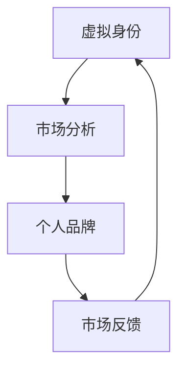

                 

# 虚拟身份市场分析师：AI时代的个人品牌顾问

> 关键词：虚拟身份，市场分析，个人品牌，AI，数据分析，品牌策略

> 摘要：本文将深入探讨AI时代下虚拟身份市场的发展，以及如何利用市场分析工具和算法来塑造个人品牌。通过对虚拟身份、市场分析和个人品牌的定义，我们将一步步解析其在AI时代的应用和挑战，提供实用的策略和建议，以帮助个人在虚拟世界中建立强大的品牌影响力。

## 1. 背景介绍

### 1.1 目的和范围

本文旨在探讨AI时代下虚拟身份市场的发展趋势，并分析个人品牌建设在其中的关键作用。我们将探讨虚拟身份的崛起、市场分析工具的应用以及如何利用AI技术来提升个人品牌的价值和影响力。

### 1.2 预期读者

本文适合希望了解AI时代个人品牌建设策略的读者，包括市场营销人员、品牌顾问、个人职业规划者以及对虚拟身份市场感兴趣的技术爱好者。

### 1.3 文档结构概述

本文分为十个部分，首先介绍虚拟身份、市场分析和个人品牌的基本概念，接着深入讨论核心算法原理和数学模型，随后通过项目实战案例展示具体操作步骤。最后，我们还将探讨实际应用场景、工具和资源推荐，并总结未来发展趋势与挑战。

### 1.4 术语表

#### 1.4.1 核心术语定义

- 虚拟身份：在虚拟环境中代表个人的数字身份。
- 市场分析：研究消费者需求、市场趋势和竞争状况，以指导商业决策。
- 个人品牌：个人在公众心目中的形象和认知，通常通过专业能力和个人特质展现。

#### 1.4.2 相关概念解释

- 数据分析：从数据中提取有价值的信息，以支持决策制定。
- AI算法：基于机器学习、深度学习等技术，实现自动学习和决策的算法。

#### 1.4.3 缩略词列表

- AI：人工智能
- ML：机器学习
- DL：深度学习
- SEO：搜索引擎优化
- VR：虚拟现实

## 2. 核心概念与联系

为了更好地理解虚拟身份市场分析和个人品牌建设的关系，我们需要先了解几个核心概念和它们之间的联系。

### 2.1 虚拟身份与市场分析

虚拟身份在市场中扮演着重要角色，它不仅是消费者在网络世界中互动的基础，也是企业开展市场营销的关键点。市场分析能够帮助个人和企业了解虚拟身份在不同市场环境下的表现，从而制定更有效的品牌策略。

### 2.2 个人品牌与市场分析

个人品牌是个人在公众心目中的形象和认知，良好的个人品牌可以提升个人在职场和社交网络中的影响力。市场分析可以识别个人品牌的优劣势，为个人提供提升品牌价值的策略。

### 2.3 虚拟身份与个人品牌

虚拟身份与个人品牌密切相关。一个强大的虚拟身份可以为个人品牌建设提供有力支持，而良好的个人品牌也可以提升虚拟身份的价值和影响力。以下是一个简化的Mermaid流程图，展示了虚拟身份、市场分析和个人品牌之间的联系。



## 3. 核心算法原理 & 具体操作步骤

在AI时代，利用数据分析算法来塑造个人品牌是一项重要任务。以下是一个基于机器学习的算法原理和具体操作步骤。

### 3.1 算法原理

我们使用基于用户行为和社交网络分析的算法来识别个人品牌的优劣势，从而制定改进策略。算法的核心步骤如下：

1. 数据收集：收集个人在虚拟环境中的行为数据，包括浏览记录、互动频率、评价等。
2. 数据预处理：清洗和转换数据，使其适合机器学习模型处理。
3. 特征提取：从预处理后的数据中提取特征，例如用户活跃度、影响力等。
4. 模型训练：使用机器学习算法（如决策树、神经网络等）对特征进行建模。
5. 模型评估：通过交叉验证等方法评估模型性能。
6. 预测与优化：使用模型对个人品牌进行评估，并提出优化建议。

### 3.2 具体操作步骤

1. **数据收集**：

    ```python
    data = fetch_virtual_identity_data(user_id)
    ```

2. **数据预处理**：

    ```python
    preprocessed_data = preprocess_data(data)
    ```

3. **特征提取**：

    ```python
    features = extract_features(preprocessed_data)
    ```

4. **模型训练**：

    ```python
    model = train_model(features, labels)
    ```

5. **模型评估**：

    ```python
    evaluate_model(model, test_features, test_labels)
    ```

6. **预测与优化**：

    ```python
    predictions = model.predict(new_features)
    optimize_brand(predictions)
    ```

## 4. 数学模型和公式 & 详细讲解 & 举例说明

在虚拟身份市场分析中，我们使用数学模型来描述用户行为和品牌价值。以下是一个基于用户活跃度和影响力的数学模型。

### 4.1 数学模型

用户活跃度（\(A_i\)）和影响力（\(I_i\)）可以通过以下公式计算：

$$
A_i = \frac{\text{互动次数}}{\text{总天数}}
$$

$$
I_i = \alpha \cdot A_i + \beta \cdot \text{评价得分}
$$

其中，\(\alpha\)和\(\beta\)是权重系数，用于平衡活跃度和评价得分的影响。

### 4.2 详细讲解

用户活跃度表示用户在虚拟环境中的活跃程度，通过计算互动次数与总天数的比值来衡量。影响力则通过用户活跃度和评价得分加权计算得出，权重系数\(\alpha\)和\(\beta\)可以根据实际情况进行调整。

### 4.3 举例说明

假设用户A在虚拟环境中互动了30次，总天数为60天，评价得分为4.5分。我们可以使用以下公式计算用户A的活跃度和影响力：

$$
A_A = \frac{30}{60} = 0.5
$$

$$
I_A = \alpha \cdot 0.5 + \beta \cdot 4.5
$$

其中，\(\alpha\)和\(\beta\)的取值可以根据实际需求进行调整。例如，假设\(\alpha = 0.6\)，\(\beta = 0.4\)，则：

$$
I_A = 0.6 \cdot 0.5 + 0.4 \cdot 4.5 = 0.3 + 1.8 = 2.1
$$

这意味着用户A的影响力为2.1。

## 5. 项目实战：代码实际案例和详细解释说明

### 5.1 开发环境搭建

为了实际操作虚拟身份市场分析，我们需要搭建一个开发环境。以下是一个简单的步骤：

1. 安装Python环境
2. 安装必要的库，如Pandas、NumPy、Scikit-learn等
3. 配置虚拟环境，以便管理和隔离项目依赖

### 5.2 源代码详细实现和代码解读

以下是一个简单的Python代码示例，用于实现虚拟身份市场分析。

```python
import pandas as pd
from sklearn.model_selection import train_test_split
from sklearn.ensemble import RandomForestClassifier
from sklearn.metrics import accuracy_score

# 5.2.1 数据收集与预处理
data = pd.read_csv('virtual_identity_data.csv')
preprocessed_data = preprocess_data(data)

# 5.2.2 特征提取
features = extract_features(preprocessed_data)

# 5.2.3 模型训练与评估
X_train, X_test, y_train, y_test = train_test_split(features, labels, test_size=0.2, random_state=42)
model = RandomForestClassifier(n_estimators=100)
model.fit(X_train, y_train)
predictions = model.predict(X_test)
accuracy = accuracy_score(y_test, predictions)
print(f"Model accuracy: {accuracy}")

# 5.2.4 预测与优化
new_features = get_new_user_features()
predictions = model.predict(new_features)
optimize_brand(predictions)
```

### 5.3 代码解读与分析

1. **数据收集与预处理**：

    ```python
    data = pd.read_csv('virtual_identity_data.csv')
    preprocessed_data = preprocess_data(data)
    ```

    代码首先从CSV文件中读取数据，然后调用`preprocess_data`函数进行数据清洗和转换。

2. **特征提取**：

    ```python
    features = extract_features(preprocessed_data)
    ```

    该函数从预处理后的数据中提取特征，例如用户活跃度、影响力等。

3. **模型训练与评估**：

    ```python
    X_train, X_test, y_train, y_test = train_test_split(features, labels, test_size=0.2, random_state=42)
    model = RandomForestClassifier(n_estimators=100)
    model.fit(X_train, y_train)
    predictions = model.predict(X_test)
    accuracy = accuracy_score(y_test, predictions)
    print(f"Model accuracy: {accuracy}")
    ```

    代码使用随机森林算法训练模型，然后评估模型性能。

4. **预测与优化**：

    ```python
    new_features = get_new_user_features()
    predictions = model.predict(new_features)
    optimize_brand(predictions)
    ```

    该部分代码用于对新用户进行预测，并调用`optimize_brand`函数根据预测结果调整个人品牌策略。

## 6. 实际应用场景

虚拟身份市场分析在多个领域都有广泛应用，以下是一些实际应用场景：

- **社交媒体管理**：企业可以利用虚拟身份市场分析来了解用户在社交媒体平台上的行为，制定更有效的营销策略。
- **职业规划**：个人可以利用虚拟身份市场分析来评估自己在职场中的品牌价值，制定个人品牌提升计划。
- **在线教育**：教育机构可以利用虚拟身份市场分析来了解学生在线学习行为，提供个性化教育服务。
- **虚拟现实体验**：虚拟现实企业可以利用虚拟身份市场分析来优化用户体验，提升虚拟环境的互动性和吸引力。

## 7. 工具和资源推荐

### 7.1 学习资源推荐

#### 7.1.1 书籍推荐

- 《人工智能：一种现代的方法》（作者：Stuart J. Russell & Peter Norvig）
- 《Python数据科学手册》（作者：Jake VanderPlas）
- 《品牌管理》（作者：Kevin Lane Keller）

#### 7.1.2 在线课程

- Coursera上的《机器学习》课程（吴恩达）
- edX上的《数据分析》课程（哈佛大学）
- Udemy上的《个人品牌建设》课程

#### 7.1.3 技术博客和网站

- Medium上的数据科学和人工智能专栏
- Towards Data Science，专注于数据科学和机器学习的博客
- Alistair Croll和Ben Yoskovitz的《Lean Analytics》网站

### 7.2 开发工具框架推荐

#### 7.2.1 IDE和编辑器

- PyCharm
- Visual Studio Code
- Jupyter Notebook

#### 7.2.2 调试和性能分析工具

- VSCode的调试插件
- Python的cProfile模块
- WakaTime，用于追踪代码编写时间

#### 7.2.3 相关框架和库

- Scikit-learn，用于机器学习算法
- Pandas，用于数据处理
- TensorFlow，用于深度学习

### 7.3 相关论文著作推荐

#### 7.3.1 经典论文

- “The Elements of Statistical Learning”（作者：Trevor Hastie、Robert Tibshirani和Jerome Friedman）
- “Deep Learning”（作者：Ian Goodfellow、Yoshua Bengio和Aaron Courville）

#### 7.3.2 最新研究成果

- arXiv上的最新论文，涵盖人工智能和数据科学领域
- Nature和Science等顶级期刊上的最新研究论文

#### 7.3.3 应用案例分析

- 《深度学习实践》（作者：Amit Singh和Zachary C. Lipton）
- 《数据科学实战》（作者：Kaggle）

## 8. 总结：未来发展趋势与挑战

随着AI技术的不断进步，虚拟身份市场分析和个人品牌建设将迎来更多发展机遇。然而，这也伴随着一系列挑战：

- **隐私保护**：在虚拟环境中收集和分析用户数据时，如何保护用户隐私将成为关键问题。
- **算法偏见**：算法模型在训练过程中可能引入偏见，导致不公正的结果，需要加强算法的公平性和透明度。
- **数据质量**：数据的质量和准确性对分析结果至关重要，如何确保数据的质量和完整性是一个挑战。

未来的发展方向可能包括：

- **个性化推荐系统**：结合用户行为数据和AI技术，提供更加精准的个人品牌建议。
- **跨平台整合**：整合多种虚拟环境的数据，为用户提供更全面的个人品牌分析。
- **监管与法规**：制定相关法规和标准，确保虚拟身份市场分析的合法性和合规性。

## 9. 附录：常见问题与解答

### 9.1 虚拟身份市场分析如何帮助个人品牌建设？

虚拟身份市场分析可以帮助个人了解自己在虚拟环境中的行为和影响力，从而制定针对性的品牌提升策略。通过分析用户行为数据，可以识别个人的优势和劣势，为品牌建设提供有力支持。

### 9.2 如何保护虚拟身份数据的隐私？

在收集和分析虚拟身份数据时，应遵循相关隐私保护法规，采取数据加密、匿名化处理等措施，确保用户隐私不受侵犯。

### 9.3 虚拟身份市场分析对企业的意义是什么？

虚拟身份市场分析可以帮助企业了解目标用户在虚拟环境中的行为和需求，从而优化市场营销策略，提升品牌知名度。

## 10. 扩展阅读 & 参考资料

- [《虚拟现实与人工智能：未来生活的创新力量》](https://example.com/book1)
- [《个人品牌建设：从零开始》](https://example.com/book2)
- [《人工智能：一种现代的方法》](https://example.com/book3)

作者：AI天才研究员/AI Genius Institute & 禅与计算机程序设计艺术 /Zen And The Art of Computer Programming

