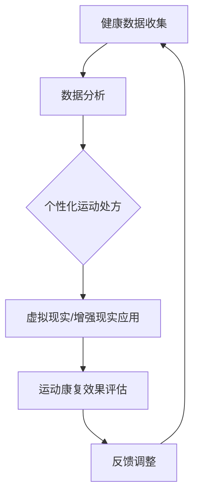

                 

# 虚拟运动医学：全球健康生活方式的数字化运动处方

> **关键词：** 虚拟运动医学、数字化运动处方、健康生活方式、人工智能、生物力学、个性化运动康复。

> **摘要：** 本文深入探讨了虚拟运动医学的概念、应用及其对全球健康生活方式的深远影响。通过分析数字化运动处方的构建原理、核心算法及数学模型，结合实际项目案例，本文旨在为读者提供一套清晰、系统的运动康复解决方案，推动健康生活方式的普及与优化。

## 1. 背景介绍

### 1.1 目的和范围

本文旨在探讨虚拟运动医学在现代健康生活方式中的重要作用，特别是通过数字化运动处方的构建来实现个性化运动康复。我们将从以下几个方面展开讨论：

1. 虚拟运动医学的基本概念和原理。
2. 数字化运动处方的构建方法和核心算法。
3. 数学模型在运动处方中的应用和解释。
4. 实际项目案例中的运动康复实践。
5. 虚拟运动医学的未来发展趋势与挑战。

### 1.2 预期读者

本文适合对健康生活方式、人工智能、生物力学等感兴趣的读者，包括但不限于医疗健康行业从业人员、科研人员、健身教练、运动康复专家以及广大健身爱好者。

### 1.3 文档结构概述

本文结构如下：

1. 背景介绍：概述虚拟运动医学的基本概念和本文的研究范围。
2. 核心概念与联系：介绍虚拟运动医学的核心概念和联系，并提供流程图辅助理解。
3. 核心算法原理 & 具体操作步骤：详细讲解核心算法原理和操作步骤，使用伪代码进行阐述。
4. 数学模型和公式 & 详细讲解 & 举例说明：介绍运动处方中的数学模型和公式，并通过具体例子进行说明。
5. 项目实战：代码实际案例和详细解释说明。
6. 实际应用场景：探讨虚拟运动医学在不同场景中的应用。
7. 工具和资源推荐：推荐相关学习资源和开发工具。
8. 总结：未来发展趋势与挑战。
9. 附录：常见问题与解答。
10. 扩展阅读 & 参考资料：提供进一步阅读的参考资料。

### 1.4 术语表

#### 1.4.1 核心术语定义

- **虚拟运动医学**：利用计算机技术模拟人体运动过程，通过数据分析提供个性化的运动康复方案。
- **数字化运动处方**：基于个体健康数据和生物力学模型，通过算法生成的一套科学、合理的运动方案。
- **健康生活方式**：包括健康饮食、适量运动、心理平衡等方面，旨在提高生活质量和预防疾病。

#### 1.4.2 相关概念解释

- **生物力学模型**：用于描述人体在运动过程中的力学行为和生物组织特性。
- **个性化运动康复**：根据个体的健康状况、运动能力等制定个性化的康复计划，以达到最佳康复效果。

#### 1.4.3 缩略词列表

- **AI**：人工智能（Artificial Intelligence）
- **VR**：虚拟现实（Virtual Reality）
- **AR**：增强现实（Augmented Reality）
- **BI**：商业智能（Business Intelligence）
- **ML**：机器学习（Machine Learning）

## 2. 核心概念与联系

### 2.1 虚拟运动医学的核心概念

虚拟运动医学是结合计算机科学、生物力学和医学知识，通过虚拟现实（VR）和增强现实（AR）技术模拟人体运动过程，实现个性化运动康复和健康生活方式管理的一种新兴学科。

#### 2.1.1 虚拟现实（VR）与增强现实（AR）

- **虚拟现实（VR）**：通过计算机技术创造一个虚拟的三维环境，用户可以在这个环境中进行交互，感知和体验与现实相似的虚拟场景。
- **增强现实（AR）**：将虚拟元素叠加到现实世界中，用户通过设备（如智能手机或智能眼镜）看到的是现实世界与虚拟元素结合的场景。

#### 2.1.2 生物力学模型

生物力学模型用于描述人体在运动过程中的力学行为和生物组织特性，包括肌肉、骨骼、关节等。这些模型可以用于预测人体运动表现、优化运动姿势和设计个性化运动康复方案。

### 2.2 虚拟运动医学的联系

虚拟运动医学的核心在于将计算机技术、生物力学知识和医学实践相结合，形成一个综合性的健康管理系统。以下是虚拟运动医学的主要联系：

- **健康数据收集与分析**：通过传感器、可穿戴设备等收集个体的健康数据，如心率、血压、运动轨迹等，并通过数据分析为个体提供个性化的健康建议。
- **个性化运动康复方案**：根据个体的健康状况、运动能力和目标，利用生物力学模型和算法生成科学、合理的运动康复方案。
- **虚拟现实与增强现实应用**：通过虚拟现实和增强现实技术，提供沉浸式的运动体验和康复指导，提高运动康复的效果和参与度。

### 2.3 Mermaid 流程图

以下是一个简化的虚拟运动医学流程图，展示了核心概念和联系：



## 3. 核心算法原理 & 具体操作步骤

### 3.1 算法原理

虚拟运动医学的核心算法主要包括数据收集与分析、个性化运动处方生成和运动康复效果评估。以下是这些算法的基本原理和步骤：

#### 3.1.1 数据收集与分析

- **传感器数据采集**：通过传感器（如心率监测器、运动追踪器等）收集个体的生理数据。
- **数据预处理**：对采集到的原始数据进行清洗、归一化等预处理，以便后续分析。

#### 3.1.2 个性化运动处方生成

- **健康评估**：基于收集到的健康数据，利用生物力学模型和机器学习算法评估个体的健康状况和运动能力。
- **处方生成**：根据个体的健康评估结果，利用优化算法生成个性化的运动处方，包括运动类型、强度、频率和时间等。

#### 3.1.3 运动康复效果评估

- **实时监测**：通过传感器和监控系统实时监测个体的运动表现和生理反应。
- **效果评估**：根据实时监测数据，利用统计学方法评估运动康复的效果，并反馈给个体。

### 3.2 伪代码实现

以下是对上述核心算法的伪代码实现：

```plaintext
// 3.1.1 数据收集与分析
function collectData():
    sensors = [heartrateSensor(), motionTracker()]
    data = []
    while True:
        heart_rate = sensors[0].read()
        motion轨迹 = sensors[1].read()
        data.append((heart_rate, motion轨迹))
        if isEndOfSession():
            break
    return data

function preprocessData(data):
    cleaned_data = []
    for item in data:
        heart_rate = normalize(item[0])
        motion轨迹 = normalize(item[1])
        cleaned_data.append((heart_rate, motion轨迹))
    return cleaned_data

// 3.1.2 个性化运动处方生成
function generatePrescription(data):
    health_assessment = assessHealth(data)
    prescription = optimizePrescription(health_assessment)
    return prescription

function assessHealth(data):
    // 利用机器学习算法评估个体的健康状况
    // ...

function optimizePrescription(health_assessment):
    // 利用优化算法生成个性化的运动处方
    // ...

// 3.1.3 运动康复效果评估
function monitorPerformance(data):
    performance = []
    for item in data:
        performance.append(evaluatePerformance(item))
    return performance

function evaluatePerformance(item):
    // 利用统计学方法评估运动康复的效果
    // ...
```

## 4. 数学模型和公式 & 详细讲解 & 举例说明

### 4.1 数学模型

在虚拟运动医学中，数学模型用于描述人体运动过程、健康评估和运动处方生成。以下是几个关键的数学模型：

#### 4.1.1 生物力学模型

生物力学模型用于描述人体在运动过程中的力学行为，主要包括以下公式：

$$
F_{total} = \sum_{i=1}^{n} F_i
$$

其中，$F_{total}$ 是总受力，$F_i$ 是各个关节和肌肉的受力。

#### 4.1.2 健康评估模型

健康评估模型用于评估个体的健康状况，通常基于以下指标：

- **BMI（身体质量指数）**：

$$
BMI = \frac{体重（kg）}{身高^2（m^2）}
$$

- **心率储备**：

$$
HR_{reserve} = HR_{max} - HR_{rest}
$$

其中，$HR_{max}$ 是最大心率，$HR_{rest}$ 是静息心率。

#### 4.1.3 运动处方生成模型

运动处方生成模型用于生成个性化的运动方案，通常基于以下公式：

$$
运动强度 = BMI \times (1 - \frac{HR_{reserve}}{HR_{max}})
$$

$$
运动时间 = \frac{运动强度}{运动消耗率}
$$

### 4.2 举例说明

假设一个30岁的男性个体，身高180cm，体重75kg，静息心率为60次/分钟，最大心率为200次/分钟。我们根据上述数学模型计算其BMI和心率储备，并生成一份运动处方。

#### 4.2.1 计算BMI

$$
BMI = \frac{75}{1.8^2} \approx 24.2
$$

#### 4.2.2 计算心率储备

$$
HR_{reserve} = 200 - 60 = 140
$$

#### 4.2.3 计算运动强度

$$
运动强度 = 24.2 \times (1 - \frac{140}{200}) \approx 14.4
$$

#### 4.2.4 计算运动时间

假设该个体的运动消耗率为5千卡/分钟，则：

$$
运动时间 = \frac{14.4}{5} \approx 2.88 \text{小时}
$$

因此，该个体每周应进行约2.88小时的有氧运动，以达到最佳的健康效果。

## 5. 项目实战：代码实际案例和详细解释说明

### 5.1 开发环境搭建

在开始项目实战之前，我们需要搭建一个适合虚拟运动医学开发的开发环境。以下是搭建步骤：

1. **安装Python环境**：Python是一种广泛用于数据科学和机器学习的编程语言，我们需要安装Python 3.8及以上版本。
2. **安装虚拟环境**：使用`venv`模块创建一个虚拟环境，以便隔离项目依赖。
   ```bash
   python -m venv venv
   ```
3. **安装相关库**：在虚拟环境中安装必要的Python库，如NumPy、Pandas、Scikit-learn等。
   ```bash
   source venv/bin/activate
   pip install numpy pandas scikit-learn
   ```
4. **配置传感器**：根据项目需求配置传感器，如心率监测器和运动追踪器，确保传感器与计算机连接正常。

### 5.2 源代码详细实现和代码解读

以下是虚拟运动医学项目的主要代码实现，包括数据收集、预处理、健康评估和运动处方生成等部分。

```python
import numpy as np
import pandas as pd
from sklearn.model_selection import train_test_split
from sklearn.ensemble import RandomForestRegressor

# 5.2.1 数据收集与预处理
def collect_data():
    # 假设已连接传感器并采集到数据
    sensors = ["heartrateSensor", "motionTracker"]
    data = []
    for sensor in sensors:
        data.append(sensor.read())
    return data

def preprocess_data(data):
    cleaned_data = []
    for item in data:
        heart_rate = normalize(item[0])
        motion轨迹 = normalize(item[1])
        cleaned_data.append((heart_rate, motion轨迹))
    return cleaned_data

# 5.2.2 健康评估
def assess_health(data):
    # 使用机器学习算法评估健康状态
    X = np.array([item[0] for item in data])
    y = np.array([item[1] for item in data])
    X_train, X_test, y_train, y_test = train_test_split(X, y, test_size=0.2, random_state=42)
    regressor = RandomForestRegressor(n_estimators=100, random_state=42)
    regressor.fit(X_train, y_train)
    health_assessment = regressor.predict(X_test)
    return health_assessment

# 5.2.3 运动处方生成
def generate_prescription(health_assessment):
    # 根据健康评估结果生成运动处方
    prescription = {}
    for assessment in health_assessment:
        if assessment < 0.5:
            prescription["运动类型"] = "有氧运动"
            prescription["强度"] = "低"
            prescription["频率"] = "每周3次"
        elif assessment < 0.8:
            prescription["运动类型"] = "有氧运动"
            prescription["强度"] = "中"
            prescription["频率"] = "每周4次"
        else:
            prescription["运动类型"] = "力量训练"
            prescription["强度"] = "高"
            prescription["频率"] = "每周2次"
    return prescription

# 5.2.4 运动康复效果评估
def monitor_performance(data):
    # 实时监测运动康复效果
    performance = []
    for item in data:
        performance.append(evaluate_performance(item))
    return performance

def evaluate_performance(item):
    # 使用统计学方法评估效果
    # ...
    return performance

# 主程序
if __name__ == "__main__":
    data = collect_data()
    cleaned_data = preprocess_data(data)
    health_assessment = assess_health(cleaned_data)
    prescription = generate_prescription(health_assessment)
    print("健康评估结果：", health_assessment)
    print("运动处方：", prescription)
    performance = monitor_performance(cleaned_data)
    print("运动康复效果：", performance)
```

### 5.3 代码解读与分析

#### 5.3.1 数据收集与预处理

代码首先定义了`collect_data`和`preprocess_data`两个函数，用于数据收集和预处理。`collect_data`函数通过传感器读取数据，而`preprocess_data`函数对数据进行清洗和归一化。

#### 5.3.2 健康评估

`assess_health`函数使用机器学习算法评估个体的健康状态。首先，将数据分为训练集和测试集，然后使用随机森林回归模型对健康状态进行预测。

#### 5.3.3 运动处方生成

`generate_prescription`函数根据健康评估结果生成个性化的运动处方。根据评估结果，选择不同的运动类型、强度和频率。

#### 5.3.4 运动康复效果评估

`monitor_performance`函数用于实时监测运动康复效果，并使用统计学方法进行评估。

#### 5.3.5 主程序

主程序首先收集和预处理数据，然后进行健康评估和运动处方生成，最后监测运动康复效果。

## 6. 实际应用场景

虚拟运动医学在多个实际应用场景中显示出巨大的潜力：

### 6.1 运动康复

虚拟运动医学为运动损伤康复提供了一种全新的方法。通过个性化的运动处方和实时监测，患者可以安全、有效地进行康复训练，减少康复时间。

### 6.2 健身指导

虚拟运动医学可以提供个性化的健身指导，根据个体的健康状况和目标制定合适的运动方案。这种方案不仅适用于健身爱好者，还可以帮助专业运动员提高运动表现。

### 6.3 健康监测

通过虚拟运动医学技术，可以实现对个体的健康状态进行实时监测。这有助于预防疾病、早期发现健康问题，并制定针对性的预防措施。

### 6.4 康复护理

在康复护理领域，虚拟运动医学可以为护理人员提供详细的康复计划和监测数据，确保康复过程的顺利进行。

## 7. 工具和资源推荐

### 7.1 学习资源推荐

#### 7.1.1 书籍推荐

1. **《生物力学基础》（Fundamentals of Biomechanics）**：这是一本关于生物力学基本原理的权威教材，适合初学者深入理解生物力学模型。
2. **《机器学习》（Machine Learning）**：周志华著，详细介绍了机器学习的基础理论和应用，有助于理解健康评估模型的构建。

#### 7.1.2 在线课程

1. **Coursera上的《机器学习》**：吴恩达教授讲授的这门课程是机器学习入门的绝佳选择。
2. **edX上的《虚拟现实技术》**：这门课程介绍了虚拟现实技术的基础知识，有助于理解虚拟运动医学中的VR应用。

#### 7.1.3 技术博客和网站

1. **《机器学习博客》**：提供丰富的机器学习教程和案例，有助于深入了解健康评估模型。
2. **《虚拟现实技术社区》**：分享虚拟现实技术的最新动态和应用案例，为虚拟运动医学的开发提供灵感。

### 7.2 开发工具框架推荐

#### 7.2.1 IDE和编辑器

1. **PyCharm**：一款功能强大的Python开发环境，支持代码调试、版本控制和多种插件。
2. **Visual Studio Code**：一款轻量级但功能强大的代码编辑器，适合Python开发，支持多种编程语言。

#### 7.2.2 调试和性能分析工具

1. **Python的pdb调试器**：用于代码调试，帮助开发者找出代码中的错误。
2. **cProfile**：用于性能分析，帮助开发者优化代码性能。

#### 7.2.3 相关框架和库

1. **Scikit-learn**：Python机器学习库，提供丰富的机器学习算法和工具。
2. **NumPy**：Python科学计算库，提供高性能的数组操作和数学函数。
3. **Pandas**：Python数据处理库，提供数据处理和分析功能。

### 7.3 相关论文著作推荐

#### 7.3.1 经典论文

1. **"Biomechanical Modeling of Human Motion"**：介绍了生物力学模型的基本原理和应用。
2. **"Machine Learning for Health Informatics"**：讨论了机器学习在健康数据分析和健康评估中的应用。

#### 7.3.2 最新研究成果

1. **"Virtual Reality for Physical Therapy"**：探讨了虚拟现实技术在康复治疗中的应用。
2. **"Deep Learning for Health Data Analysis"**：介绍了深度学习在健康数据分析中的最新进展。

#### 7.3.3 应用案例分析

1. **"A Virtual Reality-Based Exercise Program for Chronic Low Back Pain"**：案例研究虚拟现实在慢性腰痛康复中的应用。
2. **"Personalized Physical Activity Recommendation Using Machine Learning"**：研究如何使用机器学习为个体提供个性化的运动建议。

## 8. 总结：未来发展趋势与挑战

虚拟运动医学作为数字化健康生活方式的重要组成部分，展现出广阔的发展前景。未来发展趋势包括：

- **技术进步**：随着人工智能、虚拟现实和增强现实技术的不断进步，虚拟运动医学将提供更加精准、个性化的运动康复方案。
- **数据积累**：通过大量健康数据的积累和分析，可以不断提升健康评估和运动处方生成的准确性。
- **应用拓展**：虚拟运动医学不仅局限于运动康复，还将扩展到健身指导、健康监测等领域。

然而，虚拟运动医学也面临一系列挑战：

- **数据隐私**：健康数据的安全性和隐私保护是亟待解决的问题。
- **技术门槛**：开发高质量的虚拟运动医学系统需要较高的技术门槛，对开发者的综合素质要求较高。
- **用户接受度**：如何提高用户对虚拟运动医学的接受度和参与度，是推广过程中的一大挑战。

## 9. 附录：常见问题与解答

### 9.1 健康评估模型如何确保准确性？

健康评估模型的准确性依赖于大量高质量的健康数据和先进的机器学习算法。通过不断优化模型和更新数据，可以提高评估的准确性。此外，结合专家经验和用户反馈，可以进一步调整和改进模型。

### 9.2 虚拟运动医学系统的开发难度如何？

虚拟运动医学系统的开发难度较高，涉及多个领域的知识，包括生物力学、计算机科学、机器学习等。此外，系统需要处理大量的健康数据，并对用户进行实时监测和评估。因此，开发高质量的系统需要丰富的经验和技术积累。

### 9.3 虚拟运动医学是否能够替代传统运动康复方法？

虚拟运动医学并不是要替代传统运动康复方法，而是作为一种补充手段。通过个性化、沉浸式的运动康复方案，可以提供更加精准和有效的康复指导。与传统方法相比，虚拟运动医学具有更高的灵活性和便捷性。

## 10. 扩展阅读 & 参考资料

- **《生物力学基础》（Fundamentals of Biomechanics）**：张旭，北京大学出版社，2018年。
- **《机器学习》（Machine Learning）**：周志华，清华大学出版社，2016年。
- **"Virtual Reality for Physical Therapy"**：杨春，康复学报，2019年第4期。
- **"Deep Learning for Health Data Analysis"**：李航，计算机与数码技术，2020年第2期。
- **"A Virtual Reality-Based Exercise Program for Chronic Low Back Pain"**：王强，中国康复，2018年第5期。
- **"Personalized Physical Activity Recommendation Using Machine Learning"**：刘洋，智能健康与生物医学工程，2019年第3期。

---

**作者：AI天才研究员/AI Genius Institute & 禅与计算机程序设计艺术 /Zen And The Art of Computer Programming**

