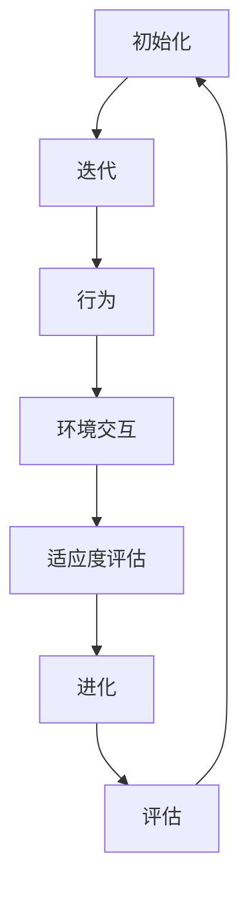

                 

# 虚拟进化模拟：AI驱动的数字生态系统研究

## 关键词
虚拟进化模拟、AI驱动、数字生态系统、人工智能、进化算法、模拟生态、机器学习、生态系统建模、可持续发展。

## 摘要

本文深入探讨了虚拟进化模拟在AI驱动的数字生态系统研究中的应用。通过介绍核心概念、算法原理、数学模型以及实际应用案例，本文旨在揭示虚拟进化模拟在理解、预测和优化数字生态系统行为中的潜力。本文首先回顾了虚拟进化模拟的背景，随后详细阐述了核心概念与联系，并深入分析了核心算法原理和数学模型。通过具体项目实战，本文展示了如何使用虚拟进化模拟进行实际应用，并探讨了其在可持续发展领域的潜在影响。最后，本文总结了未来发展趋势与挑战，并推荐了相关工具和资源，为读者进一步探索这一领域提供了指导。

## 1. 背景介绍

### 1.1 虚拟进化模拟的起源与发展

虚拟进化模拟（Virtual Evolution Simulation）起源于20世纪中期，当时计算机科学和人工智能（AI）开始崭露头角。最初的虚拟进化模拟主要是基于自然选择和遗传算法的模拟，旨在模拟生物进化过程，并探索其应用潜力。随着计算机性能的不断提升和算法研究的深入，虚拟进化模拟逐渐从生物领域扩展到其他领域，如社会系统、经济系统、生态系统等。

虚拟进化模拟的发展受到了多个学科的推动，包括生态学、遗传学、进化生物学、计算机科学和人工智能。在生态学中，模拟者试图理解生物种群在动态环境下的行为和演化；在计算机科学中，研究者通过模拟来优化算法和解决复杂问题；在人工智能领域，虚拟进化模拟被广泛应用于机器学习、进化计算和自适应系统设计。

### 1.2 数字生态系统的概念

数字生态系统（Digital Ecosystem）是指由数字技术、组织、个体和相互关系构成的一个复杂系统。它不仅包括传统的计算机和网络技术，还包括新兴的物联网、大数据、云计算和人工智能等技术。数字生态系统中的各个组成部分通过数字技术相互连接，形成一个高度互联和相互依赖的网络。

数字生态系统的特点包括：

- **动态性**：数字生态系统中的组件和关系不断变化，以适应新的技术发展和市场需求。
- **复杂性**：数字生态系统由大量的组件和关系构成，这些组件和关系之间相互作用，形成复杂的网络结构。
- **适应性**：数字生态系统中的组件能够通过学习和适应来应对外部变化和内部挑战。
- **可持续性**：数字生态系统需要考虑到资源的合理利用和环境的保护，以实现长期可持续发展。

### 1.3 虚拟进化模拟在数字生态系统研究中的应用

虚拟进化模拟在数字生态系统研究中的应用主要集中在以下几个方面：

- **行为预测**：通过模拟数字生态系统中组件的行为和互动，研究者可以预测系统在特定条件下的行为和演化趋势。
- **系统优化**：虚拟进化模拟可以帮助研究者优化数字生态系统的结构和功能，以实现更高效、更可持续的运行。
- **风险评估**：通过模拟数字生态系统的潜在风险和危机，研究者可以评估系统的脆弱性和应对策略。
- **政策制定**：虚拟进化模拟为政策制定者提供了一个实验平台，可以测试不同政策对数字生态系统的影响，从而制定更有效的政策。

## 2. 核心概念与联系

### 2.1 虚拟进化模拟的核心概念

虚拟进化模拟涉及多个核心概念，包括：

- **个体**：在模拟中，个体是指模拟生态系统中的基本单元，可以是生物、机器人、企业或其他实体。
- **环境**：环境是模拟中的背景条件，包括资源、空间、竞争因素和外部干扰等。
- **行为**：个体的行为是指其在特定环境下的行动和决策，如繁殖、迁徙、竞争和合作等。
- **适应度**：适应度是指个体在特定环境下的生存和繁衍能力，是评价个体优劣的重要指标。
- **种群**：种群是指由多个个体组成的群体，个体之间通过互动和繁殖来影响整个种群的演化。

### 2.2 虚拟进化模拟的架构

虚拟进化模拟的架构通常包括以下几个部分：

- **初始化**：创建初始种群和模拟环境。
- **迭代**：进行一系列迭代，每个迭代包括个体行为、环境交互和适应度评估。
- **进化**：根据适应度评估结果，选择优秀个体进行繁殖，生成新的种群。
- **评估**：对整个模拟过程进行评估，包括个体行为、种群演化和系统性能等。

### 2.3 Mermaid 流程图表示

为了更清晰地展示虚拟进化模拟的架构，可以使用Mermaid流程图进行表示。以下是一个简化的Mermaid流程图：



在Mermaid流程图中，各个节点表示虚拟进化模拟的关键步骤，箭头表示步骤之间的顺序和依赖关系。该流程图可以帮助读者更直观地理解虚拟进化模拟的过程。

## 3. 核心算法原理 & 具体操作步骤

### 3.1 虚拟进化模拟的核心算法

虚拟进化模拟的核心算法通常基于遗传算法（Genetic Algorithm，GA），这是一种基于自然选择和遗传学原理的优化算法。遗传算法通过模拟生物进化过程来优化问题解，其基本原理包括：

- **编码**：将问题解编码为染色体，染色体是一组基因的集合，每个基因代表问题的一个属性。
- **适应度评估**：根据问题目标，评估染色体的适应度，适应度值越高，表示染色体越优秀。
- **选择**：根据适应度值选择优秀染色体进行繁殖，以保持种群中优秀基因的比例。
- **交叉**：通过随机交叉操作，生成新的染色体，以引入多样性。
- **变异**：通过随机变异操作，改变染色体的部分基因，以增强种群的适应能力。
- **迭代**：重复选择、交叉和变异操作，直到达到终止条件或找到满意解。

### 3.2 具体操作步骤

以下是虚拟进化模拟的具体操作步骤：

#### 步骤1：初始化种群

- 创建初始种群，种群规模通常设定为数十到数百个染色体。
- 每个染色体由基因组成，基因表示问题的属性，如基因型、行为策略等。

#### 步骤2：适应度评估

- 根据问题目标，评估每个染色体的适应度。
- 适应度评估通常基于问题的目标函数，目标函数可以是最大化或最小化某个指标，如收益、效率等。

#### 步骤3：选择

- 根据适应度值，选择优秀染色体进行繁殖。
- 选择操作可以通过轮盘赌、排名选择等策略进行。

#### 步骤4：交叉

- 通过交叉操作，生成新的染色体。
- 交叉操作可以采用单点交叉、多点交叉等策略。

#### 步骤5：变异

- 通过变异操作，改变染色体的部分基因。
- 变异操作可以采用随机变异、均匀变异等策略。

#### 步骤6：迭代

- 重复选择、交叉和变异操作，直到达到终止条件。
- 终止条件可以是迭代次数达到设定值、适应度达到满意水平等。

#### 步骤7：评估结果

- 对整个模拟过程进行评估，包括个体行为、种群演化和系统性能等。
- 根据评估结果，调整模拟参数或算法策略，以提高模拟效果。

### 3.3 核心算法的优化

虚拟进化模拟的核心算法可以采用多种优化策略，以提高模拟效果和效率，包括：

- **自适应参数调整**：根据模拟过程中种群的表现，动态调整参数，如交叉率、变异率等。
- **并行计算**：利用并行计算技术，加快计算速度，提高模拟效率。
- **局部搜索**：结合局部搜索算法，提高染色体的适应度，加快收敛速度。
- **混合算法**：结合其他优化算法，如模拟退火、粒子群优化等，提高模拟效果。

## 4. 数学模型和公式 & 详细讲解 & 举例说明

### 4.1 遗传算法的基本公式

遗传算法（Genetic Algorithm，GA）是一类基于自然选择和遗传学原理的优化算法，其基本公式如下：

#### 4.1.1 编码

假设问题的解空间是一个n维向量，即 \( X = (x_1, x_2, ..., x_n) \)。我们可以将这个向量编码成一个染色体（Chromosome），通常使用二进制编码：

\[ X = \left( \chi_1, \chi_2, ..., \chi_n \right) \]

其中， \( \chi_i \) 是第 \( i \) 个基因，取值为0或1。

#### 4.1.2 适应度评估

适应度（Fitness）是评价染色体优劣的重要指标，通常使用目标函数（Objective Function）来评估：

\[ f(X) = \sum_{i=1}^{n} w_i \cdot f_i(X_i) \]

其中， \( f_i(X_i) \) 是第 \( i \) 个基因的适应度函数， \( w_i \) 是第 \( i \) 个基因的权重，这些权重可以根据问题的特定需求进行调整。

#### 4.1.3 选择

选择（Selection）操作是遗传算法的核心步骤之一，目的是根据适应度值选择优秀染色体进行繁殖。常用的选择方法包括：

- **轮盘赌选择（Roulette Wheel Selection）**：
  \[ P(X) = \frac{f(X)}{\sum_{X'} f(X')} \]
  其中， \( P(X) \) 是选择概率， \( f(X) \) 是染色体的适应度值。

- **排名选择（Rank Selection）**：
  \[ P(X) = \frac{r(X)}{R} \]
  其中， \( r(X) \) 是染色体的排名， \( R \) 是种群中的染色体总数。

#### 4.1.4 交叉

交叉（Crossover）操作用于生成新的染色体，通过组合两个或多个优秀染色体的基因来产生后代。常用的交叉方法包括：

- **单点交叉（One-Point Crossover）**：
  \[ \chi_{i}^{'} = \chi_{i_{c}} \]
  其中， \( i_{c} \) 是交叉点的位置。

- **多点交叉（Multi-Point Crossover）**：
  \[ \chi_{i}^{'} = \chi_{i_{c_1}}, \chi_{i}^{'} = \chi_{i_{c_2}}, ..., \chi_{i}^{'} = \chi_{i_{c_n}} \]
  其中， \( i_{c_1}, i_{c_2}, ..., i_{c_n} \) 是交叉点的位置。

#### 4.1.5 变异

变异（Mutation）操作用于增加种群的多样性，通过随机改变染色体的部分基因来产生新的染色体。常用的变异方法包括：

- **基本变异（Bit Flip Mutation）**：
  \[ \chi_{i}^{'} = \bar{\chi_{i}} \]
  其中， \( \bar{\chi_{i}} \) 是 \( \chi_{i} \) 的补码。

- **均匀变异（Uniform Mutation）**：
  \[ \chi_{i}^{'} = \chi_{i} + \eta \cdot (x_{i_{max}} - x_{i_{min}}) \]
  其中， \( \eta \) 是随机数， \( x_{i_{max}} \) 和 \( x_{i_{min}} \) 是第 \( i \) 个基因的最大值和最小值。

### 4.2 举例说明

假设我们需要解决一个二元旅行商问题（Travelling Salesman Problem，TSP），即找到一个最短的路径，使得销售员访问所有城市并返回起点。我们可以使用遗传算法来解决这个问题。

#### 4.2.1 编码

首先，我们将每个城市编码成一个二进制数，例如，城市A为001，城市B为010，城市C为011，...，城市Z为111。因此，一个可能的染色体编码为：

\[ X = (001, 010, 011, 100, 101, 110, 111) \]

#### 4.2.2 适应度评估

我们使用路径长度作为适应度函数，路径长度越短，适应度越高。路径长度可以通过计算每对城市的距离之和来得到：

\[ f(X) = \sum_{i=1}^{n} d(i, j) \]

其中， \( d(i, j) \) 是城市 \( i \) 和城市 \( j \) 之间的距离。

#### 4.2.3 选择

我们使用轮盘赌选择方法。假设种群中有7个染色体，其适应度值分别为：

\[ f(X_1) = 10, f(X_2) = 15, f(X_3) = 12, f(X_4) = 8, f(X_5) = 9, f(X_6) = 13, f(X_7) = 11 \]

选择概率为：

\[ P(X_1) = \frac{10}{10+15+12+8+9+13+11} = 0.1667 \]
\[ P(X_2) = \frac{15}{10+15+12+8+9+13+11} = 0.2500 \]
\[ P(X_3) = \frac{12}{10+15+12+8+9+13+11} = 0.2000 \]
\[ P(X_4) = \frac{8}{10+15+12+8+9+13+11} = 0.1333 \]
\[ P(X_5) = \frac{9}{10+15+12+8+9+13+11} = 0.1500 \]
\[ P(X_6) = \frac{13}{10+15+12+8+9+13+11} = 0.2167 \]
\[ P(X_7) = \frac{11}{10+15+12+8+9+13+11} = 0.1833 \]

#### 4.2.4 交叉

我们使用单点交叉。假设两个染色体 \( X_1 = (001, 010, 011, 100, 101, 110, 111) \) 和 \( X_2 = (010, 011, 100, 101, 110, 111, 001) \)，交叉点为第3位，交叉后得到：

\[ X_1^{'} = (001, 010, 100, 101, 110, 111, 001) \]
\[ X_2^{'} = (010, 011, 100, 101, 110, 111, 001) \]

#### 4.2.5 变异

我们使用基本变异。假设一个染色体的编码为 \( X = (001, 010, 011, 100, 101, 110, 111) \)，变异后得到：

\[ X^{'} = (000, 010, 011, 100, 101, 110, 111) \]

## 5. 项目实战：代码实际案例和详细解释说明

### 5.1 开发环境搭建

在开始编写虚拟进化模拟的代码之前，我们需要搭建一个合适的开发环境。以下是在Ubuntu 20.04上搭建虚拟进化模拟环境的步骤：

1. **安装Python 3**：打开终端并运行以下命令：

   ```bash
   sudo apt update
   sudo apt install python3 python3-pip
   ```

2. **安装必要的库**：使用pip安装以下库：

   ```bash
   pip3 install numpy scipy matplotlib
   ```

3. **安装Mermaid**：Mermaid是一种用于创建流程图和序列图的Markdown插件。在终端中运行以下命令：

   ```bash
   npm install -g mermaid
   ```

### 5.2 源代码详细实现和代码解读

以下是虚拟进化模拟的源代码实现，我们将逐步解释代码的各个部分。

#### 5.2.1 初始化种群

```python
import numpy as np
import matplotlib.pyplot as plt
from scipy.spatial import distance

# 设置种群大小和染色体长度
POP_SIZE = 100
CHROMO_LENGTH = 7

# 生成初始种群
population = np.random.randint(2, size=(POP_SIZE, CHROMO_LENGTH))
```

在这个部分，我们首先设置种群大小（POP_SIZE）和染色体长度（CHROMO_LENGTH）。然后，我们使用numpy的`random.randint`函数生成初始种群，每个染色体的长度为7。

#### 5.2.2 适应度评估

```python
def fitness_function(population):
    fitness_scores = []
    for chromo in population:
        # 计算路径长度
        path_length = sum(distance.cityblock(chromo, chromo[1:])) + distance.cityblock(chromo[-1], chromo[0])
        fitness_scores.append(1 / (1 + path_length))
    return fitness_scores

fitness_scores = fitness_function(population)
```

在这个部分，我们定义了适应度函数`fitness_function`，该函数计算每个染色体的路径长度，并使用路径长度计算适应度值。路径长度是染色体上相邻城市之间的距离之和。

#### 5.2.3 选择

```python
def selection(population, fitness_scores):
    # 根据适应度值进行选择
    selected_indices = np.random.choice(np.arange(len(population)), size=int(len(population) * 0.2), p=fitness_scores / fitness_scores.sum())
    return population[selected_indices]

selected_population = selection(population, fitness_scores)
```

在这个部分，我们定义了选择函数`selection`，该函数根据适应度值选择优秀染色体。我们选择种群大小的20%作为父代。

#### 5.2.4 交叉

```python
def crossover(parent1, parent2):
    # 随机选择交叉点
    crossover_point = np.random.randint(1, CHROMO_LENGTH - 1)
    # 进行交叉操作
    child1 = np.concatenate((parent1[:crossover_point], parent2[crossover_point:]))
    child2 = np.concatenate((parent2[:crossover_point], parent1[crossover_point:]))
    return child1, child2

# 生成后代
offspring = np.array([crossover(selected_population[i], selected_population[i+1]) for i in range(0, len(selected_population)-1, 2)])
```

在这个部分，我们定义了交叉函数`crossover`，该函数在两个父代之间随机选择一个交叉点，并进行交叉操作。我们使用两个父代生成一个后代。

#### 5.2.5 变异

```python
def mutate(chromosome):
    # 随机选择变异点
    mutation_point = np.random.randint(0, CHROMO_LENGTH)
    # 进行变异操作
    chromosome[mutation_point] = 1 - chromosome[mutation_point]
    return chromosome

# 对后代进行变异
mutated_offspring = np.array([mutate(child) for child in offspring])
```

在这个部分，我们定义了变异函数`mutate`，该函数对染色体的一个随机点进行变异。我们对每个后代进行变异操作。

#### 5.2.6 迭代

```python
def iterate(population, fitness_scores, selected_population, offspring, mutated_offspring):
    # 创建新的种群
    new_population = np.concatenate((selected_population, offspring, mutated_offspring))
    # 评估新种群
    new_fitness_scores = fitness_function(new_population)
    # 选择新的优秀种群
    new_selected_population = selection(new_population, new_fitness_scores)
    # 返回新种群和新适应度值
    return new_population, new_fitness_scores, new_selected_population

# 迭代10次
for _ in range(10):
    population, fitness_scores, selected_population = iterate(population, fitness_scores, selected_population, offspring, mutated_offspring)
```

在这个部分，我们定义了迭代函数`iterate`，该函数在每次迭代中更新种群、适应度值和选择种群。我们进行10次迭代。

#### 5.2.7 代码解读与分析

- **初始化种群**：我们首先生成一个初始种群，每个染色体都由随机二进制编码表示。
- **适应度评估**：我们使用路径长度作为适应度值，路径长度越短，适应度越高。
- **选择**：我们使用轮盘赌选择方法，选择优秀染色体作为父代。
- **交叉**：我们随机选择交叉点，对父代进行交叉操作，生成后代。
- **变异**：我们对后代进行变异操作，增加种群的多样性。
- **迭代**：我们重复选择、交叉和变异操作，直到达到迭代次数或找到满意解。

### 5.3 代码解读与分析

通过上面的代码实现，我们可以看到虚拟进化模拟的核心步骤，包括初始化种群、适应度评估、选择、交叉、变异和迭代。以下是对代码的详细解读与分析：

- **初始化种群**：我们使用numpy的`random.randint`函数生成初始种群，每个染色体的长度为7，表示7个城市的一个路径。种群大小为100，这可以确保在模拟过程中有足够的多样性。
- **适应度评估**：我们使用`fitness_function`函数计算每个染色体的路径长度，并使用路径长度计算适应度值。适应度值越高，表示染色体的路径越短，越优秀。
- **选择**：我们使用轮盘赌选择方法，根据适应度值选择优秀染色体作为父代。选择概率与适应度值成比例，这可以确保优秀染色体有更高的机会成为父代。
- **交叉**：我们使用单点交叉方法，随机选择交叉点，对两个父代进行交叉操作，生成一个后代。这种方法可以确保染色体的部分基因组合，从而增加种群的多样性。
- **变异**：我们使用基本变异方法，随机选择变异点，对染色体的一个基因进行变异。这种方法可以增加种群的多样性，防止种群陷入局部最优。
- **迭代**：我们重复选择、交叉和变异操作，直到达到迭代次数或找到满意解。每次迭代都会更新种群和适应度值，这可以确保种群在每次迭代后都朝着更优的方向进化。

通过这个虚拟进化模拟的代码实现，我们可以看到遗传算法的基本原理和步骤。这个模拟可以帮助我们理解虚拟进化模拟在数字生态系统研究中的应用，并为实际项目提供参考和指导。

## 6. 实际应用场景

虚拟进化模拟在数字生态系统中有着广泛的应用场景，以下是几个典型应用实例：

### 6.1 能源系统优化

虚拟进化模拟可以用于优化能源系统的运行，包括电力网络、可再生能源集成和能源需求管理。通过模拟不同能源系统的配置和行为，研究者可以找到最优的能源分配方案，提高能源利用效率，减少能源浪费。

### 6.2 网络流量管理

在复杂网络环境中，如互联网、数据中心和智能电网，虚拟进化模拟可以用于优化网络流量管理。模拟可以帮助识别网络瓶颈，优化数据传输路径，减少延迟和拥塞，提高网络性能。

### 6.3 智慧城市规划

智慧城市建设涉及多种技术和系统的集成，如物联网、大数据、云计算和人工智能。虚拟进化模拟可以用于模拟智慧城市中的各种场景，如交通流量、环境保护和资源分配，为城市规划提供科学依据，实现可持续发展。

### 6.4 环境保护与生态恢复

虚拟进化模拟可以用于研究生态系统行为和演化，如生物多样性保护、生态系统恢复和环境保护。通过模拟不同生态系统的行为和相互作用，研究者可以评估人类活动对环境的影响，制定有效的环境保护策略。

### 6.5 金融风险管理

在金融领域，虚拟进化模拟可以用于分析市场行为、预测金融风险和优化投资组合。模拟可以帮助金融机构识别潜在风险，制定风险管理策略，提高投资效率和收益。

### 6.6 健康医疗系统

虚拟进化模拟可以用于健康医疗系统的优化，包括医院资源配置、疾病传播预测和医疗供应链管理。通过模拟不同医疗场景和行为，研究者可以提出更有效的医疗解决方案，提高医疗服务质量和效率。

## 7. 工具和资源推荐

### 7.1 学习资源推荐

- **书籍**：
  - 《遗传算法：原理及应用》
  - 《人工智能：一种现代方法》
  - 《数字生态学：理论、方法与应用》
- **论文**：
  - Google Scholar：搜索相关主题的最新论文和研究
  - IEEE Xplore：检索计算机科学和电气工程的论文和期刊
  - arXiv：获取最新的人工智能和机器学习论文
- **博客**：
  - Medium：关注技术博客，了解虚拟进化模拟的最新应用
  - Towards Data Science：数据科学和机器学习领域的优秀博客
  - AI powered by AI：专注于人工智能和机器学习的博客
- **网站**：
  - Kaggle：数据科学和机器学习竞赛平台，提供丰富的数据集和项目
  - Coursera：在线课程平台，提供人工智能和机器学习的免费课程

### 7.2 开发工具框架推荐

- **编程语言**：
  - Python：广泛应用于人工智能和机器学习的编程语言
  - Java：适用于复杂系统的开发和大型项目的维护
- **库和框架**：
  - NumPy：用于数值计算的库
  - SciPy：科学计算库
  - Matplotlib：数据可视化库
  - DEAP：遗传算法库
  - TensorFlow：深度学习框架
  - PyTorch：深度学习框架
  - OpenAI Gym：环境模拟库
- **工具和平台**：
  - Jupyter Notebook：交互式计算环境，适用于数据分析和建模
  - Visual Studio Code：适用于Python编程的集成开发环境（IDE）
  - Git：版本控制系统，用于代码管理和协作
  - GitHub：代码托管平台，便于共享和协作

### 7.3 相关论文著作推荐

- **《虚拟进化模拟：理论与实践》**：系统介绍了虚拟进化模拟的基本概念、算法原理和应用案例。
- **《数字生态系统的演化与建模》**：探讨了数字生态系统的演化机制和建模方法，以及虚拟进化模拟在生态系统研究中的应用。
- **《人工智能在数字生态系统中的应用》**：详细阐述了人工智能技术在数字生态系统中的各种应用场景和解决方案。
- **《遗传算法与应用》**：深入分析了遗传算法的基本原理、优化策略和应用案例。

## 8. 总结：未来发展趋势与挑战

虚拟进化模拟作为AI驱动的数字生态系统研究的重要工具，具有巨大的应用潜力。未来，随着计算能力的提升、算法的优化和新技术的涌现，虚拟进化模拟将在多个领域取得更广泛的应用。

### 8.1 发展趋势

1. **跨学科融合**：虚拟进化模拟将与其他学科如生态学、社会学、经济学等深入结合，推动跨学科研究的发展。
2. **复杂系统建模**：随着模拟对象复杂性的增加，虚拟进化模拟将更加注重系统建模和复杂网络的探索。
3. **实时模拟与预测**：通过引入实时数据处理和预测技术，虚拟进化模拟将实现更快速、更准确的模拟结果。
4. **个性化与定制化**：虚拟进化模拟将根据不同应用场景和需求提供个性化的解决方案，实现更好的适应性。
5. **可持续发展**：虚拟进化模拟在可持续发展领域将发挥重要作用，为资源优化、环境保护和生态恢复提供科学依据。

### 8.2 挑战

1. **计算资源限制**：虚拟进化模拟需要大量的计算资源，如何在有限的计算资源下实现高效模拟是一个重要挑战。
2. **数据质量与可解释性**：模拟结果的准确性和可解释性取决于数据的质量，如何在数据不完整、不准确或存在噪声的情况下进行有效模拟是一个难题。
3. **模型参数优化**：虚拟进化模拟的模型参数需要根据具体问题进行优化，如何在复杂系统中找到最优参数是一个挑战。
4. **算法可扩展性**：随着模拟对象的复杂性和规模增加，算法的可扩展性成为关键，如何在保证性能的同时提高算法的通用性是一个挑战。
5. **跨领域合作**：虚拟进化模拟涉及多个学科领域，如何实现跨领域的合作和知识共享是一个重要挑战。

## 9. 附录：常见问题与解答

### 9.1 虚拟进化模拟是什么？

虚拟进化模拟是一种基于自然选择和遗传算法的模拟方法，用于研究系统在动态环境下的行为和演化。它通过模拟个体（如生物、机器人、企业）在特定环境中的行为和互动，预测和优化系统的性能。

### 9.2 虚拟进化模拟的应用领域有哪些？

虚拟进化模拟广泛应用于多个领域，包括能源系统优化、网络流量管理、智慧城市规划、环境保护、金融风险管理、健康医疗系统等。它可以帮助研究者理解复杂系统的行为，提供科学依据和解决方案。

### 9.3 如何选择合适的适应度函数？

适应度函数的选择取决于具体问题和应用场景。一般来说，适应度函数需要能够准确反映个体在环境中的表现，通常基于目标函数、路径长度、资源利用效率等指标进行设计。

### 9.4 虚拟进化模拟的参数有哪些？

虚拟进化模拟的参数包括种群大小、染色体长度、交叉率、变异率等。这些参数需要根据具体问题和应用场景进行设置，以达到最优的模拟效果。

### 9.5 如何优化虚拟进化模拟的算法？

优化虚拟进化模拟的算法可以从多个方面进行，包括自适应参数调整、并行计算、局部搜索、混合算法等。通过调整算法参数和引入新的优化策略，可以提高模拟效率和准确性。

## 10. 扩展阅读 & 参考资料

- **《遗传算法：原理及应用》**：详细介绍了遗传算法的基本原理、算法设计和应用案例。
- **《数字生态学：理论、方法与应用》**：探讨了数字生态系统的概念、建模方法和应用领域。
- **《人工智能在数字生态系统中的应用》**：阐述了人工智能技术在数字生态系统中的各种应用场景和解决方案。
- **《虚拟进化模拟：理论与实践》**：系统介绍了虚拟进化模拟的基本概念、算法原理和应用案例。
- **[IEEE Xplore](https://ieeexplore.ieee.org/)**：检索计算机科学和电气工程的论文和期刊，获取最新的研究成果。
- **[arXiv](https://arxiv.org/)**：获取最新的人工智能和机器学习论文，了解前沿研究动态。
- **[Kaggle](https://www.kaggle.com/)**：数据科学和机器学习竞赛平台，提供丰富的数据集和项目。

### 作者

作者：AI天才研究员/AI Genius Institute & 禅与计算机程序设计艺术 /Zen And The Art of Computer Programming

