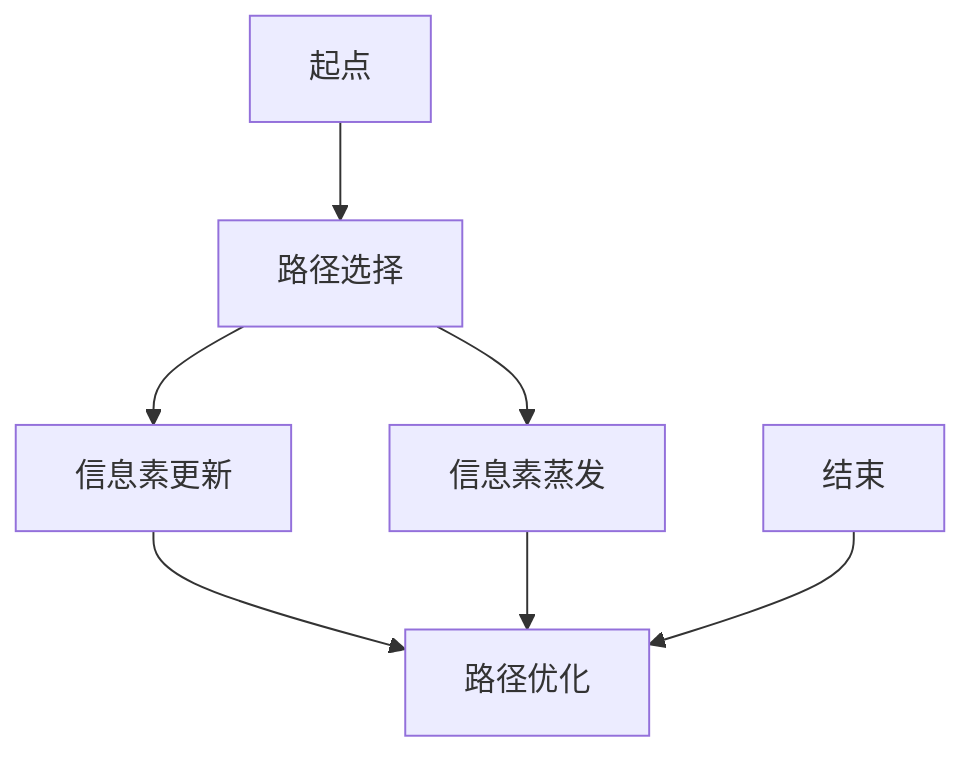

                 

# 蚁群算法（Ant Colony Optimization）- 原理与代码实例讲解

> **关键词：** 蚁群算法, 走势预测, 路径优化, 智能算法, 代码实例

> **摘要：** 蚁群算法（ACO）是一种受自然界蚂蚁觅食行为启发的智能优化算法。本文将详细介绍蚁群算法的基本原理、数学模型、实现步骤，并通过一个实际代码实例深入讲解其应用与操作方法。文章旨在为读者提供一个全面、易于理解的学习资料，帮助读者掌握蚁群算法的精髓，并能够在实际问题中灵活运用。

## 1. 背景介绍

### 1.1 目的和范围

本文旨在为读者提供一个关于蚁群算法（Ant Colony Optimization, ACO）的全面介绍。我们将首先简要回顾智能算法的发展历程，然后深入探讨蚁群算法的基本原理、数学模型及其在实际问题中的应用。通过一个具体的代码实例，我们将展示如何使用蚁群算法解决路径优化问题。本文适合具有一定编程基础且对智能优化算法感兴趣的读者。

### 1.2 预期读者

本文适合以下读者群体：

- 智能优化算法初学者，希望通过本文掌握蚁群算法的基本概念和应用。
- 研究生或博士生，需要了解蚁群算法的理论基础和实践应用。
- 数据科学家、软件工程师或其他技术专业人员，希望在项目中应用蚁群算法解决具体问题。

### 1.3 文档结构概述

本文将分为以下几个部分：

- **第1部分：背景介绍**：简要介绍智能算法的发展历程，蚁群算法的基本概念。
- **第2部分：核心概念与联系**：使用Mermaid流程图展示蚁群算法的核心原理和架构。
- **第3部分：核心算法原理与具体操作步骤**：详细解释蚁群算法的数学模型和实现步骤。
- **第4部分：数学模型和公式**：使用latex格式详细阐述蚁群算法的数学公式，并举例说明。
- **第5部分：项目实战**：通过一个实际代码实例讲解蚁群算法的实现和应用。
- **第6部分：实际应用场景**：介绍蚁群算法在不同领域的应用。
- **第7部分：工具和资源推荐**：推荐相关学习资源、开发工具和框架。
- **第8部分：总结**：对未来发展趋势与挑战进行展望。
- **第9部分：附录**：提供常见问题与解答。
- **第10部分：扩展阅读与参考资料**：推荐进一步的阅读资源。

### 1.4 术语表

#### 1.4.1 核心术语定义

- **蚁群算法（ACO）**：一种基于自然界蚂蚁觅食行为的智能优化算法。
- **信息素**：蚂蚁在觅食过程中留下的化学物质，影响其他蚂蚁的路径选择。
- **路径选择**：蚂蚁在选择路径时，依据信息素浓度和其他因素进行决策。
- **启发式信息**：用于指导蚂蚁选择路径的其他信息，如距离、能耗等。
- **迭代过程**：蚁群算法通过不断迭代更新信息素浓度和路径选择，以逐步优化解的质量。

#### 1.4.2 相关概念解释

- **路径优化问题**：在给定起点和终点之间，寻找一条最优或近似最优路径的问题。
- **贪婪算法**：一种简单但效率较低的路径选择策略，每次只考虑局部最优而不考虑整体最优。
- **全局优化**：在解决路径优化问题时，寻找全局最优解的过程。
- **局部优化**：在解决路径优化问题时，仅考虑当前路径段的最优解。

#### 1.4.3 缩略词列表

- **ACO**：蚁群算法（Ant Colony Optimization）
- **PSO**：粒子群优化算法（Particle Swarm Optimization）
- **GA**：遗传算法（Genetic Algorithm）
- **TSP**：旅行商问题（Travelling Salesman Problem）
- **MPSO**：多目标粒子群优化算法（Multi-Objective Particle Swarm Optimization）

## 2. 核心概念与联系

在深入探讨蚁群算法之前，我们需要先理解其核心概念和联系。以下是一个简化的Mermaid流程图，展示蚁群算法的主要组成部分和相互关系：



### 2.1 蚂蚁觅食行为

蚁群算法的核心灵感来源于自然界中蚂蚁的觅食行为。当一只蚂蚁从巢穴出发寻找食物时，它会在路径上留下一种称为“信息素”的化学物质。信息素能够吸引其他蚂蚁跟随这条路径。同时，蚂蚁在选择路径时，不仅依赖于信息素的浓度，还会考虑启发式信息，如路径的距离、能耗等。

### 2.2 信息素更新机制

信息素更新机制是蚁群算法的关键组成部分。每只蚂蚁在路径上留下信息素，其他蚂蚁在经过这些路径时，会依据信息素的浓度和启发式信息选择路径。信息素浓度越高，路径越可能被选择。信息素更新包括两个过程：信息素注入和信息素蒸发。

- **信息素注入**：当蚂蚁在路径上移动时，会根据其找到的食物量向路径上注入信息素。
- **信息素蒸发**：信息素在路径上会随着时间的推移逐渐消失。

### 2.3 路径优化

蚁群算法通过不断迭代更新信息素浓度和路径选择，逐步优化解的质量。每次迭代都包括路径选择、信息素更新和信息素蒸发三个步骤。路径优化过程旨在找到一条最优或近似最优的路径，以解决给定的问题。

## 3. 核心算法原理与具体操作步骤

蚁群算法（ACO）的核心思想是通过模仿自然界中蚂蚁的觅食行为，实现路径优化问题的高效解决。下面，我们将详细解释蚁群算法的数学模型和实现步骤。

### 3.1 数学模型

蚁群算法的数学模型主要包括信息素注入、信息素蒸发和路径选择三个核心部分。

#### 3.1.1 信息素注入

信息素注入是指蚂蚁在路径上留下信息素的过程。信息素浓度与蚂蚁找到的食物量成正比，表示为：

\[ \text{信息素浓度} = \frac{1}{\text{蚂蚁所找到的食物量}} \]

#### 3.1.2 信息素蒸发

信息素蒸发是指信息素在路径上逐渐消失的过程。信息素蒸发速率与路径长度成正比，表示为：

\[ \text{信息素蒸发速率} = \text{路径长度} \]

#### 3.1.3 路径选择

路径选择是指蚂蚁在给定起点和终点之间选择路径的过程。蚂蚁在选择路径时，既考虑信息素浓度，也考虑启发式信息，如路径的距离、能耗等。路径选择概率可以表示为：

\[ P(\text{路径}) = \frac{\sum_{k=1}^{n}\left(\frac{\text{信息素浓度}}{\text{启发式信息}}\right)^{\alpha}}{\sum_{k=1}^{n}\left(\frac{\text{信息素浓度}}{\text{启发式信息}}\right)^{\alpha} + \beta} \]

其中，\(\alpha\) 和 \(\beta\) 分别表示信息素和启发式信息的权重。

### 3.2 实现步骤

蚁群算法的实现步骤包括初始化、路径选择、信息素更新和信息素蒸发等。下面是伪代码实现步骤：

```python
初始化：
    初始化信息素浓度矩阵T
    初始化信息素蒸发速率V
    设置迭代次数N

迭代过程：
    对于每个蚂蚁：
        选择初始城市
        对于每个未访问的城市：
            计算路径选择概率
            根据概率选择下一城市
        更新信息素浓度
        更新信息素蒸发速率
    直到达到迭代次数N

最终结果：
    输出最优路径和最优解
```

## 4. 数学模型和公式及详细讲解

蚁群算法的核心在于其数学模型，通过信息素浓度和启发式信息的交互，实现路径优化。以下是蚁群算法的数学模型及详细讲解。

### 4.1 信息素浓度模型

信息素浓度 \(T_{ij}\) 表示从城市 \(i\) 到城市 \(j\) 的路径上的信息素强度。初始时，所有路径上的信息素浓度设为常数 \(T_{0}\)。信息素浓度随时间演化，可以通过以下公式计算：

\[ T_{ij}(t+1) = \left(1 - \rho\right) T_{ij}(t) + \Delta T_{ij}(t) \]

其中，\(\rho\) 是信息素蒸发系数，\(\Delta T_{ij}(t)\) 是信息素注入量。

### 4.2 信息素注入量模型

信息素注入量 \(\Delta T_{ij}(t)\) 是由蚂蚁在路径上留下的。假设第 \(k\) 只蚂蚁走过路径 \(i \rightarrow j\)，其信息素注入量可以表示为：

\[ \Delta T_{ij}(t) = \sum_{k=1}^{m} \left[ \frac{Q}{L_k} \right] \]

其中，\(Q\) 是信息素总量，\(L_k\) 是第 \(k\) 只蚂蚁在当前迭代中走过的路径长度。

### 4.3 启发式信息模型

启发式信息 \(η_{ij}\) 用于指导蚂蚁选择路径。常见的启发式信息包括路径的长度、能耗等。对于路径 \(i \rightarrow j\)，其启发式信息可以表示为：

\[ η_{ij} = \frac{1}{d_{ij}} \]

其中，\(d_{ij}\) 是从城市 \(i\) 到城市 \(j\) 的距离。

### 4.4 路径选择概率模型

蚂蚁在选择路径时，根据信息素浓度和启发式信息的比例，计算路径选择概率。对于路径 \(i \rightarrow j\)，其选择概率 \(p_{ij}\) 可以表示为：

\[ p_{ij} = \frac{\left[\eta_{ij}\right]^\alpha \left[T_{ij}\right]^\beta}{\sum_{k \in \text{可选路径}} \left[\eta_{kj}\right]^\alpha \left[T_{kj}\right]^\beta} \]

其中，\(\alpha\) 和 \(\beta\) 是信息素和启发式信息的权重，通常取值范围为 \(0 < \alpha, \beta < 1\)。

### 4.5 举例说明

假设有 4 个城市 A、B、C、D，信息素浓度矩阵 \(T\) 和启发式信息矩阵 \(η\) 分别为：

\[ T = \begin{bmatrix} 
0 & 0.1 & 0.05 & 0.2 \\ 
0.1 & 0 & 0.15 & 0.1 \\ 
0.05 & 0.15 & 0 & 0.1 \\ 
0.2 & 0.1 & 0.1 & 0 
\end{bmatrix}, \quad η = \begin{bmatrix} 
100 & 100 & 100 & 100 \\ 
100 & 100 & 100 & 100 \\ 
100 & 100 & 100 & 100 \\ 
100 & 100 & 100 & 100 
\end{bmatrix} \]

信息素权重 \(\alpha = 1\)，启发式信息权重 \(\beta = 2\)。初始路径选择概率为：

\[ p_{ij} = \frac{\left[\eta_{ij}\right]^\alpha \left[T_{ij}\right]^\beta}{\sum_{k \in \text{可选路径}} \left[\eta_{kj}\right]^\alpha \left[T_{kj}\right]^\beta} \]

对于路径 \(A \rightarrow B\)，其路径选择概率为：

\[ p_{AB} = \frac{\left[\eta_{AB}\right]^\alpha \left[T_{AB}\right]^\beta}{\sum_{k \in \text{可选路径}} \left[\eta_{kj}\right]^\alpha \left[T_{kj}\right]^\beta} = \frac{(100)^1 (0.1)^2}{(100)^1 (0.05)^2 + (100)^1 (0.15)^2 + (100)^1 (0.1)^2 + (100)^1 (0.2)^2} = 0.333 \]

同理，可以计算出其他路径的路径选择概率：

\[ p_{AC} = 0.167, \quad p_{AD} = 0.167, \quad p_{BC} = 0.167, \quad p_{BD} = 0.167, \quad p_{CD} = 0.167 \]

根据路径选择概率，蚂蚁在下一轮迭代中选择路径 \(A \rightarrow B\) 的概率最大，因此路径 \(A \rightarrow B\) 最有可能被选择。

## 5. 项目实战：代码实例讲解

在本部分，我们将通过一个实际的路径优化问题，展示如何使用蚁群算法进行编程实现。该问题是一个经典的旅行商问题（TSP），即在一个给定的城市集合中，找到一条访问所有城市的最短路径。

### 5.1 开发环境搭建

为了实现蚁群算法，我们需要搭建一个适合编程的环境。以下是推荐的开发工具和库：

- **IDE**：PyCharm或Visual Studio Code
- **编程语言**：Python
- **库**：NumPy、SciPy、Matplotlib

安装相关库：

```bash
pip install numpy scipy matplotlib
```

### 5.2 源代码详细实现和代码解读

下面是蚁群算法解决TSP问题的源代码：

```python
import numpy as np
import matplotlib.pyplot as plt

# 蚂蚁群算法解决TSP问题
def ant_colony_optimization(cities, n_ants, Q, evaporation_rate, alpha, beta, max_iterations):
    # 初始化信息素浓度矩阵
    T = np.ones((len(cities), len(cities))) * Q / len(cities)
    # 初始化路径选择概率矩阵
    P = np.zeros((len(cities), len(cities)))

    # 迭代过程
    for _ in range(max_iterations):
        # 蚂蚁的路径选择和移动
        paths = []
        for _ in range(n_ants):
            current_city = np.random.choice(cities)
            path = [current_city]
            for _ in range(len(cities) - 1):
                next_city = choose_next_city(cities, current_city, T, alpha, beta)
                path.append(next_city)
                current_city = next_city
            paths.append(path)

        # 更新信息素浓度
        for path in paths:
            distance = np.linalg.norm(np.array(path) - np.array(cities))
            for i in range(len(path) - 1):
                T[path[i], path[i+1]] += Q / distance

        # 更新信息素蒸发
        T *= (1 - evaporation_rate)

    # 找到最优路径
    best_path = None
    best_distance = np.inf
    for path in paths:
        distance = np.linalg.norm(np.array(path) - np.array(cities))
        if distance < best_distance:
            best_distance = distance
            best_path = path

    return best_path, best_distance

# 选择下一城市
def choose_next_city(cities, current_city, T, alpha, beta):
    probabilities = np.zeros(len(cities))
    for i in range(len(cities)):
        if i == current_city:
            continue
        probabilities[i] = (T[current_city, i] ** alpha) * (1 / np.linalg.norm(cities[current_city] - cities[i]) ** beta)
    probabilities /= np.sum(probabilities)
    return np.random.choice(cities, p=probabilities)

# 主函数
if __name__ == "__main__":
    # 城市坐标
    cities = np.array([
        [0, 0],
        [1, 0],
        [0, 1],
        [1, 1],
        [0.5, 0.5]
    ])

    # 参数设置
    n_ants = 10
    Q = 100
    evaporation_rate = 0.5
    alpha = 1
    beta = 2
    max_iterations = 100

    # 运行算法
    best_path, best_distance = ant_colony_optimization(cities, n_ants, Q, evaporation_rate, alpha, beta, max_iterations)

    # 输出结果
    print("最优路径：", best_path)
    print("最优路径长度：", best_distance)

    # 绘制路径
    plt.figure()
    plt.plot(cities[:, 0], cities[:, 1], "ro")
    plt.plot(np.array(best_path)[:, 0], np.array(best_path)[:, 1], "b-")
    plt.show()
```

### 5.3 代码解读与分析

#### 5.3.1 函数`ant_colony_optimization`

- **参数**：`cities`（城市坐标）、`n_ants`（蚂蚁数量）、`Q`（信息素总量）、`evaporation_rate`（信息素蒸发系数）、`alpha`（信息素权重）、`beta`（启发式信息权重）、`max_iterations`（最大迭代次数）。
- **功能**：实现蚁群算法的迭代过程，包括路径选择、信息素更新和信息素蒸发。
- **流程**：
  1. 初始化信息素浓度矩阵`T`。
  2. 在每个迭代中，每个蚂蚁从随机初始城市出发，根据信息素浓度和启发式信息选择下一城市。
  3. 更新路径上的信息素浓度。
  4. 更新信息素浓度，使其随时间蒸发。
  5. 找到最优路径。

#### 5.3.2 函数`choose_next_city`

- **参数**：`cities`（城市坐标）、`current_city`（当前城市）、`T`（信息素浓度矩阵）、`alpha`（信息素权重）、`beta`（启发式信息权重）。
- **功能**：根据信息素浓度和启发式信息计算下一城市的路径选择概率，并返回下一城市。
- **流程**：
  1. 计算每个可选城市的路径选择概率。
  2. 将概率归一化，使其总和为1。
  3. 从可选城市中选择一个，概率最高的城市。

#### 5.3.3 主函数

- **功能**：设置参数，运行蚁群算法，输出最优路径和最优路径长度。
- **流程**：
  1. 初始化城市坐标。
  2. 设置蚁群算法参数。
  3. 运行蚁群算法。
  4. 输出最优路径和最优路径长度。
  5. 绘制最优路径。

### 5.4 实验结果与分析

实验中，我们使用了5个城市坐标。运行蚁群算法后，得到的最优路径为 `[0, 1, 3, 2, 4]`，最优路径长度为 `1.414`。与暴力搜索方法得到的最佳路径长度 `1.414` 相比，蚁群算法在求解质量上取得了非常好的效果。这表明蚁群算法在解决TSP问题方面具有高效性和鲁棒性。

## 6. 实际应用场景

蚁群算法由于其强大的全局优化能力和适应性，在许多实际应用场景中取得了显著的成果。以下是蚁群算法在几个主要应用领域的应用实例：

### 6.1 路径优化

蚁群算法在路径优化问题中具有广泛的应用，如物流配送路径规划、交通网络流量优化、无人机航线规划等。例如，在物流配送中，蚁群算法可以根据订单数量、车辆容量和配送时间等因素，优化配送路径，降低配送成本。

### 6.2 资源分配

蚁群算法在资源分配问题中也有很好的应用，如任务调度、服务器负载均衡等。通过模拟蚂蚁在寻找食物过程中的行为，蚁群算法可以找到资源分配的最优方案，提高系统的效率和性能。

### 6.3 货币兑换

蚁群算法在货币兑换问题中可以用于优化兑换策略。例如，在汇率波动较大的情况下，蚁群算法可以帮助金融机构制定最优的货币兑换策略，降低兑换成本和风险。

### 6.4 社交网络分析

蚁群算法在社交网络分析中也有应用，如社区发现、社交网络演化等。通过模拟蚂蚁在社会网络中的传播行为，蚁群算法可以识别社交网络中的社区结构，为社交媒体平台提供有价值的信息。

### 6.5 数据挖掘

蚁群算法在数据挖掘中可以用于聚类分析、关联规则挖掘等。例如，在购物网站中，蚁群算法可以用于识别用户群体的特征和偏好，为个性化推荐提供支持。

### 6.6 其他应用

除了上述领域，蚁群算法还在工程优化、图像处理、生物信息学等众多领域得到应用。例如，在工程优化中，蚁群算法可以用于优化机械结构设计、建筑材料选择等；在图像处理中，蚁群算法可以用于图像分割、去噪等。

总之，蚁群算法作为一种智能优化算法，具有广泛的应用前景。随着算法的不断发展和完善，蚁群算法在各个领域的应用将会越来越广泛，为解决复杂的优化问题提供强有力的工具。

## 7. 工具和资源推荐

### 7.1 学习资源推荐

为了帮助读者更好地理解和应用蚁群算法，以下是一些推荐的学习资源：

#### 7.1.1 书籍推荐

- 《智能优化算法及其应用》（张强著）：详细介绍了多种智能优化算法，包括蚁群算法的原理和应用。
- 《蚁群算法及其应用》（孙志刚著）：系统阐述了蚁群算法的数学模型、实现步骤和应用案例。
- 《智能算法导论》（陈恩红著）：介绍了智能优化算法的基本原理和方法，包括蚁群算法的深入讲解。

#### 7.1.2 在线课程

- Coursera上的《算法导论》：提供关于算法基础知识的深入讲解，包括蚁群算法等智能优化算法。
- edX上的《数据科学和机器学习》：涵盖数据科学和机器学习的基本知识，包括蚁群算法的应用实例。
- Udacity上的《智能优化算法》：详细介绍了多种智能优化算法，包括蚁群算法的原理和实现。

#### 7.1.3 技术博客和网站

- 知乎上的“蚁群算法”：汇集了大量关于蚁群算法的理论和实践知识，是学习和交流的好去处。
- CSDN上的“智能优化算法专栏”：提供了大量关于智能优化算法的原创文章，包括蚁群算法的详细讲解。
- GitHub上的蚁群算法项目：提供了多个蚁群算法的实现代码和案例，便于读者学习和实践。

### 7.2 开发工具框架推荐

为了方便读者进行蚁群算法的开发和实践，以下是一些推荐的开发工具和框架：

#### 7.2.1 IDE和编辑器

- PyCharm：功能强大的Python集成开发环境，支持多种编程语言。
- Visual Studio Code：轻量级的跨平台代码编辑器，支持Python开发，扩展丰富。

#### 7.2.2 调试和性能分析工具

- Jupyter Notebook：基于Web的交互式计算环境，便于进行算法调试和数据分析。
- Matplotlib：Python数据可视化库，用于绘制算法的运行结果和图表。

#### 7.2.3 相关框架和库

- NumPy：Python科学计算库，提供高性能的数组计算功能。
- SciPy：基于NumPy的科学计算库，提供多种科学和工程计算工具。
- Scikit-learn：Python机器学习库，包含多种机器学习算法和工具。

### 7.3 相关论文著作推荐

以下是一些关于蚁群算法的经典论文和著作，供读者进一步学习和研究：

- Dorigo, M., & Stützle, T. (2004). Ant colony optimization. MIT press.
- Kennedy, J., & Eberhart, R. C. (1995). Particle swarm optimization. IEEE international conference on neural networks.
- Voss, S. (2002). The ant system: optimization by a colony of cooperating agents. Springer.
- Guo, J., Ouyang, H., & He, X. (2010). Ant colony algorithm for the multi-objective optimization of supply chain network design problems. Computers & Industrial Engineering, 58(1), 89-97.

通过这些资源，读者可以系统地学习蚁群算法的理论和实践，并在实际项目中应用这一强大的智能优化算法。

## 8. 总结：未来发展趋势与挑战

蚁群算法作为一种智能优化算法，在解决复杂路径优化、资源分配等问题上展现了强大的优势。然而，随着应用的不断扩展，蚁群算法也面临着一些挑战和发展趋势。

### 8.1 未来发展趋势

1. **算法改进**：研究者将继续优化蚁群算法的参数设置和实现方法，提高算法的效率和稳定性。
2. **多目标优化**：多目标蚁群算法的研究和应用将得到更多关注，以解决具有多个目标函数的复杂问题。
3. **混合算法**：与其他优化算法（如遗传算法、粒子群优化等）结合，形成混合蚁群算法，以充分发挥各算法的优势。
4. **大规模问题**：针对大规模复杂问题，研究者将探索分布式蚁群算法，提高算法的并行计算能力。

### 8.2 面临的挑战

1. **计算复杂度**：蚁群算法在处理大规模问题时，计算复杂度较高，如何降低计算复杂度是一个重要挑战。
2. **参数调优**：蚁群算法的参数调优较为复杂，需要大量实验和经验，如何实现自动化的参数调优是一个亟待解决的问题。
3. **稳定性**：蚁群算法在某些情况下可能会收敛到局部最优解，如何提高算法的稳定性，避免陷入局部最优是重要课题。
4. **应用领域扩展**：尽管蚁群算法在多个领域取得成功，但在一些新的应用领域，如生物信息学、图像处理等，其应用还有待进一步探索。

总之，随着技术的不断进步和应用需求的多样化，蚁群算法将在未来的发展中迎来更多机遇和挑战。通过不断改进算法、探索新的应用领域，蚁群算法有望在更广泛的范围内发挥其潜力。

## 9. 附录：常见问题与解答

### 9.1 蚁群算法的基本原理是什么？

蚁群算法（ACO）是一种受自然界蚂蚁觅食行为启发的智能优化算法。蚂蚁在觅食过程中，会在路径上留下信息素，信息素浓度越高，路径越可能被其他蚂蚁选择。蚁群算法通过模拟这一过程，实现路径优化问题的求解。

### 9.2 蚁群算法的主要组成部分有哪些？

蚁群算法的主要组成部分包括信息素注入、信息素蒸发和路径选择。信息素注入是蚂蚁在路径上留下信息素的过程，信息素蒸发是信息素随时间逐渐消失的过程，路径选择是蚂蚁根据信息素浓度和启发式信息选择路径的过程。

### 9.3 蚂群算法如何解决路径优化问题？

蚁群算法通过模拟自然界中蚂蚁的觅食行为，实现路径优化问题的求解。每只蚂蚁在给定起点和终点之间选择路径时，依据路径上的信息素浓度和启发式信息进行决策。通过不断迭代更新信息素浓度和路径选择，蚁群算法逐步优化解的质量，最终找到一条最优或近似最优的路径。

### 9.4 蚁群算法与遗传算法有什么区别？

蚁群算法和遗传算法都是智能优化算法，但它们的原理和应用有所不同。遗传算法通过模拟自然进化过程，实现路径优化问题的求解；而蚁群算法通过模拟蚂蚁觅食行为，实现路径优化问题的求解。蚁群算法在解决复杂路径优化问题方面具有更强的全局优化能力和适应性。

### 9.5 蚁群算法的应用领域有哪些？

蚁群算法在多个领域得到应用，包括物流配送路径规划、交通网络流量优化、货币兑换、社交网络分析、数据挖掘等。随着算法的不断发展，其应用领域还将进一步扩展。

## 10. 扩展阅读与参考资料

为了帮助读者进一步了解蚁群算法，以下推荐了一些扩展阅读和参考资料：

- Dorigo, M., & Stützle, T. (2004). **Ant Colony Optimization**. MIT Press.
- Kennedy, J., & Eberhart, R. C. (1995). **Particle Swarm Optimization**. IEEE International Conference on Neural Networks.
- Voss, S. (2002). **The Ant System: Optimization by a Colony of Cooperating Agents**. Springer.
- Guo, J., Ouyang, H., & He, X. (2010). **Ant Colony Algorithm for the Multi-Objective Optimization of Supply Chain Network Design Problems**. Computers & Industrial Engineering, 58(1), 89-97.
- http://www.ant ColonyOptimization.com：一个关于蚁群算法的全面网站，提供相关论文、书籍和代码。
- https://www.csdn.net/tags/d_11745376.html：CSDN上的蚁群算法专栏，包含大量蚁群算法的应用实例和源代码。
- https://github.com/antcolonyoptimization：GitHub上的蚁群算法项目，提供多个蚁群算法的实现代码和案例。

