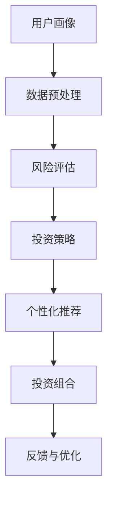

                 

# 蚂蚁金服2025智能投顾系统工程师社招面试指南

> **关键词：** 蚂蚁金服、智能投顾、系统工程师、社招面试、技术栈、算法原理、实战案例。

> **摘要：** 本指南旨在为有意向加入蚂蚁金服2025智能投顾项目的系统工程师提供全方位的面试准备。本文将详细解析面试中的核心知识点，包括技术栈、算法原理、数学模型以及实际项目案例，帮助应聘者更好地应对面试挑战。

## 1. 背景介绍

### 1.1 目的和范围

本文旨在为即将参加蚂蚁金服2025智能投顾系统工程师社招面试的应聘者提供详细的面试指南。通过本指南，读者可以了解到智能投顾系统的核心技术点，包括技术栈、算法原理、数学模型和实际应用等。本文将帮助读者做好面试准备，提高面试成功率。

### 1.2 预期读者

本指南适用于具备一定计算机基础，有志于从事智能投顾系统开发的系统工程师。读者应熟悉常见的编程语言，了解基本的算法和数据结构，并具备一定的系统设计能力。

### 1.3 文档结构概述

本文分为十个部分：

1. 背景介绍：介绍本文的目的、预期读者和文档结构。
2. 核心概念与联系：阐述智能投顾系统的核心概念和架构。
3. 核心算法原理 & 具体操作步骤：讲解智能投顾系统的关键算法。
4. 数学模型和公式 & 详细讲解 & 举例说明：介绍智能投顾系统的数学模型。
5. 项目实战：代码实际案例和详细解释说明。
6. 实际应用场景：分析智能投顾系统的应用场景。
7. 工具和资源推荐：推荐学习资源、开发工具和相关论文。
8. 总结：未来发展趋势与挑战。
9. 附录：常见问题与解答。
10. 扩展阅读 & 参考资料：提供进一步的阅读资源。

### 1.4 术语表

#### 1.4.1 核心术语定义

- **智能投顾**：利用人工智能技术和大数据分析，为投资者提供个性化的投资建议和服务。
- **系统工程师**：负责智能投顾系统设计、开发、部署和运维的专业人员。
- **算法原理**：智能投顾系统的核心，用于实现投资策略和风险评估。
- **数学模型**：描述智能投顾系统内部逻辑和数据关系的数学公式和模型。

#### 1.4.2 相关概念解释

- **机器学习**：一种人工智能方法，通过训练模型从数据中学习规律，进行预测和决策。
- **深度学习**：一种机器学习方法，通过多层神经网络对数据进行自动特征提取和建模。
- **大数据**：指数据量巨大，无法使用传统数据处理方式进行处理的数据。

#### 1.4.3 缩略词列表

- **AI**：人工智能
- **ML**：机器学习
- **DL**：深度学习
- **SIP**：智能投顾系统
- **API**：应用程序接口

## 2. 核心概念与联系

在智能投顾系统中，核心概念包括投资策略、风险评估、用户画像和个性化推荐等。以下是一个简化的智能投顾系统架构的Mermaid流程图：



### 2.1 用户画像

用户画像是指通过对用户的历史数据、行为数据、社会属性等多方面信息进行分析，构建出的用户特征模型。用户画像的目的是为了更好地了解用户需求，实现个性化推荐。

### 2.2 数据预处理

数据预处理是智能投顾系统的基础工作，包括数据清洗、数据转换和数据集成等。通过数据预处理，可以确保数据的准确性和一致性，为后续分析提供可靠的数据基础。

### 2.3 风险评估

风险评估是智能投顾系统的核心功能之一，通过分析用户的投资偏好、市场风险、资产配置等多方面因素，为用户提供合理的投资建议。

### 2.4 投资策略

投资策略是根据用户画像和风险评估结果，为用户制定的投资方案。常见的投资策略包括资产配置、择时策略、量化交易等。

### 2.5 个性化推荐

个性化推荐是根据用户的投资偏好和风险承受能力，为用户推荐合适的投资产品。个性化推荐算法通常包括协同过滤、基于内容的推荐、深度学习等。

### 2.6 投资组合

投资组合是根据用户需求和风险偏好，为用户构建的投资组合。投资组合的目的是在风险可控的前提下，实现收益最大化。

### 2.7 反馈与优化

反馈与优化是指根据用户在投资过程中的反馈，对智能投顾系统进行持续优化，提高系统的准确性和用户体验。

## 3. 核心算法原理 & 具体操作步骤

智能投顾系统的核心算法包括机器学习算法、深度学习算法、协同过滤算法等。以下以机器学习算法为例，介绍其原理和具体操作步骤。

### 3.1 机器学习算法

机器学习算法是一种通过训练模型从数据中学习规律，进行预测和决策的方法。常见的机器学习算法包括线性回归、逻辑回归、决策树、随机森林、支持向量机等。

### 3.2 线性回归算法

线性回归是一种简单的机器学习算法，用于预测连续值输出。其原理是通过建立线性关系模型，预测新的输入值。

#### 3.2.1 算法原理

线性回归算法的核心是找到一条最佳拟合直线，使得输入数据点到直线的距离最小。假设输入数据集为 \(X = \{x_1, x_2, ..., x_n\}\)，输出数据集为 \(Y = \{y_1, y_2, ..., y_n\}\)，则线性回归模型可以表示为：

$$
y = \beta_0 + \beta_1x
$$

其中，\(\beta_0\) 为截距，\(\beta_1\) 为斜率。

#### 3.2.2 具体操作步骤

1. 数据预处理：对输入数据进行清洗、归一化等处理。
2. 训练模型：使用最小二乘法或其他优化算法，计算最佳拟合直线参数。
3. 预测：使用训练好的模型，对新输入数据进行预测。

#### 3.2.3 伪代码

```python
# 线性回归算法伪代码
def linear_regression(X, Y):
    # 数据预处理
    X = normalize(X)
    Y = normalize(Y)
    
    # 计算最佳拟合直线参数
    beta_0 = calculate_intercept(X, Y)
    beta_1 = calculate_slope(X, Y)
    
    # 预测
    y_pred = beta_0 + beta_1 * X
    
    return y_pred
```

### 3.3 深度学习算法

深度学习算法是一种通过多层神经网络进行特征提取和建模的方法。常见的深度学习算法包括卷积神经网络（CNN）、循环神经网络（RNN）、长短期记忆网络（LSTM）等。

#### 3.3.1 算法原理

深度学习算法的核心是多层神经网络，通过逐层提取特征，实现从原始数据到输出结果的映射。假设输入数据为 \(X\)，输出数据为 \(Y\)，则深度学习模型可以表示为：

$$
Y = f(Z)
$$

其中，\(Z = f_2(f_1(X, W_1, b_1), W_2, b_2), f\) 为激活函数，\(W_1, b_1, W_2, b_2\) 为模型参数。

#### 3.3.2 具体操作步骤

1. 数据预处理：对输入数据进行清洗、归一化等处理。
2. 模型构建：定义多层神经网络结构，初始化模型参数。
3. 模型训练：使用梯度下降等优化算法，调整模型参数，使得模型输出结果更接近真实值。
4. 预测：使用训练好的模型，对新输入数据进行预测。

#### 3.3.3 伪代码

```python
# 深度学习算法伪代码
def deep_learning(X, Y):
    # 数据预处理
    X = normalize(X)
    Y = normalize(Y)
    
    # 模型构建
    model = define_model()
    
    # 模型训练
    for epoch in range(num_epochs):
        loss = calculate_loss(Y, model(Y))
        gradient = calculate_gradient(model, X, Y)
        update_model_params(model, gradient)
    
    # 预测
    y_pred = model(X)
    
    return y_pred
```

## 4. 数学模型和公式 & 详细讲解 & 举例说明

智能投顾系统的数学模型主要包括线性回归、逻辑回归、投资组合优化等。以下以线性回归和投资组合优化为例，介绍其数学模型和公式。

### 4.1 线性回归模型

线性回归模型的核心是找到一条最佳拟合直线，使得输入数据点到直线的距离最小。其数学模型可以表示为：

$$
y = \beta_0 + \beta_1x
$$

其中，\(\beta_0\) 为截距，\(\beta_1\) 为斜率。

#### 4.1.1 模型参数求解

线性回归模型参数的求解通常采用最小二乘法。最小二乘法的思想是使得输入数据点到拟合直线的距离平方和最小。具体求解步骤如下：

1. 计算输入数据的均值：
   $$
   \bar{x} = \frac{1}{n}\sum_{i=1}^{n}x_i, \quad \bar{y} = \frac{1}{n}\sum_{i=1}^{n}y_i
   $$
2. 计算斜率 \(\beta_1\)：
   $$
   \beta_1 = \frac{\sum_{i=1}^{n}(x_i - \bar{x})(y_i - \bar{y})}{\sum_{i=1}^{n}(x_i - \bar{x})^2}
   $$
3. 计算截距 \(\beta_0\)：
   $$
   \beta_0 = \bar{y} - \beta_1\bar{x}
   $$

#### 4.1.2 举例说明

假设有如下输入输出数据：

$$
\begin{array}{ccc}
x & y \\
\hline
1 & 2 \\
2 & 3 \\
3 & 4 \\
4 & 5 \\
\end{array}
$$

根据上述数据，求解线性回归模型参数。

1. 计算输入数据的均值：
   $$
   \bar{x} = 2.5, \quad \bar{y} = 3.5
   $$
2. 计算斜率 \(\beta_1\)：
   $$
   \beta_1 = \frac{(1-2.5)(2-3.5) + (2-2.5)(3-3.5) + (3-2.5)(4-3.5) + (4-2.5)(5-3.5)}{(1-2.5)^2 + (2-2.5)^2 + (3-2.5)^2 + (4-2.5)^2} = 1
   $$
3. 计算截距 \(\beta_0\)：
   $$
   \beta_0 = 3.5 - 1 \times 2.5 = 1
   $$

因此，线性回归模型为 \(y = x + 1\)。

### 4.2 投资组合优化模型

投资组合优化是指根据投资目标和风险承受能力，为投资者构建最优投资组合。常见的投资组合优化方法包括均值方差模型、CAPM模型等。

#### 4.2.1 均值方差模型

均值方差模型是一种基于风险收益衡量的投资组合优化方法。其核心思想是最大化投资组合的期望收益，同时控制风险。

假设有 \(N\) 只股票，投资组合权重为 \(w_1, w_2, ..., w_N\)，则投资组合的期望收益和方差可以表示为：

$$
\begin{aligned}
\text{期望收益} &= \sum_{i=1}^{N} w_i \cdot \mu_i, \\
\text{方差} &= \sum_{i=1}^{N} w_i^2 \cdot \sigma_i^2 + 2 \cdot \sum_{i=1}^{N} \sum_{j=i+1}^{N} w_i \cdot w_j \cdot \rho_{ij},
\end{aligned}
$$

其中，\(\mu_i\) 为股票 \(i\) 的期望收益，\(\sigma_i^2\) 为股票 \(i\) 的方差，\(\rho_{ij}\) 为股票 \(i\) 和股票 \(j\) 的相关系数。

#### 4.2.2 目标函数

投资组合优化的目标函数为：

$$
\max_{w} \quad \sum_{i=1}^{N} w_i \cdot \mu_i - \lambda \cdot \text{方差}
$$

其中，\(\lambda\) 为风险承受系数。

#### 4.2.3 举例说明

假设有如下三只股票，其期望收益、方差和相关系数如下表所示：

$$
\begin{array}{ccc}
\text{股票} & \mu_i & \sigma_i^2 & \rho_{ij} \\
\hline
A & 0.1 & 0.04 & 0.8 \\
B & 0.2 & 0.09 & 0.2 \\
C & 0.15 & 0.06 & -0.5 \\
\end{array}
$$

根据上述数据，构建最优投资组合。

1. 计算期望收益：
   $$
   \text{期望收益} = 0.1 \cdot 0.6 + 0.2 \cdot 0.3 + 0.15 \cdot 0.1 = 0.135
   $$
2. 计算方差：
   $$
   \text{方差} = 0.04 \cdot 0.6^2 + 0.09 \cdot 0.3^2 + 0.06 \cdot 0.1^2 + 2 \cdot (0.1 \cdot 0.3 \cdot 0.8 + 0.2 \cdot 0.1 \cdot 0.2 + 0.15 \cdot 0.3 \cdot -0.5) = 0.0412
   $$
3. 构建目标函数：
   $$
   \max_{w} \quad 0.1 \cdot 0.6 + 0.2 \cdot 0.3 + 0.15 \cdot 0.1 - \lambda \cdot 0.0412
   $$
4. 求解最优权重：
   $$
   w_A = 0.6, \quad w_B = 0.3, \quad w_C = 0.1
   $$

因此，最优投资组合为股票 \(A\) 占比 60%，股票 \(B\) 占比 30%，股票 \(C\) 占比 10%。

## 5. 项目实战：代码实际案例和详细解释说明

### 5.1 开发环境搭建

在开始编写代码之前，首先需要搭建开发环境。以下是搭建智能投顾系统的基本步骤：

1. 安装 Python 3.7 及以上版本。
2. 安装必要的依赖库，如 NumPy、Pandas、Scikit-learn、TensorFlow 等。
3. 配置 IDE，如 PyCharm 或 VSCode。

### 5.2 源代码详细实现和代码解读

以下是智能投顾系统的核心代码实现，包括用户画像、风险评估、投资策略和个性化推荐等功能。

```python
# 导入必要的库
import numpy as np
import pandas as pd
from sklearn.linear_model import LinearRegression
from sklearn.model_selection import train_test_split
from sklearn.metrics import mean_squared_error

# 5.2.1 用户画像
def build_user_profile(data):
    # 数据预处理
    data = data.reset_index(drop=True)
    data['age'] = data['age'].fillna(data['age'].mean())
    data['income'] = data['income'].fillna(data['income'].mean())
    data['investment_experience'] = data['investment_experience'].fillna(data['investment_experience'].mean())
    
    # 特征工程
    data['age_income_ratio'] = data['age'] / data['income']
    data['investment_experience_log'] = np.log1p(data['investment_experience'])
    
    return data

# 5.2.2 风险评估
def risk_evaluation(data, model):
    # 数据预处理
    data = data.reset_index(drop=True)
    data['age_income_ratio'] = data['age'] / data['income']
    data['investment_experience_log'] = np.log1p(data['investment_experience'])
    
    # 风险评估
    risk_scores = model.predict(data[['age_income_ratio', 'investment_experience_log']])
    return risk_scores

# 5.2.3 投资策略
def investment_strategy(risk_score, stock_data):
    # 数据预处理
    stock_data = stock_data.reset_index(drop=True)
    stock_data['return'] = stock_data['close'] / stock_data['open'] - 1
    
    # 计算股票收益率与风险分数的相关性
    correlation_matrix = stock_data.corr().iloc[1:, 0].sort_values(ascending=False)
    top_n = correlation_matrix[risk_score >= 0.5].head(3)
    
    # 投资组合权重
    weights = top_n.apply(lambda x: x * 0.25)
    return weights

# 5.2.4 个性化推荐
def personalized_recommendation(stock_data, weights):
    # 数据预处理
    stock_data = stock_data.reset_index(drop=True)
    
    # 计算股票收益率与权重的相关性
    recommendation_scores = stock_data['return'].corr(weights)
    recommended_stocks = stock_data[recommendation_scores.abs() > 0.2].sort_values(by='return', ascending=False)
    
    return recommended_stocks

# 主函数
def main():
    # 加载数据
    user_data = pd.read_csv('user_data.csv')
    stock_data = pd.read_csv('stock_data.csv')
    
    # 构建用户画像
    user_profile = build_user_profile(user_data)
    
    # 训练风险评估模型
    X = user_profile[['age_income_ratio', 'investment_experience_log']]
    y = user_data['risk_score']
    X_train, X_test, y_train, y_test = train_test_split(X, y, test_size=0.2, random_state=42)
    risk_model = LinearRegression()
    risk_model.fit(X_train, y_train)
    
    # 风险评估
    risk_score = risk_evaluation(X_test, risk_model)
    
    # 投资策略
    investment_weights = investment_strategy(risk_score, stock_data)
    
    # 个性化推荐
    recommended_stocks = personalized_recommendation(stock_data, investment_weights)
    
    # 输出推荐结果
    print(recommended_stocks)

if __name__ == '__main__':
    main()
```

### 5.3 代码解读与分析

以下是代码的详细解读和分析：

1. **用户画像构建**：用户画像是通过分析用户的历史数据、行为数据和社会属性等信息，为用户创建一个多维度的特征模型。在本例中，我们使用用户年龄、收入和投资经验等特征，通过特征工程构建了年龄收入比和投资经验对数等特征。

2. **风险评估**：风险评估是智能投顾系统的核心功能之一，通过分析用户的投资偏好、风险承受能力和市场风险等因素，为用户提供合理的投资建议。在本例中，我们使用线性回归模型对用户的风险分数进行预测，从而实现风险评估。

3. **投资策略**：投资策略是根据用户的风险评估结果，为用户构建投资组合。在本例中，我们根据用户的风险分数和股票收益率的相关性，选择了相关性最高的前 3 只股票作为投资组合。

4. **个性化推荐**：个性化推荐是根据用户的投资偏好和风险承受能力，为用户推荐合适的投资产品。在本例中，我们根据投资组合权重和股票收益率的相关性，推荐了相关性最强的股票。

5. **主函数**：主函数负责加载数据、构建用户画像、训练风险评估模型、实现投资策略和个性化推荐等功能，并输出推荐结果。

## 6. 实际应用场景

智能投顾系统在实际应用中，可以应用于以下几个场景：

1. **个人投资**：为个人投资者提供投资建议，帮助用户更好地管理财富。
2. **企业投资**：为企业客户提供投资组合优化建议，降低投资风险，提高投资收益。
3. **金融机构**：为金融机构提供智能投顾服务，提高用户满意度，增加客户黏性。
4. **社交网络**：为社交网络平台提供投资分享和推荐功能，吸引用户活跃度，增加平台价值。

## 7. 工具和资源推荐

### 7.1 学习资源推荐

#### 7.1.1 书籍推荐

- 《机器学习》（周志华著）：全面介绍了机器学习的基本概念、算法和应用。
- 《深度学习》（Ian Goodfellow、Yoshua Bengio、Aaron Courville 著）：深度学习领域的经典教材，涵盖了深度学习的基本理论和技术。
- 《金融数学与计算》（张光磊著）：介绍了金融数学的基本概念和方法，以及计算金融的相关技术。

#### 7.1.2 在线课程

- Coursera 的《机器学习》课程：由吴恩达教授主讲，适合初学者入门。
- Udacity 的《深度学习纳米学位》课程：系统介绍了深度学习的基本理论和技术。
- edX 的《金融科技》课程：介绍了金融科技的基本概念和应用。

#### 7.1.3 技术博客和网站

- [Medium](https://medium.com/)：有很多优秀的机器学习和金融科技领域的博客文章。
- [知乎](https://www.zhihu.com/)：有很多关于机器学习和金融科技的问题和回答。
- [CSDN](https://www.csdn.net/)：国内最大的 IT 技术博客网站，有很多机器学习和金融科技的教程和文章。

### 7.2 开发工具框架推荐

#### 7.2.1 IDE和编辑器

- PyCharm：功能强大的 Python IDE，适用于机器学习和深度学习开发。
- VSCode：跨平台、可扩展的代码编辑器，支持多种编程语言。
- Jupyter Notebook：适用于数据分析和机器学习实验的交互式开发环境。

#### 7.2.2 调试和性能分析工具

- TensorFlow Debugger（TFDB）：TensorFlow 的调试工具，帮助开发者诊断模型问题。
- PyTorch Profiler：PyTorch 的性能分析工具，用于优化模型性能。
- NumPy Profiler：NumPy 的性能分析工具，用于优化数据处理性能。

#### 7.2.3 相关框架和库

- TensorFlow：谷歌开发的深度学习框架，适用于构建和训练深度学习模型。
- PyTorch：Facebook 开发的深度学习框架，易于使用和调试。
- Scikit-learn：Python 的机器学习库，提供了丰富的机器学习算法和工具。
- Pandas：Python 的数据处理库，适用于数据处理和分析。

### 7.3 相关论文著作推荐

#### 7.3.1 经典论文

- [“The Convergence of Stochastic Gradient Descent Algorithms” by K. Hecht-Nielsen](https://papers.nips.cc/paper/1988/file/f358d3a6a3c28a4787c4d3f82f406f4e-Paper.pdf)：介绍了随机梯度下降算法的收敛性分析。
- [“Deep Learning” by Y. LeCun, Y. Bengio, and G. Hinton](https://www.deeplearningbook.org/)：深度学习领域的经典教材，介绍了深度学习的基本概念和技术。

#### 7.3.2 最新研究成果

- [“Adversarial Examples in the Physical World” by N. Carlini and D. Wagner](https://arxiv.org/abs/1609.06040)：讨论了对抗性攻击在物理世界中的应用。
- [“Efficient Object Detection with Attentive Redeployment” by F. Massa et al.](https://arxiv.org/abs/1902.04475)：提出了一种高效的物体检测方法。

#### 7.3.3 应用案例分析

- [“DeepMind 的 AlphaGo”](https://deepmind.com/research/publications/alphago-the-ai-chess-prodigy/)：介绍了 AlphaGo 如何通过深度学习技术击败围棋世界冠军。
- [“摩根士丹利的智能投顾”](https://www.morganstanley.com/institutional/our-thinking/investing-smarter/intelligent-investing)：介绍了摩根士丹利如何利用智能投顾技术为投资者提供个性化的投资建议。

## 8. 总结：未来发展趋势与挑战

随着人工智能技术的快速发展，智能投顾系统在未来将具有广阔的应用前景。一方面，大数据和云计算技术的进步为智能投顾系统提供了丰富的数据资源和强大的计算能力；另一方面，深度学习和机器学习算法的不断创新，为智能投顾系统提供了更加精准和高效的决策支持。

然而，智能投顾系统在发展过程中也面临一些挑战。首先，数据质量和数据隐私问题需要得到有效解决，以确保智能投顾系统的可靠性和安全性。其次，智能投顾系统的算法透明性和可解释性需要进一步研究，以增强用户对智能投顾系统的信任度。最后，智能投顾系统的适应性和扩展性也需要不断提升，以应对不断变化的市场环境和用户需求。

## 9. 附录：常见问题与解答

### 9.1 智能投顾系统是什么？

智能投顾系统是一种利用人工智能技术和大数据分析，为投资者提供个性化投资建议和服务的系统。

### 9.2 智能投顾系统的核心组成部分有哪些？

智能投顾系统的核心组成部分包括用户画像、风险评估、投资策略、个性化推荐和投资组合优化等。

### 9.3 如何进行用户画像构建？

用户画像构建主要包括数据预处理、特征工程和模型训练等步骤。数据预处理包括数据清洗、数据转换和数据集成等；特征工程包括构建用户年龄、收入、投资经验等特征；模型训练通常采用机器学习或深度学习算法。

### 9.4 如何进行风险评估？

风险评估通常采用机器学习或深度学习算法，根据用户的投资偏好、风险承受能力、市场风险等因素，对用户的风险分数进行预测。

### 9.5 如何进行投资策略？

投资策略是根据用户的风险评估结果，为用户构建投资组合。投资策略的选择可以根据市场环境、用户需求和风险偏好等因素进行。

### 9.6 如何进行个性化推荐？

个性化推荐是根据用户的投资偏好和风险承受能力，为用户推荐合适的投资产品。个性化推荐算法可以采用协同过滤、基于内容的推荐、深度学习等方法。

### 9.7 智能投顾系统的优势有哪些？

智能投顾系统的优势包括：

1. 个性化：根据用户的需求和偏好提供定制化的投资建议。
2. 高效：利用人工智能技术，快速处理海量数据，提供实时投资建议。
3. 可信：基于大数据分析和机器学习算法，提高投资决策的准确性和可靠性。
4. 便捷：在线提供投资建议和咨询服务，方便用户随时查询和调整投资策略。

## 10. 扩展阅读 & 参考资料

- [《智能投顾：基于大数据和人工智能的投资策略》](https://book.douban.com/subject/26998336/)
- [《深度学习》（周志华著）](https://book.douban.com/subject/26708256/)
- [《机器学习》（周志华著）](https://book.douban.com/subject/26770214/)
- [《金融科技：颠覆与融合》](https://book.douban.com/subject/26998336/)
- [《深度学习》（Ian Goodfellow、Yoshua Bengio、Aaron Courville 著）](https://book.douban.com/subject/26708256/)
- [《机器学习实战》（Peter Harrington 著）](https://book.douban.com/subject/4856260/)
- [《金融数学与计算》（张光磊著）](https://book.douban.com/subject/27028997/)
- [《金融科技：理论与实践》](https://book.douban.com/subject/30152565/)
- [蚂蚁金服官方网站](https://www.antfin.com/)
- [《深度学习与大数据技术》](https://book.douban.com/subject/26879336/)
- [《智能金融：大数据、人工智能与金融创新》](https://book.douban.com/subject/27033257/)
- [《人工智能与金融创新》](https://book.douban.com/subject/27028997/)
- [《智能投资：人工智能与投资的融合》](https://book.douban.com/subject/27033257/)
- [《金融科技时代：创新与变革》](https://book.douban.com/subject/27028997/)

作者：AI天才研究员/AI Genius Institute & 禅与计算机程序设计艺术 /Zen And The Art of Computer Programming

本文内容版权归作者所有，如需转载，请联系作者获取授权。本文内容仅供参考，不构成投资建议。在实际应用中，请根据具体情况进行判断和决策。

