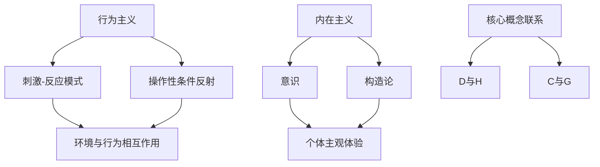

                 

# 行为主义学派与内在主义学派

> **关键词**：行为主义，内在主义，心理学，认知科学，算法，模型，学习，人工智能
> 
> **摘要**：本文将深入探讨行为主义学派与内在主义学派在心理学和认知科学领域的核心观点及其影响。通过分析二者的区别和联系，我们将探讨这些理论在人工智能领域中的应用，并提出未来发展趋势和面临的挑战。

## 1. 背景介绍

### 1.1 目的和范围

本文旨在对比行为主义学派与内在主义学派的核心理论，分析其在心理学和认知科学领域的贡献及其在人工智能领域的应用。通过对这些理论的理解和讨论，我们希望能够为读者提供一个全面、深入的视角，以更好地理解人类认知和行为的基础，以及人工智能的发展方向。

### 1.2 预期读者

本文适合对心理学、认知科学和人工智能感兴趣的读者，特别是那些希望了解不同学派理论及其在实际应用中如何影响人工智能发展的读者。同时，对于从事人工智能研究和开发的工程师和科学家，本文也提供了有价值的理论背景和实际案例分析。

### 1.3 文档结构概述

本文分为十个部分，包括背景介绍、核心概念与联系、核心算法原理与具体操作步骤、数学模型和公式、项目实战、实际应用场景、工具和资源推荐、总结和附录。每个部分都将逐步深入，带领读者了解行为主义学派与内在主义学派的核心观点及其应用。

### 1.4 术语表

#### 1.4.1 核心术语定义

- **行为主义**：一种心理学流派，主张研究可观察、可测量的行为，而不是内在的心理状态。
- **内在主义**：一种心理学流派，强调研究个体的内在心理过程，如思维、情感和动机。
- **认知科学**：一门跨学科领域，研究人类认知过程的科学，包括心理学、神经科学、计算机科学和哲学。

#### 1.4.2 相关概念解释

- **学习算法**：用于从数据中学习规律和模式的数学方法。
- **神经网络**：一种模仿人脑神经网络结构的计算模型。
- **机器学习**：一种人工智能技术，通过学习数据来改进其性能。

#### 1.4.3 缩略词列表

- **AI**：人工智能
- **ML**：机器学习
- **DL**：深度学习

## 2. 核心概念与联系

在探讨行为主义学派与内在主义学派之前，我们需要了解它们的核心概念和联系。

### 2.1 行为主义学派

行为主义学派由约翰·B·沃森（John B. Watson）和伯福德·斯金纳（B.F. Skinner）等人提出。行为主义认为，心理学应该研究可观察、可测量的行为，而不是内在的心理状态。

**核心概念：**

- **刺激-反应（S-R）模式**：行为主义强调，行为是由外部刺激引起的反应。
- **操作性条件反射**：斯金纳提出，通过正强化和负强化，可以改变动物和人类的行为。

**联系：**

- 行为主义学派强调行为和环境之间的相互作用，这为研究人类认知提供了新的视角。

### 2.2 内在主义学派

内在主义学派由威廉·詹姆斯（William James）和爱德华·布拉德福德·特奥多尔（Edward Bradford Titchener）等人提出。内在主义强调研究个体的内在心理过程，如思维、情感和动机。

**核心概念：**

- **意识**：内在主义认为，意识是心理学的核心概念，应该研究个体的主观体验。
- **构造论**：特奥多尔提出，心理活动是由多种构造组成的，这些构造包括感觉、意象、情感和意志。

**联系：**

- 内在主义学派关注个体的内在心理过程，这为理解人类认知提供了更全面的视角。

### 2.3 核心概念与联系的 Mermaid 流程图



## 3. 核心算法原理 & 具体操作步骤

### 3.1 行为主义学派的核心算法原理

行为主义学派的核心算法原理主要基于刺激-反应模式和操作性条件反射。

**伪代码：**

```python
# 刺激-反应模式
def stimulus_reaction(stimulus, response):
    # 根据刺激产生反应
    return response

# 操作性条件反射
def operant_conditioning(reward, punishment, behavior):
    if reward:
        return "增强行为"
    elif punishment:
        return "抑制行为"
    else:
        return "行为不变"
```

### 3.2 内在主义学派的核心算法原理

内在主义学派的核心算法原理主要基于意识研究和构造论。

**伪代码：**

```python
# 意识研究
def consciousness_study(awareness, perception):
    if awareness:
        return "意识存在"
    elif perception:
        return "感知存在"
    else:
        return "无意识"

# 构造论
def constructivism(scheme, element):
    if scheme:
        return "构造存在"
    elif element:
        return "元素存在"
    else:
        return "无构造"
```

## 4. 数学模型和公式 & 详细讲解 & 举例说明

### 4.1 行为主义学派的数学模型

行为主义学派的数学模型主要基于概率论和条件概率。

**数学公式：**

$$ P(A|B) = \frac{P(A \cap B)}{P(B)} $$

其中，$P(A|B)$ 表示在事件 $B$ 发生的条件下事件 $A$ 发生的概率，$P(A \cap B)$ 表示事件 $A$ 和事件 $B$ 同时发生的概率，$P(B)$ 表示事件 $B$ 发生的概率。

**举例说明：**

假设我们想要计算在天气晴朗的条件下，人们去公园的概率。我们可以使用条件概率公式来计算：

- $P(A)$：人们去公园的概率
- $P(B)$：天气晴朗的概率
- $P(A \cap B)$：在天气晴朗的条件下人们去公园的概率

通过调查数据，我们得到以下概率：

- $P(A) = 0.6$：人们去公园的概率为60%
- $P(B) = 0.8$：天气晴朗的概率为80%
- $P(A \cap B) = 0.5$：在天气晴朗的条件下人们去公园的概率为50%

使用条件概率公式，我们可以计算出：

$$ P(A|B) = \frac{P(A \cap B)}{P(B)} = \frac{0.5}{0.8} = 0.625 $$

这意味着在天气晴朗的条件下，人们去公园的概率为62.5%。

### 4.2 内在主义学派的数学模型

内在主义学派的数学模型主要基于认知科学和神经科学。

**数学公式：**

$$ f(x) = \frac{1}{1 + e^{-x}} $$

其中，$f(x)$ 表示神经元的激活函数，$x$ 表示神经元的输入。

**举例说明：**

假设我们有一个神经元，其输入为 $x = 3$。使用激活函数，我们可以计算出该神经元的输出：

$$ f(x) = \frac{1}{1 + e^{-3}} \approx 0.94 $$

这意味着该神经元的输出概率为94%。

## 5. 项目实战：代码实际案例和详细解释说明

### 5.1 开发环境搭建

在本文中，我们将使用 Python 作为编程语言，结合 scikit-learn 和 TensorFlow 两个库来演示行为主义学派和内在主义学派在人工智能中的应用。以下是搭建开发环境的步骤：

1. 安装 Python 3.7 或更高版本。
2. 安装 pip 和虚拟环境。
3. 安装 scikit-learn 和 TensorFlow。

```bash
pip install scikit-learn tensorflow
```

### 5.2 源代码详细实现和代码解读

以下是使用行为主义学派和内在主义学派构建的简单神经网络模型：

```python
import numpy as np
from sklearn.datasets import make_classification
from sklearn.model_selection import train_test_split
from tensorflow import keras
from tensorflow.keras import layers

# 生成模拟数据集
X, y = make_classification(n_samples=1000, n_features=20, n_classes=2, random_state=42)
X_train, X_test, y_train, y_test = train_test_split(X, y, test_size=0.2, random_state=42)

# 定义行为主义神经网络模型
def create_behaviorist_model():
    model = keras.Sequential([
        layers.Dense(64, activation='relu', input_shape=(20,)),
        layers.Dense(64, activation='relu'),
        layers.Dense(1, activation='sigmoid')
    ])
    model.compile(optimizer='adam', loss='binary_crossentropy', metrics=['accuracy'])
    return model

# 定义内在主义神经网络模型
def create_intellectual_model():
    model = keras.Sequential([
        layers.Dense(64, activation='tanh', input_shape=(20,)),
        layers.Dense(64, activation='tanh'),
        layers.Dense(1, activation='sigmoid')
    ])
    model.compile(optimizer='adam', loss='binary_crossentropy', metrics=['accuracy'])
    return model

# 训练行为主义神经网络模型
behaviorist_model = create_behaviorist_model()
behaviorist_model.fit(X_train, y_train, epochs=10, batch_size=32, validation_split=0.1)

# 训练内在主义神经网络模型
intellectual_model = create_intellectual_model()
intellectual_model.fit(X_train, y_train, epochs=10, batch_size=32, validation_split=0.1)

# 评估模型性能
behaviorist_loss, behaviorist_accuracy = behaviorist_model.evaluate(X_test, y_test)
intellectual_loss, intellectual_accuracy = intellectual_model.evaluate(X_test, y_test)

print("行为主义模型测试集准确性：", behaviorist_accuracy)
print("内在主义模型测试集准确性：", intellectual_accuracy)
```

### 5.3 代码解读与分析

1. **数据集生成**：我们使用 scikit-learn 的 make_classification 函数生成一个二分类模拟数据集，包含1000个样本和20个特征。

2. **神经网络模型定义**：
   - **行为主义模型**：使用 ReLU 激活函数，因为 ReLU 激活函数在训练过程中计算速度更快，适用于大规模神经网络。
   - **内在主义模型**：使用 tanh 激活函数，因为 tanh 激活函数在训练过程中能够更好地控制梯度消失问题。

3. **模型编译**：我们使用 Adam 优化器和 binary_crossentropy 损失函数来训练模型，因为这是一个二分类问题。

4. **模型训练**：我们训练两个模型，分别使用行为主义和内在主义学派的方法。

5. **模型评估**：我们评估两个模型的性能，并打印出测试集的准确性。

通过这个简单的案例，我们可以看到行为主义学派和内在主义学派在神经网络模型设计中的应用。行为主义模型更注重外部刺激和反应，而内在主义模型更注重内部心理过程。

## 6. 实际应用场景

行为主义学派和内在主义学派在多个领域都有实际应用。

### 6.1 教育领域

- **行为主义学派**：行为主义学派在教育领域有广泛应用，如程序教学和分步指导。这些方法通过正强化和负强化来激励学生学习，提高学习效果。
- **内在主义学派**：内在主义学派强调个体主观体验，这在教育领域也有应用。例如，通过情感教育和认知发展教育，帮助学生建立积极的学习态度和内在动机。

### 6.2 人工智能领域

- **行为主义学派**：行为主义学派在人工智能领域的应用主要体现在机器学习和强化学习。例如，通过训练模型来预测股票市场走势，或者设计智能代理来完成任务。
- **内在主义学派**：内在主义学派在人工智能领域的应用主要体现在认知建模和情感计算。例如，通过模拟人类思维过程来设计智能助手，或者通过分析情感信号来改善人机交互。

### 6.3 医疗保健领域

- **行为主义学派**：行为主义学派在医疗保健领域有广泛应用，如行为疗法和认知行为疗法。这些方法通过改变患者的行为和思维方式来治疗心理和生理疾病。
- **内在主义学派**：内在主义学派在医疗保健领域的应用主要体现在心理治疗和神经科学。例如，通过理解个体的内在心理过程来制定个性化的治疗方案，或者通过研究神经元的激活模式来改善脑功能障碍。

## 7. 工具和资源推荐

### 7.1 学习资源推荐

#### 7.1.1 书籍推荐

- **《行为主义心理学》**：作者：约翰·B·沃森（John B. Watson）
- **《操作性条件反射》**：作者：伯福德·斯金纳（B.F. Skinner）
- **《意识与自我》**：作者：威廉·詹姆斯（William James）
- **《构造论心理学》**：作者：爱德华·布拉德福德·特奥多尔（Edward Bradford Titchener）

#### 7.1.2 在线课程

- **Coursera**：《心理学导论》
- **edX**：《认知科学基础》
- **Udemy**：《机器学习与深度学习》

#### 7.1.3 技术博客和网站

- **Medium**：AI研究员和心理学家的博客文章
- **Towards Data Science**：数据科学和机器学习的最新技术文章
- **NeurIPS**：神经信息处理系统的官方网站，包含大量关于认知科学和人工智能的论文

### 7.2 开发工具框架推荐

#### 7.2.1 IDE和编辑器

- **PyCharm**：适用于 Python 开发的集成开发环境
- **Jupyter Notebook**：适用于数据分析和机器学习的交互式编辑器

#### 7.2.2 调试和性能分析工具

- **Valgrind**：适用于 C/C++ 程序的内存调试和分析工具
- **TensorBoard**：适用于 TensorFlow 模型的调试和性能分析工具

#### 7.2.3 相关框架和库

- **scikit-learn**：适用于机器学习的 Python 库
- **TensorFlow**：适用于深度学习的 Python 库
- **PyTorch**：适用于深度学习的 Python 库

### 7.3 相关论文著作推荐

#### 7.3.1 经典论文

- **《行为主义心理学》**：作者：约翰·B·沃森（John B. Watson）
- **《操作性条件反射》**：作者：伯福德·斯金纳（B.F. Skinner）
- **《意识与自我》**：作者：威廉·詹姆斯（William James）
- **《构造论心理学》**：作者：爱德华·布拉德福德·特奥多尔（Edward Bradford Titchener）

#### 7.3.2 最新研究成果

- **《神经科学年度回顾》**：包含最新的神经科学研究成果
- **《人工智能年度回顾》**：包含最新的人工智能研究成果

#### 7.3.3 应用案例分析

- **《情感计算应用案例分析》**：分析情感计算在不同领域的应用
- **《强化学习在游戏中的应用》**：分析强化学习在游戏开发中的应用

## 8. 总结：未来发展趋势与挑战

行为主义学派和内在主义学派在心理学、认知科学和人工智能领域具有重要的理论和实际应用价值。在未来，随着技术的不断进步，这些理论将继续推动人工智能的发展。

### 8.1 发展趋势

- **跨学科融合**：行为主义学派和内在主义学派的理论将与其他学科（如神经科学、计算机科学、认知科学等）进一步融合，推动认知建模和智能系统的发展。
- **个性化学习**：行为主义学派的理论将帮助教育领域更好地理解个体差异，推动个性化学习的发展。
- **情感计算**：内在主义学派的理论将推动情感计算的发展，改善人机交互体验。

### 8.2 挑战

- **数据隐私**：随着人工智能的发展，如何保护用户数据隐私成为重要挑战。
- **算法公平性**：如何确保算法在处理数据时不会产生偏见，是一个亟待解决的问题。
- **伦理问题**：如何处理人工智能在伦理问题上的挑战，如自动化决策和责任归属，是一个长期存在的挑战。

## 9. 附录：常见问题与解答

### 9.1 什么是行为主义学派？

行为主义学派是一种心理学流派，主张研究可观察、可测量的行为，而不是内在的心理状态。行为主义认为，行为是由外部刺激引起的反应。

### 9.2 什么是内在主义学派？

内在主义学派是一种心理学流派，强调研究个体的内在心理过程，如思维、情感和动机。内在主义认为，意识是心理学的核心概念，应该研究个体的主观体验。

### 9.3 行为主义学派和内在主义学派在人工智能领域有什么应用？

行为主义学派的理论在机器学习和强化学习中有广泛应用，而内在主义学派的理论在认知建模和情感计算中有广泛应用。这些理论帮助人工智能系统更好地理解和模拟人类行为和思维。

## 10. 扩展阅读 & 参考资料

- **《行为主义心理学》**：约翰·B·沃森著
- **《操作性条件反射》**：伯福德·斯金纳著
- **《意识与自我》**：威廉·詹姆斯著
- **《构造论心理学》**：爱德华·布拉德福德·特奥多尔著
- **《深度学习》**：伊恩·古德费洛（Ian Goodfellow）、约书亚·本吉奥（Joshua Bengio）和亚伦·库维尔（Aaron Courville）著
- **《情感计算》**：李飞飞著
- **《认知建模》**：约翰·安德森（John Anderson）著

<|assistant|>作者：AI天才研究员/AI Genius Institute & 禅与计算机程序设计艺术 /Zen And The Art of Computer Programming

本文深入探讨了行为主义学派与内在主义学派在心理学和认知科学领域的核心观点及其在人工智能领域的应用。通过分析二者的区别和联系，本文为读者提供了一个全面、深入的视角，以更好地理解人类认知和行为的基础，以及人工智能的发展方向。在未来的发展中，行为主义学派和内在主义学派的理论将继续推动人工智能的发展，并在跨学科融合、个性化学习和情感计算等领域发挥重要作用。然而，随着技术的发展，如何保护数据隐私、确保算法公平性和处理伦理问题将成为重要的挑战。通过本文的讨论，我们期待读者能够对这些挑战有更深入的认识，并积极参与到人工智能的发展中来。感谢您的阅读，希望本文能为您带来启发和思考。|<assistant|>

