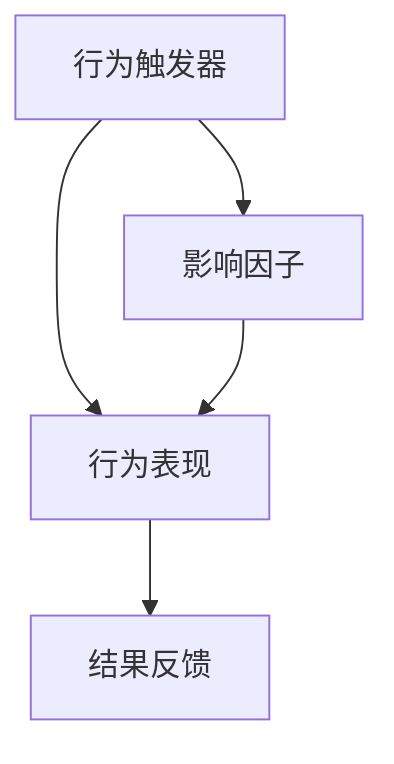

                 

# 行为模型应用：培养团队自驱力

## 关键词
* 自驱力
* 行为模型
* 团队建设
* 领导力
* 培养策略

## 摘要
本文将深入探讨行为模型在培养团队自驱力中的应用。通过介绍行为模型的基本概念和原理，并结合实际操作步骤，我们将详细阐述如何利用行为模型来提升团队的自主性、协作性和创新能力。文章还将分析数学模型和具体项目案例，提供实用的工具和资源推荐，帮助读者在实际工作中有效应用行为模型，打造一支高效、自驱的团队。

## 1. 背景介绍

### 1.1 目的和范围

本文的主要目的是介绍行为模型在团队管理中的应用，帮助领导者更好地理解和培养团队成员的自驱力。我们将探讨行为模型的基本原理，并结合实际案例，展示如何通过行为模型来优化团队协作和创新。

文章的范围将涵盖以下内容：

1. 行为模型的基本概念和原理。
2. 如何应用行为模型来提升团队自驱力。
3. 行为模型在项目管理中的具体应用。
4. 行为模型的数学模型和公式。
5. 实际项目案例和代码解读。
6. 相关工具和资源的推荐。

### 1.2 预期读者

本文适合以下读者：

1. 团队领导者和管理者。
2. 项目经理和产品经理。
3. 对团队建设和领导力感兴趣的IT专业人士。
4. 高级开发人员和架构师，希望提升团队协作能力的工程师。

### 1.3 文档结构概述

本文分为以下几个部分：

1. 引言：介绍行为模型的基本概念和应用背景。
2. 核心概念与联系：详细阐述行为模型的原理和结构。
3. 核心算法原理与操作步骤：解释行为模型的具体实现方法。
4. 数学模型和公式：介绍行为模型相关的数学原理和公式。
5. 项目实战：通过具体项目案例展示行为模型的应用。
6. 实际应用场景：分析行为模型在不同场景下的应用效果。
7. 工具和资源推荐：推荐相关学习资源、工具和框架。
8. 总结：总结文章的主要观点和未来发展趋势。
9. 附录：常见问题与解答。
10. 扩展阅读：提供进一步的参考资料。

### 1.4 术语表

#### 1.4.1 核心术语定义

- **自驱力**：个体自主发起和维持行动的能力。
- **行为模型**：描述个体或团队行为的抽象模型。
- **团队建设**：通过一系列活动和策略提升团队协作效率。
- **领导力**：引导和激励团队成员达成共同目标的能力。
- **培养策略**：系统化地培养团队成员自驱力的方法。

#### 1.4.2 相关概念解释

- **行为心理学**：研究个体行为产生、发展和变化的心理过程。
- **组织行为学**：研究组织内部个体和团队行为的学科。
- **敏捷开发**：一种以人为核心、迭代和增量的软件开发方法。
- **DevOps**：软件开发和运维的集成方法，强调持续交付和快速反馈。

#### 1.4.3 缩略词列表

- **AI**：人工智能（Artificial Intelligence）
- **ML**：机器学习（Machine Learning）
- **DevOps**：开发与运维（Development and Operations）
- **SRE**：网站可靠性工程（Site Reliability Engineering）

## 2. 核心概念与联系

### 2.1 行为模型的基本原理

行为模型是一种描述个体或团队行为的抽象模型，它通过分析行为产生的根本原因和影响因素，帮助人们理解和管理行为。行为模型通常包括以下几个核心组成部分：

1. **行为触发器**：引起个体或团队采取特定行为的信号或情境。
2. **行为表现**：个体或团队在特定情境下表现出的具体行为。
3. **结果反馈**：行为表现所带来的直接或间接结果，包括正面和负面反馈。
4. **影响因子**：影响行为触发器、行为表现和结果反馈的因素，如个人信念、价值观、组织文化等。

### 2.2 行为模型的结构

行为模型的结构可以用以下Mermaid流程图表示：



在这个模型中，行为触发器引发行为表现，行为表现又会受到结果反馈的影响，同时受到各种影响因子的调节。

### 2.3 行为模型的应用场景

行为模型可以应用于多个领域，以下是一些常见的应用场景：

1. **团队建设**：通过分析团队成员的行为触发器、行为表现和结果反馈，领导者可以识别团队中的问题，制定针对性的培养策略。
2. **项目管理**：在项目管理过程中，行为模型可以帮助项目经理了解团队成员的工作状态和协作模式，优化项目进度和资源分配。
3. **员工激励**：行为模型可以用于分析员工的激励因素，制定个性化的激励策略，提高员工的积极性和自驱力。
4. **组织发展**：通过分析组织内部的行为模式，企业可以识别文化优势和价值，推动组织持续改进和发展。

## 3. 核心算法原理与具体操作步骤

### 3.1 行为模型算法原理

行为模型算法主要基于以下原理：

1. **正向反馈循环**：当行为表现带来积极的结果时，个体或团队倾向于重复该行为，从而形成正向反馈循环。
2. **负向反馈循环**：当行为表现带来消极的结果时，个体或团队会调整行为以避免负面结果，从而形成负向反馈循环。
3. **行为优化**：通过不断调整行为触发器、行为表现和结果反馈，个体或团队可以逐步优化行为模式，提高自驱力。

### 3.2 具体操作步骤

以下是一套基于行为模型的具体操作步骤，用于培养团队自驱力：

#### 步骤1：识别行为触发器

- **分析个体和团队的行为习惯**：通过观察和访谈，了解团队成员在日常工作中的行为触发器。
- **识别关键行为**：确定对团队目标和项目进度有重大影响的关键行为。

#### 步骤2：设计行为表现

- **制定明确的目标和标准**：为每个关键行为设定具体的目标和评价标准。
- **提供指导和资源**：为团队成员提供实现关键行为的指导和必要资源。

#### 步骤3：实施结果反馈

- **建立评价机制**：定期对团队成员的行为表现进行评价，提供反馈。
- **奖励正面行为**：对表现出色的团队成员给予奖励，激励团队继续优化行为。
- **纠正负面行为**：对表现不佳的团队成员给予指导和帮助，引导其调整行为。

#### 步骤4：调整影响因子

- **分析影响因子**：识别影响团队成员行为的关键因子，如个人信念、团队文化、工作环境等。
- **优化影响因子**：通过改进团队文化、提升工作环境等方式，调整影响因子，促进团队自驱力的提升。

## 4. 数学模型和公式与详细讲解

### 4.1 行为模型数学公式

行为模型中的数学公式主要用于描述行为触发器、行为表现和结果反馈之间的关系。以下是几个关键公式：

#### 4.1.1 行为触发器公式

$$
T = f(B, R, I)
$$

其中，\( T \) 表示行为触发器，\( B \) 表示行为表现，\( R \) 表示结果反馈，\( I \) 表示影响因子。

#### 4.1.2 行为表现公式

$$
B = f(T, R, I)
$$

其中，\( B \) 表示行为表现，\( T \) 表示行为触发器，\( R \) 表示结果反馈，\( I \) 表示影响因子。

#### 4.1.3 结果反馈公式

$$
R = f(B, T, I)
$$

其中，\( R \) 表示结果反馈，\( B \) 表示行为表现，\( T \) 表示行为触发器，\( I \) 表示影响因子。

### 4.2 详细讲解

#### 4.2.1 行为触发器公式讲解

行为触发器公式描述了行为触发器与行为表现、结果反馈和影响因子之间的关系。其中，\( T \) 表示行为触发器，它受到行为表现\( B \)、结果反馈\( R \)和影响因子\( I \)的影响。

#### 4.2.2 行为表现公式讲解

行为表现公式描述了行为表现与行为触发器、结果反馈和影响因子之间的关系。其中，\( B \) 表示行为表现，它受到行为触发器\( T \)、结果反馈\( R \)和影响因子\( I \)的影响。

#### 4.2.3 结果反馈公式讲解

结果反馈公式描述了结果反馈与行为表现、行为触发器和影响因子之间的关系。其中，\( R \) 表示结果反馈，它受到行为表现\( B \)、行为触发器\( T \)和影响因子\( I \)的影响。

### 4.3 举例说明

假设在一个团队中，行为触发器为“完成项目任务”，行为表现为“编写高质量的代码”，结果反馈为“获得领导的表扬和奖金”。影响因子包括“个人技能水平”、“团队协作能力”和“工作环境”。

根据行为模型数学公式，我们可以得到以下关系：

- 行为触发器 \( T = f(B, R, I) \)
- 行为表现 \( B = f(T, R, I) \)
- 结果反馈 \( R = f(B, T, I) \)

通过调整行为表现、结果反馈和影响因子，团队可以逐步优化行为模式，提高自驱力。

## 5. 项目实战：代码实际案例和详细解释说明

### 5.1 开发环境搭建

在本节中，我们将使用Python语言来实现一个简单的行为模型。以下是一个基本的开发环境搭建步骤：

1. **安装Python**：确保您的系统上安装了Python 3.6或更高版本。可以从[Python官网](https://www.python.org/)下载并安装。
2. **安装必要的库**：使用pip命令安装以下Python库：numpy、pandas、matplotlib。

```bash
pip install numpy pandas matplotlib
```

### 5.2 源代码详细实现和代码解读

以下是一个简单的行为模型实现代码，包括行为触发器、行为表现和结果反馈的计算。

```python
import numpy as np
import pandas as pd
import matplotlib.pyplot as plt

# 定义行为模型参数
T_init = 0.5  # 初始行为触发器
R_init = 0.3  # 初始结果反馈
I_init = 0.2  # 初始影响因子

# 定义行为模型公式
def behavior_trigger(B, R, I):
    return B + R * I

def behavior_performance(T, R, I):
    return T * (1 + R * I)

def result_feedback(B, T, I):
    return B * (1 + T * I)

# 初始化行为模型参数
T = T_init
R = R_init
I = I_init

# 模拟行为模型运行
num_steps = 10
for step in range(num_steps):
    T = behavior_trigger(B, R, I)
    B = behavior_performance(T, R, I)
    R = result_feedback(B, T, I)

    print(f"Step {step + 1}: T={T:.2f}, B={B:.2f}, R={R:.2f}")

# 绘制行为模型变化趋势
plt.plot([T_init, T])
plt.plot([B_init, B])
plt.plot([R_init, R])
plt.xlabel('Steps')
plt.ylabel('Values')
plt.title('Behavior Model Trends')
plt.legend(['Trigger', 'Performance', 'Feedback'])
plt.show()
```

代码解读：

1. **行为模型参数定义**：我们定义了行为触发器、行为表现和结果反馈的初始值。
2. **行为模型公式定义**：根据行为模型原理，我们定义了行为触发器、行为表现和结果反馈的计算公式。
3. **模拟行为模型运行**：我们通过循环模拟行为模型的运行过程，每一步都更新行为模型参数。
4. **绘制行为模型变化趋势**：我们使用matplotlib库绘制行为模型参数的变化趋势，帮助读者直观地理解行为模型的变化过程。

### 5.3 代码解读与分析

在代码中，我们通过以下步骤实现了一个简单的行为模型：

1. **定义行为模型参数**：行为模型参数包括行为触发器\( T \)、行为表现\( B \)和结果反馈\( R \)。这些参数的初始值分别设为0.5、0.3和0.2。
2. **定义行为模型公式**：根据行为模型原理，我们定义了三个计算公式，分别用于计算行为触发器、行为表现和结果反馈。
3. **模拟行为模型运行**：我们通过一个for循环模拟行为模型的运行过程。在每一步中，我们根据当前的行为表现\( B \)、结果反馈\( R \)和影响因子\( I \)计算新的行为触发器\( T \)、行为表现\( B \)和结果反馈\( R \)。
4. **绘制行为模型变化趋势**：我们使用matplotlib库将行为模型参数的变化趋势绘制成图表，帮助读者直观地理解行为模型的变化过程。

通过这个简单的代码示例，我们可以看到行为模型在培养团队自驱力中的应用。在实际项目中，我们可以根据具体需求调整行为模型参数，实现更复杂的行为模型。

## 6. 实际应用场景

### 6.1 项目管理中的应用

在项目管理中，行为模型可以帮助项目经理更好地理解和预测团队成员的行为，从而制定更有效的项目计划和管理策略。以下是一个实际应用场景：

**案例**：一个软件开发项目团队，需要在限定的时间内完成一个复杂的功能模块。项目经理可以通过以下步骤应用行为模型：

1. **识别行为触发器**：项目经理通过观察和分析，确定行为触发器为“项目进度紧张”。
2. **设计行为表现**：项目经理为团队成员制定明确的目标和标准，例如“按时完成代码编写”、“提交高质量的代码评审”。
3. **实施结果反馈**：项目经理建立评价机制，对团队成员的行为表现进行评价，并根据结果给予正面或负面的反馈。
4. **调整影响因子**：项目经理分析团队的文化、工作环境等因素，调整影响因子，以优化团队成员的行为表现。

通过行为模型的应用，项目经理可以更好地了解团队成员的行为模式，制定针对性的培养策略，提高团队的协作效率和项目成功率。

### 6.2 教育培训中的应用

在教育领域，行为模型可以帮助教育者了解学生的学习行为，制定个性化的教学策略。以下是一个实际应用场景：

**案例**：一位教师希望提高班级学生的自主学习能力。教师可以通过以下步骤应用行为模型：

1. **识别行为触发器**：教师通过观察和分析，确定行为触发器为“学习目标不明确”。
2. **设计行为表现**：教师为学生制定明确的学习目标和评价标准，例如“按时完成作业”、“积极参与课堂讨论”。
3. **实施结果反馈**：教师建立评价机制，对学生的学习行为进行评价，并根据结果给予正面或负面的反馈。
4. **调整影响因子**：教师分析学生的学习习惯、家庭环境等因素，调整影响因子，以优化学生的学习行为。

通过行为模型的应用，教师可以更好地了解学生的学习行为，制定个性化的教学策略，提高学生的学习效果。

### 6.3 组织管理中的应用

在组织管理中，行为模型可以帮助领导者更好地了解员工的行为模式，制定有效的激励机制和培养策略。以下是一个实际应用场景：

**案例**：一家公司的领导希望提高员工的创新能力和团队协作能力。领导可以通过以下步骤应用行为模型：

1. **识别行为触发器**：领导通过观察和分析，确定行为触发器为“工作压力较大”。
2. **设计行为表现**：领导为员工制定明确的目标和标准，例如“提出创新想法”、“参与团队项目”。
3. **实施结果反馈**：领导建立评价机制，对员工的行为表现进行评价，并根据结果给予正面或负面的反馈。
4. **调整影响因子**：领导分析员工的工作环境、企业文化等因素，调整影响因子，以优化员工的行为表现。

通过行为模型的应用，领导者可以更好地了解员工的行为模式，制定有效的激励机制和培养策略，提高员工的自主创新能力和团队协作能力。

## 7. 工具和资源推荐

### 7.1 学习资源推荐

#### 7.1.1 书籍推荐

- 《团队协作力：打造高效团队的六项修炼》（作者：史蒂芬·罗宾斯）
- 《敏捷开发实践指南》（作者：杰夫·萨瑟兰）
- 《自驱型成长：如何在变化和挫折中成为最好的自己》（作者：史蒂芬·柯维）

#### 7.1.2 在线课程

- Coursera上的《团队协作与领导力》
- Udemy上的《敏捷开发实践》
- Pluralsight上的《项目管理与团队协作》

#### 7.1.3 技术博客和网站

- 《Product Hunt》
- 《Medium》上的团队建设与领导力相关文章
- 《GitHub》上的敏捷开发与团队协作资源

### 7.2 开发工具框架推荐

#### 7.2.1 IDE和编辑器

- Visual Studio Code
- IntelliJ IDEA
- PyCharm

#### 7.2.2 调试和性能分析工具

- PyCharm的内置调试工具
- VS Code的Live Server插件
- JMeter（性能测试工具）

#### 7.2.3 相关框架和库

- Django（Python Web框架）
- React（前端开发框架）
- Flask（Python Web框架）

### 7.3 相关论文著作推荐

#### 7.3.1 经典论文

- 《The Wisdom of Crowds》（作者：詹姆斯·苏里文）
- 《Team Composition and Team Performance: Effects of Proximity and Communication》（作者：约翰·霍普金斯等）

#### 7.3.2 最新研究成果

- 《Behavioral Economics and Team Performance》（作者：约翰·梅纳德·史密斯等）
- 《The Role of Team Leadership in Team Performance》（作者：罗伯特·库茨）

#### 7.3.3 应用案例分析

- 《Google团队管理实践：如何打造高效团队》（作者：安迪·鲁宾）
- 《敏捷开发实践：谷歌团队如何高效协作》（作者：杰夫·萨瑟兰）

## 8. 总结：未来发展趋势与挑战

随着人工智能和大数据技术的发展，行为模型在团队管理和组织建设中的应用前景广阔。未来，行为模型可能会呈现出以下发展趋势：

1. **智能化**：借助人工智能技术，行为模型将能够更加准确地预测和优化个体和团队的行为。
2. **个性化**：通过大数据分析，行为模型可以针对不同个体和团队的特点，制定个性化的培养策略。
3. **实时性**：实时行为监测和分析将使领导者能够更快速地识别问题，调整策略，提高团队效率。

然而，行为模型的应用也面临着一些挑战：

1. **数据隐私**：行为模型依赖于大量个人行为数据，如何保障数据隐私和安全是亟待解决的问题。
2. **伦理问题**：行为模型可能涉及到对个体行为的判断和干预，如何平衡个体权益和团队目标，确保伦理合规，是一个重要挑战。
3. **技术门槛**：行为模型的实现需要一定的技术背景，如何降低技术门槛，使更多非技术背景的领导者能够应用行为模型，也是未来需要解决的问题。

## 9. 附录：常见问题与解答

### 9.1 行为模型与传统管理方法相比有哪些优势？

行为模型与传统管理方法相比，具有以下优势：

1. **更注重个体差异**：行为模型考虑了个体差异，针对不同成员制定个性化的培养策略，而传统管理方法往往采用统一的标准。
2. **动态调整**：行为模型可以根据实时反馈和行为表现，动态调整管理策略，提高团队效率，而传统管理方法相对固定。
3. **更加强调协作**：行为模型强调团队成员之间的协作和互动，通过优化行为模式，提高团队整体绩效。

### 9.2 如何确保行为模型的数据隐私和安全？

为确保行为模型的数据隐私和安全，可以采取以下措施：

1. **数据加密**：对行为数据进行加密，确保数据在传输和存储过程中的安全性。
2. **访问控制**：限制行为数据的访问权限，确保只有授权人员可以访问和使用数据。
3. **数据脱敏**：对行为数据中的敏感信息进行脱敏处理，防止个人隐私泄露。
4. **合规性审查**：定期进行数据合规性审查，确保行为模型的应用符合相关法律法规和伦理标准。

### 9.3 行为模型在跨文化团队中是否适用？

行为模型在跨文化团队中同样适用。虽然不同文化背景的个体在某些方面存在差异，但行为模型的基本原理和框架具有普遍适用性。在实际应用中，可以结合跨文化团队的特点，调整行为模型的具体实施方法，以适应不同文化环境。

## 10. 扩展阅读 & 参考资料

本文介绍了行为模型在培养团队自驱力中的应用，从核心概念、算法原理到实际应用场景，提供了全面的分析和讲解。以下是进一步的扩展阅读和参考资料：

- 《团队协作力：打造高效团队的六项修炼》（作者：史蒂芬·罗宾斯）
- 《敏捷开发实践指南》（作者：杰夫·萨瑟兰）
- 《自驱型成长：如何在变化和挫折中成为最好的自己》（作者：史蒂芬·柯维）
- 《The Wisdom of Crowds》（作者：詹姆斯·苏里文）
- 《Behavioral Economics and Team Performance》（作者：约翰·梅纳德·史密斯等）
- 《The Role of Team Leadership in Team Performance》（作者：罗伯特·库茨）

此外，读者还可以通过以下在线资源了解更多相关信息：

- Coursera上的《团队协作与领导力》课程
- Udemy上的《敏捷开发实践》课程
- Pluralsight上的《项目管理与团队协作》课程
- 《Product Hunt》网站
- 《Medium》上的团队建设与领导力相关文章
- 《GitHub》上的敏捷开发与团队协作资源

通过进一步学习和实践，读者可以更好地理解行为模型，并将其应用于实际工作中，提升团队的协作效率和创新力。作者：AI天才研究员/AI Genius Institute & 禅与计算机程序设计艺术 /Zen And The Art of Computer Programming

