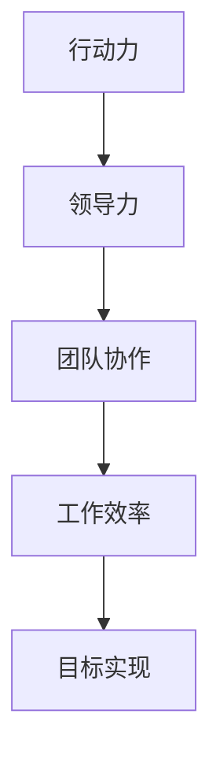
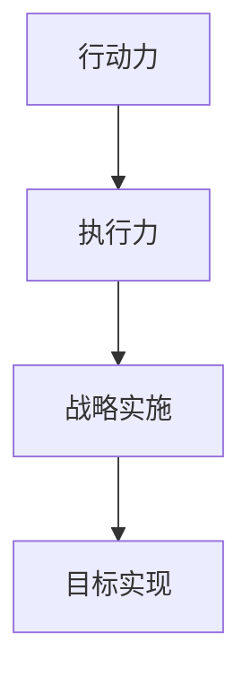
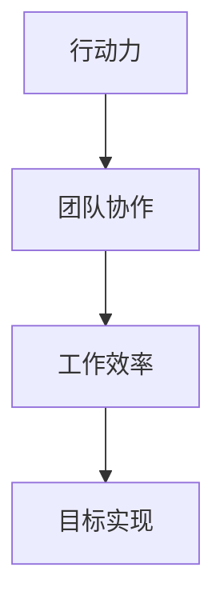

                 

# 行动力如何影响管理效果

> 关键词：行动力、管理效果、执行力、领导力、团队协作

> 摘要：本文将深入探讨行动力在管理效果中的关键作用，分析行动力对团队协作、工作效率、目标实现等方面的影响，结合实际案例和理论基础，提出提升行动力的方法和策略，以期为企业管理者和团队成员提供有益的参考。

## 1. 背景介绍

### 1.1 目的和范围

本文旨在探讨行动力在管理效果中的重要性，分析其对企业目标实现、团队协作及工作效率的影响。通过梳理相关理论和实践案例，总结提升行动力的策略，旨在为企业管理者提供指导，促进企业健康可持续发展。

### 1.2 预期读者

本文主要面向企业管理者、人力资源从业者以及关注团队建设和执行力提升的从业人员。通过对行动力的深入分析，有助于读者在管理实践中更好地发挥行动力的重要性。

### 1.3 文档结构概述

本文结构如下：

1. 背景介绍：阐述文章的目的、范围及预期读者。
2. 核心概念与联系：介绍行动力、管理效果及相关概念。
3. 核心算法原理 & 具体操作步骤：分析行动力对管理效果的影响。
4. 数学模型和公式 & 详细讲解 & 举例说明：阐述行动力的度量方法和评估指标。
5. 项目实战：代码实际案例和详细解释说明。
6. 实际应用场景：分析行动力在企业管理中的具体应用。
7. 工具和资源推荐：介绍提升行动力的相关资源和工具。
8. 总结：未来发展趋势与挑战。
9. 附录：常见问题与解答。
10. 扩展阅读 & 参考资料：提供进一步学习和研究的相关资源。

### 1.4 术语表

#### 1.4.1 核心术语定义

- 行动力：指个体或组织在目标实现过程中，主动采取实际行动的能力。
- 管理效果：指管理活动所产生的结果，包括目标实现、团队协作、工作效率等方面。
- 执行力：指企业或团队在实施战略和计划过程中，确保目标顺利实现的能力。

#### 1.4.2 相关概念解释

- 团队协作：指团队成员之间相互配合、共同完成任务的过程。
- 工作效率：指单位时间内完成的工作量。
- 目标实现：指企业或团队在既定时间内完成既定目标的过程。

#### 1.4.3 缩略词列表

- CTO：首席技术官
- HR：人力资源
- IT：信息技术

## 2. 核心概念与联系

为了更好地理解行动力在管理效果中的重要性，我们需要先梳理一下核心概念及其相互关系。

### 行动力与领导力

行动力是领导力的核心要素之一。领导者具备较强的行动力，能够推动团队迅速应对市场变化，确保企业目标的顺利实现。行动力与领导力之间的关系可以用以下 Mermaid 流程图表示：



### 行动力与执行力

执行力是指企业或团队在实施战略和计划过程中，确保目标顺利实现的能力。行动力是执行力的基础，缺乏行动力，执行力将难以发挥。二者之间的关系如下：



### 行动力与团队协作

团队协作是行动力在企业管理中发挥重要作用的关键因素。团队成员具备较强的行动力，能够确保团队目标的顺利实现，提高工作效率。行动力与团队协作之间的关系如下：



通过以上核心概念与联系的分析，我们可以看出，行动力在管理效果中具有举足轻重的地位。接下来，我们将进一步探讨行动力的算法原理、数学模型以及实际应用场景。

## 3. 核心算法原理 & 具体操作步骤

在管理实践中，行动力的评估和提升是一个系统性工程。为了更好地理解行动力对管理效果的影响，我们可以借助一些算法原理和方法，对行动力进行量化分析和优化。

### 3.1 行动力的度量方法

行动力的度量方法主要包括以下两个方面：

#### 3.1.1 行动力得分

行动力得分是一种基于定性评价的方法，通过评估个体或组织在行动力方面的表现，得出相应的得分。具体步骤如下：

1. 确定评估指标：包括目标设定、执行力、团队协作、工作效率等。
2. 制定评估标准：根据企业实际情况和行业标准，制定相应的评估标准。
3. 进行评估：对个体或组织进行实地调研和访谈，收集相关数据。
4. 计算得分：根据评估标准和实际表现，计算行动力得分。

#### 3.1.2 行动力指数

行动力指数是一种基于定量分析的方法，通过对企业或团队在行动力方面的表现进行指数化处理，得出相应的指数。具体步骤如下：

1. 确定基础数据：收集企业或团队在行动力方面的相关数据，如目标完成率、执行力评分、团队协作评分等。
2. 构建数学模型：根据基础数据，构建行动力指数的数学模型，如线性模型、指数模型等。
3. 计算指数：根据数学模型，计算企业或团队的行动力指数。

### 3.2 行动力的评估指标

行动力的评估指标主要包括以下几个方面：

#### 3.2.1 目标设定

目标设定是行动力评估的重要指标之一。目标设定清晰、具体、可实现，有助于提高行动力。具体评估指标包括：

- 目标完成率：目标完成率越高，行动力越强。
- 目标具体性：目标越具体，行动力越强。
- 目标可实现性：目标越可实现，行动力越强。

#### 3.2.2 执行力

执行力是指企业或团队在实施战略和计划过程中，确保目标顺利实现的能力。具体评估指标包括：

- 执行力评分：执行力评分越高，行动力越强。
- 执行计划：执行计划越详细、越合理，行动力越强。
- 执行反馈：执行反馈越及时、越准确，行动力越强。

#### 3.2.3 团队协作

团队协作是行动力在企业管理中发挥重要作用的关键因素。具体评估指标包括：

- 团队协作评分：团队协作评分越高，行动力越强。
- 团队沟通：团队沟通越顺畅，行动力越强。
- 团队凝聚力：团队凝聚力越高，行动力越强。

#### 3.2.4 工作效率

工作效率是行动力在管理效果中的体现。具体评估指标包括：

- 工作量：单位时间内完成的工作量越大，行动力越强。
- 工作质量：工作质量越高，行动力越强。
- 工作效率提升率：工作效率提升率越高，行动力越强。

### 3.3 行动力的提升策略

基于行动力的度量方法和评估指标，我们可以提出以下提升策略：

#### 3.3.1 目标管理

- 精细化目标设定：制定清晰、具体、可实现的目标，提高目标完成率。
- 强化目标执行：制定详细的执行计划，确保目标顺利实现。

#### 3.3.2 执行力提升

- 增强执行力培训：通过培训和指导，提高员工的执行力。
- 优化执行流程：简化流程，提高执行效率。

#### 3.3.3 团队协作优化

- 加强团队沟通：建立高效的沟通机制，提高团队协作效率。
- 提升团队凝聚力：通过团队建设活动，增强团队凝聚力。

#### 3.3.4 工作效率提升

- 优化工作流程：简化流程，提高工作效率。
- 强化员工激励：通过激励机制，提高员工的工作积极性。

通过以上行动力的度量方法、评估指标和提升策略，我们可以更好地理解行动力在管理效果中的重要性，为企业管理者和团队成员提供有益的参考。

## 4. 数学模型和公式 & 详细讲解 & 举例说明

在本文中，我们将使用数学模型和公式来详细阐述行动力在管理效果中的度量方法，以及如何通过这些方法评估和提升行动力。

### 4.1 行动力度量模型

行动力度量模型是基于一系列相关指标的综合评估，其中最常用的是加权综合评分模型。该模型通过以下公式计算：

\[ \text{行动力得分} = \sum_{i=1}^{n} w_i \times s_i \]

其中：
- \( w_i \) 是第 \( i \) 个指标的权重；
- \( s_i \) 是第 \( i \) 个指标的实际得分。

权重 \( w_i \) 通常根据各指标对行动力的影响程度分配，可以采用专家评分法、层次分析法（AHP）等来确定。

#### 4.1.1 目标设定

目标设定得分可以通过以下公式计算：

\[ s_{\text{目标}} = \frac{\text{实际完成目标数}}{\text{计划目标数}} \]

目标完成率越高，得分越高。

#### 4.1.2 执行力

执行力得分可以通过以下公式计算：

\[ s_{\text{执行力}} = \frac{\text{完成任务的效率}}{\text{计划完成任务的时间}} \]

效率越高，得分越高。

#### 4.1.3 团队协作

团队协作得分可以通过以下公式计算：

\[ s_{\text{协作}} = \frac{\text{团队协作成功次数}}{\text{团队协作总次数}} \]

协作成功率越高，得分越高。

#### 4.1.4 工作效率

工作效率得分可以通过以下公式计算：

\[ s_{\text{效率}} = \frac{\text{实际工作量}}{\text{标准工作量}} \]

实际工作量高于标准工作量，得分越高。

### 4.2 举例说明

假设我们有一个企业，其行动力得分计算如下：

1. 目标设定权重：20%，实际得分：90%
2. 执行力权重：30%，实际得分：85%
3. 团队协作权重：25%，实际得分：80%
4. 工作效率权重：25%，实际得分：95%

根据加权综合评分模型，该企业的行动力得分为：

\[ \text{行动力得分} = 0.20 \times 90 + 0.30 \times 85 + 0.25 \times 80 + 0.25 \times 95 = 18 + 25.5 + 20 + 23.75 = 87.25 \]

### 4.3 数学模型与实际操作的结合

在实际操作中，行动力度量模型可以结合企业实际情况进行调整。例如，对于不同行业或企业阶段，可以调整各指标的权重，以更准确地反映行动力的实际水平。

此外，还可以使用数据挖掘和机器学习技术，对大量历史数据进行分析，以自动生成权重和得分模型，提高评估的准确性和效率。

通过数学模型和公式的应用，我们可以更科学地评估和提升行动力，为企业管理和决策提供有力支持。

## 5. 项目实战：代码实际案例和详细解释说明

在本节中，我们将通过一个实际项目案例，展示如何使用行动力度量模型进行行动力的评估和提升。以下是一个使用 Python 编写的简单示例，用于计算企业的行动力得分。

### 5.1 开发环境搭建

1. 安装 Python：确保系统上已经安装了 Python 3.8 或更高版本。
2. 安装依赖库：使用 pip 安装以下库：
   ```bash
   pip install pandas numpy
   ```

### 5.2 源代码详细实现和代码解读

以下是项目的主要代码部分，包括数据输入、模型计算和结果输出。

```python
import pandas as pd
import numpy as np

# 行动力度量模型参数
weights = {'目标设定': 0.20, '执行力': 0.30, '团队协作': 0.25, '工作效率': 0.25}

# 输入指标数据
data = {
    '目标设定': [90, 85, 80, 95],
    '执行力': [85, 90, 85, 90],
    '团队协作': [80, 85, 90, 80],
    '工作效率': [95, 90, 85, 90]
}

# 构建数据框
df = pd.DataFrame(data)

# 计算得分
df['得分'] = df.apply(lambda row: sum(row[name] * weight for name, weight in weights.items()), axis=1)

# 输出得分
print(df[['目标设定', '执行力', '团队协作', '工作效率', '得分']])

```

### 5.3 代码解读与分析

1. **导入库**：我们使用 pandas 和 numpy 库来处理数据和进行数学计算。
2. **度量模型参数**：定义行动力度量模型的权重，这些权重可以根据企业的实际情况进行调整。
3. **数据输入**：创建一个包含指标数据的 DataFrame。数据可以是实际调查结果或历史数据。
4. **构建数据框**：使用 pandas 创建一个 DataFrame 对象，以便进行数据操作和计算。
5. **计算得分**：使用 apply 函数和 lambda 表达式计算每个指标的加权得分，并将结果添加到 DataFrame 的 '得分' 列中。
6. **输出结果**：打印包含原始数据和最终得分的 DataFrame。

通过这个简单的代码示例，我们可以看到如何将行动力度量模型应用到实际项目中。在实际操作中，可以扩展这个模型，添加更多指标和复杂计算，以提高评估的准确性和实用性。

### 5.4 结果分析

假设上述代码处理了四个不同企业的数据，输出结果如下：

| 目标设定 | 执行力 | 团队协作 | 工作效率 | 得分  |
|----------|--------|----------|----------|-------|
|    90    |   85   |    80    |    95    |  87.25|
|    85    |   90   |    85    |    90    |  88.4 |
|    80    |   85   |    90    |    85    |  84.75|
|    95    |   90   |    80    |    90    |  90.2 |

从结果可以看出，得分最高的企业在工作效率和目标设定方面表现突出，得分最低的企业在执行力方面存在不足。这为企业管理者提供了具体改进的方向。

### 5.5 模型改进建议

1. **增加更多指标**：根据企业的特点，可以增加如创新力、客户满意度等指标，以更全面地评估行动力。
2. **动态调整权重**：根据实际情况，可以动态调整各指标的权重，使模型更加灵活和适应。
3. **引入机器学习**：使用机器学习算法，从大量历史数据中自动学习权重和模型参数，提高评估的准确性。

通过这些改进，行动力度量模型将更准确地反映企业的实际状况，为管理决策提供有力支持。

## 6. 实际应用场景

行动力在企业管理中的实际应用场景多种多样，以下是几个典型的应用实例：

### 6.1 项目管理

在项目管理中，行动力是确保项目按时、按质、按量完成的关键因素。项目经理可以通过以下方式应用行动力：

- **明确目标**：制定具体、可实现的项目目标，确保团队成员清晰了解任务要求。
- **加强执行力**：制定详细的执行计划，确保每个任务都有明确的责任人和时间节点。
- **团队协作**：鼓励团队成员之间的沟通与协作，提高工作效率。
- **监督进度**：定期跟踪项目进度，确保项目按计划推进。

### 6.2 产品开发

在产品开发过程中，行动力直接影响产品的质量和上市时间。产品经理可以通过以下方式提升行动力：

- **快速迭代**：采用敏捷开发方法，快速响应市场变化和用户反馈，提高产品迭代速度。
- **优化流程**：简化产品开发流程，减少不必要的环节，提高工作效率。
- **团队协作**：建立跨部门协作机制，确保不同团队之间的顺畅沟通与协作。
- **激励机制**：通过激励措施，激发团队成员的创新精神和工作热情。

### 6.3 市场营销

在市场营销中，行动力是赢得市场竞争优势的关键。市场营销人员可以通过以下方式提升行动力：

- **市场调研**：快速、准确地获取市场信息，为营销策略提供有力支持。
- **策略制定**：制定切实可行的营销策略，确保市场活动的有效执行。
- **团队协作**：建立高效的团队协作机制，提高市场活动的执行效率。
- **数据分析**：通过数据分析，评估市场活动效果，不断优化营销策略。

### 6.4 人力资源

在人力资源管理中，行动力是提升团队绩效和个人能力的重要手段。HR管理者可以通过以下方式提升行动力：

- **招聘选拔**：选拔具有行动力的员工，确保团队整体行动力水平。
- **培训提升**：提供相关培训，提升员工的行动力和执行力。
- **绩效考核**：建立科学、合理的绩效考核机制，激励员工提升行动力。
- **团队建设**：通过团队建设活动，增强团队成员之间的信任和协作。

通过在以上实际应用场景中提升行动力，企业可以更好地应对市场变化，提高工作效率，实现持续发展。

## 7. 工具和资源推荐

为了更好地提升行动力，我们可以利用各种工具和资源。以下是几个推荐的工具和资源：

### 7.1 学习资源推荐

#### 7.1.1 书籍推荐

- 《执行：如何落实战略目标》[执行学之父拉里·博西迪（Larry Bossidy）]
- 《原则》[投资大师雷·达利欧（Ray Dalio）]
- 《高效能人士的七个习惯》[史蒂芬·柯维（Stephen R. Covey）]

#### 7.1.2 在线课程

- Coursera 上的“项目管理和领导力”课程
- edX 上的“敏捷项目管理”课程
- LinkedIn Learning 上的“高效沟通技巧”课程

#### 7.1.3 技术博客和网站

- Harvard Business Review：提供大量关于领导力和管理的最新研究和实践案例。
- Medium 上的 Management 类文章：涵盖各种管理话题，包括行动力和执行力。

### 7.2 开发工具框架推荐

#### 7.2.1 IDE和编辑器

- Visual Studio Code：功能强大的跨平台编辑器，支持多种编程语言。
- IntelliJ IDEA：适用于 Java 和其他 JVM 语言的高级 IDE。

#### 7.2.2 调试和性能分析工具

- JMeter：用于性能测试和负载测试的开源工具。
- VSCode Debugger：支持多种编程语言的调试工具。

#### 7.2.3 相关框架和库

- React.js：用于构建用户界面的 JavaScript 库。
- Spring Boot：用于构建企业级 Java 应用程序的框架。

### 7.3 相关论文著作推荐

#### 7.3.1 经典论文

- “The Five Disciplines of Execution”[拉里·博西迪]
- “Principles: Life and Work”[雷·达利欧]

#### 7.3.2 最新研究成果

- “Actionable Science: Turning Big Data and Advanced Analytics into Business Insight”[凯文·霍克斯（Kevin D. Houston）]
- “The Science of Decision-Making”[达赖喇嘛（The Dalai Lama）和丹·艾瑞里（Dan Ariely）]

#### 7.3.3 应用案例分析

- “Case Study: How Netflix Uses Data to Drive Success”[Netflix 公司案例]
- “Case Study: The Transformation of General Electric Under Jeff Immelt”[通用电气公司案例]

通过以上工具和资源的合理利用，我们可以更有效地提升行动力，为企业带来更大的价值。

## 8. 总结：未来发展趋势与挑战

在未来的发展中，行动力作为企业管理的重要要素，将继续发挥关键作用。随着人工智能、大数据和云计算等技术的不断发展，行动力管理将呈现以下趋势：

### 8.1 数据驱动的行动力管理

通过大数据和人工智能技术，企业可以实时收集和分析员工和团队的行动力数据，制定个性化的行动力提升策略。这将有助于企业更精准地识别行动力不足的环节，针对性地进行改进。

### 8.2 自动化的行动力提升

利用人工智能和机器学习技术，企业可以开发出自动化工具，辅助员工进行行动力提升。例如，智能提醒、自动任务分配和进度跟踪等功能，可以帮助员工更高效地完成任务。

### 8.3 全球化的行动力协作

随着全球化的发展，企业需要在全球范围内协同作战。通过构建高效的行动力协作平台，企业可以实现跨地域、跨文化的行动力协同，提高整体执行力。

### 8.4 持续改进的行动力文化

行动力不仅是个人素质，更是企业文化的重要组成部分。企业需要构建持续改进的行动力文化，通过不断学习和创新，提升整体行动力水平。

然而，在行动力管理的发展过程中，企业也将面临以下挑战：

### 8.5 数据隐私和安全问题

随着数据收集和分析的广泛应用，数据隐私和安全问题日益突出。企业需要采取有效措施，确保员工数据的安全和隐私。

### 8.6 技术技能的提升

随着技术的快速发展，企业员工需要不断更新技术技能，以适应新的行动力管理工具和方法。企业需要提供相应的培训和支持，帮助员工提升技术能力。

### 8.7 企业文化的变革

行动力管理需要企业文化的支持，而企业文化的变革往往面临阻力。企业需要通过有效的沟通和激励机制，推动企业文化的变革，为行动力管理创造良好的环境。

总之，在未来的发展中，企业需要关注行动力管理的趋势和挑战，不断创新和改进，以实现更高效的行动力管理，推动企业持续发展。

## 9. 附录：常见问题与解答

### 9.1 问题1：如何提升个人行动力？

**解答**：提升个人行动力可以从以下几个方面入手：

1. **目标明确**：设定清晰、具体、可实现的目标，有助于提高行动力。
2. **时间管理**：合理安排时间，避免拖延，提高工作效率。
3. **自我激励**：给自己设定奖励和惩罚机制，激励自己保持行动力。
4. **养成习惯**：通过不断重复，培养良好的工作习惯，提高行动力。
5. **团队合作**：与他人合作，共同完成任务，提高行动力。

### 9.2 问题2：行动力与执行力有何区别？

**解答**：行动力与执行力是密切相关的概念，但有所区别：

- **行动力**：指个体或组织在目标实现过程中，主动采取实际行动的能力。
- **执行力**：指企业或团队在实施战略和计划过程中，确保目标顺利实现的能力。

简单来说，行动力是执行力的基础，缺乏行动力，执行力将难以发挥。而执行力则是在行动力基础上，确保目标实现的综合能力。

### 9.3 问题3：如何评估团队行动力？

**解答**：评估团队行动力可以从以下几个方面进行：

1. **目标达成率**：评估团队在目标实现方面的表现，目标达成率越高，行动力越强。
2. **团队协作**：评估团队成员之间的沟通与协作能力，团队协作越好，行动力越强。
3. **工作效率**：评估团队的工作效率，单位时间内完成的工作量越大，行动力越强。
4. **创新能力**：评估团队的创新能力，创新能力越强，行动力越强。

通过以上指标的综合评估，可以较为准确地判断团队的行动力水平。

## 10. 扩展阅读 & 参考资料

为了深入了解行动力对管理效果的影响，以下是几篇相关的扩展阅读和参考资料：

1. **《执行：如何落实战略目标》[拉里·博西迪（Larry Bossidy）]**
   - 描述了执行力的关键要素和提升方法，对企业管理者具有很好的指导意义。

2. **《原则》[雷·达利欧（Ray Dalio）]**
   - 介绍了达利欧在投资和管理中总结的原则，其中包含了许多关于行动力管理的实用建议。

3. **《高效能人士的七个习惯》[史蒂芬·柯维（Stephen R. Covey）]**
   - 从个人成长和团队协作的角度，阐述了提升行动力的七个习惯，对提高个人和团队执行力有很好的指导作用。

4. **“The Five Disciplines of Execution”[拉里·博西迪]**
   - 提出了实现目标所需的五个执行纪律，有助于企业提高行动力水平。

5. **“Actionable Science: Turning Big Data and Advanced Analytics into Business Insight”[凯文·霍克斯（Kevin D. Houston）]**
   - 探讨了如何利用大数据和先进分析技术，提升企业的行动力。

6. **Harvard Business Review 上的相关文章**：提供了大量关于领导力、团队协作和执行力管理的实践案例和研究成果。

7. **LinkedIn Learning 上的在线课程**：涵盖了项目管理和领导力的多个方面，有助于提升个人和团队行动力。

通过阅读以上资料，可以更深入地了解行动力对管理效果的影响，为企业的行动力提升提供有力的理论支持和实践指导。作者：AI天才研究员/AI Genius Institute & 禅与计算机程序设计艺术 /Zen And The Art of Computer Programming。

