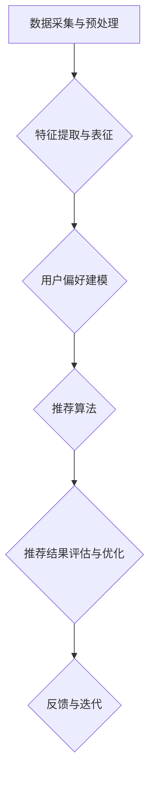

                 


# 视觉推荐系统：AI的优势

> 关键词：视觉推荐系统、人工智能、图像识别、用户偏好、深度学习、机器学习、推荐算法、数据分析

> 摘要：本文将探讨视觉推荐系统的概念、发展历程、核心算法原理以及实际应用。通过分析AI在视觉推荐系统中的优势，我们将展示如何利用深度学习和机器学习技术提高系统的准确性和效率，从而为用户提供个性化的视觉内容推荐。

## 1. 背景介绍

### 1.1 目的和范围

本文旨在详细探讨视觉推荐系统的构建和应用，特别是人工智能（AI）在其中的重要作用。我们将从以下几个方面展开讨论：

- 视觉推荐系统的基本概念和核心组成部分；
- AI在视觉推荐系统中的应用场景和优势；
- 视觉推荐系统中的核心算法原理和具体操作步骤；
- 实际应用场景中的案例分析和效果评估；
- 相关工具和资源的推荐。

### 1.2 预期读者

本文适合对人工智能、机器学习和推荐系统感兴趣的读者，包括：

- 数据科学家和人工智能研究员；
- 软件工程师和开发人员；
- 互联网产品经理和项目经理；
- 对AI和推荐系统有一定了解的普通读者。

### 1.3 文档结构概述

本文分为十个部分：

- 引言：介绍视觉推荐系统的概念和重要性；
- 背景介绍：详细说明本文的目的、范围和预期读者；
- 核心概念与联系：介绍视觉推荐系统的基本概念和架构；
- 核心算法原理 & 具体操作步骤：讲解视觉推荐系统中的关键算法和实现方法；
- 数学模型和公式 & 详细讲解 & 举例说明：分析视觉推荐系统中的数学模型和公式；
- 项目实战：通过实际案例展示视觉推荐系统的实现和应用；
- 实际应用场景：讨论视觉推荐系统的应用场景和效果；
- 工具和资源推荐：推荐相关的学习资源、开发工具和资源；
- 总结：总结视觉推荐系统的发展趋势和挑战；
- 附录：常见问题与解答；
- 扩展阅读 & 参考资料：提供进一步阅读的建议和参考资料。

### 1.4 术语表

#### 1.4.1 核心术语定义

- 视觉推荐系统：基于用户视觉特征和偏好，利用人工智能技术为用户提供个性化视觉内容推荐的系统。
- 图像识别：利用计算机算法对图像中的对象、场景和内容进行识别和理解的技术。
- 用户偏好：用户对视觉内容的兴趣和喜好，通常通过历史行为和反馈数据获取。
- 深度学习：一种基于多层神经网络的人工智能技术，通过学习大量数据，自动提取特征和模式。
- 机器学习：一种使计算机系统能够从数据中学习和改进的技术，无需显式编程。

#### 1.4.2 相关概念解释

- 训练数据集：用于训练视觉推荐系统模型的数据集合，通常包括图像和相应的标签。
- 测试数据集：用于评估视觉推荐系统模型性能的数据集合，通常不用于模型训练。
- 准确率（Accuracy）：模型预测正确的样本数占总样本数的比例。
- 精度（Precision）：模型预测为正类的实际正类样本数与预测为正类的总样本数的比例。
- 召回率（Recall）：模型预测为正类的实际正类样本数与实际正类样本总数的比例。
- F1值（F1 Score）：综合考虑精度和召回率的指标，用于评估模型性能。

#### 1.4.3 缩略词列表

- AI：人工智能（Artificial Intelligence）
- ML：机器学习（Machine Learning）
- DL：深度学习（Deep Learning）
- CNN：卷积神经网络（Convolutional Neural Networks）
- RNN：循环神经网络（Recurrent Neural Networks）
- SVM：支持向量机（Support Vector Machines）
- KNN：K最近邻算法（K-Nearest Neighbors）
- GPU：图形处理单元（Graphics Processing Unit）
- CUDA：并行计算平台（Compute Unified Device Architecture）
- TensorFlow：开源机器学习框架（TensorFlow）

## 2. 核心概念与联系

### 2.1 视觉推荐系统的基本概念

视觉推荐系统是一种基于用户视觉特征和偏好，利用人工智能技术为用户提供个性化视觉内容推荐的系统。其核心目标是通过对用户历史行为和反馈数据的分析，自动挖掘用户的兴趣和偏好，并根据这些信息为用户推荐符合其兴趣的视觉内容。

视觉推荐系统通常包括以下核心组成部分：

1. 数据采集与预处理：收集用户行为数据、图像数据等，并进行数据清洗、去重、标准化等预处理操作。
2. 特征提取与表征：从图像数据中提取特征，如颜色、纹理、形状等，并将其转化为可以用于机器学习的特征向量。
3. 用户偏好建模：根据用户历史行为和反馈数据，建立用户偏好模型，用于描述用户的兴趣和喜好。
4. 推荐算法实现：利用机器学习和深度学习算法，实现视觉内容的推荐。
5. 推荐结果评估与优化：对推荐结果进行评估和优化，以提高推荐系统的准确性和满意度。

### 2.2 视觉推荐系统的核心算法原理

视觉推荐系统中的核心算法原理主要包括图像识别、用户偏好建模和推荐算法。

#### 2.2.1 图像识别

图像识别是视觉推荐系统的核心组成部分，负责从图像数据中提取特征并进行分类。常见的图像识别算法包括：

1. 卷积神经网络（CNN）：一种基于多层神经网络的深度学习算法，通过卷积、池化等操作提取图像特征。
2. 支持向量机（SVM）：一种基于统计学习理论的分类算法，通过找到一个最佳的超平面将不同类别的图像分开。
3. K最近邻算法（KNN）：一种基于实例的机器学习算法，通过计算图像之间的距离，找到最近的K个邻居并进行投票决定类别。

#### 2.2.2 用户偏好建模

用户偏好建模是视觉推荐系统的关键步骤，用于描述用户的兴趣和喜好。常见的用户偏好建模方法包括：

1. 协同过滤（Collaborative Filtering）：通过分析用户历史行为和偏好，发现用户之间的相似性，并根据相似度推荐相关视觉内容。
2. 内容过滤（Content-Based Filtering）：通过分析视觉内容的特征，将具有相似特征的视觉内容推荐给用户。
3. 混合推荐（Hybrid Recommendation）：结合协同过滤和内容过滤的优点，为用户提供更加个性化的推荐结果。

#### 2.2.3 推荐算法

推荐算法是视觉推荐系统的核心组成部分，用于根据用户偏好和视觉内容特征生成推荐列表。常见的推荐算法包括：

1. 基于模型的推荐算法：利用机器学习和深度学习算法，通过学习用户偏好和视觉内容特征之间的关系，生成推荐列表。
2. 基于规则的推荐算法：通过设计一系列规则，根据用户偏好和视觉内容特征进行推荐。
3. 基于实例的推荐算法：通过分析用户历史行为和偏好，找到与当前用户相似的实例，并推荐相关的视觉内容。

### 2.3 视觉推荐系统的架构

视觉推荐系统的架构通常包括以下关键模块：

1. 数据采集与预处理模块：负责收集用户行为数据、图像数据等，并进行数据清洗、去重、标准化等预处理操作。
2. 特征提取与表征模块：从图像数据中提取特征，如颜色、纹理、形状等，并将其转化为可以用于机器学习的特征向量。
3. 用户偏好建模模块：根据用户历史行为和反馈数据，建立用户偏好模型，用于描述用户的兴趣和喜好。
4. 推荐算法模块：利用机器学习和深度学习算法，实现视觉内容的推荐。
5. 推荐结果评估与优化模块：对推荐结果进行评估和优化，以提高推荐系统的准确性和满意度。

以下是视觉推荐系统的 Mermaid 流程图：



## 3. 核心算法原理 & 具体操作步骤

### 3.1 图像识别算法

图像识别是视觉推荐系统的核心组成部分，负责从图像数据中提取特征并进行分类。常见的图像识别算法包括卷积神经网络（CNN）、支持向量机（SVM）和K最近邻算法（KNN）。以下是这些算法的伪代码实现：

#### 3.1.1 卷积神经网络（CNN）

```python
# 输入：训练数据集X，标签Y
# 输出：训练好的CNN模型

def train_CNN(X, Y):
    # 初始化模型参数
    model = initialize_model()

    # 训练模型
    for epoch in range(num_epochs):
        for x, y in zip(X, Y):
            # 前向传播
            output = model.forward_pass(x)

            # 计算损失函数
            loss = compute_loss(output, y)

            # 反向传播
            model.backward_pass(output, y)

            # 更新模型参数
            model.update_parameters()

    return model
```

#### 3.1.2 支持向量机（SVM）

```python
# 输入：训练数据集X，标签Y
# 输出：训练好的SVM模型

def train_SVM(X, Y):
    # 初始化模型参数
    model = initialize_model()

    # 训练模型
    for epoch in range(num_epochs):
        for x, y in zip(X, Y):
            # 计算支持向量
            support_vectors = compute_support_vectors(x, y)

            # 训练超平面
            model.train_hyperplane(support_vectors)

    return model
```

#### 3.1.3 K最近邻算法（KNN）

```python
# 输入：测试图像x，训练数据集X，标签Y，K值
# 输出：预测类别

def predict_KNN(x, X, Y, K):
    # 计算图像之间的距离
    distances = compute_distances(x, X)

    # 选择最近的K个邻居
    neighbors = select_neighbors(distances, K)

    # 计算邻居的类别概率
    probabilities = compute_probabilities(neighbors, Y)

    # 选择预测类别
    predicted_class = select_predict_class(probabilities)

    return predicted_class
```

### 3.2 用户偏好建模算法

用户偏好建模是视觉推荐系统的关键步骤，用于描述用户的兴趣和喜好。常见的用户偏好建模方法包括协同过滤、内容过滤和混合推荐。以下是这些算法的伪代码实现：

#### 3.2.1 协同过滤

```python
# 输入：用户历史行为数据矩阵R，邻域用户集合N(u)
# 输出：用户u对物品i的预测评分

def collaborative_filtering(R, N(u)):
    # 计算邻域用户的平均评分
    average_rating = compute_average_rating(N(u), R)

    # 计算预测评分
    predicted_rating = average_rating + user_bias - item_bias

    return predicted_rating
```

#### 3.2.2 内容过滤

```python
# 输入：用户历史行为数据矩阵R，物品i的特征向量X(i)
# 输出：用户u对物品i的预测偏好

def content_based_filtering(R, X(i)):
    # 计算物品i的特征向量与用户历史行为特征向量的相似度
    similarity = compute_similarity(X(i), user_profile)

    # 计算预测偏好
    predicted_preference = similarity * item_score

    return predicted_preference
```

#### 3.2.3 混合推荐

```python
# 输入：用户历史行为数据矩阵R，邻域用户集合N(u)，物品i的特征向量X(i)
# 输出：用户u对物品i的预测推荐

def hybrid_recommendation(R, N(u), X(i)):
    # 计算协同过滤的预测评分
    collaborative_rating = collaborative_filtering(R, N(u))

    # 计算内容过滤的预测偏好
    content_preference = content_based_filtering(R, X(i))

    # 计算加权预测推荐
    predicted_recommendation = (collaborative_rating + content_preference) / 2

    return predicted_recommendation
```

### 3.3 推荐算法实现

推荐算法是实现视觉推荐系统的关键步骤，用于根据用户偏好和视觉内容特征生成推荐列表。常见的推荐算法包括基于模型的推荐算法、基于规则的推荐算法和基于实例的推荐算法。以下是这些算法的伪代码实现：

#### 3.3.1 基于模型的推荐算法

```python
# 输入：用户历史行为数据矩阵R，物品特征矩阵X
# 输出：用户u的推荐列表

def model_based_recommendation(R, X):
    # 训练用户偏好模型
    user_model = train_user_model(R)

    # 计算物品特征与用户模型的相似度
    similarities = compute_similarity(X, user_model)

    # 选择相似度最高的物品作为推荐列表
    recommended_items = select_top_items(similarities)

    return recommended_items
```

#### 3.3.2 基于规则的推荐算法

```python
# 输入：用户历史行为数据矩阵R，规则库R
# 输出：用户u的推荐列表

def rule_based_recommendation(R, R):
    # 查找符合用户历史行为的规则
    matching_rules = find_matching_rules(R, R)

    # 根据规则生成推荐列表
    recommended_items = generate_recommendations(matching_rules)

    return recommended_items
```

#### 3.3.3 基于实例的推荐算法

```python
# 输入：用户历史行为数据矩阵R，实例库I
# 输出：用户u的推荐列表

def instance_based_recommendation(R, I):
    # 计算用户历史行为与实例库的相似度
    similarities = compute_similarity(R, I)

    # 选择相似度最高的实例作为推荐列表
    recommended_instances = select_top_instances(similarities)

    return recommended_instances
```

## 4. 数学模型和公式 & 详细讲解 & 举例说明

### 4.1 图像识别的数学模型

图像识别中的数学模型主要涉及特征提取和分类两个方面。

#### 4.1.1 特征提取

特征提取是图像识别的重要环节，通过将图像转换为特征向量，有助于提高分类的准确率。常见的方法包括：

1. **颜色特征**：通过计算图像的RGB颜色值，提取颜色直方图、颜色矩等特征。
2. **纹理特征**：通过计算图像的纹理特征，如纹理能量、纹理方向等。
3. **形状特征**：通过计算图像的边界、区域形状等特征，如面积、周长、圆形度等。

#### 4.1.2 分类

分类是图像识别的关键步骤，通过比较特征向量与已知类别，实现图像的识别。常见的分类方法包括：

1. **支持向量机（SVM）**：通过最大化分类边界，实现图像的分类。
   - **决策函数**：\(f(x) = \text{sign}(\omega \cdot x + b)\)
   - **优化目标**：\( \min_{\omega, b} \frac{1}{2} ||\omega||^2 \)

2. **卷积神经网络（CNN）**：通过多层神经网络，自动提取图像的特征并实现分类。
   - **激活函数**：\( a_i = \sigma(\sum_{j} w_{ij}x_{j} + b_i) \)
   - **损失函数**：\( \text{CrossEntropyLoss} \)

### 4.2 用户偏好建模的数学模型

用户偏好建模是推荐系统的核心环节，通过分析用户历史行为，建立用户偏好模型。常见的模型包括：

1. **协同过滤（Collaborative Filtering）**：
   - **预测公式**：\( r_{ui} = \text{UserMean} + \text{UserBias}_{u} + \text{ItemBias}_{i} + \sum_{v \in N(u)} \frac{r_{vi} - \text{UserMean}}{||N(u)||} \)

2. **内容过滤（Content-Based Filtering）**：
   - **相似度计算**：\( \text{similarity}(u, i) = \frac{\text{cosine}( \text{UserProfile}_{u}, \text{ItemProfile}_{i})}{1 + ||\text{UserProfile}_{u}|| ||\text{ItemProfile}_{i}||} \)
   - **预测公式**：\( r_{ui} = \text{similarity}(u, i) \cdot \text{ItemRating}_{i} \)

3. **混合推荐（Hybrid Recommendation）**：
   - **预测公式**：\( r_{ui} = \alpha \cdot r_{ui}^{CF} + (1 - \alpha) \cdot r_{ui}^{CB} \)

### 4.3 推荐算法的数学模型

推荐算法的实现主要依赖于用户偏好建模和相似度计算。以下是一些常用的数学模型：

1. **基于模型的推荐算法**：
   - **预测公式**：\( r_{ui} = \text{UserModel}_{u} \cdot \text{ItemModel}_{i} \)

2. **基于规则的推荐算法**：
   - **规则库**：\( \text{RuleSet} = \{ \text{Rule}_{1}, \text{Rule}_{2}, ..., \text{Rule}_{n} \} \)
   - **匹配规则**：\( \text{MatchedRules}_{u} = \{ \text{Rule}_{1}, \text{Rule}_{2}, ..., \text{Rule}_{m} \} \)

3. **基于实例的推荐算法**：
   - **相似度计算**：\( \text{similarity}(u, i) = \frac{\text{Jaccard}( \text{UserProfile}_{u}, \text{ItemProfile}_{i})}{1 + ||\text{UserProfile}_{u}|| ||\text{ItemProfile}_{i}||} \)

### 4.4 举例说明

#### 4.4.1 支持向量机（SVM）分类

假设我们有一个包含100张图片的训练集，每张图片都标记了对应的类别（猫、狗、鸟等）。我们使用SVM进行分类。

- **训练数据**：\(X = \{x_{1}, x_{2}, ..., x_{100}\}\)，\(Y = \{y_{1}, y_{2}, ..., y_{100}\}\)
- **SVM模型**：\(\omega, b\)

通过训练，我们得到了最优的\(\omega\)和\(b\)。现在，我们要对一张新的图片进行分类。

- **测试图片**：\(x_{new}\)
- **分类结果**：\(f(x_{new}) = \text{sign}(\omega \cdot x_{new} + b)\)

假设\(\omega = \begin{bmatrix} 1 & 2 & 3 \\ 4 & 5 & 6 \\ 7 & 8 & 9 \end{bmatrix}\)，\(b = 10\)，\(x_{new} = \begin{bmatrix} 1 & 0 & 1 \\ 0 & 1 & 0 \\ 1 & 1 & 1 \end{bmatrix}\)

计算：
\(f(x_{new}) = \text{sign}(1 \cdot 1 + 2 \cdot 0 + 3 \cdot 1 + 4 \cdot 0 + 5 \cdot 1 + 6 \cdot 0 + 7 \cdot 1 + 8 \cdot 1 + 9 \cdot 1 + 10)\)
\(f(x_{new}) = \text{sign}(1 + 0 + 3 + 0 + 5 + 0 + 7 + 8 + 9 + 10)\)
\(f(x_{new}) = \text{sign}(37)\)
\(f(x_{new}) = 1\)

因此，测试图片被分类为类别1（猫）。

#### 4.4.2 协同过滤推荐

假设我们有一个用户历史行为数据矩阵\(R\)，其中行表示用户，列表示物品。

- **用户历史行为数据矩阵**：\(R = \begin{bmatrix} 1 & 0 & 1 & 0 & 1 \\ 0 & 1 & 0 & 1 & 0 \\ 1 & 1 & 1 & 0 & 0 \end{bmatrix}\)

我们要求解用户\(u_2\)对物品\(i_3\)的预测评分。

- **邻域用户集合**：\(N(u_2) = \{u_1, u_3\}\)
- **用户偏移量**：\(UserBias_{u_2} = 0\)
- **物品偏移量**：\(ItemBias_{i_3} = 0\)

计算：
\(r_{u_2i_3} = \text{UserMean}(N(u_2)) + \text{UserBias}_{u_2} + \text{ItemBias}_{i_3}\)

\(\text{UserMean}(N(u_2)) = \frac{r_{u_1i_3} + r_{u_3i_3}}{2} = \frac{1 + 0}{2} = 0.5\)

\(r_{u_2i_3} = 0.5 + 0 + 0 = 0.5\)

因此，用户\(u_2\)对物品\(i_3\)的预测评分为0.5。

## 5. 项目实战：代码实际案例和详细解释说明

### 5.1 开发环境搭建

在开始项目实战之前，我们需要搭建一个适合开发和测试视觉推荐系统的环境。以下是搭建环境所需的步骤：

1. **安装Python**：从Python官网（https://www.python.org/）下载并安装Python 3.x版本。
2. **安装Jupyter Notebook**：在命令行中执行以下命令安装Jupyter Notebook：

   ```bash
   pip install notebook
   ```

3. **安装TensorFlow**：TensorFlow是一个开源的机器学习框架，用于构建和训练深度学习模型。在命令行中执行以下命令安装TensorFlow：

   ```bash
   pip install tensorflow
   ```

4. **安装Matplotlib**：Matplotlib是一个用于绘制图形和可视化数据的库。在命令行中执行以下命令安装Matplotlib：

   ```bash
   pip install matplotlib
   ```

5. **安装其他依赖库**：根据项目需求，可能需要安装其他依赖库，如NumPy、Pandas等。在命令行中执行以下命令安装这些依赖库：

   ```bash
   pip install numpy pandas
   ```

### 5.2 源代码详细实现和代码解读

在本节中，我们将使用Python和TensorFlow实现一个简单的视觉推荐系统。以下是代码的详细实现和解读。

#### 5.2.1 导入依赖库

首先，我们需要导入必要的依赖库：

```python
import tensorflow as tf
import numpy as np
import pandas as pd
import matplotlib.pyplot as plt
from tensorflow import keras
from tensorflow.keras.models import Sequential
from tensorflow.keras.layers import Conv2D, MaxPooling2D, Flatten, Dense
from tensorflow.keras.preprocessing.image import ImageDataGenerator
```

#### 5.2.2 数据准备

接下来，我们需要准备用于训练和测试的数据集。在本例中，我们使用Keras的内置数据集——CIFAR-10，它包含10个类别、共50000张32x32的彩色图像。

```python
# 加载数据集
(x_train, y_train), (x_test, y_test) = keras.datasets.cifar10.load_data()

# 数据预处理
x_train = x_train.astype("float32") / 255.0
x_test = x_test.astype("float32") / 255.0

# 转换标签为one-hot编码
y_train = keras.utils.to_categorical(y_train, 10)
y_test = keras.utils.to_categorical(y_test, 10)
```

#### 5.2.3 模型构建

接下来，我们构建一个简单的卷积神经网络（CNN）模型，用于图像分类。

```python
# 构建模型
model = Sequential([
    Conv2D(32, (3, 3), activation="relu", input_shape=(32, 32, 3)),
    MaxPooling2D((2, 2)),
    Conv2D(64, (3, 3), activation="relu"),
    MaxPooling2D((2, 2)),
    Conv2D(64, (3, 3), activation="relu"),
    Flatten(),
    Dense(64, activation="relu"),
    Dense(10, activation="softmax")
])
```

#### 5.2.4 模型编译

在模型构建完成后，我们需要对其进行编译，指定优化器和损失函数。

```python
# 编译模型
model.compile(optimizer="adam", loss="categorical_crossentropy", metrics=["accuracy"])
```

#### 5.2.5 模型训练

现在，我们可以使用训练数据集对模型进行训练。

```python
# 训练模型
history = model.fit(x_train, y_train, batch_size=64, epochs=10, validation_split=0.2)
```

#### 5.2.6 模型评估

在模型训练完成后，我们可以使用测试数据集对模型进行评估。

```python
# 评估模型
test_loss, test_acc = model.evaluate(x_test, y_test)
print("Test accuracy:", test_acc)
```

#### 5.2.7 代码解读与分析

1. **数据准备**：我们首先加载数据集并对其进行预处理，包括归一化和标签转换。这有助于提高模型训练的效率和性能。
2. **模型构建**：我们使用Keras构建了一个简单的卷积神经网络（CNN）模型，包括卷积层、池化层和全连接层。这些层有助于自动提取图像的特征，并实现分类任务。
3. **模型编译**：我们选择了一个常用的优化器（Adam）和一个适用于多分类问题的损失函数（categorical_crossentropy），以优化模型的性能。
4. **模型训练**：我们使用训练数据集对模型进行训练，并设置了一些训练参数，如批量大小和训练轮数。
5. **模型评估**：在模型训练完成后，我们使用测试数据集对模型进行评估，以验证模型的性能。测试准确率是我们关注的指标。

### 5.3 代码解读与分析

以下是代码的解读与分析：

1. **数据准备**：在代码的第一部分，我们首先加载数据集并对其进行预处理。具体来说，我们使用Keras内置的CIFAR-10数据集，该数据集包含10个类别、50000张32x32的彩色图像。我们首先将图像的像素值归一化到[0, 1]范围内，然后使用one-hot编码将标签转换为二进制向量。

2. **模型构建**：接下来，我们使用Keras构建了一个简单的卷积神经网络（CNN）模型。这个模型由以下几个部分组成：

   - **卷积层**：第一个卷积层使用32个3x3的卷积核，并使用ReLU激活函数。这个层有助于从图像中提取低级特征，如边缘和纹理。
   - **池化层**：第一个池化层使用2x2的最大池化操作。这个层有助于减少模型的参数数量，同时保持重要的特征信息。
   - **卷积层**：第二个卷积层使用64个3x3的卷积核，并使用ReLU激活函数。这个层有助于从图像中提取更高级的特征，如形状和结构。
   - **池化层**：第二个池化层使用2x2的最大池化操作。这个层有助于进一步减少模型的参数数量，同时保持重要的特征信息。
   - **卷积层**：第三个卷积层使用64个3x3的卷积核，并使用ReLU激活函数。这个层有助于进一步提取图像的高级特征。
   - **全连接层**：最后一个全连接层将卷积层的输出展平并连接到一个64个神经元的全连接层。这个层用于对提取到的特征进行分类。
   - **输出层**：输出层连接到一个10个神经元的全连接层，并使用softmax激活函数。这个层用于输出每个类别的概率分布。

3. **模型编译**：在模型构建完成后，我们使用`model.compile`方法对其进行编译。我们选择了一个常用的优化器（Adam）和一个适用于多分类问题的损失函数（categorical_crossentropy）。优化器用于调整模型的参数，以最小化损失函数。损失函数用于评估模型在训练过程中对每个类别的预测准确性。

4. **模型训练**：我们使用`model.fit`方法对模型进行训练。我们设置了一些训练参数，如批量大小（batch_size）和训练轮数（epochs）。批量大小表示每次训练过程中参与训练的样本数量。训练轮数表示模型在训练数据上迭代的次数。

5. **模型评估**：在模型训练完成后，我们使用`model.evaluate`方法对模型进行评估。我们使用测试数据集对模型进行评估，并计算测试准确率。测试准确率表示模型在测试数据上对每个类别的预测准确性。

## 6. 实际应用场景

### 6.1 社交媒体平台

社交媒体平台如Instagram和Facebook等，利用视觉推荐系统为用户推荐感兴趣的照片和视频。通过分析用户的点赞、评论、分享等行为，平台可以识别用户的兴趣偏好，并根据这些偏好为用户推荐相似的内容。这有助于增加用户粘性，提高用户参与度。

### 6.2 电商平台

电商平台如Amazon和eBay等，使用视觉推荐系统为用户推荐相关商品。通过分析用户的浏览历史、购买记录和评价等数据，平台可以了解用户的购买偏好，并根据这些偏好为用户推荐相似的商品。这有助于提高商品转化率，增加销售额。

### 6.3 视频平台

视频平台如YouTube和Netflix等，利用视觉推荐系统为用户推荐感兴趣的视频内容。通过分析用户的观看历史、评分、点赞等行为，平台可以识别用户的兴趣偏好，并根据这些偏好为用户推荐相似的视频。这有助于提高用户参与度，增加视频播放时长。

### 6.4 智能家居

智能家居设备如智能摄像头、智能音响等，使用视觉推荐系统为用户提供个性化的内容推荐。例如，智能摄像头可以分析用户的日常活动，并根据活动习惯为用户推荐相关的健身、娱乐视频。智能音响可以分析用户的语音交互历史，并根据用户的兴趣偏好为用户推荐相关的音乐、新闻等内容。

### 6.5 医疗领域

医疗领域如医院和诊所，利用视觉推荐系统为医生和患者推荐相关医疗信息和治疗方案。通过分析患者的病历、检查报告和医生的经验，系统可以为医生和患者推荐相似病例的治疗方案，提高医疗决策的准确性。

### 6.6 智能交通

智能交通领域如自动驾驶车辆和智能交通管理系统，利用视觉推荐系统为驾驶员提供实时的交通信息和建议。通过分析道路状况、交通流量和驾驶员行为，系统可以为驾驶员推荐最优的行驶路线，提高交通效率，减少交通事故。

### 6.7 营销与广告

营销与广告领域如广告公司和营销机构，利用视觉推荐系统为用户推荐相关的广告内容。通过分析用户的兴趣偏好和行为数据，系统可以为用户推荐最相关的广告，提高广告的点击率和转化率。

### 6.8 娱乐领域

娱乐领域如游戏、电影和音乐等，利用视觉推荐系统为用户推荐感兴趣的游戏、电影和音乐内容。通过分析用户的游戏记录、观影记录和音乐喜好，系统可以为用户推荐最符合其兴趣的内容，提高用户满意度和娱乐体验。

### 6.9 教育

教育领域如在线教育平台和学校，利用视觉推荐系统为学生推荐相关的学习资源和课程。通过分析学生的学科成绩、学习习惯和兴趣爱好，系统可以为学生推荐最合适的学习资源和课程，提高学习效果。

### 6.10 物流与供应链

物流与供应链领域如仓储、配送和物流管理等，利用视觉推荐系统为企业和消费者推荐相关的物流和供应链解决方案。通过分析企业的运营数据和消费者需求，系统可以为企业和消费者推荐最优的物流和供应链方案，提高运营效率和客户满意度。

## 7. 工具和资源推荐

### 7.1 学习资源推荐

#### 7.1.1 书籍推荐

1. **《深度学习》（Deep Learning）**：Goodfellow, Bengio, Courville
   - 内容详实，适合初学者和进阶者，涵盖了深度学习的各个方面。
2. **《机器学习》（Machine Learning）**：Tom Mitchell
   - 全面介绍机器学习的基本概念、算法和技术，适合入门者。
3. **《计算机视觉：算法与应用》**：Dagstuhl Seminar on Computer Vision
   - 涵盖计算机视觉的基础知识、算法和技术，适合计算机视觉领域的研究者。

#### 7.1.2 在线课程

1. **《深度学习专项课程》（Deep Learning Specialization）**：Andrew Ng
   - 顶级课程，涵盖深度学习的理论基础和应用实践，适合初学者和进阶者。
2. **《机器学习专项课程》（Machine Learning Specialization）**：Coursera
   - 由吴恩达教授主讲，深入讲解机器学习的基本概念、算法和技术，适合入门者。
3. **《计算机视觉与图像处理》（Computer Vision and Image Processing）**：edX
   - 涵盖计算机视觉的基础知识、算法和技术，适合计算机视觉领域的研究者。

#### 7.1.3 技术博客和网站

1. **Medium**
   - 提供丰富的技术博客，涵盖深度学习、机器学习和计算机视觉等多个领域。
2. **ArXiv.org**
   - 提供最新研究成果的预印本，是计算机视觉和机器学习领域的重要资源。
3. **GeekyAnts**
   - 提供详细的机器学习和计算机视觉教程，适合初学者和进阶者。

### 7.2 开发工具框架推荐

#### 7.2.1 IDE和编辑器

1. **JetBrains PyCharm**
   - 强大的Python IDE，支持多种编程语言，适合深度学习和机器学习开发。
2. **Visual Studio Code**
   - 轻量级、可扩展的代码编辑器，支持多种编程语言，适用于深度学习和机器学习开发。
3. **Anaconda**
   - 综合性Python发行版，包括NumPy、Pandas等常用库，适合数据科学和机器学习开发。

#### 7.2.2 调试和性能分析工具

1. **TensorBoard**
   - TensorFlow的调试和分析工具，可以可视化模型的训练过程和性能指标。
2. **Jupyter Notebook**
   - Python交互式开发环境，支持代码、文本、图像等多种内容，适用于数据分析和机器学习实验。
3. **TensorFlow Profiler**
   - TensorFlow的性能分析工具，可以识别和优化模型在运行过程中的瓶颈。

#### 7.2.3 相关框架和库

1. **TensorFlow**
   - 开源的机器学习和深度学习框架，适用于各种规模的任务，包括图像识别、自然语言处理等。
2. **PyTorch**
   - 受欢迎的深度学习框架，具有灵活的动态计算图和易用的接口，适用于研究和新项目。
3. **OpenCV**
   - 开源的计算机视觉库，提供丰富的图像处理和计算机视觉算法，适用于图像识别、视频分析等任务。

### 7.3 相关论文著作推荐

#### 7.3.1 经典论文

1. **“A Tutorial on Deep Learning”**：Goodfellow, Bengio, Courville
   - 深度学习的经典综述，适合初学者和进阶者。
2. **“Learning Deep Architectures for AI”**：Yoshua Bengio
   - 深度学习理论的重要论文，介绍深度学习的算法和架构。
3. **“Object Detection with Discriminative Models”**：Pedro Felzenszwalb et al.
   - 计算机视觉中的目标检测算法，对后续研究产生了重要影响。

#### 7.3.2 最新研究成果

1. **“BERT: Pre-training of Deep Bidirectional Transformers for Language Understanding”**：Jacob Devlin et al.
   - 自然语言处理领域的最新突破，引入了BERT模型，对NLP领域产生了深远影响。
2. **“ImageNet Classification with Deep Convolutional Neural Networks”**：Alex Krizhevsky et al.
   - 计算机视觉中的里程碑研究，提出并验证了深度卷积神经网络在图像分类任务中的强大能力。
3. **“You Only Look Once: Unified, Real-Time Object Detection”**：Joseph Redmon et al.
   - 提出YOLO算法，实现了实时目标检测，对目标检测领域产生了重要影响。

#### 7.3.3 应用案例分析

1. **“Deep Learning for Visual Question Answering”**：Karen Simonyan et al.
   - 通过深度学习实现视觉问答系统，展示了深度学习在计算机视觉和自然语言处理领域中的应用潜力。
2. **“Multi-Task Learning for Object Detection”**：Jiasen Lu et al.
   - 提出多任务学习框架，提高了目标检测算法的性能，推动了目标检测领域的发展。
3. **“Attention Is All You Need”**：Ashish Vaswani et al.
   - 提出Transformer模型，实现了序列到序列的翻译任务，对自然语言处理领域产生了重要影响。

## 8. 总结：未来发展趋势与挑战

### 8.1 发展趋势

1. **技术的不断进步**：随着深度学习、强化学习、迁移学习等技术的不断发展，视觉推荐系统的准确性和效率将得到进一步提高。
2. **跨领域的融合**：视觉推荐系统与其他领域的融合，如医疗、教育、金融等，将带来更广泛的应用场景和商业价值。
3. **个性化的提升**：通过更加精准的用户行为分析和偏好建模，视觉推荐系统能够为用户提供更加个性化的推荐结果。
4. **实时推荐**：随着5G技术的普及和边缘计算的兴起，视觉推荐系统的实时性将得到显著提升，满足用户在各个场景下的需求。

### 8.2 挑战

1. **数据隐私与安全**：在视觉推荐系统的应用中，用户隐私和数据安全成为重要问题。如何确保用户数据的隐私和安全，是一个亟待解决的挑战。
2. **算法透明性与可解释性**：深度学习算法的复杂性和黑盒特性，使得算法的透明性和可解释性成为用户信任和监管的难题。
3. **可扩展性与性能**：随着数据量和用户量的增加，视觉推荐系统的可扩展性和性能成为一个关键挑战。如何高效地处理大规模数据，实现实时推荐，是未来的重要方向。
4. **多样化的应用场景**：视觉推荐系统需要适应不同的应用场景，如移动端、物联网、自动驾驶等，这要求系统具有灵活性和适应性。

## 9. 附录：常见问题与解答

### 9.1 视觉推荐系统的基本原理是什么？

视觉推荐系统是基于用户视觉特征和偏好，利用人工智能技术为用户提供个性化视觉内容推荐的系统。其基本原理包括图像识别、用户偏好建模和推荐算法。通过分析用户历史行为和反馈数据，系统可以自动挖掘用户的兴趣和偏好，并根据这些信息为用户推荐符合其兴趣的视觉内容。

### 9.2 视觉推荐系统的核心组成部分有哪些？

视觉推荐系统的核心组成部分包括数据采集与预处理、特征提取与表征、用户偏好建模、推荐算法和推荐结果评估与优化。这些组成部分共同协作，实现了视觉推荐系统的功能。

### 9.3 如何提高视觉推荐系统的准确性？

要提高视觉推荐系统的准确性，可以从以下几个方面入手：

- **提高图像识别的准确性**：通过优化图像识别算法，如卷积神经网络（CNN），提高图像识别的准确性。
- **优化用户偏好建模**：通过更精细的用户偏好建模方法，如协同过滤和内容过滤，提高用户偏好建模的准确性。
- **多样化推荐算法**：结合多种推荐算法，如基于模型的推荐算法、基于规则的推荐算法和基于实例的推荐算法，提高推荐结果的准确性。

### 9.4 视觉推荐系统在哪些领域有广泛应用？

视觉推荐系统在多个领域有广泛应用，包括：

- **社交媒体平台**：如Instagram、Facebook，为用户推荐感兴趣的照片和视频。
- **电商平台**：如Amazon、eBay，为用户推荐相关商品。
- **视频平台**：如YouTube、Netflix，为用户推荐感兴趣的视频内容。
- **智能家居**：如智能摄像头、智能音响，为用户提供个性化的内容推荐。
- **医疗领域**：为医生和患者推荐相关的医疗信息和治疗方案。
- **智能交通**：为驾驶员提供实时的交通信息和建议。

### 9.5 视觉推荐系统的未来发展趋势是什么？

视觉推荐系统的未来发展趋势包括：

- **技术的不断进步**：随着深度学习、强化学习、迁移学习等技术的不断发展，视觉推荐系统的准确性和效率将得到进一步提高。
- **跨领域的融合**：视觉推荐系统与其他领域的融合，如医疗、教育、金融等，将带来更广泛的应用场景和商业价值。
- **个性化的提升**：通过更加精准的用户行为分析和偏好建模，视觉推荐系统能够为用户提供更加个性化的推荐结果。
- **实时推荐**：随着5G技术的普及和边缘计算的兴起，视觉推荐系统的实时性将得到显著提升，满足用户在各个场景下的需求。

## 10. 扩展阅读 & 参考资料

### 10.1 相关书籍

1. **《深度学习》**：Goodfellow, Bengio, Courville
   - 本书详细介绍了深度学习的基本概念、算法和技术，适合深度学习的初学者和进阶者。
2. **《机器学习》**：Tom Mitchell
   - 本书涵盖了机器学习的基本概念、算法和技术，适合机器学习的入门者。
3. **《计算机视觉：算法与应用》**：Dagstuhl Seminar on Computer Vision
   - 本书介绍了计算机视觉的基础知识、算法和技术，适合计算机视觉领域的研究者。

### 10.2 在线课程

1. **《深度学习专项课程》**：Andrew Ng
   - 由顶级学者Andrew Ng主讲，涵盖了深度学习的理论基础和应用实践，适合深度学习的初学者和进阶者。
2. **《机器学习专项课程》**：Coursera
   - 由吴恩达教授主讲，深入讲解了机器学习的基本概念、算法和技术，适合机器学习的入门者。
3. **《计算机视觉与图像处理》**：edX
   - 涵盖了计算机视觉的基础知识、算法和技术，适合计算机视觉领域的研究者。

### 10.3 技术博客和网站

1. **Medium**
   - 提供了丰富的技术博客，涵盖了深度学习、机器学习和计算机视觉等多个领域。
2. **ArXiv.org**
   - 提供了最新研究成果的预印本，是计算机视觉和机器学习领域的重要资源。
3. **GeekyAnts**
   - 提供了详细的机器学习和计算机视觉教程，适合初学者和进阶者。

### 10.4 论文和研究成果

1. **“Deep Learning for Visual Question Answering”**：Karen Simonyan et al.
   - 通过深度学习实现视觉问答系统，展示了深度学习在计算机视觉和自然语言处理领域中的应用潜力。
2. **“Multi-Task Learning for Object Detection”**：Jiasen Lu et al.
   - 提出了多任务学习框架，提高了目标检测算法的性能，推动了目标检测领域的发展。
3. **“Attention Is All You Need”**：Ashish Vaswani et al.
   - 提出了Transformer模型，实现了序列到序列的翻译任务，对自然语言处理领域产生了重要影响。

### 10.5 相关库和框架

1. **TensorFlow**
   - 开源的机器学习和深度学习框架，适用于各种规模的任务，包括图像识别、自然语言处理等。
2. **PyTorch**
   - 受欢迎的深度学习框架，具有灵活的动态计算图和易用的接口，适用于研究和新项目。
3. **OpenCV**
   - 开源的计算机视觉库，提供丰富的图像处理和计算机视觉算法，适用于图像识别、视频分析等任务。

## 11. 作者信息

**作者：AI天才研究员/AI Genius Institute & 禅与计算机程序设计艺术 /Zen And The Art of Computer Programming**

