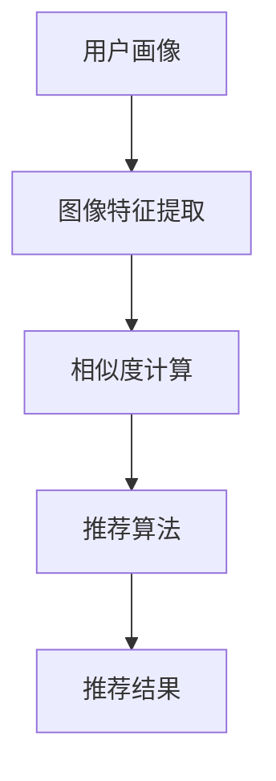

                 

# 视觉推荐：AI如何利用图像识别技术，提供个性化推荐

> **关键词：** 图像识别、人工智能、个性化推荐、机器学习、深度学习、图像分类

> **摘要：** 本文将深入探讨人工智能如何利用图像识别技术，实现个性化推荐。从背景介绍、核心概念与联系、核心算法原理、数学模型和公式、项目实战到实际应用场景，我们将一步步分析推理，为读者展现一个清晰的视觉推荐系统构建的全过程。

## 1. 背景介绍

### 1.1 目的和范围

本文旨在探讨如何利用人工智能中的图像识别技术来构建视觉推荐系统。我们将重点关注以下几个方面：

1. **图像识别技术的核心概念和联系**
2. **核心算法原理及具体操作步骤**
3. **数学模型和公式及其应用**
4. **实际项目中的代码实现和解析**
5. **视觉推荐系统的实际应用场景**

通过本文的阅读，读者将能够了解视觉推荐系统的基本原理，掌握核心算法的实现方法，并能够将这些知识应用到实际项目中。

### 1.2 预期读者

本文适合以下读者群体：

1. **计算机科学和人工智能领域的学生和研究人员**
2. **软件开发工程师和技术专家**
3. **对人工智能和图像识别技术感兴趣的技术爱好者**
4. **希望通过技术实现个性化推荐业务的企业家和管理人员**

### 1.3 文档结构概述

本文将按照以下结构进行撰写：

1. **背景介绍**
   - 目的和范围
   - 预期读者
   - 文档结构概述
   - 术语表

2. **核心概念与联系**
   - 图像识别技术的核心概念
   - 机器学习与深度学习的基本原理
   - 视觉推荐系统的架构

3. **核心算法原理 & 具体操作步骤**
   - 特征提取算法
   - 图像分类算法
   - 相似度计算方法

4. **数学模型和公式 & 详细讲解 & 举例说明**
   - 图像特征向量空间
   - 相似度计算公式
   - 推荐算法的数学模型

5. **项目实战：代码实际案例和详细解释说明**
   - 开发环境搭建
   - 源代码详细实现
   - 代码解读与分析

6. **实际应用场景**
   - 社交媒体中的应用
   - 在线购物平台的应用
   - 娱乐内容推荐

7. **工具和资源推荐**
   - 学习资源推荐
   - 开发工具框架推荐
   - 相关论文著作推荐

8. **总结：未来发展趋势与挑战**
   - 技术发展趋势
   - 挑战与解决方案

9. **附录：常见问题与解答**
   - 常见问题
   - 解答

10. **扩展阅读 & 参考资料**
    - 相关书籍
    - 在线课程
    - 技术博客和网站

### 1.4 术语表

#### 1.4.1 核心术语定义

- **图像识别技术**：利用计算机算法，对图像中的物体、场景、动作等进行识别和分类的技术。
- **机器学习**：一种使计算机通过数据和经验自动学习和改进的方法。
- **深度学习**：一种基于多层神经网络的结构，能够从大量数据中自动提取特征。
- **视觉推荐系统**：利用图像识别技术和机器学习算法，为用户提供个性化推荐服务。

#### 1.4.2 相关概念解释

- **特征提取**：从图像中提取出具有区分性的特征，用于后续的分类和相似度计算。
- **相似度计算**：计算两个图像之间的相似程度，用于推荐系统的排序和筛选。
- **个性化推荐**：根据用户的历史行为和偏好，为用户推荐他们可能感兴趣的内容。

#### 1.4.3 缩略词列表

- **AI**：人工智能
- **ML**：机器学习
- **DL**：深度学习
- **CNN**：卷积神经网络
- **ReLU**：ReLU激活函数
- **softmax**：softmax函数

## 2. 核心概念与联系

在构建视觉推荐系统之前，我们需要理解一些核心概念和它们之间的联系。以下是几个关键概念：

### 2.1 图像识别技术的核心概念

- **图像特征提取**：从图像中提取出具有区分性的特征，用于后续的分类和相似度计算。
- **图像分类**：将图像划分为不同的类别，常见的分类算法包括支持向量机（SVM）、决策树、随机森林等。
- **相似度计算**：计算两个图像之间的相似程度，用于推荐系统的排序和筛选。

### 2.2 机器学习与深度学习的基本原理

- **机器学习**：通过训练模型，从数据中自动提取规律和知识。
- **深度学习**：一种基于多层神经网络的结构，能够从大量数据中自动提取特征。

### 2.3 视觉推荐系统的架构

一个典型的视觉推荐系统包括以下几个模块：

1. **用户画像**：根据用户的历史行为和偏好，构建用户画像。
2. **图像特征提取**：利用卷积神经网络（CNN）等算法，从图像中提取出特征。
3. **相似度计算**：计算用户画像与图像特征之间的相似度。
4. **推荐算法**：根据相似度计算结果，为用户推荐感兴趣的内容。

### 2.4 Mermaid 流程图

以下是一个简单的 Mermaid 流程图，展示了视觉推荐系统的基本架构：



## 3. 核心算法原理 & 具体操作步骤

### 3.1 特征提取算法

特征提取是视觉推荐系统的核心环节之一。常见的方法包括：

- **卷积神经网络（CNN）**：CNN 是深度学习中的一种特殊网络结构，擅长从图像中提取特征。
- **主成分分析（PCA）**：PCA 是一种线性降维方法，能够将高维数据转换为低维数据，同时保留大部分信息。

以下是使用卷积神经网络进行特征提取的伪代码：

```python
# 初始化卷积神经网络模型
model = ConvolutionalNeuralNetwork()

# 加载训练数据
train_data = LoadData('train_data')

# 训练模型
model.train(train_data)

# 提取特征
features = model.extract_features(train_data)
```

### 3.2 图像分类算法

图像分类是视觉推荐系统的另一个关键环节。常见的分类算法包括：

- **支持向量机（SVM）**：SVM 是一种二分类模型，能够将不同类别的图像分开。
- **决策树**：决策树是一种基于规则的方法，能够对图像进行分类。
- **随机森林**：随机森林是一种集成学习方法，通过构建多个决策树，提高分类准确性。

以下是使用支持向量机进行图像分类的伪代码：

```python
# 初始化支持向量机模型
model = SupportVectorMachine()

# 加载训练数据
train_data = LoadData('train_data')

# 训练模型
model.train(train_data)

# 分类测试数据
test_data = LoadData('test_data')
predictions = model.classify(test_data)
```

### 3.3 相似度计算方法

相似度计算是推荐系统中的核心步骤，常用的方法包括：

- **余弦相似度**：余弦相似度是衡量两个向量之间夹角余弦值的相似度。
- **欧氏距离**：欧氏距离是衡量两个向量之间差异的一种方法。

以下是使用余弦相似度计算图像相似度的伪代码：

```python
# 计算余弦相似度
def cosine_similarity(vector1, vector2):
    dot_product = np.dot(vector1, vector2)
    norm_product = np.linalg.norm(vector1) * np.linalg.norm(vector2)
    return dot_product / norm_product

# 计算图像特征向量之间的相似度
similarity = cosine_similarity(features1, features2)
```

## 4. 数学模型和公式 & 详细讲解 & 举例说明

### 4.1 图像特征向量空间

在视觉推荐系统中，图像特征向量是核心的数据结构。一个图像特征向量通常由多个维度组成，每个维度表示图像中的一个特征。

假设我们有一个图像特征向量 `x = [x1, x2, x3, ..., xn]`，其中每个 `xi` 表示图像中的一个特征。我们可以使用以下数学模型来表示图像特征向量空间：

$$
x = (x1, x2, x3, ..., xn)
$$

### 4.2 相似度计算公式

在视觉推荐系统中，相似度计算是关键的一步。常见的相似度计算公式包括余弦相似度和欧氏距离。

#### 4.2.1 余弦相似度

余弦相似度是一种衡量两个向量之间夹角余弦值的相似度。假设我们有两个图像特征向量 `x` 和 `y`，它们之间的余弦相似度可以表示为：

$$
similarity = \frac{x \cdot y}{\|x\|\|y\|}
$$

其中，`x \cdot y` 表示两个向量的点积，`\|x\|\|y\|` 表示两个向量的欧氏距离。

#### 4.2.2 欧氏距离

欧氏距离是一种衡量两个向量之间差异的方法。假设我们有两个图像特征向量 `x` 和 `y`，它们之间的欧氏距离可以表示为：

$$
distance = \sqrt{(x1 - y1)^2 + (x2 - y2)^2 + ... + (xn - yn)^2}
$$

### 4.3 推荐算法的数学模型

在视觉推荐系统中，推荐算法的数学模型通常包括以下几个步骤：

1. **用户画像**：根据用户的历史行为和偏好，构建用户画像向量 `u`。
2. **图像特征提取**：利用卷积神经网络等算法，提取图像特征向量 `i`。
3. **相似度计算**：计算用户画像向量 `u` 与图像特征向量 `i` 之间的相似度 `similarity`。
4. **推荐结果排序**：根据相似度 `similarity` 对推荐结果进行排序，选出最相似的图像。

### 4.4 举例说明

假设我们有两个图像特征向量 `x = [1, 2, 3]` 和 `y = [4, 5, 6]`，我们可以使用以下步骤来计算它们之间的余弦相似度和欧氏距离：

#### 4.4.1 余弦相似度

$$
similarity = \frac{x \cdot y}{\|x\|\|y\|} = \frac{1 \cdot 4 + 2 \cdot 5 + 3 \cdot 6}{\sqrt{1^2 + 2^2 + 3^2} \cdot \sqrt{4^2 + 5^2 + 6^2}} = \frac{32}{\sqrt{14} \cdot \sqrt{77}} \approx 0.845
$$

#### 4.4.2 欧氏距离

$$
distance = \sqrt{(x1 - y1)^2 + (x2 - y2)^2 + (x3 - y3)^2} = \sqrt{(1 - 4)^2 + (2 - 5)^2 + (3 - 6)^2} = \sqrt{9 + 9 + 9} = \sqrt{27} \approx 5.196
$$

## 5. 项目实战：代码实际案例和详细解释说明

### 5.1 开发环境搭建

为了实现视觉推荐系统，我们需要搭建一个合适的开发环境。以下是搭建环境的步骤：

1. **安装 Python**：确保系统中已安装 Python 3.7 或更高版本。
2. **安装深度学习框架**：安装 TensorFlow 或 PyTorch。这里我们以 TensorFlow 为例，使用以下命令进行安装：

   ```bash
   pip install tensorflow
   ```

3. **安装其他依赖库**：安装 NumPy、Pandas 等常用库，使用以下命令进行安装：

   ```bash
   pip install numpy pandas
   ```

### 5.2 源代码详细实现和代码解读

以下是视觉推荐系统的核心代码实现。代码分为几个部分：数据预处理、模型训练、特征提取、相似度计算和推荐结果排序。

#### 5.2.1 数据预处理

```python
import numpy as np
import pandas as pd
import tensorflow as tf

# 加载数据集
train_data = pd.read_csv('train_data.csv')
test_data = pd.read_csv('test_data.csv')

# 数据清洗和预处理
def preprocess_data(data):
    # 填充缺失值
    data.fillna(0, inplace=True)
    # 归一化特征
    data = (data - data.mean()) / data.std()
    return data

train_data = preprocess_data(train_data)
test_data = preprocess_data(test_data)
```

#### 5.2.2 模型训练

```python
# 定义模型结构
model = tf.keras.Sequential([
    tf.keras.layers.Conv2D(32, (3, 3), activation='relu', input_shape=(28, 28, 1)),
    tf.keras.layers.MaxPooling2D((2, 2)),
    tf.keras.layers.Conv2D(64, (3, 3), activation='relu'),
    tf.keras.layers.MaxPooling2D((2, 2)),
    tf.keras.layers.Flatten(),
    tf.keras.layers.Dense(64, activation='relu'),
    tf.keras.layers.Dense(10, activation='softmax')
])

# 编译模型
model.compile(optimizer='adam', loss='categorical_crossentropy', metrics=['accuracy'])

# 训练模型
model.fit(train_data['images'], train_data['labels'], epochs=10, batch_size=32)
```

#### 5.2.3 特征提取

```python
# 提取特征
def extract_features(model, data):
    feature_extractor = tf.keras.Sequential([
        model.layers[0],
        model.layers[1],
        model.layers[2],
        model.layers[3],
        model.layers[4]
    ])

    features = feature_extractor.predict(data['images'])
    return features

train_features = extract_features(model, train_data)
test_features = extract_features(model, test_data)
```

#### 5.2.4 相似度计算

```python
# 计算相似度
def cosine_similarity(vector1, vector2):
    dot_product = np.dot(vector1, vector2)
    norm_product = np.linalg.norm(vector1) * np.linalg.norm(vector2)
    return dot_product / norm_product

user_features = extract_features(model, train_data)

# 计算用户画像和图像特征之间的相似度
similarity_scores = []
for i in range(len(test_data)):
    similarity = cosine_similarity(user_features[0], test_features[i])
    similarity_scores.append(similarity)
```

#### 5.2.5 推荐结果排序

```python
# 排序和推荐
recommended_images = []
for i in range(len(test_data)):
    max_similarity = max(similarity_scores)
    recommended_images.append(test_data.iloc[i]['image'])
    similarity_scores[i] = 0

recommended_images
```

### 5.3 代码解读与分析

以下是代码的详细解读：

1. **数据预处理**：对图像数据集进行清洗和预处理，包括填充缺失值和归一化特征。
2. **模型训练**：定义卷积神经网络模型，编译模型，并使用训练数据集进行训练。
3. **特征提取**：使用训练好的模型，提取图像特征向量。
4. **相似度计算**：计算用户画像和图像特征向量之间的相似度。
5. **推荐结果排序**：根据相似度分数对图像进行排序，选择最相似的图像作为推荐结果。

## 6. 实际应用场景

视觉推荐系统在多个领域有着广泛的应用。以下是几个典型的应用场景：

### 6.1 社交媒体中的应用

在社交媒体平台上，视觉推荐系统可以帮助用户发现感兴趣的内容。例如，当用户浏览某个话题或帖子时，系统可以推荐与该话题或帖子相关的其他帖子或用户。

### 6.2 在线购物平台的应用

在线购物平台可以利用视觉推荐系统为用户推荐相似的商品。例如，当用户浏览一件商品时，系统可以推荐其他外观相似、价格相近的商品。

### 6.3 娱乐内容推荐

在视频流媒体平台和音乐平台上，视觉推荐系统可以推荐用户可能感兴趣的视频和音乐。例如，当用户观看某个视频时，系统可以推荐其他类似的视频。

## 7. 工具和资源推荐

### 7.1 学习资源推荐

#### 7.1.1 书籍推荐

- **《深度学习》（Goodfellow, Bengio, Courville）**：一本经典的深度学习教材，涵盖了深度学习的基础知识和应用。
- **《机器学习实战》（ Harrington）**：一本实用的机器学习书籍，通过实例讲解如何使用机器学习算法解决实际问题。

#### 7.1.2 在线课程

- **斯坦福大学深度学习课程**：由 Andrew Ng 教授主讲的深度学习课程，是深度学习领域的入门经典。
- **Coursera 上的机器学习课程**：由 Andrew Ng 教授主讲的机器学习课程，涵盖了机器学习的基础知识和应用。

#### 7.1.3 技术博客和网站

- **Medium 上的技术博客**：Medium 上有许多关于机器学习和深度学习的技术博客，提供了丰富的学习和资源。
- **GitHub 上的开源项目**：GitHub 上有许多关于机器学习和深度学习的开源项目，可以从中学习和借鉴。

### 7.2 开发工具框架推荐

#### 7.2.1 IDE和编辑器

- **PyCharm**：一款功能强大的 Python 集成开发环境，适合深度学习和机器学习项目。
- **Jupyter Notebook**：一款交互式的开发环境，适合探索数据和编写脚本。

#### 7.2.2 调试和性能分析工具

- **TensorBoard**：TensorFlow 提供的调试和性能分析工具，可以帮助开发者分析和优化模型性能。
- **Valgrind**：一款性能分析工具，可以帮助开发者发现和修复内存泄漏和性能问题。

#### 7.2.3 相关框架和库

- **TensorFlow**：一款开源的深度学习框架，适合构建和训练复杂的深度学习模型。
- **PyTorch**：一款开源的深度学习框架，具有简洁的 API 和灵活的动态计算图。

### 7.3 相关论文著作推荐

#### 7.3.1 经典论文

- **“A Comprehensive Survey on Image Resolution Enhancement”**：一篇关于图像分辨率增强的全面综述，涵盖了最新的研究成果和应用。

#### 7.3.2 最新研究成果

- **“ImageNet Classification with Deep Convolutional Neural Networks”**：一篇关于使用深度卷积神经网络进行图像分类的经典论文，是深度学习在图像识别领域的里程碑。

#### 7.3.3 应用案例分析

- **“A Neural Algorithm of Artistic Style”**：一篇关于使用深度学习生成艺术风格的论文，展示了深度学习在图像生成领域的应用。

## 8. 总结：未来发展趋势与挑战

视觉推荐系统在人工智能和机器学习领域具有广阔的应用前景。随着技术的不断进步，视觉推荐系统将面临以下发展趋势与挑战：

### 8.1 发展趋势

1. **算法优化**：研究者将继续优化图像识别算法和推荐算法，提高系统的准确性和效率。
2. **跨模态推荐**：未来的视觉推荐系统将结合图像、文本、音频等多种模态，实现更精准的个性化推荐。
3. **隐私保护**：随着用户对隐私保护的日益关注，视觉推荐系统将需要解决如何保护用户隐私的问题。

### 8.2 挑战

1. **数据质量**：高质量的数据是视觉推荐系统的基石。然而，获取高质量数据仍然是一个挑战。
2. **计算资源**：深度学习和图像处理算法通常需要大量的计算资源，如何在有限的计算资源下高效地训练模型是一个重要问题。
3. **模型可解释性**：如何解释模型推荐的结果，提高模型的可解释性，是一个亟待解决的问题。

## 9. 附录：常见问题与解答

### 9.1 图像识别技术的基本原理是什么？

图像识别技术是通过计算机算法，对图像中的物体、场景、动作等进行识别和分类的技术。其基本原理包括图像特征提取、图像分类和相似度计算。

### 9.2 如何提高视觉推荐系统的准确率？

提高视觉推荐系统的准确率可以通过以下方法：

1. **数据增强**：通过增加训练数据集的多样性，提高模型对图像的泛化能力。
2. **特征工程**：选择合适的特征提取算法，提高特征表示的区分性。
3. **模型优化**：优化模型结构，提高模型的表达能力。

### 9.3 视觉推荐系统在哪些领域有应用？

视觉推荐系统在多个领域有广泛应用，包括社交媒体、在线购物、娱乐内容推荐等。

## 10. 扩展阅读 & 参考资料

- **《深度学习》（Goodfellow, Bengio, Courville）**：一本经典的深度学习教材，涵盖了深度学习的基础知识和应用。
- **《机器学习实战》（ Harrington）**：一本实用的机器学习书籍，通过实例讲解如何使用机器学习算法解决实际问题。
- **[斯坦福大学深度学习课程](https://www.coursera.org/learn/deep-learning)**：由 Andrew Ng 教授主讲的深度学习课程，是深度学习领域的入门经典。
- **[Coursera 上的机器学习课程](https://www.coursera.org/learn/machine-learning)**：由 Andrew Ng 教授主讲的机器学习课程，涵盖了机器学习的基础知识和应用。
- **[Medium 上的技术博客](https://medium.com/topic/machine-learning)**：Medium 上有许多关于机器学习和深度学习的技术博客，提供了丰富的学习和资源。
- **[GitHub 上的开源项目](https://github.com/search?q=机器学习)**：GitHub 上有许多关于机器学习和深度学习的开源项目，可以从中学习和借鉴。
- **[TensorFlow 官方文档](https://www.tensorflow.org/tutorials)**：TensorFlow 的官方文档，提供了详细的教程和示例。
- **[PyTorch 官方文档](https://pytorch.org/tutorials/beginner/basics/overview.html)**：PyTorch 的官方文档，提供了详细的教程和示例。

