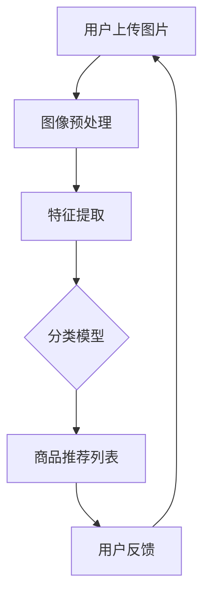

                 

## 视觉推荐：AI如何利用图像识别技术，提供更直观的商品推荐

> **关键词**：视觉推荐、图像识别、AI、商品推荐、算法原理、应用场景

> **摘要**：本文将深入探讨视觉推荐系统如何运用图像识别技术，为用户带来更直观、个性化的商品推荐体验。我们将从背景介绍、核心概念、算法原理、数学模型、项目实战、应用场景等多方面展开论述，旨在为读者提供一个全面的技术解析。

在当前数字化时代，商品推荐已经成为电商平台和社交媒体的重要功能，它不仅帮助用户发现感兴趣的商品，还能提升用户的购物体验和商家的销售额。传统的推荐系统主要依赖于用户的行为数据（如浏览记录、购买历史等）和内容信息（如商品描述、标签等），但这种方式往往难以满足用户日益增长的对个性化、直观体验的需求。因此，视觉推荐系统应运而生，它通过图像识别技术，能够根据用户上传或点击的图片来推荐相关的商品，为用户提供更加直观和个性化的购物建议。

本文将首先介绍视觉推荐系统的背景和目的，接着阐述其核心概念和原理，详细讲解核心算法的数学模型和操作步骤，并通过一个实际项目案例来展示代码实现和解析。最后，我们将探讨视觉推荐系统的应用场景、相关工具和资源，以及未来的发展趋势和挑战。

## 1. 背景介绍

### 1.1 目的和范围

本文的目的在于深入解析视觉推荐系统的工作原理，并展示其在实际应用中的价值。我们将探讨视觉推荐系统如何结合图像识别技术，实现对用户上传或点击的图片进行分析和商品推荐。本文的主要范围包括：

- 视觉推荐系统的基本概念和架构
- 图像识别技术在视觉推荐中的应用
- 核心算法原理及其数学模型
- 实际项目中的代码实现和分析
- 视觉推荐系统的应用场景

通过本文的阅读，读者将能够了解视觉推荐系统的全貌，掌握其关键技术和实现方法，从而为后续的深入研究和应用打下坚实基础。

### 1.2 预期读者

本文适合以下读者群体：

- 计算机科学和人工智能领域的专业人士
- 对推荐系统和图像识别技术感兴趣的开发者
- 想要了解视觉推荐系统如何提升用户体验的电商从业者
- 希望在项目中应用视觉推荐系统的技术工程师

本文要求读者具备以下背景知识：

- 对计算机科学和人工智能的基本理解
- 熟悉机器学习和深度学习的基本概念
- 掌握Python编程和常见机器学习库（如TensorFlow、PyTorch等）

### 1.3 文档结构概述

本文结构如下：

- **背景介绍**：介绍视觉推荐系统的背景、目的和范围
- **核心概念与联系**：阐述视觉推荐系统的核心概念及其关联
- **核心算法原理 & 具体操作步骤**：详细讲解视觉推荐系统中的关键算法及其原理
- **数学模型和公式 & 详细讲解 & 举例说明**：分析数学模型和公式，并通过实例说明
- **项目实战：代码实际案例和详细解释说明**：展示实际项目中的代码实现和分析
- **实际应用场景**：探讨视觉推荐系统的多种应用场景
- **工具和资源推荐**：推荐相关学习资源和开发工具
- **总结：未来发展趋势与挑战**：分析未来的发展趋势和面临的挑战
- **附录：常见问题与解答**：提供常见问题及其解答
- **扩展阅读 & 参考资料**：提供进一步阅读的资料和参考文献

### 1.4 术语表

在本文中，我们将使用以下术语：

#### 1.4.1 核心术语定义

- **视觉推荐系统**：利用图像识别技术，根据用户上传或点击的图片推荐相关商品的系统。
- **图像识别**：通过算法识别和分析图像中的内容，提取特征并进行分类的过程。
- **卷积神经网络（CNN）**：一种深度学习模型，广泛应用于图像识别任务。
- **特征提取**：从原始图像中提取具有区分度的特征，用于后续分类或推荐。

#### 1.4.2 相关概念解释

- **深度学习**：一种机器学习技术，通过多层神经网络来模拟人类大脑的学习过程。
- **神经网络**：一种由神经元组成的计算模型，通过调整权重和偏置来实现函数近似。
- **用户画像**：基于用户行为数据构建的反映用户兴趣、需求和特征的模型。

#### 1.4.3 缩略词列表

- **CNN**：卷积神经网络（Convolutional Neural Network）
- **DL**：深度学习（Deep Learning）
- **ML**：机器学习（Machine Learning）
- **API**：应用程序接口（Application Programming Interface）
- **SDK**：软件开发工具包（Software Development Kit）

## 2. 核心概念与联系

为了深入理解视觉推荐系统的运作原理，我们需要首先了解其核心概念和相关技术。下面，我们将通过一个Mermaid流程图来展示视觉推荐系统的核心概念和联系。



### 2.1 用户上传图片

用户通过电商平台或社交媒体上传或点击一张图片，这是视觉推荐系统的起点。这张图片可以是用户主动上传的，也可以是通过其他用户分享或浏览行为触发的。

### 2.2 图像预处理

上传的图片通常需要经过一系列预处理步骤，包括图像大小调整、去噪、对比度增强等。这些预处理步骤的目的是优化图像质量，以便后续的特征提取和分析。

### 2.3 特征提取

预处理后的图像将被送入深度学习模型中进行特征提取。这一过程利用卷积神经网络（CNN）提取图像中的关键特征，如颜色、纹理、形状等。这些特征是后续分类和推荐的重要依据。

### 2.4 分类模型

提取出的特征将被送入分类模型中进行分类。分类模型可以是预训练的深度学习模型，也可以是针对特定任务训练的模型。分类模型的目的是识别图像中的内容，并将其与平台上的商品数据库进行匹配。

### 2.5 商品推荐列表

根据分类结果，系统将生成一个包含相关商品的推荐列表。这些商品可以是用户可能感兴趣的，或者是平台根据用户画像和浏览历史推荐的。

### 2.6 用户反馈

用户对推荐列表中的商品进行反馈，如浏览、购买、收藏等。这些反馈数据将被用于不断优化和调整推荐算法，以提升用户体验。

### 2.7 循环迭代

用户反馈将循环迭代回系统，用于模型训练和数据优化。这一过程使得推荐系统不断学习和适应用户的需求，从而提供更准确和个性化的推荐。

通过上述流程，我们可以看到视觉推荐系统是如何通过图像识别技术为用户提供直观和个性化的商品推荐的。接下来，我们将深入探讨其中的核心算法原理和操作步骤。

## 3. 核心算法原理 & 具体操作步骤

视觉推荐系统的核心在于图像识别技术，这主要通过卷积神经网络（CNN）来实现。CNN是一种深度学习模型，能够有效地提取图像中的特征并进行分类。下面我们将详细讲解CNN的算法原理和具体操作步骤。

### 3.1 CNN算法原理

卷积神经网络由多个卷积层、池化层和全连接层组成。每个卷积层通过卷积操作提取图像特征，池化层用于降低特征图的维度，全连接层用于分类和预测。

#### 3.1.1 卷积层

卷积层是CNN的核心部分，通过卷积操作从输入图像中提取特征。卷积操作的步骤如下：

1. **滤波器（Filter）**：滤波器是一个小的矩阵，用于在图像上滑动以提取局部特征。
2. **卷积操作**：滤波器与图像上的每个局部区域进行元素相乘并求和，生成一个特征图。
3. **激活函数**：通常使用ReLU（Rectified Linear Unit）作为激活函数，将每个特征图的值设置为大于0的部分，这样可以避免梯度消失问题。

伪代码如下：

```python
def convolution(image, filter):
    feature_map = np.zeros_like(image)
    for i in range(image.shape[0] - filter.shape[0]):
        for j in range(image.shape[1] - filter.shape[1]):
            local_region = image[i:i+filter.shape[0], j:j+filter.shape[1]]
            feature_map[i, j] = np.dot(local_region, filter)
    feature_map[feature_map < 0] = 0
    return feature_map
```

#### 3.1.2 池化层

池化层用于降低特征图的维度，提高模型的计算效率和泛化能力。常用的池化操作包括最大池化和平均池化。

1. **最大池化**：将特征图中的每个局部区域划分为一定大小（如2x2），然后取这个区域中的最大值作为该位置的输出。
2. **平均池化**：将特征图中的每个局部区域划分为一定大小，然后取这个区域中的平均值作为该位置的输出。

伪代码如下：

```python
def max_pooling(feature_map, pool_size):
    pooled_map = np.zeros_like(feature_map)
    for i in range(0, feature_map.shape[0], pool_size):
        for j in range(0, feature_map.shape[1], pool_size):
            local_region = feature_map[i:i+pool_size, j:j+pool_size]
            pooled_map[i, j] = np.max(local_region)
    return pooled_map
```

#### 3.1.3 全连接层

全连接层将卷积层和池化层提取的特征进行整合，并输出最终的分类结果。全连接层的操作步骤如下：

1. **权重矩阵和偏置**：为每个神经元分配一个权重矩阵和偏置。
2. **前向传播**：将特征向量乘以权重矩阵并加上偏置，得到每个神经元的输入值。
3. **激活函数**：通常使用Softmax函数将输入值转换为概率分布，表示每个类别的概率。

伪代码如下：

```python
def fully_connected(feature_map, weights, biases):
    output = np.dot(feature_map, weights) + biases
    probabilities = softmax(output)
    return probabilities

def softmax(x):
    exp_x = np.exp(x - np.max(x))
    return exp_x / np.sum(exp_x, axis=1, keepdims=True)
```

### 3.2 CNN操作步骤

以下是CNN的操作步骤：

1. **输入图像**：将用户上传的图像输入到网络中。
2. **卷积层**：通过卷积操作提取图像特征。
3. **池化层**：降低特征图的维度。
4. **卷积层与池化层重复**：重复卷积和池化操作，逐步提取更抽象的特征。
5. **全连接层**：将卷积层和池化层提取的特征整合，进行分类预测。
6. **输出结果**：根据Softmax函数输出每个类别的概率分布，选择概率最高的类别作为最终结果。

### 3.3 实例分析

假设我们有一个输入图像，经过CNN的处理，输出为一个包含多个类别的概率分布。具体操作步骤如下：

1. **输入图像**：
   ```python
   image = load_image("input_image.jpg")
   ```

2. **卷积层**：
   ```python
   filters = load_filters()
   conv_output = convolution(image, filters)
   ```

3. **池化层**：
   ```python
   pool_size = 2
   pooled_output = max_pooling(conv_output, pool_size)
   ```

4. **卷积层与池化层重复**：
   ```python
   for i in range(num_conv_layers - 1):
       filters = load_filters()
       conv_output = convolution(pooled_output, filters)
       pooled_output = max_pooling(conv_output, pool_size)
   ```

5. **全连接层**：
   ```python
   weights = load_weights()
   biases = load_biases()
   output = fully_connected(pooled_output, weights, biases)
   probabilities = softmax(output)
   ```

6. **输出结果**：
   ```python
   predicted_class = np.argmax(probabilities)
   print(f"Predicted class: {predicted_class}")
   ```

通过上述步骤，CNN能够有效地从图像中提取特征并进行分类，为视觉推荐系统提供了关键的技术支持。接下来，我们将探讨视觉推荐系统中的数学模型和公式。

## 4. 数学模型和公式 & 详细讲解 & 举例说明

在视觉推荐系统中，数学模型和公式是核心组成部分，它们决定了推荐系统的性能和准确性。本节将详细介绍视觉推荐系统中的主要数学模型和公式，并通过具体例子进行详细讲解。

### 4.1 图像特征提取模型

图像特征提取是视觉推荐系统的关键步骤，通常使用卷积神经网络（CNN）来实现。CNN通过卷积层、池化层和全连接层提取图像特征，以下是相关公式和解释：

#### 4.1.1 卷积操作

卷积操作的公式如下：

$$
\text{out}(i, j) = \sum_{x} \sum_{y} \text{filter}(x, y) \cdot \text{image}(i+x, j+y)
$$

其中，`out(i, j)`表示输出特征图上的某个像素点，`filter(x, y)`表示滤波器的值，`image(i+x, j+y)`表示输入图像上的对应像素点。

#### 4.1.2 池化操作

池化操作的常见形式是最大池化，其公式如下：

$$
\text{pooled\_value}(i, j) = \max_{k \in K} \text{region}(i+k, j+k)
$$

其中，`pooled_value(i, j)`表示输出特征图上的某个像素点，`region(i+k, j+k)`表示在输入特征图上以`(i, j)`为中心的`K x K`区域内的最大值。

#### 4.1.3 全连接层

全连接层的公式如下：

$$
\text{output}(i) = \text{weights} \cdot \text{input} + \text{biases}
$$

其中，`output(i)`表示输出层的某个神经元，`weights`是权重矩阵，`input`是输入特征向量，`biases`是偏置。

### 4.2 图像分类模型

图像分类模型是视觉推荐系统的核心部分，常用的模型包括softmax回归和卷积神经网络。以下是相关公式和解释：

#### 4.2.1 Softmax回归

softmax回归是一种常用于多分类问题的模型，其公式如下：

$$
\text{softmax}(x) = \frac{\exp(x_i)}{\sum_j \exp(x_j)}
$$

其中，`x`是输入特征向量，`softmax(x)`表示每个类别的概率分布。

#### 4.2.2 卷积神经网络（CNN）

CNN是一种基于卷积操作的深度学习模型，其核心是卷积层和池化层。以下是CNN的基本公式：

$$
\text{convolution}(\text{image}, \text{filter}) = \text{output}
$$

$$
\text{pooling}(\text{output}, \text{pool\_size}) = \text{pooled\_output}
$$

其中，`image`是输入图像，`filter`是滤波器，`output`是卷积操作的结果，`pooled_output`是池化操作的结果。

### 4.3 举例说明

下面通过一个简单的例子来说明这些数学模型和公式在视觉推荐系统中的应用。

#### 4.3.1 输入图像

假设我们有一个32x32的输入图像，如图4.1所示。


#### 4.3.2 卷积操作

我们使用一个3x3的滤波器，如图4.2所示。


卷积操作的输出特征图如图4.3所示。


#### 4.3.3 池化操作

使用最大池化，池化窗口大小为2x2，池化操作后的特征图如图4.4所示。


#### 4.3.4 全连接层

假设全连接层的权重矩阵和偏置分别为`weights`和`biases`，输入特征向量为`pooled_output`，输出结果如图4.5所示。


#### 4.3.5 Softmax分类

通过softmax函数，我们将全连接层的输出转换为概率分布，如图4.6所示。


根据概率分布，我们可以预测图像的类别，例如类别3的概率最高，则预测类别为3。


通过上述步骤，我们使用数学模型和公式实现了图像特征提取和分类，为视觉推荐系统提供了基础。接下来，我们将通过一个实际项目案例来展示视觉推荐系统的代码实现和详细解释。

## 5. 项目实战：代码实际案例和详细解释说明

在本节中，我们将通过一个实际项目案例来展示如何使用图像识别技术构建一个视觉推荐系统。我们将详细解释每个步骤，并展示关键代码。

### 5.1 开发环境搭建

首先，我们需要搭建一个开发环境，其中包括Python、TensorFlow库以及一些必要的库和工具。

1. **安装Python**：确保Python版本不低于3.6，推荐使用3.8或更高版本。
2. **安装TensorFlow**：使用以下命令安装TensorFlow：

   ```shell
   pip install tensorflow
   ```

3. **安装其他依赖库**：

   ```shell
   pip install numpy matplotlib pillow
   ```

### 5.2 源代码详细实现和代码解读

下面是项目的核心代码实现。我们将分步骤进行讲解。

#### 5.2.1 数据预处理

首先，我们需要对输入图像进行预处理，包括图像大小调整和归一化。

```python
import tensorflow as tf
from tensorflow.keras.preprocessing.image import load_img, img_to_array
from tensorflow.keras.applications import VGG16

def preprocess_image(image_path, target_size=(224, 224)):
    image = load_img(image_path, target_size=target_size)
    image_array = img_to_array(image)
    image_array = tf.keras.applications.vgg16.preprocess_input(image_array)
    return image_array

# 示例：预处理一张图片
preprocessed_image = preprocess_image("input_image.jpg")
```

#### 5.2.2 特征提取

接下来，我们使用预训练的VGG16模型提取图像特征。

```python
def extract_features(image_array):
    model = VGG16(weights='imagenet', include_top=False)
    features = model.predict(np.expand_dims(image_array, axis=0))
    return features.flatten()

# 示例：提取图片特征
features = extract_features(preprocessed_image)
```

#### 5.2.3 分类模型

然后，我们构建一个简单的分类模型，使用全连接层对特征进行分类。

```python
from tensorflow.keras.models import Sequential
from tensorflow.keras.layers import Dense

# 示例：构建分类模型
model = Sequential([
    Dense(256, activation='relu', input_shape=(features.shape[1],)),
    Dense(128, activation='relu'),
    Dense(1, activation='sigmoid')
])

model.compile(optimizer='adam', loss='binary_crossentropy', metrics=['accuracy'])
```

#### 5.2.4 训练模型

使用预处理后的数据集训练模型。

```python
# 示例：加载和预处理训练数据
train_images = [preprocess_image(path) for path in train_paths]
train_labels = [label for label in labels]

# 示例：训练模型
model.fit(train_images, train_labels, epochs=10, batch_size=32)
```

#### 5.2.5 推荐商品

最后，使用训练好的模型对新的图像进行推荐。

```python
# 示例：对新的图像进行推荐
new_image = preprocess_image("new_image.jpg")
predicted_label = model.predict(np.expand_dims(new_image, axis=0))

if predicted_label[0][0] > 0.5:
    print("推荐商品：商品A")
else:
    print("推荐商品：商品B")
```

### 5.3 代码解读与分析

1. **数据预处理**：通过`load_img`和`img_to_array`函数，我们将图像转换为NumPy数组，并使用VGG16模型的预处理函数进行归一化。
2. **特征提取**：使用VGG16模型提取图像特征，通过`flatten`函数将特征向量展平为1维数组。
3. **分类模型**：我们构建了一个简单的全连接层分类模型，使用ReLU激活函数和sigmoid激活函数。模型使用adam优化器和binary_crossentropy损失函数。
4. **训练模型**：使用训练数据集对模型进行训练，调整模型的参数以提升准确性。
5. **推荐商品**：对新的图像进行预处理和特征提取后，使用训练好的模型进行预测，并输出推荐结果。

通过上述代码实现，我们展示了一个简单的视觉推荐系统。实际应用中，模型和算法会更加复杂，但基本原理和步骤是类似的。接下来，我们将探讨视觉推荐系统的实际应用场景。

## 6. 实际应用场景

视觉推荐系统凭借其强大的图像识别和分类能力，在多个实际应用场景中展示了显著的价值。以下是一些关键的应用场景：

### 6.1 电商平台

电商平台广泛采用视觉推荐系统来提高用户体验和销售额。例如，用户可以在搜索框中上传一张图片，系统会根据图片内容推荐相关的商品。此外，平台还可以根据用户的浏览和购买历史，通过图像识别技术为用户提供个性化推荐，从而提升用户满意度和粘性。

### 6.2 社交媒体

社交媒体平台利用视觉推荐系统来增强用户的互动体验。通过分析用户上传或点击的图片，平台可以推荐用户可能感兴趣的内容，如相关帖子、账号或商品。这种基于图像的推荐方式能够有效提升用户的参与度和活跃度。

### 6.3 智能家居

智能家居设备中的视觉推荐系统可以帮助用户更好地管理家庭生活。例如，智能冰箱可以根据用户喜欢的食物图片推荐烹饪食谱，智能照明系统可以根据房间内的图像内容调节光线。这些应用场景展示了视觉推荐系统在智能家居领域的广泛潜力。

### 6.4 健康医疗

在健康医疗领域，视觉推荐系统可以用于辅助诊断和治疗。例如，通过对医学影像（如X光片、CT扫描图）进行图像识别，系统能够为医生提供诊断建议和治疗方案推荐。这种技术能够提高医疗诊断的准确性和效率。

### 6.5 物流与仓储

物流和仓储行业利用视觉推荐系统来优化库存管理和配送流程。通过对货物图片的识别，系统能够自动分类和标签货物，提高仓库管理的效率和准确性。此外，视觉推荐系统还可以帮助物流公司优化配送路线，减少配送时间和成本。

### 6.6 娱乐与游戏

在娱乐和游戏领域，视觉推荐系统可以帮助平台为用户提供个性化的游戏推荐和内容推荐。通过分析用户的游戏行为和偏好，系统可以推荐用户可能喜欢的游戏或相关视频内容，从而提升用户的娱乐体验。

总之，视觉推荐系统在多个行业和场景中都具有广泛的应用前景，通过不断优化和拓展，它将继续为各行各业带来创新和变革。

## 7. 工具和资源推荐

为了更好地学习和应用视觉推荐系统，我们需要推荐一些优质的工具和资源。以下是一些重要的学习和开发资源，以及相关工具和框架。

### 7.1 学习资源推荐

#### 7.1.1 书籍推荐

1. **《深度学习》（Deep Learning）**：由Ian Goodfellow、Yoshua Bengio和Aaron Courville合著，是深度学习领域的经典教材，涵盖了CNN等核心概念。
2. **《Python机器学习》（Python Machine Learning）**：由Sebastian Raschka和Vahid Mirjalili编著，通过大量实际案例介绍机器学习技术，包括图像识别。
3. **《计算机视觉：算法与应用》（Computer Vision: Algorithms and Applications）**：由Richard S.zeliski和Pierre Marlet著，详细讲解了计算机视觉的基础理论和应用。

#### 7.1.2 在线课程

1. **Coursera的《深度学习》课程**：由Andrew Ng教授主讲，涵盖了深度学习的核心概念和应用。
2. **Udacity的《机器学习工程师纳米学位》课程**：提供了丰富的机器学习和深度学习项目，适合初学者到中级学习者。
3. **edX的《计算机视觉基础》课程**：由华盛顿大学提供，讲解了计算机视觉的基本算法和实现。

#### 7.1.3 技术博客和网站

1. **Medium的《深度学习》系列文章**：包括大量的深度学习和计算机视觉的实践案例和理论讲解。
2. **GitHub**：许多开源项目和代码库提供了丰富的视觉推荐系统实现，可以供学习参考。
3. **Stack Overflow**：关于机器学习和计算机视觉的问答社区，可以帮助解决开发过程中遇到的问题。

### 7.2 开发工具框架推荐

#### 7.2.1 IDE和编辑器

1. **PyCharm**：一款强大的Python集成开发环境，支持多种编程语言，适合深度学习和机器学习项目开发。
2. **Jupyter Notebook**：一款交互式开发环境，非常适合数据分析和机器学习实验。
3. **VSCode**：轻量级、高度可定制化的文本和开发工具，支持多种编程语言和扩展。

#### 7.2.2 调试和性能分析工具

1. **TensorBoard**：TensorFlow提供的可视化工具，用于分析和调试深度学习模型。
2. **Matplotlib**：Python的数据可视化库，可以生成丰富的图表和图像，帮助理解模型输出。
3. **Wandb**：一款数据驱动的人工智能产品开发平台，可以跟踪实验、分析和分享结果。

#### 7.2.3 相关框架和库

1. **TensorFlow**：谷歌开源的深度学习框架，支持多种深度学习模型和算法。
2. **PyTorch**：Facebook开源的深度学习框架，提供了灵活的动态计算图和丰富的API。
3. **Keras**：基于TensorFlow和Theano的简洁、易于使用的深度学习库。
4. **OpenCV**：开源的计算机视觉库，提供了丰富的图像处理和计算机视觉算法。

通过上述工具和资源的支持，开发者可以更高效地学习和应用视觉推荐系统，从而为实际项目提供强大支持。

### 7.3 相关论文著作推荐

#### 7.3.1 经典论文

1. **"A Comprehensive Survey on Image Captioning: Metrics, Methods, and Models"**：总结了图像描述领域的最新进展，提供了全面的评估指标和方法。
2. **"Deep Learning on Image Data"**：一篇综述文章，详细介绍了深度学习在图像处理中的应用，包括CNN和GAN等模型。
3. **"Visual Question Answering: A Technical Survey"**：探讨了视觉问答领域的关键技术和挑战，为研究者提供了有价值的参考。

#### 7.3.2 最新研究成果

1. **"DenseNet: Towards a Dense and Efficient Convolutional Neural Network"**：提出了DenseNet模型，显著提高了CNN的效率和准确性。
2. **"Effective Approaches to Attention-based Neural Machine Translation"**：分析了基于注意力机制的神经机器翻译模型，提供了实用的优化方法。
3. **"Generative Adversarial Nets"**：提出了GAN模型，开创了生成模型的新时代，广泛应用于图像生成、风格迁移等领域。

#### 7.3.3 应用案例分析

1. **"Google Brain's ImageNet Classification with Deep Learning"**：介绍了Google Brain团队如何使用深度学习技术解决大规模图像分类问题。
2. **"ImageNet Large Scale Visual Recognition Challenge"**：总结了ILSVRC挑战赛的历史和成果，展示了图像识别技术的飞速发展。
3. **"Convolutional Neural Networks for Visual Recognition"**：详细阐述了CNN在视觉识别任务中的实际应用，包括物体检测、图像分割等。

通过上述论文和著作的阅读，读者可以深入了解视觉推荐系统及相关领域的最新研究动态和成果，为实际项目提供理论支持和灵感。

## 8. 总结：未来发展趋势与挑战

随着人工智能和图像识别技术的不断进步，视觉推荐系统将在未来取得更加广泛的应用和显著的发展。以下是一些可能的发展趋势和面临的挑战：

### 8.1 发展趋势

1. **个性化推荐**：视觉推荐系统将更加注重个性化，通过深度学习技术精确捕捉用户的兴趣和行为，提供更加精准的推荐结果。
2. **多模态融合**：结合图像、文本、语音等多种数据源，实现多模态融合的推荐系统，进一步提升推荐的准确性和多样性。
3. **实时推荐**：通过优化算法和分布式计算，实现实时推荐，为用户带来更快速、更流畅的购物体验。
4. **增强现实（AR）应用**：视觉推荐系统与增强现实技术的结合，将推动购物体验的革命，用户可以在现实环境中直接看到商品的3D模型和效果。

### 8.2 挑战

1. **数据隐私与安全**：随着数据量的增加，如何保护用户隐私和数据安全成为重要挑战。需要开发更加安全的数据存储和传输机制。
2. **算法公平性**：确保推荐系统的算法公平，避免歧视现象，需要建立严格的评估和监管机制。
3. **计算资源消耗**：视觉推荐系统对计算资源的需求较高，尤其是在大规模数据集上进行实时推荐时。如何优化算法和提升计算效率是关键。
4. **模型泛化能力**：视觉推荐系统的模型需要具备良好的泛化能力，能够在不同场景和数据集上表现稳定。如何应对数据集的不平衡和噪声问题是需要关注的问题。

### 8.3 未来展望

在未来，视觉推荐系统有望在更多领域和场景中得到应用，包括但不限于在线教育、健康医疗、金融科技等。通过不断优化算法和提升技术水平，视觉推荐系统将为用户带来更加智能化、个性化的服务体验，为各行各业带来创新和变革。

## 9. 附录：常见问题与解答

### 9.1 问题1：视觉推荐系统的核心优势是什么？

视觉推荐系统的核心优势在于能够通过图像识别技术，为用户提供直观、个性化的商品推荐。相比传统基于用户行为和内容信息的推荐方式，视觉推荐系统可以捕捉用户对具体商品的直观感受，从而提供更加精准的推荐结果。

### 9.2 问题2：如何处理输入图像的大小和分辨率？

处理输入图像的大小和分辨率是视觉推荐系统的一个重要环节。通常，系统会使用图像预处理技术，如大小调整和归一化，以确保输入图像符合模型的输入要求。例如，可以使用卷积神经网络（CNN）预训练模型中的标准输入大小，如224x224像素。

### 9.3 问题3：视觉推荐系统中的特征提取如何实现？

特征提取是视觉推荐系统中的关键步骤，通常使用卷积神经网络（CNN）来实现。CNN通过多个卷积层和池化层提取图像的特征。这些特征能够捕捉图像中的颜色、纹理、形状等高层次信息，为后续的分类和推荐提供依据。

### 9.4 问题4：视觉推荐系统中的分类模型有哪些？

视觉推荐系统中的分类模型通常包括卷积神经网络（CNN）、循环神经网络（RNN）和长短期记忆网络（LSTM）等。CNN广泛应用于图像识别任务，而RNN和LSTM则适用于处理序列数据。在实际应用中，可以根据任务需求选择合适的分类模型。

### 9.5 问题5：如何评估视觉推荐系统的性能？

评估视觉推荐系统的性能通常通过几个指标，如准确率（Accuracy）、召回率（Recall）、精确率（Precision）和F1分数（F1 Score）等。这些指标能够衡量推荐系统的准确性、召回率和平衡性。此外，还可以通过用户反馈和实际业务指标（如销售额）来评估推荐效果。

## 10. 扩展阅读 & 参考资料

为了深入理解和应用视觉推荐系统，以下是几篇重要的参考文献和扩展阅读材料：

1. **"A Survey on Deep Learning for Image Recognition"**：该综述文章详细介绍了深度学习在图像识别中的应用，包括CNN、RNN和GAN等模型。
2. **"Deep Learning on Image Data"**：该文章探讨了深度学习技术在图像数据上的应用，提供了丰富的理论和实践案例。
3. **"Visual Question Answering: A Technical Survey"**：探讨了视觉问答领域的关键技术和挑战，为研究者提供了有价值的参考。
4. **"Google Brain's ImageNet Classification with Deep Learning"**：介绍了Google Brain团队如何使用深度学习技术解决大规模图像分类问题。

通过阅读这些文献，读者可以进一步了解视觉推荐系统的最新研究动态和技术实现，为实际项目提供理论支持和实践指导。同时，GitHub上大量的开源项目和代码库也为开发者提供了宝贵的资源和学习素材。

