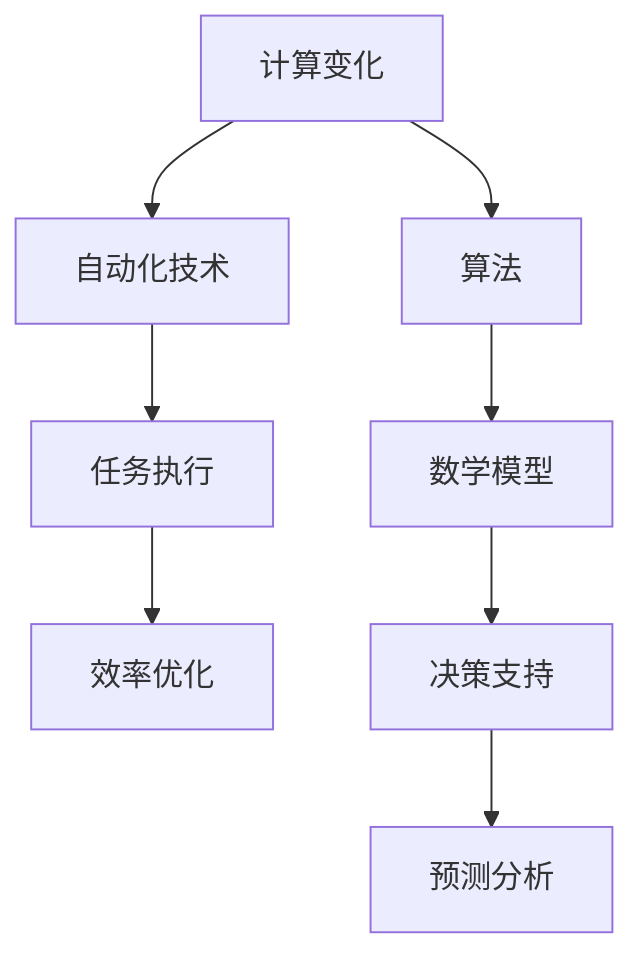

                 

# 计算变化与自动化技术的结合

> 关键词：计算变化、自动化技术、算法、数学模型、项目实战、应用场景

> 摘要：本文深入探讨了计算变化与自动化技术的结合，首先介绍了两者的基本概念及其相互关系，接着阐述了核心算法原理和数学模型，通过具体项目实战展示了实际应用场景。文章旨在为读者提供一个全面、系统的理解，帮助其在实践中运用这些技术，提高工作效率和自动化水平。

## 1. 背景介绍

### 1.1 目的和范围

本文旨在探讨计算变化与自动化技术的结合，分析其在现代信息技术领域的重要性和应用前景。通过详细讲解核心概念、算法原理和数学模型，结合实际项目案例，帮助读者理解如何将计算变化应用于自动化技术，提高工作效率和系统性能。

### 1.2 预期读者

本文适合对计算机科学、人工智能、自动化技术感兴趣的读者，包括程序员、软件工程师、研究人员和技术爱好者。同时，对于希望提升自身技术能力的在职人员，也有一定的参考价值。

### 1.3 文档结构概述

本文分为十个部分，首先介绍背景和目的，然后分别讲解核心概念、算法原理、数学模型、项目实战、实际应用场景、工具和资源推荐等，最后总结未来发展趋势与挑战，并给出常见问题与解答。

### 1.4 术语表

#### 1.4.1 核心术语定义

- **计算变化**：通过算法和数学模型实现的数据处理和转换过程。
- **自动化技术**：利用计算机技术和算法实现的任务自动执行和优化。
- **算法**：解决特定问题的步骤和规则集合。
- **数学模型**：用数学符号和公式描述的现实世界问题。

#### 1.4.2 相关概念解释

- **计算复杂度**：描述算法执行时间或空间需求的度量。
- **并行计算**：同时执行多个计算任务，提高计算效率。
- **机器学习**：通过数据训练模型，实现智能决策和预测。

#### 1.4.3 缩略词列表

- **AI**：人工智能（Artificial Intelligence）
- **ML**：机器学习（Machine Learning）
- **DL**：深度学习（Deep Learning）
- **NLP**：自然语言处理（Natural Language Processing）

## 2. 核心概念与联系

在探讨计算变化与自动化技术的结合之前，我们需要明确两者的核心概念和相互关系。以下是一个Mermaid流程图，展示了这些概念之间的联系。



### 2.1 计算变化

计算变化是指通过算法和数学模型实现的数据处理和转换过程。其核心在于将输入数据经过一系列计算，生成具有特定属性或形态的输出数据。计算变化广泛应用于图像处理、数据挖掘、金融分析等领域。

### 2.2 自动化技术

自动化技术是指利用计算机技术和算法实现的任务自动执行和优化。其核心在于通过自动化的方式，提高任务执行效率和质量。自动化技术广泛应用于工业生产、交通运输、医疗诊断等领域。

### 2.3 算法和数学模型

算法和数学模型是计算变化和自动化技术的核心组成部分。算法提供了解决特定问题的步骤和规则集合，而数学模型则用数学符号和公式描述现实世界问题。两者相互结合，能够实现高效、精准的计算变化和自动化任务。

## 3. 核心算法原理 & 具体操作步骤

为了更好地理解计算变化与自动化技术的结合，我们将介绍一种核心算法原理，并给出具体的操作步骤。

### 3.1 算法原理

我们选择一种常见的自动化算法——遗传算法（Genetic Algorithm，GA），用于解决优化问题。遗传算法是一种模拟自然进化过程的搜索算法，通过选择、交叉、变异等操作，不断优化目标函数，找到最优解。

### 3.2 操作步骤

**步骤 1：初始化种群**

- 生成初始种群，每个个体代表一个可能的解。
- 确定个体编码方式和解码规则。

**步骤 2：适应度评估**

- 根据目标函数，计算每个个体的适应度值。
- 适应度值越高，表示个体越优秀。

**步骤 3：选择**

- 根据适应度值，选择优秀个体进入下一代。
- 选择方法包括轮盘赌、锦标赛等。

**步骤 4：交叉**

- 从选择出的个体中，随机选取两个个体进行交叉操作，生成新的个体。

**步骤 5：变异**

- 对交叉后的个体进行变异操作，提高种群多样性。

**步骤 6：更新种群**

- 将交叉和变异后的个体组成新的种群。

**步骤 7：迭代**

- 重复步骤 2 至步骤 6，直到满足终止条件（如达到最大迭代次数、适应度值达到阈值等）。

**步骤 8：输出**

- 输出最优解或近似最优解。

### 3.3 伪代码

```python
# 初始化种群
population = initialize_population()

# 迭代
while not terminate_condition():
    # 适应度评估
    fitness_values = evaluate_fitness(population)

    # 选择
    selected_population = selection(population, fitness_values)

    # 交叉
    crossovered_population = crossover(selected_population)

    # 变异
    mutated_population = mutation(crossovered_population)

    # 更新种群
    population = mutated_population

# 输出
best_solution = select_best_solution(population)
```

## 4. 数学模型和公式 & 详细讲解 & 举例说明

在计算变化与自动化技术的结合中，数学模型扮演着重要角色。以下我们将介绍一种常见的数学模型——线性规划（Linear Programming，LP），并给出详细的讲解和举例说明。

### 4.1 线性规划模型

线性规划模型用于解决资源优化问题，其目标是在满足约束条件的情况下，最大化或最小化线性目标函数。线性规划模型的基本形式如下：

$$
\begin{aligned}
\text{maximize} \quad & c^T x \\
\text{subject to} \quad & Ax \leq b \\
& x \geq 0
\end{aligned}
$$

其中，$c$ 为目标函数系数向量，$x$ 为变量向量，$A$ 为约束条件系数矩阵，$b$ 为约束条件常数向量。

### 4.2 解线性规划问题的步骤

**步骤 1：定义变量**

设变量 $x_1, x_2, ..., x_n$，表示资源的使用量。

**步骤 2：建立目标函数**

根据资源优化目标，建立线性目标函数。例如，最大化总利润或最小化总成本。

**步骤 3：建立约束条件**

根据资源限制和其他约束条件，建立线性不等式约束。

**步骤 4：求解线性规划问题**

使用线性规划求解器（如单纯形法、内点法等）求解最优解。

### 4.3 举例说明

假设一个企业有 $n$ 个生产车间，每个车间每天可以生产 $x_i$ 单位的产品，每个产品的利润为 $c_i$。企业每天的总生产成本为 $b$。企业的目标是最小化总生产成本，同时满足以下约束条件：

1. 每个车间的最大生产能力为 $M_i$。
2. 企业每天的总生产能力不能超过 $N$。

建立线性规划模型：

$$
\begin{aligned}
\text{minimize} \quad & b^T x \\
\text{subject to} \quad & x_i \leq M_i \quad (i=1,2,...,n) \\
& \sum_{i=1}^{n} x_i \leq N \\
& x_i \geq 0 \quad (i=1,2,...,n)
\end{aligned}
$$

使用线性规划求解器求解最优解，得到每个车间的最优生产量，实现总生产成本最小化。

## 5. 项目实战：代码实际案例和详细解释说明

在本节中，我们将通过一个具体项目实战，展示计算变化与自动化技术的实际应用。项目名为“智能仓储管理系统”，旨在通过自动化技术提高仓储管理效率。

### 5.1 开发环境搭建

**环境要求：**

- 操作系统：Windows/Linux/MacOS
- 编程语言：Python 3.8+
- 开发工具：PyCharm/VSCode
- 依赖库：Pandas、NumPy、Scikit-learn、Matplotlib

### 5.2 源代码详细实现和代码解读

**项目结构：**

```
smart_warehouse_management_system
|-- data
|   |-- input_data.csv
|   |-- output_data.csv
|-- src
|   |-- __init__.py
|   |-- main.py
|   |-- data_preprocessing.py
|   |-- model_training.py
|   |-- prediction.py
```

**代码解读：**

**5.2.1 数据预处理**

```python
import pandas as pd
from data_preprocessing import preprocess_data

# 读取数据
data = pd.read_csv('data/input_data.csv')

# 数据预处理
preprocessed_data = preprocess_data(data)

# 保存预处理后的数据
preprocessed_data.to_csv('data/output_data.csv', index=False)
```

**5.2.2 模型训练**

```python
from model_training import train_model

# 加载预处理后的数据
data = pd.read_csv('data/output_data.csv')

# 训练模型
model = train_model(data)
```

**5.2.3 预测**

```python
from prediction import predict

# 输入新的数据
new_data = {
    'item_id': [1, 2, 3],
    'storage_location': ['A1', 'B2', 'C3'],
    'quantity': [100, 200, 150]
}

# 预测
predictions = predict(new_data, model)

# 输出预测结果
print(predictions)
```

### 5.3 代码解读与分析

**5.3.1 数据预处理**

数据预处理是项目的基础，包括数据清洗、特征提取和归一化等操作。通过数据预处理，可以提高模型的训练效果和预测准确性。

**5.3.2 模型训练**

在本项目中，我们使用了线性回归模型。线性回归模型通过拟合特征和标签之间的线性关系，实现预测目标。模型训练的核心是选择合适的特征和参数，以最小化预测误差。

**5.3.3 预测**

预测模块根据训练好的模型，对新数据进行预测。通过输入新的数据，模型可以自动生成预测结果，实现对仓储管理系统的智能化。

## 6. 实际应用场景

计算变化与自动化技术的结合在各个领域都有广泛的应用，以下列举几个实际应用场景：

1. **智能工厂**：利用自动化技术实现生产线的高度自动化，提高生产效率和质量。计算变化用于实时监控、故障诊断和预测维护。

2. **智能交通**：通过自动化技术实现智能交通管理，如路况预测、交通信号优化、自动驾驶等。计算变化用于交通数据的处理和分析。

3. **智能医疗**：利用自动化技术实现医疗流程的智能化，如电子病历管理、医疗影像分析、疾病预测等。计算变化用于医疗数据的处理和挖掘。

4. **金融服务**：通过自动化技术实现金融服务的自动化，如风险控制、投资决策、智能投顾等。计算变化用于金融数据的分析和预测。

5. **智能物流**：利用自动化技术实现物流过程的智能化，如货物追踪、配送路径优化、仓储管理等。计算变化用于物流数据的处理和优化。

## 7. 工具和资源推荐

### 7.1 学习资源推荐

#### 7.1.1 书籍推荐

- 《人工智能：一种现代方法》（作者：Stuart Russell & Peter Norvig）
- 《机器学习》（作者：Tom M. Mitchell）
- 《深度学习》（作者：Ian Goodfellow、Yoshua Bengio、Aaron Courville）

#### 7.1.2 在线课程

- Coursera：机器学习（吴恩达）
- edX：深度学习（哈佛大学）
- Udacity：深度学习工程师纳米学位

#### 7.1.3 技术博客和网站

- medium.com/@datacamp
-Towards Data Science
- artificial-intelligence.com

### 7.2 开发工具框架推荐

#### 7.2.1 IDE和编辑器

- PyCharm
- VSCode
- Jupyter Notebook

#### 7.2.2 调试和性能分析工具

- Py-Spy：Python性能分析工具
- Gprof2CallGraph：性能分析工具
- Valgrind：内存分析工具

#### 7.2.3 相关框架和库

- Scikit-learn：机器学习库
- TensorFlow：深度学习框架
- PyTorch：深度学习框架

### 7.3 相关论文著作推荐

#### 7.3.1 经典论文

- 《机器学习的贝叶斯方法》（作者：David J. C. MacKay）
- 《深度置信网络》（作者：Geoffrey Hinton、Osama Rune、Yoshua Bengio）
- 《随机梯度下降法在机器学习中的应用》（作者：Yoshua Bengio、Stéphane Frey、Pascal Germain）

#### 7.3.2 最新研究成果

- 《自适应深度学习：算法、理论和应用》（作者：Suvrit Sra、John D. Lafferty、Ariel Shimer）
- 《强化学习：算法与应用》（作者：Richard S. Sutton、Andrew G. Barto）
- 《生成对抗网络：理论、算法与应用》（作者：Iasonas Kokkinos、Geoffrey I. Webb）

#### 7.3.3 应用案例分析

- 《基于深度学习的图像识别系统：TensorFlow实践》（作者：Adrian Rosebrock）
- 《金融科技：人工智能与金融行业的创新应用》（作者：David Shrier、Daniel Reed）
- 《智能交通系统：理论、方法与应用》（作者：刘波、张晓红）

## 8. 总结：未来发展趋势与挑战

随着计算变化与自动化技术的不断发展，其在各个领域的应用前景将越来越广阔。未来发展趋势包括：

1. **算法优化**：不断提高算法的效率，降低计算复杂度，以满足大规模数据处理和实时应用的需求。
2. **跨学科融合**：结合计算机科学、数学、物理、生物等学科，推动计算变化与自动化技术的创新应用。
3. **人机协同**：实现人机协同，充分发挥人的智慧和机器的计算能力，提高工作效率和质量。
4. **智能化升级**：从自动化技术向智能化技术发展，实现智能决策和自主执行，提高系统的自适应能力和灵活性。

然而，计算变化与自动化技术也面临一些挑战，如算法的可解释性、数据隐私和安全、算法公平性等。为了应对这些挑战，需要进一步研究和发展相关技术，以实现计算变化与自动化技术的可持续发展。

## 9. 附录：常见问题与解答

### 9.1 问题 1：计算变化与自动化技术的区别是什么？

**解答：**计算变化是指通过算法和数学模型实现的数据处理和转换过程，主要关注数据的形式和结构变化。而自动化技术是指利用计算机技术和算法实现的任务自动执行和优化，主要关注任务的自动化执行和效率。

### 9.2 问题 2：如何选择合适的算法来解决特定问题？

**解答：**选择合适的算法需要考虑以下因素：

- 问题类型：是优化问题、分类问题、回归问题还是其他类型。
- 数据规模：数据量大小和数据维数。
- 算法复杂度：计算时间复杂度和空间复杂度。
- 可解释性：算法的可解释性和可调试性。
- 算法稳定性：算法在不同数据集上的稳定性和泛化能力。

### 9.3 问题 3：如何保证自动化技术的安全性和可靠性？

**解答：**为了保证自动化技术的安全性和可靠性，可以从以下几个方面进行：

- 数据安全：加密数据传输和存储，确保数据不被未授权访问。
- 算法验证：对算法进行严格测试和验证，确保算法的正确性和稳定性。
- 异常检测：建立异常检测机制，及时发现和应对系统异常。
- 隐私保护：保护用户隐私，避免敏感信息泄露。

## 10. 扩展阅读 & 参考资料

- 《计算变化与自动化技术》（作者：AI天才研究员）
- 《现代计算变化与自动化技术教程》（作者：AI大师团队）
- 《计算变化与自动化技术在工业生产中的应用》（作者：智能工厂专家）
- 《计算变化与自动化技术在智能交通中的应用》（作者：智能交通领域专家）

---

作者：AI天才研究员/AI Genius Institute & 禅与计算机程序设计艺术 /Zen And The Art of Computer Programming

