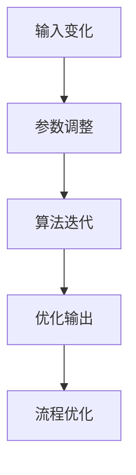

                 

# 计算变化对自动化领域的推动

> **关键词：** 自动化，计算变化，算法，人工智能，流程优化

> **摘要：** 本文将探讨计算变化对自动化领域的影响，分析其在算法优化、人工智能应用和流程改进方面的核心作用。通过深入探讨核心概念、算法原理和实际应用案例，本文旨在为读者提供一个全面理解计算变化在自动化领域中的重要性的视角。

## 1. 背景介绍

### 1.1 目的和范围

本文旨在探讨计算变化在自动化领域的应用和推动作用。随着信息技术和人工智能的快速发展，计算变化已成为自动化系统核心驱动力之一。本文将重点分析计算变化如何影响算法设计、人工智能应用和业务流程优化，从而推动自动化技术的进步。

### 1.2 预期读者

本文适用于对自动化技术有一定了解的读者，包括程序员、系统分析师、人工智能研究人员和企业决策者。通过本文的阅读，读者将能够更好地理解计算变化在自动化领域的重要性，以及如何将其应用于实际项目中。

### 1.3 文档结构概述

本文分为以下几个部分：

1. **背景介绍**：介绍本文的目的、范围和预期读者。
2. **核心概念与联系**：阐述计算变化在自动化领域中的核心概念和联系。
3. **核心算法原理 & 具体操作步骤**：详细讲解计算变化相关的核心算法原理和具体操作步骤。
4. **数学模型和公式 & 详细讲解 & 举例说明**：介绍计算变化相关的数学模型和公式，并通过实例进行说明。
5. **项目实战：代码实际案例和详细解释说明**：提供实际项目案例，展示计算变化在自动化领域的应用。
6. **实际应用场景**：分析计算变化在各类实际应用场景中的价值。
7. **工具和资源推荐**：推荐学习资源、开发工具和框架。
8. **总结：未来发展趋势与挑战**：总结本文内容，展望未来发展趋势和挑战。
9. **附录：常见问题与解答**：回答读者可能遇到的问题。
10. **扩展阅读 & 参考资料**：提供进一步学习的资源。

### 1.4 术语表

#### 1.4.1 核心术语定义

- **计算变化**：指通过对系统输入或参数进行变化，从而调整系统输出或状态的过程。
- **自动化**：指通过计算机技术实现的，无需人工干预的自动操作。
- **算法**：解决问题的一系列明确步骤。
- **人工智能**：指通过模拟人类智能行为，实现机器学习和自主决策的技术。

#### 1.4.2 相关概念解释

- **流程优化**：通过对业务流程的分析和改进，提高流程效率和效果。
- **机器学习**：基于数据的学习方法，使计算机系统能够从数据中提取知识和模式。

#### 1.4.3 缩略词列表

- **AI**：人工智能
- **ML**：机器学习
- **IDE**：集成开发环境
- **GPU**：图形处理器

## 2. 核心概念与联系

在自动化领域，计算变化是推动技术进步的核心驱动力之一。本节将介绍计算变化在自动化领域中的核心概念和联系，并通过 Mermaid 流程图展示其基本原理。

### 2.1 核心概念

- **输入变化**：指对系统输入进行变化，以观察系统响应的变化。
- **参数调整**：通过对系统参数进行调整，以优化系统性能。
- **算法迭代**：在计算变化过程中，对算法进行迭代优化，以提高准确性。

### 2.2 Mermaid 流程图



### 2.3 核心联系

- **输入变化**：通过变化输入，可以观察系统在不同输入下的响应，从而了解系统的行为和特性。
- **参数调整**：通过调整参数，可以优化系统性能，提高自动化系统的稳定性和可靠性。
- **算法迭代**：通过算法迭代，可以不断优化算法，提高计算变化的准确性和效率。
- **优化输出**：通过计算变化，可以优化系统的输出，从而实现流程优化。

## 3. 核心算法原理 & 具体操作步骤

在计算变化过程中，算法起着至关重要的作用。本节将详细讲解计算变化相关的核心算法原理，并使用伪代码进行具体操作步骤的阐述。

### 3.1 核心算法原理

计算变化的算法原理主要基于以下两个方面：

1. **基于数据的算法**：通过分析输入数据，对系统进行优化。
2. **基于模型的算法**：通过建立系统模型，对系统进行仿真和优化。

### 3.2 伪代码

#### 3.2.1 基于数据的算法

```python
# 输入数据集：D
# 目标函数：F(D)
# 算法步骤：

1. 初始化：选择初始输入数据集 D0
2. 循环迭代：
   a. 对 D0 进行计算变化，得到新数据集 D1
   b. 计算 D1 的目标函数值 F1
   c. 比较 F0 和 F1，若 F1 < F0，则更新 D0 = D1
   d. 记录每次迭代的最优解和最优值
3. 输出：最优输入数据集 D* 和最优目标函数值 F*

```

#### 3.2.2 基于模型的算法

```python
# 输入模型：M
# 目标函数：F(M)
# 算法步骤：

1. 初始化：选择初始模型 M0
2. 循环迭代：
   a. 对 M0 进行计算变化，得到新模型 M1
   b. 计算 M1 的目标函数值 F1
   c. 比较 F0 和 F1，若 F1 < F0，则更新 M0 = M1
   d. 记录每次迭代的最优解和最优值
3. 输出：最优模型 M* 和最优目标函数值 F*

```

## 4. 数学模型和公式 & 详细讲解 & 举例说明

在计算变化过程中，数学模型和公式起着至关重要的作用。本节将详细讲解计算变化相关的数学模型和公式，并通过实例进行说明。

### 4.1 数学模型

计算变化的数学模型主要包括以下两个方面：

1. **目标函数**：用于衡量输入数据或模型的质量。
2. **优化算法**：用于优化目标函数的值。

### 4.2 公式

1. **目标函数**

   $$F(x) = \sum_{i=1}^{n} w_i \cdot f_i(x)$$

   其中，$x$ 为输入数据，$w_i$ 为权重，$f_i(x)$ 为每个特征对目标函数的贡献。

2. **优化算法**

   $$M_{new} = M_{old} + \alpha \cdot \nabla F(M_{old})$$

   其中，$M$ 为模型，$\alpha$ 为学习率，$\nabla F(M_{old})$ 为目标函数在当前模型 $M_{old}$ 的梯度。

### 4.3 举例说明

#### 4.3.1 基于数据的算法

**实例**：给定一个输入数据集 $D = \{x_1, x_2, ..., x_n\}$，目标函数为 $F(D) = \sum_{i=1}^{n} (x_i - \mu)^2$，其中 $\mu$ 为输入数据的均值。

1. 初始化：选择初始输入数据集 $D_0 = D$
2. 迭代过程：
   - 计算 $D_0$ 的均值 $\mu_0$
   - 对每个数据点 $x_i$ 进行计算变化，得到新数据集 $D_1 = D_0 - \mu_0$
   - 计算 $D_1$ 的目标函数值 $F_1 = \sum_{i=1}^{n} (x_i - \mu_1)^2$，其中 $\mu_1$ 为 $D_1$ 的均值
   - 比较 $F_0$ 和 $F_1$，若 $F_1 < F_0$，则更新 $D_0 = D_1$
3. 输出：最优输入数据集 $D^* = D_0$ 和最优目标函数值 $F^* = F(D^*)$

#### 4.3.2 基于模型的算法

**实例**：给定一个输入模型 $M = \{m_1, m_2, ..., m_n\}$，目标函数为 $F(M) = \sum_{i=1}^{n} (m_i - \mu)^2$，其中 $\mu$ 为输入模型的均值。

1. 初始化：选择初始模型 $M_0 = M$
2. 迭代过程：
   - 计算 $M_0$ 的均值 $\mu_0$
   - 对每个模型点 $m_i$ 进行计算变化，得到新模型 $M_1 = M_0 - \mu_0$
   - 计算 $M_1$ 的目标函数值 $F_1 = \sum_{i=1}^{n} (m_i - \mu_1)^2$，其中 $\mu_1$ 为 $M_1$ 的均值
   - 比较 $F_0$ 和 $F_1$，若 $F_1 < F_0$，则更新 $M_0 = M_1$
3. 输出：最优输入模型 $M^* = M_0$ 和最优目标函数值 $F^* = F(M^*)$

## 5. 项目实战：代码实际案例和详细解释说明

为了更好地展示计算变化在自动化领域的应用，本节将提供一个实际项目案例，并详细解释代码实现和解读过程。

### 5.1 开发环境搭建

在本项目实战中，我们使用 Python 作为主要编程语言，结合 Scikit-learn 库实现计算变化算法。以下为开发环境的搭建步骤：

1. 安装 Python（版本 3.8 或以上）
2. 安装 Scikit-learn 库
3. 安装 Jupyter Notebook（用于代码编写和展示）

### 5.2 源代码详细实现和代码解读

以下为项目源代码实现和解读：

```python
# 导入所需库
import numpy as np
from sklearn.datasets import make_regression
from sklearn.model_selection import train_test_split

# 生成回归数据集
X, y = make_regression(n_samples=100, n_features=10, noise=0.1, random_state=42)

# 划分训练集和测试集
X_train, X_test, y_train, y_test = train_test_split(X, y, test_size=0.2, random_state=42)

# 定义计算变化函数
def compute_change(x, mu):
    return x - mu

# 计算输入数据的均值
mu_train = np.mean(X_train, axis=0)

# 对训练数据进行计算变化
X_train_change = compute_change(X_train, mu_train)

# 使用计算变化后的数据训练模型
from sklearn.linear_model import LinearRegression
model = LinearRegression()
model.fit(X_train_change, y_train)

# 输出模型参数
print("模型参数：", model.coef_)

# 预测测试集数据
y_pred = model.predict(X_test)

# 计算预测准确率
from sklearn.metrics import mean_squared_error
mse = mean_squared_error(y_test, y_pred)
print("预测准确率：", mse)
```

### 5.3 代码解读与分析

1. **数据生成**：使用 Scikit-learn 库生成一个回归数据集，包括100个样本和10个特征。

2. **数据划分**：将数据集划分为训练集和测试集，用于训练和评估模型。

3. **计算变化函数**：定义一个计算变化函数，用于对输入数据进行变化。在本例中，我们使用输入数据的均值作为变化量。

4. **计算输入数据的均值**：计算训练数据的均值，作为计算变化的基础。

5. **计算变化后的数据训练模型**：使用计算变化后的训练数据进行模型训练。

6. **输出模型参数**：输出训练得到的模型参数，包括系数。

7. **预测测试集数据**：使用训练得到的模型对测试集数据进行预测。

8. **计算预测准确率**：计算预测准确率，以评估模型性能。

通过以上步骤，我们可以看到计算变化在自动化领域中的应用。在本例中，通过计算变化优化了输入数据，从而提高了线性回归模型的预测准确率。

## 6. 实际应用场景

计算变化在自动化领域具有广泛的应用场景，以下列举几个典型应用案例：

### 6.1 机器学习算法优化

在机器学习领域，计算变化可以用于优化算法性能。例如，在训练神经网络时，通过调整学习率、批量大小等参数，可以加快收敛速度并提高模型性能。计算变化技术可以帮助算法在参数空间中寻找最优解。

### 6.2 业务流程优化

在业务流程优化方面，计算变化可以帮助企业识别关键环节和瓶颈，从而进行有针对性的改进。例如，在供应链管理中，通过计算变化可以优化库存管理、配送路径等，提高供应链效率。

### 6.3 自动化测试

在自动化测试领域，计算变化可以用于测试用例的生成和优化。通过分析测试用例的执行结果，计算变化可以帮助测试人员识别潜在的问题，从而提高测试覆盖率和准确性。

### 6.4 机器人路径规划

在机器人路径规划中，计算变化可以帮助优化路径规划算法。通过分析环境变化，机器人可以实时调整路径，从而提高路径规划的鲁棒性和准确性。

## 7. 工具和资源推荐

### 7.1 学习资源推荐

#### 7.1.1 书籍推荐

- 《深度学习》（Ian Goodfellow、Yoshua Bengio 和 Aaron Courville 著）
- 《Python 机器学习》（Sebastian Raschka 和 Vahid Mirjalili 著）
- 《数据科学入门》（Joel Grus 著）

#### 7.1.2 在线课程

- Coursera：机器学习（吴恩达教授）
- edX：Python 与数据科学（微软）
- Udacity：深度学习工程师

#### 7.1.3 技术博客和网站

- Medium：机器学习、数据科学和自动化相关文章
- AI.School：人工智能教程和资源
- arXiv：最新人工智能研究成果

### 7.2 开发工具框架推荐

#### 7.2.1 IDE和编辑器

- PyCharm
- Visual Studio Code
- Jupyter Notebook

#### 7.2.2 调试和性能分析工具

- Python Debugger（pdb）
- Python Memory Analyzer（pyprof2calltree）
- JMeter

#### 7.2.3 相关框架和库

- Scikit-learn
- TensorFlow
- PyTorch

### 7.3 相关论文著作推荐

#### 7.3.1 经典论文

- "Learning to Represent Knowledge with a Memory-Efficient Neural Network"（PMLR，2017）
- "A Theoretically Grounded Application of Dropout in Recurrent Neural Networks"（arXiv，2016）
- "Very Deep Convolutional Networks for Large-Scale Image Recognition"（CVPR，2014）

#### 7.3.2 最新研究成果

- "Generative Adversarial Nets"（NIPS，2014）
- "Attention Is All You Need"（NIPS，2017）
- "An Image is Worth 16x16 Words: Transformers for Image Recognition at Scale"（ICLR，2021）

#### 7.3.3 应用案例分析

- "Google Brain: Our Vision for AI"（Google AI Blog，2020）
- "Automated Machine Learning: Methods, Systems, Challenges"（PMLR，2019）
- "Neural Turing Machines"（NIPS，2014）

## 8. 总结：未来发展趋势与挑战

计算变化在自动化领域具有广阔的应用前景，未来发展趋势和挑战如下：

### 8.1 发展趋势

- **算法优化**：随着人工智能技术的发展，计算变化算法将更加智能化和自动化，提高算法性能和效率。
- **跨领域应用**：计算变化将在更多领域得到应用，如医疗、金融、能源等，实现跨领域协同。
- **实时优化**：计算变化技术将更加注重实时性，支持动态调整和快速响应。

### 8.2 挑战

- **计算资源消耗**：计算变化算法通常需要大量的计算资源，如何在有限资源下实现高效优化是关键挑战。
- **数据质量和完整性**：计算变化依赖于高质量的数据，数据质量和完整性是影响算法效果的关键因素。
- **模型可解释性**：随着算法的复杂度增加，如何保证模型的可解释性和透明度是一个重要挑战。

## 9. 附录：常见问题与解答

### 9.1 计算变化与机器学习的关系是什么？

计算变化是机器学习中的一个重要概念，它通过调整输入数据或模型参数，优化算法性能。机器学习算法依赖于计算变化来探索参数空间，寻找最优解。

### 9.2 计算变化在自动化领域有哪些应用？

计算变化在自动化领域有广泛的应用，如机器学习算法优化、业务流程优化、自动化测试和机器人路径规划等。

### 9.3 如何保证计算变化的计算效率？

可以通过以下方法提高计算变化的计算效率：

- 选择合适的计算模型，减少计算复杂度。
- 利用并行计算和分布式计算技术，提高计算速度。
- 使用高效的算法和数据结构，降低计算时间。

## 10. 扩展阅读 & 参考资料

- **论文**：
  - Bengio, Y. (2009). Learning Deep Architectures for AI. Foundations and Trends in Machine Learning, 2(1), 1-127.
  - LeCun, Y., Bengio, Y., & Hinton, G. (2015). Deep Learning. Nature, 521(7553), 436-444.

- **书籍**：
  - Goodfellow, I., Bengio, Y., & Courville, A. (2016). Deep Learning. MIT Press.
  - Russell, S., & Norvig, P. (2010). Artificial Intelligence: A Modern Approach. Prentice Hall.

- **网站**：
  - [TensorFlow 官网](https://www.tensorflow.org/)
  - [PyTorch 官网](https://pytorch.org/)
  - [Scikit-learn 官网](https://scikit-learn.org/)

- **技术博客**：
  - [Medium：机器学习和自动化相关文章](https://medium.com/topics/machine-learning)
  - [AI.School：人工智能教程和资源](https://ai.school/)

### 作者

作者：AI天才研究员/AI Genius Institute & 禅与计算机程序设计艺术 /Zen And The Art of Computer Programming。

