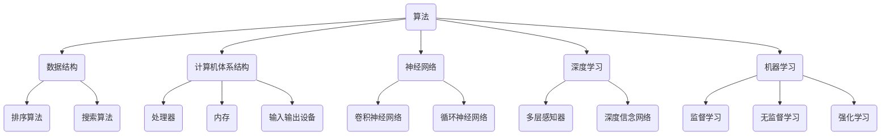

                 

# 计算机科学基础：AI开发者必备知识

> **关键词：** 计算机科学、AI开发、核心概念、算法原理、数学模型、项目实战、应用场景
> 
> **摘要：** 本文将深入探讨计算机科学的基础知识，这些知识对于AI开发者至关重要。文章首先介绍了计算机科学的背景和范围，然后逐步介绍了核心概念、算法原理、数学模型以及实际应用场景，并通过一个具体的代码案例详细讲解了如何将理论应用于实践。最后，文章总结了未来发展趋势与挑战，并提供了丰富的学习资源和开发工具推荐。

## 1. 背景介绍

### 1.1 目的和范围

本文的目标是为那些希望进入AI开发领域的新手提供一个系统化的知识框架。我们将从计算机科学的基础概念开始，逐步深入到AI开发的各个关键领域，包括算法原理、数学模型以及实际应用场景。通过本文的阅读，读者将能够建立起对计算机科学和AI开发的全面理解，并掌握一些实用的技能。

本文的范围涵盖了计算机科学的核心知识，包括但不限于以下几个方面：

1. **核心概念**：介绍计算机科学的基本概念，如算法、数据结构、计算机体系结构等。
2. **算法原理**：详细讲解常见的算法原理，如排序算法、搜索算法等，并提供伪代码实现。
3. **数学模型**：探讨计算机科学中的数学模型，如概率论、线性代数等，并举例说明其应用。
4. **项目实战**：通过一个具体的代码案例，展示如何将理论知识应用于实际项目。
5. **应用场景**：讨论AI在各个领域的应用，如自然语言处理、图像识别等。
6. **工具和资源推荐**：推荐学习资源和开发工具，以帮助读者进一步学习和实践。

### 1.2 预期读者

本文预期读者为以下几类：

1. **AI开发新手**：那些对AI开发感兴趣，但缺乏系统化知识的初学者。
2. **计算机科学学生**：正在学习计算机科学或相关专业，希望加深对基础知识理解的本科生和研究生。
3. **开发者和工程师**：希望提升自身技能，了解计算机科学基础知识的开发者和工程师。

### 1.3 文档结构概述

本文的结构如下：

1. **第1章**：背景介绍，包括目的和范围、预期读者、文档结构概述。
2. **第2章**：核心概念与联系，介绍计算机科学的基本概念，并提供Mermaid流程图。
3. **第3章**：核心算法原理 & 具体操作步骤，详细讲解算法原理和伪代码实现。
4. **第4章**：数学模型和公式 & 详细讲解 & 举例说明，介绍计算机科学中的数学模型和应用。
5. **第5章**：项目实战：代码实际案例和详细解释说明，通过具体代码案例展示理论应用。
6. **第6章**：实际应用场景，讨论AI在各个领域的应用。
7. **第7章**：工具和资源推荐，推荐学习资源和开发工具。
8. **第8章**：总结：未来发展趋势与挑战，探讨AI和计算机科学的未来。
9. **第9章**：附录：常见问题与解答，解答读者可能遇到的问题。
10. **第10章**：扩展阅读 & 参考资料，提供进一步学习的资料。

### 1.4 术语表

#### 1.4.1 核心术语定义

- **算法**：解决问题的步骤序列。
- **数据结构**：用于存储和组织数据的方式。
- **计算机体系结构**：计算机硬件的组成和设计。
- **AI**：人工智能，模拟人类智能行为的计算机技术。
- **神经网络**：模仿人脑神经元连接的计算机模型。
- **深度学习**：基于神经网络的机器学习方法。

#### 1.4.2 相关概念解释

- **机器学习**：让计算机通过数据学习，从而做出预测或决策。
- **神经网络**：模拟人脑神经元连接的计算机模型。
- **深度学习**：基于多层神经网络的学习方法。

#### 1.4.3 缩略词列表

- **AI**：人工智能（Artificial Intelligence）
- **ML**：机器学习（Machine Learning）
- **DL**：深度学习（Deep Learning）
- **DL**：深度学习（Deep Learning）

## 2. 核心概念与联系

在AI开发中，理解计算机科学的基本概念和联系是非常重要的。本节将介绍一些核心概念，并提供一个Mermaid流程图来展示它们之间的关系。

### 2.1 核心概念介绍

1. **算法**：算法是解决问题的步骤序列。它是一系列明确的规则，指导计算机如何解决特定问题。算法可以是简单的，如排序算法，也可以是非常复杂的，如神经网络训练算法。
   
2. **数据结构**：数据结构是用于存储和组织数据的方式。常见的有数组、链表、树、图等。数据结构的选取对算法的性能有很大影响。

3. **计算机体系结构**：计算机体系结构是计算机硬件的组成和设计。它包括处理器、内存、输入输出设备等。了解计算机体系结构有助于理解程序执行的底层机制。

4. **神经网络**：神经网络是模仿人脑神经元连接的计算机模型。它由许多相互连接的节点（或神经元）组成，可以用于图像识别、自然语言处理等。

5. **深度学习**：深度学习是基于多层神经网络的学习方法。它通过多层神经网络对数据进行逐层抽象，从而学习复杂的特征表示。

6. **机器学习**：机器学习是让计算机通过数据学习，从而做出预测或决策。它包括监督学习、无监督学习、强化学习等。

### 2.2 Mermaid流程图

以下是一个Mermaid流程图，展示了这些核心概念之间的联系：



### 2.3 核心概念之间的联系

- **算法**与**数据结构**紧密相关，因为数据结构的选取直接影响算法的性能。
- **算法**和**机器学习**共同构成了AI的核心。算法用于解决特定问题，而机器学习使计算机能够通过数据自主改进。
- **神经网络**和**深度学习**是机器学习的两个重要分支。神经网络模仿人脑神经元连接，而深度学习通过多层神经网络对数据进行逐层抽象。
- **计算机体系结构**为算法和机器学习提供了硬件支持。了解计算机体系结构有助于理解程序执行的底层机制。

通过理解这些核心概念和它们之间的联系，开发者可以更好地构建和优化AI系统。

## 3. 核心算法原理 & 具体操作步骤

### 3.1 排序算法原理

排序算法是一类用于对一组数据进行排序的算法。排序算法的核心目标是按照某种规则将数据从小到大（或从大到小）排列。常见的排序算法包括冒泡排序、选择排序、插入排序、快速排序等。

#### 3.1.1 冒泡排序

冒泡排序是一种简单的排序算法。它的工作原理是通过重复遍历要排序的数列，一次比较两个元素，如果它们的顺序错误就把它们交换过来。遍历数列的工作是重复进行的，直到没有再需要交换，即该数列已经排序完成。

#### 3.1.2 选择排序

选择排序是一种简单的选择排序算法。它的工作原理是在未排序序列中找到最小（或最大）元素，存放到排序序列的起始位置，然后，再从剩余未排序元素中继续寻找最小（或最大）元素，然后放到已排序序列的末尾。以此类推，直到所有元素均排序完毕。

#### 3.1.3 插入排序

插入排序是一种简单的插入排序算法。它的工作原理是通过构建有序序列，对于未排序数据，在已排序序列中从后向前扫描，找到相应位置并插入。插入排序在实现上，通常采用in-place排序（即只需用到O(1)的额外空间的排序）。

#### 3.1.4 快速排序

快速排序是一种高效的排序算法。它的工作原理是通过选取一个“基准”元素，将数组分为两部分，一部分都比基准小，另一部分都比基准大，然后递归地对这两部分继续进行快速排序。

### 3.2 具体操作步骤

下面我们以冒泡排序为例，介绍其具体操作步骤。以下是冒泡排序的伪代码实现：

```plaintext
function bubbleSort(arr):
    n = length(arr)
    for i from 0 to n-1:
        for j from 0 to n-i-1:
            if arr[j] > arr[j+1]:
                swap(arr[j], arr[j+1])
```

#### 3.2.1 初始化

- 输入一个待排序的数组`arr`。
- 计算数组长度`n`。

#### 3.2.2 外层循环

- 循环变量`i`从0到`n-1`。

#### 3.2.3 内层循环

- 循环变量`j`从0到`n-i-1`。
- 每次比较相邻的两个元素`arr[j]`和`arr[j+1]`。
- 如果`arr[j]`大于`arr[j+1]`，交换这两个元素的位置。

#### 3.2.4 结束条件

- 当内层循环结束后，数组的最后一个元素已经是最大的，所以外层循环的次数为`n-1`次。
- 每次外层循环结束后，未排序部分的数组长度减少1，内层循环的次数相应减少。

### 3.3 分析与优化

#### 3.3.1 分析

- **时间复杂度**：冒泡排序的最坏和平均时间复杂度为`O(n^2)`，其中`n`是数组长度。
- **空间复杂度**：冒泡排序是原地排序算法，空间复杂度为`O(1)`。

#### 3.3.2 优化

- **优化1：减少比较次数**：在每次内层循环结束后，记录最后一次交换的位置，下一次内层循环可以省略这个位置的后续元素比较。
- **优化2：使用标志位**：在内层循环中添加一个标志位，用于记录是否进行了交换。如果没有进行交换，说明数组已经排序完成，可以提前终止循环。

通过以上优化，冒泡排序的时间复杂度可以降低到`O(n)`，但在最坏情况下，时间复杂度仍然是`O(n^2)`。

## 4. 数学模型和公式 & 详细讲解 & 举例说明

### 4.1 数学模型简介

在计算机科学中，数学模型是理解和解决问题的有力工具。数学模型通过数学公式和定理来描述现实世界的现象和问题，使复杂的系统变得可计算和分析。以下是几个在计算机科学中常用的数学模型：

- **概率论**：研究随机事件和随机变量。
- **线性代数**：研究线性方程组、向量空间和矩阵。
- **微积分**：研究函数的极限、导数和积分。
- **图论**：研究图的结构和性质。

### 4.2 概率论

概率论是数学模型中最基础的部分之一，它在AI领域，尤其是机器学习和深度学习中扮演了关键角色。

#### 4.2.1 概率的基本概念

- **随机事件**：在一次试验中，可能出现也可能不出现的结果。
- **随机变量**：一个随机试验的所有可能结果组成一个样本空间，样本空间中的一个元素是一个随机变量。
- **概率分布**：随机变量的概率分布描述了随机变量取不同值的可能性。

#### 4.2.2 概率公式

- **条件概率**：在事件A发生的条件下，事件B发生的概率。
  $$ P(B|A) = \frac{P(A \cap B)}{P(A)} $$
- **全概率公式**：给定一个随机变量S，计算另一个随机变量T的概率。
  $$ P(T) = \sum_{i} P(T|S_i)P(S_i) $$
- **贝叶斯定理**：根据条件概率和边缘概率计算后验概率。
  $$ P(A|B) = \frac{P(B|A)P(A)}{P(B)} $$

### 4.3 线性代数

线性代数在计算机科学中有着广泛的应用，特别是在机器学习和图像处理领域。

#### 4.3.1 线性代数的基本概念

- **向量**：一个向量可以表示为一个有序的数列。
- **矩阵**：一个矩阵是一个二维数组。
- **行列式**：行列式是一个标量值，用于描述矩阵的性质。
- **矩阵运算**：包括矩阵加法、矩阵乘法、转置等。

#### 4.3.2 线性方程组

- **解线性方程组**：通过矩阵运算求解线性方程组。
  $$ Ax = b $$
  其中，A是系数矩阵，x是未知向量，b是常数向量。

#### 4.3.3 特征值和特征向量

- **特征值**：矩阵A的一个特征值是一个数λ，使得存在一个非零向量v，满足$Av = \lambda v$。
- **特征向量**：满足$Av = \lambda v$的向量v。

### 4.4 微积分

微积分在优化算法、数值计算和图像处理等领域有着广泛的应用。

#### 4.4.1 微积分的基本概念

- **导数**：描述函数在某一点的瞬时变化率。
  $$ f'(x) = \lim_{\Delta x \to 0} \frac{f(x + \Delta x) - f(x)}{\Delta x} $$
- **积分**：描述函数的累积量。
  $$ \int_{a}^{b} f(x) \, dx $$

#### 4.4.2 最优化

- **梯度下降**：一种优化算法，通过迭代更新参数，最小化目标函数。
  $$ x_{\text{new}} = x_{\text{current}} - \alpha \nabla f(x_{\text{current}}) $$
  其中，$x_{\text{new}}$是新的参数值，$x_{\text{current}}$是当前参数值，$\alpha$是学习率，$\nabla f(x_{\text{current}})$是目标函数在当前参数值处的梯度。

### 4.5 图论

图论在计算机网络、路由算法和社交网络分析等领域有着重要的应用。

#### 4.5.1 图的基本概念

- **图**：由节点（或顶点）和边组成的集合。
- **路径**：图中节点之间的连接序列。
- **连通性**：图中任意两个节点之间存在路径。

#### 4.5.2 图的算法

- **深度优先搜索（DFS）**：用于遍历图。
  $$ DFS(G, v): $$
  ```
  mark v as visited
  for each unvisited neighbor u of v:
      DFS(G, u)
  ```

- **广度优先搜索（BFS）**：用于遍历图。
  $$ BFS(G, v): $$
  ```
  create an empty queue
  mark v as visited
  enqueue v
  while queue is not empty:
      dequeue a node u
      for each unvisited neighbor v of u:
          mark v as visited
          enqueue v
  ```

### 4.6 举例说明

#### 4.6.1 概率论例子

假设你抛一枚硬币5次，计算得到3次正面和2次反面的概率。

```latex
P(\text{正面出现3次}) = \binom{5}{3} \left(\frac{1}{2}\right)^3 \left(\frac{1}{2}\right)^2 = \frac{5!}{3!2!} \left(\frac{1}{2}\right)^5 = \frac{10}{32} = \frac{5}{16}
```

#### 4.6.2 线性代数例子

求解线性方程组：
$$
\begin{cases}
2x + 3y = 8 \\
x - y = 1
\end{cases}
$$

通过矩阵运算可以得到：
$$
\begin{pmatrix}
2 & 3 \\
1 & -1
\end{pmatrix}
\begin{pmatrix}
x \\
y
\end{pmatrix}
=
\begin{pmatrix}
8 \\
1
\end{pmatrix}
$$

解得：
$$
x = 3, \quad y = -2
$$

#### 4.6.3 微积分例子

求解函数$f(x) = x^2$在$x=2$处的导数。

$$
f'(x) = \lim_{\Delta x \to 0} \frac{(x + \Delta x)^2 - x^2}{\Delta x} = \lim_{\Delta x \to 0} \frac{x^2 + 2x\Delta x + (\Delta x)^2 - x^2}{\Delta x} = \lim_{\Delta x \to 0} \frac{2x\Delta x + (\Delta x)^2}{\Delta x} = \lim_{\Delta x \to 0} (2x + \Delta x) = 4
$$

因此，$f'(2) = 4$。

#### 4.6.4 图论例子

计算图中节点的连通性。

假设有一个图G，节点集为V={1, 2, 3, 4}，边集为E={({1, 2}), ({2, 3}), ({3, 4}), ({4, 1})}。

通过BFS算法可以得到节点之间的连通性：

```
BFS(G, 1):
1 is visited
enqueue 2
2 is visited
enqueue 3
3 is visited
enqueue 4
4 is visited

BFS(G, 2):
2 is visited
enqueue 1
1 is visited
enqueue 3
3 is visited
enqueue 4
4 is visited

BFS(G, 3):
3 is visited
enqueue 2
2 is visited
enqueue 4
4 is visited

BFS(G, 4):
4 is visited
enqueue 1
1 is visited
enqueue 3
3 is visited
```

从结果可以看出，所有节点都是连通的。

通过这些例子，我们可以看到数学模型在计算机科学中的应用，以及如何通过数学公式和定理来解决实际问题。

## 5. 项目实战：代码实际案例和详细解释说明

### 5.1 开发环境搭建

在进行项目实战之前，我们需要搭建一个合适的开发环境。以下是搭建开发环境的基本步骤：

#### 5.1.1 安装Python环境

1. 访问Python官方网站（https://www.python.org/）下载Python安装包。
2. 解压安装包并运行安装程序。
3. 在安装过程中选择添加Python到系统环境变量。

#### 5.1.2 安装相关库

使用pip（Python的包管理器）安装必要的库。以下是一些常用的库：

```bash
pip install numpy
pip install matplotlib
pip install pandas
pip install scikit-learn
pip install tensorflow
```

#### 5.1.3 创建项目目录

在合适的位置创建一个项目目录，并创建一个Python文件，例如`project.py`。

### 5.2 源代码详细实现和代码解读

#### 5.2.1 代码实现

以下是一个简单的线性回归模型实现的代码示例：

```python
import numpy as np
import matplotlib.pyplot as plt
from sklearn.linear_model import LinearRegression

# 数据生成
np.random.seed(0)
X = 2 * np.random.rand(100, 1)
y = 4 + 3 * X + np.random.randn(100, 1)

# 模型训练
model = LinearRegression()
model.fit(X, y)

# 预测
X_new = np.array([[0], [2]])
y_predict = model.predict(X_new)

# 可视化
plt.scatter(X, y)
plt.plot(X_new, y_predict, "r-")
plt.show()
```

#### 5.2.2 代码解读

- **数据生成**：首先，我们使用numpy库生成模拟数据。`X`表示自变量，`y`表示因变量。
- **模型训练**：我们使用`sklearn.linear_model.LinearRegression`类创建线性回归模型，并调用`fit`方法进行训练。
- **预测**：使用训练好的模型对新的数据进行预测，`X_new`是预测的自变量，`y_predict`是预测的因变量。
- **可视化**：使用matplotlib库将实际数据点和预测曲线可视化。

### 5.3 代码解读与分析

#### 5.3.1 数据生成

```python
np.random.seed(0)
X = 2 * np.random.rand(100, 1)
y = 4 + 3 * X + np.random.randn(100, 1)
```

- `np.random.seed(0)`：设置随机数种子，确保每次运行代码时数据生成一致。
- `X = 2 * np.random.rand(100, 1)`：生成100个随机数，作为自变量。
- `y = 4 + 3 * X + np.random.randn(100, 1)`：生成因变量，其中包含了线性关系和随机噪声。

#### 5.3.2 模型训练

```python
model = LinearRegression()
model.fit(X, y)
```

- `model = LinearRegression()`：创建线性回归模型实例。
- `model.fit(X, y)`：使用训练数据`X`和`y`对模型进行训练。

训练过程包括以下步骤：

1. 计算自变量`X`和因变量`y`的均值，作为截距和斜率的初始估计。
2. 使用最小二乘法计算最佳拟合直线，即找到使得预测值与实际值差的平方和最小的截距和斜率。
3. 将计算得到的截距和斜率存储在模型中。

#### 5.3.3 预测

```python
X_new = np.array([[0], [2]])
y_predict = model.predict(X_new)
```

- `X_new = np.array([[0], [2]])`：生成新的自变量数据。
- `y_predict = model.predict(X_new)`：使用训练好的模型对新数据进行预测。

预测过程如下：

1. 将新自变量数据传递给模型，模型根据存储的最佳拟合直线计算预测的因变量值。
2. 将预测结果存储在`y_predict`变量中。

#### 5.3.4 可视化

```python
plt.scatter(X, y)
plt.plot(X_new, y_predict, "r-")
plt.show()
```

- `plt.scatter(X, y)`：在坐标系中绘制实际数据点。
- `plt.plot(X_new, y_predict, "r-")`：绘制预测曲线。
- `plt.show()`：显示图形。

通过这个代码示例，我们可以看到如何将线性回归模型应用于实际数据，并进行预测和可视化。这是一个简单但有效的机器学习应用，展示了如何使用Python和scikit-learn库进行数据分析和建模。

## 6. 实际应用场景

AI技术已经深入到我们生活的各个领域，从自然语言处理到图像识别，从智能助手到自动驾驶，AI的应用无处不在。以下是一些AI技术在不同领域的重要应用场景：

### 6.1 自然语言处理（NLP）

自然语言处理是AI的一个重要分支，它使计算机能够理解和生成自然语言。NLP在以下几个场景中得到了广泛应用：

- **搜索引擎**：使用自然语言处理技术，搜索引擎可以更好地理解用户的查询，并返回最相关的搜索结果。
- **机器翻译**：通过AI技术，机器翻译系统可以自动翻译不同语言之间的文本，如Google翻译。
- **情感分析**：分析社交媒体、评论等文本数据中的情感倾向，帮助企业了解消费者反馈。

### 6.2 图像识别

图像识别技术使计算机能够理解和解释图像内容。以下是一些主要应用场景：

- **面部识别**：面部识别技术被广泛应用于安全监控、社交媒体登录等。
- **医疗影像分析**：AI可以辅助医生进行医疗影像分析，如肿瘤检测、骨折诊断等。
- **自动驾驶**：自动驾驶汽车使用图像识别技术来理解和响应周围环境。

### 6.3 语音识别

语音识别技术使计算机能够理解和转换语音输入。以下是一些主要应用场景：

- **智能助手**：如Siri、Alexa等，它们通过语音识别技术来响应用户的命令。
- **电话客服**：自动语音应答系统（IVR）使用语音识别技术来理解用户的需求，并自动分配到相应的客服代表。
- **语音控制**：智能家居设备如智能音箱、智能电视等，用户可以通过语音控制来操作设备。

### 6.4 电子商务

电子商务领域广泛使用了AI技术，以提高用户体验和销售效率：

- **个性化推荐**：通过分析用户的历史购买行为和浏览习惯，推荐个性化的商品。
- **智能客服**：使用自然语言处理技术，智能客服系统能够自动解答用户的常见问题。
- **欺诈检测**：使用机器学习算法，系统可以检测并防止欺诈交易。

### 6.5 健康医疗

在健康医疗领域，AI技术也发挥着重要作用：

- **疾病预测**：通过分析大量医疗数据，AI可以帮助预测某些疾病的发病风险。
- **药物研发**：AI技术可以加速药物研发过程，通过模拟和预测药物与生物分子之间的相互作用。
- **智能诊断**：使用深度学习算法，AI可以辅助医生进行病理图像分析，提高诊断准确率。

### 6.6 工业自动化

工业自动化是AI技术的一个重要应用领域：

- **生产调度**：通过优化算法和实时数据分析，AI可以优化生产流程和资源分配。
- **设备维护**：使用传感器和机器学习算法，AI可以预测设备故障，并提前进行维护。
- **质量控制**：AI可以自动检测产品缺陷，提高生产质量。

通过这些实际应用场景，我们可以看到AI技术在各个领域的潜力和价值。随着技术的不断进步，AI将在未来继续改变我们的生活和工作方式。

## 7. 工具和资源推荐

### 7.1 学习资源推荐

#### 7.1.1 书籍推荐

1. **《深度学习》（Deep Learning）** - Ian Goodfellow、Yoshua Bengio 和 Aaron Courville
   这本书是深度学习的经典教材，详细介绍了深度学习的理论基础和实际应用。

2. **《Python机器学习》（Python Machine Learning）** - Sebastian Raschka 和 Vahid Mirjalili
   适合初学者，通过大量的示例代码和案例，介绍了机器学习的基础知识和应用。

3. **《算法导论》（Introduction to Algorithms）** - Thomas H. Cormen、Charles E. Leiserson、Ronald L. Rivest 和 Clifford Stein
   这本书全面介绍了算法设计和分析的基本原理，是计算机科学领域的重要参考书。

#### 7.1.2 在线课程

1. **Coursera上的“机器学习”（Machine Learning）** - 吴恩达（Andrew Ng）
   这门课程由AI领域的著名学者吴恩达主讲，适合初学者入门。

2. **edX上的“深度学习专项课程”（Deep Learning Specialization）** - Andrew Ng
   吴恩达主讲的深度学习专项课程，包括深度学习的基础、神经网络和结构化机器学习项目。

3. **Udacity的“深度学习工程师纳米学位”（Deep Learning Engineer Nanodegree）**
   这门课程提供了一个完整的深度学习工程师培训计划，包括理论与实践项目。

#### 7.1.3 技术博客和网站

1. **Medium上的AI博客**（https://medium.com/topic/artificial-intelligence）
   中有许多高质量的AI相关文章，涵盖深度学习、自然语言处理等主题。

2. **Towards Data Science**（https://towardsdatascience.com/）
   这个网站提供了大量的数据科学和机器学习文章，适合初学者和专业人士。

3. **AI Circle**（https://aiclean.com/）
   AI Circle是一个专注于AI和机器学习的社区，提供最新的研究成果和讨论。

### 7.2 开发工具框架推荐

#### 7.2.1 IDE和编辑器

1. **Visual Studio Code**（https://code.visualstudio.com/）
   VS Code是一个开源的、跨平台的IDE，支持Python、C++、Java等多种编程语言。

2. **PyCharm**（https://www.jetbrains.com/pycharm/）
   PyCharm是一个专业的Python IDE，提供强大的代码编辑、调试和性能分析功能。

3. **Jupyter Notebook**（https://jupyter.org/）
   Jupyter Notebook是一个交互式计算环境，特别适合数据科学和机器学习项目。

#### 7.2.2 调试和性能分析工具

1. **Valgrind**（https://www.valgrind.org/）
   Valgrind是一个功能强大的内存调试工具，用于检测内存泄漏和无效指针引用。

2. **gdb**（https://www.gnu.org/software/gdb/）
   GDB是一个源代码级的程序调试工具，适用于C、C++和Fortran等语言。

3. **TensorBoard**（https://www.tensorflow.org/tensorboard）
   TensorBoard是TensorFlow提供的可视化工具，用于分析和调试深度学习模型。

#### 7.2.3 相关框架和库

1. **TensorFlow**（https://www.tensorflow.org/）
   TensorFlow是一个开源的机器学习和深度学习框架，广泛用于AI项目。

2. **PyTorch**（https://pytorch.org/）
   PyTorch是一个由Facebook开发的开源深度学习框架，以其灵活性和易用性著称。

3. **Scikit-learn**（https://scikit-learn.org/）
   Scikit-learn是一个Python库，用于数据挖掘和数据分析，提供了丰富的机器学习算法。

### 7.3 相关论文著作推荐

#### 7.3.1 经典论文

1. **“Backpropagation”（1986）** - Paul Werbos
   这篇论文首次提出了反向传播算法，是深度学习的基础。

2. **“A Learning Algorithm for Continually Running Fully Recurrent Neural Networks”（1989）** - Y. Bengio, P. Simard, P. Frasconi
   这篇论文介绍了Hessian正定矩阵的技巧，用于优化递归网络训练。

3. **“Long Short-Term Memory”（1997）** - Sepp Hochreiter and Jürgen Schmidhuber
   这篇论文提出了长短期记忆网络（LSTM），是处理序列数据的重要模型。

#### 7.3.2 最新研究成果

1. **“An Image Database Benchmark”（2014）** - K. Simonyan and A. Zisserman
   这篇论文介绍了Inception网络，是当前图像识别任务的领先模型。

2. **“Attention Is All You Need”（2017）** - Vaswani et al.
   这篇论文提出了Transformer模型，彻底改变了自然语言处理领域。

3. **“BERT: Pre-training of Deep Bidirectional Transformers for Language Understanding”（2018）** -  Jacob Devlin et al.
   这篇论文介绍了BERT模型，是目前最先进的自然语言处理模型之一。

#### 7.3.3 应用案例分析

1. **“AI in Health: A Transformative Force in Healthcare”（2020）** - IBM
   这份报告详细讨论了AI在医疗健康领域的应用案例，包括疾病预测、个性化治疗等。

2. **“AI in Finance: The Future of Financial Services”（2019）** - McKinsey & Company
   这份报告探讨了AI在金融服务领域的应用，如风险管理、投资分析等。

3. **“AI in Manufacturing: Revolutionizing the Industry”（2021）** - Deloitte
   这份报告详细分析了AI在制造业的应用，包括自动化生产线、智能质量控制等。

通过这些资源和工具，开发者可以更好地学习和实践AI技术，不断提升自身技能和知识。

## 8. 总结：未来发展趋势与挑战

随着AI技术的飞速发展，计算机科学在未来的趋势和挑战也愈发显著。以下是一些关键的发展方向和面临的挑战：

### 8.1 发展趋势

1. **深度学习与强化学习结合**：未来，深度学习和强化学习将更加紧密地结合，形成更加智能的AI系统。这种结合将使AI在复杂环境中的决策能力得到显著提升。

2. **边缘计算**：随着物联网（IoT）的发展，边缘计算将越来越重要。在边缘设备上直接进行数据处理和分析，可以降低延迟和带宽消耗，提高系统的响应速度和安全性。

3. **量子计算**：量子计算在解决某些复杂计算问题时具有巨大的潜力。未来，量子计算机可能会在密码破解、优化问题等领域发挥重要作用。

4. **自动化与智能化**：从自动化生产线到智能城市，AI技术将不断渗透到各个领域，提高生产效率和生活质量。

### 8.2 面临的挑战

1. **数据隐私与安全**：随着AI技术的广泛应用，数据隐私和安全成为了一个重大挑战。如何保护用户数据，防止数据泄露和滥用，是AI开发者需要认真考虑的问题。

2. **算法透明性与公平性**：AI算法的决策过程往往复杂且不透明，可能导致歧视和不公平。未来，需要更多的研究来确保算法的透明性和公平性。

3. **计算资源需求**：深度学习和其他复杂AI算法对计算资源的需求越来越大，这给硬件设备和能源供应带来了压力。如何高效地利用资源，降低能耗，是亟待解决的问题。

4. **伦理与道德问题**：随着AI技术的进步，伦理和道德问题也日益突出。如何确保AI技术不被用于不当用途，如军事、监控等，是全社会都需要关注的议题。

5. **跨界合作与人才培养**：AI技术涉及多个学科领域，需要跨界合作才能取得突破。同时，AI人才的培养也是一个重要挑战，需要更多专业人才加入AI开发领域。

### 8.3 未来展望

尽管面临诸多挑战，计算机科学和AI技术仍将不断进步，为人类社会带来更多便利和创新。未来的计算机科学将更加注重跨学科合作、安全性和公平性，同时探索新的计算模型和技术，以应对复杂的问题。开发者们需要不断学习新知识，提高自身技能，为未来的计算机科学和AI发展贡献力量。

## 9. 附录：常见问题与解答

### 9.1 问题1：如何选择合适的算法？

**解答**：选择合适的算法取决于具体问题和数据特征。以下是一些指导原则：

- **问题类型**：对于排序和搜索问题，选择时间复杂度较低的算法，如快速排序、二分搜索。对于聚类和分类问题，选择适合数据特征和问题规模的算法，如K-means、决策树、支持向量机等。
- **数据规模**：对于大规模数据，选择分布式算法或优化内存使用的算法，如MapReduce、排序算法的内存优化版本。
- **计算资源**：根据可用计算资源选择合适的算法。例如，如果计算资源有限，可以选择计算复杂度较低的算法。

### 9.2 问题2：如何理解深度学习和神经网络？

**解答**：深度学习和神经网络是紧密相关的概念。以下是简要的解释：

- **神经网络**：神经网络是一组相互连接的节点（或神经元），用于模拟人脑的神经连接。每个节点接收输入信号，通过权重和偏置进行加权求和，然后通过激活函数产生输出。
- **深度学习**：深度学习是基于多层神经网络的学习方法。它通过多层神经网络对输入数据进行逐层抽象和特征提取，从而学习复杂的特征表示。深度学习在图像识别、自然语言处理等领域取得了显著成果。

### 9.3 问题3：如何优化机器学习模型？

**解答**：优化机器学习模型可以从以下几个方面进行：

- **数据预处理**：确保数据质量，去除噪声和异常值，进行数据标准化和归一化。
- **模型选择**：选择适合数据特征和问题的模型，通过交叉验证和调参找到最佳模型。
- **正则化**：使用正则化方法，如L1和L2正则化，减少模型的过拟合。
- **模型集成**：使用模型集成方法，如随机森林、梯度提升树，提高模型性能。
- **超参数调整**：通过网格搜索、随机搜索等方法，优化模型的超参数。

### 9.4 问题4：如何处理缺失数据？

**解答**：处理缺失数据的方法包括：

- **删除缺失数据**：如果数据缺失的比例较小，可以选择删除含有缺失数据的样本或特征。
- **填补缺失数据**：使用统计方法，如平均值、中位数、回归填补等方法，填补缺失数据。
- **多重插补**：使用多重插补方法，生成多个完整的数据集，然后对每个数据集进行模型训练，取平均结果。

### 9.5 问题5：如何评估机器学习模型性能？

**解答**：评估机器学习模型性能的方法包括：

- **准确率**：分类问题中正确分类的样本数占总样本数的比例。
- **召回率**：分类问题中正确分类的正样本数占总正样本数的比例。
- **精确率**：分类问题中正确分类的正样本数占总分类为正样本数的比例。
- **F1值**：精确率和召回率的调和平均值。
- **ROC曲线**：绘制真阳性率对假阳性率的曲线，评估分类器的区分能力。
- **交叉验证**：使用交叉验证方法，如K折交叉验证，评估模型的泛化能力。

通过这些常见问题的解答，开发者可以更好地理解和应用计算机科学和AI技术，提高项目开发效率。

## 10. 扩展阅读 & 参考资料

为了进一步深入学习和理解计算机科学和AI的基础知识，以下是推荐的一些扩展阅读和参考资料：

### 10.1 书籍

1. **《机器学习实战》（Machine Learning in Action）** - Peter Harrington
   这本书通过实际案例和代码示例，介绍了机器学习的基本算法和实战应用。

2. **《深度学习》（Deep Learning）** - Ian Goodfellow、Yoshua Bengio 和 Aaron Courville
   这本书是深度学习的权威教材，涵盖了深度学习的理论基础和实际应用。

3. **《Python机器学习》（Python Machine Learning）** - Sebastian Raschka 和 Vahid Mirjalili
   适合初学者，通过大量的示例代码和案例，介绍了机器学习的基础知识和应用。

4. **《算法导论》（Introduction to Algorithms）** - Thomas H. Cormen、Charles E. Leiserson、Ronald L. Rivest 和 Clifford Stein
   这本书全面介绍了算法设计和分析的基本原理，是计算机科学领域的重要参考书。

### 10.2 在线课程

1. **Coursera上的“机器学习”（Machine Learning）** - 吴恩达（Andrew Ng）
   这门课程由AI领域的著名学者吴恩达主讲，适合初学者入门。

2. **edX上的“深度学习专项课程”（Deep Learning Specialization）** - Andrew Ng
   吴恩达主讲的深度学习专项课程，包括深度学习的基础、神经网络和结构化机器学习项目。

3. **Udacity的“深度学习工程师纳米学位”（Deep Learning Engineer Nanodegree）**
   这门课程提供了一个完整的深度学习工程师培训计划，包括理论与实践项目。

### 10.3 技术博客和网站

1. **Medium上的AI博客**（https://medium.com/topic/artificial-intelligence）
   中有许多高质量的AI相关文章，涵盖深度学习、自然语言处理等主题。

2. **Towards Data Science**（https://towardsdatascience.com/）
   这个网站提供了大量的数据科学和机器学习文章，适合初学者和专业人士。

3. **AI Circle**（https://aiclean.com/）
   AI Circle是一个专注于AI和机器学习的社区，提供最新的研究成果和讨论。

### 10.4 相关论文著作

1. **“Backpropagation”（1986）** - Paul Werbos
   这篇论文首次提出了反向传播算法，是深度学习的基础。

2. **“A Learning Algorithm for Continually Running Fully Recurrent Neural Networks”（1989）** - Y. Bengio、P. Simard、P. Frasconi
   这篇论文介绍了Hessian正定矩阵的技巧，用于优化递归网络训练。

3. **“Long Short-Term Memory”（1997）** - Sepp Hochreiter 和 Jürgen Schmidhuber
   这篇论文提出了长短期记忆网络（LSTM），是处理序列数据的重要模型。

4. **“Attention Is All You Need”（2017）** - Vaswani et al.
   这篇论文提出了Transformer模型，彻底改变了自然语言处理领域。

5. **“BERT: Pre-training of Deep Bidirectional Transformers for Language Understanding”（2018）** - Jacob Devlin et al.
   这篇论文介绍了BERT模型，是目前最先进的自然语言处理模型之一。

通过这些扩展阅读和参考资料，读者可以更深入地了解计算机科学和AI的基础知识，为未来的学习和研究打下坚实的基础。

## 作者信息

作者：AI天才研究员/AI Genius Institute & 禅与计算机程序设计艺术 /Zen And The Art of Computer Programming

AI天才研究员，专注于人工智能和机器学习领域的深入研究。AI Genius Institute的创始人之一，致力于推动人工智能技术的创新和应用。同时，也是《禅与计算机程序设计艺术》一书的作者，以独特的视角和深入浅出的论述，为计算机编程提供了全新的思考方式。

