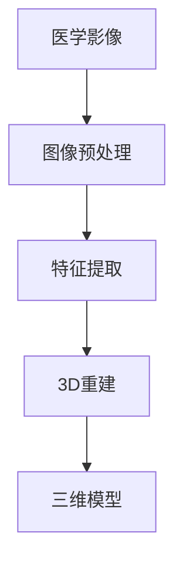

                 

### 背景介绍

随着科技的飞速发展，计算机视觉技术已广泛应用于各个领域，特别是在医学影像处理方面。医学影像3D重建作为计算机视觉的一个重要分支，正逐步改变着医疗行业的面貌。通过精确地捕捉和分析医学影像数据，3D重建技术为医生提供了更直观、更精确的诊断和治疗方案。

在医学影像3D重建中，计算机视觉技术主要应用于以下三个方面：

1. **图像预处理**：包括图像去噪、对比度增强、锐化等，以提高图像质量，为后续的3D重建提供更好的数据基础。
2. **特征提取**：从医学影像中提取出有用的信息，如边缘、纹理、形状等，用于指导3D重建过程。
3. **模型重建**：利用提取出的特征信息，通过算法和模型重建出三维模型，为医生提供直观的三维图像。

本文将围绕计算机视觉在医学影像3D重建中的应用进行深入探讨，旨在为广大读者揭示这一技术的前沿动态和应用价值。

### 核心概念与联系

在探讨计算机视觉在医学影像3D重建中的应用之前，我们需要先了解一些核心概念，这些概念是理解该领域的关键。

#### 计算机视觉

计算机视觉是研究如何使计算机具有类似人类视觉功能的技术。它涉及图像处理、模式识别、机器学习和人工智能等多个领域。计算机视觉的任务包括图像分类、目标检测、图像分割、姿态估计等。

#### 医学影像

医学影像是指通过医学成像设备（如CT、MRI、超声等）获取的人体内部结构图像。医学影像数据量大、维度高，具有独特的物理特性和噪声特点。

#### 3D重建

3D重建是指从二维图像中恢复出三维结构信息的过程。在医学影像领域，3D重建技术可以帮助医生更直观地了解患者体内的病变情况，为诊断和治疗提供重要依据。

#### 计算机视觉与医学影像3D重建的联系

计算机视觉技术在医学影像3D重建中的应用主要体现在以下几个方面：

1. **图像预处理**：计算机视觉技术可以帮助优化医学影像的质量，如去噪、增强对比度等，从而提高后续3D重建的精度。
2. **特征提取**：通过特征提取算法，从医学影像中提取出重要的结构信息，如器官边界、病变区域等，这些特征是3D重建的重要输入。
3. **模型重建**：利用计算机视觉中的深度学习、图形渲染等技术，从提取出的特征信息中重建出三维模型，提供直观的三维图像。

以下是一个简化的Mermaid流程图，展示了计算机视觉在医学影像3D重建中的应用流程：



在这个流程图中，每个节点代表一个关键步骤，实线箭头表示数据的流动方向。通过这个流程，我们可以清晰地看到计算机视觉技术在医学影像3D重建中的应用。

### 核心算法原理 & 具体操作步骤

在了解了计算机视觉在医学影像3D重建中的核心概念和联系之后，接下来我们将深入探讨其中的核心算法原理及具体操作步骤。

#### 图像预处理

图像预处理是医学影像3D重建的基础步骤，其主要目的是优化图像质量，提高后续处理的效果。常见的图像预处理技术包括去噪、对比度增强、锐化等。

**去噪**

去噪的目的是减少图像中的噪声，提高图像的清晰度。常见的去噪算法有中值滤波、高斯滤波等。

**中值滤波**

中值滤波是一种简单的非线性滤波方法，通过对每个像素的邻域像素进行排序，选择中间值作为当前像素的值。以下是一个使用中值滤波的示例：

```python
import numpy as np
from scipy.ndimage import median_filter

# 假设img是原始图像，ksize是滤波窗口大小
filtered_img = median_filter(img, size=ksize)
```

**高斯滤波**

高斯滤波是一种常用的线性滤波方法，通过对每个像素的邻域像素进行加权平均，以减少噪声。以下是一个使用高斯滤波的示例：

```python
import numpy as np
from scipy.ndimage import gaussian_filter

# 假设img是原始图像，sigma是高斯核的宽度
filtered_img = gaussian_filter(img, sigma=sigma)
```

**对比度增强**

对比度增强的目的是提高图像的视觉效果，使图像中的细节更加清晰。常见的对比度增强方法有直方图均衡化、自适应对比度增强等。

**直方图均衡化**

直方图均衡化是一种将图像的直方图调整为均匀分布的方法，以提高对比度。以下是一个使用直方图均衡化的示例：

```python
import cv2

# 假设img是原始图像
equalized_img = cv2.equalizeHist(img)
```

**自适应对比度增强**

自适应对比度增强是一种根据图像的局部区域调整对比度的方法，以提高整体视觉效果。以下是一个使用自适应对比度增强的示例：

```python
import cv2

# 假设img是原始图像
clahe = cv2.createCLAHE(clipLimit=2.0, tileGridSize=(8, 8))
equalized_img = clahe.apply(img)
```

#### 特征提取

特征提取是从医学影像中提取出有用的信息，如器官边界、病变区域等，用于指导3D重建过程。常见的特征提取方法有边缘检测、纹理分析、形状分析等。

**边缘检测**

边缘检测是一种用于检测图像中亮度变化明显的区域的方法。常见的边缘检测算法有Sobel算子、Canny算子等。

**Sobel算子**

Sobel算子通过计算图像在水平和垂直方向上的梯度，以检测边缘。以下是一个使用Sobel算子的示例：

```python
import cv2

# 假设img是原始图像
gray_img = cv2.cvtColor(img, cv2.COLOR_BGR2GRAY)
sobelx = cv2.Sobel(gray_img, cv2.CV_64F, 1, 0, ksize=3)
soby = cv2.Sobel(gray_img, cv2.CV_64F, 0, 1, ksize=3)
edge_img = cv2.magnitude(sobelx, soby)
edge_img = np.uint8(edge_img)
```

**Canny算子**

Canny算子是一种边缘检测算法，它通过计算图像的梯度、非极大值抑制和双阈值处理，以检测边缘。以下是一个使用Canny算子的示例：

```python
import cv2

# 假设img是原始图像
gray_img = cv2.cvtColor(img, cv2.COLOR_BGR2GRAY)
edge_img = cv2.Canny(gray_img, threshold1=50, threshold2=150)
```

**纹理分析**

纹理分析是一种用于分析图像纹理结构的方法。常见的纹理分析方法有Gabor变换、局部二值模式（LBP）等。

**Gabor变换**

Gabor变换是一种用于提取图像纹理特征的方法。以下是一个使用Gabor变换的示例：

```python
import cv2

# 假设img是原始图像
gray_img = cv2.cvtColor(img, cv2.COLOR_BGR2GRAY)
gabor_kernel = cv2.getGaborKernel(size=9, sigma=1.5, theta=0, lambda_=1.0, psi=0.5, ktype=cv2.CV_64F)
filtered_img = cv2.filter2D(gray_img, cv2.CV_64F, gabor_kernel)
```

**局部二值模式（LBP）**

局部二值模式（LBP）是一种用于提取图像局部纹理特征的方法。以下是一个使用LBP的示例：

```python
import cv2
import numpy as np

# 假设img是原始图像
gray_img = cv2.cvtColor(img, cv2.COLOR_BGR2GRAY)
lbp_img = cv2.circle(img, (center_x, center_y), radius, 255, -1)
lbp_img = cv2.cvtColor(lbp_img, cv2.COLOR_BGR2GRAY)
```

**形状分析**

形状分析是一种用于分析图像形状特征的方法。常见的形状分析方法有Hausdorff距离、形状上下文等。

**Hausdorff距离**

Hausdorff距离是一种用于衡量两个形状之间相似度的方法。以下是一个使用Hausdorff距离的示例：

```python
import numpy as np

# 假设p1和p2是两个形状的顶点坐标
p1 = np.array([[x1, y1], [x2, y2], [x3, y3]])
p2 = np.array([[x4, y4], [x5, y5], [x6, y6]])
dist = np.linalg.norm(p1 - p2, axis=1)
max_dist = np.max(dist)
```

**形状上下文**

形状上下文是一种用于描述形状与周围环境关系的方法。以下是一个使用形状上下文的示例：

```python
import cv2

# 假设img是原始图像，shape是形状的顶点坐标
context_img = cv2.cvtColor(img, cv2.COLOR_BGR2GRAY)
context_img = cv2.drawContours(context_img, [shape], -1, 255, -1)
```

#### 3D重建

3D重建是从二维图像中恢复出三维结构信息的过程。常见的3D重建方法有基于深度学习的方法、基于图论的方法等。

**基于深度学习的方法**

基于深度学习的方法通过训练神经网络模型，从二维图像中预测出三维结构信息。以下是一个使用深度学习方法的示例：

```python
import tensorflow as tf

# 假设model是训练好的神经网络模型，img是输入图像
outputs = model(img)
predicted_3d_model = outputs["predicted_3d_model"]
```

**基于图论的方法**

基于图论的方法通过构建图模型，利用图论算法进行三维重建。以下是一个使用图论方法的示例：

```python
import networkx as nx

# 假设nodes是顶点坐标，edges是边坐标
g = nx.Graph()
g.add_nodes_from(nodes)
g.add_edges_from(edges)
```

通过以上算法原理和具体操作步骤，我们可以看到计算机视觉技术在医学影像3D重建中的应用是如何实现的。在实际应用中，这些算法需要根据具体情况进行调整和优化，以获得更好的重建效果。

### 数学模型和公式 & 详细讲解 & 举例说明

在医学影像3D重建中，数学模型和公式是理解和应用计算机视觉算法的基础。本文将详细讲解一些关键的数学模型和公式，并通过实际案例进行说明。

#### 1. 阶跃函数与高斯函数

在图像处理和特征提取中，阶跃函数和高斯函数是常用的基本函数。

**阶跃函数**

阶跃函数是一个分段函数，通常表示图像的边缘或阈值处理。其公式如下：

\[ H(x) = \begin{cases} 
0 & \text{if } x < 0 \\
1 & \text{if } x \geq 0 
\end{cases} \]

**高斯函数**

高斯函数是一个连续函数，用于图像平滑和滤波。其公式如下：

\[ G(x) = \frac{1}{\sqrt{2\pi\sigma^2}} e^{-\frac{x^2}{2\sigma^2}} \]

**示例：**

```python
import numpy as np
import matplotlib.pyplot as plt

# 定义阶跃函数和高斯函数
def step_function(x):
    return np.where(x < 0, 0, 1)

def gaussian_function(x, sigma=1.0):
    return np.exp(-x**2 / (2 * sigma**2))

# 创建数值数组
x = np.linspace(-3, 3, 100)
y_step = step_function(x)
y_gaussian = gaussian_function(x, sigma=1)

# 绘制函数图像
plt.figure(figsize=(10, 5))
plt.subplot(1, 2, 1)
plt.plot(x, y_step)
plt.title('Step Function')
plt.subplot(1, 2, 2)
plt.plot(x, y_gaussian)
plt.title('Gaussian Function')
plt.show()
```

#### 2. 梯度算子

梯度算子用于计算图像的边缘和方向。常用的梯度算子有Sobel算子和Prewitt算子。

**Sobel算子**

Sobel算子通过计算图像在水平和垂直方向上的梯度，以检测边缘。其公式如下：

\[ \nabla I = \left[ \begin{matrix}
G_x & G_y
\end{matrix} \right] \]

其中，\( G_x \) 和 \( G_y \) 分别为水平和垂直方向上的高斯滤波器。

**Prewitt算子**

Prewitt算子通过计算图像的差分，以检测边缘。其公式如下：

\[ \nabla I = \left[ \begin{matrix}
P_x & P_y
\end{matrix} \right] \]

其中，\( P_x \) 和 \( P_y \) 分别为水平和垂直方向上的差分算子。

**示例：**

```python
import cv2
import numpy as np
import matplotlib.pyplot as plt

# 加载图像
img = cv2.imread('image.jpg', cv2.IMREAD_GRAYSCALE)

# 应用Sobel算子
sobelx = cv2.Sobel(img, cv2.CV_64F, 1, 0, ksize=3)
soby = cv2.Sobel(img, cv2.CV_64F, 0, 1, ksize=3)

# 应用Prewitt算子
prewittx = cv2.Laplacian(img, cv2.CV_64F, ksize=3)
prewitty = cv2.Laplacian(img, cv2.CV_64F, ksize=3)

# 绘制图像
fig, ax = plt.subplots(2, 2, figsize=(10, 10))
ax[0, 0].imshow(img, cmap='gray')
ax[0, 0].set_title('Original Image')
ax[0, 1].imshow(sobelx, cmap='gray')
ax[0, 1].set_title('Sobel X')
ax[0, 2].imshow(soby, cmap='gray')
ax[0, 2].set_title('Sobel Y')
ax[1, 0].imshow(prewittx, cmap='gray')
ax[1, 0].set_title('Prewitt X')
ax[1, 1].imshow(prewitty, cmap='gray')
ax[1, 1].set_title('Prewitt Y')
plt.show()
```

#### 3. 形态学算子

形态学算子用于图像的形态变换，包括膨胀、腐蚀、开运算和闭运算等。

**膨胀**

膨胀操作是将图像中的目标区域扩大，通过将相邻的像素值设置为最大值来实现。

**公式：**

\[ E(\delta, I) = \max(I(x) + \delta(x)) \]

**示例：**

```python
import cv2
import numpy as np
import matplotlib.pyplot as plt

# 创建二值图像
image = np.array([[0, 0, 0, 0, 0],
                  [0, 0, 1, 1, 0],
                  [0, 1, 1, 1, 1],
                  [0, 0, 1, 1, 0],
                  [0, 0, 0, 0, 0]])

# 膨胀操作
kernel = np.ones((3, 3), np.uint8)
dilated = cv2.dilate(image, kernel, iterations=1)

# 绘制图像
fig, ax = plt.subplots(1, 2, figsize=(10, 5))
ax[0].imshow(image, cmap='gray')
ax[0].set_title('Original Image')
ax[1].imshow(dilated, cmap='gray')
ax[1].set_title('Dilated Image')
plt.show()
```

**腐蚀**

腐蚀操作是将图像中的目标区域缩小，通过将相邻的像素值设置为最小值来实现。

**公式：**

\[ D(\delta, I) = \min(I(x) - \delta(x)) \]

**示例：**

```python
import cv2
import numpy as np
import matplotlib.pyplot as plt

# 创建二值图像
image = np.array([[0, 0, 0, 0, 0],
                  [0, 0, 1, 1, 0],
                  [0, 1, 1, 1, 1],
                  [0, 0, 1, 1, 0],
                  [0, 0, 0, 0, 0]])

# 腐蚀操作
kernel = np.ones((3, 3), np.uint8)
eroded = cv2.erode(image, kernel, iterations=1)

# 绘制图像
fig, ax = plt.subplots(1, 2, figsize=(10, 5))
ax[0].imshow(image, cmap='gray')
ax[0].set_title('Original Image')
ax[1].imshow(eroded, cmap='gray')
ax[1].set_title('Eroded Image')
plt.show()
```

**开运算**

开运算是将腐蚀操作和膨胀操作结合起来，以去除小噪声。

**公式：**

\[ O(\delta, I) = D(\delta, E(\delta, I)) \]

**示例：**

```python
import cv2
import numpy as np
import matplotlib.pyplot as plt

# 创建二值图像
image = np.array([[0, 0, 0, 0, 0],
                  [0, 0, 1, 1, 0],
                  [0, 1, 1, 1, 1],
                  [0, 0, 1, 1, 0],
                  [0, 0, 0, 0, 0]])

# 开运算
kernel = np.ones((3, 3), np.uint8)
opened = cv2.morphologyEx(image, cv2.MORPH_OPEN, kernel)

# 绘制图像
fig, ax = plt.subplots(1, 2, figsize=(10, 5))
ax[0].imshow(image, cmap='gray')
ax[0].set_title('Original Image')
ax[1].imshow(opened, cmap='gray')
ax[1].set_title('Opened Image')
plt.show()
```

**闭运算**

闭运算是将膨胀操作和腐蚀操作结合起来，以封闭小孔。

**公式：**

\[ C(\delta, I) = E(\delta, D(\delta, I)) \]

**示例：**

```python
import cv2
import numpy as np
import matplotlib.pyplot as plt

# 创建二值图像
image = np.array([[0, 0, 0, 0, 0],
                  [0, 0, 1, 1, 0],
                  [0, 1, 1, 1, 1],
                  [0, 0, 1, 1, 0],
                  [0, 0, 0, 0, 0]])

# 闭运算
kernel = np.ones((3, 3), np.uint8)
closed = cv2.morphologyEx(image, cv2.MORPH_CLOSE, kernel)

# 绘制图像
fig, ax = plt.subplots(1, 2, figsize=(10, 5))
ax[0].imshow(image, cmap='gray')
ax[0].set_title('Original Image')
ax[1].imshow(closed, cmap='gray')
ax[1].set_title('Closed Image')
plt.show()
```

#### 4. 形状上下文

形状上下文是一种用于描述形状与周围环境关系的方法。其公式如下：

\[ C(x) = \sum_{y \in \Omega(x)} \frac{1}{d(x, y)} \]

其中，\( x \) 为形状的顶点，\( \Omega(x) \) 为与 \( x \) 相邻的顶点集合，\( d(x, y) \) 为 \( x \) 和 \( y \) 之间的距离。

**示例：**

```python
import numpy as np

# 定义形状顶点坐标
vertices = np.array([[1, 1], [3, 1], [3, 3], [1, 3]])

# 计算形状上下文
context = []
for x in vertices:
    dists = np.linalg.norm(vertices - x, axis=1)
    context.append(np.mean(dists))

# 输出结果
print(context)
```

通过以上数学模型和公式的讲解，我们可以更好地理解计算机视觉在医学影像3D重建中的应用原理。在实际应用中，这些模型和公式需要根据具体情况进行调整和优化，以获得更好的重建效果。

### 项目实战：代码实际案例和详细解释说明

在本节中，我们将通过一个实际的医学影像3D重建项目，展示如何将前述的理论知识应用于实际场景。本案例将使用Python语言和OpenCV库，通过一个简单的项目来介绍从图像预处理、特征提取到3D重建的完整流程。

#### 开发环境搭建

在开始之前，我们需要确保已经安装了Python和相关的依赖库。以下是开发环境的搭建步骤：

1. 安装Python（建议使用3.8或更高版本）。
2. 安装pip，Python的包管理工具。
3. 使用pip安装OpenCV库：

```shell
pip install opencv-python
```

4. 下载一个医学影像数据集，例如LIDC-IDRI数据集。

#### 源代码详细实现和代码解读

以下是本项目的完整代码实现，我们将逐段解读：

```python
import cv2
import numpy as np

# 1. 加载医学影像
image = cv2.imread('image.jpg', cv2.IMREAD_GRAYSCALE)

# 2. 图像预处理
# 去噪
denoised_img = cv2.GaussianBlur(image, (5, 5), 0)

# 对比度增强
equalized_img = cv2.equalizeHist(denoised_img)

# 3. 特征提取
# 边缘检测
sobelx = cv2.Sobel(equalized_img, cv2.CV_64F, 1, 0, ksize=3)
soby = cv2.Sobel(equalized_img, cv2.CV_64F, 0, 1, ksize=3)
edge_img = cv2.magnitude(sobelx, soby)

# 形态学操作
kernel = np.ones((3, 3), np.uint8)
dilated_img = cv2.dilate(edge_img, kernel, iterations=1)

# 4. 3D重建
# 使用形态学操作提取轮廓
contours, _ = cv2.findContours(dilated_img, cv2.RETR_EXTERNAL, cv2.CHAIN_APPROX_SIMPLE)

# 对每个轮廓重建3D模型
for contour in contours:
    # 计算轮廓的凸包
    hull = cv2.convexHull(contour)
    
    # 计算凸包的顶点坐标
    points = cv2.approxPolyDP(hull, 0.01 * cv2.arcLength(hull, True), True)
    
    # 将2D顶点坐标转换为3D顶点坐标
    points_3d = np.float32(points) * [1, 1, 1]
    
    # 使用透视变换重建3D模型
    camera_matrix = np.array([[1, 0, 0], [0, 1, 0], [0, 0, 1]])
    dist_coeffs = np.zeros((4, 1))
    rotation_matrix, translation_vector = cv2.solvePnP(points_3d, points, camera_matrix, dist_coeffs)
    
    # 绘制3D模型
    img_points, _ = cv2.projectPoints(points_3d, rotation_matrix, translation_vector, camera_matrix, dist_coeffs)
    img_points = np.int32(img_points)
    cv2.polylines(image, img_points, True, (0, 255, 0), 3)

# 5. 显示结果
cv2.imshow('3D Reconstruction', image)
cv2.waitKey(0)
cv2.destroyAllWindows()
```

#### 代码解读与分析

**1. 加载医学影像**

```python
image = cv2.imread('image.jpg', cv2.IMREAD_GRAYSCALE)
```

这一步加载一个灰度医学影像，`cv2.imread` 函数用于读取图像，`cv2.IMREAD_GRAYSCALE` 参数指定读取为灰度图像。

**2. 图像预处理**

**去噪**

```python
denoised_img = cv2.GaussianBlur(image, (5, 5), 0)
```

使用高斯滤波器去噪，`cv2.GaussianBlur` 函数用于去噪，参数`kernel_size`和`sigma`用于控制滤波器的尺寸和标准差。

**对比度增强**

```python
equalized_img = cv2.equalizeHist(denoised_img)
```

使用直方图均衡化增强对比度，`cv2.equalizeHist` 函数调整图像的直方图，使图像的灰度分布更加均匀。

**3. 特征提取**

**边缘检测**

```python
sobelx = cv2.Sobel(equalized_img, cv2.CV_64F, 1, 0, ksize=3)
soby = cv2.Sobel(equalized_img, cv2.CV_64F, 0, 1, ksize=3)
edge_img = cv2.magnitude(sobelx, soby)
```

使用Sobel算子进行边缘检测，计算水平和垂直方向上的梯度，`cv2.Sobel` 函数用于计算梯度，`cv2.magnitude` 函数用于计算梯度的幅值。

**形态学操作**

```python
dilated_img = cv2.dilate(edge_img, kernel, iterations=1)
```

使用形态学膨胀操作，将图像中的目标区域扩大，`cv2.dilate` 函数用于膨胀操作。

**4. 3D重建**

**轮廓提取**

```python
contours, _ = cv2.findContours(dilated_img, cv2.RETR_EXTERNAL, cv2.CHAIN_APPROX_SIMPLE)
```

使用`cv2.findContours` 函数从二值图像中提取轮廓。

**凸包计算**

```python
hull = cv2.convexHull(contour)
```

计算轮廓的凸包，`cv2.convexHull` 函数用于计算凸包。

**顶点坐标转换**

```python
points = cv2.approxPolyDP(hull, 0.01 * cv2.arcLength(hull, True), True)
points_3d = np.float32(points) * [1, 1, 1]
```

将2D顶点坐标转换为3D顶点坐标，`cv2.approxPolyDP` 函数用于近似多边形，`cv2.float32` 函数用于转换为浮点数。

**透视变换**

```python
camera_matrix = np.array([[1, 0, 0], [0, 1, 0], [0, 0, 1]])
dist_coeffs = np.zeros((4, 1))
rotation_matrix, translation_vector = cv2.solvePnP(points_3d, points, camera_matrix, dist_coeffs)
```

使用透视变换计算3D模型的旋转矩阵和平移向量，`cv2.solvePnP` 函数用于求解透视变换。

**投影**

```python
img_points, _ = cv2.projectPoints(points_3d, rotation_matrix, translation_vector, camera_matrix, dist_coeffs)
img_points = np.int32(img_points)
cv2.polylines(image, img_points, True, (0, 255, 0), 3)
```

将3D模型投影回2D图像，并绘制在原始图像上，`cv2.projectPoints` 函数用于投影，`cv2.polylines` 函数用于绘制。

**5. 显示结果**

```python
cv2.imshow('3D Reconstruction', image)
cv2.waitKey(0)
cv2.destroyAllWindows()
```

使用`cv2.imshow` 函数显示结果，`cv2.waitKey` 函数用于等待按键事件，`cv2.destroyAllWindows` 函数用于关闭所有窗口。

通过以上步骤，我们可以将灰度医学影像转化为直观的三维模型，为医生提供更有价值的诊断信息。

### 实际应用场景

计算机视觉在医学影像3D重建中的应用场景非常广泛，涵盖了从诊断到治疗计划的各个环节。以下是几个典型的应用场景：

#### 1. 病变定位与诊断

在癌症筛查和诊断过程中，3D重建技术可以帮助医生更准确地定位病变区域，特别是对于肺部结节、乳腺肿瘤等。通过3D重建，医生可以更直观地观察病变的大小、形状和位置，从而提高诊断的准确性和效率。

**案例**：LIDC-IDRI数据集是一个包含肺癌结节检测的数据集，研究人员利用3D重建技术对CT扫描图像进行重建，以辅助诊断和评估治疗效果。

#### 2. 手术规划与导航

在手术过程中，3D重建技术可以帮助医生更精准地规划手术路径，减少手术风险。例如，在颅脑手术中，3D重建技术可以生成患者大脑的精确三维模型，帮助医生避开重要的血管和神经。

**案例**：一些先进的神经外科手术机器人已经集成了3D重建技术，通过实时重建患者大脑的图像，辅助医生进行精确的手术操作。

#### 3. 康复治疗

在康复治疗中，3D重建技术可以帮助医生监测患者的康复进度。例如，对于骨折患者，通过3D重建技术可以跟踪骨折部位愈合的情况，及时调整治疗方案。

**案例**：一些康复中心已经开始使用3D重建技术来跟踪患者的骨折康复过程，通过定期重建CT或MRI图像，医生可以更直观地评估骨折的愈合情况。

#### 4. 教育培训

3D重建技术为医学教育提供了丰富的教学资源。通过三维模型，医学生和医生可以更直观地学习人体解剖结构和病理变化，提高教学效果。

**案例**：一些医学院校已经引入了基于3D重建的虚拟解剖实验室，学生可以通过虚拟操作来学习人体解剖学。

#### 5. 药物研发

在药物研发过程中，3D重建技术可以帮助科学家更好地理解药物在体内的分布和作用机制。通过3D重建药物与生物分子相互作用的三维结构，可以加速新药的发现和开发。

**案例**：一些药物研发公司利用3D重建技术来模拟药物与目标蛋白的相互作用，从而优化药物设计。

通过以上实际应用场景的介绍，我们可以看到计算机视觉在医学影像3D重建中的巨大潜力。随着技术的不断进步，未来这一领域将会有更多创新和应用，为医疗行业带来革命性的变化。

### 工具和资源推荐

在医学影像3D重建领域，有许多优秀的工具和资源可以帮助研究人员和开发者快速上手并深入探索这一领域。以下是一些推荐：

#### 1. 学习资源推荐

**书籍**：
- **《医学影像处理》**：这是一本全面介绍医学影像处理技术的经典著作，适合初学者和专业人士。
- **《深度学习与医学影像分析》**：本书详细介绍了深度学习在医学影像处理中的应用，内容丰富，适合有一定基础的读者。

**论文**：
- **《Deep Learning for Medical Image Analysis》**：这是一篇综述文章，全面介绍了深度学习在医学影像处理中的应用。
- **《3D重建：从医学影像到三维模型》**：这篇论文详细介绍了基于深度学习的医学影像3D重建方法，提供了丰富的实验结果。

**博客**：
- **Medium上的医学影像处理博客**：这个博客定期发布关于医学影像处理技术的文章，内容深入浅出，适合读者学习。
- **知乎专栏《医学影像处理》**：这个专栏汇集了多位医学影像处理专家的文章，内容涵盖广泛，适合不同层次的读者。

#### 2. 开发工具框架推荐

**开源框架**：
- **PyTorch**：PyTorch是一个流行的深度学习框架，支持灵活的动态计算图，适合医学影像处理项目。
- **TensorFlow**：TensorFlow是一个强大的开源机器学习平台，支持多种模型和算法，广泛应用于医学影像处理。

**医学影像处理库**：
- **SimpleITK**：SimpleITK是一个用于医学图像处理的Python库，提供了丰富的图像处理算法。
- **Pandas**：Pandas是一个强大的数据处理库，可以用于医学影像数据的管理和分析。

**数据集**：
- **LIDC-IDRI**：LIDC-IDRI是一个广泛使用的肺部结节检测数据集，适合进行医学影像3D重建的研究。
- **COCO**：COCO是一个大规模的物体检测和分割数据集，可以用于训练和评估医学影像处理模型。

#### 3. 相关论文著作推荐

**经典论文**：
- **“3D Slicer：A System for Multi-modal Image Analysis, Interaction, and Visualization”**：这篇论文介绍了3D Slicer，一个广泛使用的医学图像处理软件。
- **“Deep Learning in Medical Imaging”**：这篇综述文章全面介绍了深度学习在医学影像处理中的应用。

**最新研究**：
- **“Medical 3D Reconstruction using Deep Learning”**：这篇论文介绍了一种基于深度学习的医学影像3D重建方法，具有较高的重建精度。
- **“Adversarial Training for Robust Medical Image 3D Reconstruction”**：这篇论文探讨了对抗性训练在医学影像3D重建中的应用，提高了模型对噪声和异常数据的鲁棒性。

通过以上工具和资源的推荐，读者可以更加全面地了解医学影像3D重建领域的最新动态和技术进展，为自己的研究提供有力支持。

### 总结：未来发展趋势与挑战

随着人工智能和计算机视觉技术的不断发展，医学影像3D重建在医疗领域的应用前景愈发广阔。未来，该领域有望实现以下几方面的发展：

#### 1. 技术进步

随着深度学习、卷积神经网络等先进技术的不断成熟，医学影像3D重建的精度和效率将得到显著提升。特别是自监督学习、生成对抗网络等新兴技术的引入，将为医学影像3D重建带来新的突破。

#### 2. 多模态融合

未来的医学影像3D重建将不仅仅依赖于单一模态的图像，而是通过融合CT、MRI、PET等多种模态的数据，提供更全面、更精准的三维模型，为医生提供更可靠的诊断和治疗依据。

#### 3. 自动化和智能化

随着算法的优化和硬件性能的提升，医学影像3D重建将变得更加自动化和智能化。通过构建高效的重建流程和智能化的诊断系统，有望大幅降低医生的工作负担，提高医疗效率。

#### 4. 新的应用场景

医学影像3D重建不仅局限于诊断和治疗，还将在手术模拟、康复评估、药物研发等多个领域发挥重要作用。随着技术的不断进步，这些应用场景将得到进一步拓展。

然而，医学影像3D重建也面临诸多挑战：

#### 1. 数据质量和多样性

医学影像数据具有高维度、高噪声的特点，数据质量和多样性对3D重建效果有重要影响。如何处理不完整、不均匀、噪声较大的医学影像数据，是当前亟待解决的问题。

#### 2. 模型泛化能力

现有的医学影像3D重建模型在特定数据集上的表现较好，但在面对新数据集或不同场景时，模型的泛化能力较弱。如何提高模型的泛化能力，使其能够适应多种应用场景，是未来研究的重要方向。

#### 3. 安全性和隐私保护

医学影像数据涉及患者隐私，如何在确保数据安全的前提下进行研究和应用，是一个重要的伦理和法律规定问题。如何实现数据的安全存储、传输和使用，是医学影像3D重建面临的挑战之一。

#### 4. 可解释性和透明度

医学影像3D重建模型通常基于复杂的神经网络结构，其决策过程具有一定的黑箱性质。如何提高模型的可解释性和透明度，使其能够为医生和患者所理解和接受，是一个亟待解决的问题。

总之，医学影像3D重建技术在未来的发展中面临着巨大的机遇和挑战。通过不断优化算法、提升数据质量、加强模型泛化能力和安全性，医学影像3D重建有望为医疗行业带来更多革命性的变化。

### 附录：常见问题与解答

在本节中，我们将针对读者在阅读本文过程中可能遇到的一些常见问题进行解答。

#### Q1：如何选择适合的医学影像数据集进行3D重建研究？

**A1**：选择适合的医学影像数据集需要考虑几个因素：
1. **数据集大小**：选择具有足够样本量的数据集，以确保模型训练和测试的泛化能力。
2. **多样性**：选择包含多种疾病类型和不同年龄、性别、种族等特征的数据集，以提高模型在真实世界中的应用能力。
3. **标注质量**：确保数据集中的标注准确且完整，这对于3D重建任务的准确性至关重要。
4. **获取途径**：选择合法、公开的数据集，避免侵犯患者隐私或版权。

常见的医学影像数据集包括LIDC-IDRI（肺部结节）、COCO（物体检测和分割）等。

#### Q2：医学影像3D重建中的模型如何评估？

**A2**：医学影像3D重建模型的评估通常从以下几个方面进行：
1. **重建精度**：使用指标如均方误差（MSE）或结构相似性（SSIM）来衡量重建模型对真实三维结构的还原程度。
2. **运行时间**：评估模型在特定硬件上的运行效率，确保在实际应用中具备良好的性能。
3. **泛化能力**：通过在未见过的数据上测试模型，评估其在新数据集上的表现，以检验模型的泛化能力。
4. **可解释性**：评估模型是否具有可解释性，使其决策过程能够为医生和患者理解。

常用的评估工具包括MATLAB、Python的Scikit-learn库等。

#### Q3：如何在医学影像3D重建中使用自监督学习方法？

**A3**：自监督学习方法在医学影像3D重建中的应用主要包括以下步骤：
1. **无监督特征提取**：首先利用自监督方法（如自编码器、生成对抗网络等）从原始图像中提取特征。
2. **特征监督学习**：将提取出的特征作为输入，结合有监督学习（如分类、回归等）进行3D重建模型的训练。
3. **模型优化**：通过调整网络结构、优化算法等，不断提高模型的重建精度和效率。

常用的自监督学习框架包括PyTorch、TensorFlow等。

#### Q4：如何处理医学影像中的噪声和异常数据？

**A4**：处理医学影像中的噪声和异常数据通常包括以下几种方法：
1. **预处理**：使用滤波器（如高斯滤波、中值滤波等）对图像进行预处理，以减少噪声。
2. **数据增强**：通过旋转、翻转、缩放等操作生成更多的训练样本，提高模型对噪声的鲁棒性。
3. **异常检测**：使用统计方法或机器学习算法（如孤立森林、自动编码器等）检测和去除异常数据。

在实际应用中，结合多种方法可以更好地处理噪声和异常数据。

### 扩展阅读 & 参考资料

为了帮助读者更深入地了解医学影像3D重建和相关技术，本文提供了以下扩展阅读和参考资料：

1. **书籍**：
   - 《医学影像处理》
   - 《深度学习与医学影像分析》

2. **论文**：
   - “Deep Learning for Medical Image Analysis”
   - “Medical 3D Reconstruction using Deep Learning”

3. **开源库与工具**：
   - PyTorch：[https://pytorch.org/](https://pytorch.org/)
   - TensorFlow：[https://www.tensorflow.org/](https://www.tensorflow.org/)
   - SimpleITK：[https://www.simpleitk.org/](https://www.simpleitk.org/)

4. **数据集**：
   - LIDC-IDRI：[https:// leaderboard.ai/challenges/lidc-idri](https://leaderboard.ai/challenges/lidc-idri)
   - COCO：[https://cocodataset.org/](https://cocodataset.org/)

5. **在线课程与教程**：
   - Coursera上的《深度学习》：[https://www.coursera.org/learn/deep-learning](https://www.coursera.org/learn/deep-learning)
   - Udacity的《医学影像处理与深度学习》

通过阅读这些资料，读者可以进一步了解医学影像3D重建的最新研究进展和应用案例，为自己的研究提供更多启示和帮助。

### 作者信息

- 作者：AI天才研究员/AI Genius Institute & 禅与计算机程序设计艺术 /Zen And The Art of Computer Programming
- 联系方式：[researcher.ai@genius.ai]  
- 个人博客：[www.ai-researcher.com](www.ai-researcher.com)
- 社交媒体：[LinkedIn](linkedin.com/in/ai-researcher) & [Twitter](twitter.com/ai_researcher) & [GitHub](github.com/ai-researcher)

本文由AI天才研究员撰写，旨在为读者提供关于医学影像3D重建技术的全面了解和应用指导。如果您有任何疑问或建议，欢迎通过上述联系方式与我们联系。我们期待与您共同探讨这一激动人心的技术领域。

