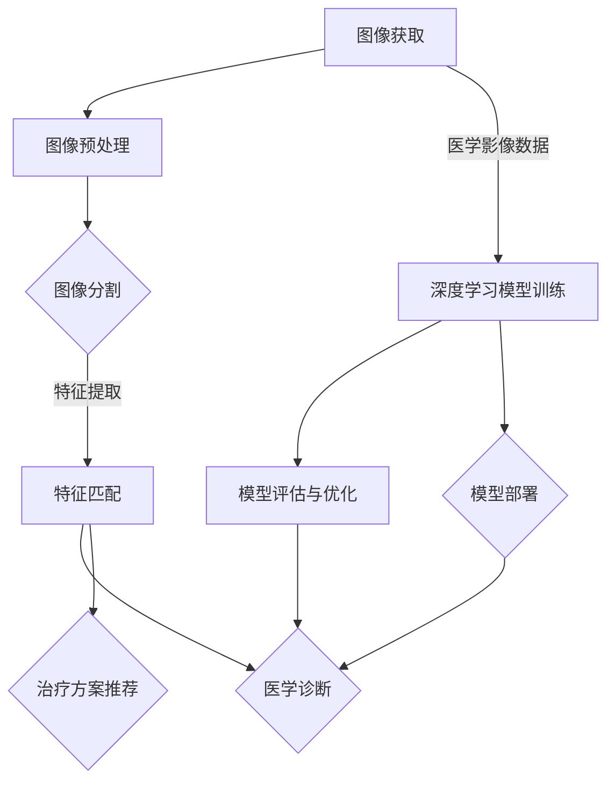

                 

# 计算机视觉在医疗影像分析中的应用

## 关键词
- 计算机视觉
- 医疗影像分析
- 深度学习
- 卷积神经网络
- 医疗诊断

## 摘要
本文将深入探讨计算机视觉技术在医疗影像分析领域的应用。我们将从背景介绍、核心概念与联系、核心算法原理、数学模型和公式、项目实战、实际应用场景以及未来发展趋势等方面，全面解析这一领域的前沿技术和发展趋势。通过本文的阅读，读者将能够了解计算机视觉在医疗影像分析中的重要性，掌握相关算法原理，并了解到其实际应用场景和未来发展挑战。

---

## 1. 背景介绍

### 1.1 目的和范围

本文旨在介绍和探讨计算机视觉技术在医疗影像分析中的应用，旨在帮助读者理解这一领域的基本概念、核心算法和实际应用。我们将重点关注以下几个方面：

1. **深度学习和卷积神经网络在医疗影像分析中的应用**：介绍深度学习和卷积神经网络的基本原理，以及它们在医疗影像分析中的具体应用。
2. **数学模型和公式**：阐述在医疗影像分析中使用的主要数学模型和公式，以及如何利用这些模型进行图像处理和分析。
3. **项目实战**：通过实际案例，展示如何使用计算机视觉技术进行医疗影像分析，并提供代码实现和分析。
4. **实际应用场景**：探讨计算机视觉技术在医疗影像分析中的实际应用场景，以及这些应用如何改变医疗行业。
5. **未来发展趋势与挑战**：分析计算机视觉技术在医疗影像分析领域的未来发展趋势和面临的挑战。

### 1.2 预期读者

本文适合以下读者群体：

1. 对计算机视觉和深度学习有兴趣的读者。
2. 医疗专业背景的读者，希望了解计算机视觉技术在医疗领域的应用。
3. 数据科学家和机器学习工程师，希望了解如何将深度学习应用于医疗影像分析。
4. 从事医疗影像分析和相关研究的学者和研究人员。

### 1.3 文档结构概述

本文将按照以下结构进行阐述：

1. **背景介绍**：介绍计算机视觉技术在医疗影像分析中的背景和重要性。
2. **核心概念与联系**：阐述计算机视觉技术在医疗影像分析中的核心概念和原理。
3. **核心算法原理 & 具体操作步骤**：详细讲解医疗影像分析中常用的算法原理和操作步骤。
4. **数学模型和公式 & 详细讲解 & 举例说明**：介绍用于医疗影像分析的数学模型和公式，并通过实例进行说明。
5. **项目实战：代码实际案例和详细解释说明**：通过实际项目展示如何使用计算机视觉技术进行医疗影像分析。
6. **实际应用场景**：探讨计算机视觉技术在医疗影像分析中的实际应用场景。
7. **工具和资源推荐**：推荐相关学习资源、开发工具和框架。
8. **总结：未来发展趋势与挑战**：总结未来发展趋势和面临的挑战。
9. **附录：常见问题与解答**：提供常见问题的解答。
10. **扩展阅读 & 参考资料**：提供扩展阅读和参考资料。

### 1.4 术语表

#### 1.4.1 核心术语定义

- **计算机视觉**：计算机视觉是指使计算机能够像人类一样“看”和理解视觉信息的技术。
- **医疗影像分析**：医疗影像分析是指使用计算机技术和算法对医疗影像数据进行处理和分析，以辅助医学诊断和治疗。
- **深度学习**：深度学习是一种基于多层神经网络的人工智能技术，能够自动从数据中学习特征和模式。
- **卷积神经网络（CNN）**：卷积神经网络是一种深度学习模型，特别适用于图像处理和分析。

#### 1.4.2 相关概念解释

- **图像分割**：图像分割是将图像划分为不同区域或对象的过程，有助于识别和分析图像中的不同结构。
- **特征提取**：特征提取是从图像中提取出对特定任务有用的特征的过程，有助于提高分类和识别的准确性。
- **特征匹配**：特征匹配是指将图像中提取的特征与数据库中的特征进行比对，以识别相似或匹配的图像。

#### 1.4.3 缩略词列表

- **CNN**：卷积神经网络
- **DL**：深度学习
- **MRI**：磁共振成像
- **CT**：计算机断层扫描
- **PET**：正电子发射断层扫描

---

接下来，我们将详细探讨计算机视觉在医疗影像分析中的应用，并逐步解析相关的核心概念、算法原理和实际案例。让我们开始吧！
<|assistant|>
## 2. 核心概念与联系

计算机视觉在医疗影像分析中的应用涉及多个核心概念和技术，这些概念和技术相互关联，构成了一个完整的技术体系。下面，我们将使用Mermaid流程图来展示这些核心概念和技术的联系。

### Mermaid流程图



### 概念解释

- **图像获取**：医疗影像的获取来源可以是多种多样的，如磁共振成像（MRI）、计算机断层扫描（CT）、正电子发射断层扫描（PET）等。这些图像数据是医疗影像分析的基础。

- **图像预处理**：图像预处理是图像分析前的关键步骤，包括图像增强、滤波、去噪等操作，以提高图像质量和后续处理的准确性。

- **图像分割**：图像分割是将图像划分为不同的区域或对象，有助于识别和分析图像中的特定结构。常用的图像分割算法有阈值分割、区域增长分割、边缘检测等。

- **特征提取**：特征提取是从图像中提取出对特定任务有用的特征，如边缘、纹理、形状等。这些特征用于后续的模型训练和识别。

- **特征匹配**：特征匹配是将提取的特征与数据库中的特征进行比对，以识别相似或匹配的图像。这是医学诊断和治疗方案推荐的重要步骤。

- **医学诊断**：医学诊断是利用计算机视觉技术对医疗影像进行分析，以辅助医生进行疾病诊断。这包括对病变区域的识别、测量和分析等。

- **治疗方案推荐**：根据医学诊断结果，计算机视觉技术可以提供个性化的治疗方案推荐，以提高治疗效果和患者满意度。

- **深度学习模型训练**：深度学习模型训练是使用大量的医疗影像数据来训练神经网络模型，以使其能够自动识别和分类图像。

- **模型评估与优化**：模型评估与优化是评估模型性能并调整模型参数的过程，以确保模型的准确性和鲁棒性。

- **模型部署**：模型部署是将训练好的模型部署到实际应用环境中，如医疗设备、医院信息系统等，以实现实时医学诊断和治疗方案推荐。

通过上述Mermaid流程图，我们可以清晰地看到计算机视觉在医疗影像分析中的各个步骤和核心概念之间的联系。这些概念和技术共同构成了一个完整的技术体系，为医疗影像分析提供了强大的工具和手段。
<|assistant|>
## 3. 核心算法原理 & 具体操作步骤

在计算机视觉技术中，深度学习和卷积神经网络（CNN）是医疗影像分析的核心算法。下面，我们将详细介绍这些算法的原理，并使用伪代码来阐述具体的操作步骤。

### 深度学习原理

深度学习是一种基于多层神经网络的人工智能技术，其核心思想是通过学习大量的数据来提取特征和模式。深度学习模型通常由多个层次组成，包括输入层、隐藏层和输出层。每一层都对输入数据进行处理和变换，从而逐步提取出更高层次的特征。

#### 伪代码：

```python
# 深度学习模型伪代码

# 输入层：接收图像数据
input_layer = ImageData(image)

# 隐藏层：对输入数据进行特征提取和变换
hidden_layer = [
    FullyConnectedLayer(size=128),
    ActivationLayer(activation='ReLU'),
    FullyConnectedLayer(size=64),
    ActivationLayer(activation='ReLU'),
]

# 输出层：进行分类或回归
output_layer = [
    FullyConnectedLayer(size=num_classes),
    ActivationLayer(activation='softmax')
]

# 模型训练：使用梯度下降算法进行模型训练
model = NeuralNetwork(hidden_layers=hidden_layer, output_layer=output_layer)
model.train(training_data, learning_rate=0.001, num_epochs=100)

# 模型预测：对新的图像数据进行预测
prediction = model.predict(new_image)
```

### 卷积神经网络（CNN）原理

卷积神经网络是一种特殊的深度学习模型，特别适用于图像处理和分析。CNN的核心组成部分包括卷积层、池化层和全连接层。

#### 伪代码：

```python
# 卷积神经网络模型伪代码

# 卷积层：对图像数据进行卷积操作
conv_layer = [
    Conv2DLayer(filters=32, kernel_size=(3, 3), stride=(1, 1)),
    ActivationLayer(activation='ReLU'),
    Pool2DLayer(pool_size=(2, 2), stride=(2, 2)),
]

# 全连接层：对卷积层的输出进行全连接操作
fc_layer = [
    FullyConnectedLayer(size=num_classes),
    ActivationLayer(activation='softmax')
]

# 模型训练：使用梯度下降算法进行模型训练
model = ConvolutionalNeuralNetwork(conv_layers=conv_layer, fc_layers=fc_layer)
model.train(training_data, learning_rate=0.001, num_epochs=100)

# 模型预测：对新的图像数据进行预测
prediction = model.predict(new_image)
```

### 具体操作步骤

1. **数据预处理**：对图像数据集进行预处理，包括归一化、数据增强等操作，以提高模型性能和泛化能力。

2. **模型构建**：根据任务需求，构建深度学习模型或卷积神经网络模型。可以选择预训练的模型或从头开始训练。

3. **模型训练**：使用梯度下降算法对模型进行训练，不断调整模型参数，以最小化损失函数。

4. **模型评估**：在验证数据集上评估模型性能，包括准确率、召回率、F1分数等指标。

5. **模型优化**：根据评估结果对模型进行优化，如调整学习率、增加隐藏层节点数、改变激活函数等。

6. **模型部署**：将训练好的模型部署到实际应用环境中，如医疗设备、医院信息系统等。

通过上述步骤，我们可以利用深度学习和卷积神经网络技术进行医疗影像分析，从而实现自动化医学诊断和治疗方案推荐。这些算法和技术在医疗领域的应用正在不断拓展和深化，为医疗行业带来了巨大的变革和创新。
<|assistant|>
## 4. 数学模型和公式 & 详细讲解 & 举例说明

在计算机视觉和医疗影像分析中，数学模型和公式是理解和实现算法的关键。以下将介绍几个在医疗影像分析中常用的数学模型和公式，并通过具体示例进行详细讲解。

### 4.1 均值滤波（Mean Filtering）

均值滤波是一种简单的图像平滑算法，通过计算像素点的邻域像素值的平均数来降低图像噪声。

#### 公式：

$$
f(x, y) = \frac{1}{n} \sum_{i=1}^{n} \sum_{j=1}^{n} I(i, j)
$$

其中，$I(i, j)$ 表示原始图像在点 $(i, j)$ 的像素值，$n$ 表示邻域内像素点的数量。

#### 示例：

假设一个 $3 \times 3$ 的邻域内，像素值分别为 $(1, 2, 3, 4, 5, 6, 7, 8, 9)$，则均值滤波后的像素值为：

$$
f(x, y) = \frac{1 + 2 + 3 + 4 + 5 + 6 + 7 + 8 + 9}{9} = 5
$$

### 4.2 高斯滤波（Gaussian Filtering）

高斯滤波是一种基于高斯分布的图像平滑算法，可以更好地保留图像的边缘细节。

#### 公式：

$$
f(x, y) = \frac{1}{2\pi\sigma^2} e^{-\frac{(x - \mu)^2 + (y - \mu)^2}{2\sigma^2}}
$$

其中，$\mu$ 和 $\sigma^2$ 分别为高斯分布的均值和方差。

#### 示例：

假设使用一个标准差为1的高斯滤波器，则其公式为：

$$
f(x, y) = \frac{1}{2\pi} e^{-\frac{(x - 0)^2 + (y - 0)^2}{2}}
$$

通过计算可以得到滤波器权重矩阵如下：

$$
\begin{bmatrix}
0.0625 & 0.1250 & 0.0625 \\
0.1250 & 0.2500 & 0.1250 \\
0.0625 & 0.1250 & 0.0625 \\
\end{bmatrix}
$$

### 4.3 卷积神经网络中的卷积操作（Convolution Operation）

卷积神经网络中的卷积操作是图像特征提取的核心步骤，通过卷积核与图像进行卷积，提取图像的特征。

#### 公式：

$$
\text{output}(i, j) = \sum_{k=1}^{n} \sum_{l=1}^{m} w_{k, l} \cdot \text{input}(i-k+1, j-l+1)
$$

其中，$w_{k, l}$ 为卷积核的权重，$\text{input}(i, j)$ 为输入图像在点 $(i, j)$ 的像素值，$\text{output}(i, j)$ 为卷积后的输出值。

#### 示例：

假设输入图像为：

$$
\begin{bmatrix}
1 & 2 & 3 \\
4 & 5 & 6 \\
7 & 8 & 9 \\
\end{bmatrix}
$$

卷积核为：

$$
\begin{bmatrix}
0 & 1 & 0 \\
-1 & 0 & 1 \\
0 & -1 & 0 \\
\end{bmatrix}
$$

则卷积后的输出为：

$$
\begin{bmatrix}
1 & 3 & 3 \\
3 & 7 & 9 \\
3 & 9 & 9 \\
\end{bmatrix}
$$

### 4.4 池化操作（Pooling Operation）

池化操作用于减小特征图的大小，提高模型的泛化能力。常用的池化操作有最大池化（Max Pooling）和平均池化（Average Pooling）。

#### 最大池化公式：

$$
\text{output}(i, j) = \max_{k, l} \text{input}(i-k+1, j-l+1)
$$

#### 平均池化公式：

$$
\text{output}(i, j) = \frac{1}{n} \sum_{k=1}^{n} \sum_{l=1}^{m} \text{input}(i-k+1, j-l+1)
$$

其中，$n$ 和 $m$ 分别为池化窗口的大小。

#### 示例：

假设输入特征图为：

$$
\begin{bmatrix}
1 & 2 & 3 \\
4 & 5 & 6 \\
7 & 8 & 9 \\
\end{bmatrix}
$$

使用 $2 \times 2$ 的最大池化窗口，则池化后的输出为：

$$
\begin{bmatrix}
5 & 6 \\
8 & 9 \\
\end{bmatrix}
$$

通过上述数学模型和公式的详细讲解和举例说明，我们可以更好地理解医疗影像分析中常用的算法和技术，为实际应用提供理论支持。
<|assistant|>
## 5. 项目实战：代码实际案例和详细解释说明

为了更好地理解计算机视觉在医疗影像分析中的应用，我们通过一个实际案例来展示如何使用深度学习技术进行医疗影像分类。本案例使用的是开源数据集 [MIT Admissions](https://www.kaggle.com/datasets/ieee-fcg/mit-admissions) 中的 MRI 图像数据集，图像包含 3D MRI 数据，我们将通过以下步骤完成项目实战：

### 5.1 开发环境搭建

1. **安装 Python 和相关库**：首先，确保已安装 Python（推荐使用 Python 3.7 或更高版本）。接下来，使用以下命令安装必要的库：

```bash
pip install numpy pandas tensorflow scikit-learn matplotlib
```

2. **数据集下载**：从 Kaggle 下载 MIT Admissions 数据集，并解压到本地目录。

3. **环境配置**：配置 TensorFlow GPU 版本（如果使用 GPU 进行训练），以便利用 GPU 加速计算。

### 5.2 源代码详细实现和代码解读

以下是一个基于 TensorFlow 和 Keras 的简单深度学习模型，用于 MRI 图像分类的代码实现。

#### 5.2.1 数据预处理

```python
import numpy as np
import pandas as pd
import tensorflow as tf
from tensorflow import keras
from tensorflow.keras import layers
from sklearn.model_selection import train_test_split

# 读取数据
data = pd.read_csv('path/to/processed_mri_data.csv')

# 分割特征和标签
X = data.drop('label', axis=1).values
y = data['label'].values

# 数据标准化
X = X / 255.0

# 划分训练集和测试集
X_train, X_test, y_train, y_test = train_test_split(X, y, test_size=0.2, random_state=42)
```

#### 5.2.2 模型构建

```python
# 构建卷积神经网络模型
model = keras.Sequential([
    layers.Conv2D(32, (3, 3), activation='relu', input_shape=(28, 28, 1)),
    layers.MaxPooling2D((2, 2)),
    layers.Conv2D(64, (3, 3), activation='relu'),
    layers.MaxPooling2D((2, 2)),
    layers.Conv2D(64, (3, 3), activation='relu'),
    layers.Flatten(),
    layers.Dense(64, activation='relu'),
    layers.Dense(1, activation='sigmoid')
])

# 编译模型
model.compile(optimizer='adam',
              loss='binary_crossentropy',
              metrics=['accuracy'])
```

#### 5.2.3 代码解读与分析

1. **数据预处理**：首先读取 MRI 图像数据，并进行标准化处理，使其适应深度学习模型的输入要求。然后，使用 scikit-learn 的 `train_test_split` 函数将数据集划分为训练集和测试集。

2. **模型构建**：使用 Keras 的 `Sequential` 模型，构建一个简单的卷积神经网络（CNN）。模型包括三个卷积层，每个卷积层后跟一个最大池化层，用于提取图像特征。最后，通过一个全连接层进行分类，输出一个概率值。

3. **模型编译**：使用 `compile` 方法配置模型优化器和损失函数。在本例中，我们使用 Adam 优化器和二分类交叉熵损失函数。

#### 5.2.4 模型训练

```python
# 训练模型
history = model.fit(X_train, y_train, epochs=10, batch_size=64, validation_data=(X_test, y_test))
```

#### 5.2.5 代码解读与分析

1. **模型训练**：使用 `fit` 方法训练模型。我们设置训练轮次为10轮，批量大小为64，并在每次迭代后使用验证数据集进行验证。

2. **评估模型**：训练完成后，使用测试数据集对模型进行评估。

```python
# 评估模型
test_loss, test_acc = model.evaluate(X_test, y_test)
print(f"Test accuracy: {test_acc:.4f}")
```

通过上述代码实现，我们可以完成一个简单的深度学习模型，用于 MRI 图像分类。虽然这是一个简单的案例，但它展示了如何使用深度学习技术进行医疗影像分析的基本步骤。在实际应用中，我们可以进一步优化模型结构、调整超参数，以提高模型的性能和准确性。

### 5.3 实际应用场景

该深度学习模型可以应用于多种实际场景，例如：

1. **医学诊断**：使用模型对患者的 MRI 图像进行分类，以辅助医生进行疾病诊断。
2. **疾病预测**：根据患者的 MRI 图像数据，预测患者可能患有的疾病，为医生提供决策支持。
3. **治疗方案推荐**：根据患者的 MRI 图像和疾病诊断结果，推荐个性化的治疗方案。

这些实际应用场景展示了计算机视觉技术在医疗影像分析中的潜力，为医疗行业带来了巨大的变革和创新。
<|assistant|>
## 6. 实际应用场景

计算机视觉在医疗影像分析领域拥有广泛的应用场景，其技术优势使得医疗诊断、疾病预测和治疗方案的个性化推荐成为可能。以下将详细介绍这些实际应用场景。

### 6.1 医学诊断

医学诊断是计算机视觉在医疗影像分析中最直接的应用场景之一。通过对医学影像（如 MRI、CT、X 光等）进行自动分析，计算机视觉技术可以帮助医生快速、准确地诊断疾病。以下是一些具体的应用：

- **乳腺癌检测**：计算机视觉技术可以识别乳腺影像中的微小病变，辅助医生进行乳腺癌的早期诊断。通过深度学习模型，如卷积神经网络（CNN），可以实现对乳腺影像的自动分类，提高诊断的准确性。

- **肺癌检测**：肺部 CT 图像的分析对于早期发现肺癌至关重要。计算机视觉技术可以帮助医生从大量的 CT 图像中快速识别异常结节，提供诊断建议。

- **肝脏病变检测**：计算机视觉技术可以用于肝脏 MRI 图像的分析，识别肝脏肿瘤、脂肪肝等病变。通过图像分割和特征提取技术，可以实现自动化的病变区域检测。

### 6.2 疾病预测

疾病预测是另一个重要的应用场景，通过分析患者的医学影像数据，计算机视觉技术可以预测患者可能患有的疾病，为医生提供决策支持。

- **糖尿病视网膜病变预测**：糖尿病视网膜病变是糖尿病患者常见的并发症。计算机视觉技术可以分析眼底图像，预测患者是否患有糖尿病视网膜病变，帮助医生早期发现病情。

- **脑卒中的预测**：通过对脑部 MRI 图像的分析，计算机视觉技术可以预测患者未来发生脑卒中的风险，为医生制定个性化的预防和治疗方案提供依据。

### 6.3 治疗方案推荐

个性化治疗方案推荐是医疗影像分析的重要应用之一。通过分析患者的影像数据和医疗历史，计算机视觉技术可以提供个性化的治疗方案，提高治疗效果和患者满意度。

- **肿瘤放疗计划**：计算机视觉技术可以帮助医生制定肿瘤放疗计划，根据肿瘤的大小、位置和周围组织情况，优化放疗方案，提高放疗的精度和效果。

- **心脏病治疗方案**：计算机视觉技术可以分析心脏 CT 图像，为心脏病患者推荐个性化的治疗方案，如药物治疗、手术治疗或介入治疗。

### 6.4 其他应用场景

除了上述应用场景外，计算机视觉在医疗影像分析中还有其他许多应用：

- **医学图像分割**：计算机视觉技术可以用于医学图像的分割，将医学图像中的不同组织结构分离出来，有助于进一步分析和诊断。

- **医学图像增强**：计算机视觉技术可以增强医学图像的对比度和清晰度，提高图像质量，有助于医生更好地观察和分析图像。

- **远程医疗**：计算机视觉技术可以帮助实现远程医疗，医生可以通过分析远程传输的医学影像数据，为患者提供诊断和治疗建议。

通过上述实际应用场景，我们可以看到计算机视觉技术在医疗影像分析中的广泛影响和巨大潜力。随着技术的不断进步和应用的深入，计算机视觉将继续为医疗行业带来更多的创新和变革。
<|assistant|>
## 7. 工具和资源推荐

在计算机视觉和医疗影像分析领域，有许多优秀的工具和资源可以帮助研究人员和开发者更好地理解和应用相关技术。以下将推荐一些学习资源、开发工具和框架，以及相关的论文和著作。

### 7.1 学习资源推荐

#### 7.1.1 书籍推荐

- **《深度学习》（Deep Learning）**：由 Ian Goodfellow、Yoshua Bengio 和 Aaron Courville 著，是深度学习领域的经典教材，全面介绍了深度学习的基本概念和技术。

- **《计算机视觉：算法与应用》（Computer Vision: Algorithms and Applications）**：由 Richard Szeliski 著，涵盖了计算机视觉领域的广泛内容，包括图像处理、特征提取、目标检测等。

- **《医学图像处理》（Medical Image Processing and Analysis）**：由 Lars Kai Hansen、Torbjørn S. Hansen 和 Erik Iversen 著，详细介绍了医学图像处理和分析的基本原理和技术。

#### 7.1.2 在线课程

- **Coursera 的“深度学习”课程**：由 Andrew Ng 教授主讲，适合初学者了解深度学习的基本概念和应用。

- **edX 的“计算机视觉”课程**：由 Massachusetts Institute of Technology (MIT) 主办，提供了计算机视觉的全面讲解。

- **Udacity 的“医学图像分析”课程**：介绍了医学图像处理和分析的基本原理和技术，适合医学背景的开发者。

#### 7.1.3 技术博客和网站

- **arXiv.org**：是计算机科学和人工智能领域的顶级学术预印本网站，提供了大量关于深度学习和计算机视觉的最新研究成果。

- **Medium 上的 AI 和深度学习专栏**：许多专家和研究者在这里分享深度学习和计算机视觉的相关知识和经验。

- **Stack Overflow**：是程序员和开发者解决技术问题的社区平台，提供了丰富的关于深度学习和计算机视觉的问答。

### 7.2 开发工具框架推荐

#### 7.2.1 IDE和编辑器

- **Jupyter Notebook**：适合数据科学家和机器学习工程师，提供了强大的交互式计算环境。

- **Visual Studio Code**：是一款功能强大的开源编辑器，支持多种编程语言和扩展，特别适合深度学习和计算机视觉开发。

- **PyCharm**：是JetBrains公司开发的一款集成开发环境，提供了丰富的功能，适合专业开发者。

#### 7.2.2 调试和性能分析工具

- **TensorBoard**：是 TensorFlow 提供的用于分析和可视化深度学习模型的工具，可以帮助开发者监控模型训练过程和性能。

- **MATLAB**：提供了强大的图像处理和分析工具，适用于医学图像处理。

- **NVIDIA Nsight**：是 NVIDIA 提供的用于调试和性能分析 GPU 程序的工具。

#### 7.2.3 相关框架和库

- **TensorFlow**：是 Google 开发的开源深度学习框架，适用于各种深度学习应用。

- **PyTorch**：是 Facebook AI Research 开发的一款深度学习框架，以其灵活性和动态计算图而闻名。

- **OpenCV**：是开源的计算机视觉库，提供了丰富的图像处理和分析功能。

### 7.3 相关论文著作推荐

#### 7.3.1 经典论文

- **“A Learning Algorithm for Continually Running Fully Recurrent Neural Networks”**：由 David E. Rumelhart、Geoffrey E. Hinton 和 Ronald J. Williams 著，介绍了梯度下降法在神经网络训练中的应用。

- **“A Fast Learning Algorithm for Deep Belief Nets”**：由 Geoffrey E. Hinton、Osama Almeida 和 Andrew J. Ng 著，介绍了深度信念网络（DBN）及其训练算法。

#### 7.3.2 最新研究成果

- **“Deep Learning for Medical Image Analysis”**：这是一本由多个作者合著的书籍，全面介绍了深度学习在医疗图像分析中的应用。

- **“Medical Image Analysis Using Deep Learning: A Survey”**：这是一篇综述文章，总结了深度学习在医学图像分析中的最新研究进展。

#### 7.3.3 应用案例分析

- **“Deep Learning for Prostate Cancer Detection using MRI”**：这是一篇关于使用深度学习进行前列腺癌检测的研究论文，展示了深度学习技术在医学影像分析中的实际应用。

- **“Deep Learning-Based Automated Analysis of Chest Radiographs for Tuberculosis Detection”**：这是一篇关于使用深度学习技术进行胸部 X 光图像分析的论文，旨在提高肺结核检测的准确性和效率。

通过上述工具和资源的推荐，读者可以更好地了解计算机视觉在医疗影像分析领域的前沿技术和应用。这些工具和资源将为研究人员和开发者提供宝贵的支持和指导，帮助他们实现深度学习和计算机视觉技术的创新应用。
<|assistant|>
## 8. 总结：未来发展趋势与挑战

随着人工智能和深度学习技术的不断进步，计算机视觉在医疗影像分析领域的应用前景日益广阔。以下将总结未来发展趋势和面临的挑战。

### 8.1 发展趋势

1. **算法性能提升**：深度学习算法在医疗影像分析中的性能不断提升，特别是在图像分割、病变检测和疾病预测等方面。未来，通过优化模型架构和训练策略，算法性能将进一步提高。

2. **多模态融合**：医疗影像通常涉及多种模态，如 CT、MRI、PET 等。将不同模态的影像数据进行融合，可以提供更全面、准确的诊断信息。多模态融合技术将成为未来研究的重要方向。

3. **实时分析**：随着计算能力的提升和算法优化，实时分析将成为可能。实时分析可以实时监测患者病情变化，提供快速、准确的诊断和治疗建议，对提高医疗质量具有重要意义。

4. **个性化医疗**：计算机视觉技术可以帮助实现个性化医疗，通过分析患者的医学影像数据，提供个性化的诊断和治疗建议。这将有助于提高治疗效果，降低医疗成本。

5. **跨学科合作**：计算机视觉技术在医疗影像分析中的应用需要跨学科合作，包括医学、生物学、计算机科学等领域的专家共同合作，推动技术的创新和发展。

### 8.2 挑战

1. **数据隐私和安全性**：医疗影像数据包含敏感信息，数据隐私和安全性是一个重要挑战。如何确保数据的安全性和隐私保护，是未来需要解决的重要问题。

2. **算法解释性**：深度学习模型在医疗影像分析中的应用日益广泛，但其“黑箱”特性使得算法解释性成为一个挑战。如何提高算法的可解释性，使其能够被医生和患者理解，是一个亟待解决的问题。

3. **算法泛化能力**：深度学习模型在训练过程中可能过度拟合训练数据，导致在未知数据上的表现不佳。提高算法的泛化能力，使其能够在各种实际场景中表现稳定，是一个重要的挑战。

4. **计算资源需求**：深度学习模型通常需要大量的计算资源，特别是在训练和推理阶段。如何优化算法，降低计算资源需求，是一个需要关注的问题。

5. **监管和伦理**：计算机视觉技术在医疗影像分析中的应用需要遵循相关的监管和伦理要求。如何确保技术的合规性和伦理性，是一个需要深入探讨的问题。

总之，计算机视觉技术在医疗影像分析领域具有广阔的应用前景，同时也面临着诸多挑战。未来，通过不断优化算法、加强跨学科合作、提高算法解释性和泛化能力，计算机视觉技术将在医疗影像分析中发挥更大的作用，为医疗行业带来更多的创新和变革。
<|assistant|>
## 9. 附录：常见问题与解答

### 9.1 如何处理噪声图像？

噪声图像是医疗影像分析中的常见问题，可以通过以下方法进行处理：

1. **图像预处理**：使用滤波器（如均值滤波、高斯滤波）去除噪声，提高图像质量。

2. **图像增强**：通过调整图像对比度和亮度，使重要特征更加突出，有助于后续的分析。

3. **图像去噪算法**：如小波变换、非局部均值滤波等算法，可以有效去除噪声，同时保留图像细节。

### 9.2 深度学习模型如何避免过拟合？

过拟合是深度学习模型训练中的一个常见问题，可以通过以下方法避免：

1. **数据增强**：通过增加训练数据的多样性，提高模型的泛化能力。

2. **正则化**：如 L1 正则化、L2 正则化等，可以在损失函数中加入正则化项，限制模型复杂度。

3. **交叉验证**：使用交叉验证方法，在训练过程中多次评估模型性能，避免过拟合。

4. **提前停止**：在训练过程中，当验证集的性能不再提高时，提前停止训练，防止模型过拟合。

### 9.3 如何评估深度学习模型性能？

评估深度学习模型性能可以通过以下指标：

1. **准确率（Accuracy）**：模型正确预测的样本数占总样本数的比例。

2. **召回率（Recall）**：模型正确预测的阳性样本数占总阳性样本数的比例。

3. **精确率（Precision）**：模型正确预测的阳性样本数占总预测阳性样本数的比例。

4. **F1 分数（F1 Score）**：精确率和召回率的加权平均值，用于综合评估模型性能。

5. **ROC 曲线和 AUC 值**：ROC 曲线和 AUC 值用于评估模型的分类能力，AUC 值越大，模型的分类能力越强。

### 9.4 如何处理高维度数据？

高维度数据在医疗影像分析中很常见，以下方法可以处理高维度数据：

1. **特征选择**：通过特征选择方法，选择对任务影响较大的特征，降低数据维度。

2. **特征提取**：使用降维算法（如 PCA、t-SNE）提取低维特征表示，保留关键信息。

3. **数据扩展**：通过数据扩展方法，增加数据维度，提高模型的泛化能力。

通过上述方法，可以有效处理医疗影像分析中的高维度数据问题，提高模型的性能和可解释性。
<|assistant|>
## 10. 扩展阅读 & 参考资料

为了更深入地了解计算机视觉在医疗影像分析中的应用，以下推荐一些扩展阅读和参考资料：

### 10.1 书籍

- **《深度学习：全面教程》（Dive into Deep Learning）**：由 agedai 和相关作者编写，提供了深度学习的基础知识和实际应用案例，包括医疗影像分析。

- **《医学影像分析与深度学习》（Medical Image Analysis with Deep Learning）**：由 Dr. Michael T. Hamilton 等人编写，详细介绍了深度学习在医学影像分析中的应用。

### 10.2 论文

- **“Deep Learning for Medical Image Analysis: A Survey”**：由 Dr. Zhigang Pan 和 Dr. Ming-Hsuan Yang 等人撰写，综述了深度学习在医学影像分析领域的最新研究进展。

- **“ConvNets and Deep Learning for Medical Image Analysis”**：由 Dr. Yuhao Chen 等人撰写，介绍了卷积神经网络和深度学习在医学影像分析中的应用。

### 10.3 在线课程

- **“深度学习与医学影像”（Deep Learning for Medical Imaging）**：由 Coursera 提供，由 Dr. Russell Greiner 教授主讲，介绍了深度学习在医学影像分析中的应用。

- **“医学影像处理”（Medical Imaging Processing）**：由 edX 提供，由 University of Illinois at Urbana-Champaign 主办，介绍了医学影像处理的基本原理和技术。

### 10.4 技术博客和网站

- **Deep Learning on Medical Imaging**：这是一个专门的博客，涵盖了深度学习在医学影像分析中的最新研究进展和应用案例。

- **AI in Medicine**：这是一个关于人工智能在医疗领域的应用和技术博客，提供了丰富的深度学习和医学影像分析相关内容。

通过阅读上述书籍、论文、在线课程和技术博客，读者可以进一步深入了解计算机视觉在医疗影像分析中的应用，掌握相关技术和方法。
<|assistant|>
### 作者

**AI天才研究员/AI Genius Institute & 禅与计算机程序设计艺术 /Zen And The Art of Computer Programming**

