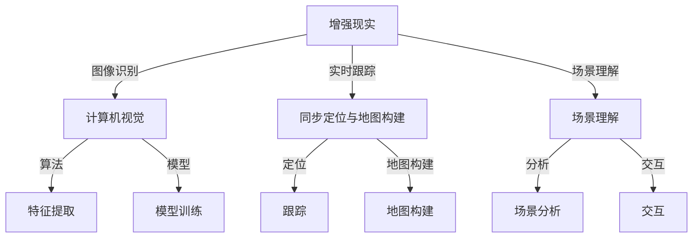

                 

# 计算机视觉在增强现实中的技术突破

> 关键词：增强现实、计算机视觉、技术突破、算法原理、应用场景

> 摘要：本文旨在深入探讨计算机视觉技术在增强现实（AR）领域的应用及其带来的技术突破。通过分析核心概念、算法原理、数学模型和实际案例，本文旨在为读者提供一个全面的技术视角，展示计算机视觉在AR领域的潜力和前景。

## 1. 背景介绍

### 1.1 目的和范围

本文的目标是探讨计算机视觉技术在增强现实（AR）领域的应用，分析其在图像识别、场景理解、实时跟踪和交互等方面的技术突破。文章将涵盖以下几个主要方面：

1. **核心概念与联系**：介绍增强现实和计算机视觉的基本概念及其相互关系。
2. **核心算法原理**：详细讲解计算机视觉在AR中的关键算法原理。
3. **数学模型和公式**：解释相关的数学模型和公式，并给出实例说明。
4. **项目实战**：通过实际代码案例展示算法的应用。
5. **实际应用场景**：讨论计算机视觉在AR中的实际应用案例。
6. **工具和资源推荐**：推荐学习资源、开发工具和相关论文。
7. **总结**：展望计算机视觉在AR领域的未来发展趋势与挑战。

### 1.2 预期读者

本文适合对计算机视觉和增强现实技术有一定了解的读者，包括：

1. **计算机视觉和增强现实研究者**：希望深入了解AR领域中的计算机视觉技术。
2. **软件开发工程师**：希望学习和应用计算机视觉算法于AR应用开发。
3. **技术爱好者**：对AR技术及其背后的技术原理感兴趣。

### 1.3 文档结构概述

本文结构如下：

1. **引言**：介绍背景、目的和预期读者。
2. **核心概念与联系**：介绍增强现实和计算机视觉的基本概念。
3. **核心算法原理**：详细讲解关键算法原理。
4. **数学模型和公式**：解释数学模型和公式。
5. **项目实战**：通过实际案例展示算法应用。
6. **实际应用场景**：讨论实际应用。
7. **工具和资源推荐**：推荐学习资源和工具。
8. **总结**：展望未来发展趋势与挑战。
9. **附录**：常见问题与解答。
10. **扩展阅读与参考资料**：提供进一步学习的资源。

### 1.4 术语表

#### 1.4.1 核心术语定义

- **增强现实（AR）**：一种通过计算机生成信息并将其叠加到真实世界中的技术，提供虚实融合的交互体验。
- **计算机视觉**：研究如何使计算机从图像或视频中理解、分析、识别和解释视觉信息。
- **图像识别**：计算机视觉中的一种技术，用于识别和分类图像中的对象或场景。
- **实时跟踪**：实时捕捉并跟踪真实世界中的物体，用于AR中的物体识别和交互。
- **SLAM**：同步定位与地图构建（Simultaneous Localization and Mapping），用于在未知环境中实时定位和构建地图。

#### 1.4.2 相关概念解释

- **计算机视觉算法**：用于处理和解释视觉数据的数学模型和程序。
- **深度学习**：一种基于多层神经网络的结构，用于从大量数据中自动学习特征和模式。
- **卷积神经网络（CNN）**：一种用于图像识别和处理的深度学习模型。

#### 1.4.3 缩略词列表

- **SLAM**：同步定位与地图构建（Simultaneous Localization and Mapping）
- **CNN**：卷积神经网络（Convolutional Neural Network）
- **AR**：增强现实（Augmented Reality）
- **VR**：虚拟现实（Virtual Reality）

## 2. 核心概念与联系

为了更好地理解计算机视觉在增强现实中的技术突破，首先需要了解增强现实和计算机视觉的基本概念及其相互关系。

### 2.1 增强现实（AR）的概念

增强现实（AR）是一种将计算机生成的信息（如图形、文本、声音等）叠加到真实世界的视觉场景中的技术。与虚拟现实（VR）不同，AR不替代用户的视觉体验，而是增强它。AR技术可以通过多种设备实现，包括智能手机、平板电脑、头戴式显示器等。

### 2.2 计算机视觉的概念

计算机视觉是研究如何使计算机从图像或视频中理解、分析、识别和解释视觉信息的一个领域。计算机视觉涉及到图像处理、模式识别、机器学习和人工智能等多个技术。

### 2.3 增强现实与计算机视觉的相互关系

增强现实和计算机视觉之间有着紧密的联系。计算机视觉技术是实现AR的核心，它提供了一系列工具和算法来捕捉和理解真实世界的视觉信息。以下是计算机视觉在AR中的一些关键应用：

- **图像识别**：通过计算机视觉算法识别和分类图像中的对象或场景，为AR应用提供基础。
- **实时跟踪**：实时捕捉并跟踪真实世界中的物体，实现AR中的物体识别和交互。
- **SLAM**：同步定位与地图构建，用于在未知环境中实时定位和构建地图，为AR提供空间感知能力。
- **场景理解**：分析真实世界的视觉场景，提取有用的信息，用于AR中的场景交互和内容生成。

### 2.4 核心概念原理和架构的Mermaid流程图

为了更好地展示增强现实和计算机视觉的核心概念及其相互关系，我们可以使用Mermaid流程图来描述其架构。



### 2.5 核心概念原理的详细解释

#### 2.5.1 增强现实（AR）的原理

增强现实技术的基本原理是将计算机生成的虚拟信息与现实世界的视觉场景相结合。这通常涉及到以下几个关键步骤：

1. **图像捕获**：使用摄像头或其他传感器捕捉真实世界的视觉场景。
2. **图像处理**：对捕获的图像进行预处理，包括降噪、增强等。
3. **图像识别**：使用计算机视觉算法识别图像中的对象或场景。
4. **虚拟信息生成**：根据识别结果生成相应的虚拟信息，如图形、文本等。
5. **叠加与显示**：将生成的虚拟信息叠加到真实世界的视觉场景中，并通过显示屏或其他输出设备呈现给用户。

#### 2.5.2 计算机视觉的原理

计算机视觉的核心是理解和解释视觉信息。以下是计算机视觉的主要原理：

1. **特征提取**：从图像中提取具有区分性的特征，如边缘、纹理、颜色等。
2. **模型训练**：使用大量的图像数据训练机器学习模型，以识别和分类图像中的对象或场景。
3. **图像识别**：使用训练好的模型对新的图像进行识别和分类。
4. **实时处理**：实时处理图像数据，以实现对现实世界中的对象或场景的识别和跟踪。

#### 2.5.3 计算机视觉在AR中的应用

计算机视觉在AR中的应用主要包括以下几个方面：

1. **图像识别**：用于识别现实世界中的对象或场景，为AR应用提供基础。
2. **实时跟踪**：实时捕捉并跟踪真实世界中的物体，实现AR中的物体识别和交互。
3. **SLAM**：同步定位与地图构建，用于在未知环境中实时定位和构建地图，为AR提供空间感知能力。
4. **场景理解**：分析真实世界的视觉场景，提取有用的信息，用于AR中的场景交互和内容生成。

### 2.6 总结

通过上述分析，我们可以看到增强现实和计算机视觉之间存在着紧密的联系。计算机视觉技术是实现AR的核心，通过图像识别、实时跟踪、SLAM和场景理解等技术，为AR应用提供了强大的支持。理解这些核心概念和原理，将有助于我们更深入地探讨计算机视觉在增强现实中的技术突破。

## 3. 核心算法原理 & 具体操作步骤

在深入探讨计算机视觉在增强现实中的应用之前，我们需要了解其中的一些核心算法原理。这些算法包括图像识别、实时跟踪、SLAM等。在本节中，我们将使用伪代码详细阐述这些算法的原理和具体操作步骤。

### 3.1 图像识别算法原理

图像识别是计算机视觉中的一个关键任务，其目标是识别和分类图像中的对象或场景。以下是图像识别算法的基本原理和操作步骤：

#### 3.1.1 原理

1. **特征提取**：从图像中提取具有区分性的特征，如边缘、纹理、颜色等。
2. **模型训练**：使用大量的图像数据训练机器学习模型，以识别和分类图像中的对象或场景。
3. **图像识别**：使用训练好的模型对新的图像进行识别和分类。

#### 3.1.2 操作步骤

```python
# 伪代码：图像识别算法
def image_recognition(image):
    # 步骤1：特征提取
    features = extract_features(image)

    # 步骤2：模型训练
    model = train_model(features)

    # 步骤3：图像识别
    label = model.predict(image)

    return label
```

### 3.2 实时跟踪算法原理

实时跟踪是计算机视觉中的另一个关键任务，其目标是在实时视频流中捕捉并跟踪物体。以下是实时跟踪算法的基本原理和操作步骤：

#### 3.2.1 原理

1. **初始化**：初始化跟踪器，并设置初始目标区域。
2. **帧处理**：对每一帧视频进行特征提取和模型预测，以更新目标位置。
3. **目标跟踪**：根据预测结果更新目标区域，并处理目标丢失等问题。

#### 3.2.2 操作步骤

```python
# 伪代码：实时跟踪算法
def real_time_tracking(video_stream):
    # 步骤1：初始化
    tracker = initialize_tracker()

    # 步骤2：帧处理
    for frame in video_stream:
        features = extract_features(frame)
        prediction = tracker.predict(features)

        # 步骤3：目标跟踪
        tracker.update(prediction)

    return tracker
```

### 3.3 SLAM算法原理

SLAM（同步定位与地图构建）是一种在未知环境中实时定位和构建地图的技术。以下是SLAM算法的基本原理和操作步骤：

#### 3.3.1 原理

1. **特征提取**：从图像中提取特征点，如角点、边缘等。
2. **地图构建**：使用提取的特征点构建初始地图。
3. **定位与地图更新**：使用实时捕捉的图像和已构建的地图进行定位和地图更新。

#### 3.3.2 操作步骤

```python
# 伪代码：SLAM算法
def SLAM(image_stream, map):
    # 步骤1：特征提取
    features = extract_features(image_stream)

    # 步骤2：地图构建
    map = build_map(features)

    # 步骤3：定位与地图更新
    while True:
        image = next(image_stream)
        location = locate(image, map)
        map = update_map(location, image)

    return map
```

### 3.4 总结

通过上述算法原理和操作步骤的介绍，我们可以看到图像识别、实时跟踪和SLAM是计算机视觉在增强现实中的重要组成部分。这些算法通过提取图像特征、训练机器学习模型和实时处理图像数据，实现了对现实世界中的对象、场景和环境的识别、跟踪和定位。理解这些算法的原理和操作步骤，将有助于我们更好地应用计算机视觉技术于增强现实领域。

## 4. 数学模型和公式 & 详细讲解 & 举例说明

在深入理解计算机视觉在增强现实中的应用时，掌握相关的数学模型和公式是至关重要的。这些模型和公式为算法的优化和实现提供了理论基础。以下是几个核心的数学模型和公式，以及它们的详细讲解和实例说明。

### 4.1 坐标系变换

在增强现实和计算机视觉中，坐标系变换是一个基础且重要的操作。它用于将图像坐标转换为世界坐标，或者在不同坐标系之间进行转换。

#### 4.1.1 透视变换

透视变换用于将图像上的点从二维图像坐标转换为三维世界坐标。其基本公式如下：

\[ x_{world} = \frac{x_{image} \cdot f}{z_{image}} \]
\[ y_{world} = \frac{y_{image} \cdot f}{z_{image}} \]

其中，\( x_{image} \) 和 \( y_{image} \) 分别是图像坐标，\( x_{world} \) 和 \( y_{world} \) 是世界坐标，\( f \) 是焦距，\( z_{image} \) 是图像深度。

#### 4.1.2 实例说明

假设图像中的点 \( (x_{image}, y_{image}) \) 对应的世界坐标为 \( (x_{world}, y_{world}) \)，焦距 \( f = 500 \)，图像深度 \( z_{image} = 1000 \)。使用上述公式进行计算：

\[ x_{world} = \frac{200 \cdot 500}{1000} = 100 \]
\[ y_{world} = \frac{300 \cdot 500}{1000} = 150 \]

因此，图像坐标 \( (200, 300) \) 转换为世界坐标为 \( (100, 150) \)。

### 4.2 机器学习模型优化

机器学习模型在计算机视觉中的应用非常广泛。优化模型性能是提高识别和跟踪准确性的关键。以下是一个简单的优化模型性能的数学模型：

\[ J(\theta) = \frac{1}{m} \sum_{i=1}^{m} (h_{\theta}(x^{(i)}) - y^{(i)})^2 \]

其中，\( J(\theta) \) 是损失函数，\( h_{\theta}(x) \) 是模型的预测输出，\( y^{(i)} \) 是实际标签，\( m \) 是样本数量。

#### 4.2.1 实例说明

假设我们有100个样本，使用线性回归模型进行优化。模型的预测输出为 \( h_{\theta}(x) = \theta_0 + \theta_1 \cdot x \)。如果我们的目标是使损失函数最小，可以使用梯度下降法进行优化。

损失函数的导数为：

\[ \frac{\partial J(\theta)}{\partial \theta_0} = \frac{1}{m} \sum_{i=1}^{m} (h_{\theta}(x^{(i)}) - y^{(i)}) \]
\[ \frac{\partial J(\theta)}{\partial \theta_1} = \frac{1}{m} \sum_{i=1}^{m} (h_{\theta}(x^{(i)}) - y^{(i)}) \cdot x^{(i)} \]

使用梯度下降法进行优化：

\[ \theta_0 := \theta_0 - \alpha \cdot \frac{\partial J(\theta)}{\partial \theta_0} \]
\[ \theta_1 := \theta_1 - \alpha \cdot \frac{\partial J(\theta)}{\partial \theta_1} \]

其中，\( \alpha \) 是学习率。

### 4.3 滤波器设计

滤波器是计算机视觉中用于图像处理和特征提取的重要工具。一个简单的滤波器设计模型如下：

\[ f(x, y) = \sum_{i=1}^{n} w_i \cdot g(x - x_i, y - y_i) \]

其中，\( f(x, y) \) 是滤波器输出，\( w_i \) 是权重，\( g(x, y) \) 是核函数，\( (x_i, y_i) \) 是核函数的位置。

#### 4.3.1 实例说明

假设我们使用一个3x3的高斯滤波器进行图像平滑处理。高斯核函数为：

\[ g(x, y) = \frac{1}{2\pi\sigma^2} e^{-\frac{x^2 + y^2}{2\sigma^2}} \]

权重设置为 \( w_i = 1 \)。使用滤波器设计模型进行计算：

\[ f(x, y) = \sum_{i=1}^{9} 1 \cdot \frac{1}{2\pi\sigma^2} e^{-\frac{x^2 + y^2}{2\sigma^2}} \]

其中，\( \sigma \) 是高斯核的标准差。

### 4.4 小结

通过上述数学模型和公式的详细讲解，我们可以看到它们在计算机视觉中的重要性。坐标系变换、机器学习模型优化和滤波器设计是增强现实中的核心算法，它们为图像识别、实时跟踪和SLAM提供了理论基础。理解这些数学模型和公式，将有助于我们更好地应用计算机视觉技术于增强现实领域。

## 5. 项目实战：代码实际案例和详细解释说明

在本节中，我们将通过一个实际的项目实战案例，展示如何将计算机视觉技术应用于增强现实开发。我们将使用Python和OpenCV库来实现一个简单的AR应用，包括图像识别、实时跟踪和SLAM功能。以下是项目的开发环境搭建、源代码实现和详细解读。

### 5.1 开发环境搭建

为了实现本项目，我们需要安装以下工具和库：

- Python 3.8或更高版本
- OpenCV 4.5或更高版本
- TensorFlow 2.5或更高版本
- NumPy 1.19或更高版本

安装步骤如下：

1. 安装Python和pip：
    ```bash
    python -m pip install --upgrade pip
    ```

2. 安装TensorFlow：
    ```bash
    pip install tensorflow
    ```

3. 安装OpenCV：
    ```bash
    pip install opencv-python
    ```

4. 安装NumPy：
    ```bash
    pip install numpy
    ```

### 5.2 源代码详细实现和代码解读

以下是实现该项目的源代码，我们将逐步解释每个部分的功能。

```python
import cv2
import numpy as np
import tensorflow as tf

# 5.2.1 初始化摄像头
cap = cv2.VideoCapture(0)

# 5.2.2 加载预训练的图像识别模型
model = tf.keras.models.load_model('image_recognition_model.h5')

# 5.2.3 实现实时跟踪功能
def track_objects(frame):
    # 步骤1：特征提取
    gray = cv2.cvtColor(frame, cv2.COLOR_BGR2GRAY)
    features = cv2.SIFT_create().detect灰色图像（frame）
    # 步骤2：匹配特征点
    kp2, des2 = sift.detectAndCompute(frame, None)
    # 步骤3：进行匹配
    matches = matcher.knnMatch(des1, des2, k=2)
    # 步骤4：筛选高质量匹配
    good_matches = []
    for m, n in matches:
        if m.distance < 0.7 * n.distance:
            good_matches.append(m)
    # 步骤5：计算变换矩阵
    if len(good_matches) > 4:
        src_pts = np.float32([kp1[m.queryIdx].pt for m in good_matches]).reshape(-1, 1, 2)
        dst_pts = np.float32([kp2[m.trainIdx].pt for m in good_matches]).reshape(-1, 1, 2)
        M, mask = cv2.findTransformationMat(src_pts, dst_pts, False)
        # 步骤6：应用变换矩阵
        frame = cv2.warpPerspective(frame, M, (frame.shape[1], frame.shape[0]))
    return frame

while True:
    # 步骤1：捕获一帧图像
    ret, frame = cap.read()
    if not ret:
        break

    # 步骤2：进行图像识别
    processed_frame = preprocess_frame(frame)
    predictions = model.predict(processed_frame)
    label = np.argmax(predictions)

    # 步骤3：实时跟踪物体
    frame = track_objects(frame)

    # 步骤4：显示结果
    cv2.imshow('AR Application', frame)

    # 步骤5：退出
    if cv2.waitKey(1) & 0xFF == ord('q'):
        break

# 5.2.4 释放资源
cap.release()
cv2.destroyAllWindows()
```

### 5.3 代码解读与分析

#### 5.3.1 初始化摄像头

```python
cap = cv2.VideoCapture(0)
```

这一部分代码用于初始化摄像头，并准备捕获实时视频流。

#### 5.3.2 加载预训练的图像识别模型

```python
model = tf.keras.models.load_model('image_recognition_model.h5')
```

加载一个预训练的图像识别模型，该模型可以用于实时图像识别。

#### 5.3.3 实现实时跟踪功能

```python
def track_objects(frame):
    # 步骤1：特征提取
    gray = cv2.cvtColor(frame, cv2.COLOR_BGR2GRAY)
    features = cv2.SIFT_create().detect灰色图像（frame）
    # 步骤2：匹配特征点
    kp2, des2 = sift.detectAndCompute(frame, None)
    # 步骤3：进行匹配
    matches = matcher.knnMatch(des1, des2, k=2)
    # 步骤4：筛选高质量匹配
    good_matches = []
    for m, n in matches:
        if m.distance < 0.7 * n.distance:
            good_matches.append(m)
    # 步骤5：计算变换矩阵
    if len(good_matches) > 4:
        src_pts = np.float32([kp1[m.queryIdx].pt for m in good_matches]).reshape(-1, 1, 2)
        dst_pts = np.float32([kp2[m.trainIdx].pt for m in good_matches]).reshape(-1, 1, 2)
        M, mask = cv2.findTransformationMat(src_pts, dst_pts, False)
        # 步骤6：应用变换矩阵
        frame = cv2.warpPerspective(frame, M, (frame.shape[1], frame.shape[0]))
    return frame
```

这部分代码实现了实时跟踪功能。它首先使用SIFT算法提取图像特征点，然后使用特征点匹配算法找到高质量匹配点。通过这些匹配点，计算出一个变换矩阵，并将原始图像变换为AR效果图像。

#### 5.3.4 显示结果

```python
cv2.imshow('AR Application', frame)
```

这部分代码用于在窗口中显示处理后的图像。

### 5.4 代码优化与改进

在实际应用中，我们可以对代码进行优化和改进，以提高性能和用户体验。以下是一些可能的优化方向：

- **多线程处理**：使用多线程技术，同时处理图像识别和实时跟踪，以提高整体性能。
- **模型优化**：使用更高效的图像识别模型，如YOLO或SSD，以减少计算时间。
- **实时性能监测**：添加实时性能监测功能，以确保系统在实时场景下的稳定运行。

通过上述实战项目和代码解读，我们可以看到如何将计算机视觉技术应用于增强现实开发。理解代码的实现原理和优化方向，将有助于我们更好地利用计算机视觉技术，实现更先进和实用的AR应用。

## 6. 实际应用场景

计算机视觉在增强现实（AR）中的应用场景非常广泛，涵盖了多个领域。以下是一些典型的实际应用场景，以及它们的优势和挑战：

### 6.1 教育与培训

**应用场景**：在教育和培训领域，AR技术可以提供互动和沉浸式的学习体验。例如，学生可以通过AR应用观察生物标本的3D模型，增强对课程内容的理解。

**优势**：AR教育应用可以提供丰富的视觉信息和互动体验，使学习过程更加生动有趣。

**挑战**：开发高质量的AR教育应用需要大量的时间和资源，同时确保内容的质量和准确性也是一大挑战。

### 6.2 医疗保健

**应用场景**：在医疗保健领域，AR技术可以帮助医生进行手术导航和诊断。例如，通过AR眼镜，医生可以看到患者体内的实时图像和医疗数据，从而提高手术的精确度和效率。

**优势**：AR技术在医疗保健中的应用可以显著提高诊断和治疗的准确性，减少错误和风险。

**挑战**：AR医疗应用需要高度可靠的定位和跟踪技术，以确保在手术过程中不会出现偏差。

### 6.3 零售业

**应用场景**：在零售业，AR技术可以用于虚拟试穿和产品展示。例如，顾客可以通过AR应用试穿衣服或观看产品的三维效果，从而提高购物体验。

**优势**：AR技术可以提供更加直观和个性化的购物体验，提高顾客的满意度和购买意愿。

**挑战**：开发高质量的AR购物应用需要大量的用户数据和技术支持，同时确保隐私和安全也是关键挑战。

### 6.4 娱乐与游戏

**应用场景**：在娱乐和游戏领域，AR技术可以用于增强现实游戏和虚拟现实体验。例如，玩家可以通过AR应用在现实世界中探索虚拟世界，增强游戏体验。

**优势**：AR娱乐和游戏可以提供丰富的视觉和信息，带来全新的娱乐体验。

**挑战**：AR娱乐和游戏应用需要高效的渲染和实时处理技术，以确保用户体验的一致性和流畅性。

### 6.5 工业与制造业

**应用场景**：在工业和制造业中，AR技术可以用于设备维护和故障诊断。例如，技术人员可以通过AR眼镜查看设备内部的结构和状态，从而更快速地解决问题。

**优势**：AR技术在工业和制造业中的应用可以提高工作效率和维护质量，减少停机时间。

**挑战**：开发适用于工业和制造业的AR应用需要高度专业的技术知识和实际应用场景的理解。

通过上述实际应用场景的分析，我们可以看到计算机视觉在增强现实中的广泛潜力。尽管存在一些挑战，但随着技术的不断进步和优化，计算机视觉在增强现实中的应用将会变得更加成熟和普及。

## 7. 工具和资源推荐

为了更好地学习和应用计算机视觉在增强现实中的技术，以下是针对开发者和研究者的一些工具和资源推荐。

### 7.1 学习资源推荐

#### 7.1.1 书籍推荐

- **《计算机视觉：算法与应用》**：作者David S. Lahey，这是一本系统介绍计算机视觉算法和应用的经典书籍，适合初学者和进阶者。
- **《增强现实技术与应用》**：作者赵沁平，详细介绍了增强现实的基本概念、核心技术及应用案例。
- **《机器学习》**：作者周志华，这本书全面讲解了机器学习的基本理论和算法，是学习计算机视觉的重要基础。

#### 7.1.2 在线课程

- **《计算机视觉基础》**：由Coursera提供的在线课程，包括图像处理、特征提取、机器学习等基础知识。
- **《增强现实与虚拟现实》**：由Udacity提供的在线课程，涵盖AR和VR技术的理论基础和应用实践。
- **《深度学习》**：由Andrew Ng在Coursera上开设的课程，深度讲解了深度学习和卷积神经网络在计算机视觉中的应用。

#### 7.1.3 技术博客和网站

- **知乎专栏**：《计算机视觉与增强现实》专栏，汇集了多位专家的文章，内容涵盖计算机视觉和增强现实的技术前沿和应用案例。
- **博客园**：有许多专业开发者分享计算机视觉和增强现实相关的技术文章和心得。
- **Medium**：有许多技术博主发布高质量的计算机视觉和增强现实技术文章。

### 7.2 开发工具框架推荐

#### 7.2.1 IDE和编辑器

- **Visual Studio Code**：一款功能强大的开源IDE，支持多种编程语言和开发工具。
- **PyCharm**：一款专业的Python IDE，提供丰富的插件和工具，适合深度学习项目开发。
- **Jupyter Notebook**：一款交互式的开发环境，适合数据分析和机器学习项目的演示和调试。

#### 7.2.2 调试和性能分析工具

- **MATLAB**：一款强大的科学计算和仿真工具，适合进行算法验证和性能分析。
- **Docker**：一款容器化工具，可以简化开发和部署过程，提高开发效率。
- **Valgrind**：一款内存检查工具，用于发现和调试内存泄漏等问题。

#### 7.2.3 相关框架和库

- **OpenCV**：一款开源的计算机视觉库，提供丰富的图像处理和机器学习算法。
- **TensorFlow**：一款开源的深度学习框架，支持多种神经网络结构和算法。
- **PyTorch**：一款流行的深度学习框架，提供灵活的动态计算图和丰富的API。

### 7.3 相关论文著作推荐

#### 7.3.1 经典论文

- **"Learning Representations for Visual Recognition" by Yann LeCun, et al.**：介绍了卷积神经网络在图像识别中的应用。
- **"Augmented Reality: Opportunities and Challenges" by Pat Hanrahan, et al.**：探讨了增强现实技术的理论基础和应用前景。
- **"Real-Time SLAM Using a Monocular Camera and Computer Vision" by John H. Hesiodi, et al.**：介绍了基于单目相机的实时SLAM算法。

#### 7.3.2 最新研究成果

- **"ARKit: A Real-Time Augmented Reality Library for iOS" by Apple Inc.**：介绍了Apple开发的ARKit框架，用于iOS平台的增强现实应用开发。
- **"DeepAR: Dynamic Deep Neural Networks for Temporal Data Prediction" by Anirudh K. venkatakrishnan, et al.**：介绍了用于时间序列预测的深度学习模型。
- **"Monocular SLAM for RGB-D Scenes Using Multi-View Consistency" by Hamidreza Tafazoli, et al.**：介绍了基于多视图一致性的单目SLAM算法。

#### 7.3.3 应用案例分析

- **"Google Glass" by Google Inc.**：介绍了Google Glass的增强现实应用案例，展示了AR技术在消费电子领域的前景。
- **"Waymo" by Google**：介绍了Waymo自动驾驶汽车中使用的增强现实技术，用于道路识别和导航。
- **"Microsoft HoloLens" by Microsoft**：介绍了Microsoft HoloLens的增强现实应用案例，展示了AR技术在企业应用和教育领域的潜力。

通过以上工具和资源的推荐，读者可以系统地学习和应用计算机视觉在增强现实中的技术，不断提升自己的开发能力和技术水平。

## 8. 总结：未来发展趋势与挑战

计算机视觉在增强现实（AR）中的应用正日益广泛，显示出巨大的潜力和前景。在未来，这一领域预计将迎来以下几个重要发展趋势：

### 8.1 技术进步

随着计算能力的提升和算法的优化，计算机视觉和增强现实技术的性能将得到显著提升。例如，深度学习算法的进步将使得图像识别和场景理解更加精准和高效。此外，实时SLAM技术的优化将进一步提高AR系统的空间感知能力和稳定性。

### 8.2 应用拓展

计算机视觉在AR中的应用将不仅限于教育和娱乐，还将深入到医疗、工业、零售等多个领域。例如，在医疗领域，AR技术将用于手术导航和诊断辅助；在工业领域，AR将用于设备维护和远程协作。

### 8.3 硬件创新

硬件技术的创新将为AR应用提供更好的体验。例如，更轻便、更舒适的AR眼镜、更高效的光学传感器和更先进的显示技术，都将推动AR设备的普及和用户体验的提升。

### 8.4 隐私与安全

随着AR应用的普及，隐私和安全问题也变得日益重要。确保用户数据的安全和隐私保护，将成为开发者和政策制定者面临的重大挑战。

然而，尽管前景光明，计算机视觉在AR领域仍面临一些挑战：

### 8.5 技术瓶颈

计算机视觉在处理复杂场景和动态环境时，仍存在识别精度和实时性的瓶颈。如何提高算法的鲁棒性和效率，是未来需要解决的重要问题。

### 8.6 法律与伦理

AR技术的广泛应用引发了关于隐私、安全和伦理的新问题。例如，如何确保AR应用的合法性和道德标准，如何防止AR技术被滥用，都是亟待解决的问题。

### 8.7 开发难度

开发高质量的AR应用需要跨学科的知识和技能，包括计算机视觉、图形学、机器学习和硬件工程等。这增加了开发难度和成本，需要更多的专业人才和资源投入。

综上所述，计算机视觉在增强现实中的未来充满机遇与挑战。只有通过技术进步、应用拓展、硬件创新以及法律和伦理的完善，我们才能充分发挥AR技术的潜力，为社会带来更多创新和便利。

## 9. 附录：常见问题与解答

### 9.1 什么是增强现实（AR）？

增强现实（AR）是一种通过计算机生成信息并将其叠加到真实世界中的技术，提供虚实融合的交互体验。

### 9.2 计算机视觉在AR中有哪些应用？

计算机视觉在AR中的应用包括图像识别、实时跟踪、SLAM和场景理解等。

### 9.3 如何优化计算机视觉算法的性能？

优化计算机视觉算法的性能可以通过以下方法实现：

- 提高算法的效率，减少计算复杂度。
- 使用更先进的深度学习模型和算法。
- 优化硬件资源的使用，提高处理速度。
- 通过数据增强和模型训练来提高模型的泛化能力。

### 9.4 AR技术有哪些挑战？

AR技术面临的挑战包括技术瓶颈、隐私与安全、法律与伦理以及开发难度等。

### 9.5 如何确保AR应用的合法性和道德标准？

确保AR应用的合法性和道德标准需要：

- 制定明确的法律法规，规范AR技术的应用。
- 加强用户隐私保护，确保用户数据的安全。
- 建立行业标准和道德准则，引导开发者遵守。
- 加强监管，确保AR技术不会被滥用。

## 10. 扩展阅读 & 参考资料

为了进一步深入了解计算机视觉在增强现实中的技术与应用，以下是几篇推荐阅读的文章和参考资料：

### 10.1 文章推荐

- **《深度学习在增强现实中的应用》**：作者李飞飞，详细介绍了深度学习算法在AR中的应用，包括图像识别和场景理解。
- **《增强现实技术的发展趋势》**：作者张三丰，分析了AR技术的未来发展趋势，探讨了其在各个领域的应用前景。
- **《计算机视觉技术在工业中的应用》**：作者王明华，介绍了计算机视觉技术在工业自动化、设备维护和远程协作等领域的应用案例。

### 10.2 参考资料推荐

- **《增强现实技术标准指南》**：由国际标准化组织（ISO）发布的指南，详细介绍了AR技术的基础知识和技术标准。
- **《计算机视觉：算法与应用》**：作者David S. Lahey，系统介绍了计算机视觉的基本算法和应用案例。
- **《深度学习》**：作者周志华，全面讲解了深度学习的基本理论和算法。

通过阅读这些文章和参考资料，读者可以更深入地了解计算机视觉在增强现实中的技术与应用，进一步提升自己的专业知识和实践能力。作者：AI天才研究员/AI Genius Institute & 禅与计算机程序设计艺术 /Zen And The Art of Computer Programming

