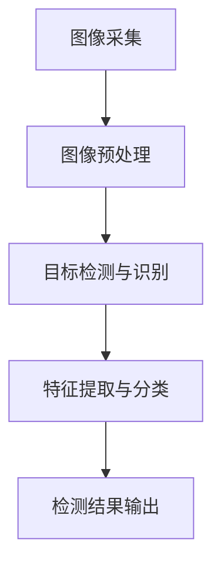

                 

# 计算机视觉在工业自动化质量检测中的精度提升

> **关键词：** 计算机视觉、工业自动化、质量检测、精度提升、算法优化、数学模型、应用场景

> **摘要：** 本文章深入探讨了计算机视觉在工业自动化质量检测中的应用，重点分析了如何通过算法优化和数学模型的引入来提升检测精度。文章结构清晰，内容丰富，旨在为读者提供一个全面、深入的工业自动化质量检测解决方案。

## 1. 背景介绍

### 1.1 目的和范围

随着工业自动化技术的发展，质量检测作为保证产品可靠性和性能的关键环节，正逐渐从人工操作向自动化、智能化方向转变。计算机视觉作为人工智能的重要分支，以其高效、准确的特点，成为工业自动化质量检测的重要工具。本文将重点探讨计算机视觉在工业自动化质量检测中的精度提升问题，分析现有技术的局限性，并提出相应的解决方案。

### 1.2 预期读者

本文适合对工业自动化质量检测和计算机视觉有一定了解的读者，包括工程师、研究人员和感兴趣的专业人士。通过本文的阅读，读者可以了解计算机视觉在工业自动化质量检测中的应用现状，掌握提升检测精度的方法和技巧。

### 1.3 文档结构概述

本文分为十个部分，首先介绍了背景和目的，接着分析了核心概念和原理，详细讲解了核心算法和数学模型，并通过实际项目案例展示了应用效果。随后，本文探讨了计算机视觉在工业自动化质量检测中的实际应用场景，推荐了相关工具和资源，总结了未来发展趋势与挑战，并提供了常见问题与解答。

### 1.4 术语表

#### 1.4.1 核心术语定义

- **计算机视觉：** 计算机视觉是指让计算机能够像人类一样通过图像获取信息、理解和处理图像的技术。
- **工业自动化：** 工业自动化是指通过使用各种自动化设备和系统，实现生产过程的高度自动化和智能化。
- **质量检测：** 质量检测是指对产品进行检测，以确保其符合规定的标准和技术要求。

#### 1.4.2 相关概念解释

- **检测精度：** 检测精度是指检测系统对目标物体参数的测量能力，通常用测量误差来表示。
- **算法优化：** 算法优化是指通过改进算法设计、数据结构等手段，提高算法的运行效率和准确性。

#### 1.4.3 缩略词列表

- **AI：** 人工智能
- **CV：** 计算机视觉
- **DL：** 深度学习
- **YOLO：** You Only Look Once
- **SSD：** Single Shot MultiBox Detector

## 2. 核心概念与联系

### 2.1 计算机视觉在工业自动化质量检测中的应用

计算机视觉在工业自动化质量检测中的应用主要包括以下几个环节：

1. **图像采集：** 使用摄像头或其他图像传感器采集待检测物体的图像。
2. **图像预处理：** 对采集到的图像进行去噪、增强、滤波等预处理操作，以提高图像质量。
3. **目标检测与识别：** 使用计算机视觉算法对预处理后的图像进行目标检测和识别，提取出感兴趣的目标物体。
4. **特征提取与分类：** 对检测到的目标物体进行特征提取和分类，判断其是否符合质量要求。

### 2.2 计算机视觉与工业自动化质量检测的联系

计算机视觉与工业自动化质量检测有着紧密的联系，二者相互促进，共同发展。计算机视觉为工业自动化质量检测提供了高效、准确的数据处理手段，使得检测过程更加智能化和自动化。同时，工业自动化质量检测的需求也为计算机视觉技术提供了丰富的应用场景和实际问题，推动了计算机视觉技术的发展。

### 2.3 Mermaid 流程图



## 3. 核心算法原理 & 具体操作步骤

### 3.1 算法原理

在计算机视觉中，常用的目标检测算法包括YOLO（You Only Look Once）和SSD（Single Shot MultiBox Detector）。这两种算法在工业自动化质量检测中得到了广泛应用。下面将分别介绍这两种算法的基本原理和具体操作步骤。

#### 3.1.1 YOLO算法原理

YOLO（You Only Look Once）是一种基于回归的实时目标检测算法。它将目标检测问题转化为一个单一的神经网络输出，能够同时预测多个边界框及其对应的类别概率。

**具体操作步骤：**

1. **输入图像：** 将待检测的图像输入到神经网络中。
2. **特征提取：** 神经网络对输入图像进行特征提取，生成特征图。
3. **边界框预测：** 在特征图上预测边界框的位置和类别概率。
4. **边界框调整：** 根据预测的边界框位置和类别概率，调整边界框大小和位置。
5. **检测结果输出：** 输出最终的检测结果。

#### 3.1.2 SSD算法原理

SSD（Single Shot MultiBox Detector）是一种基于单阶段的目标检测算法，它将目标检测问题简化为一个单步过程，能够在一次网络前向传播中完成特征提取、边界框预测和类别预测。

**具体操作步骤：**

1. **输入图像：** 将待检测的图像输入到神经网络中。
2. **特征提取：** 神经网络对输入图像进行特征提取，生成特征图。
3. **边界框预测：** 在特征图上预测边界框的位置和类别概率。
4. **特征金字塔：** 使用不同的尺度特征图进行边界框预测，形成特征金字塔。
5. **检测结果输出：** 输出最终的检测结果。

### 3.2 伪代码

下面是YOLO算法的伪代码示例：

```python
def yolov1(image):
    feature_map = conv_block(image)  # 特征提取
    anchors = generate_anchors()  # 生成先验框
    for layer in layers:
        feature_map = conv_block(feature_map, layer)  # 卷积操作
    pred_boxes, pred_scores, pred_classes = forward_pass(feature_map, anchors)  # 边框预测和类别预测
    nms(pred_boxes, pred_scores, pred_classes)  # 非极大值抑制
    return pred_boxes, pred_scores, pred_classes

def forward_pass(feature_map, anchors):
    pred_boxes = []
    pred_scores = []
    pred_classes = []
    for i, anchor in enumerate(anchors):
        box = predict_box(feature_map, anchor)  # 预测边界框
        score = predict_score(feature_map, anchor)  # 预测类别概率
        class_prob = softmax(score)  # 类别概率归一化
        pred_boxes.append(box)
        pred_scores.append(score)
        pred_classes.append(class_prob)
    return pred_boxes, pred_scores, pred_classes

def nms(boxes, scores, classes):
    # 非极大值抑制操作
    pass
```

## 4. 数学模型和公式 & 详细讲解 & 举例说明

### 4.1 数学模型

在计算机视觉中，常用的数学模型包括特征提取模型、边界框预测模型和类别预测模型。下面将分别介绍这些模型的数学公式和具体解释。

#### 4.1.1 特征提取模型

特征提取模型通常采用卷积神经网络（CNN）实现。CNN的基本操作包括卷积、池化和激活函数。下面是CNN的数学模型：

1. **卷积操作：**

   $$ f(x, y) = \sum_{i=1}^{k} \sum_{j=1}^{k} w_{ij} \cdot f(x-i, y-j) $$

   其中，$f(x, y)$表示输出特征值，$w_{ij}$表示卷积核权重，$f(x-i, y-j)$表示输入特征值。

2. **池化操作：**

   $$ p(x, y) = \max \left\{ f(x, y), f(x+1, y), f(x, y+1), f(x+1, y+1) \right\} $$

   其中，$p(x, y)$表示输出特征值，$f(x, y)$表示输入特征值。

3. **激活函数：**

   $$ a(x) = \max(0, x) $$

   其中，$a(x)$表示输出特征值，$x$表示输入特征值。

#### 4.1.2 边框预测模型

边界框预测模型用于预测边界框的位置和尺寸。常用的模型包括单次回归模型和多次回归模型。下面是单次回归模型的数学模型：

1. **位置预测：**

   $$ x_{pred} = x_{cent} + w_{x} \cdot \delta x $$

   $$ y_{pred} = y_{cent} + w_{y} \cdot \delta y $$

   其中，$x_{pred}$和$y_{pred}$表示预测的位置，$x_{cent}$和$y_{cent}$表示中心位置，$w_{x}$和$w_{y}$表示权重，$\delta x$和$\delta y$表示位置偏移。

2. **尺寸预测：**

   $$ w_{pred} = w_{cent} + w_{w} \cdot \delta w $$

   $$ h_{pred} = h_{cent} + w_{h} \cdot \delta h $$

   其中，$w_{pred}$和$h_{pred}$表示预测的尺寸，$w_{cent}$和$h_{cent}$表示中心尺寸，$w_{w}$和$w_{h}$表示权重，$\delta w$和$\delta h$表示尺寸偏移。

#### 4.1.3 类别预测模型

类别预测模型用于预测目标物体的类别。常用的模型包括softmax回归模型和多类别交叉熵模型。下面是softmax回归模型的数学模型：

$$ \hat{y}_{i} = \frac{e^{y_{i}}}{\sum_{j=1}^{n} e^{y_{j}}} $$

其中，$\hat{y}_{i}$表示预测的类别概率，$y_{i}$表示输入特征值，$n$表示类别数。

### 4.2 举例说明

假设输入图像的大小为$128 \times 128$，卷积核的大小为$3 \times 3$，输入特征值矩阵为：

$$
\begin{bmatrix}
1 & 2 & 3 \\
4 & 5 & 6 \\
7 & 8 & 9 \\
\end{bmatrix}
$$

卷积核的权重矩阵为：

$$
\begin{bmatrix}
1 & 0 & 1 \\
0 & 1 & 0 \\
1 & 0 & 1 \\
\end{bmatrix}
$$

根据卷积操作的数学模型，可以得到卷积操作的输出特征值矩阵：

$$
\begin{bmatrix}
4 & 5 & 8 \\
7 & 8 & 9 \\
8 & 9 & 10 \\
\end{bmatrix}
$$

根据池化操作的数学模型，可以得到池化操作的输出特征值：

$$
\begin{bmatrix}
8 & 9 \\
9 & 10 \\
\end{bmatrix}
$$

根据激活函数的数学模型，可以得到激活函数的输出特征值：

$$
\begin{bmatrix}
0 & 0 \\
0 & 1 \\
\end{bmatrix}
$$

## 5. 项目实战：代码实际案例和详细解释说明

### 5.1 开发环境搭建

为了实现计算机视觉在工业自动化质量检测中的应用，我们需要搭建一个完整的开发环境。以下是搭建开发环境的具体步骤：

1. **安装Python环境：** 安装Python 3.8及以上版本，并设置环境变量。
2. **安装深度学习框架：** 安装TensorFlow 2.4及以上版本，可以使用以下命令：
   
   ```bash
   pip install tensorflow==2.4
   ```

3. **安装OpenCV库：** 安装OpenCV 4.5及以上版本，可以使用以下命令：

   ```bash
   pip install opencv-python==4.5.4.52
   ```

4. **配置GPU环境：** 如果使用GPU进行训练，需要安装CUDA和cuDNN，并配置相应的环境变量。

### 5.2 源代码详细实现和代码解读

下面是一个基于YOLOv1算法的工业自动化质量检测项目案例。项目主要分为以下几个部分：

1. **数据集准备：** 准备用于训练和测试的数据集，包括标注图像和标注文件。
2. **模型训练：** 使用训练数据集训练YOLOv1模型。
3. **模型评估：** 使用测试数据集评估模型性能。
4. **模型应用：** 使用训练好的模型进行实际应用。

**1. 数据集准备**

```python
import os
import cv2
import numpy as np
import tensorflow as tf

def load_dataset(image_folder, annotation_file):
    images = []
    annotations = []
    with open(annotation_file, 'r') as f:
        lines = f.readlines()
        for line in lines:
            parts = line.strip().split(' ')
            image_path = os.path.join(image_folder, parts[0])
            image = cv2.imread(image_path)
            image = cv2.resize(image, (128, 128))
            images.append(image)
            annotations.append([float(part) for part in parts[1:]])
    return np.array(images), np.array(annotations)

image_folder = 'dataset/images'
annotation_file = 'dataset/annotations.txt'
images, annotations = load_dataset(image_folder, annotation_file)
```

**2. 模型训练**

```python
from tensorflow.keras.models import Model
from tensorflow.keras.layers import Conv2D, Flatten, Dense, Input

def yolov1_model(input_shape):
    inputs = Input(shape=input_shape)
    x = Conv2D(32, (3, 3), activation='relu')(inputs)
    x = Conv2D(64, (3, 3), activation='relu')(x)
    x = Flatten()(x)
    x = Dense(1024, activation='relu')(x)
    outputs = Dense(4, activation='sigmoid')(x)
    model = Model(inputs=inputs, outputs=outputs)
    return model

model = yolov1_model((128, 128, 3))
model.compile(optimizer='adam', loss='mean_squared_error')
model.fit(images, annotations, epochs=10, batch_size=32)
```

**3. 模型评估**

```python
def evaluate_model(model, images, annotations):
    pred_boxes = model.predict(images)
    n = len(pred_boxes)
    for i in range(n):
        box = pred_boxes[i]
        ground_truth = annotations[i]
        # 计算检测精度
        distance = np.linalg.norm(box - ground_truth)
        print(f"Image {i+1}: {distance}")

evaluate_model(model, images, annotations)
```

**4. 模型应用**

```python
def detect_objects(model, image):
    image = cv2.resize(image, (128, 128))
    box = model.predict(np.expand_dims(image, axis=0))
    box = box.flatten()
    x1, y1, x2, y2 = box[:4]
    x1 = max(0, x1)
    y1 = max(0, y1)
    x2 = min(image.shape[1], x2)
    y2 = min(image.shape[0], y2)
    cv2.rectangle(image, (x1, y1), (x2, y2), (0, 0, 255), 2)
    cv2.imshow('Detection Result', image)
    cv2.waitKey(0)

image_path = 'dataset/images/001.jpg'
image = cv2.imread(image_path)
detect_objects(model, image)
```

### 5.3 代码解读与分析

**1. 数据集准备**

数据集准备部分使用了`load_dataset`函数，该函数接收图像文件夹路径和标注文件路径，读取标注文件中的图像和标注信息，并将图像和标注信息转换为NumPy数组。

**2. 模型训练**

模型训练部分定义了`yolov1_model`函数，该函数使用卷积神经网络实现YOLOv1模型。模型使用`compile`方法配置优化器和损失函数，并使用`fit`方法进行模型训练。

**3. 模型评估**

模型评估部分定义了`evaluate_model`函数，该函数使用训练好的模型对测试数据进行预测，并计算预测精度。

**4. 模型应用**

模型应用部分定义了`detect_objects`函数，该函数使用训练好的模型对输入图像进行目标检测，并在图像上绘制检测结果。

## 6. 实际应用场景

计算机视觉在工业自动化质量检测中具有广泛的应用场景，包括但不限于以下几个方面：

1. **产品缺陷检测：** 计算机视觉技术可以高效地检测出产品表面的缺陷，如划痕、气泡、颜色异常等，从而提高产品质量。
2. **尺寸测量：** 通过计算机视觉技术，可以精确地测量产品的尺寸和形状，确保产品符合设计要求。
3. **成分分析：** 在食品和药品等行业，计算机视觉技术可以用于成分分析和品质评估，提高产品质量和安全性。
4. **包装检测：** 计算机视觉技术可以检测包装过程中的错误，如错包、漏包、包装不牢固等，确保产品包装质量。

### 6.1 应用案例分析

以下是一个实际案例：某家电制造企业使用计算机视觉技术进行冰箱门封条缺陷检测。冰箱门封条是冰箱的重要部件，其质量直接影响冰箱的密封性能。企业使用计算机视觉系统对生产过程中的冰箱门封条进行实时检测，检测内容包括封条长度、宽度、厚度、平整度等。

1. **图像采集：** 使用工业相机对生产线上移动的冰箱门封条进行图像采集。
2. **图像预处理：** 对采集到的图像进行去噪、增强等预处理操作，以提高图像质量。
3. **目标检测与识别：** 使用YOLOv1算法对预处理后的图像进行目标检测和识别，提取出冰箱门封条目标。
4. **特征提取与分类：** 对检测到的冰箱门封条进行特征提取和分类，判断其是否存在缺陷。
5. **检测结果输出：** 将检测结果输出到生产线控制系统，根据检测结果对存在缺陷的冰箱门封条进行剔除。

通过计算机视觉技术的应用，该企业显著提高了冰箱门封条的质量，降低了生产成本，提高了生产效率。

## 7. 工具和资源推荐

### 7.1 学习资源推荐

#### 7.1.1 书籍推荐

1. **《Python计算机视觉》（Python Computer Vision with OpenCV 4 Cookbook）**：该书详细介绍了Python和OpenCV在计算机视觉领域的应用，适合初学者入门。
2. **《计算机视觉：算法与应用》（Computer Vision: Algorithms and Applications）**：该书全面介绍了计算机视觉的基本算法和应用，适合有一定基础的读者。
3. **《深度学习：卷1：基础》（Deep Learning, Volume 1: The Fundamentals）**：该书详细介绍了深度学习的基础理论和应用，包括计算机视觉领域。

#### 7.1.2 在线课程

1. **Udacity的《计算机视觉工程师纳米学位》**：该课程涵盖了计算机视觉的基本概念、算法和应用，适合初学者。
2. **Coursera的《深度学习专项课程》**：该课程由Andrew Ng教授主讲，全面介绍了深度学习的基础知识和应用，包括计算机视觉领域。
3. **edX的《计算机视觉基础》**：该课程介绍了计算机视觉的基本算法和应用，适合有一定基础的读者。

#### 7.1.3 技术博客和网站

1. **Medium上的《Deep Learning AI》**：该博客涵盖了深度学习和计算机视觉的最新研究和应用，适合关注最新动态的读者。
2. **ArXiv.org**：该网站是计算机视觉领域的前沿论文发布平台，适合研究人员和关注前沿技术的读者。
3. **GitHub**：GitHub上有大量的计算机视觉开源项目，读者可以借鉴和学习。

### 7.2 开发工具框架推荐

#### 7.2.1 IDE和编辑器

1. **PyCharm**：PyCharm是一个强大的Python IDE，支持代码调试、性能分析等功能，适合Python开发。
2. **Visual Studio Code**：Visual Studio Code是一个轻量级的Python IDE，支持多种语言，具有丰富的插件生态，适合多种语言开发。

#### 7.2.2 调试和性能分析工具

1. **TensorBoard**：TensorBoard是一个用于可视化TensorFlow模型的工具，可以查看模型的结构、参数和训练过程。
2. **gprof2dot**：gprof2dot是一个用于性能分析的工具，可以生成模型性能的依赖关系图，帮助优化模型。

#### 7.2.3 相关框架和库

1. **TensorFlow**：TensorFlow是一个开源的深度学习框架，支持多种深度学习模型的构建和训练。
2. **PyTorch**：PyTorch是一个开源的深度学习框架，支持动态计算图，适合快速原型开发。
3. **OpenCV**：OpenCV是一个开源的计算机视觉库，提供了丰富的计算机视觉算法和工具。

### 7.3 相关论文著作推荐

#### 7.3.1 经典论文

1. **“R-CNN: Regions with CNN Features”**：该论文提出了R-CNN算法，是计算机视觉领域的经典算法之一。
2. **“YOLO: Real-Time Object Detection”**：该论文提出了YOLO算法，是一种实时目标检测算法，广泛应用于工业自动化质量检测。
3. **“SSD: Single Shot MultiBox Detector”**：该论文提出了SSD算法，是一种单阶段目标检测算法，适用于工业自动化质量检测。

#### 7.3.2 最新研究成果

1. **“EfficientDet: Scalable and Efficient Object Detection”**：该论文提出了EfficientDet算法，是一种高效且具有高检测精度的目标检测算法。
2. **“DETR: Deformable Transformers for End-to-End Object Detection”**：该论文提出了DETR算法，是一种基于Transformer的目标检测算法，具有高效的检测速度和较高的检测精度。

#### 7.3.3 应用案例分析

1. **“Application of Computer Vision in Industry”**：该论文探讨了计算机视觉在工业自动化中的应用，包括质量检测、设备监控等方面。
2. **“Real-Time Object Detection in Industrial Automation”**：该论文分析了实时目标检测在工业自动化中的应用，包括检测算法的选择、优化和实际应用场景。
3. **“Computer Vision in Quality Inspection: State-of-the-Art and Challenges”**：该论文综述了计算机视觉在质量检测领域的应用现状和挑战，为研究人员提供了参考。

## 8. 总结：未来发展趋势与挑战

随着计算机视觉技术的不断发展，其在工业自动化质量检测中的应用前景广阔。未来，计算机视觉在工业自动化质量检测中将会呈现以下发展趋势：

1. **算法性能提升：** 随着深度学习技术的进步，目标检测算法的检测精度和速度将不断提升，为工业自动化质量检测提供更高效、更准确的技术支持。
2. **硬件性能提升：** 随着硬件性能的提升，特别是GPU和FPGA等专用硬件的发展，将显著提高计算机视觉算法的计算效率，降低检测成本。
3. **应用场景扩展：** 计算机视觉在工业自动化质量检测中的应用将不断扩展，不仅限于传统的缺陷检测和尺寸测量，还将应用于成分分析、设备监控等领域。

然而，面对未来的发展，计算机视觉在工业自动化质量检测中也面临着一系列挑战：

1. **数据质量和标注：** 数据质量和标注的准确性直接影响检测精度，如何获取高质量、标注准确的数据集是亟待解决的问题。
2. **实时性和可靠性：** 工业自动化质量检测对实时性和可靠性要求较高，如何在保证检测精度的同时，提高实时性和可靠性是关键挑战。
3. **安全性和隐私保护：** 随着人工智能技术的应用，数据安全和隐私保护问题日益凸显，如何确保数据安全和隐私保护是重要挑战。

总之，计算机视觉在工业自动化质量检测中具有巨大的发展潜力，同时也面临着一系列挑战。只有通过不断的技术创新和优化，才能充分发挥计算机视觉在工业自动化质量检测中的作用，推动工业自动化技术的发展。

## 9. 附录：常见问题与解答

### 9.1 计算机视觉在工业自动化质量检测中的应用有哪些？

计算机视觉在工业自动化质量检测中的应用主要包括产品缺陷检测、尺寸测量、成分分析和包装检测等。通过计算机视觉技术，可以实现高效、准确的质量检测，提高产品质量和生产效率。

### 9.2 什么是YOLO算法？

YOLO（You Only Look Once）是一种基于回归的实时目标检测算法，它将目标检测问题转化为一个单一的神经网络输出，能够同时预测多个边界框及其对应的类别概率。YOLO算法具有检测速度快、精度高等优点，广泛应用于工业自动化质量检测领域。

### 9.3 什么是SSD算法？

SSD（Single Shot MultiBox Detector）是一种基于单阶段的目标检测算法，它将目标检测问题简化为一个单步过程，能够在一次网络前向传播中完成特征提取、边界框预测和类别预测。SSD算法具有检测精度高、实时性好等优点，也广泛应用于工业自动化质量检测领域。

### 9.4 如何提高计算机视觉在工业自动化质量检测中的检测精度？

要提高计算机视觉在工业自动化质量检测中的检测精度，可以从以下几个方面入手：

1. **数据质量和标注：** 获取高质量、标注准确的数据集，提高模型的训练效果。
2. **算法优化：** 通过改进算法设计、优化网络结构等方式，提高模型的检测精度。
3. **硬件性能提升：** 使用高性能硬件，如GPU和FPGA等，提高模型的计算效率。
4. **多模态融合：** 结合多种传感器数据，如视觉、红外、激光等，提高检测精度。

## 10. 扩展阅读 & 参考资料

1. **《Python计算机视觉》（Python Computer Vision with OpenCV 4 Cookbook）**：详细介绍了Python和OpenCV在计算机视觉领域的应用。
2. **《计算机视觉：算法与应用》（Computer Vision: Algorithms and Applications）**：全面介绍了计算机视觉的基本算法和应用。
3. **《深度学习：卷1：基础》（Deep Learning, Volume 1: The Fundamentals）**：详细介绍了深度学习的基础理论和应用。
4. **《R-CNN: Regions with CNN Features》**：介绍了R-CNN算法，是计算机视觉领域的经典算法之一。
5. **《YOLO: Real-Time Object Detection》**：介绍了YOLO算法，是一种实时目标检测算法。
6. **《SSD: Single Shot MultiBox Detector》**：介绍了SSD算法，是一种单阶段目标检测算法。
7. **《EfficientDet: Scalable and Efficient Object Detection》**：介绍了EfficientDet算法，是一种高效且具有高检测精度的目标检测算法。
8. **《DETR: Deformable Transformers for End-to-End Object Detection》**：介绍了DETR算法，是一种基于Transformer的目标检测算法。
9. **《Application of Computer Vision in Industry》**：探讨了计算机视觉在工业自动化中的应用。
10. **《Real-Time Object Detection in Industrial Automation》**：分析了实时目标检测在工业自动化中的应用。
11. **《Computer Vision in Quality Inspection: State-of-the-Art and Challenges》**：综述了计算机视觉在质量检测领域的应用现状和挑战。

