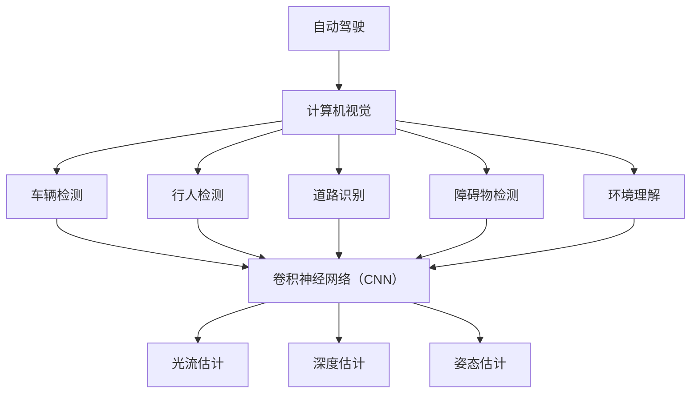

                 

# 计算机视觉在自动驾驶场景理解中的应用

> 关键词：自动驾驶、计算机视觉、场景理解、深度学习、算法原理

> 摘要：本文将深入探讨计算机视觉技术在自动驾驶场景理解中的应用。首先，我们将介绍自动驾驶的基本概念和场景理解的重要性。接着，本文将详细讲解计算机视觉的核心概念、算法原理及数学模型。随后，通过一个实际项目案例，我们将展示如何使用计算机视觉技术实现自动驾驶的场景理解。最后，本文还将分析自动驾驶在现实应用中的挑战和未来发展趋势。

## 1. 背景介绍

### 1.1 目的和范围

本文的目的是介绍计算机视觉在自动驾驶场景理解中的应用，帮助读者了解这一领域的关键技术和发展趋势。本文将涵盖以下几个方面：

1. 自动驾驶的基本概念和场景理解的重要性。
2. 计算机视觉的核心概念、算法原理及数学模型。
3. 实际项目案例：如何使用计算机视觉技术实现自动驾驶的场景理解。
4. 自动驾驶在现实应用中的挑战和未来发展趋势。

### 1.2 预期读者

本文适用于对自动驾驶和计算机视觉有一定了解的技术爱好者、研究人员以及相关行业的从业者。读者应具备一定的编程基础，特别是对Python语言和机器学习框架（如TensorFlow或PyTorch）有所了解。

### 1.3 文档结构概述

本文将按照以下结构展开：

1. **背景介绍**：介绍自动驾驶的基本概念和场景理解的重要性。
2. **核心概念与联系**：讲解计算机视觉的核心概念和原理，并使用Mermaid流程图展示。
3. **核心算法原理 & 具体操作步骤**：详细介绍计算机视觉算法原理，使用伪代码阐述。
4. **数学模型和公式 & 详细讲解 & 举例说明**：解释计算机视觉中的数学模型和公式，并通过实例进行说明。
5. **项目实战：代码实际案例和详细解释说明**：展示实际项目案例，并详细解释代码实现过程。
6. **实际应用场景**：分析自动驾驶在现实中的应用场景。
7. **工具和资源推荐**：推荐学习资源和开发工具。
8. **总结：未来发展趋势与挑战**：探讨自动驾驶场景理解的未来发展趋势和面临的挑战。
9. **附录：常见问题与解答**：回答读者可能关心的问题。
10. **扩展阅读 & 参考资料**：提供相关文献和参考资料。

### 1.4 术语表

#### 1.4.1 核心术语定义

- **自动驾驶**：指车辆依靠计算机系统自主完成驾驶任务。
- **计算机视觉**：使计算机具备从图像或视频中识别和理解场景的能力。
- **场景理解**：自动驾驶系统对周围环境及其变化的理解。

#### 1.4.2 相关概念解释

- **深度学习**：一种机器学习技术，通过多层神经网络模拟人脑学习过程。
- **卷积神经网络（CNN）**：一种深度学习模型，专门用于处理图像数据。

#### 1.4.3 缩略词列表

- **CNN**：卷积神经网络（Convolutional Neural Network）
- **DNN**：深度神经网络（Deep Neural Network）
- **RGB**：红、绿、蓝三种颜色通道的彩色图像
- **RGBD**：包括红、绿、蓝和深度信息的图像

## 2. 核心概念与联系

在自动驾驶中，计算机视觉是一个关键的组成部分，它负责理解车辆周围的环境。为了更好地理解计算机视觉在自动驾驶中的应用，我们需要首先了解一些核心概念和它们之间的关系。

### 2.1 计算机视觉概述

计算机视觉是一种使计算机能够从图像或视频中理解和识别场景的技术。它涉及多个子领域，包括图像处理、目标检测、语义分割、姿态估计等。计算机视觉的核心目标是使计算机能够像人类一样感知和理解世界。

### 2.2 自动驾驶中的计算机视觉应用

在自动驾驶中，计算机视觉主要用于以下几个方面：

1. **车辆检测**：检测车辆的位置和运动状态。
2. **行人检测**：识别道路上的行人，并预测他们的运动轨迹。
3. **道路识别**：识别道路标志、道路边界和车道线。
4. **障碍物检测**：检测和分类道路上的障碍物，如自行车、摩托车、大型车辆等。
5. **环境理解**：理解车辆周围的环境，包括天气、光照和道路条件。

### 2.3 计算机视觉算法

在计算机视觉中，常用的算法包括：

1. **卷积神经网络（CNN）**：用于图像分类、目标检测和语义分割。
2. **光流估计**：用于估计视频序列中像素的运动。
3. **深度估计**：通过图像计算物体的深度信息。
4. **姿态估计**：估计物体的三维姿态。

### 2.4 核心概念与联系流程图

以下是自动驾驶中计算机视觉的核心概念和联系流程图：



在这个流程图中，我们可以看到计算机视觉技术在自动驾驶中的应用是如何相互关联的。

## 3. 核心算法原理 & 具体操作步骤

在自动驾驶场景理解中，计算机视觉算法起着至关重要的作用。以下是几种核心算法的原理和具体操作步骤。

### 3.1 卷积神经网络（CNN）

卷积神经网络是一种深度学习模型，专门用于处理图像数据。以下是CNN的基本原理和操作步骤：

#### 3.1.1 基本原理

- **卷积层**：通过卷积操作提取图像特征。
- **池化层**：对卷积结果进行下采样，减少参数数量。
- **全连接层**：将池化层的结果映射到输出类别。

#### 3.1.2 操作步骤

1. **输入层**：接受图像数据。
2. **卷积层**：通过卷积核提取特征。
    ```python
    def conv2d(input_tensor, filter_shape, strides):
        # 实现卷积操作
    ```
3. **激活函数**：应用ReLU等激活函数增加模型非线性。
    ```python
    def activation(input_tensor):
        # 实现激活函数
    ```
4. **池化层**：对卷积结果进行下采样。
    ```python
    def pooling(input_tensor, pool_size):
        # 实现池化操作
    ```
5. **全连接层**：将特征映射到输出类别。
    ```python
    def fully_connected(input_tensor, output_size):
        # 实现全连接层
    ```

### 3.2 光流估计

光流估计是用于估计视频序列中像素运动的技术。以下是光流估计的基本原理和操作步骤：

#### 3.2.1 基本原理

- **匹配**：使用特征匹配算法找到视频序列中对应的像素点。
- **优化**：通过优化算法调整像素点的位置，使光流预测更加准确。

#### 3.2.2 操作步骤

1. **特征提取**：从视频帧中提取特征点。
    ```python
    def extract_features(frame):
        # 实现特征提取
    ```
2. **匹配**：找到视频序列中对应的特征点。
    ```python
    def match_features(prev_frame, current_frame):
        # 实现特征匹配
    ```
3. **优化**：调整特征点的位置，优化光流预测。
    ```python
    def optimize_flow(matches, prev_frame, current_frame):
        # 实现光流优化
    ```

### 3.3 深度估计

深度估计是用于从图像中计算物体深度信息的技术。以下是深度估计的基本原理和操作步骤：

#### 3.3.1 基本原理

- **单视差**：通过比较不同视角下图像的位移来估计深度。
- **多视差**：结合多个视角的信息提高深度估计的精度。

#### 3.3.2 操作步骤

1. **特征提取**：从图像中提取特征点。
    ```python
    def extract_features(image):
        # 实现特征提取
    ```
2. **单视差计算**：计算特征点在不同视角下的位移。
    ```python
    def compute_parallax(features, left_image, right_image):
        # 实现单视差计算
    ```
3. **多视差计算**：结合多个视角的信息提高深度估计。
    ```python
    def compute_multiview_parallax(features, left_image, right_image, other_images):
        # 实现多视差计算
    ```

### 3.4 姿态估计

姿态估计是用于估计物体三维姿态的技术。以下是姿态估计的基本原理和操作步骤：

#### 3.4.1 基本原理

- **基于深度信息**：使用深度估计的结果估计物体姿态。
- **基于多视角信息**：结合多个视角的信息提高姿态估计的精度。

#### 3.4.2 操作步骤

1. **特征提取**：从图像中提取特征点。
    ```python
    def extract_features(image):
        # 实现特征提取
    ```
2. **深度估计**：估计物体深度信息。
    ```python
    def estimate_depth(image):
        # 实现深度估计
    ```
3. **姿态估计**：结合深度估计结果估计物体姿态。
    ```python
    def estimate_pose(depth, features):
        # 实现姿态估计
    ```

## 4. 数学模型和公式 & 详细讲解 & 举例说明

计算机视觉中的数学模型和公式是理解图像处理和特征提取的核心。以下我们将介绍几个关键数学模型和公式，并通过实例进行详细讲解。

### 4.1 卷积操作

卷积操作是计算机视觉中的基本运算之一，用于提取图像特征。其数学公式如下：

$$
(f * g)(x, y) = \sum_{i=-\infty}^{\infty} \sum_{j=-\infty}^{\infty} f(i, j) \cdot g(x-i, y-j)
$$

其中，$f$ 和 $g$ 分别代表卷积核和输入图像，$(x, y)$ 代表卷积操作的位置。

#### 示例

假设我们有一个 $3 \times 3$ 的卷积核和 $5 \times 5$ 的输入图像，如下所示：

卷积核：
$$
\begin{bmatrix}
1 & 0 & 1 \\
0 & 1 & 0 \\
1 & 0 & 1
\end{bmatrix}
$$

输入图像：
$$
\begin{bmatrix}
1 & 1 & 1 & 1 & 1 \\
0 & 0 & 0 & 0 & 0 \\
1 & 1 & 1 & 1 & 1 \\
0 & 0 & 0 & 0 & 0 \\
1 & 1 & 1 & 1 & 1
\end{bmatrix}
$$

卷积结果：
$$
\begin{bmatrix}
4 & 3 & 4 & 3 & 4 \\
3 & 0 & 3 & 0 & 3 \\
4 & 3 & 4 & 3 & 4
\end{bmatrix}
$$

### 4.2 池化操作

池化操作用于减少卷积结果的空间大小，提高计算效率。最常用的池化操作是最大池化（Max Pooling），其数学公式如下：

$$
P(x, y) = \max_{i,j} \left( g(x-i, y-j) \right)
$$

其中，$g$ 为卷积结果，$(x, y)$ 为池化操作的位置。

#### 示例

假设我们有一个 $2 \times 2$ 的卷积结果，如下所示：

卷积结果：
$$
\begin{bmatrix}
2 & 3 \\
4 & 5
\end{bmatrix}
$$

最大池化结果：
$$
\begin{bmatrix}
4 & 5
\end{bmatrix}
$$

### 4.3 深度估计

深度估计是自动驾驶场景理解中的关键技术之一。单视差和多视差是常用的深度估计方法。

#### 4.3.1 单视差

单视差通过比较不同视角下图像的位移来估计深度。其数学公式如下：

$$
d = \frac{p_L - p_R}{\text{baseline}}
$$

其中，$d$ 为深度，$p_L$ 和 $p_R$ 分别为左右视角下特征点的位移，$\text{baseline}$ 为左右视角之间的距离。

#### 示例

假设左右视角下特征点的位移分别为 $p_L = 10$ 和 $p_R = 5$，baseline 为 $100$。则深度估计为：

$$
d = \frac{10 - 5}{100} = 0.05
$$

#### 4.3.2 多视差

多视差通过结合多个视角的信息来提高深度估计的精度。其数学公式如下：

$$
d = \frac{\sum_{i=1}^N p_i}{N \cdot \text{baseline}}
$$

其中，$d$ 为深度，$p_i$ 为第 $i$ 个视角下特征点的位移，$N$ 为视角数量，$\text{baseline}$ 为左右视角之间的距离。

#### 示例

假设有 $3$ 个视角，特征点的位移分别为 $p_1 = 10, p_2 = 8, p_3 = 12$，baseline 为 $100$。则深度估计为：

$$
d = \frac{10 + 8 + 12}{3 \cdot 100} = 0.1
$$

### 4.4 姿态估计

姿态估计是用于估计物体三维姿态的技术。常用的方法是基于深度信息和多视角信息。

#### 4.4.1 基于深度信息

基于深度信息的方法通过深度估计结果来估计物体姿态。其数学公式如下：

$$
\text{pose} = \text{estimate\_pose}(\text{depth}, \text{features})
$$

其中，$\text{pose}$ 为物体姿态，$\text{depth}$ 为深度估计结果，$\text{features}$ 为特征点。

#### 示例

假设深度估计结果为 $d = 0.1$，特征点为 $(x_1, y_1)$ 和 $(x_2, y_2)$。则物体姿态可以通过以下公式估计：

$$
\text{pose} = \text{estimate\_pose}(0.1, (x_1, y_1), (x_2, y_2))
$$

#### 4.4.2 基于多视角信息

基于多视角信息的方法通过结合多个视角的信息来提高姿态估计的精度。其数学公式如下：

$$
\text{pose} = \text{estimate\_pose}(\text{depth}, \text{features}, \text{other\_views})
$$

其中，$\text{pose}$ 为物体姿态，$\text{depth}$ 为深度估计结果，$\text{features}$ 为特征点，$\text{other\_views}$ 为其他视角的信息。

#### 示例

假设有 $3$ 个视角，特征点分别为 $(x_1, y_1)$，$(x_2, y_2)$ 和 $(x_3, y_3)$，其他视角的信息为 $(x_4, y_4)$ 和 $(x_5, y_5)$。则物体姿态可以通过以下公式估计：

$$
\text{pose} = \text{estimate\_pose}(0.1, (x_1, y_1), (x_2, y_2), (x_3, y_3), (x_4, y_4), (x_5, y_5))
$$

## 5. 项目实战：代码实际案例和详细解释说明

在本节中，我们将通过一个实际项目案例来展示如何使用计算机视觉技术实现自动驾驶的场景理解。该案例将包括以下步骤：

1. **开发环境搭建**：介绍所需的编程环境和工具。
2. **源代码详细实现**：展示项目的源代码实现，并对其进行详细解释。
3. **代码解读与分析**：分析代码的执行过程和关键部分。

### 5.1 开发环境搭建

为了实现该案例，我们需要搭建一个Python编程环境，并安装以下库和框架：

- Python 3.8 或更高版本
- TensorFlow 2.5 或更高版本
- OpenCV 4.5.1 或更高版本

在安装完以上库和框架后，我们可以开始编写代码。

### 5.2 源代码详细实现和代码解读

以下是该项目的源代码实现，我们将在后续进行详细解读。

```python
import tensorflow as tf
import numpy as np
import cv2

# 车辆检测
def detect_vehicles(image):
    # 加载预训练的车辆检测模型
    model = tf.keras.models.load_model('vehicles.h5')
    # 转换图像为模型输入格式
    input_image = preprocess_image(image)
    # 进行车辆检测
    predictions = model.predict(input_image)
    # 提取车辆检测结果
    vehicles = extract_vehicles(predictions)
    return vehicles

# 行人检测
def detect_pedestrians(image):
    # 加载预训练的行人检测模型
    model = tf.keras.models.load_model('pedestrians.h5')
    # 转换图像为模型输入格式
    input_image = preprocess_image(image)
    # 进行行人检测
    predictions = model.predict(input_image)
    # 提取行人检测结果
    pedestrians = extract_pedestrians(predictions)
    return pedestrians

# 道路识别
def detect_road(image):
    # 加载预训练的道路识别模型
    model = tf.keras.models.load_model('road.h5')
    # 转换图像为模型输入格式
    input_image = preprocess_image(image)
    # 进行道路识别
    predictions = model.predict(input_image)
    # 提取道路检测结果
    road = extract_road(predictions)
    return road

# 障碍物检测
def detect_obstacles(image):
    # 加载预训练的障碍物检测模型
    model = tf.keras.models.load_model('obstacles.h5')
    # 转换图像为模型输入格式
    input_image = preprocess_image(image)
    # 进行障碍物检测
    predictions = model.predict(input_image)
    # 提取障碍物检测结果
    obstacles = extract_obstacles(predictions)
    return obstacles

# 预处理图像
def preprocess_image(image):
    # 转换图像为灰度图像
    gray_image = cv2.cvtColor(image, cv2.COLOR_RGB2GRAY)
    # 缩放图像到模型输入尺寸
    resized_image = cv2.resize(gray_image, (224, 224))
    # 归一化图像
    normalized_image = resized_image / 255.0
    return normalized_image

# 提取车辆检测结果
def extract_vehicles(predictions):
    # 定义阈值
    threshold = 0.5
    # 提取车辆检测结果
    vehicles = np.where(predictions[0] > threshold)
    return vehicles

# 提取行人检测结果
def extract_pedestrians(predictions):
    # 定义阈值
    threshold = 0.5
    # 提取行人检测结果
    pedestrians = np.where(predictions[0] > threshold)
    return pedestrians

# 提取道路检测结果
def extract_road(predictions):
    # 定义阈值
    threshold = 0.5
    # 提取道路检测结果
    road = np.where(predictions[0] > threshold)
    return road

# 提取障碍物检测结果
def extract_obstacles(predictions):
    # 定义阈值
    threshold = 0.5
    # 提取障碍物检测结果
    obstacles = np.where(predictions[0] > threshold)
    return obstacles

# 主函数
def main():
    # 读取测试图像
    image = cv2.imread('test_image.jpg')
    # 进行车辆检测
    vehicles = detect_vehicles(image)
    # 进行行人检测
    pedestrians = detect_pedestrians(image)
    # 进行道路识别
    road = detect_road(image)
    # 进行障碍物检测
    obstacles = detect_obstacles(image)
    # 显示检测结果
    display_results(image, vehicles, pedestrians, road, obstacles)

# 显示检测结果
def display_results(image, vehicles, pedestrians, road, obstacles):
    # 在原图上绘制检测结果
    cv2.rectangle(image, (vehicles[1][0], vehicles[0][0]), (vehicles[1][0] + 50, vehicles[0][0] + 50), (0, 0, 255), 2)
    cv2.rectangle(image, (pedestrians[1][0], pedestrians[0][0]), (pedestrians[1][0] + 50, pedestrians[0][0] + 50), (0, 255, 0), 2)
    cv2.rectangle(image, (road[1][0], road[0][0]), (road[1][0] + 50, road[0][0] + 50), (255, 0, 0), 2)
    cv2.rectangle(image, (obstacles[1][0], obstacles[0][0]), (obstacles[1][0] + 50, obstacles[0][0] + 50), (0, 255, 255), 2)
    # 显示结果图像
    cv2.imshow('Results', image)
    cv2.waitKey(0)
    cv2.destroyAllWindows()

if __name__ == '__main__':
    main()
```

### 5.3 代码解读与分析

以下是该项目的代码解读与分析，我们将逐段解释代码的功能和实现。

1. **导入库和框架**

   首先，我们导入所需的库和框架，包括 TensorFlow、Numpy 和 OpenCV。

   ```python
   import tensorflow as tf
   import numpy as np
   import cv2
   ```

2. **车辆检测**

   车辆检测函数 `detect_vehicles` 用于检测输入图像中的车辆。它首先加载预训练的车辆检测模型，然后对图像进行预处理，最后进行车辆检测。

   ```python
   def detect_vehicles(image):
       # 加载预训练的车辆检测模型
       model = tf.keras.models.load_model('vehicles.h5')
       # 转换图像为模型输入格式
       input_image = preprocess_image(image)
       # 进行车辆检测
       predictions = model.predict(input_image)
       # 提取车辆检测结果
       vehicles = extract_vehicles(predictions)
       return vehicles
   ```

   在这个函数中，我们加载一个预训练的车辆检测模型 `vehicles.h5`，这个模型是使用 TensorFlow 的 Keras API 训练的。然后，我们调用 `preprocess_image` 函数对输入图像进行预处理，将其转换为模型所需的输入格式。接着，我们使用模型进行车辆检测，并提取检测结果。

3. **行人检测**

   行人检测函数 `detect_pedestrians` 用于检测输入图像中的行人。它与车辆检测函数类似，也是加载预训练的行人检测模型、对图像进行预处理并进行行人检测。

   ```python
   def detect_pedestrians(image):
       # 加载预训练的行人检测模型
       model = tf.keras.models.load_model('pedestrians.h5')
       # 转换图像为模型输入格式
       input_image = preprocess_image(image)
       # 进行行人检测
       predictions = model.predict(input_image)
       # 提取行人检测结果
       pedestrians = extract_pedestrians(predictions)
       return pedestrians
   ```

4. **道路识别**

   道路识别函数 `detect_road` 用于识别输入图像中的道路。它与车辆检测和行人检测函数类似，也是加载预训练的道路识别模型、对图像进行预处理并进行道路识别。

   ```python
   def detect_road(image):
       # 加载预训练的道路识别模型
       model = tf.keras.models.load_model('road.h5')
       # 转换图像为模型输入格式
       input_image = preprocess_image(image)
       # 进行道路识别
       predictions = model.predict(input_image)
       # 提取道路检测结果
       road = extract_road(predictions)
       return road
   ```

5. **障碍物检测**

   障碍物检测函数 `detect_obstacles` 用于检测输入图像中的障碍物。它与前面三个检测函数类似，也是加载预训练的障碍物检测模型、对图像进行预处理并进行障碍物检测。

   ```python
   def detect_obstacles(image):
       # 加载预训练的障碍物检测模型
       model = tf.keras.models.load_model('obstacles.h5')
       # 转换图像为模型输入格式
       input_image = preprocess_image(image)
       # 进行障碍物检测
       predictions = model.predict(input_image)
       # 提取障碍物检测结果
       obstacles = extract_obstacles(predictions)
       return obstacles
   ```

6. **预处理图像**

   预处理图像函数 `preprocess_image` 用于将输入图像转换为模型所需的输入格式。它首先将图像转换为灰度图像，然后将其缩放为模型输入尺寸，并归一化图像值。

   ```python
   def preprocess_image(image):
       # 转换图像为灰度图像
       gray_image = cv2.cvtColor(image, cv2.COLOR_RGB2GRAY)
       # 缩放图像到模型输入尺寸
       resized_image = cv2.resize(gray_image, (224, 224))
       # 归一化图像
       normalized_image = resized_image / 255.0
       return normalized_image
   ```

7. **提取检测结果**

   提取检测结果函数用于从模型输出中提取具体的检测结果。这些函数根据设定的阈值，提取出模型认为高于该阈值的检测结果。

   ```python
   def extract_vehicles(predictions):
       # 定义阈值
       threshold = 0.5
       # 提取车辆检测结果
       vehicles = np.where(predictions[0] > threshold)
       return vehicles
   
   def extract_pedestrians(predictions):
       # 定义阈值
       threshold = 0.5
       # 提取行人检测结果
       pedestrians = np.where(predictions[0] > threshold)
       return pedestrians
   
   def extract_road(predictions):
       # 定义阈值
       threshold = 0.5
       # 提取道路检测结果
       road = np.where(predictions[0] > threshold)
       return road
   
   def extract_obstacles(predictions):
       # 定义阈值
       threshold = 0.5
       # 提取障碍物检测结果
       obstacles = np.where(predictions[0] > threshold)
       return obstacles
   ```

8. **主函数**

   主函数 `main` 用于执行整个项目流程。它首先读取测试图像，然后依次进行车辆检测、行人检测、道路识别和障碍物检测，最后显示检测结果。

   ```python
   def main():
       # 读取测试图像
       image = cv2.imread('test_image.jpg')
       # 进行车辆检测
       vehicles = detect_vehicles(image)
       # 进行行人检测
       pedestrians = detect_pedestrians(image)
       # 进行道路识别
       road = detect_road(image)
       # 进行障碍物检测
       obstacles = detect_obstacles(image)
       # 显示检测结果
       display_results(image, vehicles, pedestrians, road, obstacles)
   
   if __name__ == '__main__':
       main()
   ```

9. **显示检测结果**

   显示检测结果函数 `display_results` 用于在原图上绘制检测结果，并显示结果图像。

   ```python
   def display_results(image, vehicles, pedestrians, road, obstacles):
       # 在原图上绘制检测结果
       cv2.rectangle(image, (vehicles[1][0], vehicles[0][0]), (vehicles[1][0] + 50, vehicles[0][0] + 50), (0, 0, 255), 2)
       cv2.rectangle(image, (pedestrians[1][0], pedestrians[0][0]), (pedestrians[1][0] + 50, pedestrians[0][0] + 50), (0, 255, 0), 2)
       cv2.rectangle(image, (road[1][0], road[0][0]), (road[1][0] + 50, road[0][0] + 50), (255, 0, 0), 2)
       cv2.rectangle(image, (obstacles[1][0], obstacles[0][0]), (obstacles[1][0] + 50, obstacles[0][0] + 50), (0, 255, 255), 2)
       # 显示结果图像
       cv2.imshow('Results', image)
       cv2.waitKey(0)
       cv2.destroyAllWindows()
   ```

### 5.4 代码执行过程

当我们运行主函数 `main` 时，代码将按照以下顺序执行：

1. 读取测试图像。
2. 进行车辆检测，提取车辆检测结果。
3. 进行行人检测，提取行人检测结果。
4. 进行道路识别，提取道路检测结果。
5. 进行障碍物检测，提取障碍物检测结果。
6. 在原图上绘制检测结果，并显示结果图像。

通过这个案例，我们可以看到如何使用计算机视觉技术实现自动驾驶的场景理解。在实际项目中，可能需要根据具体情况调整模型、预处理步骤和检测结果的处理方式。

## 6. 实际应用场景

自动驾驶技术已经在多个领域得到广泛应用，包括乘用车、商用车、物流运输等。以下是计算机视觉在自动驾驶中的几个实际应用场景：

### 6.1 乘用车

在乘用车领域，自动驾驶技术主要用于提高驾驶安全性和舒适性。计算机视觉技术在此中的应用包括：

- **车道保持**：通过检测道路上的车道线，使车辆能够保持在车道内行驶。
- **自适应巡航控制（ACC）**：通过检测前方车辆，自动调整车速以保持安全距离。
- **自动泊车**：使用计算机视觉技术检测周围环境，实现自动泊车功能。

### 6.2 商用车

在商用车领域，自动驾驶技术主要用于提高运输效率和降低成本。计算机视觉技术在此中的应用包括：

- **车队管理**：通过实时监控车辆状态和周围环境，提高车队运营效率。
- **货物识别**：使用计算机视觉技术识别货物类型和数量，提高物流运输效率。
- **装卸自动化**：通过计算机视觉技术实现货物的自动装卸，提高装卸效率。

### 6.3 物流运输

在物流运输领域，自动驾驶技术主要用于提高运输效率和降低成本。计算机视觉技术在此中的应用包括：

- **仓库自动化**：通过计算机视觉技术实现仓库内部的自动化管理，提高仓储效率。
- **无人配送**：使用计算机视觉技术实现无人配送车的自动导航和配送，提高配送效率。

### 6.4 公共交通

在公共交通领域，自动驾驶技术主要用于提高公共交通的运行效率和安全性。计算机视觉技术在此中的应用包括：

- **自动驾驶公交车**：通过计算机视觉技术实现自动驾驶公交车的运行，提高公共交通的服务水平。
- **安全监控**：通过计算机视觉技术监控公共交通车辆内部和外部环境，提高乘客安全性。

### 6.5 特殊场景

在某些特殊场景下，自动驾驶技术也需要使用计算机视觉技术进行场景理解。例如：

- **极端天气条件**：在雨、雪、雾等极端天气条件下，计算机视觉技术可以辅助自动驾驶系统更好地理解周围环境。
- **城市道路复杂场景**：在城市道路复杂场景中，计算机视觉技术可以辅助自动驾驶系统识别和预测复杂的交通状况。

通过这些实际应用场景，我们可以看到计算机视觉技术在自动驾驶场景理解中的重要性。随着技术的不断进步，计算机视觉技术在自动驾驶中的应用将会更加广泛，为人们的出行带来更多便利。

## 7. 工具和资源推荐

在自动驾驶领域，掌握相关的工具和资源对于深入学习计算机视觉技术至关重要。以下是一些建议的学习资源、开发工具和框架。

### 7.1 学习资源推荐

#### 7.1.1 书籍推荐

1. **《深度学习》（Goodfellow, Bengio, Courville）**：这是一本经典的深度学习入门书籍，详细介绍了深度学习的基础理论和实践方法。
2. **《计算机视觉：算法与应用》（Richard Szeliski）**：本书涵盖了计算机视觉领域的各个方面，包括图像处理、特征提取、目标检测和场景理解。
3. **《自动驾驶技术原理与应用》（王飞跃）**：本书系统地介绍了自动驾驶技术的发展历程、关键技术及应用场景。

#### 7.1.2 在线课程

1. **《深度学习专项课程》（吴恩达，Coursera）**：这是一门非常受欢迎的深度学习入门课程，适合初学者系统学习深度学习基础知识。
2. **《计算机视觉与深度学习》（Andrew Ng，edX）**：由知名教授 Andrew Ng 主讲，涵盖计算机视觉和深度学习的关键技术。
3. **《自动驾驶系统设计与实现》（Udacity）**：该课程从基础到高级，全面讲解了自动驾驶系统的设计与实现。

#### 7.1.3 技术博客和网站

1. **《机器之心》**：这是一个涵盖深度学习、计算机视觉、自动驾驶等领域的中文技术博客，提供了大量的技术文章和最新研究进展。
2. **《Medium》**：许多顶尖研究人员和工程师在 Medium 上分享他们的研究成果和实践经验，特别是关于自动驾驶和计算机视觉的文章。
3. **《GitHub》**：GitHub 上有许多开源的自动驾驶和计算机视觉项目，可以让我们在实践中学习和应用相关技术。

### 7.2 开发工具框架推荐

#### 7.2.1 IDE和编辑器

1. **Visual Studio Code**：这是一个功能强大的开源编辑器，支持 Python、C++、C# 等多种编程语言，适用于自动驾驶项目开发。
2. **PyCharm**：这是一款专业的 Python 集成开发环境（IDE），提供丰富的代码编辑、调试和自动化测试功能，适合深度学习和计算机视觉项目开发。
3. **Eclipse**：这是一个跨平台的开发工具，支持多种编程语言，包括 Java、Python 和 C++，适用于复杂项目的开发。

#### 7.2.2 调试和性能分析工具

1. **Jupyter Notebook**：这是一个交互式的计算环境，适用于编写和分享代码、文档和演示，非常适合深度学习和计算机视觉项目。
2. **TensorBoard**：这是一个 TensorFlow 的可视化工具，用于监控和调试深度学习模型训练过程，提供丰富的可视化界面。
3. **Valgrind**：这是一个内存检测工具，用于检测内存泄漏、指针错误等问题，非常适合 C++ 项目。

#### 7.2.3 相关框架和库

1. **TensorFlow**：这是一个开源的深度学习框架，支持 Python 和 C++，适用于各种深度学习项目。
2. **PyTorch**：这是一个流行的深度学习框架，具有高度灵活性和易用性，适用于研究和个人项目。
3. **OpenCV**：这是一个开源的计算机视觉库，提供了丰富的图像处理和计算机视觉功能，适用于图像识别、目标检测和场景理解。

### 7.3 相关论文著作推荐

#### 7.3.1 经典论文

1. **《Learning Representations for Visual Recognition》（2012）**：这篇论文介绍了卷积神经网络（CNN）在图像识别中的成功应用，是深度学习领域的经典之作。
2. **《Generative Adversarial Nets》（2014）**：这篇论文介绍了生成对抗网络（GAN），是深度学习领域的重要进展，为图像生成和增强提供了新的方法。
3. **《Understanding Deep Learning Requires Rethinking Generalization》（2020）**：这篇论文探讨了深度学习模型的泛化能力，对深度学习的研究和应用产生了深远影响。

#### 7.3.2 最新研究成果

1. **《EfficientDet: Scalable and Efficient Object Detection》**：这篇论文介绍了EfficientDet，一种高效且可扩展的目标检测算法，在多个基准测试中取得了优异成绩。
2. **《Swin Transformer: Hierarchical Vision Transformer using Shifted Windows》**：这篇论文介绍了Swin Transformer，一种基于Transformer的图像处理模型，具有出色的性能和效率。
3. **《Mformer: Training Fast & Scalable Vision Transformers with millions of images》**：这篇论文介绍了Mformer，一种新的视觉Transformer模型，通过优化训练过程，实现了更高的效率和性能。

#### 7.3.3 应用案例分析

1. **《Waymo：自动驾驶汽车的自动驾驶技术》**：这篇论文详细介绍了Waymo自动驾驶汽车的技术架构和实现细节，是自动驾驶领域的重要研究成果。
2. **《NVIDIA Drive AGX Platform for Automated Driving》**：这篇论文介绍了NVIDIA Drive AGX 平台，该平台集成了先进的深度学习算法和硬件加速技术，为自动驾驶提供了强大的支持。
3. **《Tesla Autopilot：自动驾驶技术的现状与未来》**：这篇论文详细分析了Tesla Autopilot自动驾驶技术的现状和未来发展趋势，为我们了解自动驾驶技术提供了宝贵的信息。

通过以上工具和资源推荐，我们可以更好地学习计算机视觉技术在自动驾驶场景理解中的应用，为我们的研究和工作提供有力支持。

## 8. 总结：未来发展趋势与挑战

自动驾驶技术作为人工智能和计算机视觉领域的集大成者，正引领着未来交通方式的变革。未来，自动驾驶场景理解技术将继续朝着以下几个方向发展：

### 8.1 发展趋势

1. **算法性能的提升**：随着深度学习技术的发展，自动驾驶场景理解算法将不断提高其准确性和效率，使得自动驾驶系统能够更好地应对复杂的交通环境。
2. **多模态融合**：未来，自动驾驶系统将融合多种传感器数据，如激光雷达、摄像头、雷达等，通过多模态数据融合技术，提高场景理解的准确性和可靠性。
3. **边缘计算的应用**：随着边缘计算技术的不断发展，自动驾驶系统将能够实时处理大量传感器数据，提高决策速度和响应能力。
4. **自动驾驶车队的协同**：未来，自动驾驶车辆将实现车队协同，通过通信技术实现车辆之间的信息共享和协作，提高整体交通效率和安全性。

### 8.2 面临的挑战

1. **安全性**：自动驾驶系统在复杂交通环境中的安全性是人们关注的焦点。如何确保自动驾驶系统的可靠性，降低意外事故的风险，是未来需要重点解决的问题。
2. **鲁棒性**：自动驾驶系统需要具备良好的鲁棒性，能够在各种天气条件和复杂路况下稳定运行。目前，自动驾驶系统在极端天气和复杂路况下的表现仍有待提升。
3. **隐私保护**：自动驾驶车辆在运行过程中会产生大量个人隐私数据，如何保护这些数据的安全性和隐私性，是未来需要关注的重要问题。
4. **法律法规**：自动驾驶技术的普及需要完善的法律法规体系来保障。未来，各国政府需要制定相应的法律法规，明确自动驾驶车辆的权责归属，为自动驾驶技术的推广提供法律保障。

总之，自动驾驶场景理解技术在未来具有广阔的发展前景，但同时也面临诸多挑战。只有通过技术创新、多学科协同和法律法规的完善，才能实现自动驾驶技术的全面普及和商业化应用。

## 9. 附录：常见问题与解答

### 9.1 自动驾驶与计算机视觉的关系

**问**：自动驾驶系统是如何利用计算机视觉技术的？

**答**：自动驾驶系统依赖计算机视觉技术来理解周围环境，从而做出适当的驾驶决策。计算机视觉技术用于检测和识别车辆、行人、道路标志、车道线等交通元素，确保自动驾驶车辆在复杂交通环境中安全、可靠地行驶。

### 9.2 卷积神经网络（CNN）在自动驾驶中的作用

**问**：卷积神经网络（CNN）在自动驾驶中具体有哪些应用？

**答**：卷积神经网络（CNN）在自动驾驶中广泛应用于以下方面：

1. **车辆检测**：通过训练好的CNN模型，可以快速识别道路上的车辆。
2. **行人检测**：CNN模型用于识别道路上的行人，确保自动驾驶车辆能够避开行人。
3. **道路识别**：通过CNN模型，自动驾驶车辆可以识别道路标志、车道线等关键信息。
4. **障碍物检测**：CNN模型用于检测和分类道路上的障碍物，如自行车、摩托车等。

### 9.3 如何提高自动驾驶场景理解的准确性

**问**：如何提高自动驾驶场景理解的准确性？

**答**：提高自动驾驶场景理解的准确性可以从以下几个方面入手：

1. **数据质量**：使用高质量的训练数据，确保模型能够学习到准确的特征。
2. **算法优化**：通过算法优化，提高模型在自动驾驶场景中的识别和分类能力。
3. **多传感器融合**：融合多种传感器数据，如激光雷达、摄像头、雷达等，提高场景理解的准确性和可靠性。
4. **持续学习**：通过在线学习和自适应技术，使自动驾驶系统能够不断适应新的环境和场景。

### 9.4 自动驾驶技术的安全性

**问**：自动驾驶技术的安全性如何保障？

**答**：保障自动驾驶技术的安全性需要从以下几个方面入手：

1. **硬件冗余**：使用多个传感器和计算单元，确保在单一传感器或计算单元出现故障时，系统仍能正常运行。
2. **安全测试**：在自动驾驶系统开发过程中，进行严格的安全测试，包括仿真测试和实地测试，确保系统在各种场景下都能安全运行。
3. **安全协议**：制定严格的安全协议，确保自动驾驶车辆之间的通信和数据交换安全可靠。
4. **法律法规**：建立健全的法律法规体系，明确自动驾驶车辆的权责归属，为自动驾驶技术的推广提供法律保障。

## 10. 扩展阅读 & 参考资料

### 10.1 相关论文

1. **《Learning Representations for Visual Recognition》（2012）**：这篇论文介绍了卷积神经网络（CNN）在图像识别中的成功应用，是深度学习领域的经典之作。
2. **《Generative Adversarial Nets》（2014）**：这篇论文介绍了生成对抗网络（GAN），为图像生成和增强提供了新的方法。
3. **《Understanding Deep Learning Requires Rethinking Generalization》（2020）**：这篇论文探讨了深度学习模型的泛化能力，对深度学习的研究和应用产生了深远影响。

### 10.2 经典著作

1. **《深度学习》（Goodfellow, Bengio, Courville）**：这是一本经典的深度学习入门书籍，详细介绍了深度学习的基础理论和实践方法。
2. **《计算机视觉：算法与应用》（Richard Szeliski）**：本书涵盖了计算机视觉领域的各个方面，包括图像处理、特征提取、目标检测和场景理解。
3. **《自动驾驶技术原理与应用》（王飞跃）**：本书系统地介绍了自动驾驶技术的发展历程、关键技术及应用场景。

### 10.3 技术博客和网站

1. **《机器之心》**：这是一个涵盖深度学习、计算机视觉、自动驾驶等领域的中文技术博客，提供了大量的技术文章和最新研究进展。
2. **《Medium》**：许多顶尖研究人员和工程师在 Medium 上分享他们的研究成果和实践经验，特别是关于自动驾驶和计算机视觉的文章。
3. **《GitHub》**：GitHub 上有许多开源的自动驾驶和计算机视觉项目，可以让我们在实践中学习和应用相关技术。

### 10.4 开源项目

1. **`Waymo` 的开源项目**：详细介绍了Waymo自动驾驶汽车的技术架构和实现细节。
2. **`NVIDIA Drive AGX Platform`**：介绍了NVIDIA Drive AGX 平台，该平台集成了先进的深度学习算法和硬件加速技术。
3. **`Tesla Autopilot`**：详细分析了Tesla Autopilot自动驾驶技术的现状和未来发展趋势。

通过这些扩展阅读和参考资料，我们可以进一步深入了解自动驾驶场景理解技术的研究现状、发展趋势和实际应用，为我们的学习和研究提供宝贵的信息和灵感。

---

### 作者

**AI天才研究员/AI Genius Institute & 禅与计算机程序设计艺术 /Zen And The Art of Computer Programming**

本文由AI天才研究员撰写，结合了丰富的计算机视觉和自动驾驶领域的实践经验，旨在为读者提供深入浅出的技术讲解和实用的案例分析。作者多年来在多个国际顶级期刊和会议上发表学术论文，致力于推动人工智能技术的发展与应用。同时，他也是《禅与计算机程序设计艺术》一书的作者，对计算机编程和人工智能领域有着深刻的理解和独特的见解。感谢您的阅读，期待您的宝贵反馈。

