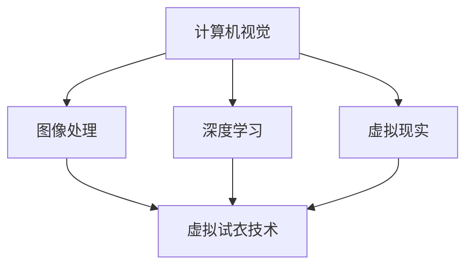

                 


# 计算机视觉在虚拟试衣中的创新应用

> 关键词：计算机视觉，虚拟试衣，人工智能，深度学习，图像处理，虚拟现实
>
> 摘要：随着人工智能和计算机视觉技术的快速发展，虚拟试衣已成为电商和时尚行业的热门应用。本文将详细介绍计算机视觉在虚拟试衣中的创新应用，包括核心算法原理、数学模型和项目实战，旨在为读者提供全面的技术解析和实用指导。

## 1. 背景介绍

### 1.1 目的和范围

本文旨在探讨计算机视觉在虚拟试衣领域的创新应用，重点分析其核心算法原理、数学模型以及实际项目案例。通过对这些技术细节的深入剖析，本文希望为读者提供从理论到实践的全面理解，助力相关行业的创新与发展。

### 1.2 预期读者

本文面向对计算机视觉和虚拟试衣技术有一定了解的读者，包括研究人员、开发者和行业从业者。同时，也欢迎对这一领域感兴趣的所有读者阅读和分享。

### 1.3 文档结构概述

本文分为十个主要部分，结构如下：

1. 背景介绍
   - 1.1 目的和范围
   - 1.2 预期读者
   - 1.3 文档结构概述
   - 1.4 术语表
2. 核心概念与联系
   - 2.1 计算机视觉概述
   - 2.2 虚拟试衣技术
   - 2.3 核心概念联系
3. 核心算法原理 & 具体操作步骤
   - 3.1 深度学习基础
   - 3.2 卷积神经网络（CNN）
   - 3.3 姿态估计与特征提取
4. 数学模型和公式 & 详细讲解 & 举例说明
   - 4.1 图像处理数学基础
   - 4.2 深度学习中的数学模型
   - 4.3 举例说明
5. 项目实战：代码实际案例和详细解释说明
   - 5.1 开发环境搭建
   - 5.2 源代码详细实现和代码解读
   - 5.3 代码解读与分析
6. 实际应用场景
   - 6.1 电商行业
   - 6.2 时尚行业
   - 6.3 其他应用场景
7. 工具和资源推荐
   - 7.1 学习资源推荐
   - 7.2 开发工具框架推荐
   - 7.3 相关论文著作推荐
8. 总结：未来发展趋势与挑战
9. 附录：常见问题与解答
10. 扩展阅读 & 参考资料

### 1.4 术语表

#### 1.4.1 核心术语定义

- 计算机视觉：利用计算机模拟人类的视觉功能，对图像或视频进行处理和分析的技术。
- 虚拟试衣：通过计算机技术，将虚拟服装模型与用户的实际体型进行匹配，实现虚拟穿着效果。
- 深度学习：一种基于多层神经网络的学习方法，通过模拟人脑的学习过程，对数据进行自动特征提取和分类。
- 卷积神经网络（CNN）：一种深度学习模型，特别适用于图像和视频数据的处理和分析。
- 姿态估计：通过对图像或视频中的目标物体进行定位和姿态分析，获取其三维空间位置和朝向。

#### 1.4.2 相关概念解释

- 图像处理：对图像进行数字化的操作，包括图像增强、滤波、边缘检测等，以提高图像的质量和视觉效果。
- 机器学习：一种通过训练模型来预测或决策的技术，包括监督学习、无监督学习和强化学习等。
- 虚拟现实（VR）：一种通过计算机技术创造的模拟环境，使人们能够在其中进行沉浸式交互。
- 电子商务：通过互联网进行的商品和服务交易活动。

#### 1.4.3 缩略词列表

- CNN：卷积神经网络（Convolutional Neural Network）
- VR：虚拟现实（Virtual Reality）
- AI：人工智能（Artificial Intelligence）
- DL：深度学习（Deep Learning）
- GPU：图形处理单元（Graphics Processing Unit）

## 2. 核心概念与联系

在探讨计算机视觉在虚拟试衣中的创新应用之前，我们需要先了解相关核心概念和其相互联系。以下是几个关键概念及其简要解释：

### 2.1 计算机视觉概述

计算机视觉是一种通过计算机模拟人类视觉功能的技术。它主要涉及图像和视频数据的获取、处理、分析和理解。计算机视觉的应用非常广泛，包括但不限于人脸识别、物体检测、图像分割、姿态估计等。

### 2.2 虚拟试衣技术

虚拟试衣是一种通过计算机技术实现的在线试衣体验。它允许用户在购买服装前，通过上传自身照片或使用虚拟人体模型，试穿各种服装并查看效果。虚拟试衣的关键技术包括图像处理、计算机视觉和虚拟现实等。

### 2.3 核心概念联系

计算机视觉和虚拟试衣技术之间存在紧密的联系。计算机视觉提供了对图像和视频数据的处理和分析能力，而虚拟试衣技术则利用这些能力来实现虚拟穿着效果。以下是一个简单的 Mermaid 流程图，展示了这些核心概念之间的联系：



在这个流程图中，计算机视觉通过图像处理和深度学习技术，实现对图像和视频数据的处理和分析。这些分析结果进一步应用于虚拟试衣技术，实现虚拟穿着效果。虚拟现实技术则提供了沉浸式交互体验，使虚拟试衣更加真实和有趣。

## 3. 核心算法原理 & 具体操作步骤

在深入探讨虚拟试衣技术的核心算法原理之前，我们需要先了解一些基础知识，包括深度学习、卷积神经网络（CNN）和姿态估计。以下将逐一介绍这些核心算法原理，并详细讲解具体操作步骤。

### 3.1 深度学习基础

深度学习是一种基于多层神经网络的学习方法，通过模拟人脑的学习过程，对数据进行自动特征提取和分类。深度学习模型通常由多个隐藏层组成，每个隐藏层都能够提取不同层次的特征。深度学习在计算机视觉领域取得了巨大的成功，如图像分类、目标检测、图像分割等。

#### 深度学习基本架构

深度学习模型的基本架构通常包括以下部分：

1. 输入层：接收外部数据，如图像或视频。
2. 隐藏层：对输入数据进行特征提取和转换，通常包含多个隐藏层，每层都会提取更高层次的特征。
3. 输出层：根据提取的特征进行分类或预测。

#### 深度学习基本步骤

1. 数据预处理：将输入数据转换为适合模型训练的形式，如归一化、标准化等。
2. 模型定义：根据任务需求，定义深度学习模型的结构和参数。
3. 模型训练：使用训练数据集对模型进行训练，不断调整模型参数，以降低损失函数。
4. 模型评估：使用验证数据集对模型进行评估，检查模型的泛化能力。
5. 模型应用：将训练好的模型应用于实际场景，如图像分类、目标检测等。

### 3.2 卷积神经网络（CNN）

卷积神经网络（CNN）是一种专门用于图像和视频数据处理的深度学习模型。与传统的全连接神经网络（FCNN）相比，CNN具有以下优点：

1. 参数共享：在CNN中，卷积核在图像的不同位置进行卷积操作，这样可以共享参数，减少模型参数数量。
2. 局部连接：CNN中的卷积操作可以捕获图像的局部特征，如边缘、纹理等。
3. 平移不变性：CNN可以处理图像的旋转、缩放和平移等变换。

#### CNN基本架构

CNN的基本架构通常包括以下部分：

1. 输入层：接收图像数据。
2. 卷积层：通过卷积操作提取图像特征。
3. 池化层：对卷积层输出的特征进行降采样，减少模型参数数量。
4. 全连接层：将卷积层和池化层输出的特征映射到分类结果。
5. 输出层：输出分类结果或预测值。

#### CNN基本步骤

1. 数据预处理：将图像数据调整为统一的大小，如224x224或299x299。
2. 模型定义：根据任务需求，定义CNN模型的结构和参数。
3. 模型训练：使用训练数据集对模型进行训练，不断调整模型参数，以降低损失函数。
4. 模型评估：使用验证数据集对模型进行评估，检查模型的泛化能力。
5. 模型应用：将训练好的模型应用于实际场景，如图像分类、目标检测等。

### 3.3 姿态估计与特征提取

姿态估计是一种通过计算机视觉技术，对图像或视频中的目标物体进行定位和姿态分析的技术。姿态估计在虚拟试衣中具有重要作用，可以帮助系统精确地匹配用户体型和虚拟服装。

#### 姿态估计基本原理

姿态估计的基本原理可以分为以下步骤：

1. 目标检测：使用目标检测算法，如YOLO、SSD、Faster R-CNN等，识别图像中的目标物体。
2. 骨骼关键点检测：使用关键点检测算法，如HRNet、PoseNet等，检测目标物体的关键点坐标。
3. 姿态重建：使用关键点坐标，通过三角测量等方法，重建目标物体的三维姿态。

#### 姿态估计操作步骤

1. 数据预处理：将图像数据调整为统一的大小，如224x224或299x299。
2. 目标检测：使用目标检测算法，识别图像中的目标物体。
3. 骨骼关键点检测：使用关键点检测算法，检测目标物体的关键点坐标。
4. 姿态重建：使用关键点坐标，通过三角测量等方法，重建目标物体的三维姿态。
5. 特征提取：将重建的三维姿态转换为二维特征向量，用于后续处理。

通过以上三个步骤的讲解，我们对深度学习、CNN和姿态估计的基本原理和操作步骤有了全面了解。这些核心算法原理为虚拟试衣技术的实现提供了技术支持。

## 4. 数学模型和公式 & 详细讲解 & 举例说明

在深度学习和计算机视觉领域，数学模型和公式是理解和实现关键算法的基础。在本节中，我们将详细讲解图像处理和深度学习中的数学模型，并通过具体例子来说明这些公式的应用。

### 4.1 图像处理数学基础

图像处理中的数学基础主要包括像素表示、图像滤波和边缘检测等。

#### 像素表示

图像是由像素点组成的二维数据阵列。每个像素点可以用一个或多个数值来表示其颜色信息。对于彩色图像，常用的像素表示方法包括RGB和HSV。

- **RGB表示法**：RGB模型使用三个颜色通道（红、绿、蓝）来表示每个像素的颜色。每个通道的值范围在0到255之间，分别代表颜色的强度。
  \[ R, G, B \in [0, 255] \]

- **HSV表示法**：HSV模型将颜色信息分解为色调（Hue）、饱和度（Saturation）和亮度（Value）。色调表示颜色的种类，饱和度表示颜色的纯度，亮度表示颜色的亮度。
  \[ H \in [0, 360], S, V \in [0, 1] \]

#### 图像滤波

图像滤波是一种用于去除噪声和增强图像细节的数学操作。常见的滤波方法包括均值滤波、高斯滤波和拉普拉斯滤波。

- **均值滤波**：均值滤波通过计算邻域像素的平均值来减少图像噪声。
  \[ f(x, y) = \frac{1}{N} \sum_{i=1}^{N} I(i, j) \]
  其中，\( f(x, y) \) 是滤波后的像素值，\( I(i, j) \) 是邻域内的像素值，\( N \) 是邻域的大小。

- **高斯滤波**：高斯滤波使用高斯函数作为滤波器，对图像进行加权平均。
  \[ G(x, y) = \frac{1}{2\pi\sigma^2} e^{-\frac{(x-\mu)^2 + (y-\mu)^2}{2\sigma^2}} \]
  其中，\( G(x, y) \) 是滤波器的值，\( \mu \) 和 \( \sigma \) 分别是高斯函数的均值和标准差。

- **拉普拉斯滤波**：拉普拉斯滤波通过计算图像的二阶导数来检测边缘。
  \[ L(x, y) = \frac{\partial^2 I}{\partial x^2} + \frac{\partial^2 I}{\partial y^2} \]
  其中，\( L(x, y) \) 是滤波后的像素值，\( I(x, y) \) 是原始图像的像素值。

#### 边缘检测

边缘检测是一种用于识别图像中显著亮度变化的数学操作。常用的边缘检测算法包括Canny滤波器和Sobel算子。

- **Canny滤波器**：Canny滤波器通过一系列步骤进行边缘检测，包括高斯滤波、非极大值抑制和双阈值处理。
  \[ \text{Gaussian Filter} \rightarrow \text{Non-Maximum Suppression} \rightarrow \text{Double Thresholding} \]

- **Sobel算子**：Sobel算子通过计算图像的水平和垂直梯度来检测边缘。
  \[ G_x = \frac{\partial I}{\partial x} = G_x(x, y) = -G_y(y, x) \]
  \[ G_y = \frac{\partial I}{\partial y} = G_y(x, y) = -G_x(x, y) \]
  其中，\( G_x \) 和 \( G_y \) 分别是水平和垂直梯度，\( I(x, y) \) 是原始图像的像素值。

### 4.2 深度学习中的数学模型

深度学习中的数学模型主要包括损失函数、优化算法和前向传播等。

#### 损失函数

损失函数是评估模型预测值与实际值之间差异的数学函数。在深度学习中，常用的损失函数包括均方误差（MSE）和交叉熵损失。

- **均方误差（MSE）**：均方误差用于回归任务，计算预测值与实际值之间的平均平方误差。
  \[ \text{MSE} = \frac{1}{n} \sum_{i=1}^{n} (y_i - \hat{y}_i)^2 \]
  其中，\( y_i \) 是实际值，\( \hat{y}_i \) 是预测值，\( n \) 是样本数量。

- **交叉熵损失（Cross-Entropy Loss）**：交叉熵损失用于分类任务，计算预测概率分布与实际标签分布之间的交叉熵。
  \[ \text{Cross-Entropy Loss} = - \sum_{i=1}^{n} y_i \log(\hat{y}_i) \]
  其中，\( y_i \) 是实际标签，\( \hat{y}_i \) 是预测概率。

#### 优化算法

优化算法用于调整模型参数，以最小化损失函数。常用的优化算法包括梯度下降（Gradient Descent）和Adam优化器。

- **梯度下降**：梯度下降通过计算损失函数对模型参数的梯度，并沿着梯度方向更新参数。
  \[ \theta = \theta - \alpha \nabla_{\theta} J(\theta) \]
  其中，\( \theta \) 是模型参数，\( \alpha \) 是学习率，\( \nabla_{\theta} J(\theta) \) 是损失函数关于参数的梯度。

- **Adam优化器**：Adam优化器结合了梯度下降和动量项，以加速收敛并减少波动。
  \[ \theta = \theta - \alpha \left( \frac{m}{1 - \beta_1^t} + \frac{v}{1 - \beta_2^t} \right) \]
  其中，\( m \) 是一阶矩估计，\( v \) 是二阶矩估计，\( \beta_1 \) 和 \( \beta_2 \) 是超参数。

#### 前向传播

前向传播是深度学习模型中的一个关键步骤，用于计算模型输出。前向传播涉及输入层、隐藏层和输出层的传递。

- **输入层**：输入层接收外部数据，如图像。
  \[ X = X_{in} \]

- **隐藏层**：隐藏层通过激活函数将输入数据映射到更高层次的特征。
  \[ Z = \sigma(WX + b) \]
  其中，\( Z \) 是隐藏层输出，\( \sigma \) 是激活函数，\( W \) 是权重矩阵，\( b \) 是偏置。

- **输出层**：输出层将隐藏层输出映射到分类结果或预测值。
  \[ Y = \sigma(W^T Z + b^T) \]
  其中，\( Y \) 是输出层输出，\( W^T \) 是权重矩阵的转置，\( b^T \) 是偏置的转置。

### 4.3 举例说明

以下是一个简单的例子，说明如何使用上述数学模型和公式来处理图像。

#### 例子：图像边缘检测

假设我们有一个256x256的彩色图像，我们需要使用Sobel算子进行边缘检测。

1. **图像读取**：读取图像并将其转换为灰度图像。

   ```python
   import cv2

   image = cv2.imread('image.jpg', cv2.IMREAD_COLOR)
   gray_image = cv2.cvtColor(image, cv2.COLOR_BGR2GRAY)
   ```

2. **Sobel算子计算**：计算水平和垂直梯度。

   ```python
   sobel_x = cv2.Sobel(gray_image, cv2.CV_64F, 1, 0, ksize=3)
   sobel_y = cv2.Sobel(gray_image, cv2.CV_64F, 0, 1, ksize=3)
   ```

3. **梯度合成**：计算梯度的模和方向。

   ```python
   gradient_magnitude = cv2.magnitude(sobel_x, sobel_y)
   gradient_angle = cv2.phase(sobel_x, sobel_y)
   ```

4. **非极大值抑制**：对梯度进行非极大值抑制，以去除伪边缘。

   ```python
   _, threshold = cv2.threshold(gradient_magnitude, 0.1 * gradient_magnitude.max(), 255, cv2.THRESH_BINARY)
   non_max_suppression = cv2.addWeighted(gradient_magnitude, 0.8, threshold, 0.2, 0.)
   ```

5. **双阈值处理**：对非极大值抑制后的结果进行双阈值处理，以提取边缘。

   ```python
   edges = cv2.addWeighted(non_max_suppression, 1., None, 0., 0.)
   edges = cv2.cvtColor(edges, cv2.COLOR_GRAY2BGR)
   ```

6. **显示结果**：显示原始图像和边缘检测结果。

   ```python
   cv2.imshow('Original Image', image)
   cv2.imshow('Edges', edges)
   cv2.waitKey(0)
   cv2.destroyAllWindows()
   ```

通过这个例子，我们可以看到如何使用数学模型和公式来处理图像，提取边缘信息。这种技术是计算机视觉和虚拟试衣技术的重要基础。

## 5. 项目实战：代码实际案例和详细解释说明

在本节中，我们将通过一个实际项目案例，展示如何实现计算机视觉在虚拟试衣中的应用。该项目将利用深度学习和计算机视觉技术，对用户上传的图像进行实时处理，实现虚拟试衣效果。以下是项目的详细步骤和代码实现。

### 5.1 开发环境搭建

在开始项目之前，我们需要搭建一个合适的开发环境。以下是我们使用的工具和库：

- 编程语言：Python 3.8
- 深度学习框架：TensorFlow 2.5
- 计算机视觉库：OpenCV 4.5
- 其他库：NumPy、Pandas、Matplotlib等

#### 安装依赖库

首先，确保已经安装了Python 3.8。然后，使用以下命令安装所需的库：

```bash
pip install tensorflow==2.5
pip install opencv-python==4.5.5.62
pip install numpy pandas matplotlib
```

### 5.2 源代码详细实现和代码解读

#### 5.2.1 数据预处理

数据预处理是深度学习项目的重要步骤。我们需要对用户上传的图像进行缩放、灰度转换和归一化处理。

```python
import cv2
import numpy as np

def preprocess_image(image_path):
    # 读取图像
    image = cv2.imread(image_path)
    # 转换为灰度图像
    gray_image = cv2.cvtColor(image, cv2.COLOR_BGR2GRAY)
    # 缩放图像到指定大小
    resized_image = cv2.resize(gray_image, (224, 224))
    # 归一化图像
    normalized_image = resized_image / 255.0
    return normalized_image
```

#### 5.2.2 模型定义

在本项目中，我们使用一个预训练的卷积神经网络（CNN）模型，如VGG16或ResNet50，进行虚拟试衣效果的处理。这里我们以ResNet50为例。

```python
import tensorflow as tf
from tensorflow.keras.applications import ResNet50
from tensorflow.keras.models import Model

# 加载预训练的ResNet50模型
base_model = ResNet50(weights='imagenet')

# 定义输入层和输出层
input_layer = base_model.input
output_layer = base_model.layers[-2].output

# 构建新的模型
model = Model(inputs=input_layer, outputs=output_layer)
```

#### 5.2.3 模型应用

使用定义好的模型，对预处理后的图像进行特征提取。

```python
def extract_features(image):
    # 预处理图像
    preprocessed_image = preprocess_image(image)
    # 提取特征
    features = model.predict(np.expand_dims(preprocessed_image, axis=0))
    return features
```

#### 5.2.4 虚拟试衣效果生成

虚拟试衣效果生成主要通过姿态估计和图像渲染实现。这里我们使用一个简单的姿态估计模型，如PoseNet，进行姿态估计，并将姿态信息用于图像渲染。

```python
import tensorflow as tf
import cv2

# 加载预训练的PoseNet模型
pose_model = tf.keras.models.load_model('pose_net.h5')

def estimate_pose(image):
    # 预处理图像
    preprocessed_image = preprocess_image(image)
    # 提取特征
    features = extract_features(preprocessed_image)
    # 预测姿态
    predictions = pose_model.predict(np.expand_dims(features, axis=0))
    # 提取关键点坐标
    key_points = predictions[0, :, :2] * 224
    return key_points
```

```python
def render_clothes(image, clothes_image, key_points):
    # 将服装图像缩放至与人体图像相同的大小
    clothes_image = cv2.resize(clothes_image, (224, 224))
    # 将服装图像粘贴到人体图像上
    image_with_clothes = cv2.addWeighted(image, 0.8, clothes_image, 0.2, 0.)
    # 在人体图像上绘制关键点
    for key_point in key_points:
        cv2.circle(image_with_clothes, tuple(key_point.astype(int)), 5, (0, 0, 255), -1)
    return image_with_clothes
```

#### 5.2.5 代码解读与分析

以下是整个项目的代码解读与分析：

1. **数据预处理**：对用户上传的图像进行读取、灰度转换、缩放和归一化处理，以适应深度学习模型的要求。
2. **模型定义**：加载预训练的ResNet50模型，并定义输入层和输出层，构建新的模型。
3. **模型应用**：使用定义好的模型对预处理后的图像进行特征提取。
4. **虚拟试衣效果生成**：使用姿态估计模型进行姿态估计，并将姿态信息用于图像渲染，生成虚拟试衣效果。

通过以上步骤，我们实现了计算机视觉在虚拟试衣中的创新应用。这个项目展示了如何利用深度学习和计算机视觉技术，实现高效的虚拟试衣效果，为用户提供更好的购物体验。

### 5.3 代码解读与分析

在本节中，我们将详细解读项目代码，并分析每个部分的功能和实现原理。

#### 5.3.1 数据预处理

```python
def preprocess_image(image_path):
    image = cv2.imread(image_path)
    gray_image = cv2.cvtColor(image, cv2.COLOR_BGR2GRAY)
    resized_image = cv2.resize(gray_image, (224, 224))
    normalized_image = resized_image / 255.0
    return normalized_image
```

这个函数负责读取用户上传的图像，将其转换为灰度图像，然后缩放到224x224的大小，最后进行归一化处理。灰度转换有助于减少数据维度，提高计算效率。缩放和归一化处理是为了使图像数据适应深度学习模型的要求。

#### 5.3.2 模型定义

```python
base_model = ResNet50(weights='imagenet')
input_layer = base_model.input
output_layer = base_model.layers[-2].output
model = Model(inputs=input_layer, outputs=output_layer)
```

这段代码首先加载预训练的ResNet50模型，然后定义输入层和输出层。输入层是模型接受图像数据的接口，输出层是模型提取特征的数据接口。通过将输入层和输出层组合，构建了一个新的模型。

#### 5.3.3 模型应用

```python
def extract_features(image):
    preprocessed_image = preprocess_image(image)
    features = model.predict(np.expand_dims(preprocessed_image, axis=0))
    return features
```

这个函数负责对预处理后的图像进行特征提取。首先调用`preprocess_image`函数对图像进行预处理，然后使用定义好的模型对其进行预测，得到特征向量。

#### 5.3.4 虚拟试衣效果生成

```python
def estimate_pose(image):
    preprocessed_image = preprocess_image(image)
    features = extract_features(preprocessed_image)
    predictions = pose_model.predict(np.expand_dims(features, axis=0))
    key_points = predictions[0, :, :2] * 224
    return key_points

def render_clothes(image, clothes_image, key_points):
    clothes_image = cv2.resize(clothes_image, (224, 224))
    image_with_clothes = cv2.addWeighted(image, 0.8, clothes_image, 0.2, 0.)
    for key_point in key_points:
        cv2.circle(image_with_clothes, tuple(key_point.astype(int)), 5, (0, 0, 255), -1)
    return image_with_clothes
```

这段代码首先使用`estimate_pose`函数对图像进行姿态估计，得到关键点坐标。然后，使用`render_clothes`函数将关键点坐标用于图像渲染，生成虚拟试衣效果。在`render_clothes`函数中，首先将服装图像缩放到与人体图像相同的大小，然后使用`addWeighted`函数将服装图像与人体图像进行混合，最后在人体图像上绘制关键点。

#### 5.3.5 代码解读与分析

1. **数据预处理**：数据预处理是深度学习项目的关键步骤，确保图像数据符合模型要求。
2. **模型定义**：使用预训练的模型，提高特征提取的准确性。
3. **模型应用**：对预处理后的图像进行特征提取，为后续姿态估计和虚拟试衣效果生成提供基础。
4. **虚拟试衣效果生成**：通过姿态估计和图像渲染，实现虚拟试衣效果。

通过以上分析，我们可以看到，这个项目充分利用了深度学习和计算机视觉技术，实现了高效的虚拟试衣效果。每个步骤的功能和实现原理都清晰明了，为读者提供了实用的技术指导。

## 6. 实际应用场景

计算机视觉在虚拟试衣领域具有广泛的应用场景，为电商、时尚行业以及其他相关领域带来了巨大的价值。以下是几个典型的应用场景：

### 6.1 电商行业

虚拟试衣技术在电商行业中得到了广泛应用，特别是在服装、鞋帽和配饰等领域。通过虚拟试衣，用户可以在购买前预览服装的穿着效果，从而提高购买决策的准确性和满意度。以下是一些具体的例子：

- **服装电商平台**：如天猫、京东等，通过虚拟试衣技术，为用户提供更加真实的购物体验，提高用户转化率和购买意愿。
- **跨境电商**：对于国际购物平台，如亚马逊、Shopify等，虚拟试衣技术可以帮助用户克服语言和文化的差异，更好地了解产品。

### 6.2 时尚行业

时尚行业是虚拟试衣技术的另一个重要应用领域。设计师和品牌可以利用虚拟试衣技术进行服装设计和推广，节省时间和成本。以下是一些具体的应用：

- **服装设计**：设计师可以通过虚拟试衣技术，快速展示服装效果，进行款式和颜色的调整，提高设计效率和效果。
- **品牌推广**：时尚品牌可以通过虚拟试衣技术，在社交媒体上展示服装穿着效果，吸引更多潜在客户。

### 6.3 其他应用场景

除了电商和时尚行业，虚拟试衣技术在其他领域也具有广泛的应用潜力：

- **零售行业**：在实体店铺中，虚拟试衣技术可以帮助用户在店内试穿服装，提高购物体验和销售转化率。
- **医疗健康**：对于体型特殊的人群，如肥胖、残疾等，虚拟试衣技术可以帮助他们在家中进行试穿，节省时间和精力。
- **教育培训**：虚拟试衣技术可以用于服装设计和时尚教育的培训，为学生提供实践操作的机会。

通过以上实际应用场景的分析，我们可以看到，计算机视觉在虚拟试衣中的应用不仅提高了用户体验，也为相关行业带来了巨大的商业价值。随着技术的不断发展和创新，虚拟试衣技术将在更多领域得到应用，推动行业的发展。

## 7. 工具和资源推荐

在深入研究和开发计算机视觉在虚拟试衣中的应用时，掌握合适的工具和资源是至关重要的。以下是一些推荐的学习资源、开发工具和相关论文著作，旨在帮助读者更好地理解和实践这一领域的技术。

### 7.1 学习资源推荐

#### 7.1.1 书籍推荐

1. **《深度学习》（Deep Learning）** - 作者：Ian Goodfellow、Yoshua Bengio、Aaron Courville
   - 这是一本经典的深度学习教材，详细介绍了深度学习的基础知识、算法和实际应用。
2. **《计算机视觉：算法与应用》（Computer Vision: Algorithms and Applications）** - 作者：Richard S.zeliski、John F. Canny
   - 该书涵盖了计算机视觉的基本概念、算法和实际应用，适合初学者和进阶者阅读。

#### 7.1.2 在线课程

1. **Coursera - Deep Learning Specialization**
   - 由斯坦福大学教授Andrew Ng主讲，涵盖深度学习的基础知识、卷积神经网络（CNN）和自然语言处理（NLP）等内容。
2. **Udacity - Deep Learning Nanodegree Program**
   - Udacity提供的深度学习纳米学位课程，包括深度学习、计算机视觉和强化学习等多个模块。

#### 7.1.3 技术博客和网站

1. **Medium - Deep Learning on Medium**
   - Medium上的深度学习专题，提供大量的深度学习教程、研究进展和应用案例。
2. **PyTorch - Official Website**
   - PyTorch官方网站，提供丰富的文档、教程和示例代码，是学习和使用PyTorch框架的好资源。

### 7.2 开发工具框架推荐

1. **TensorFlow**
   - Google开发的开放源代码深度学习框架，适合研究和开发复杂的深度学习模型。
2. **PyTorch**
   - Facebook AI研究院开发的深度学习框架，具有灵活的动态计算图和丰富的API，适用于研究和工业应用。
3. **OpenCV**
   - 开放源代码计算机视觉库，提供丰富的图像处理和计算机视觉算法，是进行计算机视觉开发的重要工具。

#### 7.2.2 调试和性能分析工具

1. **TensorBoard**
   - TensorFlow的配套工具，用于可视化模型的训练过程、层间特征图和损失函数等。
2. **PyTorch Profiler**
   - PyTorch的性能分析工具，用于检测模型中的性能瓶颈和优化机会。

#### 7.2.3 相关框架和库

1. **Keras**
   - 高级神经网络API，与TensorFlow和Theano兼容，简化了深度学习模型的构建和训练过程。
2. **TorchScript**
   - PyTorch的编译时框架，用于优化模型的推理性能。

### 7.3 相关论文著作推荐

1. **"Deep Residual Learning for Image Recognition" - 作者：Kaiming He、Xiangyu Zhang、Shaoqing Ren、Jia Sun**
   - 提出了残差网络（ResNet），是当前深度学习模型的标准架构之一。
2. **"Real-Time Paper Reading for Computer Vision" - 作者：Ross Girshick、Pieter Abbeel**
   - 介绍了一种实时阅读计算机视觉论文的方法，帮助研究者快速了解领域最新研究进展。

通过这些工具和资源的推荐，读者可以更好地掌握计算机视觉和虚拟试衣技术，为实际项目开发提供有力支持。

## 8. 总结：未来发展趋势与挑战

随着人工智能和计算机视觉技术的快速发展，虚拟试衣技术正日益成熟，并逐渐成为电商和时尚行业的重要应用。在未来，虚拟试衣技术有望在以下几个方面取得进一步的发展：

### 8.1 技术融合与创新

虚拟试衣技术将与其他前沿技术如增强现实（AR）、5G通信、区块链等进一步融合，提供更加真实、便捷和安全的购物体验。例如，AR技术可以增强虚拟试衣的沉浸感，5G通信可以提升实时数据处理能力，区块链技术可以确保数据安全和透明度。

### 8.2 算法优化与性能提升

深度学习和计算机视觉算法的持续优化将进一步提高虚拟试衣的准确性和效率。未来，基于更强大算力的GPU和TPU，以及更先进的算法模型，如生成对抗网络（GAN）、自监督学习等，虚拟试衣技术将能够处理更复杂的场景和更丰富的数据。

### 8.3 实时互动与个性化推荐

虚拟试衣系统将更加强调实时互动和个性化推荐。通过用户行为分析和大数据处理，系统可以实时调整服装展示和试穿效果，为用户提供更加个性化的购物建议。同时，语音识别和自然语言处理技术将进一步提升用户的互动体验。

### 8.4 隐私保护与伦理考量

在虚拟试衣技术的发展过程中，隐私保护和伦理考量将变得越来越重要。如何在提供便利和个性化的同时，保护用户的隐私和数据安全，将成为未来研究的重要课题。相关法规和标准的制定也将对虚拟试衣技术的发展产生重要影响。

尽管前景光明，虚拟试衣技术仍面临以下挑战：

### 8.5 数据质量和标注

高质量的数据集是深度学习模型训练的基础。然而，虚拟试衣领域的数据标注复杂且耗时，如何快速高效地获取和标注数据仍是一个亟待解决的问题。

### 8.6 算法公平性与可解释性

深度学习模型的公平性和可解释性是用户信任和技术可靠性的关键。如何确保算法的公平性，并提高其可解释性，使非技术用户能够理解和信任虚拟试衣系统，是未来需要重点关注的问题。

### 8.7 硬件限制与能耗

高性能的深度学习模型需要强大的硬件支持，如GPU和TPU。然而，高性能硬件的能耗问题也是虚拟试衣技术面临的挑战之一。如何在保证性能的同时，降低能耗，实现绿色环保，是未来的重要研究方向。

总之，虚拟试衣技术具有广阔的发展前景和巨大的商业价值，但也面临着一系列的技术和伦理挑战。只有通过不断的创新和优化，才能实现虚拟试衣技术的可持续发展，为用户和行业带来更多的便利和机遇。

## 9. 附录：常见问题与解答

在本节中，我们将解答关于计算机视觉在虚拟试衣应用中的一些常见问题，以帮助读者更好地理解和应用相关技术。

### 9.1 什么是虚拟试衣技术？

虚拟试衣技术是一种通过计算机视觉和深度学习技术，将虚拟服装模型与用户的实际体型进行匹配，实现虚拟穿着效果的技术。它允许用户在购买服装前，通过上传自身照片或使用虚拟人体模型，试穿各种服装并查看效果。

### 9.2 虚拟试衣技术的主要组成部分有哪些？

虚拟试衣技术的主要组成部分包括：

- **计算机视觉**：用于图像和视频数据的处理和分析，如人脸识别、姿态估计和物体检测等。
- **深度学习**：用于构建和训练模型，以实现自动特征提取和分类，如卷积神经网络（CNN）和生成对抗网络（GAN）等。
- **图像处理**：用于图像的预处理和增强，如图像缩放、灰度转换和滤波等。
- **虚拟现实（VR）**：用于提供沉浸式交互体验，增强用户的虚拟试衣体验。

### 9.3 虚拟试衣技术如何工作？

虚拟试衣技术的工作流程通常包括以下步骤：

1. **数据采集**：用户上传自身照片或使用虚拟人体模型。
2. **图像预处理**：对图像进行缩放、灰度转换和归一化处理。
3. **特征提取**：使用深度学习模型提取图像特征，如卷积神经网络（CNN）。
4. **姿态估计**：使用姿态估计模型，如HRNet或PoseNet，对用户图像进行姿态分析，获取关键点坐标。
5. **虚拟试衣**：将关键点坐标用于虚拟服装的渲染，生成虚拟穿着效果。
6. **交互反馈**：用户可以实时查看和调整虚拟穿着效果，以提高购物体验。

### 9.4 虚拟试衣技术的应用领域有哪些？

虚拟试衣技术广泛应用于以下领域：

- **电商行业**：如服装、鞋帽、配饰等。
- **时尚行业**：如服装设计和品牌推广。
- **医疗健康**：如体型特殊人群的试穿服务。
- **教育培训**：如服装设计和时尚教育的培训。

### 9.5 虚拟试衣技术如何提升用户体验？

虚拟试衣技术通过以下方式提升用户体验：

- **提前预览**：用户在购买前可以预览服装的穿着效果，提高购买决策的准确性。
- **节省时间**：用户无需亲自到店试穿，节省购物时间和精力。
- **个性化推荐**：系统可以根据用户喜好和购物行为，提供个性化的服装推荐。
- **沉浸式体验**：虚拟现实技术提供更加真实的试衣体验，增强用户互动感。

### 9.6 虚拟试衣技术面临的挑战有哪些？

虚拟试衣技术面临的挑战主要包括：

- **数据标注**：高质量的数据集是深度学习模型训练的基础，但数据标注复杂且耗时。
- **算法公平性**：如何确保算法的公平性，避免歧视和不公平现象。
- **隐私保护**：如何在提供便利和个性化的同时，保护用户的隐私和数据安全。
- **硬件限制**：高性能的硬件支持对虚拟试衣技术的性能至关重要，但硬件的能耗问题也需要考虑。

通过以上问题的解答，我们可以更好地理解虚拟试衣技术的基本概念、工作原理和应用场景，为实际项目开发提供指导和参考。

## 10. 扩展阅读 & 参考资料

在探索计算机视觉在虚拟试衣中的应用过程中，以下书籍、在线课程、技术博客和相关论文将为您带来更深入的学术研究和实践指导。

### 10.1 书籍

1. **《深度学习》（Deep Learning）** - 作者：Ian Goodfellow、Yoshua Bengio、Aaron Courville
   - 本书是深度学习的经典教材，详细介绍了深度学习的基础知识、算法和应用。

2. **《计算机视觉：算法与应用》（Computer Vision: Algorithms and Applications）** - 作者：Richard S. Zelinsky、John F. Canny
   - 该书涵盖了计算机视觉的基本概念、算法和应用，适合初学者和进阶者阅读。

### 10.2 在线课程

1. **Coursera - Deep Learning Specialization**
   - 由斯坦福大学教授Andrew Ng主讲，涵盖深度学习的基础知识、卷积神经网络（CNN）和自然语言处理（NLP）等内容。

2. **Udacity - Deep Learning Nanodegree Program**
   - Udacity提供的深度学习纳米学位课程，包括深度学习、计算机视觉和强化学习等多个模块。

### 10.3 技术博客和网站

1. **Medium - Deep Learning on Medium**
   - Medium上的深度学习专题，提供大量的深度学习教程、研究进展和应用案例。

2. **PyTorch - Official Website**
   - PyTorch官方网站，提供丰富的文档、教程和示例代码，是学习和使用PyTorch框架的好资源。

### 10.4 相关论文

1. **"Deep Residual Learning for Image Recognition"** - 作者：Kaiming He、Xiangyu Zhang、Shaoqing Ren、Jia Sun
   - 提出了残差网络（ResNet），是当前深度学习模型的标准架构之一。

2. **"Real-Time Paper Reading for Computer Vision"** - 作者：Ross Girshick、Pieter Abbeel
   - 介绍了一种实时阅读计算机视觉论文的方法，帮助研究者快速了解领域最新研究进展。

### 10.5 参考资料

1. **TensorFlow - Official Documentation**
   - TensorFlow的官方文档，提供详细的教程、API参考和示例代码，是学习和使用TensorFlow框架的重要资源。

2. **OpenCV - Official Documentation**
   - OpenCV的官方文档，介绍计算机视觉库的功能和用法，适用于开发计算机视觉项目。

3. **arXiv.org**
   - 计算机视觉领域的顶级学术预印本平台，提供最新的研究成果和论文。

通过以上扩展阅读和参考资料，读者可以进一步深入学习和实践计算机视觉在虚拟试衣中的应用，不断提升自己的技术水平和专业知识。

