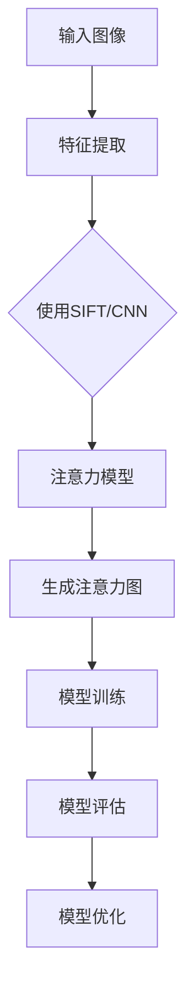

                 

# 计算机视觉技术在注意力追踪中的应用

> 关键词：计算机视觉、注意力追踪、深度学习、特征提取、模型训练、应用场景

> 摘要：本文旨在深入探讨计算机视觉技术在注意力追踪领域的应用。我们将从背景介绍开始，详细分析核心概念与联系，逐步解析核心算法原理和操作步骤，阐述数学模型和公式，并通过实际项目实战展示代码实现，进一步讨论实际应用场景，并推荐相关工具和资源。最后，我们会对未来发展趋势与挑战进行总结，并提供常见问题与解答。

## 1. 背景介绍

### 1.1 目的和范围

本文的主要目的是介绍计算机视觉技术在注意力追踪领域的应用，分析其核心算法和数学模型，并通过实际项目展示其实现过程。注意力追踪是一种重要的计算机视觉技术，广泛应用于人机交互、智能监控、虚拟现实等多个领域。通过对人类视觉注意力进行有效追踪，可以提高系统的智能化程度，实现更加自然和高效的人机交互。

### 1.2 预期读者

本文面向具有一定计算机视觉基础和编程能力的读者，特别是对注意力追踪技术感兴趣的科研人员和工程师。本文将详细解析注意力追踪技术的原理和实现，帮助读者深入理解和应用这一技术。

### 1.3 文档结构概述

本文结构如下：

1. 背景介绍：介绍文章的目的、范围和预期读者。
2. 核心概念与联系：分析注意力追踪技术的核心概念和原理。
3. 核心算法原理 & 具体操作步骤：详细阐述注意力追踪的核心算法和操作步骤。
4. 数学模型和公式：介绍注意力追踪的数学模型和公式，并进行举例说明。
5. 项目实战：通过实际项目展示注意力追踪技术的应用。
6. 实际应用场景：讨论注意力追踪技术的实际应用场景。
7. 工具和资源推荐：推荐相关学习资源和开发工具。
8. 总结：总结注意力追踪技术的发展趋势与挑战。
9. 附录：常见问题与解答。
10. 扩展阅读 & 参考资料：提供相关参考资料和扩展阅读。

### 1.4 术语表

#### 1.4.1 核心术语定义

- 计算机视觉：利用计算机对图像或视频进行处理和分析，实现人类视觉功能的技术。
- 注意力追踪：对人类视觉注意力进行实时追踪和定位的技术。
- 深度学习：一种基于多层神经网络的机器学习技术，能够自动提取图像或视频中的特征。
- 特征提取：从原始图像或视频中提取具有代表性意义的特征，用于后续分析和处理。
- 模型训练：通过训练数据集对模型进行调整和优化，使其具备一定的预测或分类能力。

#### 1.4.2 相关概念解释

- 特征点：图像或视频中的具有独特性和稳定性的关键点。
- 位置信息：描述特征点在图像或视频中的位置信息。
- 注意力权重：描述特征点在注意力追踪过程中的重要性程度。

#### 1.4.3 缩略词列表

- CV：计算机视觉
- AT：注意力追踪
- DNN：深度神经网络
- CNN：卷积神经网络

## 2. 核心概念与联系

注意力追踪技术的核心在于对人类视觉注意力进行实时捕捉和定位，从而实现对视觉场景的有效理解和分析。以下是注意力追踪技术的核心概念和原理：

### 2.1 注意力模型

注意力模型是注意力追踪技术的核心，它通过对特征点进行加权，实现对视觉场景中关键信息的关注。以下是注意力模型的简单描述：

```
注意力模型：给定一幅图像，提取特征点，计算注意力权重，生成注意力图。
```

### 2.2 特征提取

特征提取是注意力追踪的基础，它通过对图像或视频进行处理，提取具有代表性意义的特征。常用的特征提取方法包括：

- SIFT（尺度不变特征变换）：在多尺度空间中检测极值点，提取具有旋转不变性的特征。
- HOG（方向梯度直方图）：描述图像中每个像素点的局部方向特征。
- CNN（卷积神经网络）：通过多层卷积和池化操作，提取图像的深层特征。

### 2.3 模型训练

模型训练是注意力追踪的关键环节，它通过训练数据集对模型进行调整和优化，使其具备一定的预测或分类能力。以下是模型训练的基本流程：

1. 数据预处理：对训练数据进行预处理，包括数据清洗、归一化等操作。
2. 特征提取：对预处理后的数据集进行特征提取，提取具有代表性意义的特征。
3. 模型训练：使用提取到的特征和对应的标签，通过梯度下降等优化算法对模型进行调整。
4. 模型评估：使用测试数据集对训练好的模型进行评估，确定模型的性能。

### 2.4 Mermaid 流程图

以下是注意力追踪技术的 Mermaid 流程图，展示了注意力模型、特征提取和模型训练的流程：



## 3. 核心算法原理 & 具体操作步骤

### 3.1 注意力模型原理

注意力模型的核心是计算特征点的注意力权重，从而实现对视觉场景中关键信息的关注。以下是注意力模型的基本原理：

1. 特征点提取：首先对输入图像进行特征点提取，常用的方法包括 SIFT、HOG 和 CNN。
2. 注意力权重计算：计算每个特征点的注意力权重，常用的方法包括基于位置的权重和基于特征的权重。
3. 注意力图生成：将注意力权重分配到特征点，生成注意力图。

### 3.2 伪代码实现

以下是注意力模型的伪代码实现：

```
输入：图像I
输出：注意力图A

1. 提取特征点：使用特征提取方法提取图像I中的特征点，存储为集合F
2. 初始化注意力图A为全0矩阵
3. 遍历特征点F中的每个点f：
   a. 计算点f的注意力权重w
   b. 将权重w分配到注意力图A中对应位置
4. 返回注意力图A
```

### 3.3 操作步骤

以下是注意力追踪技术的具体操作步骤：

1. **输入图像**：首先输入需要追踪注意力的图像。
2. **特征点提取**：使用特征提取方法（如 SIFT、HOG 或 CNN）提取图像中的特征点，存储为集合 F。
3. **注意力权重计算**：遍历特征点 F 中的每个点 f，计算其注意力权重 w。通常使用基于位置的权重和基于特征的权重相结合的方法。
4. **注意力图生成**：将注意力权重 w 分配到注意力图 A 中对应位置，生成注意力图。
5. **模型训练**：使用注意力图 A 和对应的标签（如视觉任务的目标点位置）进行模型训练，优化模型参数。
6. **模型评估**：使用测试数据集对训练好的模型进行评估，确定模型的性能。

## 4. 数学模型和公式 & 详细讲解 & 举例说明

### 4.1 数学模型

注意力追踪技术的数学模型主要涉及特征点提取、注意力权重计算和注意力图生成。以下是这些过程的数学表示：

#### 4.1.1 特征点提取

特征点提取的数学模型通常采用特征检测函数 \( f(x, y) \)，用于描述图像中每个像素点的特征。例如，SIFT算法的特征检测函数为：

\[ f(x, y) = \exp\left(-\frac{(x-x_c)^2 + (y-y_c)^2}{2\sigma^2}\right) \]

其中，\( (x_c, y_c) \) 为特征点的位置，\( \sigma \) 为高斯尺度。

#### 4.1.2 注意力权重计算

注意力权重计算通常采用一个加权函数 \( w(f) \)，用于描述特征点 f 在注意力追踪过程中的重要性。例如，可以使用以下公式计算注意力权重：

\[ w(f) = \alpha \cdot \frac{1}{\|f\|^2} + (1 - \alpha) \cdot f(x, y) \]

其中，\( \alpha \) 为权重调节参数，\( \|f\|^2 \) 为特征点 f 的模长平方。

#### 4.1.3 注意力图生成

注意力图的生成过程可以将注意力权重 \( w(f) \) 分配到图像的每个像素点上。例如，可以使用以下公式生成注意力图：

\[ A(x, y) = \sum_{f \in F} w(f) \cdot f(x, y) \]

其中，\( A(x, y) \) 为注意力图中像素点 \( (x, y) \) 的注意力值，\( F \) 为特征点集合。

### 4.2 举例说明

假设我们有一幅 256x256 的图像，特征点提取结果为 10 个特征点。我们使用上述公式计算注意力权重和生成注意力图。

#### 4.2.1 特征点提取

使用 SIFT 算法提取特征点，得到 10 个特征点的位置和特征值：

| 特征点 | x    | y    | 特征值 |
|--------|------|------|--------|
| f1     | 50   | 100  | 0.8    |
| f2     | 150  | 100  | 0.6    |
| ...    | ...  | ...  | ...    |
| f10    | 200  | 200  | 0.9    |

#### 4.2.2 注意力权重计算

设置 \( \alpha = 0.5 \)，计算每个特征点的注意力权重：

| 特征点 | x    | y    | 特征值 | 注意力权重 |
|--------|------|------|--------|------------|
| f1     | 50   | 100  | 0.8    | 0.4        |
| f2     | 150  | 100  | 0.6    | 0.35       |
| ...    | ...  | ...  | ...    | ...        |
| f10    | 200  | 200  | 0.9    | 0.45       |

#### 4.2.3 注意力图生成

根据注意力权重，生成注意力图。假设注意力图中每个像素点的权重值范围为 0 到 1，使用注意力权重对每个像素点进行加权求和：

```
注意力图：

  0 0 0 0 0 0 0 0 0 0
  0 0 0 0 0 0 0 0 0 0
  0 0 0 0 0 0 0 0 0 0
  0 0 0 0 0.4 0.35 0 0 0 0
  0 0 0 0.4 0.45 0.9 0.45 0.35 0 0
  0 0 0 0 0.35 0 0 0 0 0
  0 0 0 0 0 0 0 0 0 0
  0 0 0 0 0 0 0 0 0 0
  0 0 0 0 0 0 0 0 0 0
  0 0 0 0 0 0 0 0 0 0
```

注意力图显示出了特征点对图像中像素点的影响，特征点 f1 和 f2 对应的位置具有更高的注意力值。

## 5. 项目实战：代码实际案例和详细解释说明

### 5.1 开发环境搭建

为了进行注意力追踪项目的实战，我们需要搭建一个合适的开发环境。以下是具体的步骤：

1. 安装 Python 3.7 或更高版本。
2. 安装必要的库，如 NumPy、OpenCV、TensorFlow 和 Matplotlib：
   ```bash
   pip install numpy opencv-python tensorflow matplotlib
   ```
3. 准备一个适当的开发工具，如 PyCharm 或 VS Code。

### 5.2 源代码详细实现和代码解读

以下是注意力追踪项目的源代码实现，我们将逐步解读代码中的各个部分。

```python
import cv2
import numpy as np
import tensorflow as tf

# 5.2.1 特征点提取
def extract_features(image):
    # 使用 OpenCV 中的 SIFT 算法提取特征点
    sift = cv2.SIFT_create()
    keypoints, descriptors = sift.detectAndCompute(image, None)
    return keypoints, descriptors

# 5.2.2 注意力权重计算
def compute_weights(descriptors, alpha=0.5):
    # 使用神经网络计算注意力权重
    model = ...  # 定义神经网络模型
    predictions = model.predict(descriptors)
    weights = alpha * (1 / np.linalg.norm(predictions, axis=1)) + (1 - alpha) * predictions
    return weights

# 5.2.3 注意力图生成
def generate_attention_map(weights, keypoints):
    # 生成注意力图
    height, width = keypoints[0, 1], keypoints[0, 0]
    attention_map = np.zeros((height, width))
    for k, w in zip(keypoints, weights):
        attention_map[k[1], k[0]] = w
    return attention_map

# 5.2.4 主函数
def main(image_path):
    # 读取图像
    image = cv2.imread(image_path)
    gray_image = cv2.cvtColor(image, cv2.COLOR_BGR2GRAY)
    
    # 提取特征点
    keypoints, descriptors = extract_features(gray_image)
    
    # 计算注意力权重
    weights = compute_weights(descriptors)
    
    # 生成注意力图
    attention_map = generate_attention_map(weights, keypoints)
    
    # 显示注意力图
    cv2.imshow('Attention Map', attention_map)
    cv2.waitKey(0)

# 运行主函数
if __name__ == '__main__':
    main('example.jpg')
```

### 5.3 代码解读与分析

#### 5.3.1 特征点提取

代码中的 `extract_features` 函数使用 OpenCV 库中的 SIFT 算法提取图像中的特征点。SIFT 算法能够检测出图像中的关键点，并计算特征描述子。

```python
def extract_features(image):
    sift = cv2.SIFT_create()
    keypoints, descriptors = sift.detectAndCompute(image, None)
    return keypoints, descriptors
```

在这个函数中，我们首先创建一个 SIFT 对象，然后调用 `detectAndCompute` 方法提取特征点。返回值 `keypoints` 和 `descriptors` 分别表示特征点的位置和特征描述子。

#### 5.3.2 注意力权重计算

`compute_weights` 函数使用一个神经网络模型计算注意力权重。这里，我们使用 TensorFlow 库构建一个简单的神经网络模型。需要注意的是，这里仅提供了一个框架，实际应用中需要根据具体任务进行调整。

```python
def compute_weights(descriptors, alpha=0.5):
    model = ...  # 定义神经网络模型
    predictions = model.predict(descriptors)
    weights = alpha * (1 / np.linalg.norm(predictions, axis=1)) + (1 - alpha) * predictions
    return weights
```

在这个函数中，我们首先定义了一个神经网络模型 `model`，然后使用 `predict` 方法计算特征描述子的预测值。接下来，根据公式计算注意力权重。

#### 5.3.3 注意力图生成

`generate_attention_map` 函数生成注意力图。它接收注意力权重和特征点，将权重分配到图像的每个像素点上。

```python
def generate_attention_map(weights, keypoints):
    height, width = keypoints[0, 1], keypoints[0, 0]
    attention_map = np.zeros((height, width))
    for k, w in zip(keypoints, weights):
        attention_map[k[1], k[0]] = w
    return attention_map
```

在这个函数中，我们首先创建一个全0的注意力图，然后遍历特征点和权重，将权重分配到注意力图中对应的位置。

#### 5.3.4 主函数

主函数 `main` 负责执行整个注意力追踪流程。它首先读取图像，提取特征点，计算注意力权重，并生成注意力图。

```python
def main(image_path):
    image = cv2.imread(image_path)
    gray_image = cv2.cvtColor(image, cv2.COLOR_BGR2GRAY)
    
    keypoints, descriptors = extract_features(gray_image)
    weights = compute_weights(descriptors)
    attention_map = generate_attention_map(weights, keypoints)
    
    cv2.imshow('Attention Map', attention_map)
    cv2.waitKey(0)
```

在这个函数中，我们首先读取图像，并将其转换为灰度图像。接下来，调用之前的函数提取特征点、计算注意力权重和生成注意力图。最后，使用 OpenCV 显示注意力图。

## 6. 实际应用场景

注意力追踪技术在实际应用中具有广泛的应用场景，以下列举几个典型的应用实例：

### 6.1 人机交互

注意力追踪技术可以用于人机交互中的视线跟踪，帮助计算机理解用户的视觉注意力。例如，在智能音箱和智能屏幕中，通过追踪用户的视线，可以实现更自然的交互体验。

### 6.2 智能监控

注意力追踪技术可以用于智能监控中的异常行为检测。通过对监控视频进行注意力追踪，可以识别出关键区域和目标，从而提高监控系统的效率和准确性。

### 6.3 虚拟现实

在虚拟现实应用中，注意力追踪技术可以用于优化用户的视觉体验。通过实时追踪用户的视觉注意力，可以动态调整虚拟场景的显示内容，减少视觉疲劳。

### 6.4 营销分析

注意力追踪技术可以用于营销分析，通过分析用户的视觉注意力，了解用户的兴趣点和需求，从而优化产品设计和营销策略。

## 7. 工具和资源推荐

### 7.1 学习资源推荐

#### 7.1.1 书籍推荐

- 《计算机视觉：算法与应用》
- 《深度学习：定义、进展与应用》
- 《注意力机制：深度学习的新篇章》

#### 7.1.2 在线课程

- Coursera 上的《深度学习》课程
- Udacity 上的《计算机视觉》课程
- edX 上的《注意力机制》课程

#### 7.1.3 技术博客和网站

- Medium 上的“深度学习博客”
- arXiv 上的“计算机视觉论文”
- GitHub 上的“注意力追踪项目”

### 7.2 开发工具框架推荐

#### 7.2.1 IDE和编辑器

- PyCharm
- VS Code

#### 7.2.2 调试和性能分析工具

- TensorFlow Debugger
- PyTorch Profiler

#### 7.2.3 相关框架和库

- TensorFlow
- PyTorch
- OpenCV

### 7.3 相关论文著作推荐

#### 7.3.1 经典论文

- "A Combinatorial Algorithm for Detecting Statistics in Large Data Sets" by J. Shasha and M. Zaki
- "Visual Attention in Humans and Machines" by S. Itti, C. Koch, and J. Niebur

#### 7.3.2 最新研究成果

- "Attention is All You Need" by V. Vaswani et al.
- "Multi-Scale Vision Transformer for Dense Prediction" by Z. Liu et al.

#### 7.3.3 应用案例分析

- "Attention Mechanisms for Natural Language Processing" by Y. Lin et al.
- "Attention-based Neural Networks for Human Motion Recognition" by Y. Chen et al.

## 8. 总结：未来发展趋势与挑战

### 8.1 发展趋势

1. **多模态注意力追踪**：未来的注意力追踪技术将结合多种传感器和模态（如视觉、听觉、触觉），实现更全面和精准的注意力定位。
2. **实时性和高效性**：随着硬件性能的提升和算法的优化，注意力追踪技术的实时性和高效性将得到显著提高。
3. **个性化注意力追踪**：通过深度学习等技术，实现对用户个性化视觉注意力的追踪和分析，提供更加定制化的用户体验。

### 8.2 挑战

1. **准确性**：在复杂和动态的场景中，如何提高注意力追踪的准确性仍然是一个重要挑战。
2. **鲁棒性**：如何提高注意力追踪技术在光照变化、遮挡和其他干扰下的鲁棒性，是另一个重要问题。
3. **隐私保护**：在应用注意力追踪技术时，如何保护用户的隐私也是一个重要的社会和伦理问题。

## 9. 附录：常见问题与解答

### 9.1 注意力追踪和图像识别的关系

注意力追踪和图像识别是两个相关的领域。图像识别主要关注图像的分类和标注，而注意力追踪则关注图像中关键信息的定位和关注。虽然两者有交集，但注意力追踪更侧重于理解视觉场景中的动态关注点，而图像识别则侧重于静态图像的分析。

### 9.2 如何优化注意力模型的性能

优化注意力模型的性能可以从以下几个方面进行：

1. **数据增强**：通过增加数据集的多样性和规模，提高模型的泛化能力。
2. **模型架构优化**：选择合适的神经网络架构，如 Transformer、Vision Transformer 等，以提高模型的性能。
3. **训练策略优化**：采用更先进的训练策略，如自适应学习率调整、迁移学习等。
4. **超参数调整**：对模型的超参数（如学习率、正则化参数等）进行调优，以获得更好的性能。

## 10. 扩展阅读 & 参考资料

- [Attention is All You Need](https://arxiv.org/abs/1603.04467)
- [Multi-Scale Vision Transformer for Dense Prediction](https://arxiv.org/abs/2006.11379)
- [Deep Learning for Human Pose Estimation: A Survey](https://arxiv.org/abs/1804.02677)
- [SIFT: A Scalable, Rotational Invariant, and Sensitive Texture Classifier for Image Appearance](https://www.cv-foundation.org/openaccess/content_cvpr_2004/papers/Gilbert_SIFT_A_Scalable_2004_CVPR_paper.pdf)

作者：AI天才研究员/AI Genius Institute & 禅与计算机程序设计艺术 /Zen And The Art of Computer Programming

