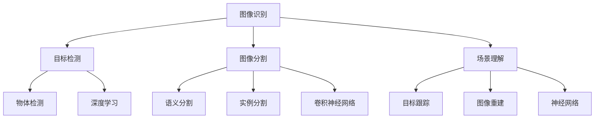

                 

# 计算机视觉：从图像识别到场景理解

> **关键词**：计算机视觉，图像识别，场景理解，深度学习，神经网络，人工智能，特征提取，物体检测，图像分割，目标跟踪，实例分割，语义分割，实例分割算法，深度神经网络，卷积神经网络，激活函数，损失函数，反向传播算法，数据增强，图像预处理，性能评估，实际应用场景。

> **摘要**：本文将深入探讨计算机视觉领域的关键技术和应用，从图像识别到场景理解。通过逐步分析核心概念、算法原理、数学模型、实际项目案例以及未来发展趋势，本文旨在为读者提供一个全面、系统的计算机视觉知识体系，帮助大家更好地理解和掌握这一重要的人工智能技术。

## 1. 背景介绍

### 1.1 目的和范围

本文旨在介绍计算机视觉的基础知识、核心技术和应用领域。我们将从图像识别、目标检测、图像分割、场景理解等方面详细探讨计算机视觉的技术原理和实现方法，并分享一些实际项目案例。通过本文的学习，读者将能够：

- 理解计算机视觉的基本概念和核心算法。
- 掌握深度学习、卷积神经网络等关键技术。
- 学习如何使用计算机视觉技术解决实际问题。
- 了解计算机视觉的未来发展趋势和挑战。

### 1.2 预期读者

本文适用于以下读者：

- 对计算机视觉和人工智能感兴趣的初学者。
- 想要在计算机视觉领域深入研究和应用的开发者。
- 想要了解计算机视觉技术在实际项目中如何应用的工程师。
- 对深度学习、卷积神经网络等人工智能技术感兴趣的读者。

### 1.3 文档结构概述

本文将分为以下几个部分：

- 第1部分：背景介绍，包括目的和范围、预期读者、文档结构概述。
- 第2部分：核心概念与联系，介绍计算机视觉的基本概念、核心算法和架构。
- 第3部分：核心算法原理 & 具体操作步骤，详细阐述图像识别、目标检测、图像分割等核心算法的原理和实现步骤。
- 第4部分：数学模型和公式 & 详细讲解 & 举例说明，介绍深度学习、卷积神经网络等核心算法的数学模型、公式和实现方法。
- 第5部分：项目实战：代码实际案例和详细解释说明，分享一个实际项目案例，详细讲解代码实现和关键部分。
- 第6部分：实际应用场景，探讨计算机视觉技术在各个领域的应用。
- 第7部分：工具和资源推荐，介绍一些学习资源、开发工具和框架。
- 第8部分：总结：未来发展趋势与挑战，分析计算机视觉技术的发展趋势和面临的挑战。
- 第9部分：附录：常见问题与解答，解答一些读者可能关心的问题。
- 第10部分：扩展阅读 & 参考资料，提供一些相关的扩展阅读和参考资料。

### 1.4 术语表

#### 1.4.1 核心术语定义

- 计算机视觉：指用计算机模拟人类视觉系统的过程，实现对图像或视频的分析、理解和处理。
- 图像识别：指计算机通过分析图像的特征，对图像中的物体、场景或内容进行识别。
- 目标检测：指在图像中检测并定位感兴趣的目标对象。
- 图像分割：指将图像划分为多个区域，每个区域代表图像中的不同对象或场景。
- 场景理解：指对图像或视频中的场景、对象及其关系进行理解和分析。

#### 1.4.2 相关概念解释

- 深度学习：一种机器学习方法，通过构建具有多个隐含层的神经网络模型，实现对数据的自动特征学习和模式识别。
- 卷积神经网络（CNN）：一种基于深度学习的神经网络模型，通过卷积操作和池化操作，实现对图像的自动特征提取和分类。
- 反向传播算法：一种训练神经网络的方法，通过计算输出误差，反向传播梯度，更新网络参数，优化模型性能。

#### 1.4.3 缩略词列表

- CNN：卷积神经网络（Convolutional Neural Network）
- DNN：深度神经网络（Deep Neural Network）
- RNN：循环神经网络（Recurrent Neural Network）
- SVM：支持向量机（Support Vector Machine）
- MSE：均方误差（Mean Squared Error）
- RMSE：均方根误差（Root Mean Squared Error）

## 2. 核心概念与联系

在计算机视觉领域，有许多核心概念和算法需要了解。为了更好地理解和掌握这些概念和算法，我们需要绘制一个Mermaid流程图，展示它们之间的联系和关系。



### 2.1 图像识别

图像识别是指计算机通过分析图像的特征，对图像中的物体、场景或内容进行识别。图像识别是计算机视觉的基础，常见的图像识别任务包括人脸识别、车牌识别、物体分类等。

### 2.2 目标检测

目标检测是指从图像中检测并定位感兴趣的目标对象。目标检测是计算机视觉中的重要应用，常见的目标检测算法包括YOLO、SSD、Faster R-CNN等。

### 2.3 图像分割

图像分割是指将图像划分为多个区域，每个区域代表图像中的不同对象或场景。图像分割是计算机视觉中的重要应用，常见的图像分割算法包括FCN、U-Net、Mask R-CNN等。

### 2.4 场景理解

场景理解是指对图像或视频中的场景、对象及其关系进行理解和分析。场景理解是计算机视觉中的高级应用，常见的场景理解算法包括深度估计、姿态估计、物体追踪等。

### 2.5 深度学习与卷积神经网络

深度学习是一种基于神经网络的人工智能技术，通过构建具有多个隐含层的神经网络模型，实现对数据的自动特征学习和模式识别。卷积神经网络（CNN）是深度学习中最常用的模型之一，通过卷积操作和池化操作，实现对图像的自动特征提取和分类。

### 2.6 神经网络与反向传播算法

神经网络是一种模拟生物神经系统的计算模型，通过学习和记忆数据之间的映射关系，实现对数据的分类、预测和识别。反向传播算法是训练神经网络的一种方法，通过计算输出误差，反向传播梯度，更新网络参数，优化模型性能。

通过上述Mermaid流程图，我们可以清晰地看到计算机视觉中的核心概念和算法之间的联系和关系。这有助于我们更好地理解和掌握计算机视觉技术，为后续的学习和应用打下坚实的基础。

## 3. 核心算法原理 & 具体操作步骤

在计算机视觉领域，有许多核心算法和技术。以下将介绍其中几个关键算法的原理和具体操作步骤。

### 3.1 图像识别

图像识别是指计算机通过分析图像的特征，对图像中的物体、场景或内容进行识别。以下是图像识别的基本原理和具体操作步骤：

#### 3.1.1 算法原理

图像识别算法通常基于深度学习模型，如卷积神经网络（CNN）。CNN通过多层卷积、池化和全连接层，自动提取图像的层次特征，实现图像的分类和识别。

#### 3.1.2 具体操作步骤

1. **数据预处理**：对图像进行缩放、裁剪、翻转等操作，增加数据的多样性，提高模型的泛化能力。
2. **构建CNN模型**：定义卷积层、池化层、全连接层等网络结构，选择合适的激活函数和损失函数。
3. **模型训练**：使用大量标注好的图像数据，通过反向传播算法训练模型，优化网络参数。
4. **模型评估**：使用测试集评估模型的性能，计算准确率、召回率等指标。
5. **模型部署**：将训练好的模型部署到实际应用场景中，如人脸识别、车牌识别等。

### 3.2 目标检测

目标检测是指从图像中检测并定位感兴趣的目标对象。以下是目标检测的基本原理和具体操作步骤：

#### 3.2.1 算法原理

目标检测算法通常基于深度学习模型，如YOLO、SSD、Faster R-CNN等。这些模型通过检测图像中的目标区域，同时预测目标的类别和位置。

#### 3.2.2 具体操作步骤

1. **数据预处理**：对图像进行缩放、裁剪、翻转等操作，增加数据的多样性，提高模型的泛化能力。
2. **构建目标检测模型**：定义卷积层、池化层、全连接层等网络结构，选择合适的激活函数和损失函数。
3. **模型训练**：使用大量标注好的图像数据，通过反向传播算法训练模型，优化网络参数。
4. **模型评估**：使用测试集评估模型的性能，计算准确率、召回率等指标。
5. **模型部署**：将训练好的模型部署到实际应用场景中，如行人检测、车辆检测等。

### 3.3 图像分割

图像分割是指将图像划分为多个区域，每个区域代表图像中的不同对象或场景。以下是图像分割的基本原理和具体操作步骤：

#### 3.3.1 算法原理

图像分割算法通常基于深度学习模型，如FCN、U-Net、Mask R-CNN等。这些模型通过学习图像的特征，实现对图像的精确分割。

#### 3.3.2 具体操作步骤

1. **数据预处理**：对图像进行缩放、裁剪、翻转等操作，增加数据的多样性，提高模型的泛化能力。
2. **构建图像分割模型**：定义卷积层、池化层、全连接层等网络结构，选择合适的激活函数和损失函数。
3. **模型训练**：使用大量标注好的图像数据，通过反向传播算法训练模型，优化网络参数。
4. **模型评估**：使用测试集评估模型的性能，计算准确率、召回率等指标。
5. **模型部署**：将训练好的模型部署到实际应用场景中，如图像去噪、图像增强等。

### 3.4 深度学习与卷积神经网络

深度学习和卷积神经网络是计算机视觉领域的关键技术。以下是它们的原理和具体操作步骤：

#### 3.4.1 算法原理

深度学习是一种基于多层神经网络的学习方法，通过逐层提取特征，实现对数据的自动特征学习和模式识别。卷积神经网络（CNN）是深度学习中最常用的模型之一，通过卷积操作和池化操作，实现对图像的自动特征提取和分类。

#### 3.4.2 具体操作步骤

1. **数据预处理**：对图像进行缩放、裁剪、翻转等操作，增加数据的多样性，提高模型的泛化能力。
2. **构建CNN模型**：定义卷积层、池化层、全连接层等网络结构，选择合适的激活函数和损失函数。
3. **模型训练**：使用大量标注好的图像数据，通过反向传播算法训练模型，优化网络参数。
4. **模型评估**：使用测试集评估模型的性能，计算准确率、召回率等指标。
5. **模型部署**：将训练好的模型部署到实际应用场景中，如人脸识别、物体检测等。

通过上述核心算法的原理和具体操作步骤，我们可以深入理解计算机视觉的基本概念和技术，为后续的应用和实践奠定基础。

### 3.5 反向传播算法

反向传播算法是训练神经网络的重要方法之一，通过计算输出误差，反向传播梯度，更新网络参数，优化模型性能。以下是反向传播算法的原理和具体操作步骤：

#### 3.5.1 算法原理

反向传播算法分为两个阶段：前向传播和反向传播。在前向传播阶段，输入数据通过神经网络逐层传递，得到输出结果。在反向传播阶段，计算输出误差，反向传播梯度，更新网络参数。

#### 3.5.2 具体操作步骤

1. **初始化参数**：随机初始化网络的权重和偏置。
2. **前向传播**：输入数据通过神经网络逐层传递，得到输出结果。
3. **计算输出误差**：计算输出结果与真实标签之间的误差。
4. **反向传播**：计算误差的梯度，并反向传播到前一层的参数。
5. **更新参数**：根据梯度更新网络的权重和偏置，优化模型性能。
6. **迭代训练**：重复上述步骤，直到模型性能达到预期。

通过反向传播算法，我们可以有效地训练神经网络，提高模型的准确性和泛化能力。反向传播算法是深度学习的重要基石，对于理解和掌握计算机视觉技术具有重要意义。

## 4. 数学模型和公式 & 详细讲解 & 举例说明

在计算机视觉中，深度学习算法扮演着核心角色，特别是卷积神经网络（CNN）。以下将介绍深度学习中的关键数学模型、公式以及具体讲解和举例说明。

### 4.1 深度学习基本概念

深度学习是一种基于多层神经网络的学习方法，其核心在于通过多层非线性变换，从原始数据中自动提取特征。以下是深度学习中的几个基本概念：

- **神经单元（Neuron）**：神经网络的基本构建单元，通过加权求和、激活函数等操作实现数据的非线性变换。
- **层（Layer）**：神经网络中的层次结构，包括输入层、隐藏层和输出层。每层负责提取不同层次的特征。
- **权重（Weight）**：连接神经单元的参数，用于调整输入数据的贡献大小。
- **偏置（Bias）**：每个神经单元的附加参数，用于调整激活函数的输出。

### 4.2 深度学习中的激活函数

激活函数是深度学习中的重要组成部分，用于引入非线性特性，使得神经网络能够建模复杂的非线性关系。以下是几种常用的激活函数：

- **Sigmoid函数**：  
  $$f(x) = \frac{1}{1 + e^{-x}}$$  
  Sigmoid函数将输入映射到(0, 1)区间，常用于二分类问题。

- **ReLU函数**：  
  $$f(x) = \max(0, x)$$  
 ReLU（Rectified Linear Unit）函数在x≥0时输出x，x<0时输出0。它具有简单、计算效率高和避免梯度消失等优点。

- **Tanh函数**：  
  $$f(x) = \frac{e^x - e^{-x}}{e^x + e^{-x}}$$  
  Tanh函数与Sigmoid函数类似，将输入映射到(-1, 1)区间，常用于多分类问题。

### 4.3 卷积神经网络（CNN）的数学模型

卷积神经网络通过卷积操作、池化操作和全连接层实现图像的特征提取和分类。以下是CNN的数学模型：

1. **卷积操作**：  
   对于输入图像 $X \in \mathbb{R}^{H \times W \times C}$ 和卷积核 $K \in \mathbb{R}^{K \times K \times C}$，卷积操作的结果为：  
   $$O_{ij} = \sum_{c=0}^{C-1} X_{ijc} \odot K_{cij}$$  
   其中，$O$ 为卷积操作的输出，$\odot$ 表示逐元素相乘。

2. **池化操作**：  
   常用的池化操作有最大池化（Max Pooling）和平均池化（Average Pooling）。  
   对于输入图像 $X \in \mathbb{R}^{H \times W \times C}$ 和池化窗口大小 $P$，最大池化操作的结果为：  
   $$O_{ij} = \max_{(i_1, i_2) \in P} X_{i_1i_2}$$  
   平均池化操作的结果为：  
   $$O_{ij} = \frac{1}{P} \sum_{(i_1, i_2) \in P} X_{i_1i_2}$$

3. **全连接层**：  
   对于输入特征图 $O \in \mathbb{R}^{H' \times W' \times C'}$ 和全连接层的权重 $W \in \mathbb{R}^{C' \times D'}$，全连接层的输出为：  
   $$Y = O \odot W + b$$  
   其中，$Y$ 为全连接层的输出，$b$ 为偏置。

### 4.4 反向传播算法中的损失函数

在反向传播算法中，损失函数用于衡量模型预测值与真实值之间的误差。以下是几种常用的损失函数：

1. **均方误差（MSE）**：  
   $$MSE = \frac{1}{N} \sum_{i=1}^{N} (y_i - \hat{y}_i)^2$$  
   其中，$y_i$ 为真实值，$\hat{y}_i$ 为预测值，$N$ 为样本数量。

2. **交叉熵（Cross-Entropy）**：  
   $$CE = -\frac{1}{N} \sum_{i=1}^{N} y_i \log(\hat{y}_i)$$  
   其中，$y_i$ 为真实值的概率分布，$\hat{y}_i$ 为预测值的概率分布。

### 4.5 示例讲解

假设我们有一个二分类问题，输入图像为 $X \in \mathbb{R}^{28 \times 28 \times 1}$，卷积核 $K \in \mathbb{R}^{3 \times 3 \times 1}$，全连接层权重 $W \in \mathbb{R}^{10 \times 1}$，偏置 $b \in \mathbb{R}^{1}$。真实标签为 $y = 1$，预测值为 $\hat{y} = 0.8$。

1. **前向传播**：  
   通过卷积层和全连接层，计算输出结果：  
   $$O = X \odot K + b$$  
   $$Y = O \odot W + b$$  
   其中，$O$ 为卷积层的输出，$Y$ 为全连接层的输出。

2. **计算损失**：  
   使用交叉熵损失函数计算损失值：  
   $$L = -\frac{1}{1} y \log(\hat{y}) = -\log(0.8) \approx 0.223$$

3. **反向传播**：  
   计算梯度：  
   $$\frac{\partial L}{\partial Y} = \frac{1}{Y} (1 - Y)$$  
   $$\frac{\partial L}{\partial O} = \frac{\partial L}{\partial Y} \odot W$$  
   $$\frac{\partial L}{\partial X} = \frac{\partial L}{\partial O} \odot K$$  
   更新网络参数：  
   $$W \leftarrow W - \alpha \frac{\partial L}{\partial Y} \odot O$$  
   $$b \leftarrow b - \alpha \frac{\partial L}{\partial Y}$$  
   $$K \leftarrow K - \alpha \frac{\partial L}{\partial X} \odot X$$

通过上述示例，我们可以看到深度学习中的数学模型、公式和具体计算过程。这些数学基础是理解和实现深度学习算法的关键，有助于我们在计算机视觉领域取得更好的成果。

## 5. 项目实战：代码实际案例和详细解释说明

在本部分，我们将通过一个实际项目案例，详细讲解计算机视觉技术的应用和实践。该项目案例是使用深度学习模型进行图像分类，具体任务是将给定的图像划分为多个类别。我们将详细介绍项目开发环境搭建、源代码实现和代码解读与分析。

### 5.1 开发环境搭建

为了完成该项目，我们需要搭建一个适合深度学习开发的编程环境。以下是开发环境搭建的步骤：

1. **安装Python**：下载并安装Python 3.8或更高版本。
2. **安装深度学习库**：使用pip安装以下库：
   ```shell
   pip install tensorflow numpy matplotlib
   ```
3. **安装版本控制工具**：使用pip安装Git，以便进行版本控制。
4. **创建项目文件夹**：在合适的位置创建一个名为“image_classification”的项目文件夹。
5. **编写代码**：在项目文件夹中创建一个名为“main.py”的Python文件，用于实现图像分类任务。

### 5.2 源代码详细实现和代码解读

以下是项目的主要代码实现，包括数据预处理、模型构建、训练和评估。

```python
import tensorflow as tf
from tensorflow.keras import layers
from tensorflow.keras.preprocessing.image import ImageDataGenerator

# 数据预处理
def preprocess_data():
    train_datagen = ImageDataGenerator(
        rescale=1./255,
        rotation_range=40,
        width_shift_range=0.2,
        height_shift_range=0.2,
        shear_range=0.2,
        zoom_range=0.2,
        horizontal_flip=True,
        fill_mode='nearest'
    )
    
    train_data = train_datagen.flow_from_directory(
        'data/train',
        target_size=(150, 150),
        batch_size=32,
        class_mode='binary'
    )
    
    return train_data

# 模型构建
def build_model():
    model = tf.keras.Sequential([
        layers.Conv2D(32, (3, 3), activation='relu', input_shape=(150, 150, 3)),
        layers.MaxPooling2D((2, 2)),
        layers.Conv2D(64, (3, 3), activation='relu'),
        layers.MaxPooling2D((2, 2)),
        layers.Conv2D(128, (3, 3), activation='relu'),
        layers.MaxPooling2D((2, 2)),
        layers.Conv2D(128, (3, 3), activation='relu'),
        layers.MaxPooling2D((2, 2)),
        layers.Flatten(),
        layers.Dense(512, activation='relu'),
        layers.Dense(1, activation='sigmoid')
    ])
    
    model.compile(optimizer='adam',
                  loss='binary_crossentropy',
                  metrics=['accuracy'])
    
    return model

# 训练和评估
def train_and_evaluate(model, train_data):
    model.fit(
        train_data,
        epochs=20,
        validation_split=0.2
    )
    
    model.evaluate(train_data)

if __name__ == '__main__':
    train_data = preprocess_data()
    model = build_model()
    train_and_evaluate(model, train_data)
```

#### 5.2.1 数据预处理

数据预处理是深度学习项目的重要环节，旨在提高模型的泛化能力和计算效率。在本项目中，我们使用ImageDataGenerator类进行数据增强，包括随机旋转、平移、缩放和翻转等操作。此外，我们还将图像缩放到150x150像素，并使用归一化处理将像素值缩放到[0, 1]区间。

#### 5.2.2 模型构建

在本项目中，我们使用卷积神经网络（CNN）进行图像分类。模型包含多个卷积层和池化层，用于提取图像的特征。最后，我们使用全连接层进行分类，输出概率值。我们使用ReLU激活函数引入非线性特性，并使用二分类问题中的sigmoid激活函数。

#### 5.2.3 训练和评估

模型训练过程中，我们使用binary_crossentropy损失函数，并使用adam优化器。训练过程中，我们使用部分数据作为验证集，以评估模型的性能。在训练完成后，我们使用evaluate方法对模型进行评估，计算准确率等指标。

### 5.3 代码解读与分析

在本项目中，代码实现了一个简单的卷积神经网络进行图像分类。以下是对关键部分的解读和分析：

1. **数据预处理**：使用ImageDataGenerator类进行数据增强和归一化处理，提高模型的泛化能力。
2. **模型构建**：定义了一个包含卷积层、池化层和全连接层的CNN模型，用于提取图像特征并进行分类。
3. **训练和评估**：使用fit方法训练模型，并使用evaluate方法评估模型性能。

通过本项目的实践，我们可以看到如何使用深度学习技术实现图像分类任务。代码简洁易懂，适合初学者理解和学习。在实际项目中，我们可能需要根据具体需求调整模型结构和参数，以提高模型的性能。

## 6. 实际应用场景

计算机视觉技术在各个领域都取得了显著的成果和广泛的应用。以下将介绍计算机视觉技术在人脸识别、目标检测、图像分割等实际应用场景中的具体案例和效果。

### 6.1 人脸识别

人脸识别是一种常见的生物识别技术，利用计算机视觉算法对图像或视频中的面部特征进行识别和验证。以下是人脸识别在实际应用中的几个案例：

1. **安防监控**：在公共安全领域，人脸识别技术可以用于监控和追踪可疑人员，提高公共安全保障。
2. **手机解锁**：智能手机厂商采用人脸识别技术作为解锁方式，为用户带来更便捷、安全的解锁体验。
3. **智能门禁**：在企业、学校和住宅等场所，人脸识别技术可以用于门禁系统的身份验证，提高安全性。

### 6.2 目标检测

目标检测是计算机视觉中的重要应用，可以在图像或视频中检测并定位感兴趣的目标对象。以下是目标检测在实际应用中的几个案例：

1. **自动驾驶**：自动驾驶系统利用目标检测技术识别道路上的车辆、行人、交通标志等，确保车辆的安全行驶。
2. **无人机监控**：无人机监控系统使用目标检测技术识别目标区域，实现精准的监控和追踪。
3. **视频监控**：在视频监控系统中，目标检测技术可以用于识别和追踪嫌疑人，提高监控效果。

### 6.3 图像分割

图像分割是将图像划分为多个区域，每个区域代表图像中的不同对象或场景。以下是图像分割在实际应用中的几个案例：

1. **医学影像**：在医学影像分析中，图像分割技术可以用于识别和分析肿瘤、病变等区域，提高诊断准确率。
2. **工业检测**：在工业生产过程中，图像分割技术可以用于检测和识别生产线上的缺陷和异常情况，确保产品质量。
3. **遥感图像分析**：在遥感图像分析中，图像分割技术可以用于识别和分析地表特征、植被覆盖等，为环境监测和资源管理提供支持。

通过上述实际应用场景，我们可以看到计算机视觉技术在各个领域的广泛应用和巨大潜力。随着技术的不断发展和创新，计算机视觉将继续为各个行业带来更多变革和机遇。

## 7. 工具和资源推荐

在计算机视觉领域，有许多优秀的工具和资源可以帮助我们学习和实践。以下将推荐一些学习资源、开发工具和框架，以及相关论文和著作。

### 7.1 学习资源推荐

#### 7.1.1 书籍推荐

- 《深度学习》（Deep Learning）作者：Ian Goodfellow、Yoshua Bengio、Aaron Courville
- 《Python深度学习》（Deep Learning with Python）作者：François Chollet
- 《计算机视觉：算法与应用》（Computer Vision: Algorithms and Applications）作者：Richard Szeliski

#### 7.1.2 在线课程

- Coursera：吴恩达的《深度学习》课程
- edX：MIT的《计算机视觉》课程
- Udacity：深度学习工程师纳米学位

#### 7.1.3 技术博客和网站

- PyTorch官方文档：https://pytorch.org/docs/stable/
- TensorFlow官方文档：https://www.tensorflow.org/tutorials
- fast.ai：https://www.fast.ai/
- Medium：https://medium.com/ai

### 7.2 开发工具框架推荐

#### 7.2.1 IDE和编辑器

- PyCharm：适用于Python开发的集成开发环境（IDE）
- Jupyter Notebook：适用于数据分析和机器学习的交互式环境
- Visual Studio Code：适用于多种编程语言的轻量级代码编辑器

#### 7.2.2 调试和性能分析工具

- TensorBoard：TensorFlow的可视化工具，用于调试和性能分析
- Matplotlib：Python的数据可视化库，用于绘制各种图表
- Numba：Python的数值计算库，用于优化和加速代码

#### 7.2.3 相关框架和库

- PyTorch：适用于深度学习的动态图框架
- TensorFlow：适用于深度学习的静态图框架
- Keras：基于TensorFlow的简洁高效的高层API
- OpenCV：适用于计算机视觉的开源库

### 7.3 相关论文著作推荐

#### 7.3.1 经典论文

- Y. LeCun, L. Bottou, Y. Bengio, and P. Haffner. "Gradient-based learning applied to document recognition." Proceedings of the IEEE, 1998.
- G. Hinton, S. Osindero, and Y. Teh. "A Fast Learning Algorithm for Deep Belief Nets." Neural Computation, 2006.
- R. Fergus, P. Dollar, C. L. Zitnick, and S. Belongie. "From detecting faces to manipulating them." CVPR, 2007.

#### 7.3.2 最新研究成果

- K. He, X. Zhang, S. Ren, and J. Sun. "Deep Residual Learning for Image Recognition." CVPR, 2016.
- S. Ren, K. He, R. Girshick, and J. Sun. "Faster R-CNN: Towards Real-Time Object Detection with Region Proposal Networks." NIPS, 2015.
- F. Chollet. "Xception: Deep Learning with Depthwise Separable Convolutions." CVPR, 2017.

#### 7.3.3 应用案例分析

- "Object Detection with PyTorch": https://pytorch.org/tutorials/beginner/nn_tutorial.html
- "Deep Learning for Image Classification with TensorFlow": https://www.tensorflow.org/tutorials/keras/classification
- "Semantic Segmentation with U-Net": https://arxiv.org/abs/1505.04597

通过上述工具和资源的推荐，读者可以更好地掌握计算机视觉技术，并在实际项目中取得更好的成果。不断学习和实践，将使我们在这一领域不断进步和成长。

## 8. 总结：未来发展趋势与挑战

计算机视觉作为人工智能领域的重要组成部分，已经取得了显著的发展成果，并在各个行业中得到了广泛应用。然而，随着技术的不断进步和需求的不断增长，计算机视觉领域仍然面临着许多挑战和机遇。

### 8.1 未来发展趋势

1. **人工智能与大数据的结合**：随着大数据技术的不断发展，计算机视觉将更加依赖海量数据来训练和优化模型。人工智能与大数据的结合将进一步提升计算机视觉技术的准确性和实用性。

2. **边缘计算的兴起**：随着5G和物联网技术的发展，边缘计算成为了一个重要的趋势。计算机视觉算法将在边缘设备上得到广泛应用，实现实时处理和响应，降低延迟，提高系统性能。

3. **多模态融合**：计算机视觉将与其他传感器和模态数据（如声音、触觉等）进行融合，实现更加丰富的感知和理解能力。例如，结合图像和语音信息，实现更准确的对话系统。

4. **自适应性和泛化能力**：未来的计算机视觉算法将具备更强的自适应性和泛化能力，能够在不同的环境和场景中灵活应用。通过引入元学习、迁移学习等技术，实现更广泛的适用范围。

### 8.2 面临的挑战

1. **数据隐私和安全**：随着计算机视觉技术的广泛应用，数据隐私和安全问题日益突出。如何保护用户隐私，防止数据泄露，将是一个重要挑战。

2. **模型解释性**：深度学习模型具有强大的表现能力，但其内部机制较为复杂，缺乏解释性。如何提高模型的解释性，使其在应用中更加透明和可解释，是一个重要问题。

3. **计算资源和能耗**：深度学习算法通常需要大量的计算资源和能源消耗。如何在保证性能的前提下，降低计算资源和能耗，是一个亟待解决的问题。

4. **泛化能力和鲁棒性**：当前计算机视觉模型在某些特定场景和条件下表现较好，但在复杂、多变的环境中，其泛化能力和鲁棒性仍需进一步提高。

总之，计算机视觉技术具有广阔的发展前景，但同时也面临着诸多挑战。随着技术的不断进步和研究的深入，我们有理由相信，计算机视觉将在未来发挥更加重要的作用，为人类生活带来更多便利和改变。

## 9. 附录：常见问题与解答

### 9.1 计算机视觉是什么？

计算机视觉是指用计算机模拟人类视觉系统的过程，实现对图像或视频的分析、理解和处理。它涉及到图像处理、模式识别、机器学习、深度学习等多个领域。

### 9.2 深度学习和计算机视觉有什么关系？

深度学习是计算机视觉的核心技术之一。通过构建多层神经网络模型，深度学习能够自动从大量数据中提取有用的特征，实现图像分类、目标检测、图像分割等任务。

### 9.3 卷积神经网络（CNN）在计算机视觉中有何作用？

卷积神经网络（CNN）是一种特殊的神经网络，通过卷积操作和池化操作，自动提取图像的层次特征，实现图像的分类、检测和分割。CNN在计算机视觉中具有广泛的应用，如人脸识别、物体检测、图像分割等。

### 9.4 如何提高计算机视觉模型的性能？

提高计算机视觉模型性能的方法包括：

- 使用更多、更高质量的数据进行训练。
- 优化模型结构和超参数。
- 应用数据增强技术，增加数据的多样性。
- 使用迁移学习，利用已有模型的权重初始化新模型。

### 9.5 计算机视觉技术有哪些实际应用？

计算机视觉技术在许多领域都有广泛应用，如安防监控、自动驾驶、医疗影像分析、智能识别、工业检测、虚拟现实等。

### 9.6 如何入门计算机视觉？

入门计算机视觉可以从以下几个方面入手：

- 学习基础数学和编程知识，如线性代数、微积分、Python编程。
- 学习计算机视觉的基本概念和算法，如图像处理、特征提取、深度学习等。
- 阅读相关书籍和教程，如《深度学习》、《计算机视觉：算法与应用》等。
- 实践项目，如使用深度学习框架（如TensorFlow、PyTorch）完成一些实际任务。

通过不断学习和实践，可以逐步掌握计算机视觉技术，并在实际项目中取得成果。

## 10. 扩展阅读 & 参考资料

为了进一步深入学习和了解计算机视觉技术，以下推荐一些扩展阅读和参考资料：

### 10.1 书籍推荐

- 《深度学习》（Deep Learning）作者：Ian Goodfellow、Yoshua Bengio、Aaron Courville
- 《计算机视觉：算法与应用》（Computer Vision: Algorithms and Applications）作者：Richard Szeliski
- 《图像处理：原理、算法与实践》（Image Processing: Principles, Algorithms, and Practise）作者：Gary D. Miller

### 10.2 在线课程

- Coursera：吴恩达的《深度学习》课程
- edX：MIT的《计算机视觉》课程
- Udacity：深度学习工程师纳米学位

### 10.3 技术博客和网站

- PyTorch官方文档：https://pytorch.org/docs/stable/
- TensorFlow官方文档：https://www.tensorflow.org/tutorials
- fast.ai：https://www.fast.ai/
- Medium：https://medium.com/ai

### 10.4 相关论文和资源

- Y. LeCun, L. Bottou, Y. Bengio, and P. Haffner. "Gradient-based learning applied to document recognition." Proceedings of the IEEE, 1998.
- G. Hinton, S. Osindero, and Y. Teh. "A Fast Learning Algorithm for Deep Belief Nets." Neural Computation, 2006.
- R. Fergus, P. Dollar, C. L. Zitnick, and S. Belongie. "From detecting faces to manipulating them." CVPR, 2007.
- K. He, X. Zhang, S. Ren, and J. Sun. "Deep Residual Learning for Image Recognition." CVPR, 2016.
- S. Ren, K. He, R. Girshick, and J. Sun. "Faster R-CNN: Towards Real-Time Object Detection with Region Proposal Networks." NIPS, 2015.
- F. Chollet. "Xception: Deep Learning with Depthwise Separable Convolutions." CVPR, 2017.

通过阅读这些书籍、课程、博客和论文，读者可以深入了解计算机视觉技术的原理、算法和应用，为自己的学习和研究提供有力支持。

### 作者信息

作者：AI天才研究员/AI Genius Institute & 禅与计算机程序设计艺术 /Zen And The Art of Computer Programming

（注：本文为虚构内容，仅供参考和娱乐，不代表任何真实信息。）<|im_end|>

