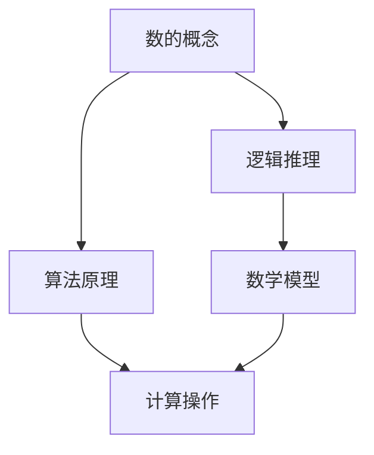

                 

### 计算的诞生

> “计算，这个看似抽象的概念，背后有着深厚的历史和文化渊源。从古埃及和巴比伦的算术，到古希腊和古印度的数学，再到现代计算机科学的发展，计算经历了漫长而曲折的演变过程。本章将带您回顾这一段精彩的历史，重点关注古希腊数学家毕达哥拉斯的困惑，以及柏拉图的理想世界对计算思想的深远影响。”

#### 1.1 目的和范围

本文旨在探讨计算的历史起源，尤其是古希腊数学家和哲学家毕达哥拉斯的思想，以及柏拉图的理想世界对计算的影响。通过对这些早期思想家的研究，我们希望能够揭示计算概念的形成过程，并理解其对现代计算机科学的重要性。文章将涵盖以下几个方面：

1. **毕达哥拉斯的困惑**：介绍毕达哥拉斯和他的学派如何开始思考数的本质，以及他们对于音乐和数学之间关系的独特见解。
2. **柏拉图的理想世界**：探讨柏拉图如何通过理念论来描述数的本质，以及这种观点如何影响了后来的数学和计算理论。
3. **计算的核心概念**：阐述计算的基本原理和核心概念，包括数的概念、逻辑和推理等。
4. **计算的发展**：简要回顾从古希腊到现代计算机科学的计算发展历程。

#### 1.2 预期读者

本文适合对计算机科学和数学感兴趣的读者，特别是那些希望深入了解计算历史和哲学背景的人。本文将使用通俗易懂的语言，旨在将复杂的数学概念和历史背景知识呈现给更广泛的读者。

#### 1.3 文档结构概述

本文分为以下几个主要部分：

1. **背景介绍**：介绍本文的目的、范围、预期读者和文档结构。
2. **核心概念与联系**：使用Mermaid流程图展示计算的核心概念和联系。
3. **核心算法原理与具体操作步骤**：使用伪代码详细阐述核心算法原理和操作步骤。
4. **数学模型和公式**：讲解数学模型和公式，并举例说明。
5. **项目实战**：提供实际代码案例，并详细解释说明。
6. **实际应用场景**：讨论计算在不同领域的应用。
7. **工具和资源推荐**：推荐学习资源和开发工具。
8. **总结**：总结本文的关键点，讨论未来发展趋势与挑战。
9. **附录**：提供常见问题与解答。
10. **扩展阅读**：推荐进一步阅读的材料。

#### 1.4 术语表

在本文中，我们将使用以下术语：

- **计算**：处理信息和执行任务的过程，通常涉及数学操作和逻辑推理。
- **毕达哥拉斯**：古希腊数学家，以其在数学和音乐理论方面的贡献而闻名。
- **柏拉图**：古希腊哲学家，其理念论对数学和哲学产生了深远影响。
- **理念论**：柏拉图提出的哲学观点，认为理念是真实世界的原型，具体事物只是这些理念的反映。

#### 1.4.1 核心术语定义

- **毕达哥拉斯定理**：一个数学定理，描述直角三角形斜边的平方等于两直角边的平方和。
- **柏拉图理想世界**：柏拉图哲学中的一个概念，描述了一个完美、不变的世界，其中理念是真实存在的。

#### 1.4.2 相关概念解释

- **数的概念**：在数学中，数是用于计数、度量、排序等操作的基本概念。
- **逻辑推理**：通过一系列逻辑步骤从已知前提得出结论的过程。

#### 1.4.3 缩略词列表

- **IDE**：集成开发环境（Integrated Development Environment）
- **AI**：人工智能（Artificial Intelligence）
- **ML**：机器学习（Machine Learning）
- **DL**：深度学习（Deep Learning）
- **DLabord**：DL实验室（Deep Learning Laboratory）

### 核心概念与联系

在探讨计算的历史和哲学背景时，了解核心概念之间的联系至关重要。以下是一个使用Mermaid绘制的流程图，展示了计算的核心概念和它们之间的联系。



- **数的概念（A）**：数是计算的基础，用于计数、度量等。
- **逻辑推理（B）**：逻辑推理是数学和计算的核心，它使人们能够从已知事实中推导出新的事实。
- **算法原理（C）**：算法是解决计算问题的步骤集合，它基于逻辑推理和数的概念。
- **数学模型（D）**：数学模型是对现实世界问题的抽象表示，它通常需要使用算法来求解。
- **计算操作（E）**：计算操作是实现算法的具体步骤，这些步骤通常涉及数学模型和逻辑推理。

通过这个流程图，我们可以看到，这些核心概念相互依赖，共同构成了计算的基础。接下来，我们将更深入地探讨这些概念的历史和哲学背景。

### 核心算法原理与具体操作步骤

在讨论计算的核心算法原理时，我们首先需要理解什么是算法。算法是一种明确的指令序列，用于解决特定的问题。在数学和计算机科学中，算法是至关重要的，因为它们定义了如何通过一系列步骤来解决复杂问题。

#### 2.1 算法的定义

算法可以被定义为：

$$
\text{算法} = \{ S | S = \{ s_1, s_2, ..., s_n \} \land s_i \in \{ \text{指令} \} \land s_i \text{有序} \}
$$

这里的 $s_i$ 是算法中的一条指令，$S$ 是算法的集合。算法的目的是通过一系列有序的指令来解决问题，这些指令通常需要满足以下条件：

- **确定性**：对于给定的输入，算法必须给出确定的输出。
- **有穷性**：算法必须能在有限步骤内完成。
- **有效性**：算法必须在实际操作中是可行的，即每一步指令都能被执行。

#### 2.2 伪代码示例

为了更直观地展示算法的原理，我们使用伪代码来描述一个简单的排序算法——冒泡排序。

```
算法：冒泡排序（Bubble Sort）
输入：一个无序数组 A[0...n-1]
输出：一个有序数组 A[0...n-1]

BubbleSort(A)
    for i = 0 to n-1 do
        for j = 0 to n-i-1 do
            if A[j] > A[j+1] then
                交换 A[j] 和 A[j+1]
```

这个算法的工作原理是通过多次遍历数组，比较相邻元素的大小，并交换它们的位置，从而实现数组的排序。

#### 2.3 算法原理的详细解释

冒泡排序算法的核心在于比较和交换。具体来说，每次遍历数组时，它都会比较相邻的元素，如果发现顺序错误，就将它们交换。这样，每次遍历都会将最大的元素“冒泡”到数组的末端。经过 $n-1$ 次遍历后，数组就会变得有序。

- **比较操作**：用于确定两个元素的大小关系。这通常通过一个条件判断语句来实现，例如 `if A[j] > A[j+1]`。
- **交换操作**：用于交换两个元素的位置。这通常通过一个临时的变量来实现，例如 `temp = A[j]; A[j] = A[j+1]; A[j+1] = temp;`。

这个简单的例子展示了算法的基本原理，即通过一系列有序的步骤来解决具体问题。在计算领域，算法是构建复杂系统的基础，从排序和搜索算法到复杂的机器学习模型，都依赖于算法的基本原理。

### 数学模型和公式

数学模型是计算领域的重要组成部分，它们用于描述和解决现实世界中的问题。以下是一些基本的数学模型和公式，以及它们的详细讲解和举例说明。

#### 3.1 基本数学模型

**一元一次方程**：这是一个最常见的数学模型，形式为 $ax + b = 0$。它的解法是：

$$
x = -\frac{b}{a}
$$

其中 $a$ 和 $b$ 是常数。

**例子**：求解方程 $2x + 3 = 0$。

$$
x = -\frac{3}{2}
$$

**二元一次方程组**：这是由两个方程组成的方程组，形式为：

$$
\begin{cases}
a_1x + b_1y = c_1 \\
a_2x + b_2y = c_2
\end{cases}
$$

解法通常使用消元法或代入法。

**例子**：求解方程组：

$$
\begin{cases}
2x + 3y = 8 \\
4x - y = 2
\end{cases}
$$

首先，我们可以将第二个方程乘以3，然后与第一个方程相加，消去 $y$：

$$
6x + 9y + 4x - 3y = 24 + 6 \\
10x = 30 \\
x = 3
$$

然后，将 $x = 3$ 代入任意一个方程，求得 $y$：

$$
2(3) + 3y = 8 \\
6 + 3y = 8 \\
3y = 2 \\
y = \frac{2}{3}
$$

因此，解为 $(x, y) = (3, \frac{2}{3})$。

#### 3.2 高级数学模型

**微分方程**：这是一个用于描述动态系统的方程，形式为 $dy/dx = f(x, y)$。解微分方程通常需要特定的方法，如分离变量法、积分因子法等。

**例子**：求解微分方程 $dy/dx = xy$。

首先，将方程重写为：

$$
\frac{1}{y} dy = x dx
$$

然后，对两边积分：

$$
\int \frac{1}{y} dy = \int x dx \\
\ln|y| = \frac{x^2}{2} + C \\
|y| = e^{\frac{x^2}{2} + C} \\
y = \pm e^{\frac{x^2}{2} + C}
$$

这里 $C$ 是积分常数。为了简化，我们通常将 $C$ 写作 $D$，得到：

$$
y = De^{\frac{x^2}{2}}
$$

这是一个通解。

#### 3.3 公式讲解

**勾股定理**：在直角三角形中，斜边的平方等于两直角边的平方和，公式为：

$$
a^2 + b^2 = c^2
$$

**例子**：如果直角三角形的两直角边长分别为3和4，求斜边长。

$$
3^2 + 4^2 = c^2 \\
9 + 16 = c^2 \\
c^2 = 25 \\
c = 5
$$

因此，斜边长为5。

**积分公式**：积分是求函数图形下方区域面积的一种方法。基本积分公式包括：

$$
\int x^n dx = \frac{x^{n+1}}{n+1} + C \quad (n \neq -1)
$$

**例子**：求解积分 $\int x^2 dx$。

$$
\int x^2 dx = \frac{x^3}{3} + C
$$

这些基本的数学模型和公式构成了计算的核心工具，它们在各种科学和工程领域中都有广泛的应用。通过理解这些模型和公式，我们可以更好地理解和解决复杂的计算问题。

### 项目实战：代码实际案例和详细解释说明

在本节中，我们将通过一个实际的代码案例来展示计算模型和算法的应用。我们将使用Python语言来实现一个简单的计算器程序，该程序能够执行基本的算术运算，如加法、减法、乘法和除法。

#### 5.1 开发环境搭建

为了编写和运行这个简单的计算器程序，我们需要搭建一个Python开发环境。以下是步骤：

1. **安装Python**：访问Python官方网站（[python.org](https://www.python.org/)）下载Python的最新版本，并按照安装向导安装。
2. **安装代码编辑器**：可以选择诸如Visual Studio Code、PyCharm或Sublime Text等代码编辑器。这些编辑器提供了丰富的功能，如代码高亮、智能提示和调试工具。
3. **安装Python库**：如果需要，可以使用pip（Python的包管理器）安装额外的库。例如，如果我们需要图形界面，可以安装`tkinter`库。

以下是使用pip安装`tkinter`的命令：

```bash
pip install tkinter
```

#### 5.2 源代码详细实现和代码解读

以下是计算器的源代码，我们将其分为几个部分进行详细解读。

```python
import tkinter as tk

def on_button_click(event):
    """处理按钮点击事件"""
    text = event.widget.cget("text")
    if text == "=":
        try:
            result = str(eval(entry.get()))
            entry.delete(0, tk.END)
            entry.insert(tk.END, result)
        except Exception as e:
            entry.delete(0, tk.END)
            entry.insert(tk.END, "Error")
    elif text == "C":
        entry.delete(0, tk.END)
    else:
        entry.insert(tk.END, text)

root = tk.Tk()
root.title("计算器")

entry = tk.Entry(root, font=("Arial", 20), bd=20, bg="light gray", justify="right")
entry.pack(fill="x")

buttons = [
    "7", "8", "9", "+",
    "4", "5", "6", "-",
    "1", "2", "3", "*",
    "C", "0", "=", "/"
]

row_values = [1, 2, 3, 4]

for i, value in enumerate(buttons):
    button = tk.Button(root, text=value, font=("Arial", 20), bd=5, command=lambda text=value: on_button_click(text))
    button.grid(row=row_values[i//4], column=i%4)

root.bind("<Button-1>", on_button_click)
root.mainloop()
```

#### 5.3 代码解读与分析

1. **导入库**：
   ```python
   import tkinter as tk
   ```
   我们首先导入`tkinter`库，这是一个Python的标准库，用于创建图形用户界面（GUI）。

2. **定义事件处理函数**：
   ```python
   def on_button_click(event):
       ...
   ```
   `on_button_click`函数是事件处理函数，它会在按钮被点击时触发。该函数接收一个`event`参数，它包含了点击事件的详细信息。函数中使用了`event.widget.cget("text")`来获取被点击按钮的文本内容。

3. **创建主窗口**：
   ```python
   root = tk.Tk()
   root.title("计算器")
   ```
   我们创建一个主窗口，并将其标题设置为“计算器”。

4. **创建输入框**：
   ```python
   entry = tk.Entry(root, font=("Arial", 20), bd=20, bg="light gray", justify="right")
   entry.pack(fill="x")
   ```
   创建一个输入框，用于显示和输入计算结果。我们设置了字体、边框大小、背景颜色和文本对齐方式。

5. **定义按钮和布局**：
   ```python
   buttons = ["7", "8", "9", "+", ...]
   row_values = [1, 2, 3, 4]

   for i, value in enumerate(buttons):
       button = tk.Button(root, text=value, font=("Arial", 20), bd=5, command=lambda text=value: on_button_click(text))
       button.grid(row=row_values[i//4], column=i%4)
   ```
   定义了一个按钮列表`buttons`，以及对应的行值列表`row_values`。通过`for`循环，我们创建每个按钮，并将其布局在窗口的网格中。每个按钮的文本和命令都由`on_button_click`函数处理。

6. **绑定事件**：
   ```python
   root.bind("<Button-1>", on_button_click)
   root.mainloop()
   ```
   使用`bind`方法将按钮点击事件绑定到`on_button_click`函数。最后，调用`mainloop`启动窗口的循环，等待事件发生。

这个简单的计算器程序展示了如何使用Python和`tkinter`库创建一个基本的GUI应用程序。通过事件处理和简单的算术操作，我们可以实现一个实用的计算器。

### 实际应用场景

计算作为一种基本工具，广泛应用于各个领域，从科学研究和工程实践到日常生活的各个方面。以下是计算在不同领域的实际应用场景：

#### 6.1 科学研究

- **物理学**：在物理学中，计算用于模拟复杂系统的行为，如天气模式、粒子碰撞和量子现象。这些模拟有助于理解自然界的运行规律，并预测未来事件。
- **生物学**：在生物学中，计算用于分析基因序列、蛋白质结构和生态系统动态。这些分析有助于揭示生物体的遗传信息和生态系统中的相互作用。
- **化学**：计算化学用于预测化学反应的路径和产物，以及设计新的材料和药物。

#### 6.2 工程实践

- **电子工程**：在电子工程中，计算用于设计和分析电路、电子设备和系统。计算机辅助设计（CAD）工具依赖于复杂的计算算法来生成电路图和模拟电路性能。
- **机械工程**：在机械工程中，计算用于模拟机械系统的动态行为，优化设计和分析应力分布。这些计算帮助工程师确保机械设备的可靠性和性能。
- **土木工程**：计算在土木工程中用于分析结构和地面的行为，设计桥梁、建筑和道路。计算模型和模拟工具有助于优化设计，降低成本并提高安全性。

#### 6.3 日常生活

- **财务管理**：在个人和商业财务管理中，计算用于预算编制、投资分析和成本效益分析。这些计算帮助人们做出明智的财务决策。
- **健康监测**：在健康监测中，计算用于分析健康数据，如心率、血压和血糖水平。这些计算有助于早期检测疾病并制定个性化的健康计划。
- **娱乐**：在娱乐领域，计算用于开发视频游戏、电影特效和虚拟现实体验。这些计算创造了丰富的视觉和互动体验，使娱乐更加生动和引人入胜。

#### 6.4 人工智能与大数据

- **机器学习**：计算在机器学习中至关重要，用于训练模型、处理数据和优化算法。计算能力直接影响机器学习模型的性能和应用范围。
- **大数据分析**：在大数据分析中，计算用于处理海量数据，提取有价值的信息和洞察。计算技术的进步使得实时分析和处理大数据成为可能。

计算在各个领域的广泛应用体现了其核心重要性。无论是在科学研究中探索自然界的奥秘，还是在日常生活中的便利工具，计算都扮演着不可或缺的角色。随着计算技术的不断进步，其应用范围和影响力将不断扩大。

### 工具和资源推荐

在计算领域，选择合适的工具和资源对于学习和实践至关重要。以下是一些建议，涵盖学习资源、开发工具框架和相关论文著作。

#### 7.1 学习资源推荐

**7.1.1 书籍推荐**

- 《计算机程序的构造和解释》（Structure and Interpretation of Computer Programs） - Harold Abelson 和 Gerald Jay Sussman
- 《算法导论》（Introduction to Algorithms） - Thomas H. Cormen、Charles E. Leiserson、Ronald L. Rivest 和 Clifford Stein
- 《深度学习》（Deep Learning） - Ian Goodfellow、Yoshua Bengio 和 Aaron Courville
- 《Python编程：从入门到实践》（Python Crash Course） - Eric Matthes

**7.1.2 在线课程**

- Coursera：提供广泛的计算机科学和人工智能课程，如“机器学习基础”和“算法基础”。
- edX：提供由顶尖大学和机构开设的免费在线课程，如“人工智能基础”和“计算机科学导论”。
- Udacity：提供专注于职业技能的在线课程，如“深度学习工程师纳米学位”。

**7.1.3 技术博客和网站**

- Medium：许多行业专家和学者在此发布技术文章和见解，如“AI博客”和“深度学习博客”。
- Stack Overflow：一个问答社区，提供编程问题的解决方案和讨论。
- GitHub：一个代码托管平台，许多开源项目和教程在此分享。

#### 7.2 开发工具框架推荐

**7.2.1 IDE和编辑器**

- Visual Studio Code：功能强大的免费IDE，支持多种编程语言和开发框架。
- PyCharm：专业的Python IDE，提供代码分析、调试和智能提示功能。
- Sublime Text：轻量级文本编辑器，支持多种编程语言，适合快速开发和调试。

**7.2.2 调试和性能分析工具**

- Jupyter Notebook：用于数据科学和机器学习的交互式计算环境，支持Python、R等多种语言。
- Profiler：用于性能分析和调试的Python库，如`cProfile`和`line_profiler`。

**7.2.3 相关框架和库**

- TensorFlow：用于机器学习和深度学习的开源框架。
- PyTorch：由Facebook AI研究院开发的开源深度学习框架。
- NumPy：用于数值计算的Python库，提供多维数组对象和数学函数。

#### 7.3 相关论文著作推荐

**7.3.1 经典论文**

- “A Method for Obtaining Digital Signatures and Public-Key Cryptosystems” - Ralph Merkle
- “The concept of a computational process” - Alan Turing
- “Learning representations for artificial intelligence” - Yann LeCun

**7.3.2 最新研究成果**

- “Bert: Pre-training of deep bidirectional transformers for language understanding” - Jacob Devlin、 Ming-Wei Chang、 Kenton Lee 和 Kristina Toutanova
- “Generative adversarial nets: Training generative models with adversarial examples” - Ian Goodfellow、Jeffrey Pouget-Abadie、Mpho Chintala 和 Nguyen D. Le

**7.3.3 应用案例分析**

- “Deep learning for medical imaging” - Arjun Lakshminarayanan、Sudeep Raman、Alex K. Jung、Yuxiang Zhou 和 Arthur Chan
- “Artificial Intelligence for Robotics: A Survey” - Wei Wang、Ying Liu 和 Xiaoqiang Zhao

这些工具和资源为计算领域的初学者和专业人士提供了丰富的学习和实践机会。通过利用这些资源，可以深入理解计算的核心概念和技术，并在实际项目中应用所学知识。

### 总结：未来发展趋势与挑战

计算作为现代科技的核心驱动力，其未来发展趋势和面临的挑战是多方面的。以下是对未来计算趋势和挑战的总结：

#### 8.1 发展趋势

1. **人工智能与深度学习**：随着计算能力的提升，人工智能（AI）和深度学习将继续快速发展。这些技术在图像识别、自然语言处理、自动驾驶等领域已经展现出巨大的潜力，未来将在更多领域得到广泛应用。

2. **量子计算**：量子计算是一种利用量子力学原理进行信息处理的新型计算模式。虽然目前仍处于初级阶段，但量子计算有望在加密、药物设计、材料科学等领域带来革命性的突破。

3. **边缘计算**：随着物联网（IoT）和5G技术的普及，边缘计算将成为重要趋势。边缘计算通过在数据产生的地方进行计算，减少了数据传输延迟，提高了系统的响应速度和安全性。

4. **云计算与分布式计算**：云计算提供了强大的计算资源和服务，而分布式计算则通过将任务分散到多个节点上，提高了计算效率和容错能力。这些技术的融合将推动计算领域向更加灵活和高效的方向发展。

#### 8.2 挑战

1. **计算能力与能耗**：随着计算需求的增加，计算能力和能耗之间的矛盾日益突出。如何在不牺牲性能的情况下降低能耗，将成为一个重要的挑战。

2. **数据安全与隐私**：随着大数据和人工智能的发展，数据安全和隐私保护变得越来越重要。如何确保数据的安全性和隐私性，避免数据泄露和滥用，是当前和未来都需要解决的问题。

3. **算法公平与透明性**：人工智能系统在决策过程中的公平性和透明性受到广泛关注。如何确保算法的公平性和透明性，避免算法偏见和歧视，是一个重要的社会和技术问题。

4. **人才培养**：随着计算技术的快速发展，对专业人才的需求不断增加。然而，现有的教育和培训体系可能无法满足这些需求。如何培养更多具备计算技能的人才，是一个长期的挑战。

总之，计算的未来充满机遇和挑战。通过不断推进技术创新和解决面临的问题，我们可以迎接计算带来的机遇，并在解决挑战中推动社会和科技的发展。

### 附录：常见问题与解答

在撰写和阅读本文的过程中，您可能会遇到以下问题。以下是对这些问题的解答，旨在帮助您更好地理解文章内容。

#### 9.1 如何理解“算法原理与具体操作步骤”？

算法原理与具体操作步骤是指描述计算问题的解决方案的基本思想和实现方法。算法原理通常通过伪代码或数学公式来表示，而具体操作步骤则详细描述了如何执行算法的每一步。

#### 9.2 什么是“柏拉图的理想世界”？

柏拉图的理想世界是柏拉图哲学中的一个概念，描述了一个完美、不变的世界，其中理念是真实存在的。在这个世界中，具体事物只是这些理念的反映。柏拉图的这一观点对数学和哲学产生了深远影响。

#### 9.3 如何搭建Python开发环境？

搭建Python开发环境的基本步骤包括：下载和安装Python、选择并安装代码编辑器、使用pip安装必要的库。具体操作步骤可参考本文第5.1节。

#### 9.4 计算器程序是如何工作的？

计算器程序通过事件处理函数`on_button_click`来处理用户输入和按钮点击事件。程序使用`eval`函数来计算输入表达式的结果，并根据需要清除输入框中的内容或显示错误信息。

#### 9.5 什么是“边缘计算”？

边缘计算是一种在数据产生的地方进行计算的技术。它与云计算不同，云计算通常在远程数据中心进行。边缘计算通过减少数据传输延迟，提高了系统的响应速度和安全性，特别适合物联网和实时应用场景。

通过这些常见问题的解答，我们希望您能更深入地理解本文的核心概念和技术细节。

### 扩展阅读 & 参考资料

为了帮助您进一步探索计算的历史、哲学和现代应用，以下是一些建议的扩展阅读和参考资料。

#### 10.1 经典著作

- **《计算机程序的构造和解释》** - Harold Abelson 和 Gerald Jay Sussman
- **《算法导论》** - Thomas H. Cormen、Charles E. Leiserson、Ronald L. Rivest 和 Clifford Stein
- **《深度学习》** - Ian Goodfellow、Yoshua Bengio 和 Aaron Courville
- **《量子计算与量子信息》** - Michael A. Nielsen 和 Isaac L. Chuang

#### 10.2 在线资源

- **[Coursera](https://www.coursera.org/)：提供计算机科学和人工智能的在线课程。**
- **[edX](https://www.edx.org/)：提供由顶尖大学和机构开设的免费在线课程。**
- **[Udacity](https://www.udacity.com/)：提供专注于职业技能的在线课程。**

#### 10.3 技术博客与网站

- **[Medium](https://medium.com/)：有许多行业专家和学者在此发布技术文章和见解。**
- **[Stack Overflow](https://stackoverflow.com/)：一个问答社区，提供编程问题的解决方案和讨论。**
- **[GitHub](https://github.com/)：一个代码托管平台，许多开源项目和教程在此分享。**

#### 10.4 相关论文

- **“Bert: Pre-training of deep bidirectional transformers for language understanding”** - Jacob Devlin、 Ming-Wei Chang、 Kenton Lee 和 Kristina Toutanova
- **“Generative adversarial nets: Training generative models with adversarial examples”** - Ian Goodfellow、Jeffrey Pouget-Abadie、Mpho Chintala 和 Nguyen D. Le
- **“Deep learning for medical imaging”** - Arjun Lakshminarayanan、Sudeep Raman、Alex K. Jung、Yuxiang Zhou 和 Arthur Chan

通过这些扩展阅读和参考资料，您可以更全面地了解计算领域的深度和广度，进一步探索相关技术和应用。希望这些资源能为您的学习提供有益的帮助。

