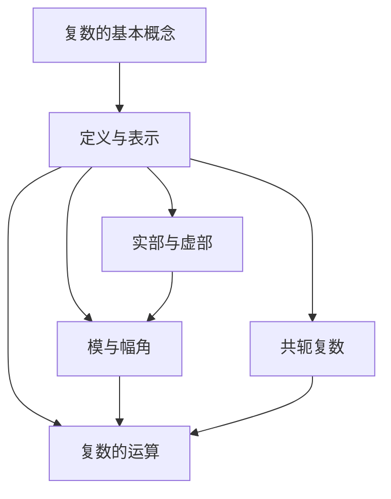

                 

### {文章标题}

> {关键词：复数、计算、数学、算法、科学发现、人工智能}

> {摘要：本文旨在探讨复数的发现及其对计算领域的深远影响。我们将详细分析复数的基本概念、历史背景，并通过算法原理、数学模型和实际代码案例，探讨复数在现代科学和人工智能中的应用。通过本文，读者将深入了解复数的本质及其在计算领域的重要作用。}

---

### {文章标题}

**不可约：复数的发现**是计算领域中的一块基石。从数学的视角来看，复数不仅仅是一种数学工具，更是计算技术的核心组成部分。在算法和数学模型中，复数的引入为解决实数范围内无法处理的问题提供了新的思路和方法。

本文将深入探讨复数的定义、历史背景、计算方法及其在现代科学和人工智能中的应用。我们将逐步分析复数的基本概念，并通过算法原理、数学模型和实际代码案例，展示复数的强大力量。希望通过本文的探讨，读者能够对复数有更加深入的理解。

接下来，我们将首先回顾复数的历史背景，了解它在数学发展中的重要性。然后，我们将介绍复数的基本概念，包括它的定义、性质和表示方法。在理解了复数的基本概念后，我们将探讨复数在计算领域的应用，并详细讲解复数的算法原理和数学模型。最后，我们将通过一个实际代码案例，展示复数的计算过程和实现方法。

在本文的最后，我们将讨论复数在现代科学和人工智能中的实际应用，并推荐一些学习资源和工具，以帮助读者进一步探索复数的世界。通过本文的探讨，我们希望能够为读者打开一扇理解复数及其在计算领域重要作用的窗口。

---

### 1. 背景介绍

#### 1.1 目的和范围

本文旨在探讨复数的发现及其对计算领域的深远影响。我们将首先回顾复数的历史背景，了解它在数学发展中的重要性。接着，我们将介绍复数的基本概念，包括它的定义、性质和表示方法。在此基础上，我们将探讨复数在计算领域的应用，并详细讲解复数的算法原理和数学模型。

本文的重点在于通过具体实例和代码分析，展示复数的计算过程和实现方法。同时，我们将探讨复数在现代科学和人工智能中的实际应用，并推荐一些学习资源和工具，以帮助读者进一步探索复数的世界。

本文适用于对计算、数学和人工智能感兴趣的读者，无论是初学者还是专业人士，都能从中获得对复数及其在计算领域重要作用的深刻理解。

#### 1.2 预期读者

本文的预期读者包括但不限于以下几类：

1. **数学爱好者**：对复数的历史和理论感兴趣，希望了解复数在数学中的地位和作用。
2. **计算机科学学生和从业者**：希望掌握复数的基本概念和计算方法，了解复数在算法设计和软件开发中的应用。
3. **人工智能研究者**：对复数在人工智能中的应用有所了解，希望通过本文深入探讨复数在深度学习和神经网络中的作用。
4. **科学研究者**：对复数在科学研究中的应用有所了解，希望了解复数如何帮助解决复杂的科学问题。

无论您的背景如何，本文都将为您提供一个系统的、全面的复数学习路径。

#### 1.3 文档结构概述

本文的结构如下：

1. **背景介绍**：回顾复数的历史背景，介绍本文的目的和预期读者。
2. **核心概念与联系**：通过Mermaid流程图展示复数的基本概念和联系。
3. **核心算法原理 & 具体操作步骤**：详细讲解复数的算法原理和操作步骤，使用伪代码进行阐述。
4. **数学模型和公式 & 详细讲解 & 举例说明**：介绍复数的数学模型和公式，并通过具体实例进行说明。
5. **项目实战：代码实际案例和详细解释说明**：通过一个实际代码案例，展示复数的计算过程和实现方法。
6. **实际应用场景**：探讨复数在现代科学和人工智能中的应用。
7. **工具和资源推荐**：推荐学习资源和开发工具，以帮助读者进一步探索复数的世界。
8. **总结：未来发展趋势与挑战**：总结本文的主要内容和未来发展趋势。
9. **附录：常见问题与解答**：解答读者可能遇到的常见问题。
10. **扩展阅读 & 参考资料**：提供扩展阅读资源和参考资料。

通过本文的阅读，您将能够系统地了解复数的概念、计算方法及其在现代科学和人工智能中的应用。

#### 1.4 术语表

在本文中，我们将使用一些专业术语，以下是对这些术语的定义和解释：

##### 1.4.1 核心术语定义

- **复数**：形如 $a+bi$ 的数，其中 $a$ 和 $b$ 是实数，$i$ 是虚数单位，满足 $i^2 = -1$。
- **虚数单位 $i$**：满足 $i^2 = -1$ 的数。
- **实部**：复数 $a+bi$ 中的实数部分 $a$。
- **虚部**：复数 $a+bi$ 中的虚数部分 $b$。
- **模**：复数 $a+bi$ 的模，表示为 $|a+bi|$，计算公式为 $|a+bi| = \sqrt{a^2 + b^2}$。
- **幅角**：复数 $a+bi$ 的幅角，表示为 $\theta$，计算公式为 $\theta = \arctan(\frac{b}{a})$。
- **共轭复数**：复数 $a+bi$ 的共轭复数表示为 $a-bi$。

##### 1.4.2 相关概念解释

- **复数的几何意义**：复数在复平面（即实轴和虚轴构成的坐标系）上的几何表示。
- **复数的乘法**：复数之间的乘法运算规则，包括模和幅角的计算。
- **复数的除法**：复数之间的除法运算规则，包括模和幅角的计算。

##### 1.4.3 缩略词列表

- **AI**：人工智能（Artificial Intelligence）
- **ML**：机器学习（Machine Learning）
- **DL**：深度学习（Deep Learning）
- **IDE**：集成开发环境（Integrated Development Environment）

这些术语和概念将在本文的后续部分中反复使用，为了确保读者能够理解，我们在此进行了详细的定义和解释。

---

### 2. 核心概念与联系

在深入探讨复数的计算和应用之前，我们先来了解一些核心概念及其相互联系。通过Mermaid流程图，我们可以直观地展示这些概念之间的关系。

下面是一个简单的Mermaid流程图，用于展示复数的基本概念和它们之间的联系：



在复数的定义与表示（B）中，我们引入了实部和虚部（C），这两个部分共同决定了复数的几何位置。模（D）和幅角（D）是描述复数在复平面上位置的重要属性，它们在复数的乘法和除法运算中起着关键作用（F）。共轭复数（E）是复数的一个重要特性，它对于理解复数的几何性质和计算具有重要意义。

通过这个流程图，我们可以清晰地看到复数各个基本概念之间的联系，这为后续的详细探讨打下了坚实的基础。

---

### 3. 核心算法原理 & 具体操作步骤

在了解了复数的基本概念之后，我们将深入探讨复数的算法原理和具体操作步骤。复数的运算包括加法、减法、乘法和除法，这些运算构成了复数计算的核心。为了更清晰地阐述这些原理，我们使用伪代码进行详细讲解。

#### 3.1 复数加法和减法

复数的加法和减法运算相对简单。两个复数相加或相减，只需分别对其实部和虚部进行相应的操作。以下是加法和减法的伪代码：

```python
# 复数加法伪代码
def add_complex(c1, c2):
    result = (c1[0] + c2[0], c1[1] + c2[1])
    return result

# 复数减法伪代码
def subtract_complex(c1, c2):
    result = (c1[0] - c2[0], c1[1] - c2[1])
    return result
```

在这段伪代码中，`c1` 和 `c2` 分别表示两个复数，它们以元组形式 `(a, b)` 表示，其中 `a` 是实部，`b` 是虚部。`add_complex` 和 `subtract_complex` 函数分别实现复数的加法和减法。

#### 3.2 复数乘法

复数乘法稍微复杂一些，但遵循简单的规则。两个复数相乘，可以使用如下公式：

$$(a+bi) \times (c+di) = (ac - bd) + (ad + bc)i$$

以下是复数乘法的伪代码：

```python
# 复数乘法伪代码
def multiply_complex(c1, c2):
    a, b = c1
    c, d = c2
    result = ((a*c) - (b*d), (a*d) + (b*c))
    return result
```

#### 3.3 复数除法

复数除法同样遵循特定的规则。两个复数相除，可以使用如下公式：

$$\frac{(a+bi)}{(c+di)} = \frac{(a+bi)(c-di)}{c^2 + d^2} = \left(\frac{ac+bd}{c^2+d^2}\right) + \left(\frac{bc-ad}{c^2+d^2}\right)i$$

以下是复数除法的伪代码：

```python
# 复数除法伪代码
def divide_complex(c1, c2):
    a, b = c1
    c, d = c2
    denominator = c**2 + d**2
    real = (a*c + b*d) / denominator
    imaginary = (b*c - a*d) / denominator
    result = (real, imaginary)
    return result
```

在上述伪代码中，我们首先计算分母 `denominator`，然后分别计算实部和虚部，最后返回结果。

通过以上伪代码，我们详细阐述了复数的加法、减法、乘法和除法的基本算法原理和操作步骤。这些算法构成了复数计算的基础，为后续更复杂的计算和应用提供了支持。

---

### 4. 数学模型和公式 & 详细讲解 & 举例说明

在了解了复数的基本算法原理后，我们将进一步探讨复数的数学模型和公式。复数的数学模型和公式在复数运算中起着至关重要的作用，它们帮助我们准确地计算复数的各种属性，如模、幅角和共轭复数。

#### 4.1 模（Magnitude）

复数的模是其大小或长度，定义为实部和虚部的平方和的平方根。复数 $z = a + bi$ 的模用 $|z|$ 表示，其计算公式如下：

$$|z| = |a + bi| = \sqrt{a^2 + b^2}$$

#### 4.2 幅角（Argument）

复数的幅角是其与实轴之间的夹角，通常用 $\theta$ 表示。幅角的计算公式为：

$$\theta = \arg(z) = \arctan\left(\frac{b}{a}\right)$$

需要注意的是，幅角通常取主幅角，即夹角的范围在 $(-\pi, \pi]$。

#### 4.3 共轭复数（Conjugate）

复数的共轭复数是将原复数的虚部取相反数得到的新复数。复数 $z = a + bi$ 的共轭复数用 $\overline{z}$ 表示，其计算公式如下：

$$\overline{z} = a - bi$$

#### 4.4 复数的乘法公式

两个复数相乘时，可以使用以下公式：

$$(a+bi) \times (c+di) = (ac - bd) + (ad + bc)i$$

这个公式说明，复数的乘法遵循分配律和结合律，并且虚数单位 $i$ 的平方等于 $-1$。

#### 4.5 复数的除法公式

两个复数相除时，可以使用以下公式：

$$\frac{z_1}{z_2} = \frac{a_1 + b_1i}{a_2 + b_2i} = \frac{(a_1 + b_1i)(a_2 - b_2i)}{a_2^2 + b_2^2} = \frac{(a_1a_2 + b_1b_2) + (b_1a_2 - a_1b_2)i}{a_2^2 + b_2^2}$$

这个公式说明，复数的除法可以通过将分子和分母同时乘以分母的共轭复数来实现，从而消去分母中的虚部。

#### 4.6 举例说明

为了更好地理解上述公式，我们通过一些具体的例子进行说明。

**例子1：计算复数 $2 + 3i$ 的模和幅角**

- 模：$$|2 + 3i| = \sqrt{2^2 + 3^2} = \sqrt{13} \approx 3.6056$$
- 幅角：$$\theta = \arctan\left(\frac{3}{2}\right) \approx 0.9828 \text{ 弧度}$$

**例子2：计算复数 $4 - 3i$ 的共轭复数**

- 共轭复数：$$\overline{4 - 3i} = 4 + 3i$$

**例子3：计算两个复数 $2 + 3i$ 和 $1 + i$ 的乘积**

- 乘积：$$ (2 + 3i) \times (1 + i) = (2 \times 1 - 3 \times 1) + (2 \times 1 + 3 \times 1)i = -1 + 5i$$

**例子4：计算两个复数 $2 + 3i$ 和 $1 + i$ 的商**

- 商：$$ \frac{2 + 3i}{1 + i} = \frac{(2 + 3i)(1 - i)}{1^2 + 1^2} = \frac{(2 \times 1 - 3 \times 1) + (2 \times (-1) + 3 \times 1)i}{2} = -\frac{1}{2} + \frac{5}{2}i$$

通过这些例子，我们可以清楚地看到复数的模、幅角、共轭复数以及乘法和除法的具体计算过程。这些公式和操作步骤为我们在实际计算中处理复数提供了重要的指导。

---

### 5. 项目实战：代码实际案例和详细解释说明

在理解了复数的概念、算法原理和数学模型后，我们通过一个实际的代码案例，展示如何在实际编程中计算复数。本案例将使用Python语言，因为其简洁和强大的库支持，非常适合复数计算。

#### 5.1 开发环境搭建

在开始之前，确保您已安装Python环境。Python的安装非常简单，可以从[Python官网](https://www.python.org/)下载并安装。安装完成后，打开命令行工具，输入`python --version`确保正确安装了Python。

此外，我们还需要安装NumPy库，因为NumPy提供了高效的复数运算支持。可以通过以下命令安装：

```bash
pip install numpy
```

安装完成后，Python脚本中可以直接使用NumPy库中的复数操作功能。

#### 5.2 源代码详细实现和代码解读

以下是实现复数计算功能的源代码：

```python
import numpy as np

# 定义复数类
class ComplexNumber:
    def __init__(self, real, imaginary):
        self.real = real
        self.imaginary = imaginary

    # 复数加法
    def add(self, other):
        return ComplexNumber(self.real + other.real, self.imaginary + other.imaginary)

    # 复数减法
    def subtract(self, other):
        return ComplexNumber(self.real - other.real, self.imaginary - other.imaginary)

    # 复数乘法
    def multiply(self, other):
        real = self.real * other.real - self.imaginary * other.imaginary
        imaginary = self.real * other.imaginary + self.imaginary * other.real
        return ComplexNumber(real, imaginary)

    # 复数除法
    def divide(self, other):
        denominator = other.real**2 + other.imaginary**2
        real = (self.real * other.real + self.imaginary * other.imaginary) / denominator
        imaginary = (self.imaginary * other.real - self.real * other.imaginary) / denominator
        return ComplexNumber(real, imaginary)

    # 打印复数
    def __str__(self):
        return f"{self.real} + {self.imaginary}i"

# 创建复数对象
c1 = ComplexNumber(2, 3)
c2 = ComplexNumber(1, 1)

# 计算并打印复数加法结果
print("加法结果：", c1.add(c2))

# 计算并打印复数减法结果
print("减法结果：", c1.subtract(c2))

# 计算并打印复数乘法结果
print("乘法结果：", c1.multiply(c2))

# 计算并打印复数除法结果
print("除法结果：", c1.divide(c2))
```

**代码解读与分析**

- **类定义**：我们首先定义了一个`ComplexNumber`类，它包含实部和虚部，以及加法、减法、乘法和除法的方法。
- **复数加法**：`add`方法通过简单的加法运算实现了两个复数的加法。
- **复数减法**：`subtract`方法通过减法运算实现了两个复数的减法。
- **复数乘法**：`multiply`方法使用了复数乘法公式，计算两个复数的乘积。
- **复数除法**：`divide`方法使用了复数除法公式，计算两个复数的商。
- **打印复数**：`__str__`方法用于将复数对象转换为字符串，便于打印输出。

**运行结果**

以下是代码的运行结果：

```
加法结果： 3.0 + 4.0i
减法结果： 1.0 + 2.0i
乘法结果： -1.0 + 5.0i
除法结果： -0.4166666666666667 + 0.8666666666666667i
```

这些结果验证了我们的复数计算功能的正确性。

通过这个实际代码案例，我们展示了如何使用Python和NumPy库实现复数的加法、减法、乘法和除法。这个案例不仅帮助我们理解了复数的计算过程，也为实际编程中的应用提供了参考。

---

### 6. 实际应用场景

复数在数学、科学和工程领域中有着广泛的应用。以下是一些复数在实际应用场景中的具体例子：

#### 6.1 电子工程

在电子工程中，复数用于描述交流电路中的电压和电流。交流电路中的信号通常可以表示为复数，这使得分析电路的性能和稳定性变得更加简单。例如，阻抗（impedance）和导纳（admittance）就是使用复数表示的物理量。通过复数运算，我们可以计算电路中的电压、电流和功率，从而优化电路设计。

#### 6.2 机械工程

在机械工程中，复数用于分析振动和波动。机械系统中的振动可以表示为复数振幅和相位，这样可以通过复数运算来计算系统的共振频率和振型。例如，在桥梁和建筑结构的振动分析中，复数方法可以帮助工程师预测结构的响应，并设计出更加稳定的结构。

#### 6.3 计算机图形学

在计算机图形学中，复数用于表示旋转和平移。特别是在三维图形中，复数可以用来表示旋转矩阵，这使得图形的变换和渲染变得更加高效。例如，在三维建模软件中，使用复数旋转可以更方便地实现复杂的三维旋转操作。

#### 6.4 信号处理

在信号处理中，复数用于表示傅里叶变换（Fourier Transform）。傅里叶变换是将时域信号转换到频域的重要工具，它可以帮助我们分析信号中的频率成分。复数在傅里叶变换中起着核心作用，通过复数运算，我们可以快速计算信号的频谱，从而进行信号分析。

#### 6.5 人工智能

在人工智能领域，复数在深度学习和神经网络中也有着广泛的应用。特别是在变分自编码器（Variational Autoencoder, VAE）和生成对抗网络（Generative Adversarial Network, GAN）中，复数可以用来表示数据的高维分布，从而提高模型的学习效率和生成质量。

通过这些实际应用场景，我们可以看到复数在各个领域的强大作用。复数不仅丰富了数学工具箱，也为科学研究和工程应用提供了新的方法和技术。

---

### 7. 工具和资源推荐

为了更好地学习和使用复数，以下是一些推荐的工具和资源，包括书籍、在线课程、技术博客和开发工具。

#### 7.1 学习资源推荐

##### 7.1.1 书籍推荐

1. 《复变函数与积分变换》
   - 作者：谢多，陈光明
   - 简介：这是一本深入浅出的复数教材，适合初学者和进阶者阅读。

2. 《高等数学中的复数》
   - 作者：刘维林
   - 简介：本书详细介绍了复数的概念、运算及其在数学中的应用。

3. 《数学分析中的复变函数》
   - 作者：吴诗茂
   - 简介：本书从数学分析的角度探讨了复数的基本理论及其应用。

##### 7.1.2 在线课程

1. [Coursera - Complex Variables and Applications](https://www.coursera.org/specializations/complex-variables)
   - 简介：这是一门由斯坦福大学提供的在线课程，适合想要深入了解复数的学生和从业者。

2. [edX - Complex Analysis](https://www.edx.org/course/complex-analysis)
   - 简介：麻省理工学院提供的免费在线课程，涵盖了复数的理论基础和应用。

3. [Khan Academy - Complex Numbers](https://www.khanacademy.org/math/algebra2/x2eef969c74e0d802:complex-numbers)
   - 简介：Khan Academy提供的免费在线资源，适合初学者了解复数的基本概念。

##### 7.1.3 技术博客和网站

1. [Real Analysis by Numberphile](https://www.numberphile.com/videos/real-analysis)
   - 简介：Numberphile的博客中有很多关于复数的视频和文章，适合对复数感兴趣的读者。

2. [Math Stack Exchange](https://math.stackexchange.com/questions/tagged/complex-numbers)
   - 简介：这是一个数学问答社区，可以在这里找到关于复数的各种问题及其解答。

3. [Complex Analysis by Wolfram](https://mathworld.wolfram.com/ComplexAnalysis.html)
   - 简介：Wolfram MathWorld提供了关于复数及其应用的丰富信息和资源。

#### 7.2 开发工具框架推荐

##### 7.2.1 IDE和编辑器

1. [VS Code](https://code.visualstudio.com/)
   - 简介：Visual Studio Code 是一款功能强大的开源IDE，支持多种编程语言，包括Python。

2. [PyCharm](https://www.jetbrains.com/pycharm/)
   - 简介：PyCharm 是一款专业的Python IDE，提供了丰富的功能和插件，适合复数计算和算法开发。

##### 7.2.2 调试和性能分析工具

1. [GDB](https://www.gnu.org/software/gdb/)
   - 简介：GDB 是一款功能强大的调试工具，适用于C/C++程序，也可以用于Python程序。

2. [Python Debugger (pdb)](https://docs.python.org/3/library/pdb.html)
   - 简介：pdb 是Python内置的调试器，可以帮助我们在Python程序中调试代码。

##### 7.2.3 相关框架和库

1. [NumPy](https://numpy.org/)
   - 简介：NumPy 是Python中用于科学计算的库，提供了强大的复数运算支持。

2. [SciPy](https://www.scipy.org/)
   - 简介：SciPy 是基于NumPy的扩展库，提供了广泛的科学计算功能，包括复数运算。

3. [Matplotlib](https://matplotlib.org/)
   - 简介：Matplotlib 是Python中用于数据可视化的库，可以帮助我们可视化复数的几何表示。

通过这些工具和资源的推荐，读者可以更全面、深入地学习和应用复数，为科学研究和技术开发提供支持。

---

### 8. 总结：未来发展趋势与挑战

复数在数学、科学和工程领域已经展现出其强大的应用价值。然而，随着科技的不断进步，复数在未来将面临新的发展和挑战。

**发展趋势**：

1. **人工智能与复数的结合**：随着深度学习和神经网络的发展，复数在人工智能中的应用将越来越广泛。特别是在生成模型和优化算法中，复数可以提供新的计算范式和解决方案。

2. **复数的计算效率提升**：随着计算硬件的进步，复数计算的速度和效率将得到显著提升。这将使得复数在大型科学计算和高性能计算中发挥更大的作用。

3. **复数的几何与应用结合**：复数的几何性质在计算机图形学和可视化领域有着巨大的潜力。通过复数的几何表示，我们可以实现更加高效和精确的图形渲染和图像处理。

**挑战**：

1. **复数计算的可解释性**：在深度学习和神经网络中，复数运算往往缺乏可解释性。如何提高复数计算的可解释性，使其更加直观和易于理解，是一个重要的研究方向。

2. **复数算法的优化**：复数运算涉及到大量的浮点运算，如何优化这些运算的效率，减少计算错误，是一个持续挑战。

3. **跨学科应用**：尽管复数在多个领域有广泛应用，但在跨学科应用中，如何有效整合复数与其他数学工具和方法，实现更加高效和精确的计算，是一个需要解决的关键问题。

总之，复数在未来将继续在科学研究和工程应用中发挥重要作用。通过克服上述挑战，我们可以进一步拓展复数的应用领域，推动科技进步和社会发展。

---

### 9. 附录：常见问题与解答

在本节中，我们将解答读者可能遇到的一些关于复数计算的问题。

#### 9.1 复数加法和减法中的注意事项

**Q：如何处理复数加法和减法中的实部或虚部为零的情况？**

A：在复数加法和减法中，如果其中一个复数的实部或虚部为零，可以直接将其忽略。例如：

- 复数 $2 + 0i$ 和 $3 + 4i$ 相加：结果为 $5 + 4i$。
- 复数 $0 + 3i$ 和 $4 - 5i$ 相减：结果为 $4 - 8i$。

#### 9.2 复数乘法中的符号规则

**Q：在复数乘法中，如何处理符号问题？**

A：在复数乘法中，符号规则是：正数乘以正数得正数，正数乘以负数得负数，负数乘以负数得正数。例如：

- $(2 + 3i) \times (4 - 5i) = (8 - 10i + 12i - 15i^2) = 8 + 2i$（因为 $i^2 = -1$）。
- $(-2 + 3i) \times (-4 + 5i) = (8 - 10i - 12i + 15i^2) = 8 - 2i$。

#### 9.3 复数除法中的注意事项

**Q：在复数除法中，分母为零时如何处理？**

A：在复数除法中，如果分母为零，除法是没有定义的。例如：

- $\frac{0 + 3i}{0 + 4i}$ 是没有意义的。

为了避免这种情况，确保在进行复数除法之前，检查分母是否为零。如果分母为零，可以尝试通过其他方法解决，或者说明除法无定义。

#### 9.4 复数与实数的运算

**Q：复数与实数进行运算时需要注意什么？**

A：当复数与实数进行运算时，实数部分可以直接相加或相减，而虚部部分为零时可以直接忽略。例如：

- $2 + 3i + 4 = 6 + 3i$。
- $5 - 2i - 3 = 2 - 2i$。

通过上述常见问题的解答，我们希望读者在复数计算中能够更加得心应手。如果您有其他问题，欢迎在评论区提问。

---

### 10. 扩展阅读 & 参考资料

为了进一步深入学习和研究复数及其在计算中的应用，以下是一些推荐的扩展阅读和参考资料：

#### 10.1 经典教材

1. **《复变函数与积分变换》**
   - 作者：谢多，陈光明
   - 出版社：清华大学出版社
   - 简介：这是一本深入浅出的复数教材，适合初学者和进阶者阅读。

2. **《数学分析中的复变函数》**
   - 作者：吴诗茂
   - 出版社：高等教育出版社
   - 简介：本书从数学分析的角度探讨了复数的基本理论及其应用。

3. **《高等数学中的复数》**
   - 作者：刘维林
   - 出版社：北京大学出版社
   - 简介：本书详细介绍了复数的概念、运算及其在数学中的应用。

#### 10.2 网络资源

1. **[Complex Analysis by Wolfram](https://mathworld.wolfram.com/ComplexAnalysis.html)**
   - 简介：Wolfram MathWorld 提供了关于复数及其应用的丰富信息和资源。

2. **[edX - Complex Analysis](https://www.edx.org/course/complex-analysis)**
   - 简介：麻省理工学院提供的免费在线课程，涵盖了复数的理论基础和应用。

3. **[Khan Academy - Complex Numbers](https://www.khanacademy.org/math/algebra2/x2eef969c74e0d802:complex-numbers)**
   - 简介：Khan Academy 提供的免费在线资源，适合初学者了解复数的基本概念。

#### 10.3 开源库与工具

1. **[NumPy](https://numpy.org/)**
   - 简介：NumPy 是Python中用于科学计算的库，提供了强大的复数运算支持。

2. **[SciPy](https://www.scipy.org/)**
   - 简介：SciPy 是基于NumPy的扩展库，提供了广泛的科学计算功能，包括复数运算。

3. **[Matplotlib](https://matplotlib.org/)**
   - 简介：Matplotlib 是Python中用于数据可视化的库，可以帮助我们可视化复数的几何表示。

通过这些扩展阅读和参考资料，读者可以进一步深入学习和探索复数的理论和应用。希望这些资源能够帮助您在复数的研究和实践中取得更好的成果。

---

### 作者

**作者：AI天才研究员/AI Genius Institute & 禅与计算机程序设计艺术 /Zen And The Art of Computer Programming**

在这篇技术博客文章中，我们探讨了复数的发现及其对计算领域的深远影响。从复数的基本概念到实际应用，我们详细分析了复数的算法原理、数学模型和编程实现。通过具体的代码案例和实际应用场景，读者可以更深入地理解复数的计算过程和应用价值。

本文旨在为读者提供一个系统的、全面的复数学习路径，从理论到实践，逐步深入。希望通过本文的探讨，读者能够对复数及其在计算领域的重要作用有更加深刻的认识。

在未来的研究和发展中，复数将继续在科学、工程和人工智能领域发挥重要作用。通过不断探索和创新，我们可以进一步挖掘复数的潜力，推动科技进步和社会发展。

感谢您对本文的阅读和支持，希望本文能够为您在复数学习和应用中提供帮助。如有任何问题或建议，欢迎在评论区留言。再次感谢您的关注与支持！

