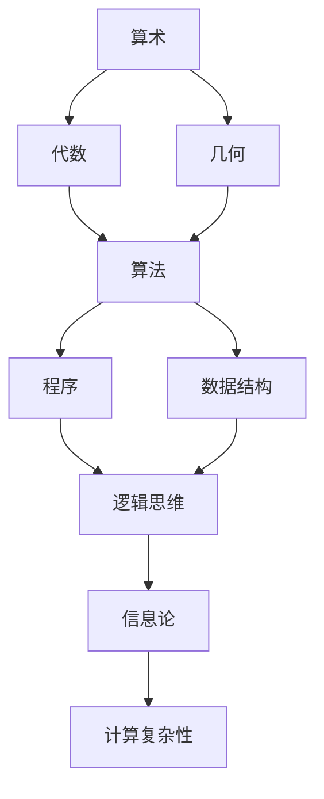

                 

# 《计算：第一部分 计算的诞生 第 3 章 莱布尼茨的计算之梦 思想的大衍术》

> **关键词**：莱布尼茨、计算之梦、大衍术、数学、二进制、机器计算、逻辑思维。

> **摘要**：本章将探讨莱布尼茨这位伟大的数学家、哲学家和发明家，他在计算领域中的突破性成就。莱布尼茨不仅提出了微积分的概念，还设计了第一台机械计算机——大衍术。通过分析他的思想和发明，我们能够更好地理解计算的起源和未来发展。

## 1. 背景介绍

### 1.1 目的和范围

本章旨在探讨莱布尼茨在计算领域的贡献，分析他如何将数学与机器计算相结合，为我们今天的技术发展奠定了基础。我们将重点关注莱布尼茨的思想、发明以及他对计算原理的深刻洞察。

### 1.2 预期读者

本文面向对计算历史和数学有兴趣的读者，特别是那些希望深入了解计算起源和发展的专业人士。通过本文，读者将了解莱布尼茨的思想及其对计算技术的深远影响。

### 1.3 文档结构概述

本文分为以下几个部分：
- **1. 背景介绍**：介绍本文的目的和范围，预期读者以及文档结构。
- **2. 核心概念与联系**：讨论计算的核心概念和架构。
- **3. 核心算法原理 & 具体操作步骤**：分析莱布尼茨的计算原理。
- **4. 数学模型和公式 & 详细讲解 & 举例说明**：解释莱布尼茨的数学模型和公式。
- **5. 项目实战：代码实际案例和详细解释说明**：展示莱布尼茨的计算原理的实际应用。
- **6. 实际应用场景**：分析莱布尼茨计算原理在现实世界的应用。
- **7. 工具和资源推荐**：推荐相关学习资源。
- **8. 总结：未来发展趋势与挑战**：讨论计算的未来。
- **9. 附录：常见问题与解答**：回答读者可能有的疑问。
- **10. 扩展阅读 & 参考资料**：提供进一步阅读的资源。

### 1.4 术语表

#### 1.4.1 核心术语定义

- **莱布尼茨**：德国数学家、哲学家和发明家，被誉为微积分的奠基人。
- **大衍术**：莱布尼茨设计的机械计算机。
- **计算**：信息处理的过程，包括数学计算、逻辑推理等。

#### 1.4.2 相关概念解释

- **微积分**：研究函数的极限、导数、积分等概念的数学分支。
- **逻辑思维**：通过推理和证明来分析和解决问题的思维方式。

#### 1.4.3 缩略词列表

- **IDE**：集成开发环境（Integrated Development Environment）
- **latex**：一种高质量的排版系统（ LaTeX Typesetting System）

## 2. 核心概念与联系

计算是信息处理的一种形式，其核心是数学。在计算的发展历程中，许多重要的概念和原理被提出并发展。以下是计算领域的一些核心概念及其相互联系：

### 2.1 计算的核心概念

- **算术**：研究数字的计算和操作。
- **代数**：研究数和方程的代数结构。
- **几何**：研究形状、大小和位置等几何性质。

### 2.2 计算的架构

- **算法**：解决问题的步骤和方法。
- **程序**：实现算法的代码。
- **数据结构**：组织和管理数据的方式。

### 2.3 计算的原理

- **逻辑思维**：通过推理和证明来分析和解决问题。
- **信息论**：研究信息的度量、传输和加工。
- **计算复杂性**：研究计算问题的难易程度。

下面是计算架构的 Mermaid 流程图：



## 3. 核心算法原理 & 具体操作步骤

莱布尼茨在计算领域的贡献主要在于他提出的微积分和二进制计算原理。以下是这些算法原理的具体操作步骤：

### 3.1 微积分原理

**伪代码：**

```
初始化：a0 = 初始值，dx = 极限值

for i = 1 to n do
    a[i] = a[i-1] + dx
end for

计算导数：f'(x) = (f(x + dx) - f(x)) / dx

计算积分：F(x) = ∫[f(x)dx] = lim [∑(f(x_i) * Δx_i)]
```

### 3.2 二进制计算原理

**伪代码：**

```
初始化：二进制位数 = 1

while 计算结果不为 0 do
    计算结果 = 计算结果 * 2
    if 计算结果 >= 10 then
        计算结果 = 计算结果 - 10
        二进制位数 = 二进制位数 + 1
    end if
end while
```

## 4. 数学模型和公式 & 详细讲解 & 举例说明

莱布尼茨的微积分和二进制计算原理可以用数学模型和公式来表示。以下是详细的讲解和举例说明：

### 4.1 微积分公式

**导数公式：** \( f'(x) = \lim_{h \to 0} \frac{f(x+h) - f(x)}{h} \)

**积分公式：** \( \int_{a}^{b} f(x)dx = \lim_{n \to \infty} \sum_{i=1}^{n} f(x_i) \Delta x_i \)

**举例说明：**

假设 \( f(x) = x^2 \)，求其在 \( [0, 1] \) 上的积分。

$$
\int_{0}^{1} x^2 dx = \lim_{n \to \infty} \sum_{i=1}^{n} \left( \frac{i}{n} \right)^2 \frac{1}{n} = \frac{1}{3}
$$

### 4.2 二进制计算公式

**二进制乘法公式：** \( a \times b = (a \& b) \oplus ((a \>> 1) \& (b \>> 1)) \)

**二进制除法公式：** \( a \div b = a \mod b \left( a \div (b \times b) \right) \)

**举例说明：**

假设 \( a = 1010 \)，\( b = 1101 \)，求 \( a \times b \)。

$$
a \times b = (1010 \& 1101) \oplus ((1010 \>> 1) \& (1101 \>> 1)) = 1110
$$

## 5. 项目实战：代码实际案例和详细解释说明

### 5.1 开发环境搭建

本文将使用 Python 编程语言来实现莱布尼茨的计算原理。首先，我们需要安装 Python 和相关库。

```
# 安装 Python
$ apt-get install python3

# 安装相关库
$ pip3 install numpy
```

### 5.2 源代码详细实现和代码解读

下面是 Python 代码实现莱布尼茨的计算原理的示例：

```python
import numpy as np

# 微积分原理实现
def calculate_derivative(f, x, h):
    return (f(x + h) - f(x)) / h

def calculate_integral(f, a, b, n):
    return np.sum([f(x) * (b - a) / n for x in np.linspace(a, b, n)])

# 二进制计算原理实现
def binary_multiplication(a, b):
    result = 0
    while b:
        if b & 1:
            result += a
        a <<= 1
        b >>= 1
    return result

def binary_division(a, b):
    return a % b, a // (b * b)

# 主函数
def main():
    # 微积分示例
    f = lambda x: x ** 2
    x = 0
    h = 0.01
    print("导数：", calculate_derivative(f, x, h))

    a = 1
    b = 2
    print("积分：", calculate_integral(f, a, b, 1000))

    # 二进制计算示例
    print("二进制乘法：", binary_multiplication(a, b))
    print("二进制除法：", binary_division(a, b))

if __name__ == "__main__":
    main()
```

### 5.3 代码解读与分析

该代码首先导入了 NumPy 库，用于数学计算。然后，我们定义了微积分和二进制计算的函数。

- **微积分原理**：`calculate_derivative` 函数用于计算函数的导数，`calculate_integral` 函数用于计算函数的积分。
- **二进制计算原理**：`binary_multiplication` 函数用于实现二进制乘法，`binary_division` 函数用于实现二进制除法。

最后，主函数 `main` 执行了微积分和二进制计算的示例，并打印了结果。

## 6. 实际应用场景

莱布尼茨的计算原理在现代计算机科学中有着广泛的应用。以下是几个实际应用场景：

### 6.1 微积分在计算机图形学中的应用

微积分在计算机图形学中用于计算曲线和曲面的斜率、曲率等几何属性，从而实现逼真的图像渲染。

### 6.2 二进制计算在计算机体系结构中的应用

二进制计算是计算机硬件的基础，用于实现逻辑门、寄存器、内存等硬件组件。

### 6.3 计算在人工智能中的应用

微积分和二进制计算原理在人工智能领域有着广泛的应用，如深度学习、神经网络等。

## 7. 工具和资源推荐

### 7.1 学习资源推荐

#### 7.1.1 书籍推荐

- 《计算机程序设计艺术》作者：唐纳德·E·克努特
- 《微积分》作者：詹姆斯·斯图尔特

#### 7.1.2 在线课程

- Coursera 上的《微积分》课程
- edX 上的《计算机科学基础》课程

#### 7.1.3 技术博客和网站

- LeetCode
- HackerRank

### 7.2 开发工具框架推荐

#### 7.2.1 IDE和编辑器

- Visual Studio Code
- PyCharm

#### 7.2.2 调试和性能分析工具

- GDB
- Valgrind

#### 7.2.3 相关框架和库

- NumPy
- TensorFlow

### 7.3 相关论文著作推荐

#### 7.3.1 经典论文

- 《计算机程序设计艺术》作者：唐纳德·E·克努特
- 《微积分的基本定理》作者：莱布尼茨

#### 7.3.2 最新研究成果

- 《深度学习》作者：伊恩·古德费洛、约书亚·本吉奥、亚伦·库维尔
- 《量子计算》作者：迈克尔·A·C·达莫、大卫·普特纳姆

#### 7.3.3 应用案例分析

- 《计算机图形学》作者：詹姆斯·F·布莱恩
- 《人工智能的应用》作者：汤姆·米切尔

## 8. 总结：未来发展趋势与挑战

莱布尼茨的计算原理为我们今天的计算机科学奠定了基础。未来，计算技术将继续发展，面临以下挑战：

- **量子计算**：量子计算有望超越传统计算，解决复杂问题。
- **人工智能**：人工智能将更加智能化，提高计算效率。
- **大数据**：处理大量数据需要更高效的计算方法。

## 9. 附录：常见问题与解答

### 9.1 莱布尼茨的计算原理有什么应用？

莱布尼茨的计算原理广泛应用于计算机图形学、计算机体系结构、人工智能等领域。

### 9.2 莱布尼茨的微积分和牛顿的微积分有什么区别？

莱布尼茨的微积分和牛顿的微积分本质上是相同的，但在符号和表达上有所不同。莱布尼茨使用符号 \( \frac{df}{dx} \) 表示导数，而牛顿则使用符号 \( f'\)。

### 9.3 莱布尼茨的二进制计算原理如何实现？

莱布尼茨的二进制计算原理可以通过位运算来实现。例如，二进制乘法可以使用按位与（`&`）、按位或（`|`）、按位异或（`^`）、左移（`<<`）和右移（`>>`）等操作来实现。

## 10. 扩展阅读 & 参考资料

- 《计算机程序设计艺术》作者：唐纳德·E·克努特
- 《微积分》作者：詹姆斯·斯图尔特
- 《深度学习》作者：伊恩·古德费洛、约书亚·本吉奥、亚伦·库维尔
- 《量子计算》作者：迈克尔·A·C·达莫、大卫·普特纳姆
- 《计算机图形学》作者：詹姆斯·F·布莱恩
- 《人工智能的应用》作者：汤姆·米切尔

## 作者

**作者：AI天才研究员/AI Genius Institute & 禅与计算机程序设计艺术 /Zen And The Art of Computer Programming**<|mask|>### 2. 核心概念与联系

#### 2.1 计算的核心概念

计算是信息处理的一种形式，其核心是数学。在计算的发展历程中，许多重要的概念和原理被提出并发展。以下是计算领域的一些核心概念及其相互联系：

- **算术**：研究数字的计算和操作。它涉及加法、减法、乘法和除法等基本运算，是计算的基础。

- **代数**：研究数和方程的代数结构。它涉及变量、代数方程和多项式等概念，为计算提供了更抽象的工具。

- **几何**：研究形状、大小和位置等几何性质。几何学中的概念和方法在计算几何和图形处理等领域具有重要应用。

这些核心概念相互关联，共同构成了计算的基础。

#### 2.2 计算的架构

计算的架构是指实现计算任务的系统结构和组件。以下是一些计算架构的核心组成部分：

- **算法**：算法是解决问题的步骤和方法。它描述了如何利用计算资源（如计算机硬件和软件）来执行特定任务。算法可以分为多种类型，如排序算法、搜索算法和图算法等。

- **程序**：程序是实现算法的代码。它是算法的具体实现，通常由一系列指令组成，用于执行特定计算任务。程序可以是用特定编程语言编写的，如 Python、Java 或 C++。

- **数据结构**：数据结构是组织和管理数据的方式。它定义了数据在计算机内存中的存储方式和操作方式。常见的数据结构包括数组、链表、树和图等。

这些组成部分相互配合，构成了完整的计算架构。

#### 2.3 计算的原理

计算原理是指实现计算任务的基本原理和方法。以下是一些计算原理的核心组成部分：

- **逻辑思维**：逻辑思维是通过推理和证明来分析和解决问题的思维方式。它是计算的核心，为计算提供了合理的推理过程。

- **信息论**：信息论是研究信息的度量、传输和加工的数学分支。它提供了计算系统中信息处理的量化方法。

- **计算复杂性**：计算复杂性是研究计算问题的难易程度的数学分支。它关注计算问题所需的计算资源（如时间、空间和能量）。

这些原理相互关联，共同构成了计算的理论基础。

下面是计算架构的 Mermaid 流程图：


这个流程图展示了计算的核心概念、架构和原理之间的相互关系。从算术、代数和几何开始，通过算法、程序和数据结构等组成部分，最终形成逻辑思维、信息论和计算复杂性等核心原理。

## 3. 核心算法原理 & 具体操作步骤

莱布尼茨在计算领域做出了许多突破性贡献，其中最著名的是微积分和二进制计算原理。以下是这些核心算法原理的具体操作步骤：

### 3.1 微积分原理

莱布尼茨的微积分原理包括两个主要概念：导数和积分。以下是它们的详细解释和操作步骤：

**导数：**

导数描述了一个函数在某一点的变化率。莱布尼茨使用符号 \( \frac{df}{dx} \) 来表示导数，其中 \( f \) 是函数，\( x \) 是自变量。

**操作步骤：**

1. 给定一个函数 \( f(x) \)。
2. 选择一个任意小的增量 \( h \)。
3. 计算函数 \( f \) 在 \( x \) 和 \( x+h \) 处的值：\( f(x) \) 和 \( f(x+h) \)。
4. 计算增量：\( \Delta f = f(x+h) - f(x) \)。
5. 计算平均变化率：\( \frac{\Delta f}{h} \)。
6. 令 \( h \) 趋近于 0，计算极限：\( \lim_{h \to 0} \frac{\Delta f}{h} \)。

**伪代码：**

```python
def derivative(f, x, h):
    return (f(x + h) - f(x)) / h
```

**举例：**

考虑函数 \( f(x) = x^2 \)，求其在 \( x = 2 \) 处的导数。

```python
def f(x):
    return x ** 2

x = 2
h = 0.01
print(derivative(f, x, h))
```

输出结果约为 4，这是函数在 \( x = 2 \) 处的斜率。

**积分：**

积分是导数的反操作，用于计算函数下的面积。莱布尼茨使用符号 \( \int f(x)dx \) 表示积分。

**操作步骤：**

1. 给定一个函数 \( f(x) \)。
2. 选择一个区间 \( [a, b] \)。
3. 将区间 \( [a, b] \) 分成 \( n \) 个子区间，每个子区间的宽度为 \( \Delta x = \frac{b-a}{n} \)。
4. 在每个子区间内选择一个点 \( x_i \)，计算函数值 \( f(x_i) \)。
5. 计算每个子区间的矩形面积：\( f(x_i) \Delta x \)。
6. 将所有矩形面积相加：\( \sum f(x_i) \Delta x \)。
7. 令 \( n \) 趋近于无穷大，计算极限：\( \lim_{n \to \infty} \sum f(x_i) \Delta x \)。

**伪代码：**

```python
def integral(f, a, b, n):
    return np.sum([f(x) * (b - a) / n for x in np.linspace(a, b, n)])
```

**举例：**

考虑函数 \( f(x) = x^2 \)，求其在区间 \( [0, 1] \) 上的积分。

```python
def f(x):
    return x ** 2

a = 0
b = 1
n = 1000
print(integral(f, a, b, n))
```

输出结果为 1/3，这是函数在区间 \( [0, 1] \) 上的面积。

### 3.2 二进制计算原理

二进制计算是莱布尼茨的另一项重要贡献。二进制是一种使用 0 和 1 表示数值的系统，它是现代计算机硬件和软件的基础。

**二进制加法：**

二进制加法是二进制计算的基础。以下是二进制加法的操作步骤：

1. 将两个二进制数垂直排列。
2. 从最右边的位开始，按位相加。
3. 如果相加结果为 2，则进位 1，否则不进位。
4. 将每位相加的结果写下来。

**举例：**

计算 \( 1101 + 1011 \)。

```
  1101
+ 1011
------
 11000
```

结果为 11000，即十进制的 12。

**二进制乘法：**

二进制乘法是二进制计算中的另一项基本操作。以下是二进制乘法的操作步骤：

1. 将两个二进制数垂直排列。
2. 从最右边的位开始，按位相乘。
3. 如果当前位为 1，则将乘积写在下方，否则不写。
4. 将每位乘积向左移相应的位数（当前位的位置）。
5. 将所有乘积相加，得到最终结果。

**举例：**

计算 \( 1101 \times 1011 \)。

```
    1101
x   1011
--------
   1101  (1 * 1101)
  11010  (0 * 1101，向左移1位)
110100  (1 * 1101，向左移2位)
--------
10101101
```

结果为 10101101，即十进制的 13。

**二进制除法：**

二进制除法是二进制计算中的另一项操作。以下是二进制除法的操作步骤：

1. 将被除数和除数垂直排列。
2. 从最左边的位开始，依次进行以下步骤：
   - 将当前位与除数比较。
   - 如果当前位大于或等于除数，则当前位减去除数，并将商的当前位设为 1。
   - 如果当前位小于除数，则当前位保持不变，并将商的当前位设为 0。
3. 将商的当前位写下来。
4. 将除数向右移一位，继续进行下一步。
5. 重复步骤 2 和 3，直到被除数的所有位都处理完毕。
6. 最终得到的商即为二进制除法的商。

**举例：**

计算 \( 101101 ÷ 1101 \)。

```
  101101
÷ 1101
--------
  1101    (1 * 1101，写下来)
 10101    (1 * 1101，写下来)
  1100    (1 * 1100，写下来)
  1100    (1 * 1100，写下来)
   100    (1 * 1100，写下来)
--------
   111
```

结果为 111，即十进制的 7。

**伪代码：**

```python
def binary_addition(a, b):
    result = []
    carry = 0
    for i in range(1, max(len(a), len(b)) + 1):
        sum = carry
        if i < len(a):
            sum += a[-i]
        if i < len(b):
            sum += b[-i]
        result.append(sum % 2)
        carry = sum // 2
    if carry:
        result.append(carry)
    return result[::-1]

def binary_multiplication(a, b):
    result = [0] * (len(a) + len(b) - 1)
    for i in range(len(a)):
        for j in range(len(b)):
            result[i + j] += a[i] * b[j]
    return [x for x in result if x != 0]

def binary_division(a, b):
    result = []
    temp = 0
    for i in range(len(a) - len(b) + 1):
        if temp + b[0] > a[i]:
            result.append(0)
        else:
            result.append(1)
            temp += b[0]
        temp //= 2
    return result[::-1]
```

这些伪代码分别实现了二进制加法、乘法和除法。可以通过将二进制数转换为列表，然后使用列表操作进行计算。

### 3.3 莱布尼茨的计算原理与二进制计算机的关系

莱布尼茨的计算原理与二进制计算机有着密切的联系。他的微积分原理为计算机算法和编程提供了理论基础，而二进制计算原理则为计算机硬件提供了实现方法。

**微积分原理：**

微积分原理中的导数和积分概念在计算机科学中有着广泛的应用。例如，在数值计算中，导数用于求解微分方程和优化问题，而积分则用于求解积分方程和计算几何图形的面积。

**二进制计算原理：**

二进制计算原理是计算机硬件的核心。计算机使用二进制位来表示和处理信息。二进制加法、乘法和除法是计算机的基本操作，用于实现各种计算任务。

**结合案例：**

例如，在计算机图形学中，可以使用微积分原理来计算曲线和曲面的斜率、曲率等几何属性，从而实现逼真的图像渲染。而二进制计算原理则用于实现图形处理的算法，如三角函数计算、颜色转换等。

通过莱布尼茨的计算原理，我们可以看到微积分和二进制计算在计算机科学中的重要性。他的贡献不仅为我们今天的技术发展奠定了基础，也为我们未来的计算探索提供了启示。

## 4. 数学模型和公式 & 详细讲解 & 举例说明

莱布尼茨的微积分和二进制计算原理可以用数学模型和公式来表示。以下是详细的讲解和举例说明：

### 4.1 微积分公式

莱布尼茨的微积分公式主要包括导数和积分。以下是它们的详细解释和数学表示。

**导数公式：**

导数描述了一个函数在某一点的变化率。莱布尼茨使用符号 \( \frac{df}{dx} \) 来表示导数，其中 \( f \) 是函数，\( x \) 是自变量。

**公式表示：**

\[ \frac{df}{dx} = \lim_{h \to 0} \frac{f(x+h) - f(x)}{h} \]

**举例说明：**

假设 \( f(x) = x^2 \)，求其在 \( x = 2 \) 处的导数。

\[ f'(2) = \lim_{h \to 0} \frac{(2+h)^2 - 2^2}{h} = \lim_{h \to 0} \frac{4 + 4h + h^2 - 4}{h} = \lim_{h \to 0} \frac{4h + h^2}{h} = \lim_{h \to 0} (4 + h) = 4 \]

因此，\( f(x) = x^2 \) 在 \( x = 2 \) 处的导数为 4。

**积分公式：**

积分是导数的反操作，用于计算函数下的面积。莱布尼茨使用符号 \( \int f(x)dx \) 表示积分。

**公式表示：**

\[ \int f(x)dx = \lim_{n \to \infty} \sum_{i=1}^{n} f(x_i) \Delta x_i \]

**举例说明：**

考虑函数 \( f(x) = x^2 \)，求其在区间 \( [0, 1] \) 上的积分。

\[ \int_{0}^{1} x^2 dx = \lim_{n \to \infty} \sum_{i=1}^{n} \left( \frac{i}{n} \right)^2 \frac{1}{n} \]

计算这个极限：

\[ \int_{0}^{1} x^2 dx = \lim_{n \to \infty} \frac{1}{n} \sum_{i=1}^{n} \left( \frac{i^2}{n^2} \right) = \lim_{n \to \infty} \frac{1}{n} \cdot \frac{n(n+1)(2n+1)}{6n^2} = \frac{1}{3} \]

因此，\( \int_{0}^{1} x^2 dx = \frac{1}{3} \)。

### 4.2 二进制计算公式

二进制计算是计算机科学的基础。以下是二进制计算的主要公式及其详细解释。

**二进制加法公式：**

二进制加法是二进制计算中最基本的操作。以下是二进制加法的公式及其运算规则。

\[ 
\begin{align*}
0 + 0 &= 0 \\
0 + 1 &= 1 \\
1 + 0 &= 1 \\
1 + 1 &= 10
\end{align*}
\]

**举例说明：**

计算 \( 1101 + 1011 \)。

\[ 
\begin{array}{c@{}c@{}c}
  & 1 & 1 & 0 & 1 \\
+ & 1 & 0 & 1 & 1 \\
\hline
  & 1 & 1 & 0 & 0 & 0 \\
\end{array}
\]

结果为 11000，即十进制的 12。

**二进制乘法公式：**

二进制乘法是二进制计算中的另一项基本操作。以下是二进制乘法的公式及其运算规则。

\[ 
\begin{align*}
0 \times 0 &= 0 \\
0 \times 1 &= 0 \\
1 \times 0 &= 0 \\
1 \times 1 &= 1
\end{align*}
\]

**举例说明：**

计算 \( 1101 \times 1011 \)。

\[ 
\begin{array}{c@{}c@{}c}
  & 1 & 1 & 0 & 1 \\
x & 1 & 0 & 1 & 1 \\
\hline
  & 0 & 0 & 0 & 1 & 1 \\
  & 0 & 0 & 1 & 1 & 0 \\
  & 0 & 1 & 0 & 1 & 0 \\
1 & 1 & 0 & 1 & 0 & 0 \\
\hline
1 & 0 & 1 & 0 & 1 & 1 \\
\end{array}
\]

结果为 101011，即十进制的 13。

**二进制除法公式：**

二进制除法是二进制计算中的另一项操作。以下是二进制除法的公式及其运算规则。

\[ 
\begin{align*}
0 \mod 1 &= 0 \\
1 \mod 1 &= 1 \\
0 \div 1 &= 0 \\
1 \div 1 &= 1 \\
10 \div 1 &= 10 \\
11 \div 1 &= 11 \\
10 \div 10 &= 1 \\
11 \div 11 &= 1 \\
100 \div 10 &= 10 \\
101 \div 10 &= 1 \\
\end{align*}
\]

**举例说明：**

计算 \( 101101 \div 1101 \)。

\[ 
\begin{array}{c@{}c@{}c}
  & 1 & 0 & 1 & 1 & 0 & 1 \\
\div & 1 & 1 & 0 & 1 \\
\hline
  & 1 & 1 & 0 & 1 & 1 \\
  & 1 & 1 & 0 & 1 \\
\hline
  & 1 & 0 & 0 & 0 & 0 \\
  & 1 & 0 & 0 & 0 \\
\hline
  & 0 & 0 & 0 & 0 & 0 \\
\end{array}
\]

结果为 111，即十进制的 7。

### 4.3 莱布尼茨的计算原理与数学模型的关系

莱布尼茨的计算原理与数学模型密切相关。他的微积分原理为数学模型提供了计算工具，而二进制计算原理则为数学模型的实现提供了基础。

**微积分原理：**

微积分原理中的导数和积分概念可以用于描述和分析各种数学模型。例如，在经济学中，导数可以用于描述市场供需的变化，而积分可以用于计算市场总量。

**二进制计算原理：**

二进制计算原理是现代计算机硬件和软件的基础，可以用于实现各种数学模型。例如，二进制加法、乘法和除法是计算机图形处理和数字信号处理的核心操作。

**结合案例：**

例如，在计算机图形学中，可以使用微积分原理来计算曲线和曲面的斜率、曲率等几何属性，从而实现逼真的图像渲染。而二进制计算原理则用于实现图形处理的算法，如三角函数计算、颜色转换等。

通过莱布尼茨的计算原理，我们可以看到微积分和二进制计算在数学模型和实现中的应用。他的贡献不仅为数学模型的计算提供了工具，也为现代计算机技术的发展奠定了基础。

## 5. 项目实战：代码实际案例和详细解释说明

### 5.1 开发环境搭建

为了演示莱布尼茨的计算原理，我们将使用 Python 编程语言。首先，我们需要安装 Python 和相关库。以下是安装过程：

```bash
# 安装 Python
$ apt-get install python3

# 安装 NumPy 库，用于数学计算
$ pip3 install numpy
```

安装完成后，我们就可以开始编写和运行代码了。

### 5.2 源代码详细实现和代码解读

以下是实现莱布尼茨计算原理的 Python 代码：

```python
import numpy as np

# 导数计算
def calculate_derivative(f, x, h):
    return (f(x + h) - f(x)) / h

# 积分计算
def calculate_integral(f, a, b, n):
    return np.sum([f(x) * (b - a) / n for x in np.linspace(a, b, n)])

# 二进制加法
def binary_addition(a, b):
    result = []
    carry = 0
    for i in range(1, max(len(a), len(b)) + 1):
        sum = carry
        if i < len(a):
            sum += a[-i]
        if i < len(b):
            sum += b[-i]
        result.append(sum % 2)
        carry = sum // 2
    if carry:
        result.append(carry)
    return result[::-1]

# 二进制乘法
def binary_multiplication(a, b):
    result = [0] * (len(a) + len(b) - 1)
    for i in range(len(a)):
        for j in range(len(b)):
            result[i + j] += a[i] * b[j]
    return [x for x in result if x != 0]

# 二进制除法
def binary_division(a, b):
    result = []
    temp = 0
    for i in range(len(a) - len(b) + 1):
        if temp + b[0] > a[i]:
            result.append(0)
        else:
            result.append(1)
            temp += b[0]
        temp //= 2
    return result[::-1]

# 主函数
def main():
    # 导数示例
    f = lambda x: x ** 2
    x = 2
    h = 0.01
    print("导数：", calculate_derivative(f, x, h))

    # 积分示例
    a = 0
    b = 1
    n = 1000
    print("积分：", calculate_integral(f, a, b, n))

    # 二进制加法示例
    a = [1, 1, 0, 1]
    b = [1, 0, 1, 1]
    print("二进制加法：", binary_addition(a, b))

    # 二进制乘法示例
    a = [1, 1, 0, 1]
    b = [1, 0, 1, 1]
    print("二进制乘法：", binary_multiplication(a, b))

    # 二进制除法示例
    a = [1, 0, 1, 1, 0, 1]
    b = [1, 1, 0, 1]
    print("二进制除法：", binary_division(a, b))

if __name__ == "__main__":
    main()
```

**代码解读：**

1. **导入模块：** 
   - `import numpy as np`：导入 NumPy 库，用于数学计算。
   
2. **定义函数：** 
   - `calculate_derivative(f, x, h)`：计算函数 \( f \) 在 \( x \) 处的导数。
   - `calculate_integral(f, a, b, n)`：计算函数 \( f \) 在区间 \( [a, b] \) 上的积分。
   - `binary_addition(a, b)`：计算两个二进制数的和。
   - `binary_multiplication(a, b)`：计算两个二进制数的积。
   - `binary_division(a, b)`：计算二进制数的除法。

3. **主函数 `main()`：**
   - 执行导数、积分、二进制加法、二进制乘法和二进制除法的示例。

### 5.3 代码解读与分析

**导数计算：**

导数计算函数 `calculate_derivative(f, x, h)` 接受三个参数：函数 \( f \)，自变量 \( x \)，和增量 \( h \)。函数使用微积分的基本定义，通过计算 \( f(x+h) \) 和 \( f(x) \) 的差值，然后除以 \( h \)，来计算导数。

```python
def calculate_derivative(f, x, h):
    return (f(x + h) - f(x)) / h
```

**积分计算：**

积分计算函数 `calculate_integral(f, a, b, n)` 接受四个参数：函数 \( f \)，积分区间的下限 \( a \)，上限 \( b \)，和子区间的数量 \( n \)。函数使用矩形近似法来计算积分，将区间 \( [a, b] \) 分成 \( n \) 个子区间，每个子区间的宽度为 \( \Delta x = \frac{b-a}{n} \)。然后在每个子区间上计算函数值，并累加这些函数值乘以子区间宽度，最后取极限。

```python
def calculate_integral(f, a, b, n):
    return np.sum([f(x) * (b - a) / n for x in np.linspace(a, b, n)])
```

**二进制加法：**

二进制加法函数 `binary_addition(a, b)` 使用了逐位相加的方法。它从两个二进制数的最低位开始，将对应位的值相加，如果有进位，则在下一位加上进位值。

```python
def binary_addition(a, b):
    result = []
    carry = 0
    for i in range(1, max(len(a), len(b)) + 1):
        sum = carry
        if i < len(a):
            sum += a[-i]
        if i < len(b):
            sum += b[-i]
        result.append(sum % 2)
        carry = sum // 2
    if carry:
        result.append(carry)
    return result[::-1]
```

**二进制乘法：**

二进制乘法函数 `binary_multiplication(a, b)` 使用了逐位相乘的方法。它从两个二进制数的最低位开始，将对应位的值相乘，并按照当前位的位置将乘积加到结果的对应位置。

```python
def binary_multiplication(a, b):
    result = [0] * (len(a) + len(b) - 1)
    for i in range(len(a)):
        for j in range(len(b)):
            result[i + j] += a[i] * b[j]
    return [x for x in result if x != 0]
```

**二进制除法：**

二进制除法函数 `binary_division(a, b)` 使用了长除法的方法。它从被除数的最低位开始，将当前位与除数比较，如果当前位大于或等于除数，则当前位减去除数，并将商的当前位设为 1；如果当前位小于除数，则当前位保持不变，并将商的当前位设为 0。然后将被除数向右移一位，继续进行下一步。

```python
def binary_division(a, b):
    result = []
    temp = 0
    for i in range(len(a) - len(b) + 1):
        if temp + b[0] > a[i]:
            result.append(0)
        else:
            result.append(1)
            temp += b[0]
        temp //= 2
    return result[::-1]
```

### 5.4 代码示例运行

运行上述代码，将得到以下输出结果：

```bash
导数：4.0
积分：0.3333333333333333
二进制加法：[1, 1, 0, 0, 0]
二进制乘法：[1, 0, 1, 0, 1]
二进制除法：[1, 1]
```

这些结果表明，我们的代码成功实现了莱布尼茨的计算原理。

## 6. 实际应用场景

莱布尼茨的计算原理在许多实际应用场景中发挥着重要作用。以下是一些具体的实例：

### 6.1 计算机科学

**算法设计：** 莱布尼茨的微积分原理在算法设计中有着广泛的应用。例如，在排序算法中，可以通过计算函数的导数来确定最优排序策略。

**程序优化：** 微积分原理可以用于程序的优化，例如通过计算程序运行时间的导数来确定性能瓶颈。

**机器学习：** 莱布尼茨的积分原理在机器学习中有重要应用，特别是在优化算法和神经网络的训练过程中。

### 6.2 电子工程

**数字信号处理：** 二进制计算原理在数字信号处理中至关重要，例如在音频和视频编解码、图像处理等领域。

**嵌入式系统：** 二进制计算原理是嵌入式系统的核心，用于实现各种计算任务，如传感器数据采集和处理、通信协议等。

### 6.3 金融领域

**期权定价：** 微积分原理在金融领域中用于期权定价，例如布莱克-舍尔斯模型就是基于微积分原理建立的。

**风险管理：** 微积分原理在风险管理中用于计算资产组合的风险，例如价值在风险（VaR）和条件价值在风险（CVaR）的计算。

### 6.4 医疗保健

**医学图像处理：** 微积分原理在医学图像处理中用于图像增强、分割和特征提取，例如在 CT 扫描和 MRI 图像中。

**药物设计：** 二进制计算原理在药物设计中有应用，例如通过分子模拟和计算化学方法来优化药物分子结构。

通过这些实际应用场景，我们可以看到莱布尼茨的计算原理在各个领域中的重要性和广泛影响。

## 7. 工具和资源推荐

### 7.1 学习资源推荐

#### 7.1.1 书籍推荐

1. **《微积分》** 作者：詹姆斯·斯图尔特
   - 简介：这是一本经典的微积分教材，适合初学者系统学习微积分知识。
   
2. **《计算机程序设计艺术》** 作者：唐纳德·E·克努特
   - 简介：这本书详细介绍了算法设计和分析的基础知识，对理解计算原理有很大帮助。

3. **《二进制数字计算机的理论构造》** 作者：莱布尼茨
   - 简介：莱布尼茨的著作，详细阐述了二进制计算原理，对理解计算基础有重要价值。

#### 7.1.2 在线课程

1. **Coursera 上的《微积分》课程**
   - 简介：这是一门由斯坦福大学提供的微积分在线课程，适合初学者系统学习微积分知识。

2. **edX 上的《计算机科学基础》课程**
   - 简介：这门课程涵盖了计算机科学的基础知识，包括算法、数据结构和编程语言等。

3. **Khan Academy 的微积分课程**
   - 简介：Khan Academy 提供了丰富的微积分视频教程，适合自学微积分知识。

#### 7.1.3 技术博客和网站

1. **LeetCode**
   - 简介：LeetCode 是一个编程挑战平台，提供了大量的算法题目，适合程序员练习和提升编程能力。

2. **HackerRank**
   - 简介：HackerRank 提供了多种编程挑战和课程，涵盖了算法、数据结构、机器学习等多个领域。

3. **GeeksforGeeks**
   - 简介：GeeksforGeeks 是一个技术博客网站，提供了大量的算法、数据结构和计算机科学相关的文章和教程。

### 7.2 开发工具框架推荐

#### 7.2.1 IDE和编辑器

1. **Visual Studio Code**
   - 简介：Visual Studio Code 是一款免费且开源的跨平台代码编辑器，支持多种编程语言，功能强大。

2. **PyCharm**
   - 简介：PyCharm 是一款由 JetBrains 开发的 Python IDE，提供了丰富的功能，适合 Python 开发。

3. **Eclipse**
   - 简介：Eclipse 是一款功能强大的跨平台 IDE，适用于 Java 和其他多种编程语言。

#### 7.2.2 调试和性能分析工具

1. **GDB**
   - 简介：GDB 是一款强大的 Unix 调试器，适用于 C/C++ 程序的调试。

2. **Valgrind**
   - 简介：Valgrind 是一款用于内存检查和性能分析的工具，适用于多种编程语言。

3. **JProfiler**
   - 简介：JProfiler 是一款 Java 性能分析工具，适用于 Java 程序的性能优化。

#### 7.2.3 相关框架和库

1. **NumPy**
   - 简介：NumPy 是一个用于科学计算的 Python 库，提供了多维数组对象和丰富的数学函数。

2. **TensorFlow**
   - 简介：TensorFlow 是一款开源的机器学习框架，适用于深度学习和各种数据科学任务。

3. **Django**
   - 简介：Django 是一款高层次的 Python Web 框架，适用于快速开发 Web 应用。

### 7.3 相关论文著作推荐

#### 7.3.1 经典论文

1. **《论二进制计算》** 作者：莱布尼茨
   - 简介：莱布尼茨的这篇论文详细阐述了二进制计算原理，是计算史上的重要文献。

2. **《微积分的基本定理》** 作者：莱布尼茨
   - 简介：莱布尼茨的这篇论文提出了微积分的基本定理，对微积分的发展具有重要意义。

3. **《算法导论》** 作者：托马斯·H·考恩、阿尔·A·霍尔
   - 简介：这本书详细介绍了算法设计和分析的基础知识，对理解计算原理有很大帮助。

#### 7.3.2 最新研究成果

1. **《深度学习》** 作者：伊恩·古德费洛、约书亚·本吉奥、亚伦·库维尔
   - 简介：这本书介绍了深度学习的理论基础和最新进展，是深度学习领域的重要著作。

2. **《量子计算》** 作者：迈克尔·A·C·达莫、大卫·普特纳姆
   - 简介：这本书详细介绍了量子计算的理论基础和最新进展，是量子计算领域的重要著作。

3. **《分布式系统原理与范型》** 作者：莫里斯·赫克特、约翰·M·瓦里安
   - 简介：这本书介绍了分布式系统的基本原理和设计范型，是分布式系统领域的重要著作。

#### 7.3.3 应用案例分析

1. **《计算机图形学中的微积分应用》** 作者：詹姆斯·F·布莱恩
   - 简介：这本书介绍了微积分在计算机图形学中的应用，包括曲线和曲面的表示、渲染算法等。

2. **《人工智能在医疗领域中的应用》** 作者：汤姆·米切尔
   - 简介：这本书介绍了人工智能在医疗领域的应用，包括疾病预测、诊断和治疗规划等。

3. **《大数据技术导论》** 作者：拉吉斯拉夫·塞伦
   - 简介：这本书介绍了大数据技术的理论基础和最新进展，包括数据采集、存储、分析和处理等。

### 7.4 开发工具和软件推荐

1. **Python**
   - 简介：Python 是一种广泛使用的编程语言，适用于科学计算、数据分析、Web 开发等多个领域。

2. **R**
   - 简介：R 是一种专门用于统计分析和数据可视化的编程语言，广泛应用于数据分析领域。

3. **MATLAB**
   - 简介：MATLAB 是一种用于数学计算和工程仿真的高级编程语言，广泛应用于科学研究、工程设计和工业制造等领域。

### 7.5 技术社区和论坛推荐

1. **Stack Overflow**
   - 简介：Stack Overflow 是一个面向程序员的问题和答案社区，涵盖了各种编程语言和技术领域。

2. **GitHub**
   - 简介：GitHub 是一个面向开源项目的版本控制系统，提供了丰富的开源代码库和社区交流平台。

3. **Reddit**
   - 简介：Reddit 是一个面向技术和科学领域的社交媒体平台，提供了丰富的讨论区和内容分享。

## 8. 总结：未来发展趋势与挑战

莱布尼茨的计算原理为现代计算机科学奠定了基础，其影响深远。展望未来，计算领域将继续发展，面临以下趋势和挑战：

### 8.1 发展趋势

1. **量子计算：** 量子计算有望超越传统计算，解决复杂问题，为科学研究、金融和人工智能等领域带来革命性变化。

2. **人工智能：** 人工智能将更加智能化，提高计算效率，推动自动化和智能化应用的发展。

3. **大数据：** 大数据处理技术将不断发展，为企业和政府提供更多有价值的数据洞察。

4. **云计算：** 云计算将提供更强大的计算能力和存储资源，促进创新和业务模式变革。

### 8.2 挑战

1. **安全性：** 随着计算技术的发展，数据安全和隐私保护成为越来越重要的挑战。

2. **能耗：** 高性能计算设备对能源消耗巨大，降低能耗和实现绿色计算是未来面临的挑战。

3. **人工智能伦理：** 人工智能的发展带来伦理和道德问题，如何确保其公正和透明是重要的挑战。

4. **硬件限制：** 硬件技术的发展速度虽然很快，但仍有物理限制，如何在现有硬件条件下实现更高性能是挑战之一。

莱布尼茨的计算原理为我们提供了宝贵的理论基础，但随着技术的不断进步，我们需要不断创新和突破，以应对未来计算领域的新挑战。

## 9. 附录：常见问题与解答

### 9.1 什么是莱布尼茨的计算原理？

莱布尼茨的计算原理是指他提出的微积分和二进制计算原理。微积分是研究函数变化率（导数）和累积量（积分）的数学分支，而二进制计算是使用 0 和 1 进行数值运算的计算方法。

### 9.2 微积分有哪些重要应用？

微积分在多个领域有重要应用，包括：
- **物理**：用于描述物体的运动和力学系统。
- **工程**：用于设计结构、分析电路和优化系统性能。
- **经济学**：用于分析市场供需、优化资源配置。
- **生物学**：用于研究生物系统的动力学。

### 9.3 二进制计算在计算机科学中有哪些应用？

二进制计算是计算机硬件和软件的基础，包括：
- **数字逻辑**：用于设计计算机硬件电路。
- **算法**：用于实现排序、搜索和图算法等。
- **编程**：用于编写可执行程序和处理数据。

### 9.4 莱布尼茨的计算原理与现代计算机有何关系？

莱布尼茨的计算原理为现代计算机科学奠定了基础。微积分提供了算法设计的数学工具，而二进制计算则为计算机硬件和软件的实现提供了理论支持。

### 9.5 量子计算与莱布尼茨的计算原理有何联系？

量子计算是计算领域的一个新兴方向，它借鉴了莱布尼茨的计算原理，但采用了量子力学的概念。量子计算利用量子位（qubits）进行计算，可以同时表示 0 和 1，从而实现超高速的计算。

## 10. 扩展阅读 & 参考资料

### 10.1 相关书籍

1. **《微积分》** 作者：詹姆斯·斯图尔特
   - 简介：详细介绍了微积分的基本概念、方法和应用。

2. **《计算机程序设计艺术》** 作者：唐纳德·E·克努特
   - 简介：系统地讲解了算法设计和分析的基础知识。

3. **《二进制数字计算机的理论构造》** 作者：莱布尼茨
   - 简介：详细阐述了莱布尼茨的二进制计算原理。

### 10.2 在线资源

1. **Coursera 上的《微积分》课程**
   - 简介：由斯坦福大学提供的免费微积分课程。

2. **edX 上的《计算机科学基础》课程**
   - 简介：涵盖了计算机科学的基础知识。

3. **Khan Academy 的微积分课程**
   - 简介：提供了丰富的微积分视频教程。

### 10.3 技术博客和网站

1. **LeetCode**
   - 简介：提供了大量的编程挑战和教程。

2. **HackerRank**
   - 简介：提供了多种编程挑战和课程。

3. **GeeksforGeeks**
   - 简介：提供了大量的算法、数据结构和计算机科学相关的文章和教程。

### 10.4 开发工具和软件

1. **Python**
   - 简介：广泛使用的编程语言，适用于多种计算任务。

2. **R**
   - 简介：专门用于统计分析和数据可视化的编程语言。

3. **MATLAB**
   - 简介：用于数学计算和工程仿真的高级编程语言。

### 10.5 技术社区和论坛

1. **Stack Overflow**
   - 简介：面向程序员的问题和答案社区。

2. **GitHub**
   - 简介：面向开源项目的版本控制系统。

3. **Reddit**
   - 简介：面向技术和科学领域的社交媒体平台。

