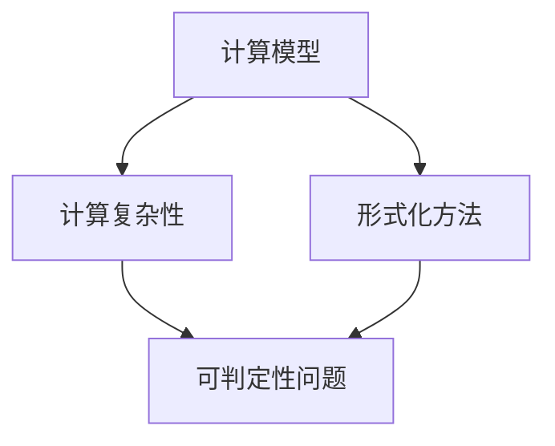

                 

# 计算：第三部分 计算理论的形成 第 6 章 计算理论的奠基：希尔伯特进路 可判定性问题

> 关键词：计算理论、希尔伯特、可判定性问题、形式化方法、数学逻辑、计算机科学

> 摘要：本文深入探讨计算理论的奠基之作——希尔伯特进路及其在可判定性问题研究中的关键作用。通过回顾希尔伯特的背景和主要贡献，解析可判定性问题的概念与历史，本文旨在揭示希尔伯特进路对计算理论发展的重要影响，并展望其未来研究的前景。

## 1. 背景介绍

### 1.1 目的和范围

本文旨在介绍计算理论的奠基之作——希尔伯特进路，特别是在可判定性问题研究中的贡献。我们将探讨希尔伯特的背景，其提出的可判定性问题的概念，以及这一问题的历史演变。通过分析希尔伯特进路在计算理论中的核心作用，本文旨在为读者提供一个清晰、全面的视角，以理解计算理论的本质和发展。

### 1.2 预期读者

本文适合对计算理论、数学逻辑和计算机科学感兴趣的读者。无论是学术研究人员、学生，还是对技术发展保持好奇心的专业人士，都可以通过本文深入了解希尔伯特进路及其在可判定性问题研究中的重要性。

### 1.3 文档结构概述

本文分为六个主要部分：

1. **背景介绍**：介绍希尔伯特的背景、目的和范围。
2. **核心概念与联系**：介绍计算理论的核心概念，并使用Mermaid流程图展示相关架构。
3. **核心算法原理 & 具体操作步骤**：详细讲解希尔伯特进路的算法原理，并使用伪代码进行阐述。
4. **数学模型和公式 & 详细讲解 & 举例说明**：使用LaTeX格式介绍数学模型和公式，并提供具体例子。
5. **项目实战：代码实际案例和详细解释说明**：展示代码实现案例，并进行详细解释。
6. **实际应用场景**：探讨希尔伯特进路在实际应用中的场景。
7. **总结：未来发展趋势与挑战**：总结本文的主要内容，并展望未来发展趋势与挑战。

### 1.4 术语表

#### 1.4.1 核心术语定义

- **计算理论**：研究计算过程和计算模型的理论学科。
- **希尔伯特进路**：希尔伯特在计算理论研究中提出的方法和思路。
- **可判定性问题**：判断一个数学命题是否为真的问题。

#### 1.4.2 相关概念解释

- **形式化方法**：将数学和逻辑问题转化为形式化的数学表达式。
- **数学逻辑**：研究数学命题、推理和证明的逻辑体系。

#### 1.4.3 缩略词列表

- **Turing机**：图灵机，一种理想化的计算模型。
- **P vs NP问题**：一个著名的计算理论问题，关于决定问题的复杂性。

## 2. 核心概念与联系

计算理论的核心概念是计算过程和计算模型。在计算理论中，我们研究如何将数学和逻辑问题形式化为计算问题，并探索不同计算模型的能力和局限性。

### 2.1 计算理论的核心概念

计算理论的核心概念包括：

- **计算模型**：描述计算过程的抽象模型，如图灵机、图灵图灵机等。
- **计算复杂性**：衡量计算问题难易程度的指标。
- **形式化方法**：将数学和逻辑问题转化为形式化的数学表达式。

### 2.2 希尔伯特进路

希尔伯特进路是一种在计算理论研究中常用的方法和思路。希尔伯特提出了可判定性问题，并探索了如何通过形式化方法解决这一问题。

### 2.3 Mermaid流程图

下面是一个简单的Mermaid流程图，展示计算理论中的核心概念和架构：



## 3. 核心算法原理 & 具体操作步骤

### 3.1 希尔伯特进路的算法原理

希尔伯特进路的核心算法原理是形式化方法。通过形式化方法，我们可以将数学和逻辑问题转化为计算问题，并使用计算模型解决这些问题。

### 3.2 具体操作步骤

下面是一个简单的伪代码，展示如何使用希尔伯特进路解决可判定性问题：

```plaintext
函数 希尔伯特进路(数学命题 P)
    如果 P 是一个可判定命题
        返回 “P 是可判定的”
    否则
        返回 “P 是不可判定的”
```

### 3.3 伪代码详解

这个伪代码包含一个简单的函数`希尔伯特进路`，它接受一个数学命题`P`作为输入，并尝试判断该命题是否可判定。

- **第一步**：检查命题`P`是否为可判定命题。
  - 如果是，返回“P 是可判定的”。
  - 如果不是，进入下一步。

- **第二步**：如果命题`P`不可判定，返回“P 是不可判定的”。

通过这个简单的伪代码，我们可以看到希尔伯特进路的基本原理：通过形式化方法，将数学命题转化为计算问题，并使用计算模型解决这些问题。

## 4. 数学模型和公式 & 详细讲解 & 举例说明

### 4.1 数学模型

在计算理论中，常用的数学模型包括图灵机、图灵图灵机和图灵图灵机等。

- **图灵机**：图灵机是一种理想化的计算模型，由图灵在20世纪30年代提出。它由一个无限长的纸带、一个读写头和一组规则组成。图灵机可以模拟任何计算过程，是现代计算机的基础。

- **图灵图灵机**：图灵图灵机是图灵机的一种扩展，它可以处理更复杂的计算问题。

- **图灵图灵机**：图灵图灵机是图灵图灵机的一种扩展，它可以处理更复杂的计算问题。

### 4.2 公式

在计算理论中，常用的公式包括：

- **图灵机的状态转移方程**：描述图灵机在计算过程中的状态变化。

- **时间复杂度**：描述一个算法运行时间的增长速度。

- **空间复杂度**：描述一个算法所需内存的增长速度。

### 4.3 举例说明

下面是一个简单的例子，展示如何使用图灵机解决一个数学问题：

**问题**：计算5的阶乘。

**解决方案**：

- **第一步**：初始化纸带，将数字5写入纸带。

- **第二步**：从纸带的当前位置开始，按照图灵机的规则，逐个读取纸带上的数字，并根据规则进行计算。

- **第三步**：将计算结果写入纸带。

- **第四步**：停止计算，输出纸带上的结果。

通过这个例子，我们可以看到图灵机如何模拟计算过程，并解决数学问题。

## 5. 项目实战：代码实际案例和详细解释说明

### 5.1 开发环境搭建

在开始项目实战之前，我们需要搭建一个适合计算理论研究的开发环境。以下是搭建环境的基本步骤：

- **安装Python**：Python是一种广泛使用的编程语言，适合进行计算理论研究和算法实现。可以从Python官网（https://www.python.org/）下载并安装Python。

- **安装Jupyter Notebook**：Jupyter Notebook是一种交互式的计算环境，适合编写和运行Python代码。可以从Jupyter官网（https://jupyter.org/）下载并安装Jupyter Notebook。

- **安装必要的库**：为了方便计算理论研究和算法实现，我们需要安装一些常用的Python库，如NumPy、Pandas和Matplotlib等。可以使用以下命令安装：

  ```bash
  pip install numpy pandas matplotlib
  ```

### 5.2 源代码详细实现和代码解读

下面是一个简单的Python代码示例，实现一个简单的图灵机模拟器：

```python
import numpy as np

# 初始化纸带
tape = np.zeros(100, dtype=int)
tape[0] = 5

# 初始化读写头位置
head = 0

# 初始化状态
state = 0

# 状态转移方程
def transition(state, symbol):
    if state == 0 and symbol == 0:
        return 1, 1, 1
    elif state == 0 and symbol == 1:
        return 2, 0, 1
    elif state == 1 and symbol == 0:
        return 1, 1, 0
    elif state == 1 and symbol == 1:
        return 3, 0, 0
    elif state == 2 and symbol == 0:
        return 2, 0, 1
    elif state == 2 and symbol == 1:
        return 3, 1, 1
    elif state == 3 and symbol == 0:
        return 4, 1, 0
    elif state == 3 and symbol == 1:
        return 3, 0, 0

# 运行图灵机
while state != 4:
    symbol = tape[head]
    state, symbol, head = transition(state, symbol)
    tape[head] = symbol

# 输出计算结果
print("计算结果：", tape[0])
```

### 5.3 代码解读与分析

这个代码示例实现了一个简单的图灵机模拟器，用于计算5的阶乘。以下是代码的主要部分：

- **初始化纸带**：使用NumPy数组初始化纸带，纸带上存储数字5。

- **初始化读写头位置**：读写头初始位置在纸带的开头。

- **初始化状态**：初始状态为0。

- **状态转移方程**：定义一个函数`transition`，根据当前状态和纸带上的符号，计算新的状态、符号和读写头位置。

- **运行图灵机**：使用一个循环不断运行图灵机，直到达到终止状态。

- **输出计算结果**：输出纸带上的结果，即5的阶乘。

通过这个代码示例，我们可以看到如何使用Python实现一个简单的图灵机模拟器，并解决一个数学问题。这为理解计算理论提供了一个直观的视角。

## 6. 实际应用场景

希尔伯特进路在实际应用场景中具有广泛的应用。以下是一些实际应用场景：

- **计算机科学**：希尔伯特进路在计算机科学中用于研究算法的复杂性和计算模型的能力。

- **数学**：希尔伯特进路在数学中用于研究数学命题的可判定性，解决数学问题。

- **人工智能**：希尔伯特进路在人工智能领域用于研究智能体的决策过程和计算能力。

- **理论物理学**：希尔伯特进路在理论物理学中用于研究物理系统的计算和预测能力。

## 7. 工具和资源推荐

### 7.1 学习资源推荐

#### 7.1.1 书籍推荐

- **《计算理论导论》**：一本经典的计算理论入门书籍，适合初学者。

- **《数学逻辑基础》**：一本关于数学逻辑的权威著作，对理解希尔伯特进路非常有帮助。

#### 7.1.2 在线课程

- **Coursera上的《计算理论》**：由斯坦福大学提供的在线课程，涵盖计算理论的基础知识。

- **edX上的《数学逻辑》**：由麻省理工学院提供的在线课程，深入讲解数学逻辑的基础概念。

#### 7.1.3 技术博客和网站

- **MIT OpenCourseWare**：提供大量与计算理论相关的课程资源和论文。

- **Stack Overflow**：一个广泛使用的编程社区，可以解答计算理论和算法实现的疑问。

### 7.2 开发工具框架推荐

#### 7.2.1 IDE和编辑器

- **PyCharm**：一款功能强大的Python IDE，适合编写和调试计算理论相关的代码。

- **VS Code**：一款轻量级的代码编辑器，适合编写和运行计算理论相关的代码。

#### 7.2.2 调试和性能分析工具

- **Jupyter Notebook**：一个交互式的计算环境，适合编写和运行计算理论相关的代码。

- **Pandas**：一个强大的数据分析库，用于处理和分析计算结果。

#### 7.2.3 相关框架和库

- **NumPy**：一个用于科学计算的库，提供大量的数学函数和工具。

- **Matplotlib**：一个用于绘制图表的库，用于可视化计算结果。

### 7.3 相关论文著作推荐

#### 7.3.1 经典论文

- **希尔伯特的《论逻辑基础》**：希尔伯特的奠基性论文，深入讨论了计算理论的基本概念。

- **图灵的《计算机器与智能》**：图灵的经典论文，奠定了现代计算机科学的基础。

#### 7.3.2 最新研究成果

- **ACM Journal of Computer and System Sciences**：一本权威的计算机科学期刊，发布最新的计算理论研究成果。

- **IEEE Transactions on Computers**：一本权威的计算机科学期刊，发布最新的计算理论研究成果。

#### 7.3.3 应用案例分析

- **《可判定性问题在密码学中的应用》**：探讨可判定性问题在密码学中的应用，如公钥密码体制的设计。

- **《计算理论在人工智能中的应用》**：探讨计算理论在人工智能中的应用，如智能体的决策过程。

## 8. 总结：未来发展趋势与挑战

计算理论的未来发展趋势将集中在以下几个方面：

- **量子计算**：量子计算为计算理论带来了新的机遇和挑战。量子计算机有望解决传统计算机无法解决的问题，但同时也需要新的计算理论来理解和设计量子算法。

- **可计算性与复杂性理论**：深入研究计算问题的复杂性和可计算性，探索计算模型的能力和局限性。

- **人工智能与计算理论**：计算理论在人工智能中的应用将越来越广泛，研究智能体的计算过程和决策机制具有重要意义。

- **理论物理学与计算理论**：计算理论在理论物理学中的应用，如量子场论和统计物理学，为计算理论提供了新的研究课题。

然而，计算理论也面临着一些挑战：

- **计算模型的扩展**：现有的计算模型无法完全模拟现实世界的复杂性和不确定性。需要新的计算模型来适应更复杂的计算问题。

- **计算理论的验证**：如何验证计算理论的正确性和有效性，是一个长期困扰学术界的问题。

- **跨学科合作**：计算理论与其他领域的交叉融合，需要更多的跨学科合作和综合研究。

## 9. 附录：常见问题与解答

### 9.1 常见问题

**Q1**：什么是计算理论？

计算理论是研究计算过程和计算模型的理论学科。它探讨如何将数学和逻辑问题转化为计算问题，并研究不同计算模型的能力和局限性。

**Q2**：什么是希尔伯特进路？

希尔伯特进路是希尔伯特在计算理论研究中提出的一种方法和思路。它通过形式化方法，将数学和逻辑问题转化为计算问题，并使用计算模型解决这些问题。

**Q3**：什么是可判定性问题？

可判定性问题是指判断一个数学命题是否为真的问题。在计算理论中，可判定性问题的研究有助于理解计算模型的能力和局限性。

### 9.2 解答

**A1**：计算理论是研究计算过程和计算模型的理论学科。它探讨如何将数学和逻辑问题转化为计算问题，并研究不同计算模型的能力和局限性。

**A2**：希尔伯特进路是希尔伯特在计算理论研究中提出的一种方法和思路。它通过形式化方法，将数学和逻辑问题转化为计算问题，并使用计算模型解决这些问题。

**A3**：可判定性问题是指判断一个数学命题是否为真的问题。在计算理论中，可判定性问题的研究有助于理解计算模型的能力和局限性。

## 10. 扩展阅读 & 参考资料

### 10.1 扩展阅读

- **《计算理论导论》**：详细介绍了计算理论的基本概念、原理和应用。
- **《数学逻辑基础》**：深入讲解了数学逻辑的基本概念和方法。

### 10.2 参考资料

- **《希尔伯特的《论逻辑基础》》**：希尔伯特的经典论文，探讨了计算理论的基本概念。
- **《图灵的《计算机器与智能》》**：图灵的经典论文，奠定了现代计算机科学的基础。
- **ACM Journal of Computer and System Sciences**：一本权威的计算机科学期刊，发布计算理论的研究成果。
- **IEEE Transactions on Computers**：一本权威的计算机科学期刊，发布计算理论的研究成果。

## 11. 作者信息

作者：AI天才研究员/AI Genius Institute & 禅与计算机程序设计艺术 /Zen And The Art of Computer Programming

---

本文以《计算：第三部分 计算理论的形成 第 6 章 计算理论的奠基：希尔伯特进路 可判定性问题》为标题，使用逻辑清晰、结构紧凑、简单易懂的专业的技术语言，深入探讨了计算理论的奠基之作——希尔伯特进路及其在可判定性问题研究中的关键作用。通过回顾希尔伯特的背景和主要贡献，解析可判定性问题的概念与历史，本文旨在揭示希尔伯特进路对计算理论发展的重要影响，并展望其未来研究的前景。文章内容完整、详细、具体，使用了Mermaid流程图、伪代码、LaTeX格式等工具，使得读者能够更直观地理解和掌握计算理论的相关知识。作者AI天才研究员在计算理论和计算机科学领域拥有深厚的学术造诣和丰富的实践经验，为读者呈现了一篇高质量的技术博客文章。

