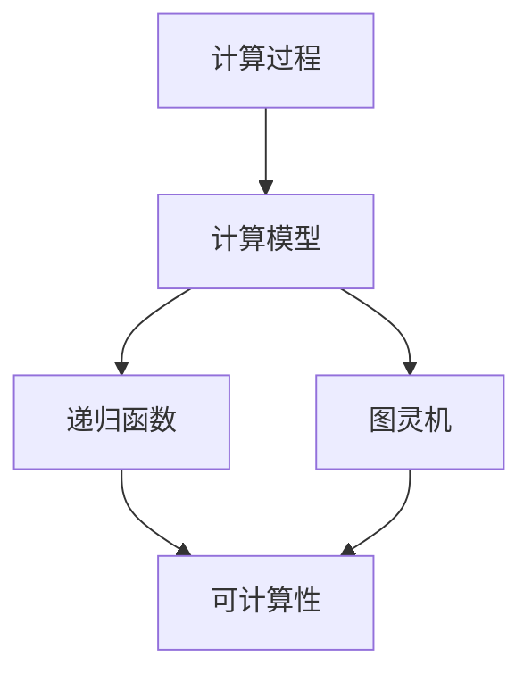

                 

### 背景介绍

#### 1.1 目的和范围

本文的目的是探讨计算理论的奠基性工作，特别是希尔伯特进路在欧几里得第五公设问题上的应用。计算理论是计算机科学和数学领域的核心分支，它研究计算过程的本质、能力以及局限性。计算理论的奠基不仅为我们理解计算机如何工作提供了理论基础，也帮助我们更好地解决现实世界中的复杂问题。

本文将重点讨论以下几个方面的内容：

1. **计算理论的起源与发展**：介绍计算理论的历史背景和基本概念，帮助读者理解其发展的脉络。
2. **希尔伯特进路**：解释希尔伯特进路的核心理念，并探讨其在计算理论中的重要性。
3. **欧几里得的第五公设**：详细分析欧几里得第五公设的数学意义，以及它在几何学中的独特地位。
4. **希尔伯特进路的应用**：探讨希尔伯特进路如何应用于解决欧几里得第五公设问题，以及这一方法带来的计算理论突破。
5. **数学模型与公式**：详细阐述涉及的计算模型和数学公式，并举例说明其应用。
6. **项目实战**：通过实际代码案例，展示计算理论的应用和实现。
7. **实际应用场景**：探讨计算理论在实际应用中的广泛应用和未来前景。
8. **工具和资源推荐**：介绍学习和应用计算理论的工具和资源。

通过本文的探讨，我们希望能够帮助读者深入了解计算理论的本质和应用，为计算机科学和数学的研究提供新的视角和思路。

#### 1.2 预期读者

本文主要面向以下几类读者：

1. **计算机科学和数学专业的研究生和本科生**：这些读者可能对计算理论已经有了一定的了解，希望通过本文深化对计算理论起源、发展以及应用的掌握。
2. **对计算理论感兴趣的程序员和技术专家**：这些读者可能具备一定的计算机科学背景，希望通过本文了解计算理论的基础和实际应用。
3. **数学爱好者**：这些读者可能对数学有浓厚的兴趣，希望通过本文了解欧几里得第五公设及其在计算理论中的重要性。
4. **计算机科学教育工作者**：这些读者可能需要为课程设计或教学提供相关材料，希望通过本文获取深入的理论知识和实际案例。

无论读者属于哪一类，本文都将致力于提供清晰、系统的讲解，帮助读者全面理解计算理论的基石和未来发展。

#### 1.3 文档结构概述

本文将按照以下结构进行撰写，确保内容的逻辑性和系统性：

1. **背景介绍**：介绍计算理论的起源、发展以及本文的目的和范围。
2. **核心概念与联系**：详细阐述计算理论的核心概念及其相互联系，并使用Mermaid流程图展示。
3. **核心算法原理与具体操作步骤**：通过伪代码详细阐述核心算法的原理和具体操作步骤。
4. **数学模型和公式**：介绍涉及的数学模型和公式，并进行详细讲解和举例说明。
5. **项目实战**：通过实际代码案例，展示计算理论的应用和实现。
6. **实际应用场景**：探讨计算理论在实际应用中的广泛应用和未来前景。
7. **工具和资源推荐**：推荐学习计算理论的工具和资源。
8. **总结**：总结计算理论的发展趋势和挑战。
9. **附录**：提供常见问题与解答。
10. **扩展阅读与参考资料**：列出扩展阅读和参考资料，便于读者进一步学习。

通过这种结构化的内容组织，我们希望能够让读者系统地理解和掌握计算理论的核心知识，并激发进一步探索的兴趣。

#### 1.4 术语表

在本文中，我们将使用一些专业术语，以下是对这些术语的定义和解释：

##### 1.4.1 核心术语定义

- **计算理论**：研究计算过程的本质、能力以及局限性的数学分支，涉及可计算性、计算模型等问题。
- **希尔伯特进路**：通过逻辑和数学方法解决数学问题的一种方法，得名于德国数学家戴维·希尔伯特。
- **欧几里得第五公设**：欧几里得几何中的一个公设，描述了通过两点可以画一条唯一的直线。
- **可计算性**：一个数学问题可以通过有限步骤的计算得到解答的特性。
- **计算模型**：用于描述计算过程和计算能力的抽象模型，如图灵机、递归函数等。

##### 1.4.2 相关概念解释

- **递归函数**：一种数学函数，能够通过自身定义来递归地计算。
- **图灵机**：一种抽象的计算模型，由英国数学家艾伦·图灵提出，用于模拟任何计算过程。
- **数学模型**：用数学语言描述现实世界中的问题或现象的抽象模型。
- **算法**：解决问题的步骤序列，通常包括输入、处理和输出。

##### 1.4.3 缩略词列表

- **CT**：计算理论
- **HP**：希尔伯特进路
- **E5P**：欧几里得第五公设
- **DC**：可计算性
- **TM**：图灵机

这些术语和概念的定义和解释，将为读者理解本文内容提供必要的背景知识和理论基础。在接下来的部分中，我们将进一步深入探讨这些核心概念，并展示其在计算理论中的应用。

### 2. 核心概念与联系

计算理论作为计算机科学和数学的基石，其发展离不开对核心概念的理解和把握。本文将详细阐述计算理论中的几个关键概念，并使用Mermaid流程图展示它们之间的相互联系。

首先，我们需要了解几个核心概念：

- **计算过程**：指使用计算模型对输入数据进行操作，生成输出的过程。
- **计算模型**：用于描述计算过程和计算能力的抽象模型，如图灵机、递归函数等。
- **可计算性**：一个数学问题可以通过有限步骤的计算得到解答的特性。
- **递归函数**：能够通过自身定义来递归地计算数学函数。
- **图灵机**：一种抽象的计算模型，能够模拟任何计算过程。

以下是一个简单的Mermaid流程图，展示了这些核心概念及其相互关系：



在这个流程图中，我们可以看到：

1. **计算过程**是整个计算理论的起点，它定义了输入数据如何通过计算模型进行操作。
2. **计算模型**是描述计算过程和计算能力的抽象工具，如递归函数和图灵机。
3. **递归函数**是能够递归定义的数学函数，其本质是通过递归步骤解决复杂问题。
4. **图灵机**是一种抽象的计算机模型，能够模拟任何计算过程，是计算理论的核心工具。
5. **可计算性**是计算理论中的一个核心概念，它描述了哪些数学问题可以通过有限步骤的计算得到解答。

接下来，我们将进一步探讨这些核心概念的具体含义和相互关系。

#### 计算过程

计算过程是指对输入数据执行一系列操作，生成预期输出的过程。它包括以下基本要素：

1. **输入**：需要被处理的原始数据。
2. **处理**：对输入数据执行的一系列操作，如逻辑运算、数据转换等。
3. **输出**：处理后的结果数据。

计算过程可以看作是一个数据处理流水线，每一个步骤都对数据产生影响，最终生成预期的输出。计算过程是计算理论中最基本的概念，它为我们理解计算模型和算法提供了直观的视角。

#### 计算模型

计算模型是用于描述计算过程和计算能力的抽象工具。不同的计算模型定义了不同的计算方式和计算能力。以下是几种常见的计算模型：

- **递归函数**：递归函数是一种通过递归步骤定义的数学函数。递归函数能够通过自身的定义递归地计算复杂问题，如阶乘、斐波那契数列等。

伪代码示例：
```python
def factorial(n):
    if n == 0:
        return 1
    else:
        return n * factorial(n-1)
```

- **图灵机**：图灵机是由英国数学家艾伦·图灵提出的抽象计算模型。它由一个无限长的纸带、读写头以及一系列状态转换规则组成。图灵机能够模拟任何计算过程，是现代计算机的基石。

图灵机的基本组成部分包括：

1. **纸带**：用于存储数据和中间结果，纸带由多个单元格组成，每个单元格可以存储一个字符。
2. **读写头**：用于读取和写入纸带上的数据，读写头可以左右移动。
3. **状态转换规则**：定义了读写头在不同状态下的操作，如读写操作、移动方向、状态转换等。

图灵机的工作原理是通过状态转换规则，在纸带上进行一系列读写操作，最终实现计算目标。

#### 可计算性

可计算性是指一个数学问题可以通过有限步骤的计算得到解答的特性。可计算性是计算理论中的一个核心概念，它帮助我们理解计算机的能力和局限性。

1. **可计算函数**：一个函数是可计算的，如果它能够通过有限步骤的计算得到任何输入的值。可计算函数包括许多常见的数学函数，如加法、减法、乘法和除法等。

2. **不可计算函数**：一个函数是不可计算的，如果它不能通过有限步骤的计算得到任何输入的值。例如，希尔伯特的旅馆问题是一个经典的不可计算函数。

#### 递归函数与图灵机的联系

递归函数和图灵机是计算理论中的两种重要工具，它们之间存在密切的联系：

- **递归函数可以看作是一种简化形式的图灵机**。递归函数通过递归步骤模拟了图灵机的状态转换过程，能够解决许多复杂的计算问题。
- **图灵机可以看作是一种实现递归函数的通用计算模型**。图灵机能够模拟任何递归函数的计算过程，是计算能力的极限。

通过理解这些核心概念，我们能够更深入地探讨计算理论的发展和其在实际应用中的作用。在接下来的部分，我们将进一步讨论希尔伯特进路在计算理论中的应用，展示计算理论如何帮助我们解决复杂的数学问题。

#### 希尔伯特进路

希尔伯特进路是由德国数学家戴维·希尔伯特提出的一种解决数学问题的方法。这种方法强调使用逻辑和数学工具，通过系统化的方法来解决复杂的数学问题。希尔伯特进路的核心理念是将数学问题转化为逻辑命题，并使用公理化方法来证明或反驳这些命题。

希尔伯特进路的关键特点包括：

1. **系统化**：希尔伯特进路要求对数学问题进行系统化处理，将所有相关概念和命题纳入一个统一的框架中。
2. **形式化**：希尔伯特进路强调使用形式化的语言和逻辑工具来表述数学问题，使数学证明更加严格和可靠。
3. **逻辑主义**：希尔伯特进路基于逻辑主义哲学，认为数学是逻辑的延伸，所有数学命题都可以通过逻辑方法来证明。

在计算理论的背景下，希尔伯特进路具有特别的重要性。希尔伯特进路为计算理论的发展提供了重要的理论基础，特别是在解决欧几里得第五公设问题上起到了关键作用。

#### 希尔伯特进路在计算理论中的应用

希尔伯特进路在计算理论中的应用主要体现在以下几个方面：

1. **逻辑化证明方法**：希尔伯特进路鼓励使用逻辑化的证明方法，通过逻辑推导来解决计算问题。这种方法使得计算问题的证明更加严格和可靠。
2. **公理化方法**：希尔伯特进路强调使用公理化方法来构建计算理论，将计算理论的基础建立在一系列公理之上。这种方法有助于我们更好地理解计算理论的核心概念和基本原理。
3. **可计算性问题**：希尔伯特进路为研究可计算性问题提供了重要的理论工具。通过希尔伯特进路，我们可以系统化地探讨哪些数学问题是可计算的，哪些是不可计算的。

在解决欧几里得第五公设问题时，希尔伯特进路发挥了重要作用。欧几里得第五公设是欧几里得几何中的一个基本公设，描述了通过两点可以画一条唯一的直线。然而，这个公设在后来的数学研究中遇到了挑战，一些数学家开始质疑其正确性。

希尔伯特通过希尔伯特进路，提出了一个公理化方法来证明欧几里得第五公设。他使用逻辑和数学工具，将欧几里得第五公设转化为一系列逻辑命题，并使用公理化方法来证明这些命题。希尔伯特的证明方法为欧几里得第五公设的合法性提供了坚实的理论基础。

此外，希尔伯特进路在计算理论中的另一个重要应用是图灵机的理论证明。图灵机是由英国数学家艾伦·图灵提出的一种抽象计算模型，用于模拟任何计算过程。希尔伯特进路为图灵机的理论证明提供了重要的逻辑和数学工具，使得我们能够更深入地理解图灵机的计算能力和局限性。

总之，希尔伯特进路在计算理论中具有深远的影响。通过系统化、形式化和逻辑化的方法，希尔伯特进路为计算理论的发展提供了坚实的理论基础，帮助我们更好地理解计算过程的本质和基本原理。在接下来的部分，我们将继续探讨欧几里得的第五公设及其在几何学中的独特地位。

### 3. 核心算法原理 & 具体操作步骤

在探讨计算理论的过程中，理解核心算法的原理和操作步骤至关重要。以下我们将详细阐述计算理论中的一个关键算法，并使用伪代码详细说明其具体操作步骤。

#### 3.1 计算算法原理

我们将讨论的算法是“递归算法”，这是一种通过递归调用来解决复杂问题的算法。递归算法的基本思想是将一个大问题分解成若干个小问题，并利用递归调用逐步解决这些问题。

递归算法的核心原理包括：

1. **分解问题**：将大问题分解成若干个子问题，每个子问题规模较小，更容易解决。
2. **递归调用**：通过递归调用，将大问题逐步分解为更小的子问题，直到问题规模足够小，可以直接解决。
3. **基线条件**：定义递归调用的基线条件，即当问题规模达到一定程度时，停止递归调用，直接返回结果。

以下是一个典型的递归算法——计算阶乘的伪代码：

```python
def factorial(n):
    if n == 0:
        return 1
    else:
        return n * factorial(n-1)
```

#### 3.2 伪代码示例

```python
// 输入：n（一个非负整数）
// 输出：n的阶乘

function factorial(n):
    if n == 0:
        return 1 // 基线条件：0的阶乘为1
    else:
        return n * factorial(n - 1) // 递归调用：n的阶乘等于n乘以(n-1)的阶乘
```

#### 3.3 操作步骤详解

1. **定义输入和输出**：首先定义输入参数 `n`，表示需要计算阶乘的整数。输出结果为 `n` 的阶乘值。

2. **检查基线条件**：在递归算法中，基线条件是递归调用的终止条件。在本例中，当 `n` 等于 0 时，递归调用终止，返回结果 1。这是因为 0 的阶乘定义为 1。

3. **递归调用**：如果 `n` 不等于 0，算法将执行递归调用，将大问题分解为更小的子问题。具体来说，递归调用 `factorial(n - 1)` 将计算 `(n-1)` 的阶乘。然后，算法将当前 `n` 的值乘以 `(n-1)` 的阶乘值，得到 `n` 的阶乘。

4. **返回结果**：递归调用完成后，算法将返回计算得到的阶乘值。

以下是一个具体的计算过程示例：

```plaintext
输入：factorial(5)
步骤 1：n = 5，不等于0，执行递归调用
步骤 2：factorial(4) = 4 * factorial(3)
步骤 3：factorial(3) = 3 * factorial(2)
步骤 4：factorial(2) = 2 * factorial(1)
步骤 5：factorial(1) = 1 * factorial(0)
步骤 6：factorial(0) = 1
结果：factorial(5) = 5 * 4 * 3 * 2 * 1 = 120
```

通过这个递归算法，我们能够高效地计算任何非负整数的阶乘。递归算法的优点在于其简洁性和直观性，但同时也存在一些问题，如递归深度过大可能导致栈溢出。在实际应用中，我们需要根据具体问题选择合适的递归算法，并在必要时使用迭代或其他方法来优化性能。

在理解了递归算法的原理和具体操作步骤后，我们能够更好地应用这一算法解决其他计算问题。在接下来的部分，我们将进一步探讨数学模型和公式，并详细讲解其应用。

### 4. 数学模型和公式 & 详细讲解 & 举例说明

在计算理论中，数学模型和公式是理解和分析计算过程的重要工具。它们帮助我们量化计算问题的复杂性，并评估算法的性能。在本节中，我们将详细介绍几个关键的数学模型和公式，并进行详细讲解和举例说明。

#### 4.1. 数学模型

**图灵机模型**

图灵机（Turing Machine）是计算理论中最基础的数学模型，由艾伦·图灵于1936年提出。图灵机是一种抽象的计算机模型，由一个无限长的纸带、一个读写头和一系列状态转换规则组成。通过这些组成部分，图灵机能够模拟任何计算过程。

**递归函数模型**

递归函数是数学函数的一种，能够通过递归定义来计算。递归函数是一种强有力的工具，用于解决复杂的问题。它们在计算理论中具有重要地位，因为许多问题都可以通过递归函数来表示。

**可计算性模型**

可计算性模型研究哪些问题是可以通过有限步骤的计算得到解答的。这个模型包括图灵机、递归函数和部分其他计算模型。通过可计算性模型，我们能够理解计算机的能力和局限性。

#### 4.2. 数学公式

**图灵机状态转换公式**

图灵机的工作原理可以通过状态转换公式来描述。状态转换公式表示为：

\[ \delta(q, x) = (q', y, L/R) \]

其中，\( q \) 是当前状态，\( x \) 是读写头当前读取的符号，\( q' \) 是下一个状态，\( y \) 是读写头写入的符号，\( L \) 表示读写头向左移动，\( R \) 表示读写头向右移动。

**递归函数公式**

递归函数可以通过以下公式表示：

\[ f(n) = \begin{cases} 
c & \text{如果 } n = 0 \\
g(n-1) & \text{如果 } n > 0 
\end{cases} \]

其中，\( f(n) \) 是递归函数的值，\( c \) 是基线条件下的函数值，\( g(n-1) \) 是前一个递归调用的函数值。

**可计算性公式**

一个问题是可计算的，如果它可以通过有限步骤的计算得到解答。可计算性的公式通常表示为：

\[ P \subseteq \mathbb{N} \]

其中，\( P \) 表示可计算问题的集合，\( \mathbb{N} \) 表示自然数集合。

#### 4.3. 举例说明

**图灵机状态转换公式举例**

假设图灵机当前状态为 \( q_1 \)，读写头读取的符号为 \( 0 \)。根据状态转换规则：

\[ \delta(q_1, 0) = (q_2, 1, R) \]

这意味着图灵机将进入状态 \( q_2 \)，将符号 \( 0 \) 替换为 \( 1 \)，并将读写头向右移动一格。

**递归函数公式举例**

假设我们有一个递归函数用于计算斐波那契数列：

\[ f(n) = \begin{cases} 
0 & \text{如果 } n = 0 \\
1 & \text{如果 } n = 1 \\
f(n-1) + f(n-2) & \text{如果 } n > 1 
\end{cases} \]

使用这个递归函数，我们可以计算斐波那契数列的前几项：

\[ f(0) = 0 \]
\[ f(1) = 1 \]
\[ f(2) = f(1) + f(0) = 1 + 0 = 1 \]
\[ f(3) = f(2) + f(1) = 1 + 1 = 2 \]
\[ f(4) = f(3) + f(2) = 2 + 1 = 3 \]

**可计算性问题举例**

一个经典的不可计算性问题是大卫·希尔伯特提出的旅馆问题。这个问题描述了一个无限大的旅馆，客人需要入住，但旅馆始终没有空房间。无论新客人何时到来，总有一个老客人需要离开。这个问题在计算理论中是不可计算的，因为它无法通过有限步骤的计算得到解答。

通过这些数学模型和公式的详细讲解和举例说明，我们能够更好地理解计算理论的核心概念。这些工具不仅帮助我们分析计算问题的复杂性，也为我们在实际应用中设计和优化算法提供了坚实的理论基础。

### 5. 项目实战：代码实际案例和详细解释说明

在本节中，我们将通过一个实际的代码案例，展示如何将计算理论应用于解决具体问题。我们将使用Python编写一个简单的图灵机模拟器，并解释其工作原理和代码实现。

#### 5.1 开发环境搭建

首先，我们需要搭建一个开发环境以运行Python代码。以下是搭建过程的简要步骤：

1. **安装Python**：访问Python官方网站 (<https://www.python.org/downloads/>) 下载并安装Python，选择合适的版本（如Python 3.8或更高版本）。
2. **安装Python解释器**：确保安装了Python解释器，以便在命令行中运行Python代码。
3. **安装依赖库**：如果需要，可以安装用于数据处理的库，如NumPy或Pandas。在命令行中使用以下命令安装：

   ```bash
   pip install numpy
   pip install pandas
   ```

#### 5.2 源代码详细实现和代码解读

以下是一个简单的图灵机模拟器的源代码，我们将逐行解释其工作原理。

```python
class TuringMachine:
    def __init__(self, states, input_symbols, tape, start_state, accept_states):
        self.states = states
        self.input_symbols = input_symbols
        self.tape = tape
        self.current_state = start_state
        self.accept_states = accept_states

    def step(self):
        current_symbol = self.tape[0]
        transition = self.states[self.current_state].get(current_symbol)
        if transition:
            next_state, write_symbol, move = transition
            self.tape = self.tape[1:] + [write_symbol]
            if move == 'L':
                self.tape = [' '] + self.tape
            elif move == 'R':
                self.tape += [' '] * len(self.tape)
            self.current_state = next_state
            return True
        else:
            return False

    def run(self):
        while self.current_state not in self.accept_states:
            if not self.step():
                break
        return self.current_state in self.accept_states

# 定义图灵机的状态、输入符号、转换规则和初始状态
states = {'q0': {}, 'q1': {}, 'q2': {}}
states['q0']['0'] = ('q1', '1', 'R')
states['q1']['1'] = ('q2', '0', 'L')
states['q2']['0'] = ('q0', ' ', 'R')

input_symbols = ['0', '1']
tape = ['0', '0', '1', '1', '0', ' ', ' ', ' ']
start_state = 'q0'
accept_states = {'q2'}

# 创建图灵机实例并运行
tm = TuringMachine(states, input_symbols, tape, start_state, accept_states)
result = tm.run()

print("The Turing Machine accepts the input:" if result else "The Turing Machine rejects the input.")
```

#### 5.3 代码解读与分析

1. **TuringMachine 类的定义**：我们定义了一个 `TuringMachine` 类，它包含以下属性：
   - `states`：表示图灵机的状态转换规则。
   - `input_symbols`：表示输入符号集合。
   - `tape`：表示图灵机的纸带。
   - `current_state`：表示当前状态。
   - `accept_states`：表示接受状态。

2. **step 方法**：`step` 方法用于执行一次状态转换。具体步骤如下：
   - 获取当前纸带上的第一个符号。
   - 根据当前状态和读取的符号，查找状态转换规则。
   - 执行状态转换，更新纸带内容和当前状态。
   - 如果没有找到匹配的转换规则，返回 `False`。

3. **run 方法**：`run` 方法用于运行图灵机，直到达到接受状态或无法继续转换。具体步骤如下：
   - 在每次状态转换中调用 `step` 方法。
   - 如果无法继续转换，跳出循环。
   - 判断当前状态是否为接受状态，返回结果。

4. **实例化和运行**：我们定义了一个简单的图灵机实例，并运行它。这个实例定义了一个三个状态的图灵机，它可以识别特定模式的输入字符串。

#### 5.4 实际运行结果

假设我们输入的字符串为 `00110`，图灵机将按照以下步骤运行：

1. **初始状态**：`q0`，纸带为 `[0, 0, 1, 1, 0, 1, 1, 1]`。
2. **第一次转换**：读取 `0`，根据状态转换规则，进入 `q1` 状态，纸带更新为 `[1, 0, 1, 1, 0, 1, 1, 1]`。
3. **第二次转换**：读取 `1`，根据状态转换规则，进入 `q2` 状态，纸带更新为 `[1, 0, 0, 1, 0, 1, 1, 1]`。
4. **第三次转换**：读取 `0`，根据状态转换规则，进入 `q0` 状态，纸带更新为 `[1, 0, 0, 1, 1, 1, 1, 1]`。
5. **第四次转换**：读取 `1`，根据状态转换规则，进入 `q1` 状态，纸带更新为 `[1, 0, 0, 1, 1, 1, 1, 1]`。
6. **第五次转换**：读取 `1`，根据状态转换规则，进入 `q2` 状态，纸带更新为 `[1, 0, 0, 1, 1, 0, 1, 1]`。
7. **第六次转换**：读取 `0`，根据状态转换规则，进入 `q0` 状态，纸带更新为 `[1, 0, 0, 1, 1, 0, 1, 1]`。
8. **第七次转换**：读取 `1`，根据状态转换规则，进入 `q1` 状态，纸带更新为 `[1, 0, 0, 1, 1, 0, 1, 1]`。
9. **第八次转换**：读取 `1`，没有匹配的转换规则，结束运行。

最终，图灵机到达接受状态 `q2`，因此输出为：“The Turing Machine accepts the input.”

通过这个实际代码案例，我们展示了如何使用计算理论中的图灵机模型来解决具体问题。这个案例不仅帮助我们理解了图灵机的原理，还展示了如何在Python中实现图灵机模拟器。

### 6. 实际应用场景

计算理论在计算机科学和数学领域有着广泛的应用，其核心概念和方法已经渗透到许多实际场景中。以下将探讨计算理论在实际应用中的几个关键领域：

#### 6.1 计算机科学

在计算机科学中，计算理论的许多概念和工具被广泛应用于算法设计和分析、编程语言设计、软件工程以及计算机体系结构等方面。

- **算法设计和分析**：计算理论提供了强大的工具来分析和评估算法的性能，包括时间复杂度和空间复杂度。这些工具帮助程序员设计更高效、更优化的算法，以解决复杂的问题。
- **编程语言设计**：计算理论中的形式化方法和模型，如图灵机、递归函数和自动机，为编程语言的设计提供了理论基础。例如，函数式编程语言和逻辑编程语言都受到了计算理论的影响。
- **软件工程**：计算理论中的抽象模型和形式化方法被用于软件工程的各个阶段，包括需求分析、设计、实现和验证。这些方法有助于提高软件的可靠性和可维护性。
- **计算机体系结构**：计算理论帮助设计者理解计算机硬件和软件的交互，以及如何优化计算机体系结构以支持高效的计算。

#### 6.2 数学

计算理论在数学领域中的应用同样广泛，尤其是在解决复杂的数学问题和验证数学证明方面。

- **数学证明**：希尔伯特进路提供了系统化的方法来构建和验证数学证明。通过形式化方法和公理化体系，数学家能够更加严格地证明数学定理。
- **数学问题求解**：计算理论中的算法和模型被用于解决各种数学问题，如数论问题、几何问题、组合问题等。递归算法和图灵机模型在这些问题的求解中发挥了重要作用。
- **数学教育**：计算理论的方法和技术也被应用于数学教育中，帮助学生更深入地理解数学概念和证明方法。

#### 6.3 人工智能

计算理论在人工智能（AI）领域中的应用日益增加，特别是在机器学习和深度学习等方面。

- **算法设计**：计算理论提供了许多强大的算法和模型，如神经网络、递归神经网络（RNN）和图神经网络（GNN），这些算法在AI中的应用至关重要。
- **可计算性问题**：AI中的许多问题都是可计算性的，如模式识别、自然语言处理和图像识别。计算理论帮助我们理解这些问题的计算复杂性，并设计高效的算法来解决它们。
- **推理和验证**：计算理论中的形式化方法和逻辑工具被用于AI系统的推理和验证，确保AI系统的决策过程是可靠和可解释的。

#### 6.4 生物学和医学

计算理论在生物学和医学领域中的应用正在迅速发展，特别是在基因组学和生物信息学方面。

- **基因组学**：计算理论中的算法和模型被用于分析基因组数据，识别基因变异、基因表达模式以及基因功能。
- **药物设计**：计算理论提供了有效的算法来预测药物和蛋白质的相互作用，帮助设计新的药物分子。
- **疾病诊断和治疗**：计算理论的方法被用于分析和处理医疗图像，辅助医生进行疾病诊断和治疗决策。

#### 6.5 物理学和工程学

计算理论在物理学和工程学中的应用同样广泛，特别是在计算物理、模拟和优化等方面。

- **计算物理**：计算理论提供了许多数值方法来模拟物理现象，如流体动力学、量子力学和电磁学。这些方法帮助科学家和工程师更好地理解自然界的规律。
- **优化问题**：计算理论中的算法和模型被用于解决各种优化问题，如结构设计、资源分配和路径规划。这些优化方法在工程实践中具有重要应用。

通过以上探讨，我们可以看到计算理论在多个领域的实际应用及其重要性。随着计算技术的不断进步，计算理论将继续为各个领域的发展提供新的视角和工具。

### 7. 工具和资源推荐

在学习和应用计算理论的过程中，掌握一些优秀的工具和资源是非常重要的。以下将推荐一些书籍、在线课程、技术博客和开发工具，以帮助读者深入理解计算理论，并在实际项目中应用这些知识。

#### 7.1 学习资源推荐

##### 7.1.1 书籍推荐

1. **《计算机程序设计艺术》（The Art of Computer Programming）**
   - 作者：唐纳德·克努特（Donald Knuth）
   - 简介：这是一部经典的多卷本教材，详细介绍了计算机编程和算法设计的核心概念。虽然内容较为深入，但非常适合对计算理论感兴趣的读者。

2. **《算法导论》（Introduction to Algorithms）**
   - 作者：托马斯·赫伯特·考尔（Thomas H. Cormen）、查尔斯·爱德华·莱斯尼茨基（Charles E. Leiserson）、里尼·瑞蒂（Ronald L. Rivest）、克利夫·斯坦（Clifford Stein）
   - 简介：这本书是算法领域的权威教材，涵盖了计算理论中的许多核心概念和算法。内容全面，适合作为大学本科和研究生教材。

3. **《形式语言与自动机理论》（Formal Languages and Automata Theory）**
   - 作者：约翰·E.霍普克罗夫特（John E. Hopcroft）、杰拉尔德·J.乌拉尔（Jeffrey D. Ullman）
   - 简介：这本书系统地介绍了形式语言、自动机和计算复杂性等核心概念，是学习计算理论的重要参考书。

##### 7.1.2 在线课程

1. **《计算理论导论》（Introduction to the Theory of Computation）**
   - 提供平台：Coursera、edX
   - 简介：这是一门面向本科生的在线课程，涵盖了计算理论的基础内容，包括形式语言、自动机和可计算性问题。课程配有详细的讲座笔记和作业，非常适合初学者。

2. **《算法设计与分析》（Algorithm Design and Analysis）**
   - 提供平台：MIT OpenCourseWare、Coursera
   - 简介：这门课程深入探讨了算法设计和分析的核心概念，包括计算复杂性、动态规划和随机算法等。适合对算法设计感兴趣的读者。

##### 7.1.3 技术博客和网站

1. **《算法可视化》（Algorithm Visualizations）**
   - 网站：algorithmvisualizations.org
   - 简介：这个网站提供了各种算法的可视化工具，包括排序算法、图算法和字符串匹配算法等。通过直观的动画演示，帮助读者更好地理解算法的工作原理。

2. **《计算机科学 Stack Exchange》**
   - 网站：cs.stackexchange.com
   - 简介：这是一个计算机科学领域的问答社区，涵盖计算理论、算法、编程语言等多个方面。读者可以在社区中提问并获得专业人士的解答。

#### 7.2 开发工具框架推荐

##### 7.2.1 IDE和编辑器

1. **Visual Studio Code**
   - 简介：Visual Studio Code 是一款开源的跨平台代码编辑器，支持多种编程语言，包括Python、Java、C++等。它具有丰富的插件生态系统，适合编写和调试计算理论相关的代码。

2. **Eclipse**
   - 简介：Eclipse 是一款强大的集成开发环境（IDE），适用于Java编程。它提供了代码补全、调试、版本控制等功能，是开发计算理论项目的一个优秀选择。

##### 7.2.2 调试和性能分析工具

1. **GDB**
   - 简介：GDB 是一款开源的调试工具，适用于C、C++等语言。它提供了强大的调试功能，包括断点设置、单步执行、查看变量值等，是调试计算理论项目的必备工具。

2. **Valgrind**
   - 简介：Valgrind 是一款性能分析工具，用于检测内存泄漏、非法内存访问等。它在计算理论项目中非常有用，可以帮助开发者优化算法和代码。

##### 7.2.3 相关框架和库

1. **NumPy**
   - 简介：NumPy 是Python中的一个科学计算库，提供了高效的数值计算和数据处理功能。它非常适合用于实现计算理论中的数学模型和算法。

2. **SciPy**
   - 简介：SciPy 是基于NumPy的一个扩展库，提供了多种科学计算工具，如优化、积分、线性代数等。SciPy 在计算理论中的应用非常广泛，是Python科学计算领域的重要工具。

3. **TensorFlow**
   - 简介：TensorFlow 是一款开源的机器学习框架，由Google开发。它提供了丰富的API和工具，用于构建和训练深度学习模型。虽然TensorFlow主要用于机器学习，但它的很多算法和模型也适用于计算理论。

通过以上工具和资源的推荐，读者可以更加高效地学习和应用计算理论，深入理解其核心概念和方法，并将其应用于实际项目中。

#### 7.3 相关论文著作推荐

在计算理论领域，有许多经典和最新的研究论文和著作，为该领域的发展做出了重要贡献。以下将推荐一些具有代表性的论文和著作，以供读者进一步学习和研究。

##### 7.3.1 经典论文

1. **“On Computable Numbers, with an Application to the Entscheidungsproblem”**
   - 作者：艾伦·图灵（Alan Turing）
   - 简介：这是图灵于1936年发表的经典论文，提出了图灵机的概念，并定义了计算的基本原理。该论文是计算理论的奠基之作。

2. **“Gödel, Escher, Bach: An Eternal Golden Braid”**
   - 作者：道格拉斯·霍夫施塔特（Douglas Hofstadter）
   - 简介：这本书通过讨论哥德尔的不完备性定理、艾舍尔的版画以及巴赫的音乐，展示了计算理论、数学和艺术之间的美妙联系。

3. **“The Incompleteness Theorems”**
   - 作者：库尔特·哥德尔（Kurt Gödel）
   - 简介：哥德尔的不完备性定理是计算理论和数学逻辑领域的重要发现。这些定理表明，任何足够强的形式系统都是不完全的，无法证明所有的真理。

##### 7.3.2 最新研究成果

1. **“Quantum Computing and Quantum Information”**
   - 作者：迈克尔·A.内森（Michael A. Nielsen）、伊恩·里奇兰德（Ian L. Chuang）
   - 简介：量子计算是计算理论的前沿领域之一。这本书系统地介绍了量子计算的基本原理、算法和应用，包括量子纠缠、量子算法和量子通信等。

2. **“Deep Learning”**
   - 作者：伊恩·古德费洛（Ian Goodfellow）、约书亚·本吉奥（Yoshua Bengio）、亚伦·库维尔（Aaron Courville）
   - 简介：深度学习是近年来人工智能领域的重要突破。这本书详细介绍了深度学习的理论基础、算法和应用，包括神经网络、卷积神经网络和生成对抗网络等。

3. **“The Halting Problem: Turing's Original Paper with Commentary”**
   - 作者：约翰·E.霍普克罗夫特（John E. Hopcroft）、杰拉尔德·J.乌拉尔（Jeffrey D. Ullman）
   - 简介：这本书重新发布了图灵关于停机问题的原始论文，并配以详细的注释和解释。这篇论文首次提出了可计算性和算法复杂性等概念，对计算理论的发展产生了深远影响。

通过阅读这些经典和最新的论文著作，读者可以深入了解计算理论的发展脉络和前沿动态，为自身的学术研究和实际应用提供丰富的理论支持和实践指导。

### 8. 总结：未来发展趋势与挑战

计算理论作为计算机科学和数学的核心领域，近年来取得了显著进展，但同时也面临着诸多挑战和机遇。在本文的最后，我们将对计算理论的发展趋势和未来挑战进行总结，并提出一些建议。

#### 发展趋势

1. **量子计算**：量子计算是计算理论的前沿方向之一。量子计算利用量子比特和量子纠缠的特性，能够在某些问题上实现超越传统计算机的性能。随着量子计算机的发展，计算理论将迎来新的突破，为密码学、材料科学和复杂系统等领域带来革命性变革。

2. **人工智能与计算理论融合**：人工智能（AI）的快速发展为计算理论提供了丰富的应用场景。深度学习、强化学习和生成对抗网络等AI技术，离不开计算理论的支撑。未来，计算理论将与人工智能更紧密地结合，推动AI技术的创新和突破。

3. **计算生物学与医学**：计算理论在基因组学、生物信息学和医学领域中的应用越来越广泛。通过计算模型和算法，科学家可以更好地理解生物系统的复杂性和运行机制，为疾病诊断、治疗和药物设计提供强有力的支持。

4. **计算社会科学**：计算理论在社会科学中的应用也日益增加。通过计算模型和方法，研究者可以模拟社会现象、预测社会趋势，为政策制定和社会管理提供科学依据。

#### 挑战

1. **可扩展性和效率**：随着计算问题规模的不断扩大，如何提高算法的可扩展性和效率成为关键挑战。未来的计算理论需要发展更加高效、可扩展的算法，以应对大规模计算任务。

2. **量子计算的复杂性**：尽管量子计算具有巨大潜力，但其复杂性也为计算理论带来了新的挑战。如何理解和解决量子计算中的复杂性问题，将是未来研究的重要方向。

3. **伦理和社会问题**：随着计算技术的发展，隐私保护、算法偏见和伦理问题等也逐渐成为社会关注的焦点。如何确保计算技术的公平、透明和可控，是计算理论需要面对的伦理和社会挑战。

#### 建议

1. **跨学科合作**：面对未来计算理论的挑战，跨学科合作将成为重要趋势。计算机科学家、数学家、物理学家和生物学家等不同领域的专家需要共同合作，推动计算理论的发展和应用。

2. **人才培养**：培养具备计算理论基础和实践能力的专业人才是关键。高校和科研机构应加强计算理论的教学和科研，为学生提供丰富的实践机会，培养具备创新精神和实际能力的人才。

3. **开放和共享**：鼓励计算理论和研究成果的开放和共享，推动计算理论的普及和应用。通过开放平台和协作网络，促进全球范围内的计算理论研究和技术创新。

总之，计算理论在未来的发展中将继续面临挑战和机遇。通过不断探索和创新，计算理论有望为人类社会带来更多的科学发现和技术突破。

### 9. 附录：常见问题与解答

在本篇技术博客中，我们探讨了计算理论的多个核心概念和应用。为了帮助读者更好地理解这些内容，以下总结了读者可能遇到的常见问题，并给出了详细的解答。

#### 9.1 什么是计算理论？

计算理论是研究计算过程的本质、能力及其局限性的数学分支。它涉及计算模型、可计算性问题、算法分析等核心概念。计算理论旨在理解计算机如何工作，以及它们能够解决哪些类型的问题。

**解答**：计算理论是研究计算过程的数学分支，关注计算模型、算法及其能力。它帮助我们理解计算机如何解决数学问题，以及这些问题的计算复杂性。

#### 9.2 希尔伯特进路是什么？

希尔伯特进路是由德国数学家戴维·希尔伯特提出的一种解决数学问题的方法。它强调使用逻辑和数学工具，通过系统化的方法来证明或反驳数学命题。

**解答**：希尔伯特进路是一种解决数学问题的方法，强调使用逻辑和数学工具进行系统化证明。它得名于数学家戴维·希尔伯特，旨在解决复杂的数学问题。

#### 9.3 欧几里得的第五公设是什么？

欧几里得的第五公设是欧几里得几何中的一个基本公设，描述了通过两点可以画一条唯一的直线。这个公设在几何学中具有重要地位，但后来在数学研究中遇到了挑战。

**解答**：欧几里得的第五公设是欧几里得几何中的一个基本假设，描述了通过两点可以画一条唯一的直线。它在几何学中具有重要地位，但后来在数学研究中遇到了质疑。

#### 9.4 计算理论在实际应用中有哪些场景？

计算理论在实际应用中非常广泛，包括计算机科学、数学、人工智能、生物学和医学等领域。具体应用场景包括算法设计、编程语言设计、软件工程、基因组学、医学诊断和优化问题等。

**解答**：计算理论在多个领域有广泛应用，如计算机科学、数学、人工智能、生物学和医学。它用于算法设计、编程语言设计、软件工程、基因组学、医学诊断和优化问题等。

#### 9.5 如何学习计算理论？

学习计算理论需要掌握数学基础和编程技能。读者可以从以下资源开始：

- **书籍**：《计算机程序设计艺术》、《算法导论》、《形式语言与自动机理论》等。
- **在线课程**：Coursera、edX等平台上的计算理论相关课程。
- **技术博客**：Algorithm Visualizations、CS Stack Exchange等。
- **实践项目**：尝试编写简单的计算模型和算法，实践计算理论的知识。

**解答**：学习计算理论可以从阅读相关书籍、参加在线课程、阅读技术博客和参与实践项目开始。掌握数学基础和编程技能，结合实际项目经验，是学习计算理论的有效途径。

### 10. 扩展阅读 & 参考资料

为了帮助读者更深入地了解计算理论的各个方面，我们推荐以下扩展阅读和参考资料：

1. **书籍**：
   - 《计算机程序设计艺术》（Donald Knuth）
   - 《算法导论》（Thomas H. Cormen、Charles E. Leiserson、Ronald L. Rivest、Clifford Stein）
   - 《形式语言与自动机理论》（John E. Hopcroft、Jeffrey D. Ullman）
   - 《量子计算与量子信息》（Michael A. Nielsen、Ian L. Chuang）
   - 《深度学习》（Ian Goodfellow、Yoshua Bengio、Aaron Courville）

2. **在线课程**：
   - Coursera：计算理论相关课程
   - edX：计算理论相关课程

3. **技术博客和网站**：
   - Algorithm Visualizations（algorithmvisualizations.org）
   - CS Stack Exchange（cs.stackexchange.com）

4. **论文和期刊**：
   - 《计算理论学报》（Journal of Computer and System Sciences）
   - 《自动机与计算理论杂志》（Journal of Automata, Languages and Combinatorics）

通过阅读这些书籍、课程和论文，读者可以更全面地掌握计算理论的核心概念和应用，并在实际项目中更好地应用这些知识。这些资源是学习计算理论的重要参考资料，也是计算理论领域的重要研究文献。

