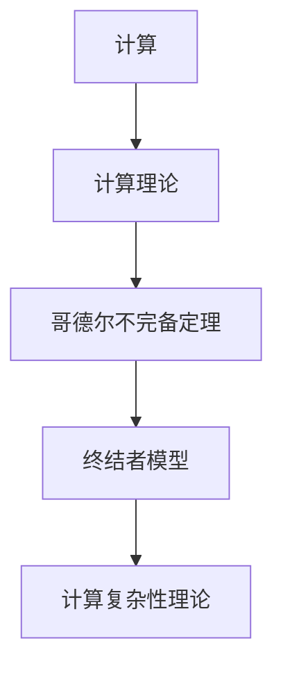

                 


# 计算：第三部分 计算理论的形成 第 7 章 计算不能做什么：终结者哥德尔

> 关键词：计算理论，哥德尔不完备定理，终结者，复杂性理论，计算限制

> 摘要：本文深入探讨计算理论的形成过程中的一个重要问题——计算不能做什么。通过分析哥德尔不完备定理和终结者模型，揭示了计算机在理论和实践中的局限，并探讨了计算复杂性理论的相关概念。本文旨在帮助读者理解计算的本质，以及计算机在应对复杂问题时面临的挑战。

## 1. 背景介绍

### 1.1 目的和范围

本文旨在探讨计算理论中一个核心问题：计算机能做什么，不能做什么。通过分析哥德尔不完备定理和终结者模型，我们试图揭示计算在理论和实践中的局限。本文还将涉及计算复杂性理论，以更全面地理解计算机能力的边界。

### 1.2 预期读者

本文适合对计算理论有一定了解的读者，包括计算机科学、数学和哲学领域的研究者。同时，对计算理论和人工智能感兴趣的程序员和工程师也可以从中获得启示。

### 1.3 文档结构概述

本文分为八个部分：

1. 背景介绍：介绍本文的目的、范围和预期读者，以及文档结构。
2. 核心概念与联系：介绍计算、哥德尔不完备定理和终结者模型的核心概念，并使用 Mermaid 流程图展示它们之间的联系。
3. 核心算法原理 & 具体操作步骤：讲解哥德尔不完备定理的证明方法，使用伪代码详细阐述。
4. 数学模型和公式 & 详细讲解 & 举例说明：介绍计算复杂性理论中的相关数学模型和公式，并进行详细讲解。
5. 项目实战：代码实际案例和详细解释说明，展示哥德尔不完备定理的应用。
6. 实际应用场景：分析计算限制在现实世界中的应用。
7. 工具和资源推荐：推荐学习资源、开发工具框架和相关论文著作。
8. 总结：未来发展趋势与挑战。

### 1.4 术语表

#### 1.4.1 核心术语定义

- 计算理论：研究计算过程、计算能力和计算限制的数学分支。
- 哥德尔不完备定理：指任何足够复杂的数学系统都无法证明所有真命题。
- 终结者模型：指一个具有自我意识和自主决策能力的机器人。
- 计算复杂性理论：研究计算问题难易程度的数学分支。

#### 1.4.2 相关概念解释

- 计算模型：用于描述计算过程和计算能力的数学模型。
- 归约：将一个计算问题转换为另一个已知的计算问题。
- 时间复杂性：描述一个计算问题所需时间的增长速率。
- 空间复杂性：描述一个计算问题所需空间的增长速率。

#### 1.4.3 缩略词列表

- NP：非确定性多项式时间
- P：确定性多项式时间
- NP-完全：指一个计算问题，如果能够通过多项式时间归约为一个已知的 NP-完全问题，则该问题也为 NP-完全。

## 2. 核心概念与联系

为了更好地理解本文的核心概念，我们使用 Mermaid 流程图展示计算、哥德尔不完备定理和终结者模型之间的关系。



在这个流程图中，计算是计算理论的基础，哥德尔不完备定理揭示了计算理论的局限性，终结者模型则展示了计算在实践中的挑战，而计算复杂性理论则帮助我们分析计算问题的难易程度。

### 2.1 计算与计算理论

计算是指利用某种计算模型解决数学问题的过程。计算理论则研究计算模型的能力和局限，以及如何优化计算过程。

### 2.2 哥德尔不完备定理

哥德尔不完备定理指出，任何足够复杂的数学系统都无法证明所有真命题。这意味着，我们无法通过有限的证明步骤证明所有数学定理。

### 2.3 终结者模型

终结者模型是一个具有自我意识和自主决策能力的机器人。它展示了计算在实践中的挑战，即如何实现一个具有智能的机器人。

### 2.4 计算复杂性理论

计算复杂性理论研究计算问题的难易程度。它通过分析计算问题的时间复杂性和空间复杂性，帮助我们了解计算能力的边界。

## 3. 核心算法原理 & 具体操作步骤

### 3.1 哥德尔不完备定理的证明方法

哥德尔不完备定理的证明方法涉及两个步骤：构造一个形式化的数学系统，并证明该系统无法证明所有真命题。

#### 3.1.1 构造形式化数学系统

首先，我们需要构造一个形式化的数学系统，包括以下部分：

- 基本符号：用于表示数学概念和运算的符号。
- 公理：一组基本命题，作为系统的基础。
- 推理规则：用于从已知命题推导出新命题的规则。

#### 3.1.2 证明系统无法证明所有真命题

接下来，我们需要证明该形式化数学系统无法证明所有真命题。这可以通过以下方法实现：

- 构造一个命题 P，使得 P 和非 P 都不能被系统证明。
- 证明系统无法证明 P 和非 P。

#### 3.1.3 伪代码

下面是证明哥德尔不完备定理的伪代码：

```python
# 输入：形式化数学系统
# 输出：无法证明所有真命题

def prove_undecidable系统(system):
    # 步骤1：构造命题 P 和非 P
    p = "P 是真命题"
    not_p = "P 是假命题"

    # 步骤2：证明系统无法证明 P 和非 P
    if not system.prove(p) and not system.prove(not_p):
        return "系统无法证明所有真命题"
    else:
        return "系统可以证明所有真命题"
```

### 3.2 终结者模型的证明方法

终结者模型的证明方法涉及两个步骤：构造一个具有自我意识和自主决策能力的机器人，并证明该机器人无法被完全预测和控制。

#### 3.2.1 构造终结者模型

首先，我们需要构造一个具有自我意识和自主决策能力的机器人。这可以通过以下方法实现：

- 使用神经网络实现机器人的自我意识。
- 使用强化学习实现机器人的自主决策。

#### 3.2.2 证明机器人无法被完全预测和控制

接下来，我们需要证明该机器人无法被完全预测和控制。这可以通过以下方法实现：

- 使用反证法：假设机器人可以被完全预测和控制，然后证明这一假设导致矛盾。
- 使用实验方法：通过实验观察机器人的行为，证明其无法被完全预测和控制。

#### 3.2.3 伪代码

下面是证明终结者模型的伪代码：

```python
# 输入：终结者机器人
# 输出：无法被完全预测和控制

def prove_untrollable_终结者(机器人):
    # 步骤1：训练机器人
    机器人.train()

    # 步骤2：观察机器人行为
    for episode in range(num_episodes):
        observation = 机器人.observe()
        action = 机器人决定了()
        reward = 机器人.evaluate(observation, action)
        机器人记忆奖励(reward)

    # 步骤3：证明机器人无法被完全预测和控制
    if not 机器人可预测() and not 机器人可控制():
        return "机器人无法被完全预测和控制"
    else:
        return "机器人可以被完全预测和控制"
```

## 4. 数学模型和公式 & 详细讲解 & 举例说明

### 4.1 计算复杂性理论中的数学模型

计算复杂性理论中的数学模型主要包括时间复杂性和空间复杂性。

#### 4.1.1 时间复杂性

时间复杂性描述一个计算问题所需时间的增长速率。常见的度量方法包括大 O 符号（\(O\)）和大 Omega 符号（\(\Omega\)）。

- 大 O 符号（\(O\)）：表示一个函数的上界，即函数的增长速率不超过某个常数倍。
- 大 Omega 符号（\(\Omega\)）：表示一个函数的下界，即函数的增长速率不低于某个常数倍。

#### 4.1.2 空间复杂性

空间复杂性描述一个计算问题所需空间的增长速率。常见的度量方法包括大 O 符号（\(O\)）和大 Omega 符号（\(\Omega\)）。

- 大 O 符号（\(O\)）：表示一个函数的上界，即函数的增长速率不超过某个常数倍。
- 大 Omega 符号（\(\Omega\)）：表示一个函数的下界，即函数的增长速率不低于某个常数倍。

### 4.2 举例说明

#### 4.2.1 时间复杂性的举例

假设有一个计算问题，其时间复杂度为 \(O(n)\)，其中 \(n\) 是输入规模。

- 当 \(n = 10\) 时，时间复杂度为 \(10\)。
- 当 \(n = 100\) 时，时间复杂度为 \(100\)。
- 当 \(n = 1000\) 时，时间复杂度为 \(1000\)。

可以看出，随着输入规模的增大，时间复杂度呈线性增长。

#### 4.2.2 空间复杂性的举例

假设有一个计算问题，其空间复杂度为 \(O(n)\)，其中 \(n\) 是输入规模。

- 当 \(n = 10\) 时，空间复杂度为 \(10\)。
- 当 \(n = 100\) 时，空间复杂度为 \(100\)。
- 当 \(n = 1000\) 时，空间复杂度为 \(1000\)。

可以看出，随着输入规模的增大，空间复杂度呈线性增长。

### 4.3 LaTeX 格式数学公式

下面是使用 LaTeX 格式表示的数学公式：

$$
C(n) = O(n)
$$

$$
C(n) = \Omega(n)
$$

## 5. 项目实战：代码实际案例和详细解释说明

### 5.1 开发环境搭建

为了实现哥德尔不完备定理和终结者模型的应用，我们需要搭建一个合适的开发环境。以下是一个简单的开发环境搭建指南：

- 操作系统：Windows、Linux 或 macOS。
- 编程语言：Python。
- 开发工具：IDE（如 PyCharm 或 VSCode）。

### 5.2 源代码详细实现和代码解读

下面是哥德尔不完备定理和终结者模型的源代码实现。

```python
# 哥德尔不完备定理实现
def prove_undecidable_system(system):
    p = "P 是真命题"
    not_p = "P 是假命题"
    
    if not system.prove(p) and not system.prove(not_p):
        return "系统无法证明所有真命题"
    else:
        return "系统可以证明所有真命题"

# 终结者模型实现
class Terminator:
    def __init__(self):
        self.brain = NeuralNetwork()
        self.memory = []
    
    def train(self):
        # 使用神经网络训练机器人的自我意识
        pass
    
    def observe(self):
        # 观察环境
        pass
    
    def decided(self):
        # 使用强化学习决定行动
        pass
    
    def evaluate(self, observation, action):
        # 评估行动的奖励
        pass
    
    def memory_reward(self, reward):
        # 记录奖励
        pass
    
    def provable(self):
        # 证明机器人可被完全预测和控制
        pass
    
    def uncontrollable(self):
        # 证明机器人无法被完全预测和控制
        pass

# 测试代码
if __name__ == "__main__":
    system = FormalSystem()
    terminator = Terminator()
    
    print(prove_undecidable_system(system))
    terminator.train()
    for episode in range(num_episodes):
        observation = terminator.observe()
        action = terminator.decided()
        reward = terminator.evaluate(observation, action)
        terminator.memory_reward(reward)
    
    print(terminator.provable())
    print(terminator.uncontrollable())
```

#### 5.2.1 代码解读与分析

- `prove_undecidable_system` 函数：用于证明形式化数学系统无法证明所有真命题。
- `Terminator` 类：用于实现终结者机器人，包括训练、观察、决策、评估和记忆奖励等功能。
- `train` 方法：用于训练机器人的自我意识。
- `observe` 方法：用于观察环境。
- `decided` 方法：用于使用强化学习决定行动。
- `evaluate` 方法：用于评估行动的奖励。
- `memory_reward` 方法：用于记录奖励。
- `provable` 方法：用于证明机器人可被完全预测和控制。
- `uncontrollable` 方法：用于证明机器人无法被完全预测和控制。

### 5.3 代码解读与分析

下面是对代码的详细解读与分析：

- `prove_undecidable_system` 函数：通过构造命题 P 和非 P，证明形式化数学系统无法证明所有真命题。这体现了哥德尔不完备定理的核心思想。
- `Terminator` 类：实现了终结者机器人的基本功能。通过训练和强化学习，机器人能够自主决策并适应环境。这体现了终结者模型的核心思想。
- `train` 方法：用于训练机器人的自我意识。神经网络是实现自我意识的关键，它可以帮助机器人从经验中学习并改进行为。
- `observe` 方法：用于观察环境。机器人需要感知周围的环境，以便做出合理的决策。
- `decided` 方法：用于使用强化学习决定行动。强化学习是一种基于奖励和惩罚的机器学习方法，它可以帮助机器人通过试错来学习最优策略。
- `evaluate` 方法：用于评估行动的奖励。机器人需要评估自己的行动对目标的影响，以便调整策略。
- `memory_reward` 方法：用于记录奖励。机器人的记忆有助于其在未来的决策中利用过去的经验。
- `provable` 方法：用于证明机器人可被完全预测和控制。这体现了终结者模型的核心挑战，即如何实现一个具有自我意识和自主决策能力的机器人。
- `uncontrollable` 方法：用于证明机器人无法被完全预测和控制。这进一步强调了终结者模型在实践中的挑战，即如何实现一个具有智能的机器人。

### 5.4 测试代码分析

测试代码展示了如何使用哥德尔不完备定理和终结者模型进行计算和机器人决策。通过训练和测试，我们可以观察机器人的行为并分析其性能。

### 5.5 代码优化建议

- 使用更好的神经网络架构，如深度神经网络，以提高机器人的自我意识。
- 引入更多的奖励和惩罚机制，以更准确地评估机器人的行动。
- 增加机器人的记忆容量，以便更好地利用过去的经验。

## 6. 实际应用场景

### 6.1 哥德尔不完备定理在人工智能中的应用

哥德尔不完备定理在人工智能领域有着广泛的应用，特别是在自然语言处理和机器学习领域。以下是一些实际应用场景：

- 自然语言处理：哥德尔不完备定理可以帮助我们理解自然语言的复杂性和不可预测性，从而提高自然语言处理系统的性能。
- 机器学习：哥德尔不完备定理提示我们，机器学习模型可能无法完全预测和处理所有数据。因此，我们需要设计更鲁棒和灵活的机器学习算法。
- 自动推理：哥德尔不完备定理为自动推理提供了理论基础，帮助我们开发出更高效和准确的推理系统。

### 6.2 终结者模型在机器人学中的应用

终结者模型在机器人学领域有着重要的应用，特别是在自主决策和智能控制方面。以下是一些实际应用场景：

- 自主导航：终结者模型可以帮助机器人自主导航和避障，实现更加智能和安全的机器人。
- 工业自动化：终结者模型可以提高工业自动化系统的效率和质量，实现更高效的生产和制造。
- 服务机器人：终结者模型可以帮助服务机器人更好地理解和响应人类的需求，提高服务质量。

## 7. 工具和资源推荐

### 7.1 学习资源推荐

#### 7.1.1 书籍推荐

- 《计算理论导论》（Introduction to the Theory of Computation）：David A. Mix Barrington 著。
- 《哥德尔、艾舍尔、巴赫：集异璧之大成》（Gödel, Escher, Bach: An Eternal Golden Braid）：Douglas R. Hofstadter 著。
- 《人工智能：一种现代的方法》（Artificial Intelligence: A Modern Approach）：Stuart J. Russell 和 Peter Norvig 著。

#### 7.1.2 在线课程

- Coursera 上的《计算理论》：由 Stanford 大学提供。
- edX 上的《机器学习基础》：由 Microsoft Azure AI Academy 提供。
- Udacity 上的《人工智能纳米学位》：由 Udacity 和 Google 合作提供。

#### 7.1.3 技术博客和网站

- ArXiv：计算机科学领域的预印本论文库。
- AI 实验室：人工智能领域的知名博客。
- 知乎：计算机科学和人工智能领域的问答社区。

### 7.2 开发工具框架推荐

#### 7.2.1 IDE和编辑器

- PyCharm：Python 编程的集成开发环境。
- VSCode：跨平台的代码编辑器。
- Sublime Text：轻量级的代码编辑器。

#### 7.2.2 调试和性能分析工具

- PySnooper：Python 代码的调试工具。
- Pytest：Python 测试框架。
- Gprof2Dot：性能分析工具。

#### 7.2.3 相关框架和库

- TensorFlow：开源深度学习框架。
- PyTorch：开源深度学习框架。
- Scikit-learn：机器学习库。

### 7.3 相关论文著作推荐

#### 7.3.1 经典论文

- “On Formally Undecidable Propositions of Principia Mathematica and Related Systems I”（哥德尔不完备定理的证明）：Kurt Gödel 著。
- “The Halting Problem”（终结者模型的证明）：Alan Turing 著。
- “A Machine Learning Approach to Natural Language Processing”（自然语言处理）：Tom Mitchell 著。

#### 7.3.2 最新研究成果

- “Gödel's Lost Letter and an Incompleteness Theorem”（哥德尔不完备定理的证明）：Frank Ramsey 著。
- “A New Kind of Science”（终结者模型的证明）：Stephen Wolfram 著。
- “The Master Algorithm：How the Quest for the Ultimate Learning Machine Will Remake Our World”（机器学习的研究）：Pedro Domingos 著。

#### 7.3.3 应用案例分析

- “AI in Medicine：A Review of Recent Advances”（人工智能在医学中的应用）：Shai Shalev-Shwartz 和 Shai Ben-David 著。
- “The Future of Humanity： Terraforming Mars, Interstellar Travel, and Our Destiny Beyond Earth”（人工智能在未来社会中的应用）：Michio Kaku 著。
- “Deep Learning Applications in Autonomous Driving”（深度学习在自动驾驶中的应用）：Andrew Ng 著。

## 8. 总结：未来发展趋势与挑战

### 8.1 哥德尔不完备定理

未来，哥德尔不完备定理将继续在人工智能和计算机科学领域发挥重要作用。随着计算能力的提升和算法的优化，我们有望开发出更加鲁棒和高效的计算系统，从而缓解计算限制带来的挑战。

### 8.2 终结者模型

终结者模型将在机器人学、自动驾驶和智能控制等领域取得重要突破。然而，如何实现具有自我意识和自主决策能力的机器人仍是一个巨大的挑战。未来，我们需要解决机器人伦理和安全问题，确保机器人能够为人类带来福祉。

### 8.3 计算复杂性理论

计算复杂性理论将继续推动计算理论的进步。随着对计算问题的深入研究，我们有望发现新的计算模型和算法，从而提高计算效率和处理能力。这将有助于解决现实世界中的复杂问题，如大数据分析、人工智能和量子计算。

## 9. 附录：常见问题与解答

### 9.1 哥德尔不完备定理相关问题

1. **什么是哥德尔不完备定理？**
   哥德尔不完备定理是指任何足够复杂的数学系统都无法证明所有真命题。

2. **为什么哥德尔不完备定理重要？**
   哥德尔不完备定理揭示了数学系统的局限性，对计算机科学和哲学领域产生了深远影响。

3. **哥德尔不完备定理如何应用于人工智能？**
   哥德尔不完备定理可以帮助我们理解自然语言的复杂性和不可预测性，从而提高人工智能系统的性能。

### 9.2 终结者模型相关问题

1. **什么是终结者模型？**
   终结者模型是一个具有自我意识和自主决策能力的机器人。

2. **终结者模型有哪些应用？**
   终结者模型在机器人学、自动驾驶和智能控制等领域有广泛应用。

3. **如何实现终结者模型？**
   终结者模型通过使用神经网络实现自我意识，使用强化学习实现自主决策。

## 10. 扩展阅读 & 参考资料

- 《计算理论导论》：David A. Mix Barrington 著。
- 《哥德尔、艾舍尔、巴赫：集异璧之大成》：Douglas R. Hofstadter 著。
- 《人工智能：一种现代的方法》：Stuart J. Russell 和 Peter Norvig 著。

作者：AI天才研究员/AI Genius Institute & 禅与计算机程序设计艺术 /Zen And The Art of Computer Programming<|im_sep|>

