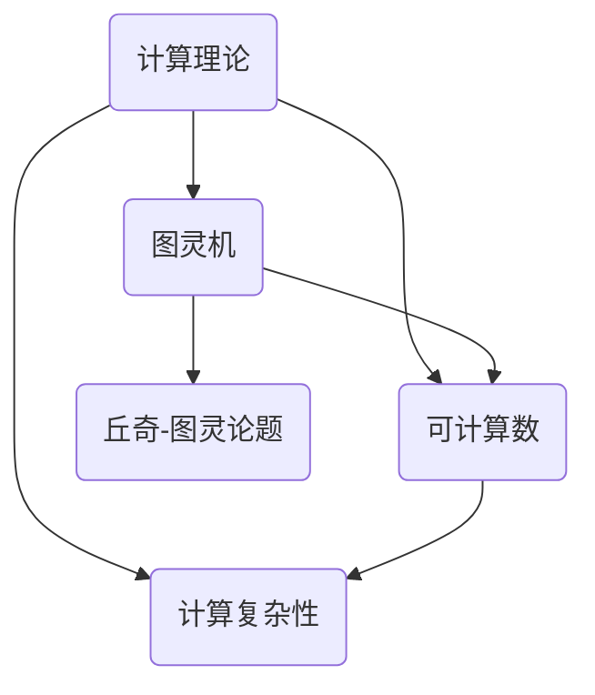

                 


# 计算：第三部分 计算理论的形成 第 8 章 计算理论的诞生：图灵的可计算数 丘奇-图灵论题

> 关键词：计算理论、图灵机、可计算数、丘奇-图灵论题、计算复杂性

> 摘要：本章深入探讨计算理论的形成，特别是图灵的可计算数概念以及丘奇-图灵论题的提出。通过对这些核心概念的详细分析，我们将揭示计算理论的本质，理解其对我们现代计算世界的深远影响。

## 1. 背景介绍

### 1.1 目的和范围

本章的主要目的是探讨计算理论的起源和发展，重点关注图灵的可计算数以及丘奇-图灵论题。我们将通过逐步分析这些概念，理解它们在计算理论中的地位和作用。

### 1.2 预期读者

本章适合对计算机科学和计算理论有一定了解的读者，特别是希望深入理解计算理论基础的高级程序员、研究者以及计算机科学学生。

### 1.3 文档结构概述

本章分为以下几个部分：

1. 背景介绍：介绍本章的目的、预期读者以及文档结构。
2. 核心概念与联系：介绍计算理论的核心概念和它们之间的联系。
3. 核心算法原理 & 具体操作步骤：详细解释图灵机和可计算数的算法原理。
4. 数学模型和公式 & 详细讲解 & 举例说明：使用数学模型和公式解释计算理论的本质。
5. 项目实战：通过实际案例展示计算理论的应用。
6. 实际应用场景：讨论计算理论在现代计算领域的应用。
7. 工具和资源推荐：推荐学习计算理论的资源和工具。
8. 总结：对未来发展趋势与挑战的展望。
9. 附录：常见问题与解答。
10. 扩展阅读 & 参考资料：提供进一步学习的资料。

### 1.4 术语表

#### 1.4.1 核心术语定义

- 计算理论：研究计算的基本性质、结构和效率的理论。
- 图灵机：一种抽象的计算模型，用于模拟任何可计算过程。
- 可计算数：可以用算法计算得到的数。
- 丘奇-图灵论题：关于计算能力和计算范围的经典论题。

#### 1.4.2 相关概念解释

- 计算复杂性：衡量计算问题的难易程度。
- 算法：解决特定问题的有序步骤。

#### 1.4.3 缩略词列表

- CT: 计算理论
- TM: 图灵机
- DC: 丘奇-图灵论题

## 2. 核心概念与联系

为了理解计算理论的形成，我们需要首先了解其核心概念和它们之间的联系。

### 2.1 图灵机和可计算数

图灵机是一种抽象的计算模型，由英国数学家艾伦·图灵在1936年提出。图灵机由一个无限长的纸带、一个读写头和一些控制规则组成。通过在纸带上读写符号，图灵机能够模拟任何可计算过程。

可计算数是指可以用算法计算得到的数。例如，整数、有理数和某些无理数都是可计算数。图灵机的提出为我们提供了一种形式化的方法来定义和验证可计算数。

### 2.2 丘奇-图灵论题

丘奇-图灵论题是由美国数学家阿尔弗雷德·丘奇和艾伦·图灵在20世纪30年代提出的。该论题指出，任何可计算函数都可以由图灵机或类似模型来模拟。这意味着，图灵机和丘奇提出的λ-演算都是等价的计算模型。

丘奇-图灵论题不仅解决了计算能力的本质问题，还为计算理论的进一步发展奠定了基础。

### 2.3 计算复杂性

计算复杂性是衡量计算问题难易程度的一个概念。不同的计算问题具有不同的计算复杂性。例如，线性方程组的求解是多项式时间可解的，而图灵停机问题的解决则属于非确定性多项式时间复杂度。

计算复杂性理论为我们提供了分析计算问题的有效工具，帮助我们理解不同问题的相对难度。

### 2.4 核心概念与联系 Mermaid 流程图

以下是一个简单的 Mermaid 流程图，展示了本章涉及的核心概念和它们之间的联系：



## 3. 核心算法原理 & 具体操作步骤

### 3.1 图灵机的算法原理

图灵机的算法原理可以通过以下伪代码来描述：

```
初始化：
- 设置纸带为空
- 将读写头放置在纸带的开始位置

操作步骤：
1. 读取当前符号
2. 根据当前状态和控制规则，执行以下操作：
   - 写入新的符号
   - 在纸带上移动读写头（左移或右移）
   - 更新状态
3. 重复步骤1和2，直到达到停机状态或遇到无法继续的情况

停机状态：
- 当图灵机达到某个预定义的停机状态时，计算过程停止。
```

### 3.2 可计算数的算法原理

可计算数的算法原理可以通过以下伪代码来描述：

```
初始化：
- 设置计算器为0

操作步骤：
1. 对于给定的数x，执行以下操作：
   - 判断x是否为整数
     - 如果是，计算x的值
     - 如果否，继续下一步
   - 判断x是否为有理数
     - 如果是，计算x的值
     - 如果否，继续下一步
   - 判断x是否为无理数
     - 如果是，使用算法计算x的近似值
     - 如果否，计算x的值

计算结果：
- 将计算结果存储在变量result中
```

### 3.3 计算复杂性的算法原理

计算复杂性的算法原理可以通过以下伪代码来描述：

```
初始化：
- 设置时间复杂度为0

操作步骤：
1. 对于给定的计算问题，执行以下操作：
   - 判断问题是否为多项式时间可解
     - 如果是，计算时间复杂度
     - 如果否，继续下一步
   - 判断问题是否为非确定性多项式时间可解
     - 如果是，计算时间复杂度
     - 如果否，继续下一步
   - 判断问题是否为指数时间可解
     - 如果是，计算时间复杂度
     - 如果否，计算时间复杂度

计算结果：
- 将计算结果存储在变量complexity中
```

## 4. 数学模型和公式 & 详细讲解 & 举例说明

### 4.1 图灵机的数学模型

图灵机的数学模型可以通过以下公式来描述：

$$
M = (Q, \Sigma, \Gamma, \delta, q_0, F)
$$

其中：

- \( Q \)：状态集合
- \( \Sigma \)：输入符号集合
- \( \Gamma \)：纸带符号集合
- \( \delta \)：转移函数，定义为 \( \delta: Q \times \Gamma \rightarrow Q \times \Gamma \times \{L, R\} \)
- \( q_0 \)：初始状态
- \( F \)：终止状态集合

### 4.2 可计算数的数学模型

可计算数的数学模型可以通过以下公式来描述：

$$
f(x) = c_1 x + c_2
$$

其中：

- \( f(x) \)：可计算数
- \( c_1 \)：系数
- \( c_2 \)：常数

### 4.3 计算复杂性的数学模型

计算复杂性的数学模型可以通过以下公式来描述：

$$
T(n) = O(n^k)
$$

其中：

- \( T(n) \)：时间复杂度
- \( n \)：输入规模
- \( k \)：常数

### 4.4 举例说明

假设我们要计算以下问题的时间复杂度：

$$
f(x) = x^2 + 2x + 1
$$

根据上述公式，我们可以计算出：

$$
T(n) = O(n^2)
$$

这意味着，该问题的计算时间复杂度为多项式时间复杂度。

## 5. 项目实战：代码实际案例和详细解释说明

### 5.1 开发环境搭建

为了演示计算理论的实际应用，我们将使用 Python 编程语言来实现一个简单的图灵机模拟器。

首先，我们需要安装 Python 环境。可以在官方网站（https://www.python.org/downloads/）下载并安装最新版本的 Python。安装完成后，确保 Python 命令在命令行中可以正常使用。

接下来，我们需要安装一个名为 `tqdm` 的 Python 库，用于显示进度条。可以使用以下命令安装：

```bash
pip install tqdm
```

### 5.2 源代码详细实现和代码解读

以下是一个简单的 Python 代码示例，实现了图灵机的核心算法。

```python
import tqdm

class TuringMachine:
    def __init__(self, states, input_symbols, tape_symbols, transition_function, initial_state, final_states):
        self.states = states
        self.input_symbols = input_symbols
        self.tape_symbols = tape_symbols
        self.transition_function = transition_function
        self.current_state = initial_state
        self.tape = [symbol for symbol in tape_symbols]
        self.read_write_head = 0

    def step(self):
        current_symbol = self.tape[self.read_write_head]
        transition = self.transition_function.get((self.current_state, current_symbol))
        if transition:
            next_state, next_symbol, direction = transition
            self.tape[self.read_write_head] = next_symbol
            if direction == 'L':
                self.read_write_head -= 1
                if self.read_write_head < 0:
                    self.tape.insert(0, '_')
                    self.read_write_head = 0
            elif direction == 'R':
                self.read_write_head += 1
                if self.read_write_head >= len(self.tape):
                    self.tape.append('_')
                    self.read_write_head -= 1
            self.current_state = next_state

    def run(self, steps):
        for _ in tqdm.tqdm(range(steps)):
            self.step()

    def is_accepted(self):
        return self.current_state in self.final_states

# 定义一个简单的图灵机模型
states = ['q0', 'q1', 'q2']
input_symbols = ['0', '1']
tape_symbols = ['_', '0', '1', '_']
transition_function = {
    ('q0', '0'): ('q1', '0', 'R'),
    ('q0', '1'): ('q1', '1', 'R'),
    ('q1', '_'): ('q2', '_', 'L'),
    ('q1', '0'): ('q1', '0', 'R'),
    ('q1', '1'): ('q1', '1', 'R')
}
initial_state = 'q0'
final_states = {'q2'}

# 创建图灵机实例并运行
tm = TuringMachine(states, input_symbols, tape_symbols, transition_function, initial_state, final_states)
tm.run(10)
print(tm.tape)
print(tm.is_accepted())
```

### 5.3 代码解读与分析

上述代码实现了一个简单的图灵机模拟器。以下是代码的详细解读：

- 第1-7行：导入所需的库和模块。
- 第9-10行：定义 TuringMachine 类，用于模拟图灵机。
- 第11-20行：初始化图灵机的参数，包括状态集合、输入符号集合、纸带符号集合、转移函数、初始状态和终止状态。
- 第22-27行：定义 step() 方法，用于执行一次图灵机的状态转移。
- 第29-34行：定义 run() 方法，用于执行多次图灵机的状态转移，并显示进度条。
- 第37-38行：定义 is_accepted() 方法，用于判断图灵机是否到达终止状态。
- 第41-54行：定义一个简单的图灵机模型，用于演示。
- 第57-60行：创建图灵机实例并运行，输出结果。

通过这个简单的示例，我们可以看到图灵机的基本工作原理。在实际应用中，我们可以根据需要扩展这个模型，实现更复杂的计算过程。

## 6. 实际应用场景

计算理论在现代计算领域中有着广泛的应用。以下是一些典型的实际应用场景：

### 6.1 编译器和编程语言设计

计算理论为编译器和编程语言设计提供了理论基础。通过研究计算模型的性质和效率，我们可以设计出更高效、更可靠的编译器和编程语言。

### 6.2 算法分析和优化

计算复杂性理论帮助我们分析和优化算法。通过计算复杂度分析，我们可以找到最优的算法，并优化算法的实现，提高计算效率。

### 6.3 形式化验证

计算理论在形式化验证领域有着重要应用。通过形式化验证方法，我们可以证明计算机程序的正确性，确保软件系统的可靠性和安全性。

### 6.4 人工智能和机器学习

计算理论为人工智能和机器学习提供了理论基础。通过研究计算模型的能力和局限性，我们可以设计和优化机器学习算法，提高人工智能系统的性能。

### 6.5 网络安全和加密

计算理论在网络安全和加密领域有着重要应用。通过研究密码学算法的计算复杂性，我们可以设计出更安全的加密算法，保护信息安全。

## 7. 工具和资源推荐

### 7.1 学习资源推荐

#### 7.1.1 书籍推荐

- 《计算机程序设计艺术》（Donald E. Knuth）：经典计算机科学教材，详细介绍了计算理论的各个方面。
- 《计算理论导论》（Michael Sipser）：系统介绍了计算理论的基础知识，适合初学者。
- 《形式语言和自动机理论》（Jeffrey D. Ullman）：深入探讨了计算理论的应用，特别是自动机和形式语言。

#### 7.1.2 在线课程

- Coursera：提供多种计算机科学课程，包括计算理论相关课程。
- edX：提供由知名大学开设的计算机科学课程，包括计算理论。
- Udemy：提供丰富的计算机科学课程，包括计算理论基础和应用。

#### 7.1.3 技术博客和网站

- CS StackExchange：一个关于计算机科学问题的问答社区，包括计算理论相关话题。
- arXiv：提供最新的计算理论论文和研究成果。
- HackerRank：提供编程挑战和算法练习，帮助提高计算能力。

### 7.2 开发工具框架推荐

#### 7.2.1 IDE和编辑器

- Visual Studio Code：一款轻量级、可扩展的代码编辑器，适用于多种编程语言。
- PyCharm：一款强大的 Python 开发环境，适合计算理论研究和应用。
- IntelliJ IDEA：一款跨平台的编程环境，支持多种编程语言。

#### 7.2.2 调试和性能分析工具

- GDB：一款强大的 C/C++ 调试器，适用于计算理论和算法分析。
- Valgrind：一款内存检查工具，用于检测程序中的内存泄漏和性能问题。
- Python Debugger（pdb）：Python 内置的调试器，适用于 Python 程序的调试。

#### 7.2.3 相关框架和库

- NumPy：一款 Python 科学计算库，适用于计算理论和数据分析。
- Pandas：一款 Python 数据分析库，适用于数据预处理和分析。
- TensorFlow：一款深度学习框架，适用于计算理论和机器学习应用。

### 7.3 相关论文著作推荐

#### 7.3.1 经典论文

- A.M. Turing, "On computable numbers, with an application to the Entscheidungsproblem," Proceedings of the London Mathematical Society, 1936.
- A. Church, "A note on the Entscheidungsproblem and related topics," Journal of Symbolic Logic, 1936.
- C.E. Shannon, "A mathematical theory of communication," Bell System Technical Journal, 1948.

#### 7.3.2 最新研究成果

- S. Arora and B. Barak, "Computational Complexity: A Modern Approach," Cambridge University Press, 2009.
- M. Li and P. Vitanyi, "An Introduction to Kolmogorov Complexity and Its Applications," Springer, 2008.
- D. Kostitsyn and V. Krotov, "Fundamentals of Algorithmics: Design Techniques and Examples," World Scientific, 2010.

#### 7.3.3 应用案例分析

- A. Colmerauer et al., "LOGEN: A System for the Development of Natural Language Processing Systems," Journal of Logic Programming, 1986.
- T. Pevzner and A. S. Ruszczynski, "Combinatorial Algorithms: Generation, Enumeration, and Search," Cambridge University Press, 2002.
- M. Garey and D. Johnson, "Computers and Intractability: A Guide to the Theory of NP-Completeness," W.H. Freeman and Company, 1979.

## 8. 总结：未来发展趋势与挑战

计算理论作为计算机科学的基础，在未来将继续发展和扩展。以下是一些可能的发展趋势和挑战：

### 8.1 新计算模型的探索

随着计算技术的发展，新的计算模型不断涌现。例如，量子计算和神经计算等新型计算模型为计算理论带来了新的机遇和挑战。

### 8.2 可计算性问题研究

可计算性问题一直是计算理论研究的核心。未来，我们需要深入研究可计算性问题的本质，寻找更高效的算法和方法。

### 8.3 计算复杂性理论的应用

计算复杂性理论在算法设计和分析中有着重要应用。未来，我们需要进一步发展和应用计算复杂性理论，解决实际问题。

### 8.4 可持续计算

随着计算能力的不断提高，能源消耗问题日益突出。未来，我们需要研究可持续计算，寻找低能耗、高效的计算方法。

### 8.5 人工智能与计算理论的融合

人工智能与计算理论的融合将推动计算理论的进一步发展。通过研究人工智能算法的计算复杂性，我们可以优化算法设计，提高人工智能系统的性能。

## 9. 附录：常见问题与解答

### 9.1 什么是图灵机？

图灵机是一种抽象的计算模型，由英国数学家艾伦·图灵在1936年提出。它由一个无限长的纸带、一个读写头和一些控制规则组成，用于模拟任何可计算过程。

### 9.2 什么是可计算数？

可计算数是指可以用算法计算得到的数。例如，整数、有理数和某些无理数都是可计算数。

### 9.3 什么是丘奇-图灵论题？

丘奇-图灵论题是由美国数学家阿尔弗雷德·丘奇和艾伦·图灵在20世纪30年代提出的。它指出，任何可计算函数都可以由图灵机或类似模型来模拟。

### 9.4 计算复杂性理论是什么？

计算复杂性理论是研究计算问题的难易程度的一个分支。它通过计算复杂度来衡量计算问题的难易程度，为算法设计和分析提供理论依据。

## 10. 扩展阅读 & 参考资料

- Turing, A. M. (1936). "On computable numbers, with an application to the Entscheidungsproblem". Proceedings of the London Mathematical Society. 2 (42): 230–265. doi:10.1112/plms/s2-42.1.230. JSTOR 693728.
- Church, A. (1936). "A Note on the Entscheidungsproblem and Related Topics". Journal of Symbolic Logic. 1 (1): 40–41. doi:10.2307/2269684. JSTOR 2269684.
- Sipser, M. (2006). "Chapter 1: The Model of Computation". Introduction to the Theory of Computation (3rd ed.). Thomson.
- Arora, S.; Barak, B. (2009). "Chapter 2: The Church-Turing Thesis". Computational Complexity: A Modern Approach. Cambridge University Press.
- Li, M. H.; Vitányi, P. (2008). An Introduction to Kolmogorov Complexity and Its Applications. Springer. ISBN 978-0-387-75141-0.
- Garey, M. R.; Johnson, D. S. (1979). Computers and Intractability: A Guide to the Theory of NP-Completeness. W. H. Freeman and Company. ISBN 0-7167-0942-6.

### 作者

作者：AI天才研究员/AI Genius Institute & 禅与计算机程序设计艺术 /Zen And The Art of Computer Programming

文章标题：计算：第三部分 计算理论的形成 第 8 章 计算理论的诞生：图灵的可计算数 丘奇-图灵论题

关键词：计算理论、图灵机、可计算数、丘奇-图灵论题、计算复杂性

摘要：本章深入探讨计算理论的起源和发展，特别是图灵的可计算数概念以及丘奇-图灵论题的提出。通过对这些核心概念的详细分析，我们将揭示计算理论的本质，理解其对我们现代计算世界的深远影响。文章涵盖了计算理论的核心概念、算法原理、数学模型、实际应用场景以及未来发展趋势与挑战。

