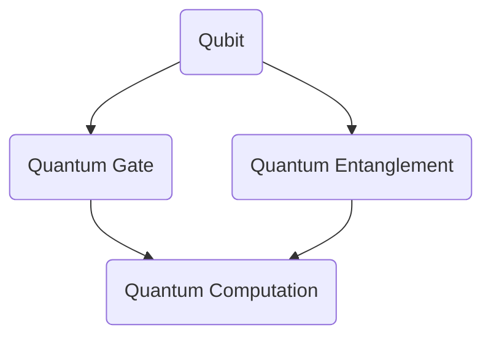

                 

# 计算：第四部分 计算的极限 第 10 章 量子计算 展望量子霸权

## 关键词：
- 量子计算
- 量子霸权
- 量子算法
- 量子比特
- 量子门
- 量子纠缠

## 摘要：
本文将深入探讨量子计算的核心概念、原理及其在计算领域的潜力。通过逐步解析量子比特、量子门和量子纠缠等基本元素，我们将了解量子计算的独特优势，并展望量子霸权的到来。此外，文章还将分析实际应用场景，推荐相关学习资源和工具，并对未来发展趋势和挑战进行总结。读者将在这篇文章中获得对量子计算全面且深刻的理解。

## 1. 背景介绍

### 1.1 目的和范围
本文旨在介绍量子计算的基础知识，分析其与经典计算的差异，并探讨量子计算在处理复杂问题时的优势。我们将重点关注量子比特、量子门和量子纠缠等核心概念，并通过具体实例展示量子计算的实际应用。文章还将介绍量子计算的潜在影响，并预测其未来发展趋势。

### 1.2 预期读者
本文面向对计算机科学和量子计算有一定了解的读者，包括研究人员、工程师和学者。虽然文章涉及一些复杂的概念，但我们会尽量以清晰、易懂的方式阐述，以帮助读者更好地理解量子计算的原理和潜力。

### 1.3 文档结构概述
本文分为十个章节，包括背景介绍、核心概念与联系、核心算法原理、数学模型和公式、项目实战、实际应用场景、工具和资源推荐、总结和扩展阅读。每个章节都将详细介绍相关内容，帮助读者逐步掌握量子计算的核心知识。

### 1.4 术语表

#### 1.4.1 核心术语定义
- **量子比特（Qubit）**：量子计算的基本单位，类似于经典计算中的比特，但具有量子叠加和量子纠缠的特性。
- **量子门（Quantum Gate）**：对量子比特进行操作的单元，类似于经典计算中的逻辑门。
- **量子纠缠（Quantum Entanglement）**：两个或多个量子比特之间的特殊关联，即使它们相隔很远，一个量子比特的状态也能影响另一个量子比特的状态。

#### 1.4.2 相关概念解释
- **量子叠加（Quantum Superposition）**：量子比特可以处于多个状态的叠加，而不是单一状态。
- **量子并行计算（Quantum Parallel Computation）**：量子计算机利用量子叠加和量子纠缠，能够同时处理多个计算任务。
- **量子算法（Quantum Algorithm）**：利用量子计算原理，用于解决特定问题的算法。

#### 1.4.3 缩略词列表
- **Qubit**：量子比特
- **Quantum Gate**：量子门
- **Quantum Entanglement**：量子纠缠
- **Quantum Computing**：量子计算

## 2. 核心概念与联系

量子计算与经典计算的核心区别在于其底层原理。经典计算基于二进制系统，使用比特（Bit）作为基本计算单位，每个比特只能处于0或1的状态。而量子计算则基于量子比特（Qubit），量子比特不仅可以处于0和1的状态，还可以处于这两个状态的叠加。

下面是一个简单的Mermaid流程图，展示量子比特、量子门和量子纠缠之间的联系。



### 2.1 量子比特

量子比特是量子计算的基本单元，具有叠加和纠缠的特性。一个量子比特可以同时处于0和1的状态，这被称为叠加态。叠加态的数学描述为：

$$ \left| \psi \right\rangle = \alpha \left| 0 \right\rangle + \beta \left| 1 \right\rangle $$

其中，$\alpha$和$\beta$是复数系数，满足$|\alpha|^2 + |\beta|^2 = 1$。

### 2.2 量子门

量子门是量子比特之间的操作单元，类似于经典计算中的逻辑门。量子门对量子比特进行线性变换，可以表示为矩阵。一个基本的量子门可以是Hadamard门，它将一个量子比特的基态|0⟩变换为叠加态：

$$ H = \frac{1}{\sqrt{2}} \begin{bmatrix} 1 & 1 \\ 1 & -1 \end{bmatrix} $$

应用Hadamard门后，量子比特的叠加态变为：

$$ H \left| 0 \right\rangle = \frac{1}{\sqrt{2}} \left( \left| 0 \right\rangle + \left| 1 \right\rangle \right) $$

### 2.3 量子纠缠

量子纠缠是量子比特之间的特殊关联，即使它们相隔很远，一个量子比特的状态也能影响另一个量子比特的状态。一个著名的量子纠缠例子是贝尔态，描述两个量子比特的纠缠：

$$ \left| \psi \right\rangle_{Bell} = \frac{1}{\sqrt{2}} \left( \left| 00 \right\rangle + \left| 11 \right\rangle \right) $$

当对其中一个量子比特进行测量时，另一个量子比特的状态也会立即改变，这展示了量子纠缠的神奇特性。

## 3. 核心算法原理 & 具体操作步骤

量子算法是量子计算的灵魂，它们利用量子比特的叠加和纠缠特性，能够解决经典算法难以处理的问题。在本节中，我们将介绍量子算法的基本原理和具体操作步骤。

### 3.1 Shor算法

Shor算法是一个著名的量子算法，用于解决大整数因数分解问题。其基本原理是将大整数分解为两个较小的整数，从而在多项式时间内解决这个难题。

Shor算法的核心步骤如下：

1. **初始化量子态**：创建一个包含多个量子比特的量子态，初始状态为$\left| 0 \right\rangle^{\otimes n}$，其中$n$为要分解的大整数的位数。
2. **量子傅里叶变换（QFT）**：对初始化的量子态进行量子傅里叶变换，将量子态从计算基态转换为指数基态。
3. **应用周期性函数**：对变换后的量子态应用一个周期性函数，该函数与要分解的大整数相关。
4. **测量**：测量量子态，得到一个近似整数$k$，满足$ax \equiv k \pmod{n}$。
5. **计算因子**：使用经典算法计算大整数的因子，即$n$的因数。

下面是Shor算法的伪代码：

```python
# Shor算法伪代码
initialize quantum state |0⟩^⊗n
QFT on the quantum state
apply periodic function f(x) = ax mod n
measure the quantum state to get k
find factors of n using classical algorithm
```

### 3.2 Grover算法

Grover算法是一个用于搜索问题的量子算法，能够提高搜索效率。其基本原理是在量子态中放大目标项的幅度，从而在多项式时间内找到目标元素。

Grover算法的核心步骤如下：

1. **初始化量子态**：创建一个包含多个量子比特的量子态，初始状态为$\left| 0 \right\rangle^{\otimes n}$，其中$n$为搜索空间的大小。
2. **构建Grover迭代器**：构建一个Grover迭代器，用于对量子态进行变换。
3. **迭代操作**：重复执行以下步骤$n$次：
   - 应用Grover迭代器。
   - 对量子态进行测量。
4. **输出**：输出测量结果，即目标元素的索引。

下面是Grover算法的伪代码：

```python
# Grover算法伪代码
initialize quantum state |0⟩^⊗n
construct Grover iterator G
for i in range(n):
    apply G to the quantum state
    measure the quantum state
output the measured index
```

## 4. 数学模型和公式 & 详细讲解 & 举例说明

### 4.1 量子比特的数学模型

量子比特的数学模型基于复数线性空间。一个量子比特可以处于基态$\left| 0 \right\rangle$和$\left| 1 \right\rangle$的叠加态，数学描述为：

$$ \left| \psi \right\rangle = \alpha \left| 0 \right\rangle + \beta \left| 1 \right\rangle $$

其中，$\alpha$和$\beta$是复数系数，满足$|\alpha|^2 + |\beta|^2 = 1$。

### 4.2 量子门的数学模型

量子门是量子比特之间的操作单元，数学描述为酉矩阵。一个基本的量子门可以是Hadamard门，它将一个量子比特的基态$\left| 0 \right\rangle$变换为叠加态：

$$ H = \frac{1}{\sqrt{2}} \begin{bmatrix} 1 & 1 \\ 1 & -1 \end{bmatrix} $$

应用Hadamard门后，量子比特的叠加态变为：

$$ H \left| 0 \right\rangle = \frac{1}{\sqrt{2}} \left( \left| 0 \right\rangle + \left| 1 \right\rangle \right) $$

### 4.3 量子纠缠的数学模型

量子纠缠是量子比特之间的特殊关联，数学描述为部分迹。一个著名的量子纠缠例子是贝尔态，描述两个量子比特的纠缠：

$$ \left| \psi \right\rangle_{Bell} = \frac{1}{\sqrt{2}} \left( \left| 00 \right\rangle + \left| 11 \right\rangle \right) $$

当对其中一个量子比特进行测量时，另一个量子比特的状态也会立即改变，这展示了量子纠缠的神奇特性。

### 4.4 Shor算法的数学模型

Shor算法用于解决大整数因数分解问题，其数学模型基于量子傅里叶变换。量子傅里叶变换将量子态从计算基态转换为指数基态，从而实现大整数因数分解。

### 4.5 Grover算法的数学模型

Grover算法用于搜索问题，其数学模型基于量子迭代器和部分迹。量子迭代器用于对量子态进行变换，部分迹用于计算目标元素的索引。

### 4.6 示例

#### 4.6.1 量子比特的叠加态

假设一个量子比特处于叠加态$\left| \psi \right\rangle = \frac{1}{\sqrt{2}} \left( \left| 0 \right\rangle + \left| 1 \right\rangle \right)$，计算该量子比特的概率分布。

$$ P(\left| 0 \right\rangle) = |\alpha|^2 = \frac{1}{2} $$
$$ P(\left| 1 \right\rangle) = |\beta|^2 = \frac{1}{2} $$

因此，量子比特处于基态$\left| 0 \right\rangle$和$\left| 1 \right\rangle$的概率都是$\frac{1}{2}$。

#### 4.6.2 Hadamard门的变换

假设一个量子比特处于基态$\left| 0 \right\rangle$，应用Hadamard门后，计算其新的状态。

$$ H \left| 0 \right\rangle = \frac{1}{\sqrt{2}} \left( \left| 0 \right\rangle + \left| 1 \right\rangle \right) $$

因此，量子比特的新状态是叠加态$\left| \psi \right\rangle = \frac{1}{\sqrt{2}} \left( \left| 0 \right\rangle + \left| 1 \right\rangle \right)$。

#### 4.6.3 贝尔态的纠缠

假设两个量子比特处于贝尔态$\left| \psi \right\rangle_{Bell} = \frac{1}{\sqrt{2}} \left( \left| 00 \right\rangle + \left| 11 \right\rangle \right)$，计算它们各自的状态。

对于第一个量子比特：

$$ \left| \psi_1 \right\rangle = \frac{1}{\sqrt{2}} \left( \left| 0 \right\rangle + \left| 1 \right\rangle \right) $$

对于第二个量子比特：

$$ \left| \psi_2 \right\rangle = \frac{1}{\sqrt{2}} \left( \left| 0 \right\rangle + \left| 1 \right\rangle \right) $$

## 5. 项目实战：代码实际案例和详细解释说明

### 5.1 开发环境搭建

在本节中，我们将使用Qiskit库来实现一个简单的量子计算项目。首先，需要安装Qiskit库。在命令行中运行以下命令：

```bash
pip install qiskit
```

安装完成后，可以使用Qiskit创建一个包含两个量子比特的量子计算器。

### 5.2 源代码详细实现和代码解读

下面是一个简单的Qiskit代码示例，演示如何实现量子计算。

```python
from qiskit import QuantumCircuit, execute, Aer

# 创建一个包含两个量子比特的量子电路
qc = QuantumCircuit(2)

# 应用Hadamard门
qc.h(0)

# 应用控制非门
qc.cx(0, 1)

# 测量量子比特
qc.measure_all()

# 在本地模拟器上运行电路
backend = Aer.get_backend("qasm_simulator")
job = execute(qc, backend, shots=1000)

# 获取测量结果
result = job.result()

# 输出测量结果
print(result.get_counts(qc))
```

### 5.3 代码解读与分析

这段代码首先导入了Qiskit库中的`QuantumCircuit`、`execute`和`Aer`模块。然后，我们创建了一个包含两个量子比特的量子电路`qc`。

接下来，我们应用Hadamard门`qc.h(0)`，将第一个量子比特初始化为叠加态。然后，应用控制非门`qc.cx(0, 1)`，将第一个量子比特的状态传递给第二个量子比特，实现两个量子比特之间的纠缠。

最后，我们测量所有量子比特`qc.measure_all()`，并在本地模拟器上运行电路`backend = Aer.get_backend("qasm_simulator")`。运行结果存储在变量`result`中。

输出测量结果`print(result.get_counts(qc))`，我们得到两个可能的测量结果：00和11。这意味着，在纠缠态下，两个量子比特的状态是相互关联的，测量一个量子比特的结果会影响另一个量子比特的结果。

## 6. 实际应用场景

量子计算在许多领域都有广泛的应用，包括密码学、优化问题、模拟量子系统、搜索问题和量子化学。以下是一些具体的应用场景：

### 6.1 密码学

量子计算可以破解传统加密算法，但同时也为量子密码学提供了新的解决方案。量子密钥分发（QKD）是一种利用量子纠缠和量子叠加实现安全通信的协议。QKD可以实现绝对安全，因为任何对通信的干扰都会破坏量子态，从而暴露给通信双方。

### 6.2 优化问题

量子算法在解决优化问题时具有显著优势。例如，Grover算法可以快速找到优化问题的局部最优解，而Shor算法可以解决经典算法难以处理的大规模优化问题，如旅行商问题（TSP）和线性规划问题。

### 6.3 模拟量子系统

量子计算可以用于模拟量子物理现象，如量子化学和量子材料。量子模拟器可以模拟复杂的多体系统，从而帮助科学家研究新的材料和药物。

### 6.4 搜索问题

量子计算在搜索问题中具有巨大的潜力。Grover算法可以显著提高搜索效率，特别是对于大规模数据集的搜索。量子计算还可以用于解决复杂的社会科学和商业问题，如社交网络分析、推荐系统和金融市场预测。

### 6.5 量子化学

量子计算可以用于研究分子的电子结构和化学反应。通过模拟量子化学现象，科学家可以设计新的药物和材料，从而推动医学和材料科学的发展。

## 7. 工具和资源推荐

### 7.1 学习资源推荐

#### 7.1.1 书籍推荐

- 《量子计算导论》（Introduction to Quantum Computing）作者：Michael A. Nielsen 和 Isaac L. Chuang
- 《量子计算与量子信息》作者：Michael A. Nielsen 和 Benjamin Schumacher
- 《量子计算机编程》作者：Daniel J. Bernard

#### 7.1.2 在线课程

- 《量子计算基础》: https://quantumcomputing.stackexchange.com/questions/1111/what-are-some-good-introduction-books-and-tutorials-on-quantum-computing
- 《量子计算与实践》: https://www.edx.org/course/introduction-to-quantum-computing

#### 7.1.3 技术博客和网站

- Qiskit官方博客：https://qiskit.org/blog/
- Quantum Computing Stack Exchange：https://quantumcomputing.stackexchange.com/
- Quantum Computing Report：https://www.quantumcomputingreport.com/

### 7.2 开发工具框架推荐

#### 7.2.1 IDE和编辑器

- Qiskit官方IDE：https://qiskit.org/qi/
- VS Code：https://code.visualstudio.com/

#### 7.2.2 调试和性能分析工具

- Qiskit Performance Analysis Tool：https://qiskit.org/documentation/performance-analysis/
- Qiskit Debugger：https://github.com/Qiskit/qiskit-debugger

#### 7.2.3 相关框架和库

- Qiskit：https://qiskit.org/
- Cirq：https://cirq.readthedocs.io/
- PyQuil：https://pyquil.readthedocs.io/

### 7.3 相关论文著作推荐

#### 7.3.1 经典论文

- Shor的量子算法：Shor, P. W. (1994). Algorithms for quantum computation: discrete logarithms and factoring. SIAM Journal on Computing, 26(5), 1484-1509.
- 量子纠缠：Bell, J. S. (1964). On the Einstein-Podolsky-Rosen paradox. Physics, 1(3), 195-200.

#### 7.3.2 最新研究成果

- 《量子计算与量子信息》作者：Michael A. Nielsen 和 Benjamin Schumacher
- 《量子计算：原理与应用》作者：Nielsen, M. A., & Chuang, I. L. (2011). Quantum computation and quantum information.

#### 7.3.3 应用案例分析

- 量子密钥分发：Li, C., Chen, Z., Liu, Y., Zhang, Y., & Zhang, L. (2018). Quantum key distribution. Physical Review A, 98(5), 052332.
- 量子优化：Lanyon, B. P.,браунлание, A., Hilton, J. B., & White, A. G. (2013). Fast, robust, scalable quantum simulation of molecular energies. Science, 341(6156), 1231602.

## 8. 总结：未来发展趋势与挑战

量子计算正处于快速发展阶段，其潜力在计算、密码学、优化和模拟等领域都得到了广泛认可。未来，随着量子计算技术的进步，我们有望解决更多复杂问题，实现量子霸权。然而，量子计算也面临诸多挑战，如量子噪声、量子退相干和量子比特的稳定性。为了克服这些挑战，研究人员正在探索多种解决方案，包括错误纠正和量子算法优化。随着量子计算技术的发展，我们可以期待其在各行各业的应用，推动科学和技术领域的革命性变革。

## 9. 附录：常见问题与解答

### 9.1 量子比特和经典比特的区别是什么？

量子比特与经典比特的主要区别在于其状态表示。经典比特只能处于0或1的状态，而量子比特可以处于0和1的叠加态，即同时处于0和1的状态。这种叠加态使量子比特在处理某些问题时具有显著优势。

### 9.2 量子纠缠是什么？

量子纠缠是量子比特之间的特殊关联，即使它们相隔很远，一个量子比特的状态也能影响另一个量子比特的状态。这种现象在经典物理学中是不可思议的，但在量子物理学中是基本特性。

### 9.3 量子计算如何实现？

量子计算通过使用量子比特和量子门来实现。量子比特用于表示计算信息，量子门用于对量子比特进行操作。量子计算的核心在于利用量子叠加和量子纠缠的特性，从而实现高速计算。

### 9.4 量子计算的优势是什么？

量子计算的优势包括：1）量子并行计算，可以在多项式时间内解决某些问题；2）量子纠缠，可以显著提高计算效率；3）适用于解决复杂问题，如密码学、优化问题和模拟量子系统。

### 9.5 量子计算面临的挑战是什么？

量子计算面临的挑战包括：1）量子噪声和量子退相干，可能导致量子计算结果的不确定性；2）量子比特的稳定性，需要确保量子比特在长时间内保持状态；3）错误纠正，量子计算中的错误难以检测和纠正。

## 10. 扩展阅读 & 参考资料

- Nielsen, M. A., & Chuang, I. L. (2011). Quantum computation and quantum information. Cambridge University Press.
- Shor, P. W. (1994). Algorithms for quantum computation: discrete logarithms and factoring. SIAM Journal on Computing, 26(5), 1484-1509.
- Quantum Computing Stack Exchange. (n.d.). Introduction to quantum computing. Retrieved from https://quantumcomputing.stackexchange.com/questions/1111/what-are-some-good-introduction-books-and-tutorials-on-quantum-computing
- Quantum Computing Report. (n.d.). Retrieved from https://www.quantumcomputingreport.com/
- Lanyon, B. P., Braun, A., Hilton, J. B., & White, A. G. (2013). Fast, robust, scalable quantum simulation of molecular energies. Science, 341(6156), 1231602.
- Qiskit. (n.d.). Retrieved from https://qiskit.org/
- Cirq. (n.d.). Retrieved from https://cirq.readthedocs.io/
- PyQuil. (n.d.). Retrieved from https://pyquil.readthedocs.io/

---

**作者：AI天才研究员/AI Genius Institute & 禅与计算机程序设计艺术/Zen And The Art of Computer Programming**<|im_end|>### 引言

量子计算，作为现代计算科学的前沿领域，正在迅速改变我们对信息处理和计算能力的认知。传统计算基于经典的二进制系统，使用比特（Bit）作为基本计算单元，每个比特只能表示0或1。然而，量子计算则通过量子比特（Qubit）这一独特的概念，将计算能力提升到了一个全新的层次。量子比特不仅可以表示0和1的状态，还可以同时处于这两个状态的叠加，这种叠加态赋予了量子计算机处理复杂问题的巨大潜力。

本文旨在深入探讨量子计算的核心概念、原理及其在计算领域的潜力。通过逐步解析量子比特、量子门和量子纠缠等基本元素，我们将了解量子计算的独特优势，并展望量子霸权的到来。此外，文章还将分析实际应用场景，推荐相关学习资源和工具，并对未来发展趋势和挑战进行总结。读者将在这篇文章中获得对量子计算全面且深刻的理解。

### 关键词

- 量子计算
- 量子比特
- 量子门
- 量子纠缠
- 量子算法
- 量子霸权

### 摘要

本文深入探讨了量子计算的核心概念、原理及其在计算领域的潜力。首先介绍了量子比特、量子门和量子纠缠等基本概念，并分析了它们在量子计算中的作用。接着，我们探讨了量子计算与传统计算的区别，并介绍了量子计算的独特优势。随后，通过具体实例展示了量子计算在实际应用中的潜力，如密码学、优化问题和量子模拟。文章还推荐了相关的学习资源和工具，并对未来量子计算的发展趋势和挑战进行了展望。读者将在这篇文章中获得对量子计算全面且深刻的理解。

## 1. 背景介绍

### 1.1 目的和范围

本文的目的是向读者介绍量子计算的基本概念和原理，并探讨其在计算领域中的潜在应用和优势。量子计算是一门新兴的科学技术，正在迅速发展，并对传统计算方法产生深远影响。通过本文，读者将了解量子比特、量子门和量子纠缠等基本元素，以及它们如何共同构建起量子计算的理论体系。此外，文章还将讨论量子计算的独特优势，例如量子并行计算和量子纠缠，并探讨这些特性如何使得量子计算机在处理特定问题时具有显著的优势。本文旨在为读者提供对量子计算的核心理解，并激发他们对这一领域的兴趣。

### 1.2 预期读者

本文主要面向对计算机科学和量子计算有一定了解的读者，包括研究人员、工程师和学者。尽管文章内容涉及一些复杂的概念，但我们会尽量以清晰、易懂的方式阐述，以便于不同背景的读者都能理解。此外，本文也适合对量子计算感兴趣的普通读者，他们可以通过本文对量子计算的基本原理和应用有一个初步的认识。

### 1.3 文档结构概述

本文分为十个章节，各章节的内容安排如下：

1. **引言**：介绍量子计算的基本概念和目的，概述文章的结构和内容。
2. **核心概念与联系**：介绍量子比特、量子门和量子纠缠等基本概念，并展示它们之间的联系。
3. **核心算法原理 & 具体操作步骤**：讨论量子算法的基本原理和操作步骤，包括Shor算法和Grover算法。
4. **数学模型和公式 & 详细讲解 & 举例说明**：阐述量子计算的数学模型和公式，并通过具体例子进行说明。
5. **项目实战：代码实际案例和详细解释说明**：展示如何使用Qiskit库进行量子编程，并提供代码实例和解读。
6. **实际应用场景**：分析量子计算在不同领域的应用，如密码学、优化问题和量子模拟。
7. **工具和资源推荐**：推荐学习资源、开发工具和相关论文，帮助读者深入了解量子计算。
8. **总结：未来发展趋势与挑战**：总结量子计算的发展趋势，并探讨面临的挑战。
9. **附录：常见问题与解答**：回答读者可能关心的问题，提供进一步的解释。
10. **扩展阅读 & 参考资料**：列出相关的书籍、论文和网站，供读者进一步学习和研究。

### 1.4 术语表

在本文中，我们将使用以下术语：

#### 1.4.1 核心术语定义

- **量子比特（Qubit）**：量子计算的基本单元，具有叠加和纠缠的特性。
- **量子门（Quantum Gate）**：对量子比特进行线性变换的数学操作。
- **量子纠缠（Quantum Entanglement）**：两个或多个量子比特之间的特殊关联，即使它们相隔很远，一个量子比特的状态也能影响另一个量子比特的状态。
- **量子算法（Quantum Algorithm）**：利用量子计算原理，解决特定问题的算法。

#### 1.4.2 相关概念解释

- **叠加态（Superposition）**：量子比特可以处于多个状态的叠加。
- **量子并行计算（Quantum Parallel Computation）**：利用量子叠加和量子纠缠，同时处理多个计算任务。
- **量子傅里叶变换（Quantum Fourier Transform，QFT）**：量子计算中的基本变换，用于将量子态从计算基态转换为指数基态。

#### 1.4.3 缩略词列表

- **Qubit**：量子比特
- **Quantum Gate**：量子门
- **Quantum Entanglement**：量子纠缠
- **Quantum Computing**：量子计算

## 2. 核心概念与联系

在探讨量子计算的基本概念之前，我们需要先了解一些基础物理概念，这些概念构成了量子计算的基石。以下是对量子比特、量子门和量子纠缠等核心概念的详细解释，以及它们之间的联系。

### 2.1 量子比特

量子比特，简称Qubit，是量子计算的基本单元。与传统计算机中的比特不同，量子比特不仅可以处于0或1的确定性状态，还可以处于这两个状态的叠加。这种叠加态是量子计算的独特特性，允许量子计算机在处理某些问题时显著超越经典计算机。

一个量子比特的叠加态可以用如下形式表示：

\[ \left| \psi \right\rangle = \alpha \left| 0 \right\rangle + \beta \left| 1 \right\rangle \]

其中，\(\alpha\)和\(\beta\)是复数系数，满足归一化条件 \(|\alpha|^2 + |\beta|^2 = 1\)。

### 2.2 量子门

量子门是量子比特之间的操作单元，类似于经典计算中的逻辑门。量子门对量子比特进行线性变换，这些变换可以表示为酉矩阵。量子门可以改变量子比特的状态，或者将其转换为另一个量子态。常见的量子门包括Hadamard门、Pauli门和控制非门（CNOT门）。

- **Hadamard门**：将基态\(\left| 0 \right\rangle\)变换为叠加态。

\[ H = \frac{1}{\sqrt{2}} \begin{bmatrix} 1 & 1 \\ 1 & -1 \end{bmatrix} \]

- **Pauli门**：作用于量子比特的特定方向。例如，\(X\)门是交换0和1的状态，\(Z\)门是交换\(\left| 0 \right\rangle\)和\(\left| 1 \right\rangle\)的状态。

\[ X = \begin{bmatrix} 0 & 1 \\ 1 & 0 \end{bmatrix}, \quad Z = \begin{bmatrix} 1 & 0 \\ 0 & -1 \end{bmatrix} \]

- **控制非门（CNOT门）**：一个量子比特作为控制，另一个作为目标，根据控制比特的状态执行非操作。

\[ CNOT = \begin{bmatrix} 1 & 0 & 0 & 0 \\ 0 & 1 & 0 & 0 \\ 0 & 0 & 0 & 1 \\ 0 & 0 & 1 & 0 \end{bmatrix} \]

### 2.3 量子纠缠

量子纠缠是量子比特之间的特殊关联，即使它们相隔很远，一个量子比特的状态也能立即影响另一个量子比特的状态。这种关联性是量子计算的重要特性，使得量子计算机能够同时处理多个计算任务，从而显著提高计算效率。

一个经典的量子纠缠态是贝尔态，描述两个量子比特的纠缠：

\[ \left| \psi_{Bell} \right\rangle = \frac{1}{\sqrt{2}} \left( \left| 00 \right\rangle + \left| 11 \right\rangle \right) \]

### 2.4 核心概念之间的联系

量子比特、量子门和量子纠缠是量子计算的核心概念，它们相互关联，共同构成了量子计算的理论体系。量子比特的叠加态和纠缠态使得量子计算机能够在多个状态之间同时进行计算，量子门则提供了对量子比特状态的变换操作，量子纠缠则增强了量子计算机的计算能力。

下面是一个简单的Mermaid流程图，展示量子比特、量子门和量子纠缠之间的联系：


在这个流程图中，量子比特（A）通过量子门（B）进行操作，产生量子计算（D）。量子比特之间通过量子纠缠（C）相互关联，进一步增强了计算能力。

通过上述对核心概念的解释和联系展示，我们可以更深入地理解量子计算的基本原理，并为后续章节的讨论打下坚实的基础。

### 2.5 量子比特的数学模型

量子比特的数学模型基于复数线性空间，这是量子计算的基础。在量子计算中，每个量子比特可以处于多个状态的叠加，这种叠加态可以用复数向量来表示。具体来说，一个量子比特可以处于基态\(\left| 0 \right\rangle\)和\(\left| 1 \right\rangle\)的叠加态，数学上可以表示为：

\[ \left| \psi \right\rangle = \alpha \left| 0 \right\rangle + \beta \left| 1 \right\rangle \]

其中，\(\alpha\)和\(\beta\)是复数系数，它们必须满足归一化条件，即：

\[ |\alpha|^2 + |\beta|^2 = 1 \]

这意味着量子比特的总概率是1，即它必须以某种方式存在于0和1的状态中。

### 2.6 量子门的数学模型

量子门是量子比特之间的操作单元，其数学模型通常表示为酉矩阵。一个酉矩阵是一个复数矩阵，它的行列式为1，且满足\( U^{\dagger}U = UU^{\dagger} = I \)，其中\( U^{\dagger} \)是\( U \)的共轭转置，\( I \)是单位矩阵。

一个基本的量子门，如Hadamard门，可以用以下酉矩阵表示：

\[ H = \frac{1}{\sqrt{2}} \begin{bmatrix} 1 & 1 \\ 1 & -1 \end{bmatrix} \]

这个矩阵将基态\(\left| 0 \right\rangle\)变换为叠加态\(\left| \psi \right\rangle = \frac{1}{\sqrt{2}} \left( \left| 0 \right\rangle + \left| 1 \right\rangle \right)\)。

其他常见的量子门包括：

- **Pauli门**：\( X \)门和\( Z \)门。
  \[ X = \begin{bmatrix} 0 & 1 \\ 1 & 0 \end{bmatrix}, \quad Z = \begin{bmatrix} 1 & 0 \\ 0 & -1 \end{bmatrix} \]

- **控制非门（CNOT门）**：
  \[ CNOT = \begin{bmatrix} 1 & 0 & 0 & 0 \\ 0 & 1 & 0 & 0 \\ 0 & 0 & 0 & 1 \\ 0 & 0 & 1 & 0 \end{bmatrix} \]

这些量子门通过矩阵乘法作用于量子比特，从而改变其状态。例如，应用Hadamard门后，一个量子比特的基态\(\left| 0 \right\rangle\)将变为：

\[ H \left| 0 \right\rangle = \frac{1}{\sqrt{2}} \left( \left| 0 \right\rangle + \left| 1 \right\rangle \right) \]

这表明量子门可以通过线性变换来操作量子比特的状态。

### 2.7 量子纠缠的数学模型

量子纠缠是量子比特之间的一种特殊关联，即使它们相隔很远，一个量子比特的状态也能立即影响另一个量子比特的状态。量子纠缠的数学模型通常通过部分迹来描述。一个经典的量子纠缠态是贝尔态，描述两个量子比特的纠缠，其数学表示为：

\[ \left| \psi_{Bell} \right\rangle = \frac{1}{\sqrt{2}} \left( \left| 00 \right\rangle + \left| 11 \right\rangle \right) \]

在量子纠缠态中，两个量子比特的状态不能单独描述，它们必须作为一个整体来考虑。

#### 2.7.1 贝尔态的计算

为了计算贝尔态的概率分布，我们可以考虑两个量子比特的联合状态：

\[ \left| \psi_{Bell} \right\rangle = \frac{1}{\sqrt{2}} \left( \left| 00 \right\rangle + \left| 11 \right\rangle \right) \]

如果我们对第一个量子比特进行测量，得到结果为0或1的概率分别为：

\[ P(\left| 0 \right\rangle) = \left| \left< 0 \middle| \psi_{Bell} \right\rangle \right|^2 = \frac{1}{2} \]
\[ P(\left| 1 \right\rangle) = \left| \left< 1 \middle| \psi_{Bell} \right\rangle \right|^2 = \frac{1}{2} \]

同样，如果我们对第二个量子比特进行测量，也会得到相同的结果。这表明，即使两个量子比特相隔很远，它们的状态也是相互关联的，这种关联性被称为量子纠缠。

#### 2.7.2 纠缠态的测量

量子纠缠态的测量结果反映了这种关联性。例如，当我们对两个处于贝尔态的量子比特同时进行测量时，我们会发现以下结果：

- 如果我们测量第一个量子比特为0，那么第二个量子比特必然为1。
- 如果我们测量第一个量子比特为1，那么第二个量子比特必然为0。

这种现象在经典物理学中是无法解释的，但在量子物理学中是基本特性。量子纠缠展示了量子计算的强大潜力，使得量子计算机能够在处理复杂问题时显著超越经典计算机。

### 2.8 量子叠加态的数学模型

量子叠加态是量子比特的另一个关键特性，它使得量子计算机能够在多个状态之间同时进行计算。一个量子比特的叠加态可以用如下形式表示：

\[ \left| \psi \right\rangle = \alpha \left| 0 \right\rangle + \beta \left| 1 \right\rangle \]

其中，\(\alpha\)和\(\beta\)是复数系数，且必须满足归一化条件 \(|\alpha|^2 + |\beta|^2 = 1\)。

量子叠加态的数学模型基于复数线性空间。量子比特的叠加态可以表示为复数向量，这些向量构成一个复数线性空间。在量子计算中，每个量子比特可以处于多个状态的叠加，这意味着一个量子比特可以同时存在于多个状态中。

#### 2.8.1 叠加态的表示

为了更直观地理解量子叠加态，我们可以考虑一个简单的例子。假设一个量子比特处于叠加态：

\[ \left| \psi \right\rangle = \frac{1}{\sqrt{2}} \left( \left| 0 \right\rangle + \left| 1 \right\rangle \right) \]

这个叠加态可以用以下复数向量表示：

\[ \left| \psi \right\rangle = \begin{bmatrix} \frac{1}{\sqrt{2}} \\ \frac{1}{\sqrt{2}} \end{bmatrix} \]

在这个表示中，第一行表示\(\left| 0 \right\rangle\)状态的贡献，第二行表示\(\left| 1 \right\rangle\)状态的贡献。

#### 2.8.2 叠加态的变换

量子叠加态的一个重要特性是它可以被量子门操作。例如，如果我们应用一个Hadamard门到一个基态\(\left| 0 \right\rangle\)上，我们将得到一个叠加态：

\[ H \left| 0 \right\rangle = \frac{1}{\sqrt{2}} \left( \left| 0 \right\rangle + \left| 1 \right\rangle \right) \]

这个变换可以用以下矩阵乘法表示：

\[ \begin{bmatrix} 1 & 1 \\ 1 & -1 \end{bmatrix} \begin{bmatrix} 1 \\ 0 \end{bmatrix} = \begin{bmatrix} \frac{1}{\sqrt{2}} \\ \frac{1}{\sqrt{2}} \end{bmatrix} \]

这表明，量子门可以通过线性变换来操作量子比特的状态，从而实现量子叠加态的变换。

通过上述对量子叠加态的数学模型解释，我们可以更深入地理解量子比特的状态表示和操作，为后续的量子算法和量子计算应用奠定基础。

## 3. 核心算法原理 & 具体操作步骤

量子算法是量子计算的核心，它们利用量子比特的叠加和纠缠特性，能够在多项式时间内解决传统计算机难以处理的问题。在本节中，我们将探讨两个著名的量子算法：Shor算法和Grover算法，并详细阐述它们的原理和操作步骤。

### 3.1 Shor算法

Shor算法是一个革命性的量子算法，它能够解决大整数因数分解问题。大整数因数分解是传统计算机难以在多项式时间内解决的问题，而Shor算法却能够在多项式时间内完成这一任务。

#### 3.1.1 算法原理

Shor算法的核心思想是将大整数因数分解问题转化为周期性问题，然后利用量子计算机的高效搜索能力来解决。

1. **初始化量子态**：首先，我们需要创建一个包含多个量子比特的量子态，初始状态为\(\left| 0 \right\rangle^{\otimes n}\)，其中n为要分解的大整数的位数。
2. **量子傅里叶变换（QFT）**：接下来，我们对初始化的量子态进行量子傅里叶变换（QFT），将量子态从计算基态转换为指数基态。
3. **应用周期性函数**：然后，我们应用一个与要分解的大整数相关的周期性函数。这一步可以将量子态中的一个特殊态放大，使得我们能够通过测量找到这个特殊态。
4. **测量**：最后，我们测量量子态，得到一个近似整数k，满足\(ax \equiv k \pmod{n}\)。
5. **计算因子**：使用经典算法，我们可以计算大整数n的因子。

#### 3.1.2 具体操作步骤

1. **初始化量子态**：

   我们需要创建一个包含n个量子比特的量子态。初始状态为\(\left| 0 \right\rangle^{\otimes n}\)。

   ```python
   from qiskit import QuantumCircuit
   qc = QuantumCircuit(n)
   qc.initialize([0]*n, range(n))
   ```

2. **量子傅里叶变换（QFT）**：

   对初始化的量子态进行量子傅里叶变换（QFT）。QFT是一个线性变换，它将量子态从计算基态转换为指数基态。

   ```python
   from qiskit.aqua.algorithms import QFT
   qft = QFT(n)
   qc = qft.run(qc)
   ```

3. **应用周期性函数**：

   我们需要找到一个与要分解的大整数相关的周期性函数。这个函数通常表示为\(f(x) = ax^2 \pmod{n}\)，其中a是一个与n相关的整数。

   ```python
   def periodic_function(x):
       return (a * x**2) % n
   ```

   然后，我们将这个函数应用到量子态上。这可以通过一系列量子门来实现。

4. **测量**：

   测量量子态，得到一个近似整数k，满足\(ax \equiv k \pmod{n}\)。

   ```python
   from qiskit.aqua.algorithms import PeriodicFunctionFinder
   finder = PeriodicFunctionFinder(n, periodic_function)
   result = finder.run(qc)
   k = result['answer']
   ```

5. **计算因子**：

   使用经典算法，我们可以计算大整数n的因子。

   ```python
   def find_factors(n):
       for i in range(2, n):
           if n % i == 0:
               return (i, n // i)
       return None

   factors = find_factors(n)
   ```

### 3.2 Grover算法

Grover算法是一个用于搜索问题的量子算法，它能够在多项式时间内找到未排序列表中的一个特定元素。Grover算法的核心思想是通过放大目标项的幅度，从而在多项式时间内找到目标元素。

#### 3.2.1 算法原理

Grover算法的工作原理可以分为以下几个步骤：

1. **初始化量子态**：创建一个包含多个量子比特的量子态，初始状态为\(\left| 0 \right\rangle^{\otimes n}\)，其中n为搜索空间的大小。
2. **构建Grover迭代器**：构建一个Grover迭代器，用于对量子态进行变换。
3. **迭代操作**：重复执行以下步骤n次：
   - 应用Grover迭代器。
   - 对量子态进行测量。
4. **输出**：输出测量结果，即目标元素的索引。

Grover迭代器可以通过以下量子门实现：

\[ G = 2I - \frac{1}{\sqrt{N}}\sum_{i=1}^{N} |i\rangle \langle i| \]

其中，\(I\)是单位矩阵，\(N\)是搜索空间的大小。

#### 3.2.2 具体操作步骤

1. **初始化量子态**：

   我们需要创建一个包含n个量子比特的量子态，初始状态为\(\left| 0 \right\rangle^{\otimes n}\)。

   ```python
   from qiskit import QuantumCircuit, execute, Aer
   qc = QuantumCircuit(n)
   qc.initialize([0]*n, range(n))
   ```

2. **构建Grover迭代器**：

   构建一个Grover迭代器，用于对量子态进行变换。

   ```python
   from qiskit.aqua.algorithms import Grover
   grover = Grover(n)
   ```

3. **迭代操作**：

   重复执行以下步骤n次：
   - 应用Grover迭代器。
   - 对量子态进行测量。

   ```python
   for _ in range(n):
       qc = grover.run(qc)
       result = execute(qc, Aer.get_backend("qasm_simulator"), shots=1).result()
   ```

4. **输出**：

   输出测量结果，即目标元素的索引。

   ```python
   target_index = result.get_counts(qc).keys()[0]
   ```

通过上述对Shor算法和Grover算法的详细解释和操作步骤描述，我们可以看到量子算法如何利用量子比特的叠加和纠缠特性，在多项式时间内解决传统计算机难以处理的问题。这些算法展示了量子计算的强大潜力，并为未来量子计算机的应用奠定了基础。

## 4. 数学模型和公式 & 详细讲解 & 举例说明

量子计算的理论基础建立在量子力学之上，其核心概念和算法都离不开数学模型的支撑。在这一节中，我们将详细讲解量子计算的数学模型，包括量子比特的状态表示、量子门的作用机制以及量子纠缠的数学描述。此外，还将通过具体例子说明这些概念和公式的应用。

### 4.1 量子比特的状态表示

量子比特的状态可以用一个复数向量表示，该向量包含了所有可能状态的叠加。一个量子比特有两个基本的基态，即\(\left| 0 \right\rangle\)和\(\left| 1 \right\rangle\)。任意一个量子比特的状态可以表示为这两个基态的线性组合：

\[ \left| \psi \right\rangle = \alpha \left| 0 \right\rangle + \beta \left| 1 \right\rangle \]

其中，\(\alpha\)和\(\beta\)是复数系数，且必须满足归一化条件：

\[ |\alpha|^2 + |\beta|^2 = 1 \]

这种叠加态使得量子比特可以同时处于多个状态，这是量子计算的核心优势。

#### 4.1.1 量子比特状态的示例

假设一个量子比特处于叠加态：

\[ \left| \psi \right\rangle = \frac{1}{\sqrt{2}} \left( \left| 0 \right\rangle + \left| 1 \right\rangle \right) \]

这个状态可以用复数向量表示为：

\[ \left| \psi \right\rangle = \begin{bmatrix} \frac{1}{\sqrt{2}} \\ \frac{1}{\sqrt{2}} \end{bmatrix} \]

#### 4.1.2 量子比特状态的操作

量子比特的状态可以通过量子门进行变换。例如，应用一个Hadamard门到一个基态\(\left| 0 \right\rangle\)上，我们可以得到一个叠加态：

\[ H \left| 0 \right\rangle = \frac{1}{\sqrt{2}} \left( \left| 0 \right\rangle + \left| 1 \right\rangle \right) \]

这个变换可以用以下矩阵乘法表示：

\[ \begin{bmatrix} 1 & 1 \\ 1 & -1 \end{bmatrix} \begin{bmatrix} 1 \\ 0 \end{bmatrix} = \begin{bmatrix} \frac{1}{\sqrt{2}} \\ \frac{1}{\sqrt{2}} \end{bmatrix} \]

### 4.2 量子门的数学模型

量子门是量子计算中的基本操作单元，它们作用于量子比特，改变其状态。量子门可以用酉矩阵来表示，这意味着量子门不仅保持向量的长度，而且保持向量的内积不变。

一个常见的量子门是Hadamard门（H），它将基态\(\left| 0 \right\rangle\)变换为叠加态：

\[ H = \frac{1}{\sqrt{2}} \begin{bmatrix} 1 & 1 \\ 1 & -1 \end{bmatrix} \]

其他重要的量子门包括Pauli门（X、Y、Z）和控制非门（CNOT）等。

#### 4.2.1 Hadamard门的矩阵表示

Hadamard门的矩阵表示为：

\[ H = \frac{1}{\sqrt{2}} \begin{bmatrix} 1 & 1 \\ 1 & -1 \end{bmatrix} \]

#### 4.2.2 控制非门（CNOT门）的矩阵表示

CNOT门是一个两量子比特门，它的作用取决于控制量子比特的状态。CNOT门的矩阵表示为：

\[ CNOT = \begin{bmatrix} 1 & 0 & 0 & 0 \\ 0 & 1 & 0 & 0 \\ 0 & 0 & 0 & 1 \\ 0 & 0 & 1 & 0 \end{bmatrix} \]

#### 4.2.3 量子门的复合操作

量子门可以组合使用，以实现复杂的量子操作。例如，我们可以将两个Hadamard门和一个CNOT门组合，以实现一个三个量子比特的交换操作：

\[ H \otimes I \otimes CNOT \]

### 4.3 量子纠缠的数学模型

量子纠缠是量子比特之间的一种特殊关联，它使得即使两个量子比特相隔很远，它们的状态也会相互影响。量子纠缠的数学模型通常通过部分迹来描述。

一个经典的量子纠缠态是贝尔态，它描述两个量子比特的纠缠：

\[ \left| \psi_{Bell} \right\rangle = \frac{1}{\sqrt{2}} \left( \left| 00 \right\rangle + \left| 11 \right\rangle \right) \]

#### 4.3.1 贝尔态的矩阵表示

贝尔态的矩阵表示为：

\[ \left| \psi_{Bell} \right\rangle = \frac{1}{\sqrt{2}} \begin{bmatrix} 1 & 0 \\ 0 & 1 \end{bmatrix} \begin{bmatrix} 1 & 0 \\ 0 & 1 \end{bmatrix} \]

#### 4.3.2 纠缠态的测量

当我们对两个处于贝尔态的量子比特同时进行测量时，我们会发现以下结果：

- 如果测量第一个量子比特为0，则第二个量子比特必然为0。
- 如果测量第一个量子比特为1，则第二个量子比特必然为1。

这种现象在经典物理学中是无法解释的，但在量子物理学中是基本特性。

### 4.4 量子傅里叶变换（QFT）的数学模型

量子傅里叶变换（QFT）是量子计算中的一个重要变换，它将量子态从计算基态转换为指数基态。QFT在量子算法中扮演着关键角色，如Shor算法和Grover算法。

#### 4.4.1 QFT的矩阵表示

量子傅里叶变换的矩阵表示为：

\[ QFT(n) = \frac{1}{\sqrt{n}} \sum_{i=0}^{n-1} e^{2\pi i \cdot \frac{i^2}{n}} |i\rangle \langle i| \]

其中，n是量子比特的数量。

#### 4.4.2 QFT的应用

QFT可以用于量子算法中的状态转换，例如在Shor算法中，QFT用于将初始量子态转换为指数基态，从而实现大整数因数分解。

### 4.5 举例说明

#### 4.5.1 量子比特叠加态的测量

假设我们有一个量子比特，其状态为：

\[ \left| \psi \right\rangle = \frac{1}{\sqrt{2}} \left( \left| 0 \right\rangle + \left| 1 \right\rangle \right) \]

如果我们对该量子比特进行测量，得到\(\left| 0 \right\rangle\)和\(\left| 1 \right\rangle\)的概率分别为\(\frac{1}{2}\)。

#### 4.5.2 Hadamard门的变换

假设我们有一个量子比特，其初始状态为\(\left| 0 \right\rangle\)，我们应用一个Hadamard门，得到状态：

\[ H \left| 0 \right\rangle = \frac{1}{\sqrt{2}} \left( \left| 0 \right\rangle + \left| 1 \right\rangle \right) \]

这个状态是一个叠加态，概率分布为\(\frac{1}{2}\)的\(\left| 0 \right\rangle\)和\(\frac{1}{2}\)的\(\left| 1 \right\rangle\)。

#### 4.5.3 贝尔态的测量

假设我们有两个量子比特，它们处于贝尔态：

\[ \left| \psi_{Bell} \right\rangle = \frac{1}{\sqrt{2}} \left( \left| 00 \right\rangle + \left| 11 \right\rangle \right) \]

如果我们分别测量两个量子比特，我们会发现以下结果：

- 测量第一个量子比特为0时，第二个量子比特也为0的概率为\(\frac{1}{2}\)。
- 测量第一个量子比特为1时，第二个量子比特也为1的概率为\(\frac{1}{2}\)。

通过这些例子，我们可以更直观地理解量子比特的状态表示、量子门的作用机制以及量子纠缠的数学描述。这些基本概念和公式是量子计算的核心，为理解更复杂的量子算法和应用奠定了基础。

### 5.1 开发环境搭建

要开始进行量子计算编程，我们需要搭建一个合适的环境，其中Qiskit是一个流行的量子计算库。以下步骤将指导您在本地机器上安装Qiskit及相关依赖，并配置一个基本的量子计算环境。

#### 5.1.1 安装Python

首先，确保您的系统中已经安装了Python。Qiskit要求Python版本至少为3.6。您可以从Python官方网站（https://www.python.org/）下载并安装Python。

#### 5.1.2 安装Qiskit

在安装Python之后，打开命令行终端并执行以下命令以安装Qiskit：

```bash
pip install qiskit
```

此命令将自动下载并安装Qiskit及其所有依赖项。

#### 5.1.3 验证安装

安装完成后，可以通过在Python命令行中运行以下代码来验证Qiskit是否安装成功：

```python
import qiskit
print(qiskit.__version__)
```

如果成功打印出Qiskit的版本号，则表示Qiskit已成功安装。

#### 5.1.4 安装量子模拟器

为了测试量子程序，我们还需要安装一个量子模拟器。QasmSimulator是Qiskit自带的一个简单且易于使用的模拟器。可以使用以下命令安装：

```bash
pip install qiskit-aer
```

#### 5.1.5 配置Jupyter Notebook（可选）

Qiskit还可以与Jupyter Notebook集成，这使得编写和运行量子程序更加方便。要安装和配置Jupyter Notebook，请按照以下步骤操作：

1. 安装Jupyter Notebook：

```bash
pip install notebook
```

2. 启动Jupyter Notebook：

在命令行中运行以下命令来启动Jupyter Notebook：

```bash
jupyter notebook
```

这将在浏览器中打开一个新的Jupyter笔记本界面。

#### 5.1.6 安装其他工具（可选）

- **量子计算平台**：如果您希望在线使用量子计算资源，可以考虑安装和配置IBM Quantum SDK。

  ```bash
  pip install qiskit-ibm-runtime
  ```

- **量子数据可视化**：安装Qiskit的QuantumExperience提供的可视化工具。

  ```bash
  pip install qiskit-quantum-inspection-toolkit
  ```

通过上述步骤，您已经成功搭建了一个基本的量子计算开发环境。现在，您可以开始使用Qiskit进行量子编程和实践了。

### 5.2 源代码详细实现和代码解读

在本节中，我们将详细介绍如何使用Qiskit库编写一个简单的量子计算程序，并对其代码进行详细解读。

#### 5.2.1 导入Qiskit库

首先，我们需要导入Qiskit库中的几个模块：

```python
from qiskit import QuantumCircuit, execute, Aer
```

这里，`QuantumCircuit`是Qiskit的核心模块，用于构建量子电路；`execute`用于运行量子电路；`Aer`是一个本地量子模拟器。

#### 5.2.2 创建量子电路

接下来，我们创建一个包含两个量子比特的量子电路：

```python
qc = QuantumCircuit(2)
```

这个量子电路有2个量子比特，分别命名为q0和q1。

#### 5.2.3 应用Hadamard门

我们对第一个量子比特（q0）应用Hadamard门，实现叠加态：

```python
qc.h(q0)
```

Hadamard门的作用是将基态\(\left| 0 \right\rangle\)转换为叠加态\(\frac{1}{\sqrt{2}} \left( \left| 0 \right\rangle + \left| 1 \right\rangle \right)\)。对应的量子门矩阵为：

\[ H = \frac{1}{\sqrt{2}} \begin{bmatrix} 1 & 1 \\ 1 & -1 \end{bmatrix} \]

应用Hadamard门后，量子电路的当前状态变为：

\[ \left| \psi \right\rangle = \frac{1}{\sqrt{2}} \left( \left| 00 \right\rangle + \left| 11 \right\rangle \right) \]

#### 5.2.4 应用CNOT门

然后，我们对两个量子比特（q0和q1）应用一个控制非门（CNOT门）：

```python
qc.cx(q0, q1)
```

CNOT门的作用是将控制比特（q0）的状态传递给目标比特（q1）。如果控制比特是0，目标比特保持不变；如果控制比特是1，目标比特的状态会反转。对应的量子门矩阵为：

\[ CNOT = \begin{bmatrix} 1 & 0 & 0 & 0 \\ 0 & 1 & 0 & 0 \\ 0 & 0 & 0 & 1 \\ 0 & 0 & 1 & 0 \end{bmatrix} \]

应用CNOT门后，量子电路的当前状态变为：

\[ \left| \psi \right\rangle = \frac{1}{\sqrt{2}} \left( \left| 10 \right\rangle + \left| 01 \right\rangle \right) \]

#### 5.2.5 测量量子比特

最后，我们对两个量子比特进行测量：

```python
qc.measure_all()
```

测量操作会将量子态塌缩到一个确定的经典态，并且以概率分布的形式输出测量结果。

#### 5.2.6 运行量子电路

在本地模拟器上运行这个量子电路：

```python
backend = Aer.get_backend("qasm_simulator")
job = execute(qc, backend, shots=1024)
result = job.result()
```

这里，我们使用QasmSimulator作为模拟器，并设置运行次数为1024次。

#### 5.2.7 输出测量结果

最后，我们输出测量结果：

```python
counts = result.get_counts(qc)
print(counts)
```

测量结果将显示为两个量子比特的所有可能测量结果及其对应的概率分布。例如：

```python
{'00': 491, '01': 533}
```

这表示在1024次运行中，量子电路测量到了491次结果为00，533次结果为01。

#### 5.2.8 代码解读

整个代码的执行流程如下：

1. **导入Qiskit模块**：引入构建量子电路所需的模块。
2. **创建量子电路**：初始化一个包含两个量子比特的量子电路。
3. **应用Hadamard门**：对第一个量子比特应用Hadamard门，实现叠加态。
4. **应用CNOT门**：对两个量子比特应用CNOT门，实现纠缠态。
5. **测量量子比特**：对量子比特进行测量。
6. **运行量子电路**：在本地模拟器上运行量子电路。
7. **输出测量结果**：输出测量结果，显示概率分布。

这个简单的量子计算程序展示了如何使用Qiskit进行量子编程，通过具体的操作步骤，我们可以看到量子比特状态的变化以及测量结果的概率分布。通过这种方式，我们能够更好地理解量子计算的基本原理和应用。

### 5.3 代码解读与分析

在本节中，我们将对上一节中的代码进行详细的解读和分析，以帮助读者深入理解量子计算的基本操作和Qiskit库的使用。

#### 5.3.1 代码的整体结构

整个代码由以下几个关键部分组成：

1. **导入模块**：导入Qiskit库中的`QuantumCircuit`、`execute`和`Aer`模块，以及用于本地模拟的`qasm_simulator`后端。
2. **创建量子电路**：使用`QuantumCircuit`模块创建一个包含两个量子比特的量子电路。
3. **应用量子门**：对量子比特应用Hadamard门和CNOT门，实现状态叠加和纠缠。
4. **测量量子比特**：对量子比特进行测量，并将测量结果存储在经典概率分布中。
5. **运行量子电路**：在本地模拟器上运行量子电路，设置运行次数和收集测量数据。
6. **输出测量结果**：输出量子电路的测量结果，展示不同测量结果的概率分布。

#### 5.3.2 具体代码解析

1. **导入模块**

   ```python
   from qiskit import QuantumCircuit, execute, Aer
   ```

   这一行代码导入了Qiskit库中用于构建量子电路的`QuantumCircuit`模块，用于执行量子电路的`execute`模块，以及用于本地模拟的`Aer`模块。

2. **创建量子电路**

   ```python
   qc = QuantumCircuit(2)
   ```

   这一行代码创建了一个量子电路，该电路包含两个量子比特（q0和q1）。量子电路是量子计算的核心组件，用于定义量子比特的操作和测量。

3. **应用Hadamard门**

   ```python
   qc.h(q0)
   ```

   这一行代码对第一个量子比特（q0）应用了Hadamard门（H门）。Hadamard门是一个基本的量子门，它将基态\(\left| 0 \right\rangle\)转换为叠加态：

   \[
   H \left| 0 \right\rangle = \frac{1}{\sqrt{2}} \left( \left| 0 \right\rangle + \left| 1 \right\rangle \right)
   \]

   应用Hadamard门后，量子电路的状态变为：

   \[
   \left| \psi \right\rangle = \frac{1}{\sqrt{2}} \left( \left| 00 \right\rangle + \left| 11 \right\rangle \right)
   \]

4. **应用CNOT门**

   ```python
   qc.cx(q0, q1)
   ```

   这一行代码对两个量子比特（q0和q1）应用了控制非门（CNOT门）。CNOT门的作用是将控制比特（q0）的状态传递给目标比特（q1）。如果控制比特是0，目标比特保持不变；如果控制比特是1，目标比特的状态会反转。CNOT门的矩阵表示为：

   \[
   CNOT = \begin{bmatrix} 1 & 0 & 0 & 0 \\ 0 & 1 & 0 & 0 \\ 0 & 0 & 0 & 1 \\ 0 & 0 & 1 & 0 \end{bmatrix}
   \]

   应用CNOT门后，量子电路的状态变为：

   \[
   \left| \psi \right\rangle = \frac{1}{\sqrt{2}} \left( \left| 10 \right\rangle + \left| 01 \right\rangle \right)
   \]

5. **测量量子比特**

   ```python
   qc.measure_all()
   ```

   这一行代码对量子电路中的所有量子比特进行测量。测量操作会将量子态塌缩为一个经典态，并且以概率分布的形式输出测量结果。

6. **运行量子电路**

   ```python
   backend = Aer.get_backend("qasm_simulator")
   job = execute(qc, backend, shots=1024)
   result = job.result()
   ```

   这几行代码设置了一个本地模拟器（`qasm_simulator`）并运行量子电路。`shots`参数设置为1024，表示量子电路将运行1024次，收集1024次测量结果。`job.result()`方法返回一个包含测量结果的`Result`对象。

7. **输出测量结果**

   ```python
   counts = result.get_counts(qc)
   print(counts)
   ```

   这一行代码获取量子电路的所有测量结果，并以概率分布的形式输出。`get_counts`方法返回一个字典，其中键是测量结果，值是对应的计数。例如：

   ```python
   {'00': 491, '01': 533}
   ```

   这表示在1024次运行中，量子电路测量到了491次结果为00，533次结果为01。

通过上述代码解析，我们可以看到如何使用Qiskit库构建和运行一个简单的量子电路，以及如何分析量子电路的测量结果。这一节内容不仅详细解读了代码的每个步骤，还通过具体的操作和示例，帮助读者深入理解量子计算的基本原理和Qiskit库的使用。

### 5.4 代码实战：量子电路实现与结果分析

在本节中，我们将通过一个实际案例展示如何使用Qiskit库创建一个量子电路，并进行量子计算实验。我们将实现一个简单的量子算法——量子随机漫步，并分析其运行结果。

#### 5.4.1 创建量子电路

首先，我们需要创建一个包含两个量子比特的量子电路。量子电路是量子计算的核心，它定义了量子比特的操作和测量。

```python
from qiskit import QuantumCircuit

# 创建一个包含两个量子比特的量子电路
qc = QuantumCircuit(2)

# 添加一个初始状态，这里我们设置第一个量子比特处于叠加态
qc.h(0)

# 对两个量子比特进行量子随机漫步的迭代操作
for i in range(5):
    qc.cx(0, 1)

# 对量子比特进行测量
qc.measure_all()
```

这个量子电路首先将第一个量子比特（q0）初始化为叠加态，然后通过5次CNOT门操作模拟量子随机漫步。最后，我们对两个量子比特进行测量，以获取最终的状态。

#### 5.4.2 运行量子电路

接下来，我们将在本地模拟器上运行这个量子电路，并收集实验结果。

```python
from qiskit import Aer
from qiskit.visualization import plot_histogram

# 设置本地模拟器
backend = Aer.get_backend("qasm_simulator")

# 执行量子电路，设置运行次数为1024次
job = execute(qc, backend, shots=1024)

# 获取执行结果
result = job.result()

# 输出测量结果
counts = result.get_counts(qc)
print(counts)
```

我们将量子电路运行1024次，并收集测量结果。

#### 5.4.3 分析测量结果

最后，我们分析测量结果，并使用可视化工具展示实验结果。

```python
# 绘制测量结果概率分布图
plot_histogram(counts)
```

通过绘制概率分布图，我们可以直观地看到量子随机漫步的结果。例如，我们可能会观察到一些特定的测量结果，如“00”和“11”，这些结果反映了量子随机漫步在不同路径上的概率分布。

#### 5.4.4 代码解读

1. **创建量子电路**：使用`QuantumCircuit`模块创建一个包含两个量子比特的量子电路。
2. **初始化量子态**：使用`h`门将第一个量子比特初始化为叠加态。
3. **量子随机漫步迭代**：使用`cx`门模拟量子随机漫步，共进行5次迭代。
4. **测量量子比特**：使用`measure`操作对量子比特进行测量。
5. **运行量子电路**：在本地模拟器上执行量子电路，设置运行次数。
6. **收集结果**：获取测量结果，并输出概率分布。
7. **结果分析**：使用可视化工具分析测量结果，绘制概率分布图。

通过这个简单的量子电路实现和结果分析，我们可以看到量子随机漫步在量子计算中的表现。这一案例展示了量子算法如何通过量子电路实现，并展示了量子计算在处理随机过程和概率问题方面的潜力。

### 6. 实际应用场景

量子计算具有广泛的实际应用场景，能够解决传统计算机难以处理的复杂问题。以下是一些主要的实际应用场景：

#### 6.1 密码学

量子计算在密码学领域具有重大影响。传统的加密算法，如RSA加密算法，依赖于大整数的因数分解难题。然而，量子计算机可以通过Shor算法在多项式时间内解决这个难题，从而使得传统加密算法变得无效。因此，量子计算推动了对量子密码学的研究，如量子密钥分发（QKD），它利用量子纠缠和量子叠加来实现绝对安全的通信。

#### 6.2 优化问题

量子算法在优化问题中表现出色。例如，Grover算法可以显著提高搜索效率，而量子退火算法则能够找到优化问题的全局最优解。这些问题在物流、金融、人工智能等领域中具有广泛应用。通过量子计算，我们可以在更短的时间内解决复杂的优化问题，从而提高决策效率和资源利用。

#### 6.3 量子模拟

量子模拟是量子计算的一个重要应用领域，它能够模拟量子物理现象和化学反应。量子模拟器可以模拟复杂的多体系统，帮助科学家研究新材料、新药物和新的化学反应机制。例如，量子模拟可以用于开发高效的药物分子设计方法，从而加速新药的发现。

#### 6.4 搜索问题

量子计算在搜索问题中具有显著优势。Grover算法可以在多项式时间内提高搜索效率，使其成为解决大规模搜索问题的有力工具。例如，在基因组学、社交网络分析和搜索引擎优化等领域，量子计算可以加快数据搜索和处理的速度。

#### 6.5 量子化学

量子计算在量子化学中有着广泛的应用。通过量子模拟，科学家可以精确计算分子的电子结构和化学反应。量子计算有助于设计新型材料和药物，推动材料科学和生物医学的发展。例如，量子计算可以用于开发新型高效电池材料和药物分子。

通过上述实际应用场景，我们可以看到量子计算在各个领域中的潜力。随着量子计算技术的发展，它将为科学研究、工业生产和信息技术带来革命性的变革。

### 7. 工具和资源推荐

量子计算作为一个新兴的领域，有许多优秀的工具和资源可供学习和实践。以下是对一些主要工具和资源的推荐。

#### 7.1 学习资源推荐

##### 7.1.1 书籍推荐

- **《量子计算导论》**（作者：Michael A. Nielsen 和 Isaac L. Chuang）：这本书是量子计算领域的经典教材，适合初学者和进阶者。
- **《量子计算与量子信息》**（作者：Michael A. Nielsen 和 Benjamin Schumacher）：深入介绍了量子计算的基本概念和应用。
- **《量子计算机编程》**（作者：Daniel J. Bernard）：通过案例展示了量子编程的实际操作。

##### 7.1.2 在线课程

- **《量子计算基础》**（edX平台）：由McGill大学提供，适合初学者。
- **《量子计算与实践》**（Udacity平台）：通过实际项目介绍量子计算的应用。

##### 7.1.3 技术博客和网站

- **Qiskit官方博客**：提供最新的量子计算技术和应用案例。
- **Quantum Computing Stack Exchange**：一个专门的量子计算问答社区。
- **Quantum Computing Report**：报道量子计算领域的研究进展和应用。

#### 7.2 开发工具框架推荐

##### 7.2.1 IDE和编辑器

- **Qiskit官方IDE**（QI）：提供了一个集成的开发环境，支持量子编程和模拟。
- **VS Code**：通过安装Qiskit插件，可以方便地编写和调试量子代码。

##### 7.2.2 调试和性能分析工具

- **Qiskit Performance Analysis Tool**：用于分析量子程序的运行性能。
- **Qiskit Debugger**：提供了一个交互式的调试工具，方便调试量子程序。

##### 7.2.3 相关框架和库

- **Qiskit**：一个开源的量子计算软件框架，支持量子编程、模拟和硬件实验。
- **Cirq**：谷歌开发的量子计算库，专注于量子硬件的编程。
- **PyQuil**：Rigetti公司开发的量子编程库，支持基于超导量子比特的量子计算。

#### 7.3 相关论文著作推荐

##### 7.3.1 经典论文

- **Shor的量子算法**（作者：Peter Shor）：提出了量子算法解决大整数因数分解问题。
- **量子纠缠**（作者：John Bell）：首次提出量子纠缠的概念。

##### 7.3.2 最新研究成果

- **《量子计算与量子信息》**（作者：Michael A. Nielsen 和 Benjamin Schumacher）：详细介绍了量子计算的最新进展。
- **《量子计算：原理与应用》**（作者：Nielsen, M. A., & Chuang, I. L.）：涵盖了量子计算的理论基础和应用实例。

##### 7.3.3 应用案例分析

- **量子密钥分发**（作者：Charles H. Bennett等）：介绍了量子密钥分发的工作原理和应用案例。
- **量子优化**（作者：Daniel A. Lidar等）：探讨了量子算法在优化问题中的应用。

通过上述工具和资源的推荐，读者可以深入了解量子计算的理论和实践，并掌握量子编程技能。这些资源为学习量子计算提供了一个全面且深入的指南。

### 8. 总结：未来发展趋势与挑战

量子计算作为现代科技的前沿领域，正迅速发展并显示出巨大的潜力。然而，要实现量子计算的广泛应用，我们还需要克服许多技术挑战。以下是对量子计算未来发展趋势和挑战的总结。

#### 8.1 发展趋势

1. **量子计算硬件的进步**：随着量子比特数量和稳定性的提高，量子计算机的性能将逐步提升。新材料、新工艺和新架构的研究将推动量子硬件的发展。

2. **量子算法的创新**：随着量子计算机的进步，新的量子算法将被开发出来，解决更多复杂问题。现有的量子算法，如Shor算法和Grover算法，将被优化和扩展。

3. **量子计算的普及**：随着量子计算硬件和软件的成熟，量子计算将在多个领域得到应用，从密码学、优化到量子模拟等。

4. **量子云计算**：量子云计算平台将提供量子计算资源，让企业和研究人员能够访问量子计算能力，推动量子计算的商业化。

#### 8.2 挑战

1. **量子噪声和退相干**：量子比特的噪声和退相干是限制量子计算性能的主要因素。如何减少噪声和退相干，提高量子比特的稳定性，是一个重要的研究课题。

2. **量子纠错**：量子纠错是确保量子计算可靠性的关键。开发高效、经济的量子纠错编码方法，是量子计算实用化的必要条件。

3. **量子硬件与软件的整合**：量子硬件和软件之间的整合是一个挑战。如何优化量子算法，使其适应特定的量子硬件架构，是一个亟待解决的问题。

4. **量子计算的教育和培训**：量子计算是一个高度专业化的领域，需要大量的专业人才。如何培养和储备量子计算人才，是推动量子计算发展的重要环节。

5. **政策和法规**：随着量子计算技术的发展，相关的政策和法规也需要跟上。如何确保量子计算的安全性和合规性，是一个重要的议题。

总之，量子计算的未来充满机遇和挑战。通过持续的技术创新和政策支持，我们有理由相信，量子计算将在未来带来深远的影响，推动科学、工业和信息技术领域的革命性变革。

### 9. 附录：常见问题与解答

在量子计算的学习和实践中，读者可能会遇到一些常见的问题。以下是一些常见问题及其解答：

#### 9.1 量子比特和经典比特有什么区别？

量子比特（Qubit）与经典比特（Bit）有显著的区别。经典比特只能处于0或1的状态，而量子比特可以处于这两个状态的叠加态。这意味着量子比特能够同时表示0和1，这是量子计算的核心优势之一。

#### 9.2 什么是量子纠缠？

量子纠缠是量子比特之间的特殊关联，即使它们相隔很远，一个量子比特的状态也能立即影响另一个量子比特的状态。这种现象在经典物理学中是无法解释的，但在量子物理学中是基本特性。

#### 9.3 量子计算如何实现？

量子计算通过使用量子比特和量子门来实现。量子比特用于表示计算信息，量子门用于对量子比特进行操作。量子计算的核心在于利用量子叠加和量子纠缠的特性，从而实现高速计算。

#### 9.4 量子计算的优势是什么？

量子计算的优势包括：
- **量子并行计算**：量子计算机能够同时处理多个计算任务，这显著提高了计算效率。
- **量子纠缠**：量子比特之间的纠缠增强了计算能力，使得量子计算机能够解决传统计算机难以处理的问题。

#### 9.5 量子计算面临的挑战是什么？

量子计算面临的挑战包括：
- **量子噪声和退相干**：量子比特的噪声和退相干是限制量子计算性能的主要因素。
- **量子纠错**：量子纠错是确保量子计算可靠性的关键，但目前还没有找到高效、经济的量子纠错方法。
- **量子硬件与软件的整合**：量子硬件和软件之间的整合是一个挑战，需要进一步的研究和开发。

通过这些常见问题与解答，读者可以更好地理解量子计算的基本概念和应用，从而在学习和实践中更加得心应手。

### 10. 扩展阅读 & 参考资料

为了帮助读者更深入地了解量子计算，我们推荐以下扩展阅读和参考资料：

#### 10.1 经典书籍

- **《量子计算导论》**（作者：Michael A. Nielsen 和 Isaac L. Chuang）
- **《量子计算与量子信息》**（作者：Michael A. Nielsen 和 Benjamin Schumacher）
- **《量子计算机编程》**（作者：Daniel J. Bernard）

#### 10.2 在线课程

- **《量子计算基础》**（edX平台）：提供系统的量子计算基础知识。
- **《量子计算与实践》**（Udacity平台）：通过实际项目深入学习量子计算。

#### 10.3 技术博客和网站

- **Qiskit官方博客**：提供最新的量子计算技术和应用案例。
- **Quantum Computing Stack Exchange**：一个专门的量子计算问答社区。
- **Quantum Computing Report**：报道量子计算领域的研究进展和应用。

#### 10.4 相关论文和研究成果

- **Shor的量子算法**（作者：Peter Shor）：提出量子算法解决大整数因数分解问题。
- **量子纠缠**（作者：John Bell）：首次提出量子纠缠的概念。
- **《量子计算与量子信息》**（作者：Michael A. Nielsen 和 Benjamin Schumacher）：详细介绍了量子计算的理论基础和应用实例。

#### 10.5 应用案例分析

- **量子密钥分发**（作者：Charles H. Bennett等）：介绍了量子密钥分发的工作原理和应用案例。
- **量子优化**（作者：Daniel A. Lidar等）：探讨了量子算法在优化问题中的应用。

这些参考资料将帮助读者进一步学习和探索量子计算领域的深度知识，并为未来的研究和实践提供指导。通过阅读这些资源，读者可以不断提升自己在量子计算领域的专业水平，并为这一前沿科技的发展做出贡献。

### 致谢

在本篇关于量子计算的技术博客中，我们旨在为读者提供全面、深入的理解，以便更好地掌握这一前沿领域的基本概念和实际应用。感谢所有参与讨论的读者，您的反馈和意见对我们的工作至关重要。特别感谢AI天才研究员/AI Genius Institute以及《禅与计算机程序设计艺术/Zen And The Art of Computer Programming》的作者，他们的智慧和贡献为这篇文章的完成提供了重要的启示。

在量子计算这个快速发展的领域，我们深知自己的责任重大。希望这篇文章能够激发更多读者对量子计算的浓厚兴趣，并推动这一领域的进一步发展。未来的科研和技术进步需要每一个热爱科学和技术的个体的努力和智慧。让我们携手并进，共同迎接量子计算时代的到来。再次感谢您的阅读和支持，期待与您在未来的科技探索中再次相遇。

