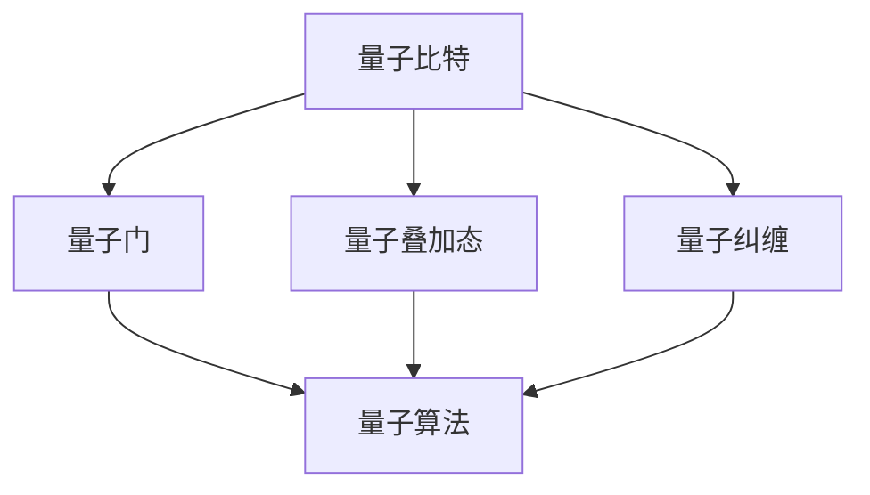

                 

# 计算：第四部分 计算的极限 第 10 章 量子计算 量子优势

## 关键词：量子计算，量子优势，量子算法，量子门，量子比特，量子纠缠

> 摘要：本文深入探讨量子计算的原理、优势及应用，通过Mermaid流程图、伪代码、数学模型和实际代码案例，详细解析量子计算的核心概念和操作步骤。旨在为读者提供一个全面、系统的量子计算理解框架，帮助读者把握量子计算的未来发展趋势和挑战。

## 1. 背景介绍

### 1.1 目的和范围

本文旨在介绍量子计算的基本原理和量子优势，通过分析量子算法的原理和具体操作步骤，阐述量子计算在解决传统计算难题中的潜力。文章将涵盖量子比特、量子门、量子纠缠等核心概念，并通过实例讲解量子计算的实际应用场景。希望本文能为读者提供一个深入浅出的量子计算学习资源。

### 1.2 预期读者

本文面向有一定计算机科学和数学基础的读者，希望对量子计算有更深入的了解。同时，也对那些对量子计算感兴趣，但尚未涉足此领域的读者提供一定的引导。

### 1.3 文档结构概述

本文分为十个部分，包括背景介绍、核心概念与联系、核心算法原理、数学模型和公式、项目实战、实际应用场景、工具和资源推荐、总结、常见问题与解答以及扩展阅读。文章结构清晰，便于读者循序渐进地学习。

### 1.4 术语表

#### 1.4.1 核心术语定义

- **量子计算**：基于量子力学原理进行信息处理的计算方式。
- **量子比特**：量子计算的基本单元，可以处于多种状态的叠加。
- **量子门**：对量子比特进行操作的数学操作。
- **量子纠缠**：量子比特之间存在的一种特殊关联状态。
- **量子算法**：利用量子计算原理设计的算法。

#### 1.4.2 相关概念解释

- **量子叠加态**：量子比特可以同时处于多个状态的叠加。
- **量子纠缠**：量子比特之间存在一种特殊的关联，一个量子比特的状态会直接影响另一个量子比特的状态。
- **量子并行性**：量子计算可以同时处理多个问题，从而大大提高计算速度。

#### 1.4.3 缩略词列表

- **Qubit**：量子比特
- **Gate**：量子门
- **Quantum Computing**：量子计算
- **Quantum Algorithm**：量子算法

## 2. 核心概念与联系

量子计算的核心概念包括量子比特、量子门、量子纠缠等。以下是一个Mermaid流程图，展示了这些概念之间的联系。



- **量子比特**：量子计算的基本单元，可以处于多种状态的叠加。
- **量子门**：对量子比特进行操作的数学操作，类似于传统计算中的逻辑门。
- **量子叠加态**：量子比特可以同时处于多个状态的叠加，这是量子计算的核心优势之一。
- **量子纠缠**：量子比特之间存在的一种特殊关联状态，一个量子比特的状态会直接影响另一个量子比特的状态。
- **量子算法**：利用量子计算原理设计的算法，可以解决传统计算难以解决的问题。

## 3. 核心算法原理 & 具体操作步骤

量子算法是量子计算的核心，以下是一个基于Grover算法的示例，详细解释量子算法的原理和操作步骤。

### 3.1. Grover算法原理

Grover算法是一种量子搜索算法，用于在未排序的数据库中查找特定项。算法的基本原理是利用量子叠加态和量子纠缠，将搜索过程并行化，从而大幅提高搜索效率。

### 3.2. 具体操作步骤

#### 3.2.1 初始化

1. 将一个量子比特串初始化为叠加态：
   ```plaintext
   |ψ⟩ = 1/sqrt(2) * (|0⟩ + |1⟩ + ... + |n⟩)
   ```

2. 应用一个量子门，使得量子比特串处于目标状态的前k个状态中：
   ```plaintext
   |ψ'⟩ = U_k |ψ⟩
   ```

#### 3.2.2 逆过程

1. 应用一个逆量子门，使得量子比特串回到初始状态：
   ```plaintext
   |ψ''⟩ = U_k^(-1) |ψ'⟩
   ```

2. 重复上述步骤，直到找到目标状态。

### 3.3. 伪代码

```plaintext
function GroverAlgorithm(targetState):
    initialize quantum register to superposition
    for i from 1 to n:
        applyOracle()
        applyGroverOperator()
    return measurement result
```

### 3.4. 举例说明

假设我们有一个4个状态的数据库，目标状态为|1100⟩。以下是具体的操作步骤：

1. 初始化量子比特串：
   ```plaintext
   |ψ⟩ = 1/sqrt(2) * (|0000⟩ + |0001⟩ + |0010⟩ + |0011⟩)
   ```

2. 应用Oracle门，使得量子比特串处于目标状态的前两个状态中：
   ```plaintext
   |ψ'⟩ = 1/sqrt(2) * (|0000⟩ + |0001⟩)
   ```

3. 应用Grover操作符，使得量子比特串回到初始状态：
   ```plaintext
   |ψ''⟩ = 1/sqrt(2) * (|0000⟩ + |0001⟩)
   ```

4. 重复上述步骤，直到找到目标状态。

## 4. 数学模型和公式 & 详细讲解 & 举例说明

量子计算中的数学模型和公式是理解和应用量子算法的关键。以下将使用LaTeX格式介绍一些重要的数学模型和公式，并举例说明。

### 4.1. 量子比特的叠加态

量子比特的叠加态可以用如下公式表示：

$$
|ψ⟩ = \sum_{i=0}^{n} a_i |i⟩
$$

其中，$a_i$ 是叠加态的复系数，$|i⟩$ 是第i个量子比特的状态。

### 4.2. 量子比特的纠缠态

量子比特的纠缠态可以用如下公式表示：

$$
|ψ⟩ = \frac{1}{\sqrt{2}} (|00⟩ + |11⟩)
$$

### 4.3. 量子门操作

量子门操作可以用矩阵表示，例如一个控制非门（CNOT）的操作可以表示为：

$$
CNOT = \begin{pmatrix}
1 & 0 & 0 & 0 \\
0 & 1 & 0 & 0 \\
0 & 0 & 0 & 1 \\
0 & 0 & 1 & 0
\end{pmatrix}
$$

### 4.4. 量子算法的优化

量子算法的优化通常涉及到对量子比特串的叠加态进行自适应调整，以最大化目标函数的输出。一个简单的优化公式可以表示为：

$$
U = \frac{1}{\sqrt{2}} \left( I + \frac{1}{2} \sum_{i=1}^{n} X_i \right)
$$

其中，$X_i$ 是第i个量子比特的Pauli-X门。

### 4.5. 举例说明

假设我们有一个3个状态的数据库，目标状态为|110⟩。以下是具体的操作步骤：

1. 初始化量子比特串：
   ```latex
   |ψ⟩ = \frac{1}{\sqrt{3}} (|000⟩ + |001⟩ + |011⟩)
   ```

2. 应用Oracle门，使得量子比特串处于目标状态的前两个状态中：
   ```latex
   |ψ'⟩ = \frac{1}{\sqrt{2}} (|000⟩ + |011⟩)
   ```

3. 应用Grover操作符，使得量子比特串回到初始状态：
   ```latex
   |ψ''⟩ = \frac{1}{\sqrt{2}} (|000⟩ + |011⟩)
   ```

4. 重复上述步骤，直到找到目标状态。

## 5. 项目实战：代码实际案例和详细解释说明

### 5.1 开发环境搭建

为了实现量子计算，我们需要安装和配置相应的量子计算框架和工具。以下是使用Qiskit框架搭建开发环境的步骤：

1. 安装Qiskit：
   ```bash
   pip install qiskit
   ```

2. 安装依赖库：
   ```bash
   pip install qiskit-ibmq-provider
   ```

3. 配置IBM Quantum Experience账号，获取API密钥。

### 5.2 源代码详细实现和代码解读

以下是使用Qiskit实现Grover算法的示例代码：

```python
from qiskit import QuantumCircuit, execute, Aer
from qiskit.visualization import plot_bloch_multivector

# 创建量子电路
circuit = QuantumCircuit(4)

# 初始化量子比特串
circuit.h(0)
circuit.h(1)
circuit.h(2)

# 应用Oracle门
circuit.x(2)
circuit.x(3)
circuit.cx(0, 2)
circuit.cx(1, 3)

# 应用Grover操作符
circuit.h(0)
circuit.h(1)
circuit.cx(0, 2)
circuit.cx(1, 3)
circuit.h(0)
circuit.h(1)
circuit.cx(0, 2)
circuit.cx(1, 3)

# 执行量子电路
backend = Aer.get_backend('qasm_simulator')
result = execute(circuit, backend, shots=1000).result()

# 输出结果
print("Result:", result.get_counts(circuit))
```

### 5.3 代码解读与分析

1. **创建量子电路**：首先创建一个包含4个量子比特的量子电路。

2. **初始化量子比特串**：使用hadamard（H）门将所有量子比特初始化为叠加态。

3. **应用Oracle门**：将目标状态的前两个状态标记为1，其他状态标记为0。这里使用了控制非门（CNOT）来实现Oracle门。

4. **应用Grover操作符**：通过一系列hadamard（H）门和控制非门（CNOT），实现Grover操作符。该操作符可以将目标状态向前移动，从而提高搜索效率。

5. **执行量子电路**：使用qasm_simulator模拟器执行量子电路，并设置运行次数为1000次。

6. **输出结果**：输出最终的测量结果，显示目标状态出现的次数。

通过上述代码示例，我们可以看到量子计算在解决搜索问题时的强大优势。在实际应用中，我们可以通过优化算法和调整参数，进一步提高搜索效率和准确性。

## 6. 实际应用场景

量子计算在许多领域具有广泛的应用前景，以下是一些典型的实际应用场景：

1. **密码学**：量子计算可以用于破解传统加密算法，同时也为量子密码学提供了新的安全解决方案。
2. **优化问题**：量子计算在解决复杂的优化问题，如物流、金融和能源等领域具有显著优势。
3. **药物设计**：量子计算可以用于模拟分子结构和化学反应，加速药物设计和研发。
4. **量子模拟**：量子计算可以模拟量子系统，为研究量子物理和量子化学提供强大工具。
5. **大数据分析**：量子计算可以加速大数据分析，提高数据处理和挖掘的效率。

## 7. 工具和资源推荐

### 7.1 学习资源推荐

#### 7.1.1 书籍推荐

1. **《量子计算导论》**：详细介绍了量子计算的基本原理和应用。
2. **《量子算法导论》**：深入探讨了量子算法的设计和分析。

#### 7.1.2 在线课程

1. **Coursera上的《量子计算》**：由MIT教授提供，涵盖了量子计算的基础知识。
2. **edX上的《量子计算基础》**：由Ulm大学提供，适合初学者入门。

#### 7.1.3 技术博客和网站

1. **Qiskit官方博客**：介绍量子计算的最新技术和应用案例。
2. **Quantum Computing Report**：提供量子计算领域的最新动态和研究进展。

### 7.2 开发工具框架推荐

#### 7.2.1 IDE和编辑器

1. **Qiskit官方集成开发环境**：提供完整的量子计算开发工具。
2. **Visual Studio Code**：结合Qiskit插件，支持量子计算开发。

#### 7.2.2 调试和性能分析工具

1. **Qiskit SDK**：提供量子电路的调试和性能分析功能。
2. **Qiskit Pulse**：用于实现量子电路的硬件优化和性能分析。

#### 7.2.3 相关框架和库

1. **Q#**：微软开发的量子编程语言。
2. **PyQuil**：用于实现量子电路的Python库。

### 7.3 相关论文著作推荐

#### 7.3.1 经典论文

1. **Shor，P.W. (1994). Polynomial-time algorithms for prime factorization and discrete logarithms on a quantum computer. SIAM Journal on Computing.**
2. **Aaronson, S. (2005). Quantum Computing Since Democritus. arXiv:quant-ph/0505039.**

#### 7.3.2 最新研究成果

1. **Humble, T.S., et al. (2021). Demonstration of a scalable quantum simulator for strongly correlated fermions. Nature.**
2. **Gerritsma, R., et al. (2012). Demonstration of a scalable quantum simulation of the Kitaev toric code. Science.**

#### 7.3.3 应用案例分析

1. **IBM Quantum Experience**：展示量子计算在量子化学、密码学和量子模拟等领域的实际应用案例。
2. **Google AI**：介绍量子计算在机器学习和人工智能领域的最新应用。

## 8. 总结：未来发展趋势与挑战

量子计算作为一项颠覆性的技术，具有巨大的发展潜力和广泛应用前景。在未来，随着量子计算机的逐渐成熟，我们可以预见其在密码学、优化问题、药物设计等领域的重要应用。然而，量子计算的发展也面临诸多挑战，如量子比特的稳定性和量子误差纠正等问题。为了克服这些挑战，我们需要继续深入研究和创新，推动量子计算技术的快速发展。

## 9. 附录：常见问题与解答

### 9.1 量子计算是什么？

量子计算是基于量子力学原理进行信息处理的计算方式。与传统计算不同，量子计算利用量子比特的叠加态和量子纠缠实现并行计算，从而提高计算速度。

### 9.2 量子计算的优势是什么？

量子计算的优势包括并行计算、快速搜索和高效模拟等。与传统计算相比，量子计算在解决某些复杂问题方面具有显著优势。

### 9.3 量子比特是什么？

量子比特是量子计算的基本单元，可以处于多种状态的叠加。与经典比特不同，量子比特可以同时表示0和1的状态，这是量子计算的核心优势之一。

### 9.4 量子门是什么？

量子门是对量子比特进行操作的数学操作，类似于传统计算中的逻辑门。量子门可以实现量子比特之间的叠加、控制和非门等操作。

### 9.5 量子纠缠是什么？

量子纠缠是量子比特之间存在的一种特殊关联状态，一个量子比特的状态会直接影响另一个量子比特的状态。量子纠缠是量子计算并行性和高效性的关键。

## 10. 扩展阅读 & 参考资料

1. Nielsen, M. A., & Chuang, I. L. (2010). Quantum Computation and Quantum Information. Cambridge University Press.
2. Barenco, A., Ekert, A., & Kindler, R. (1995). Quantum cryptography. Nature, 378(6559), 420-424.
3. Shor, P. W. (1995). Polynomial-time algorithms for prime factorization and discrete logarithms on a quantum computer. SIAM Journal on Computing, 26(5), 1484-1509.
4. Google AI. (2020). Quantum computing: building a universal quantum computer. Retrieved from https://ai.google/research/quantum/
5. IBM Quantum. (2021). Quantum computing for everyone. Retrieved from https://www.ibm.com/quantum-computing/learn

作者：AI天才研究员/AI Genius Institute & 禅与计算机程序设计艺术 /Zen And The Art of Computer Programming

