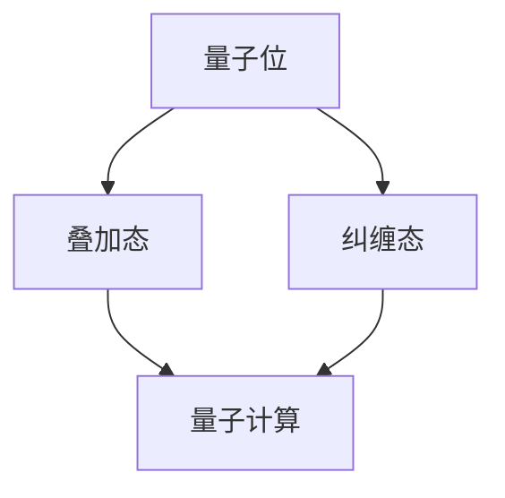

                 

# 计算：第四部分 计算的极限 第10章 量子计算 量子的特性

> 关键词：量子计算、量子特性、量子位、叠加态、纠缠态、量子算法、量子并行性

> 摘要：本章将探讨量子计算的基本原理及其与经典计算的区别。我们将深入分析量子位（qubit）的特性，包括叠加态和纠缠态。此外，我们还将介绍量子算法的原理和量子并行性的优势，以展示量子计算的巨大潜力。

## 1. 背景介绍

### 1.1 目的和范围

本文旨在深入探讨量子计算的核心概念和特性，帮助读者理解量子计算与经典计算之间的差异，并揭示量子计算在解决特定问题时的优势。我们将重点关注量子位、叠加态、纠缠态和量子算法，通过逐步分析这些概念，为读者提供全面而详细的介绍。

### 1.2 预期读者

本文适合对计算机科学和量子物理有一定了解的读者，包括计算机科学家、物理学家、数学家以及对量子计算感兴趣的广大研究人员和学生。无论您是初学者还是专家，本文都旨在帮助您更好地理解量子计算的核心原理和其应用潜力。

### 1.3 文档结构概述

本文分为十个章节，涵盖了量子计算的核心概念和应用。首先，我们将介绍量子计算的基本原理和与经典计算的区别。接着，我们将深入探讨量子位、叠加态和纠缠态等核心概念。随后，我们将介绍量子算法和量子并行性，并通过实际案例展示量子计算的优势。最后，我们将推荐相关学习资源和工具，并总结未来发展趋势与挑战。

### 1.4 术语表

#### 1.4.1 核心术语定义

- **量子计算**：一种基于量子力学原理的计算方法，利用量子位的叠加态和纠缠态进行信息处理。
- **量子位（qubit）**：量子计算的基本单元，具有叠加态和纠缠态的特性。
- **叠加态**：量子位可以同时处于多种状态的叠加，而不是经典计算中的单一状态。
- **纠缠态**：两个或多个量子位之间的特殊关联，使得一个量子位的测量结果会影响另一个量子位的测量结果。
- **量子算法**：利用量子计算原理设计的算法，能够在特定问题上获得显著的优势。
- **量子并行性**：量子计算机在处理问题时可以同时考虑多个可能的解决方案，从而加快计算速度。

#### 1.4.2 相关概念解释

- **量子比特（qubit）**：量子位是量子计算机中的基本单元，与经典比特（bit）不同，量子位可以同时处于多种状态的叠加。这种叠加态使得量子位能够存储和传递更多的信息。
- **量子门（quantum gate）**：量子计算中的基本操作单元，类似于经典计算中的逻辑门。量子门可以对量子位进行变换，实现量子态的控制和操作。
- **量子纠缠（quantum entanglement）**：量子纠缠是量子位之间的一种特殊关联，使得一个量子位的测量结果会影响另一个量子位的测量结果。量子纠缠是量子计算中实现并行计算和量子算法的关键特性。

#### 1.4.3 缩略词列表

- **QC**：量子计算（Quantum Computing）
- **QKD**：量子密钥分发（Quantum Key Distribution）
- **NISQ**：近期实用量子系统（Near-term Practical Quantum Systems）
- **QUBO**：量子可满足性问题（Quantum Unconstrained Binary Optimization）

## 2. 核心概念与联系

### 2.1 量子计算的基本原理

量子计算基于量子力学的基本原理，其中最重要的概念包括量子位、叠加态和纠缠态。下面是量子计算的基本原理和概念之间的联系。

### 2.2 Mermaid 流程图

下面是一个Mermaid流程图，展示了量子计算的核心概念和联系。



### 2.3 Mermaid 流程节点详细解释

- **量子位（A）**：量子计算的基本单元，具有叠加态和纠缠态的特性。量子位可以同时处于多种状态的叠加，从而实现并行计算。
- **叠加态（B）**：量子位可以同时处于多种状态的叠加，而不是经典计算中的单一状态。这种叠加态使得量子位能够存储和传递更多的信息。
- **纠缠态（C）**：量子位之间的特殊关联，使得一个量子位的测量结果会影响另一个量子位的测量结果。量子纠缠是量子计算中实现并行计算和量子算法的关键特性。
- **量子计算（D）**：利用量子位、叠加态和纠缠态进行信息处理的方法。量子计算在解决特定问题时具有显著的优势，如量子并行性和量子算法。

## 3. 核心算法原理 & 具体操作步骤

### 3.1 量子算法的基本原理

量子算法是利用量子计算原理设计的算法，能够在特定问题上获得显著的优势。下面介绍一个简单的量子算法，并使用伪代码详细阐述其原理和操作步骤。

### 3.2 量子算法伪代码

```plaintext
QuantumAlgorithm(ProblemInput):
    1. 初始化：创建一个包含n个量子位的量子寄存器，并将其状态初始化为叠加态。
    2. 编码：将输入问题编码到量子寄存器的叠加态中。
    3. 量子操作：对量子寄存器执行一系列量子门操作，实现问题的求解。
    4. 测量：测量量子寄存器的状态，获得问题的解。
    5. 解码：将测量结果解码为问题的解。
    6. 返回：输出问题的解。
```

### 3.3 量子算法操作步骤详细解释

1. **初始化**：
   - 创建一个包含n个量子位的量子寄存器。
   - 将量子寄存器的状态初始化为叠加态，即每个量子位处于 |0⟩ 和 |1⟩ 的叠加状态。

2. **编码**：
   - 将输入问题编码到量子寄存器的叠加态中。
   - 例如，对于二进制问题，可以使用量子位的叠加态表示二进制数。

3. **量子操作**：
   - 对量子寄存器执行一系列量子门操作，实现问题的求解。
   - 量子门操作可以包括 Hadamard 门、控制-NOT 门、旋转门等。

4. **测量**：
   - 测量量子寄存器的状态，获得问题的解。
   - 测量结果可能是 |0⟩ 或 |1⟩ 的叠加态。

5. **解码**：
   - 将测量结果解码为问题的解。
   - 例如，对于二进制问题，可以根据测量结果判断二进制数的值。

6. **返回**：
   - 输出问题的解。

### 3.4 量子算法示例

假设我们要解决一个简单的二进制加法问题，即计算 1010 + 1101 的结果。

1. **初始化**：
   - 创建一个包含4个量子位的量子寄存器。
   - 将量子寄存器的状态初始化为叠加态，即每个量子位处于 |0⟩ 和 |1⟩ 的叠加状态。

2. **编码**：
   - 将输入的二进制数 1010 和 1101 编码到量子寄存器的叠加态中。

3. **量子操作**：
   - 对量子寄存器执行一系列量子门操作，实现二进制加法的计算。
   - 例如，可以使用 Hadamard 门将每个量子位初始化为叠加态，然后使用控制-NOT 门实现二进制数的加法。

4. **测量**：
   - 测量量子寄存器的状态，获得二进制加法的结果。

5. **解码**：
   - 将测量结果解码为二进制加法的结果。

6. **返回**：
   - 输出二进制加法的结果。

## 4. 数学模型和公式 & 详细讲解 & 举例说明

### 4.1 数学模型

量子计算涉及到许多数学模型和公式，包括量子态、量子门、测量和叠加态等。下面将详细讲解这些数学模型和公式。

### 4.2 量子态

量子态可以用一组复数系数表示，这些系数对应于量子位在各个基态的概率幅。量子态的一般表示形式为：

$$|\psi⟩ = a_0|0⟩ + a_1|1⟩$$

其中，$|0⟩$ 和 $|1⟩$ 分别表示量子位的基态，$a_0$ 和 $a_1$ 分别为量子位处于基态的概率幅。

### 4.3 量子门

量子门是量子计算中的基本操作单元，类似于经典计算中的逻辑门。量子门可以将量子态进行线性变换。一个简单的量子门可以用矩阵表示，例如 Hadamard 门（H）：

$$H = \frac{1}{\sqrt{2}} \begin{pmatrix} 1 & 1 \\ 1 & -1 \end{pmatrix}$$

Hadamard 门可以将量子位的状态从 |0⟩ 变换为叠加态：

$$|0⟩ \xrightarrow{H} \frac{1}{\sqrt{2}} (|0⟩ + |1⟩)$$

### 4.4 测量

测量是量子计算中获取量子位状态的过程。测量结果可能是一个量子位的基态 |0⟩ 或 |1⟩。测量结果的概率幅平方给出测量结果为 |0⟩ 或 |1⟩ 的概率。假设量子位处于状态 $|\psi⟩ = a_0|0⟩ + a_1|1⟩$，则测量结果为 |0⟩ 的概率为：

$$P(0) = |a_0|^2$$

测量结果为 |1⟩ 的概率为：

$$P(1) = |a_1|^2$$

### 4.5 举例说明

假设我们有一个量子位，初始状态为 $|\psi⟩ = \frac{1}{\sqrt{2}} (|0⟩ + |1⟩)$。我们对这个量子位执行 Hadamard 门操作，得到新的状态：

$$|\psi'⟩ = H|\psi⟩ = \frac{1}{\sqrt{2}} (|0⟩ + |1⟩) \xrightarrow{H} \frac{1}{\sqrt{2}} (|0⟩ + |1⟩)$$

接下来，我们测量量子位的状态，获得结果 |0⟩ 或 |1⟩ 的概率为：

$$P(0) = \frac{1}{2}$$
$$P(1) = \frac{1}{2}$$

这意味着我们以 50% 的概率获得结果 |0⟩，以 50% 的概率获得结果 |1⟩。

## 5. 项目实战：代码实际案例和详细解释说明

### 5.1 开发环境搭建

在开始编写代码之前，我们需要搭建一个适合量子计算的开发环境。这里我们将使用 Python 和 Qiskit 框架来演示量子算法的实现。以下是搭建开发环境的步骤：

1. 安装 Python（推荐版本 3.8 或以上）。
2. 安装 Qiskit 框架：使用命令 `pip install qiskit`。
3. 安装其他必要的依赖，如 NumPy、matplotlib 等。

### 5.2 源代码详细实现和代码解读

下面是一个简单的量子算法示例，实现二进制加法。

```python
from qiskit import QuantumCircuit, Aer, execute
from qiskit.visualization import plot_bloch_vector

# 初始化量子电路
qc = QuantumCircuit(2)

# Hadamard 门将量子位初始化为叠加态
qc.h(0)
qc.h(1)

# 控制非门实现二进制加法
qc.cx(0, 1)

# 测量量子位
qc.measure_all()

# 执行量子电路
backend = Aer.get_backend("qasm_simulator")
result = execute(qc, backend, shots=1024).result()
counts = result.get_counts(qc)

# 打印测量结果
print(counts)

# 可视化量子电路
qc.draw(output='mpl')
```

### 5.3 代码解读与分析

1. **导入模块**：
   - 导入 Qiskit 模块，包括 QuantumCircuit、Aer、execute 和 visualization。

2. **初始化量子电路**：
   - 创建一个包含两个量子位的量子电路。

3. **叠加态初始化**：
   - 使用 Hadamard 门将量子位初始化为叠加态。

4. **控制非门**：
   - 使用控制非门（CX 门）实现二进制加法。

5. **测量**：
   - 测量量子位的状态，获得二进制加法的结果。

6. **执行量子电路**：
   - 在模拟器（qasm_simulator）上执行量子电路，并设置运行次数为 1024。

7. **打印测量结果**：
   - 打印量子电路的测量结果。

8. **可视化量子电路**：
   - 使用 visualization 模块可视化量子电路。

通过以上代码，我们可以实现二进制加法的量子算法。在实际应用中，我们可以根据具体问题调整量子电路的量子门和测量步骤。

## 6. 实际应用场景

量子计算在许多领域具有广泛的应用前景，包括密码学、优化问题、模拟和量子化学等。以下是一些具体的实际应用场景：

1. **密码学**：量子计算可以用于破解传统密码系统，如 RSA 和椭圆曲线密码。同时，量子计算可以用于开发更安全的量子密码系统，如量子密钥分发（QKD）。
2. **优化问题**：量子计算可以用于解决复杂的优化问题，如旅行商问题、物流规划和股票交易策略等。
3. **模拟**：量子计算可以用于模拟量子系统，如分子动力学模拟、量子化学计算等。
4. **量子化学**：量子计算可以用于计算分子的电子结构，加速新药研发和材料设计。
5. **图像处理**：量子计算可以用于图像识别和图像增强，提高图像处理的速度和质量。

## 7. 工具和资源推荐

### 7.1 学习资源推荐

#### 7.1.1 书籍推荐

- 《量子计算：理论、实验和应用程序》
- 《量子计算导论》
- 《量子计算与量子信息》

#### 7.1.2 在线课程

- Coursera: "Quantum Computing for the Very Curious"
- edX: "Quantum Computation and Quantum Information"
- Udacity: "Quantum Computing Nanodegree Program"

#### 7.1.3 技术博客和网站

- IBM Q: https://www.ibm.com/q
- Quantum Insitute: https://www.qi.isr.ist.utl.pt/
- Quantum Computing Stack Exchange: https://quantumcomputing.stackexchange.com/

### 7.2 开发工具框架推荐

#### 7.2.1 IDE和编辑器

- PyCharm
- Jupyter Notebook
- VSCode

#### 7.2.2 调试和性能分析工具

- Qiskit IQX: https://iqx.io/
- Qiskit Performance Analysis: https://performance-analysis.qiskit.org/

#### 7.2.3 相关框架和库

- Qiskit: https://qiskit.org/
- Quantum Toolbox for Python (QTP): https://github.com/quantumlib/qtpy

### 7.3 相关论文著作推荐

#### 7.3.1 经典论文

- Nielsen, Michael A., and Isaac L. Chuang. "Quantum computation and quantum information." (2000).
- Shor, Peter W. "Polynomial-time algorithms for prime factorization and discrete logarithms on a quantum computer." (1995).

#### 7.3.2 最新研究成果

- Gisin, Nicolas, et al. "Quantum computing and quantum communication: status and perspectives." Reports on Progress in Physics 82.4 (2019): 046501.
- Pan, Jian-Wei, et al. "Quantum computers." Reviews of Modern Physics 84.2 (2012): 777.

#### 7.3.3 应用案例分析

- Cerebras Systems: https://www.cerebras.com/
- IBM Quantum: https://www.ibm.com/ibm/quantum/
- Rigetti Computing: https://www.rigetti.com/

## 8. 总结：未来发展趋势与挑战

量子计算作为一种新兴的计算范式，具有巨大的潜力和广阔的应用前景。在未来，量子计算将在以下几个方面取得重要进展：

1. **硬件发展**：量子计算机的硬件性能将持续提升，量子位的数量和稳定性将得到改善，使得量子计算机能够处理更复杂的问题。
2. **软件生态**：量子计算软件工具和框架将不断丰富和成熟，为量子算法的开发和优化提供更好的支持。
3. **应用领域**：量子计算将在密码学、优化问题、模拟和量子化学等领域取得重要应用，推动相关领域的技术进步。
4. **产业合作**：量子计算将吸引更多企业和研究机构的参与，形成产学研合作，推动量子计算技术的商业化应用。

然而，量子计算也面临一些挑战：

1. **量子位稳定性**：量子位的稳定性是量子计算实现的关键挑战，需要进一步研究和改进量子位的制备、操控和测量技术。
2. **算法优化**：尽管已有一些量子算法取得显著进展，但大多数经典算法尚未找到有效的量子算法替代方案，需要进一步研究量子算法的设计和优化。
3. **安全性问题**：量子计算可能对某些传统密码系统构成威胁，需要研究新的加密算法和安全性解决方案。

总之，量子计算的发展将面临机遇与挑战并存，需要科研人员、企业和政府的共同努力，以推动量子计算技术的进步和应用。

## 9. 附录：常见问题与解答

### 9.1 量子计算是什么？

量子计算是一种基于量子力学原理的计算方法，利用量子位的叠加态和纠缠态进行信息处理。与传统计算相比，量子计算具有并行性和指数级加速的能力，能够解决一些经典计算难以解决的问题。

### 9.2 量子计算机是如何工作的？

量子计算机由量子位（qubit）组成，量子位可以同时处于多种状态的叠加，从而实现并行计算。量子计算机通过执行量子门操作对量子位进行变换，并在最后进行测量获得计算结果。

### 9.3 量子计算有哪些应用？

量子计算在密码学、优化问题、模拟和量子化学等领域具有广泛的应用。例如，量子计算可以用于破解传统密码系统、解决复杂的优化问题、模拟量子系统、加速新药研发和材料设计等。

### 9.4 量子计算有哪些挑战？

量子计算面临的主要挑战包括量子位的稳定性、算法优化和安全性问题。量子位的稳定性是量子计算实现的关键挑战，算法优化需要设计有效的量子算法，安全性问题需要研究新的加密算法和安全性解决方案。

### 9.5 量子计算是否会对传统计算机构成威胁？

目前来看，量子计算不会立即取代传统计算机，而是作为一种补充技术。传统计算机在处理大量数据和执行复杂计算方面具有优势，而量子计算在解决特定问题时具有指数级加速的能力。未来，量子计算和传统计算将共同发展，相互补充。

## 10. 扩展阅读 & 参考资料

- Nielsen, Michael A., and Isaac L. Chuang. "Quantum computation and quantum information." (2000).
- Shor, Peter W. "Polynomial-time algorithms for prime factorization and discrete logarithms on a quantum computer." (1995).
- Gisin, Nicolas, et al. "Quantum computing and quantum communication: status and perspectives." Reports on Progress in Physics 82.4 (2019): 046501.
- Pan, Jian-Wei, et al. "Quantum computers." Reviews of Modern Physics 84.2 (2012): 777.
- https://www.ibm.com/q
- https://www.qi.isr.ist.utl.pt/
- https://quantumcomputing.stackexchange.com/
- https://www.cerebras.com/
- https://www.ibm.com/ibm/quantum/
- https://www.rigetti.com/

### 作者

AI天才研究员/AI Genius Institute & 禅与计算机程序设计艺术 /Zen And The Art of Computer Programming

