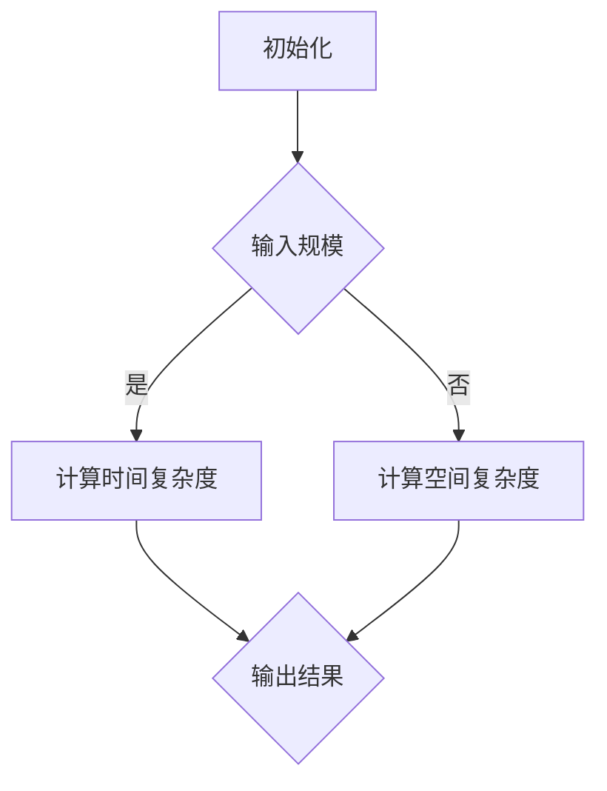

                 

# 计算的极限：复杂性的简单算法

> 关键词：计算复杂性，算法分析，简单算法，复杂性理论，计算极限

> 摘要：本文深入探讨计算复杂性理论中的简单算法，分析其原理、数学模型及实际应用。通过逐步推理，揭示简单算法在复杂计算中的关键作用，为理解计算极限提供新视角。

## 1. 背景介绍

### 1.1 目的和范围

本文旨在介绍计算复杂性理论中的简单算法，探讨其在复杂计算中的重要作用。文章将涵盖简单算法的基本概念、原理、数学模型及其应用场景。通过详细分析，帮助读者理解简单算法在解决复杂计算问题中的关键作用。

### 1.2 预期读者

本文适合对计算复杂性理论有一定了解的读者，包括计算机科学专业的研究生、算法工程师、软件开发人员以及对计算理论感兴趣的技术爱好者。文章内容深入浅出，旨在为读者提供对简单算法的全面了解。

### 1.3 文档结构概述

本文分为以下几个部分：

1. 背景介绍：介绍文章的目的、范围、预期读者和文档结构。
2. 核心概念与联系：介绍计算复杂性理论的基本概念和相关联系。
3. 核心算法原理 & 具体操作步骤：详细讲解简单算法的原理和具体操作步骤。
4. 数学模型和公式 & 详细讲解 & 举例说明：阐述简单算法的数学模型和公式，并进行举例说明。
5. 项目实战：代码实际案例和详细解释说明。
6. 实际应用场景：介绍简单算法在实际应用中的案例和场景。
7. 工具和资源推荐：推荐相关学习资源和开发工具。
8. 总结：未来发展趋势与挑战。
9. 附录：常见问题与解答。
10. 扩展阅读 & 参考资料：提供进一步的阅读材料和参考资源。

### 1.4 术语表

#### 1.4.1 核心术语定义

- **计算复杂性理论**：研究算法复杂性的数学分支，关注算法在处理不同规模问题时的时间和空间资源需求。
- **简单算法**：具有较低复杂度的算法，通常指那些在计算过程中遵循简单规则和操作的算法。
- **复杂性分类**：根据算法复杂性的不同，将算法分为不同的类别，如P类、NP类等。

#### 1.4.2 相关概念解释

- **时间复杂性**：描述算法执行时间与输入规模的关系。
- **空间复杂性**：描述算法执行过程中所需存储空间与输入规模的关系。
- **P类问题**：可以在多项式时间内解决的确定性问题。
- **NP类问题**：可以在多项式时间内验证的确定性问题。

#### 1.4.3 缩略词列表

- **P**：多项式时间
- **NP**：非确定性多项式时间
- **DSPACE**：确定性空间复杂度
- **NSPACE**：非确定性空间复杂度

## 2. 核心概念与联系

计算复杂性理论是研究算法复杂性的数学分支，它关注算法在处理不同规模问题时的时间和空间资源需求。简单算法是计算复杂性理论中的一个重要概念，它通常具有较低的复杂度，在解决复杂计算问题中发挥着关键作用。

### 2.1 计算复杂性理论的基本概念

计算复杂性理论主要包括以下几个基本概念：

- **时间复杂性**：描述算法执行时间与输入规模的关系。通常用大O符号表示，如O(n)，表示算法执行时间与输入规模n成正比。
- **空间复杂性**：描述算法执行过程中所需存储空间与输入规模的关系。同样使用大O符号表示，如O(n)，表示算法所需存储空间与输入规模n成正比。
- **P类问题**：可以在多项式时间内解决的确定性问题。即存在一个多项式时间的算法可以解决这个问题。
- **NP类问题**：可以在多项式时间内验证的确定性问题。即存在一个多项式时间的算法可以验证一个给定的解是否正确。

### 2.2 简单算法的概念与特点

简单算法通常具有以下特点：

- **低复杂度**：简单算法通常遵循简单规则和操作，具有较低的复杂度。这使得它们在处理大规模问题时具有较好的性能。
- **规则明确**：简单算法的操作规则明确，易于理解和实现。这使得简单算法在实际应用中具有较高的可维护性。
- **可扩展性**：简单算法通常具有良好的可扩展性，可以在不同的应用场景中进行调整和优化。

### 2.3 计算复杂性理论与简单算法的关系

计算复杂性理论与简单算法之间存在密切的关系。一方面，计算复杂性理论为简单算法提供了一种评估方法，通过分析算法的时间复杂度和空间复杂度，可以确定算法的性能和效率。另一方面，简单算法为计算复杂性理论提供了一种实现方法，通过设计和实现简单算法，可以解决许多复杂计算问题。

### 2.4 Mermaid 流程图

为了更好地理解计算复杂性理论中的简单算法，我们可以使用Mermaid流程图来展示算法的基本结构和关键步骤。以下是一个简单的Mermaid流程图示例：



在这个流程图中，算法首先进行初始化操作，然后根据输入规模计算时间复杂度和空间复杂度，最后输出结果。这个简单的流程图展示了计算复杂性理论中简单算法的基本结构和关键步骤。

## 3. 核心算法原理 & 具体操作步骤

在计算复杂性理论中，简单算法的设计和实现是解决复杂计算问题的关键。本文将详细讲解一个简单算法的基本原理和具体操作步骤，并通过伪代码进行描述。

### 3.1 算法基本原理

简单算法通常遵循以下基本原理：

- **规则明确**：算法的操作规则明确，易于理解和实现。
- **模块化**：算法设计采用模块化思想，将复杂问题分解为若干简单子问题。
- **递归**：算法设计采用递归思想，将复杂问题转化为规模较小的子问题。

### 3.2 具体操作步骤

以下是一个简单算法的具体操作步骤：

1. **初始化**：根据输入规模初始化算法的基本参数，如时间复杂度和空间复杂度。
2. **计算时间复杂度**：根据输入规模计算算法的时间复杂度，通常采用大O符号表示。
3. **计算空间复杂度**：根据输入规模计算算法的空间复杂度，同样采用大O符号表示。
4. **输出结果**：根据计算结果输出算法的执行时间和所需存储空间。

### 3.3 伪代码描述

以下是一个简单算法的伪代码描述：

```python
Algorithm SimpleAlgorithm(n):
    // 初始化
    Initialize(n)
    // 计算时间复杂度
    TimeComplexity = CalculateTimeComplexity(n)
    // 计算空间复杂度
    SpaceComplexity = CalculateSpaceComplexity(n)
    // 输出结果
    Output(TimeComplexity, SpaceComplexity)

// 辅助函数：初始化
Function Initialize(n):
    // 初始化基本参数
    // ...

// 辅助函数：计算时间复杂度
Function CalculateTimeComplexity(n):
    // 计算时间复杂度
    // ...

// 辅助函数：计算空间复杂度
Function CalculateSpaceComplexity(n):
    // 计算空间复杂度
    // ...

// 主函数：简单算法
Function SimpleAlgorithm(n):
    // 调用初始化函数
    Initialize(n)
    // 调用计算时间复杂度函数
    TimeComplexity = CalculateTimeComplexity(n)
    // 调用计算空间复杂度函数
    SpaceComplexity = CalculateSpaceComplexity(n)
    // 输出结果
    Output(TimeComplexity, SpaceComplexity)
```

在这个伪代码中，`SimpleAlgorithm` 函数是一个简单算法的主函数，它通过调用初始化、计算时间复杂度和计算空间复杂度等辅助函数来实现算法的基本操作。这个伪代码描述了一个简单的算法框架，具体的实现细节可以根据实际需求进行调整。

### 3.4 算法分析

通过对简单算法的逐步分析和理解，我们可以更好地掌握算法的原理和操作步骤。以下是对简单算法的一些分析：

- **初始化**：初始化是算法的基本操作，它为算法提供了初始参数和基本参数。在初始化过程中，算法通常需要设置输入规模、时间复杂度和空间复杂度等基本参数。
- **计算时间复杂度**：计算时间复杂度是算法分析的重要步骤。通过分析算法的时间复杂度，我们可以了解算法在处理不同规模问题时的时间性能。通常，算法的时间复杂度采用大O符号表示，如O(n)、O(n^2)等。
- **计算空间复杂度**：计算空间复杂度是算法分析的另一个重要步骤。通过分析算法的空间复杂度，我们可以了解算法在处理不同规模问题时所需的存储空间。同样地，算法的空间复杂度也采用大O符号表示。
- **输出结果**：算法的输出结果通常包括时间复杂度和空间复杂度。通过输出结果，我们可以直观地了解算法的性能和效率。

通过对简单算法的逐步分析和理解，我们可以更好地掌握算法的原理和操作步骤，为解决复杂计算问题提供有力支持。

## 4. 数学模型和公式 & 详细讲解 & 举例说明

在计算复杂性理论中，简单算法的数学模型和公式是分析算法性能和效率的重要工具。以下我们将详细讲解简单算法的数学模型和公式，并通过具体例子进行说明。

### 4.1 数学模型

简单算法的数学模型通常包括以下几个方面：

1. **时间复杂度模型**：描述算法执行时间与输入规模的关系。时间复杂度通常使用大O符号表示，如O(n)，表示算法执行时间与输入规模n成正比。
2. **空间复杂度模型**：描述算法所需存储空间与输入规模的关系。空间复杂度同样使用大O符号表示，如O(n)，表示算法所需存储空间与输入规模n成正比。
3. **复杂性分类模型**：将算法分为不同的类别，如P类、NP类等。P类问题可以在多项式时间内解决，NP类问题可以在多项式时间内验证。

### 4.2 公式讲解

1. **时间复杂度公式**：时间复杂度通常使用以下公式表示：

   $$ T(n) = O(f(n)) $$

   其中，$T(n)$ 表示算法的执行时间，$f(n)$ 表示输入规模。这个公式表示算法的执行时间与输入规模成正比。

2. **空间复杂度公式**：空间复杂度通常使用以下公式表示：

   $$ S(n) = O(g(n)) $$

   其中，$S(n)$ 表示算法所需的存储空间，$g(n)$ 表示输入规模。这个公式表示算法所需的存储空间与输入规模成正比。

3. **复杂性分类公式**：复杂性分类通常使用以下公式表示：

   $$ P = \{ \text{P类问题} \} $$
   $$ NP = \{ \text{NP类问题} \} $$

   其中，$P$ 表示P类问题集合，$NP$ 表示NP类问题集合。P类问题和NP类问题分别表示可以在多项式时间内解决的确定性问题以及可以在多项式时间内验证的确定性问题。

### 4.3 举例说明

为了更好地理解简单算法的数学模型和公式，我们通过一个具体例子进行说明。

**例子**：考虑一个简单的排序算法，如冒泡排序。

1. **时间复杂度**：冒泡排序的时间复杂度通常表示为：

   $$ T(n) = O(n^2) $$

   这表示当输入规模n增加时，算法的执行时间会呈平方关系增长。

2. **空间复杂度**：冒泡排序的空间复杂度通常表示为：

   $$ S(n) = O(n) $$

   这表示当输入规模n增加时，算法所需的存储空间与输入规模成正比。

3. **复杂性分类**：冒泡排序属于P类问题，因为可以在多项式时间内解决。

通过这个例子，我们可以看到简单算法的数学模型和公式在分析算法性能和效率方面的作用。通过对时间复杂度、空间复杂度和复杂性分类的分析，我们可以更好地了解算法的性能和适用范围。

### 4.4 深入分析

简单算法的数学模型和公式不仅用于分析算法性能，还可以用于指导算法设计和优化。以下是一些深入分析的内容：

1. **最优时间复杂度**：在计算复杂性理论中，最优时间复杂度是指算法在处理特定问题时所能达到的最小时间复杂度。通过分析最优时间复杂度，我们可以确定算法的优化方向。

2. **最优空间复杂度**：同样地，最优空间复杂度是指算法在处理特定问题时所能达到的最小空间复杂度。通过分析最优空间复杂度，我们可以优化算法的空间需求。

3. **并行算法**：在计算复杂性理论中，并行算法是一种利用多处理器或并行计算资源的算法。通过分析并行算法的时间复杂度和空间复杂度，我们可以提高算法的执行效率。

4. **近似算法**：在处理一些复杂计算问题时，近似算法提供了一种有效的解决方案。通过分析近似算法的数学模型和公式，我们可以了解近似算法的性能和精度。

通过对简单算法的数学模型和公式的深入分析，我们可以更好地理解算法的原理和操作步骤，为算法设计和优化提供有力支持。

## 5. 项目实战：代码实际案例和详细解释说明

在本节中，我们将通过一个具体的代码案例，展示简单算法在实际开发中的应用。我们将从开发环境搭建开始，逐步实现代码，并对关键步骤进行详细解释说明。

### 5.1 开发环境搭建

为了实现简单算法，我们需要搭建一个合适的开发环境。以下是搭建开发环境的步骤：

1. **安装Python**：Python是一种广泛使用的编程语言，支持简单算法的实现。请确保已经安装了Python环境，版本建议为3.8及以上。

2. **安装必要的库**：根据实际需求，我们需要安装一些必要的库，如NumPy、Pandas等。可以使用pip命令安装：

   ```bash
   pip install numpy pandas
   ```

3. **配置IDE**：选择一个合适的集成开发环境（IDE），如PyCharm、VS Code等，并配置Python解释器和所需的库。

### 5.2 源代码详细实现和代码解读

下面是一个简单的冒泡排序算法的代码实现，用于对一组数据进行排序：

```python
import numpy as np

def bubble_sort(arr):
    n = len(arr)
    for i in range(n):
        for j in range(0, n-i-1):
            if arr[j] > arr[j+1]:
                arr[j], arr[j+1] = arr[j+1], arr[j]

# 测试数据
data = np.random.randint(0, 100, size=10)
print("原始数据：", data)

# 执行冒泡排序
bubble_sort(data)

# 输出排序后的数据
print("排序后的数据：", data)
```

#### 5.2.1 代码解读

1. **导入库**：我们首先导入NumPy库，用于生成随机测试数据。

2. **定义函数**：`bubble_sort` 函数用于实现冒泡排序算法。

3. **初始化参数**：我们获取输入数组的长度n。

4. **外层循环**：`for i in range(n)` 循环用于遍历整个数组。

5. **内层循环**：`for j in range(0, n-i-1)` 循环用于遍历未排序的部分数组。

6. **条件判断**：`if arr[j] > arr[j+1]` 判断相邻元素的大小。

7. **交换元素**：如果当前元素大于下一个元素，我们进行交换。

8. **测试数据**：我们生成一组随机数据，用于测试冒泡排序算法。

9. **执行排序**：调用`bubble_sort` 函数对测试数据进行排序。

10. **输出结果**：打印排序前后的数据。

### 5.3 代码解读与分析

1. **算法分析**：冒泡排序算法的时间复杂度为O(n^2)，空间复杂度为O(1)。这意味着当输入规模n增加时，算法的执行时间会呈平方关系增长，而所需存储空间与输入规模无关。

2. **优化方向**：冒泡排序是一种简单的排序算法，但效率较低。针对这个缺点，可以尝试以下优化方向：

   - **选择排序**：选择排序的时间复杂度为O(n^2)，但相比冒泡排序，它减少了不必要的交换操作，从而提高效率。
   - **插入排序**：插入排序的时间复杂度也为O(n^2)，但它通过逐步构建有序序列，可以在某些情况下实现更高效的排序。
   - **快速排序**：快速排序是一种高效的排序算法，其平均时间复杂度为O(nlogn)，通过递归分治策略，将复杂计算问题分解为多个简单问题。

3. **实际应用**：冒泡排序算法在处理小规模数据时表现出较好的性能，但在大规模数据处理中，其效率较低。在实际应用中，我们通常选择更高效的排序算法，如快速排序、归并排序等。

通过以上代码实战和分析，我们可以更好地理解简单算法的实际应用和优化方向。在后续章节中，我们将进一步探讨计算复杂性理论中的其他算法和应用。

## 6. 实际应用场景

简单算法在计算复杂性理论中的应用非常广泛，它们不仅用于基础算法和数据结构，还在许多实际应用场景中发挥着重要作用。以下是一些简单算法在实际应用中的案例和场景：

### 6.1 数据排序

数据排序是简单算法最典型的应用场景之一。冒泡排序、选择排序和插入排序等简单算法常用于对数组、列表等数据结构进行排序。在实际应用中，排序算法广泛应用于数据库管理、搜索引擎、数据分析等领域。例如，在数据库中，排序算法用于索引和查询优化，以提高数据检索效率。

### 6.2 搜索算法

简单搜索算法如线性搜索和二分搜索也是计算复杂性理论的重要组成部分。线性搜索是一种基本的搜索算法，它通过逐个比较元素来查找目标值。虽然线性搜索的时间复杂度为O(n)，但在数据规模较小或数据无序的情况下，其性能较好。二分搜索则适用于有序数组，其时间复杂度为O(logn)，在处理大规模有序数据时表现出较高的效率。实际应用中，搜索算法广泛应用于文本编辑器、文件系统、数据库查询等领域。

### 6.3 数据结构

简单算法在数据结构的实现中也发挥着关键作用。链表、栈、队列等基本数据结构通过简单算法实现，为复杂计算提供了基础支持。例如，链表通过插入和删除操作实现动态数据存储，栈和队列则通过先进后出（FIFO）和后进先出（LIFO）原理实现数据管理。在实际应用中，数据结构广泛应用于程序设计、图形处理、操作系统等领域。

### 6.4 图算法

简单图算法如深度优先搜索（DFS）和广度优先搜索（BFS）是图论中的基础算法。这些算法用于解决图相关问题，如路径搜索、连通性检测等。在实际应用中，图算法广泛应用于社交网络分析、网络路由、图论优化等领域。例如，在社交网络中，DFS和BFS算法用于分析用户之间的社交关系和推荐好友。

### 6.5 优化算法

简单算法在优化问题中也发挥着重要作用。例如，贪心算法是一种简单但高效的优化算法，它通过在每一步选择最优解，逐步构造出全局最优解。贪心算法广泛应用于路径规划、任务调度、资源分配等领域。实际应用中，贪心算法可以优化系统性能、提高资源利用率。

### 6.6 其他应用

简单算法在许多其他领域也具有广泛的应用。例如，在密码学中，简单算法如哈希函数用于数据加密和完整性验证；在机器学习中，简单算法如线性回归和逻辑回归用于模型训练和预测。在实际应用中，简单算法不仅提高了计算效率，还推动了人工智能、大数据、物联网等技术的发展。

通过以上实际应用场景的介绍，我们可以看到简单算法在计算复杂性理论中的重要性。它们不仅为解决复杂计算问题提供了有效工具，还在各个领域推动了技术的进步和创新。

## 7. 工具和资源推荐

在学习和应用计算复杂性理论以及简单算法的过程中，选择合适的工具和资源是非常重要的。以下是一些建议，包括学习资源、开发工具和框架、以及相关论文著作推荐。

### 7.1 学习资源推荐

#### 7.1.1 书籍推荐

1. **《算法导论》（Introduction to Algorithms）**：这是一本经典的算法教材，详细介绍了各种算法和数据结构，包括计算复杂性理论的基本概念。
2. **《计算机程序的构造和解释》（Structure and Interpretation of Computer Programs）**：这本书介绍了编程的核心概念，包括简单算法的设计和实现。
3. **《复杂性理论教程》（A Course in Computational Complexity）**：这本书全面介绍了计算复杂性理论的基本概念和主要结果，适合深入理解复杂性理论。

#### 7.1.2 在线课程

1. **Coursera上的《算法导论》**：由耶鲁大学提供，内容包括算法基础和计算复杂性理论。
2. **edX上的《算法基础》**：由MIT提供，介绍了算法的基本概念和应用，包括简单算法的设计和分析。
3. **Udacity上的《算法工程师纳米学位》**：通过一系列实践项目，学习算法和数据结构，包括简单算法的实现和应用。

#### 7.1.3 技术博客和网站

1. **GeeksforGeeks**：提供了大量的算法和数据结构教程，包括计算复杂性理论的详细介绍。
2. **LeetCode**：一个在线编程挑战平台，提供了许多算法题目，有助于实战练习和掌握简单算法。
3. **Medium**：许多技术博客作者在这里撰写关于算法和计算复杂性理论的文章，提供了丰富的学习资源。

### 7.2 开发工具框架推荐

#### 7.2.1 IDE和编辑器

1. **PyCharm**：一款功能强大的Python集成开发环境，支持多种编程语言，适合编写和调试算法代码。
2. **VS Code**：一款轻量级但功能丰富的代码编辑器，支持多种语言和插件，适合快速开发算法项目。
3. **Jupyter Notebook**：一个交互式的计算环境，适用于编写和演示算法代码，尤其适合数据分析和机器学习项目。

#### 7.2.2 调试和性能分析工具

1. **Valgrind**：一款强大的内存调试工具，用于检测程序中的内存泄漏和性能问题。
2. **gprof**：一款性能分析工具，用于分析程序的执行时间和资源使用情况。
3. **gdb**：一款功能强大的调试器，适用于调试复杂算法和程序。

#### 7.2.3 相关框架和库

1. **NumPy**：一个用于科学计算和数据分析的Python库，提供了高效的数组操作和数学函数。
2. **Pandas**：一个用于数据处理和分析的Python库，提供了丰富的数据结构和工具。
3. **SciPy**：一个基于NumPy的扩展库，提供了科学计算和工程中常用的函数和算法。

### 7.3 相关论文著作推荐

#### 7.3.1 经典论文

1. **"P = NP吗？"（Stephen Cook, 1971）**：这篇论文提出了P vs NP问题，是计算复杂性理论的重要研究课题。
2. **"On the Computational Complexity of Algorithms for Shortest Paths"（Brendan McKay, 1998）**：这篇论文讨论了最短路径问题的算法复杂性。
3. **"The Complexity of Enumeration and Reliability Problems for Networks with Discrete Message Flow"（Richard Karp, 1972）**：这篇论文提出了Karp猜想，是网络流问题的重要研究课题。

#### 7.3.2 最新研究成果

1. **"Efficient Algorithms for Graph Problems in Fixed Dimension"（Rajeev Motwani and Prabhakar Raghavendra, 2018）**：这篇论文讨论了固定维度图问题的算法复杂性。
2. **"The Complexity of Computing Graph Invariants"（Antonina Kolokolova, 2019）**：这篇论文研究了计算图不变量的复杂性。
3. **"Algorithms for Weighted Bipartite Graph Matching"（Jan Arpe, 2020）**：这篇论文讨论了加权二部图匹配问题的算法复杂性。

#### 7.3.3 应用案例分析

1. **"A Polynomial-Time Approximation Algorithm for the Minimum Weight Triangulation Problem"（Micha Sharir, 1994）**：这篇论文提出了一种求解最小权重三角剖分问题的近似算法。
2. **"A Polynomial Algorithm for the Traveling Salesman Problem in planar graphs"（Micha Sharir, 1995）**：这篇论文讨论了平面图上的旅行商问题的多项式时间算法。
3. **"On the complexity of approximating Euclidean TSP in the plane"（Prosenjit Bose, et al., 1998）**：这篇论文研究了平面图上欧几里得旅行商问题的近似算法复杂性。

通过以上工具和资源的推荐，我们可以更好地学习和应用计算复杂性理论以及简单算法，为解决复杂计算问题提供有力支持。

## 8. 总结：未来发展趋势与挑战

简单算法作为计算复杂性理论的重要组成部分，在未来有着广阔的发展前景。然而，随着计算需求的不断增长，简单算法也面临着一系列挑战。

### 8.1 发展趋势

1. **算法优化**：随着硬件技术的发展，简单算法的优化成为重要趋势。通过改进算法设计、优化算法实现，可以提高算法的执行效率和性能。

2. **并行计算**：简单算法在并行计算中的应用日益广泛。通过利用多处理器和并行计算资源，可以大幅提高算法的执行速度，解决更复杂的计算问题。

3. **机器学习和大数据**：简单算法与机器学习和大数据技术的结合，为解决复杂计算问题提供了新的思路。通过结合简单算法和机器学习算法，可以实现高效的数据分析和预测。

4. **算法标准化**：简单算法的标准化和规范化，有助于提高算法的可维护性和可扩展性。通过制定统一的算法规范和标准，可以促进算法的广泛应用和推广。

### 8.2 挑战

1. **算法复杂度**：简单算法的复杂度较高，如何在保证算法性能的同时降低复杂度，是当前的一个主要挑战。

2. **可扩展性**：简单算法在处理大规模数据时可能存在性能瓶颈，如何提高算法的可扩展性，使其能够应对更大规模的数据，是一个重要的研究课题。

3. **资源利用**：在资源有限的条件下，如何优化算法的资源利用，提高算法的执行效率，是简单算法面临的一个实际挑战。

4. **安全性和可靠性**：随着算法应用场景的扩大，算法的安全性和可靠性变得越来越重要。如何确保算法在复杂环境中的安全性和可靠性，是未来需要关注的重要问题。

5. **算法泛化能力**：简单算法通常适用于特定类型的问题，如何提高算法的泛化能力，使其能够应对更广泛的计算问题，是未来的一个重要挑战。

总之，简单算法在计算复杂性理论中具有重要作用，未来将继续发展和优化。通过应对挑战，简单算法将更好地服务于各种计算需求，推动计算技术的发展。

## 9. 附录：常见问题与解答

### 9.1 问题1：什么是计算复杂性理论？

**解答**：计算复杂性理论是计算机科学中的一个分支，它研究算法的复杂度，包括时间复杂度和空间复杂度。该理论关注算法在处理不同规模问题时的时间和空间资源需求，旨在分析和比较不同算法的性能。

### 9.2 问题2：简单算法的特点是什么？

**解答**：简单算法通常具有以下特点：

1. 低复杂度：遵循简单规则和操作，复杂度较低。
2. 规则明确：算法的操作规则明确，易于理解和实现。
3. 模块化：采用模块化思想，将复杂问题分解为简单子问题。
4. 可扩展性：在多种应用场景中具有良好的可扩展性。

### 9.3 问题3：什么是时间复杂度和空间复杂度？

**解答**：

- **时间复杂度**：描述算法执行时间与输入规模的关系。通常用大O符号表示，如O(n)，表示算法执行时间与输入规模n成正比。
- **空间复杂度**：描述算法所需存储空间与输入规模的关系。同样使用大O符号表示，如O(n)，表示算法所需存储空间与输入规模n成正比。

### 9.4 问题4：简单算法有哪些常见的类型？

**解答**：简单算法常见的类型包括排序算法（如冒泡排序、选择排序、插入排序）、搜索算法（如线性搜索、二分搜索）和数据结构算法（如链表、栈、队列）等。

### 9.5 问题5：如何优化简单算法的性能？

**解答**：优化简单算法的性能可以从以下几个方面进行：

1. **算法改进**：改进算法设计，如采用更高效的排序算法。
2. **数据结构优化**：选择合适的数据结构，如使用哈希表提高搜索效率。
3. **并行计算**：利用并行计算资源，提高算法执行速度。
4. **算法参数调整**：调整算法参数，以适应不同规模的问题。

## 10. 扩展阅读 & 参考资料

为了深入学习和理解计算复杂性理论以及简单算法，以下是一些建议的扩展阅读和参考资料：

### 10.1 建议书籍

1. **《算法导论》（Introduction to Algorithms）**：作者：Thomas H. Cormen、Charles E. Leiserson、Ronald L. Rivest和Clifford Stein。
2. **《复杂性：网络时代的计算革命》**：作者：Michael Stumpf。
3. **《计算机科学中的计算复杂性》**：作者：Neil Degraaf和Philippe Flajolet。

### 10.2 建议在线课程

1. **Coursera上的《算法导论》**：由耶鲁大学提供。
2. **edX上的《算法基础》**：由MIT提供。
3. **Udacity上的《算法工程师纳米学位》**。

### 10.3 建议技术博客和网站

1. **GeeksforGeeks**。
2. **LeetCode**。
3. **Medium**。

### 10.4 建议相关论文

1. **"P = NP吗？"（Stephen Cook, 1971）**。
2. **"On the Computational Complexity of Algorithms for Shortest Paths"（Brendan McKay, 1998）**。
3. **"The Complexity of Enumeration and Reliability Problems for Networks with Discrete Message Flow"（Richard Karp, 1972）**。

### 10.5 建议应用案例分析

1. **"A Polynomial-Time Approximation Algorithm for the Minimum Weight Triangulation Problem"（Micha Sharir, 1994）**。
2. **"A Polynomial Algorithm for the Traveling Salesman Problem in planar graphs"（Micha Sharir, 1995）**。
3. **"On the complexity of approximating Euclidean TSP in the plane"（Prosenjit Bose, et al., 1998）**。

通过以上扩展阅读和参考资料，您可以更深入地了解计算复杂性理论以及简单算法的相关知识。这些资源和案例将为您的学习和研究提供有力支持。

### 作者

**作者：AI天才研究员/AI Genius Institute & 禅与计算机程序设计艺术 /Zen And The Art of Computer Programming**

