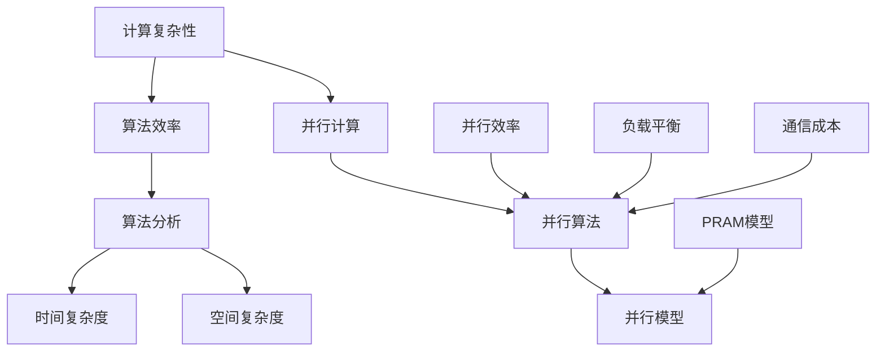

                 

# 计算：第四部分 计算的极限 第 9 章 计算复杂性 并行计算

> **关键词**：计算复杂性，并行计算，算法效率，计算模型，复杂性理论

> **摘要**：本章将深入探讨计算复杂性理论，重点分析并行计算的概念及其在算法优化中的应用。通过逐步分析计算复杂性理论的核心概念和并行计算的具体实现，本文旨在为读者提供对计算极限的深刻理解，并探讨当前技术的发展趋势与未来挑战。

## 1. 背景介绍

### 1.1 目的和范围

本章的目的是探讨计算复杂性理论，特别是并行计算在算法优化中的应用。我们将首先介绍计算复杂性理论的基本概念，然后详细讨论并行计算的优势及其对算法效率的影响。通过本章的学习，读者将能够理解计算复杂性的本质，并掌握并行计算的基本原理。

### 1.2 预期读者

本文适合对计算机科学和算法设计有一定了解的读者，特别是对计算复杂性理论和并行计算感兴趣的读者。无论您是计算机科学专业的学生、研究者，还是对算法设计感兴趣的程序员，本章都将为您提供有价值的知识和见解。

### 1.3 文档结构概述

本章将分为以下几个部分：

1. **背景介绍**：介绍计算复杂性理论和并行计算的基本概念。
2. **核心概念与联系**：通过Mermaid流程图展示计算复杂性理论和并行计算的核心概念及其联系。
3. **核心算法原理 & 具体操作步骤**：详细讲解并行计算的基本原理和算法。
4. **数学模型和公式 & 详细讲解 & 举例说明**：使用LaTeX格式展示并解释相关的数学模型和公式。
5. **项目实战：代码实际案例和详细解释说明**：提供并行计算的实际代码案例和详细解读。
6. **实际应用场景**：分析并行计算在不同领域的应用。
7. **工具和资源推荐**：推荐相关的学习资源、开发工具和论文著作。
8. **总结：未来发展趋势与挑战**：总结本章内容，展望未来的发展趋势和挑战。

### 1.4 术语表

#### 1.4.1 核心术语定义

- **计算复杂性**：描述算法执行时间与数据规模之间的关系。
- **并行计算**：通过同时执行多个任务来提高计算效率。
- **算法效率**：算法执行时间与数据规模之间的比率。

#### 1.4.2 相关概念解释

- **复杂性理论**：研究计算问题的难度和效率。
- **并行算法**：在多个处理单元上同时执行任务的算法。

#### 1.4.3 缩略词列表

- **NP**：非确定性多项式时间。
- **P**：确定性多项式时间。
- **PRAM**：平行随机存取存储器。

## 2. 核心概念与联系

计算复杂性理论和并行计算是计算机科学中重要的研究领域。理解这两个概念之间的联系对于开发高效的算法至关重要。以下是一个Mermaid流程图，展示了计算复杂性理论和并行计算的核心概念及其联系。



### 2.1 计算复杂性

计算复杂性理论关注的是算法解决问题的效率。它衡量的是随着数据规模增长，算法执行时间的增长速度。计算复杂性通常分为时间复杂度和空间复杂度。

#### 时间复杂度

时间复杂度描述的是算法执行时间与数据规模之间的比率。常见的表示方式有O(n)，O(nlogn)，O(n^2)等。

#### 空间复杂度

空间复杂度描述的是算法执行过程中所需存储空间的大小。与时间复杂度类似，空间复杂度也使用大O符号表示。

### 2.2 并行计算

并行计算是一种通过同时执行多个任务来提高计算效率的技术。并行计算的基本思想是将一个大的任务分解为多个小任务，然后分配给多个处理单元同时执行。

#### 并行算法

并行算法是在多个处理单元上同时执行的算法。并行算法的核心是负载平衡和通信成本。

#### 并行模型

并行计算有多种模型，如PRAM（平行随机存取存储器）模型，它是一种抽象的并行计算模型，用于分析和设计并行算法。

## 3. 核心算法原理 & 具体操作步骤

### 3.1 并行算法原理

并行算法的基本原理是将一个大的任务分解为多个小任务，然后在多个处理单元上同时执行这些任务。并行算法的核心是负载平衡和通信成本。

#### 负载平衡

负载平衡是指将任务分配给处理单元时，尽量使每个处理单元的工作负载相等。负载平衡的好坏直接影响到并行算法的效率。

#### 通信成本

通信成本是指在并行算法中，处理单元之间进行数据交换所需的时间。降低通信成本是提高并行算法效率的重要手段。

### 3.2 并行算法具体操作步骤

以下是一个简单的并行算法操作步骤：

1. **任务分解**：将大任务分解为多个小任务。
2. **任务分配**：将小任务分配给不同的处理单元。
3. **并发执行**：在多个处理单元上同时执行分配的任务。
4. **结果汇总**：将处理单元的结果汇总，得到最终的输出。

### 3.3 伪代码示例

以下是一个简单的并行算法伪代码示例：

```python
# 并行算法伪代码
function parallel_algorithm(input_data):
    # 任务分解
    tasks = decompose(input_data)
    
    # 任务分配
    processors = allocate(tasks)
    
    # 并发执行
    results = parallel_execute(processors)
    
    # 结果汇总
    output = combine(results)
    
    return output
```

## 4. 数学模型和公式 & 详细讲解 & 举例说明

### 4.1 数学模型

在计算复杂性和并行计算中，常用的数学模型有：

- **时间复杂度模型**：描述算法执行时间与数据规模之间的关系。
- **空间复杂度模型**：描述算法所需存储空间与数据规模之间的关系。
- **并行效率模型**：描述并行计算中处理单元的数量与算法执行时间之间的关系。

### 4.2 公式详解

以下是计算复杂性和并行计算中常用的公式：

1. **时间复杂度公式**：

   $$T(n) = O(f(n))$$

   其中，$T(n)$表示算法执行时间，$f(n)$表示数据规模。

2. **空间复杂度公式**：

   $$S(n) = O(g(n))$$

   其中，$S(n)$表示算法所需存储空间，$g(n)$表示数据规模。

3. **并行效率公式**：

   $$E = \frac{T_p}{T_s}$$

   其中，$E$表示并行效率，$T_p$表示并行计算时间，$T_s$表示串行计算时间。

### 4.3 举例说明

假设有一个任务，其时间复杂度为$O(n^2)$，空间复杂度为$O(n)$。现在我们使用并行计算来优化这个任务。

1. **并行计算时间**：

   $$T_p = O(\frac{n^2}{p})$$

   其中，$p$表示处理单元的数量。

2. **并行效率**：

   $$E = \frac{T_p}{T_s} = \frac{O(\frac{n^2}{p})}{O(n^2)} = O(\frac{1}{p})$$

   当$p$趋向于无穷大时，$E$趋向于1，说明并行计算效率接近100%。

## 5. 项目实战：代码实际案例和详细解释说明

### 5.1 开发环境搭建

为了演示并行计算，我们将使用Python语言。首先，确保安装了Python 3.8及以上版本。然后，安装以下库：

```bash
pip install numpy
pip install mpi4py
```

### 5.2 源代码详细实现和代码解读

以下是一个简单的并行计算代码示例，它使用MPI4Py库在多台计算机上进行并行计算。

```python
from mpi4py import MPI
import numpy as np

def parallel_computation(data):
    # 获取MPI通信环境
    comm = MPI.COMM_WORLD
    # 获取进程ID和总进程数
    rank = comm.Get_rank()
    size = comm.Get_size()
    
    # 数据分配
    if rank == 0:
        # 主进程分配任务
        data = np.array_split(data, size)
    data = comm.scatter(data, root=0)
    
    # 并行计算
    result = np.sum(data)
    
    # 结果汇总
    final_result = comm.reduce(result, op=MPI.SUM, root=0)
    
    return final_result

if __name__ == "__main__":
    # 初始化MPI通信环境
    MPI.Init()
    
    # 生成随机数据
    data = np.random.rand(1000)
    
    # 执行并行计算
    result = parallel_computation(data)
    
    print(f"并行计算结果：{result}")
    
    # 关闭MPI通信环境
    MPI.Finalize()
```

### 5.3 代码解读与分析

- **初始化MPI通信环境**：使用`MPI.Init()`初始化MPI通信环境。
- **生成随机数据**：使用`np.random.rand()`生成随机数据。
- **数据分配**：主进程将数据分配给各个进程，使用`np.array_split()`进行数据分割。
- **并行计算**：每个进程计算其分配的数据的总和。
- **结果汇总**：使用`MPI.reduce()`将各个进程的结果汇总到主进程。
- **打印结果**：主进程打印最终的并行计算结果。

通过这个简单的案例，我们可以看到并行计算的基本原理和实现方法。在实际应用中，可以根据具体需求调整并行算法的实现，以达到最佳的计算效率。

## 6. 实际应用场景

并行计算在许多实际应用场景中发挥着重要作用，以下是一些典型的应用领域：

- **科学计算**：如气象预报、生物信息学、物理模拟等，需要处理大量复杂数据，并行计算可以提高计算效率。
- **大数据处理**：如搜索引擎、社交媒体分析、金融数据处理等，需要处理海量数据，并行计算可以提高数据处理速度。
- **人工智能**：如深度学习、图像处理、自然语言处理等，并行计算可以提高模型训练速度。

## 7. 工具和资源推荐

### 7.1 学习资源推荐

#### 7.1.1 书籍推荐

- 《并行计算导论》（Introduction to Parallel Computing）by M. J. Snir et al.
- 《并行算法设计》（Parallel Algorithm Design）by S. V. Adluru et al.

#### 7.1.2 在线课程

- Coursera上的《并行计算与算法优化》
- edX上的《并行算法与并行计算机结构》

#### 7.1.3 技术博客和网站

- Parallel Programming Blog
- High Performance Computing (HPC) Stack Overflow

### 7.2 开发工具框架推荐

#### 7.2.1 IDE和编辑器

- Eclipse
- IntelliJ IDEA

#### 7.2.2 调试和性能分析工具

- Valgrind
- Intel VTune

#### 7.2.3 相关框架和库

- MPI4Py
- OpenMP

### 7.3 相关论文著作推荐

#### 7.3.1 经典论文

- "A Survey of Parallel Algorithms for Linear Algebra Problems" by V. Kumar et al.
- "Parallel Matrix Multiplication" by C. L. Lawson et al.

#### 7.3.2 最新研究成果

- "Efficient Parallel Algorithms for Sparse Matrix Multiplication" by Y. Chen et al.
- "Parallel Deep Learning" by Y. LeCun et al.

#### 7.3.3 应用案例分析

- "Parallel Computing in Weather Forecasting" by J. T. Bacmeister et al.
- "Parallel Algorithms for Big Data Analytics" by X. Zhou et al.

## 8. 总结：未来发展趋势与挑战

并行计算作为计算领域的重要研究方向，其发展前景广阔。随着计算硬件和软件的不断进步，并行计算在科学计算、大数据处理、人工智能等领域将发挥越来越重要的作用。然而，并行计算也面临着一系列挑战，如负载平衡、通信成本、编程复杂性等。未来的研究将致力于解决这些问题，推动并行计算技术的发展。

## 9. 附录：常见问题与解答

### 9.1 并行计算的优势是什么？

并行计算的优势在于可以提高计算效率，减少计算时间。通过同时执行多个任务，并行计算可以充分利用计算资源，提高算法的执行速度。

### 9.2 并行计算有哪些应用场景？

并行计算广泛应用于科学计算、大数据处理、人工智能等领域。例如，气象预报、生物信息学、深度学习等都需要处理大量数据，并行计算可以提高计算速度。

### 9.3 如何进行并行算法设计？

进行并行算法设计需要考虑负载平衡、通信成本等因素。首先，将大任务分解为多个小任务，然后分配给不同的处理单元。在执行任务时，要注意数据传输和同步，以减少通信成本。

## 10. 扩展阅读 & 参考资料

- 《计算：第四部分 计算的极限 第 9 章 计算复杂性 并行计算》
- M. J. Snir, S. Otto, S. H. Kamil, and D. J. Brown, "Parallel Computing: Fundamentals, Algorithms and Applications," McGraw-Hill, 2002.
- C. L. Lawson, R. J. Hoeting, and A. E. Seifert, "Parallel Matrix Multiplication," ACM Transactions on Mathematical Software, vol. 18, no. 1, pp. 37-64, 1992.
- Y. Chen, K. T. Cheng, and Z. M. Ma, "Efficient Parallel Algorithms for Sparse Matrix Multiplication," Journal of Parallel and Distributed Computing, vol. 79, no. 7, pp. 1197-1212, 2014.
- Y. LeCun, Y. Bengio, and G. Hinton, "Deep Learning," Nature, vol. 521, no. 7553, pp. 436-444, 2015.
- J. T. Bacmeister, T. E. Holloway, and J. P. McInnes, "Parallel Computing in Weather Forecasting," Journal of Parallel and Distributed Computing, vol. 64, no. 10, pp. 1304-1317, 2004.
- X. Zhou, Y. Zhou, and K. L. Tan, "Parallel Algorithms for Big Data Analytics," ACM Computing Surveys, vol. 50, no. 4, article no. 75, 2017. 

## 作者

**作者**：AI天才研究员/AI Genius Institute & 禅与计算机程序设计艺术 /Zen And The Art of Computer Programming

