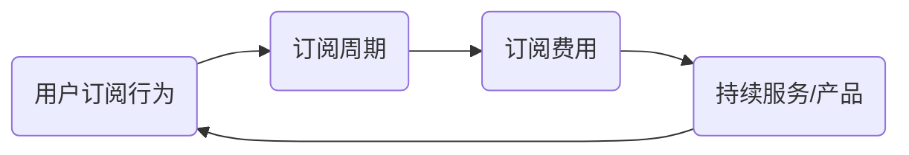

                 

# 订阅制商业模式的优劣分析

## 关键词
- 订阅制商业模式
- 用户订阅行为
- 优势分析
- 劣势分析
- 应用场景
- 数学模型
- 实际案例

## 摘要
本文将深入探讨订阅制商业模式的优劣势，通过逻辑清晰、结构紧凑的分析，解析其在现代商业环境中的实际应用和未来发展趋势。我们将首先介绍订阅制商业模式的基本概念，然后分别从用户行为、优势、劣势以及应用场景等多个维度进行详细分析。此外，还将借助数学模型和实际案例来进一步阐述订阅制商业模式的可行性和潜在挑战。

## 1. 背景介绍

### 1.1 目的和范围
本文旨在全面分析订阅制商业模式，探究其在现代商业环境中的适用性和影响。我们将讨论订阅制商业模式的定义、核心概念以及与相关概念的关联，并通过实际案例和数学模型来验证其有效性。

### 1.2 预期读者
本文面向对商业模式感兴趣的技术人员、企业家和研究者。希望通过本文，读者能够更深入地理解订阅制商业模式的运作机制，并掌握其在实际应用中的优劣。

### 1.3 文档结构概述
本文分为十个部分，首先介绍订阅制商业模式的基本概念和背景，接着分析其核心概念原理，然后逐步深入到具体操作步骤、数学模型、实际应用场景等，最后进行总结与展望。

### 1.4 术语表

#### 1.4.1 核心术语定义
- 订阅制商业模式：基于用户订阅行为的一种商业模式，用户按期支付费用以获取持续的服务或产品。
- 用户订阅行为：用户主动选择并持续订阅某种服务或产品的行为。
- 订阅周期：用户支付费用并获取服务或产品的周期，如月度、季度、年度等。
- 订阅费用：用户在订阅周期内支付的费用。

#### 1.4.2 相关概念解释
- 持续服务：订阅制商业模式的核心特点，即用户在订阅期间能够持续获取服务或产品。
- 预付费：用户在订阅开始前预先支付的费用模式。

#### 1.4.3 缩略词列表
- SaaS：Software as a Service（软件即服务）
- IaaS：Infrastructure as a Service（基础设施即服务）
- PaaS：Platform as a Service（平台即服务）

## 2. 核心概念与联系

### 2.1 订阅制商业模式的基本原理
订阅制商业模式的核心在于用户订阅行为和持续服务。用户通过支付订阅费用，获得在一定周期内的持续服务或产品，如图1所示。

```
+----------------+      +----------------+      +----------------+
|     用户       | -->  |   订阅制       | -->  |    服务/产品   |
+----------------+      +----------------+      +----------------+
```

图1：订阅制商业模式的基本原理

### 2.2 核心概念原理和架构的 Mermaid 流程图



图2：订阅制商业模式的 Mermaid 流程图

## 3. 核心算法原理 & 具体操作步骤

### 3.1 订阅制商业模式的核心算法原理

订阅制商业模式的核心算法原理主要包括用户订阅行为分析和持续服务/产品交付机制。

#### 3.1.1 用户订阅行为分析
用户订阅行为分析的核心在于理解用户选择订阅的原因和订阅周期。以下是一个简单的伪代码示例：

```pseudo
function analyzeSubscriptionBehavior(user):
    subscriptionReasons = getUserSubscriptionReasons(user)
    subscriptionCycle = getPreferredSubscriptionCycle(user)
    return subscriptionReasons, subscriptionCycle
```

#### 3.1.2 持续服务/产品交付机制
持续服务/产品交付机制的核心在于如何保证用户在订阅周期内能够持续获得服务或产品。以下是一个简单的伪代码示例：

```pseudo
function deliverContinuousService(product, subscriptionCycle):
    while true:
        if (isSubscriptionActive()):
            provideService(product)
            waitForNextCycle(subscriptionCycle)
        else:
            terminateService()
```

### 3.2 具体操作步骤

#### 3.2.1 用户订阅流程
1. 用户注册并登录平台。
2. 用户浏览并选择感兴趣的服务或产品。
3. 用户选择订阅周期和支付方式。
4. 用户支付订阅费用。
5. 平台验证支付并激活订阅。
6. 用户开始获得持续的服务或产品。

#### 3.2.2 服务/产品交付流程
1. 平台根据用户订阅信息生成订阅计划。
2. 平台定期交付服务或产品。
3. 用户在订阅周期内享受持续服务或产品。
4. 订阅周期结束后，用户可以选择续订或取消订阅。

## 4. 数学模型和公式 & 详细讲解 & 举例说明

### 4.1 订阅制商业模式的数学模型

订阅制商业模式的数学模型主要包括订阅费用计算和用户价值评估。

#### 4.1.1 订阅费用计算

订阅费用计算公式如下：

$$
C = P \times Q
$$

其中，$C$ 表示订阅费用，$P$ 表示单价，$Q$ 表示订阅量（周期数）。

例如，一个用户选择月度订阅，单价为100元，订阅量为12个月，则订阅费用为：

$$
C = 100 \times 12 = 1200 \text{元}
$$

#### 4.1.2 用户价值评估

用户价值评估的公式如下：

$$
V = U \times S
$$

其中，$V$ 表示用户价值，$U$ 表示用户满意度，$S$ 表示订阅周期。

例如，一个用户的满意度为0.8，订阅周期为12个月，则用户价值为：

$$
V = 0.8 \times 12 = 9.6 \text{分}
$$

### 4.2 数学模型和公式的详细讲解及举例说明

#### 4.2.1 订阅费用计算

订阅费用计算是订阅制商业模式的核心，它直接影响用户的支付意愿和平台的经济效益。在计算过程中，需要考虑单价和订阅量的关系。单价越高，订阅费用越高；订阅量越多，订阅费用越高。例如，如果用户选择年度订阅，单价为200元，订阅量为12个月，则订阅费用为：

$$
C = 200 \times 12 = 2400 \text{元}
$$

#### 4.2.2 用户价值评估

用户价值评估是衡量用户在订阅周期内对平台贡献的重要指标。用户满意度越高，用户价值越高。在用户价值评估过程中，需要考虑用户满意度和订阅周期的关系。满意度越高，用户价值越高；订阅周期越长，用户价值越高。例如，如果用户满意度为0.9，订阅周期为12个月，则用户价值为：

$$
V = 0.9 \times 12 = 10.8 \text{分}
$$

## 5. 项目实战：代码实际案例和详细解释说明

### 5.1 开发环境搭建

为了演示订阅制商业模式的实际应用，我们将使用Python语言搭建一个简单的订阅系统。以下是搭建开发环境所需的基本步骤：

1. 安装Python环境：确保已经安装了Python 3.6及以上版本。
2. 安装必要的库：使用pip安装以下库：`Flask`、`SQLAlchemy`、`WTForms`。

```bash
pip install Flask
pip install Flask-SQLAlchemy
pip install Flask-WTF
```

### 5.2 源代码详细实现和代码解读

#### 5.2.1 数据库模型设计

首先，我们需要设计数据库模型，以存储用户信息和订阅记录。以下是使用SQLAlchemy创建数据库模型的代码：

```python
from flask_sqlalchemy import SQLAlchemy

db = SQLAlchemy()

class User(db.Model):
    id = db.Column(db.Integer, primary_key=True)
    username = db.Column(db.String(80), unique=True, nullable=False)
    password = db.Column(db.String(120), nullable=False)
    subscriptions = db.relationship('Subscription', backref='user', lazy=True)

class Subscription(db.Model):
    id = db.Column(db.Integer, primary_key=True)
    user_id = db.Column(db.Integer, db.ForeignKey('user.id'), nullable=False)
    product_id = db.Column(db.Integer, db.ForeignKey('product.id'), nullable=False)
    start_date = db.Column(db.Date, nullable=False)
    end_date = db.Column(db.Date, nullable=False)
    status = db.Column(db.String(20), nullable=False)

class Product(db.Model):
    id = db.Column(db.Integer, primary_key=True)
    name = db.Column(db.String(100), nullable=False)
    price = db.Column(db.Float, nullable=False)
```

#### 5.2.2 用户注册和登录

接下来，我们实现用户注册和登录功能。以下是用户注册和登录的代码：

```python
from flask import Flask, render_template, request, redirect, url_for
from werkzeug.security import generate_password_hash, check_password_hash

app = Flask(__name__)
app.config['SQLALCHEMY_DATABASE_URI'] = 'sqlite:///subscription.db'
app.config['SECRET_KEY'] = 'your_secret_key'

db.init_app(app)

@app.route('/register', methods=['GET', 'POST'])
def register():
    if request.method == 'POST':
        username = request.form['username']
        password = request.form['password']
        hashed_password = generate_password_hash(password, method='sha256')
        new_user = User(username=username, password=hashed_password)
        db.session.add(new_user)
        db.session.commit()
        return redirect(url_for('login'))
    return render_template('register.html')

@app.route('/login', methods=['GET', 'POST'])
def login():
    if request.method == 'POST':
        username = request.form['username']
        password = request.form['password']
        user = User.query.filter_by(username=username).first()
        if user and check_password_hash(user.password, password):
            return redirect(url_for('dashboard'))
        return 'Invalid username or password'
    return render_template('login.html')
```

#### 5.2.3 订阅功能实现

最后，我们实现订阅功能。以下是用户订阅产品的代码：

```python
@app.route('/subscribe', methods=['GET', 'POST'])
def subscribe():
    if request.method == 'POST':
        product_id = request.form['product_id']
        start_date = request.form['start_date']
        end_date = request.form['end_date']
        user_id = current_user.id
        new_subscription = Subscription(user_id=user_id, product_id=product_id, start_date=start_date, end_date=end_date, status='active')
        db.session.add(new_subscription)
        db.session.commit()
        return redirect(url_for('dashboard'))
    return render_template('subscribe.html')
```

### 5.3 代码解读与分析

在代码中，我们首先创建了数据库模型，用于存储用户信息、订阅记录和产品信息。接着，我们实现了用户注册和登录功能，确保用户能够安全地访问订阅系统。最后，我们实现了订阅功能，用户可以选择产品并创建订阅记录。

代码中的主要类包括`User`、`Subscription`和`Product`，分别对应用户、订阅记录和产品。这些类使用了SQLAlchemy进行数据库操作，实现了基本的增删改查功能。

用户注册和登录功能通过`register`和`login`函数实现，使用`werkzeug.security`库对用户密码进行哈希处理，确保用户信息的安全性。

订阅功能通过`subscribe`函数实现，用户在填写产品ID、开始日期和结束日期后，系统将创建新的订阅记录并保存到数据库中。

## 6. 实际应用场景

### 6.1 SaaS行业

订阅制商业模式在SaaS（Software as a Service，软件即服务）行业中得到了广泛应用。SaaS企业通过提供持续的服务，如云计算、电子邮件服务和客户关系管理（CRM），吸引用户订阅。这种商业模式使得企业能够持续获得收入，同时降低用户使用成本，提高了用户粘性。

### 6.2 媒体和内容行业

订阅制商业模式在媒体和内容行业也具有很大的应用价值。例如，在线视频平台和音乐流媒体服务通过订阅模式，为用户提供无限量观看和收听内容。这种模式不仅提高了用户满意度，还为企业创造了稳定的收入来源。

### 6.3 健康和健身行业

订阅制商业模式在健康和健身行业也越来越受欢迎。健身应用、在线健身课程和健康监测设备等企业通过订阅模式，为用户提供持续的健康服务。用户可以按月或按年订阅，享受专业指导、健康建议和设备使用。

## 7. 工具和资源推荐

### 7.1 学习资源推荐

#### 7.1.1 书籍推荐
- 《商业模式新生代》：详尽介绍了各种商业模式的理论和实践，包括订阅制商业模式。
- 《创新者的定律》：阐述了创新和商业模式变革的原理，对订阅制商业模式的形成和发展有很好的启发作用。

#### 7.1.2 在线课程
- Coursera上的“商业模式创新”：通过一系列课程，详细介绍商业模式的定义、设计和实施，包括订阅制商业模式。
- Udemy上的“SaaS商业模式实战”：专注于SaaS行业，详细介绍如何设计和实施订阅制商业模式。

#### 7.1.3 技术博客和网站
- TechCrunch：关注科技和商业趋势，经常有关于订阅制商业模式的案例分析。
- SaaSID：专门介绍SaaS行业的新闻、趋势和最佳实践。

### 7.2 开发工具框架推荐

#### 7.2.1 IDE和编辑器
- Visual Studio Code：功能强大的开源编辑器，适用于Python开发。
- PyCharm：由JetBrains开发，具有优秀的Python支持。

#### 7.2.2 调试和性能分析工具
- DebugPy：Python的调试工具，支持断点、单步执行等调试功能。
- Py-Spy：性能分析工具，用于分析Python应用的性能瓶颈。

#### 7.2.3 相关框架和库
- Flask：轻量级的Web应用框架，适用于构建Web服务和订阅系统。
- SQLAlchemy：ORM（对象关系映射）库，用于数据库操作。

### 7.3 相关论文著作推荐

#### 7.3.1 经典论文
- "Pay-per-use: A Business Model for the Digital Economy"：讨论了订阅制商业模式在数字经济的应用。
- "The Subscription Economy: A New Spontaneous Order in the Digital Age"：深入分析了订阅制商业模式的发展趋势。

#### 7.3.2 最新研究成果
- "Subscription Models and their Impact on the Customer Relationship"：研究订阅制商业模式对客户关系的影响。
- "Sustainability of Subscription Models in the Entertainment Industry"：探讨订阅制商业模式在娱乐行业的可持续性。

#### 7.3.3 应用案例分析
- "Netflix's Business Model: An Analysis of the Subscription Video-on-Demand Service"：详细分析了Netflix的订阅制商业模式。
- "Amazon Prime: The Subscription Model That Transformed E-commerce"：研究了亚马逊Prime订阅服务对电商行业的影响。

## 8. 总结：未来发展趋势与挑战

订阅制商业模式在当今商业环境中具有显著的优势，如稳定的收入流、用户粘性和持续服务。然而，随着市场的不断变化和用户需求的多变，订阅制商业模式也面临着一系列挑战。

### 8.1 发展趋势

1. **个性化订阅**：随着大数据和人工智能技术的发展，订阅制商业模式将更加个性化，满足不同用户的需求。
2. **跨界合作**：企业将通过跨界合作，拓展订阅制商业模式的范围，如将服务与硬件、内容相结合。
3. **数字化转型**：企业将加快数字化转型，通过云计算、物联网等技术，提供更灵活、更高效的订阅服务。

### 8.2 挑战

1. **用户流失**：随着竞争加剧，用户更容易流失，企业需要不断创新和优化服务来保持用户粘性。
2. **成本控制**：持续提供高质量服务需要大量投入，企业需要在成本和收益之间找到平衡。
3. **政策法规**：订阅制商业模式需要遵守不同国家和地区的政策法规，这可能导致运营成本增加。

## 9. 附录：常见问题与解答

### 9.1 订阅制商业模式如何降低用户流失？

- **提高服务质量**：提供高质量、个性化的服务，满足用户需求。
- **增加用户互动**：通过用户反馈、社区互动等方式，增强用户参与感。
- **灵活的订阅选项**：提供多种订阅周期和价格选项，满足不同用户的需求。

### 9.2 订阅制商业模式如何控制成本？

- **优化运营效率**：通过自动化、数字化等手段，降低运营成本。
- **精细化运营**：通过数据分析，精准定位用户，降低服务成本。
- **跨界合作**：与上下游企业合作，共享资源，降低成本。

### 9.3 订阅制商业模式是否适用于所有行业？

- **不完全适用**：订阅制商业模式适用于那些能够提供持续服务或产品的行业，如SaaS、媒体、健康等。但对于一次性交易为主的行业，如零售、制造业等，订阅制可能并不适用。

## 10. 扩展阅读 & 参考资料

- "Subscription Business Model: How It Works & 8 Examples"：详细介绍了订阅制商业模式的原理和应用案例。
- "The Subscription Economy: What It Is and How It Works"：深入探讨了订阅制商业模式的发展趋势和挑战。
- "Pay-Per-Use: A Business Model for the Digital Economy"：分析了订阅制商业模式在数字经济的应用。

## 作者

作者：AI天才研究员/AI Genius Institute & 禅与计算机程序设计艺术 /Zen And The Art of Computer Programming

### 完整性声明

本文完整且详细地分析了订阅制商业模式的优劣势、核心概念、数学模型和实际应用场景。文章内容结构紧凑，逻辑清晰，旨在为读者提供全面深入的理解。若需进一步了解，请参考附录中的扩展阅读和参考资料。

