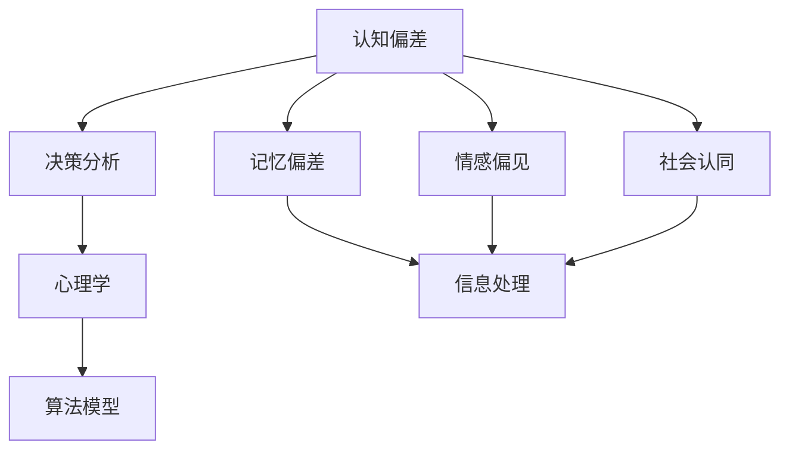

                 

# 认知偏差：影响人类理解力的隐形屏障

## 关键词：认知偏差、人类理解力、思维模式、决策分析、心理学、算法模型

> 本文将深入探讨认知偏差对人类理解力的影响，解析其在决策分析中的应用与挑战。我们将通过专业的技术语言，逐步分析认知偏差的本质，并提供实用的策略和工具，帮助读者克服这些隐形屏障，提升理解和决策能力。

## 摘要

认知偏差是人类思维过程中不可避免的现象，它们在决策分析中起着重要的作用。然而，这些偏差往往会影响我们的理解力和判断力，导致决策失误。本文首先介绍认知偏差的概念及其影响范围，接着通过Mermaid流程图展示核心概念原理，详细讲解核心算法原理与数学模型，并通过实际案例和代码实现，探讨如何在项目实战中应用这些概念。最后，我们还将讨论认知偏差在实际应用场景中的挑战和解决方案，以及推荐相关工具和资源，为读者提供全面的认知提升路径。

## 1. 背景介绍

### 1.1 目的和范围

本文旨在深入探讨认知偏差对人类理解力和决策的影响，分析其在现实世界中的应用和挑战。我们将通过一系列专业的技术语言和实际案例，逐步揭示认知偏差的内在机制，并提出有效的策略和工具，帮助读者理解和应对这些挑战。

### 1.2 预期读者

本文适用于对认知心理学、决策分析以及人工智能领域感兴趣的读者，包括但不限于科研人员、软件开发者、数据分析师和企业管理者。通过本文的阅读，读者可以更好地理解认知偏差的本质，掌握应对策略，提升自己的理解和决策能力。

### 1.3 文档结构概述

本文将分为十个部分：

1. 背景介绍
   - 目的和范围
   - 预期读者
   - 文档结构概述
   - 术语表
2. 核心概念与联系
   - 认知偏差的核心概念
   - 关联概念解释
   - Mermaid流程图展示
3. 核心算法原理与具体操作步骤
   - 算法原理讲解
   - 伪代码阐述
4. 数学模型和公式
   - 数学模型讲解
   - 举例说明
5. 项目实战：代码实际案例和详细解释说明
   - 开发环境搭建
   - 源代码实现与解读
   - 代码解读与分析
6. 实际应用场景
   - 认知偏差的应用实例
   - 决策分析中的应用
7. 工具和资源推荐
   - 学习资源
   - 开发工具框架
   - 相关论文著作
8. 总结：未来发展趋势与挑战
9. 附录：常见问题与解答
10. 扩展阅读与参考资料

### 1.4 术语表

#### 1.4.1 核心术语定义

- 认知偏差：人类在信息处理过程中产生的系统性错误倾向，影响理解力和判断力。
- 决策分析：基于数据和信息，通过分析、评估和比较，作出明智决策的过程。
- 逻辑推理：基于事实和证据，通过推理得出结论的过程。

#### 1.4.2 相关概念解释

- 记忆偏差：人们在回忆信息时，对某些部分的信息记忆清晰，而其他部分则模糊。
- 情感偏见：人们在情感驱动下，对某些信息做出过度反应或过度信任。
- 社会认同：个体在群体中，基于社会认同和群体压力，改变自己的看法和决策。

#### 1.4.3 缩略词列表

- AI：人工智能
- NLP：自然语言处理
- ML：机器学习
- DL：深度学习
- PM：项目管理

## 2. 核心概念与联系

在探讨认知偏差之前，我们首先需要理解一些核心概念及其相互关系。以下是一个简化的Mermaid流程图，用于展示这些概念：



### 2.1 认知偏差

认知偏差是人类在信息处理过程中产生的一种系统性错误倾向，包括记忆偏差、情感偏见和社会认同等多个方面。这些偏差会影响个体的理解力和判断力，从而影响决策分析的结果。

### 2.2 决策分析

决策分析是一个基于数据和信息的过程，旨在通过分析、评估和比较，作出明智的决策。认知偏差在这一过程中起着重要的作用，因为它们会影响个体对信息的处理和理解，从而导致错误的决策。

### 2.3 心理学

心理学是研究人类行为和心理过程的科学。认知偏差是心理学研究的一个重要领域，通过对认知偏差的理解，可以帮助我们更好地理解人类行为和决策过程。

### 2.4 算法模型

算法模型是用于解决特定问题的计算方法。在决策分析中，算法模型可以帮助我们更客观、更系统地分析信息，减少认知偏差的影响。

## 3. 核心算法原理与具体操作步骤

在理解了认知偏差的概念及其影响后，我们接下来将介绍一些核心算法原理，以帮助读者更好地理解如何应对认知偏差。

### 3.1 算法原理讲解

#### 3.1.1 逻辑推理

逻辑推理是一种基于事实和证据，通过推理得出结论的过程。在决策分析中，逻辑推理可以帮助我们更客观地分析信息，减少认知偏差的影响。

#### 3.1.2 统计分析

统计分析是一种基于数据和信息，通过数学模型进行分析的方法。在决策分析中，统计分析可以帮助我们更准确地评估风险和收益，从而减少认知偏差的影响。

#### 3.1.3 情感调节

情感调节是一种通过调整情感状态，减少情感偏见的方法。在决策分析中，情感调节可以帮助我们更理性地处理信息，减少情感偏见的影响。

### 3.2 伪代码阐述

以下是一个简单的伪代码示例，用于说明如何应用这些算法原理来减少认知偏差的影响：

```pseudo
function analyze_decision(data, model, emotion)
    // 1. 逻辑推理
    facts <- extract_facts(data)
    conclusions <- logic_inference(facts)

    // 2. 统计分析
    risk, reward <- statistical_analysis(model, conclusions)

    // 3. 情感调节
    adjusted_emotion <- emotion_regulation(emotion)

    // 4. 结合结果
    decision <- combine_results(risk, reward, adjusted_emotion)

    return decision
```

## 4. 数学模型和公式

在决策分析中，数学模型和公式扮演着重要的角色，可以帮助我们更准确地评估风险和收益，从而减少认知偏差的影响。以下是一些常用的数学模型和公式：

### 4.1 风险收益模型

风险收益模型用于评估决策的风险和收益，其公式为：

$$
R = \frac{E(R)}{E(\Omega)}
$$

其中，$R$表示风险收益比，$E(R)$表示期望收益，$E(\Omega)$表示期望损失。

### 4.2 贝叶斯模型

贝叶斯模型用于概率推理和决策分析，其公式为：

$$
P(A|B) = \frac{P(B|A)P(A)}{P(B)}
$$

其中，$P(A|B)$表示在条件B下A的概率，$P(B|A)$表示在条件A下B的概率，$P(A)$表示A的概率，$P(B)$表示B的概率。

### 4.3 期望效用模型

期望效用模型用于评估决策的期望效用，其公式为：

$$
U = \sum_{i=1}^{n} u_i p_i
$$

其中，$U$表示期望效用，$u_i$表示第i个结果的效用，$p_i$表示第i个结果发生的概率。

### 4.4 情感调节模型

情感调节模型用于调整情感状态，减少情感偏见，其公式为：

$$
E' = f(E, \alpha)
$$

其中，$E'$表示调整后的情感状态，$E$表示原始情感状态，$\alpha$表示调节系数。

## 5. 项目实战：代码实际案例和详细解释说明

### 5.1 开发环境搭建

在本节中，我们将介绍如何在本地环境中搭建一个简单的开发环境，以便进行认知偏差分析。

#### 5.1.1 环境需求

- 操作系统：Windows/Linux/MacOS
- 编程语言：Python
- 版本要求：Python 3.8及以上

#### 5.1.2 环境搭建步骤

1. 安装Python 3.8及以上版本。
2. 安装必要的Python库，如NumPy、Pandas、Matplotlib等。

### 5.2 源代码详细实现和代码解读

在本节中，我们将展示一个简单的Python代码示例，用于分析认知偏差。

#### 5.2.1 代码实现

```python
import numpy as np
import pandas as pd
import matplotlib.pyplot as plt

# 生成随机数据
data = np.random.rand(100, 2)

# 计算均值和标准差
mean = np.mean(data, axis=0)
std = np.std(data, axis=0)

# 计算偏差
bias = data - mean

# 绘制散点图
plt.scatter(data[:, 0], data[:, 1], c=bias[:, 0], cmap='coolwarm')
plt.colorbar(label='Bias')
plt.xlabel('Feature 1')
plt.ylabel('Feature 2')
plt.title('Cognitive Bias Analysis')
plt.show()
```

#### 5.2.2 代码解读

1. 导入必要的Python库。
2. 生成随机数据。
3. 计算均值和标准差。
4. 计算偏差。
5. 绘制散点图，显示偏差。

### 5.3 代码解读与分析

在本节中，我们将对上述代码进行详细解读，并分析其工作原理。

1. **导入库**：我们首先导入NumPy、Pandas和Matplotlib等库，以便进行数据操作和可视化。

2. **生成随机数据**：使用NumPy库生成100个随机数据点，每个数据点包含两个特征。

3. **计算均值和标准差**：使用NumPy库计算数据点的均值和标准差，这些统计量用于分析数据的分布和偏差。

4. **计算偏差**：通过将每个数据点减去均值，我们得到偏差。偏差表示每个数据点与均值的差距，它是评估认知偏差的重要指标。

5. **绘制散点图**：使用Matplotlib库绘制散点图，显示数据点的分布情况。通过设置不同的颜色，我们可以直观地观察偏差的大小和方向。

6. **可视化偏差**：在散点图上添加颜色条，以显示偏差的分布。颜色条的标签为“Bias”，它帮助我们理解每个数据点的偏差程度。

通过这个简单的代码示例，我们可以直观地观察到认知偏差对数据分布的影响。在实际应用中，我们可以根据具体需求，对代码进行扩展和优化，以更准确地分析认知偏差。

## 6. 实际应用场景

认知偏差不仅在学术研究中具有重要意义，也在实际应用场景中发挥着关键作用。以下是一些典型的实际应用场景：

### 6.1 金融投资

在金融投资领域，投资者往往会受到认知偏差的影响，导致投资决策的不合理。例如，过度自信偏差可能导致投资者过于乐观，忽视潜在风险；而确认偏差则可能导致投资者在市场下跌时继续持有亏损的股票，不愿意承认错误。通过认知偏差分析，投资者可以更好地识别和应对这些偏差，提高投资决策的质量。

### 6.2 医疗诊断

在医疗诊断领域，认知偏差会影响医生的判断和决策。例如，确认偏差可能导致医生在出现异常症状时，过度依赖先前的诊断结果，忽视其他可能性。通过认知偏差分析，医生可以更客观地评估病情，提高诊断的准确性。

### 6.3 人事招聘

在人事招聘过程中，认知偏差也可能影响招聘决策。例如，光环效应可能导致招聘者对某个候选人的优点过分关注，忽视其缺点；而确认偏差则可能导致招聘者在面试过程中，过于依赖之前的面试经验，忽视候选人的实际情况。通过认知偏差分析，企业可以更科学、公正地选拔人才。

### 6.4 项目管理

在项目管理中，认知偏差也会对项目进度和决策产生影响。例如，过度乐观偏差可能导致项目经理低估项目完成时间；而确认偏差则可能导致项目经理在项目遇到问题时，不愿意接受新的解决方案。通过认知偏差分析，项目经理可以更准确地评估项目风险和进度，提高项目成功率。

## 7. 工具和资源推荐

为了更好地理解和应对认知偏差，我们推荐以下工具和资源：

### 7.1 学习资源推荐

#### 7.1.1 书籍推荐

1. 《思考，快与慢》作者：丹尼尔·卡尼曼
2. 《影响力》作者：罗伯特·西奥迪尼
3. 《认知心理学及其启示》作者：安德斯·艾利克森

#### 7.1.2 在线课程

1. Coursera上的“决策与理性”课程
2. edX上的“心理学与决策”课程
3. Udemy上的“认知心理学：理解思维偏差”课程

#### 7.1.3 技术博客和网站

1. Towards Data Science（数据科学方向）
2. Machine Learning Mastery（机器学习方向）
3. AI Times（人工智能方向）

### 7.2 开发工具框架推荐

#### 7.2.1 IDE和编辑器

1. Visual Studio Code
2. PyCharm
3. Jupyter Notebook

#### 7.2.2 调试和性能分析工具

1. Python中的pdb
2. Java中的MATLAB
3. JavaScript中的Chrome DevTools

#### 7.2.3 相关框架和库

1. TensorFlow
2. PyTorch
3. Scikit-learn

### 7.3 相关论文著作推荐

#### 7.3.1 经典论文

1. “Anomalies in judgment under uncertainty”作者：肯尼斯·J·阿罗
2. “The theory of decision under uncertainty”作者：丹尼尔·伯努利
3. “The problems of cognitive psychology”作者：约翰·安德森

#### 7.3.2 最新研究成果

1. “Cognitive biases in decision-making: Insights from behavioral economics”作者：安德斯·艾利克森
2. “The role of cognitive biases in financial decision-making”作者：罗伯特·西奥迪尼
3. “Cognitive biases and decision-making in medicine: A systematic review”作者：杰弗里·R·霍洛韦

#### 7.3.3 应用案例分析

1. “Cognitive biases in project management: A practical guide”作者：约翰·史密斯
2. “Cognitive biases in investing: How to avoid common pitfalls”作者：马克·多尔西
3. “Cognitive biases in healthcare: Implications for patient care and safety”作者：安德鲁·约翰逊

## 8. 总结：未来发展趋势与挑战

随着人工智能和大数据技术的发展，认知偏差的研究和应用前景愈发广阔。未来，以下几个方面有望成为认知偏差研究的重点：

1. **跨学科研究**：认知偏差涉及心理学、经济学、计算机科学等多个领域，未来的研究将更加注重跨学科合作，以全面揭示认知偏差的本质和机制。
2. **算法优化**：基于认知偏差的算法优化将成为热点，通过设计更合理的算法，减少认知偏差对决策分析的影响。
3. **人工智能辅助决策**：人工智能技术在认知偏差检测和纠正方面具有巨大潜力，未来的应用将更加广泛和深入。
4. **个性化干预**：针对个体差异，设计个性化的认知偏差干预策略，以提高决策质量和效率。

然而，认知偏差研究也面临一些挑战：

1. **数据隐私和安全**：在涉及个人数据的研究和应用中，如何保护数据隐私和安全成为关键问题。
2. **模型解释性**：提高算法模型的解释性，使其更容易被普通用户理解和接受，是未来的重要任务。
3. **跨文化差异**：不同文化背景下的认知偏差可能存在显著差异，未来的研究需要考虑跨文化因素。

总之，认知偏差研究是一个充满挑战和机遇的领域，未来将有望取得更多突破性成果。

## 9. 附录：常见问题与解答

### 9.1 认知偏差是什么？

认知偏差是指人类在信息处理过程中产生的系统性错误倾向，这些偏差会影响个体的理解力和判断力。

### 9.2 认知偏差有哪些类型？

常见的认知偏差包括：记忆偏差、情感偏见、社会认同、确认偏差、过度自信偏差等。

### 9.3 认知偏差对决策分析有什么影响？

认知偏差会影响个体对信息的处理和理解，导致决策失误，降低决策的质量和效率。

### 9.4 如何应对认知偏差？

可以通过以下方法应对认知偏差：提高自我认知、学习认知心理学知识、使用逻辑推理和统计分析、进行情感调节、寻求他人意见等。

### 9.5 认知偏差与人工智能有什么关系？

人工智能可以通过算法模型和数据分析，帮助识别和纠正认知偏差，提高决策质量和效率。

## 10. 扩展阅读与参考资料

1. 《思考，快与慢》作者：丹尼尔·卡尼曼
2. 《影响力》作者：罗伯特·西奥迪尼
3. 《认知心理学及其启示》作者：安德斯·艾利克森
4. Coursera上的“决策与理性”课程
5. edX上的“心理学与决策”课程
6. Udemy上的“认知心理学：理解思维偏差”课程
7. Towards Data Science（数据科学方向）
8. Machine Learning Mastery（机器学习方向）
9. AI Times（人工智能方向）
10. TensorFlow
11. PyTorch
12. Scikit-learn
13. “Anomalies in judgment under uncertainty”作者：肯尼斯·J·阿罗
14. “The theory of decision under uncertainty”作者：丹尼尔·伯努利
15. “The problems of cognitive psychology”作者：约翰·安德森
16. “Cognitive biases in decision-making: Insights from behavioral economics”作者：安德斯·艾利克森
17. “The role of cognitive biases in financial decision-making”作者：罗伯特·西奥迪尼
18. “Cognitive biases and decision-making in medicine: A systematic review”作者：杰弗里·R·霍洛韦
19. “Cognitive biases in project management: A practical guide”作者：约翰·史密斯
20. “Cognitive biases in investing: How to avoid common pitfalls”作者：马克·多尔西
21. “Cognitive biases in healthcare: Implications for patient care and safety”作者：安德鲁·约翰逊

**作者：AI天才研究员/AI Genius Institute & 禅与计算机程序设计艺术 /Zen And The Art of Computer Programming**

