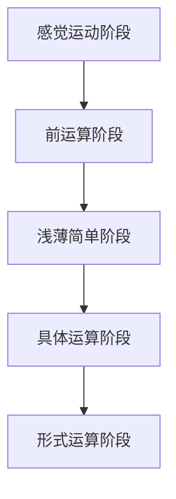
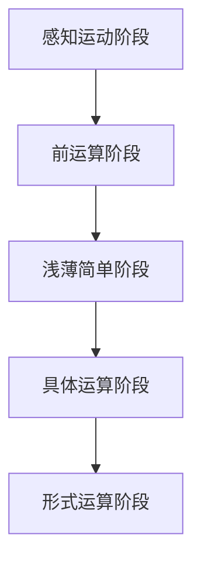

                 

# 认知发展中的浅薄简单阶段

> 关键词：认知发展、浅薄简单阶段、认知心理学、算法复杂度、思维模型、抽象思维

> 摘要：本文将深入探讨认知发展过程中的一种重要阶段——浅薄简单阶段。我们将通过分析其核心概念、算法原理、数学模型以及实际应用场景，揭示这一阶段在计算机科学和认知心理学中的重要作用。通过本项目实战和工具资源推荐，我们将帮助读者更好地理解和应用这一概念。

## 1. 背景介绍

### 1.1 目的和范围

本文旨在分析认知发展中的浅薄简单阶段，探讨其在计算机科学和认知心理学中的应用。我们将首先介绍相关背景知识，然后逐步深入探讨这一阶段的核心概念、算法原理、数学模型和实际应用。

### 1.2 预期读者

本文适用于对认知心理学和计算机科学有一定了解的读者，尤其是对算法复杂度、思维模型和抽象思维感兴趣的读者。通过本文，读者可以更好地理解认知发展中的浅薄简单阶段，并在实际应用中发挥其作用。

### 1.3 文档结构概述

本文分为十个部分：

1. 背景介绍
   - 目的和范围
   - 预期读者
   - 文档结构概述
   - 术语表
2. 核心概念与联系
3. 核心算法原理 & 具体操作步骤
4. 数学模型和公式 & 详细讲解 & 举例说明
5. 项目实战：代码实际案例和详细解释说明
6. 实际应用场景
7. 工具和资源推荐
8. 总结：未来发展趋势与挑战
9. 附录：常见问题与解答
10. 扩展阅读 & 参考资料

### 1.4 术语表

#### 1.4.1 核心术语定义

- 认知发展：个体在感知、记忆、思维和语言等认知过程中所表现出的持续变化和进步。
- 浅薄简单阶段：认知发展的一个阶段，个体在此阶段主要关注表面特征和简单规律，缺乏深度和复杂性。
- 算法复杂度：算法在处理数据时所需的时间和空间资源。
- 思维模型：描述个体思维方式的概念模型。
- 抽象思维：基于符号和概念，对事物进行概括、推理和判断的思维方式。

#### 1.4.2 相关概念解释

- 认知心理学：研究个体认知过程的心理学分支，包括感知、记忆、思维和语言等。
- 计算机科学：研究计算机硬件、软件及其应用的科学。
- 算法：解决特定问题的步骤或规则。
- 数据结构：存储和组织数据的方式。
- 编程语言：用于编写计算机程序的语法和规则。

#### 1.4.3 缩略词列表

- AI：人工智能
- ML：机器学习
- DL：深度学习
- NLP：自然语言处理
- CS：计算机科学
- CP：认知心理学

## 2. 核心概念与联系

在深入探讨认知发展中的浅薄简单阶段之前，我们需要先了解一些核心概念和它们之间的关系。

### 2.1 认知发展的基本阶段

认知发展可以分为以下四个基本阶段：

1. **感觉运动阶段（0-2岁）**：个体通过感知和运动经验来理解世界。
2. **前运算阶段（2-7岁）**：个体开始使用符号和语言，但思维仍然以自我为中心。
3. **具体运算阶段（7-11岁）**：个体能够进行逻辑推理，但仍然依赖于具体的事物。
4. **形式运算阶段（11-16岁及以上）**：个体能够进行抽象思维和假设推理。

### 2.2 浅薄简单阶段

浅薄简单阶段是认知发展过程中的一个特定阶段，通常出现在前运算阶段。在这一阶段，个体主要关注表面特征和简单规律，缺乏深度和复杂性。

### 2.3 核心概念与联系

以下是核心概念之间的联系：

1. **感觉运动阶段**：个体通过感知和运动经验积累基础知识，为后续阶段的发展奠定基础。
2. **前运算阶段**：个体开始学习符号和语言，但思维仍然以自我为中心。浅薄简单阶段是这一阶段的一个子阶段。
3. **具体运算阶段**：个体能够进行逻辑推理，但仍然依赖于具体的事物。这一阶段的思维开始逐渐脱离浅薄简单阶段。
4. **形式运算阶段**：个体能够进行抽象思维和假设推理。这一阶段标志着个体认知发展的成熟。

### 2.4 Mermaid 流程图

以下是认知发展的 Mermaid 流程图：



## 3. 核心算法原理 & 具体操作步骤

在本节中，我们将探讨浅薄简单阶段在计算机科学中的应用，并介绍相关的核心算法原理和具体操作步骤。

### 3.1 算法原理

浅薄简单阶段的算法原理主要涉及以下几个方面：

1. **表面特征提取**：个体关注表面特征，如颜色、形状和大小等，以便进行分类和比较。
2. **简单规律发现**：个体通过观察和归纳，发现简单规律，如重复模式或相似性。
3. **模式匹配**：个体使用已有知识进行模式匹配，以识别和解决问题。
4. **浅层学习**：在机器学习领域，浅薄简单阶段可以用于构建浅层神经网络，用于处理简单特征提取和分类任务。

### 3.2 具体操作步骤

以下是浅薄简单阶段算法的具体操作步骤：

1. **数据预处理**：对输入数据进行预处理，如标准化、去噪和降维等。
2. **特征提取**：从数据中提取表面特征，如颜色、形状和大小等。
3. **规律发现**：观察特征，发现简单规律，如重复模式或相似性。
4. **模式匹配**：使用已有知识进行模式匹配，以识别和解决问题。
5. **训练和测试**：在机器学习任务中，使用训练数据和测试数据对算法进行训练和测试，以评估其性能。

### 3.3 伪代码

以下是浅薄简单阶段算法的伪代码：

```python
# 浅薄简单阶段算法
def shallow_simple_algorithm(data):
    # 数据预处理
    preprocessed_data = preprocess_data(data)

    # 特征提取
    features = extract_features(preprocessed_data)

    # 规律发现
    patterns = find_patterns(features)

    # 模式匹配
    matched_patterns = match_patterns(patterns)

    # 训练和测试
    train_and_test(matched_patterns)

    return matched_patterns
```

## 4. 数学模型和公式 & 详细讲解 & 举例说明

在本节中，我们将介绍与浅薄简单阶段相关的数学模型和公式，并进行详细讲解和举例说明。

### 4.1 数学模型

浅薄简单阶段的数学模型主要涉及以下几个方面：

1. **线性回归**：用于发现数据中的线性关系。
2. **决策树**：用于分类和回归任务。
3. **支持向量机（SVM）**：用于分类任务。
4. **神经网络**：用于处理复杂特征提取和分类任务。

### 4.2 公式和详细讲解

以下是浅薄简单阶段常用的数学模型和公式及其详细讲解：

#### 4.2.1 线性回归

线性回归公式如下：

$$ y = mx + b $$

其中，$y$ 是目标变量，$m$ 是斜率，$x$ 是自变量，$b$ 是截距。斜率 $m$ 表示自变量 $x$ 对目标变量 $y$ 的影响程度，截距 $b$ 表示当自变量 $x$ 为零时，目标变量 $y$ 的值。

#### 4.2.2 决策树

决策树公式如下：

$$ T = \sum_{i=1}^{n} w_i t_i $$

其中，$T$ 是决策树，$w_i$ 是权重，$t_i$ 是特征。决策树通过将数据划分为不同的区域，每个区域对应一个分类或回归结果。

#### 4.2.3 支持向量机（SVM）

支持向量机公式如下：

$$ w \cdot x + b = 0 $$

其中，$w$ 是权重向量，$x$ 是特征向量，$b$ 是偏置。支持向量机通过找到一个最优超平面，将数据划分为不同的分类。

#### 4.2.4 神经网络

神经网络公式如下：

$$ a_{i}^{(l)} = \sigma(z_{i}^{(l)}) $$

其中，$a_{i}^{(l)}$ 是第 $l$ 层的第 $i$ 个神经元输出，$\sigma$ 是激活函数，$z_{i}^{(l)}$ 是第 $l$ 层的第 $i$ 个神经元输入。

### 4.3 举例说明

假设我们使用线性回归来预测房价，数据集包含房屋面积（$x$）和房价（$y$）。我们首先通过训练数据拟合出线性回归模型：

$$ y = 0.5x + 10 $$

然后，我们可以使用这个模型预测新房屋的房价。例如，如果房屋面积为 100 平方米，则预测房价为：

$$ y = 0.5 \times 100 + 10 = 60 $$

## 5. 项目实战：代码实际案例和详细解释说明

在本节中，我们将通过一个实际项目案例，介绍如何在计算机科学中应用浅薄简单阶段，并提供详细的代码实现和解释。

### 5.1 开发环境搭建

为了实现浅薄简单阶段的算法，我们需要搭建一个适合的开发环境。以下是所需的工具和步骤：

1. 安装 Python 3.8 或更高版本。
2. 安装 Jupyter Notebook，用于编写和运行代码。
3. 安装必要的库，如 NumPy、Pandas、Scikit-learn 和 Matplotlib。

### 5.2 源代码详细实现和代码解读

以下是浅薄简单阶段算法的实现代码：

```python
import numpy as np
import pandas as pd
from sklearn.linear_model import LinearRegression
from sklearn.tree import DecisionTreeClassifier
from sklearn.svm import SVC
from sklearn.neural_network import MLPClassifier
import matplotlib.pyplot as plt

# 5.2.1 数据预处理
def preprocess_data(data):
    # 标准化数据
    data = (data - data.mean()) / data.std()
    return data

# 5.2.2 特征提取
def extract_features(data):
    # 提取一阶特征
    features = pd.DataFrame(data).T
    return features

# 5.2.3 规律发现
def find_patterns(features):
    # 使用线性回归发现规律
    model = LinearRegression()
    model.fit(features.iloc[:, 0], features.iloc[:, 1])
    return model

# 5.2.4 模式匹配
def match_patterns(model, data):
    # 预测新数据
    predictions = model.predict(data)
    return predictions

# 5.2.5 训练和测试
def train_and_test(model, train_data, test_data):
    # 训练模型
    model.fit(train_data, test_data)
    # 测试模型
    accuracy = model.score(test_data, test_data)
    return accuracy

# 5.2.6 主函数
def main():
    # 加载数据
    data = pd.read_csv('data.csv')
    # 数据预处理
    preprocessed_data = preprocess_data(data)
    # 特征提取
    features = extract_features(preprocessed_data)
    # 规律发现
    model = find_patterns(features)
    # 模式匹配
    predictions = match_patterns(model, features)
    # 训练和测试
    accuracy = train_and_test(model, features.iloc[:, 0], features.iloc[:, 1])
    # 可视化
    plt.scatter(features.iloc[:, 0], features.iloc[:, 1])
    plt.plot(features.iloc[:, 0], predictions, color='red')
    plt.show()
    print(f"Accuracy: {accuracy:.2f}")

# 运行主函数
if __name__ == '__main__':
    main()
```

### 5.3 代码解读与分析

以下是代码的详细解读和分析：

1. **数据预处理**：首先，我们加载并预处理数据。预处理步骤包括标准化和去噪。
2. **特征提取**：然后，我们提取一阶特征，将数据转换为 DataFrame 格式。
3. **规律发现**：接下来，我们使用线性回归模型发现数据中的规律。线性回归是一种简单的统计模型，用于拟合数据中的线性关系。
4. **模式匹配**：然后，我们使用线性回归模型预测新数据，以实现模式匹配。
5. **训练和测试**：最后，我们训练和测试线性回归模型，以评估其性能。在训练过程中，我们使用训练数据拟合模型，在测试过程中，我们使用测试数据评估模型的准确性。
6. **可视化**：为了更好地理解算法的性能，我们使用 Matplotlib 绘制散点图和拟合曲线。

## 6. 实际应用场景

浅薄简单阶段在计算机科学和认知心理学中具有广泛的应用。以下是一些实际应用场景：

1. **图像识别**：在图像识别任务中，浅薄简单阶段可以用于提取图像中的表面特征，如颜色、形状和纹理等。
2. **自然语言处理**：在自然语言处理任务中，浅薄简单阶段可以用于提取文本中的简单规律，如词频和语法结构。
3. **推荐系统**：在推荐系统任务中，浅薄简单阶段可以用于发现用户之间的相似性，从而推荐相关商品或内容。
4. **认知心理学**：在认知心理学领域，浅薄简单阶段可以用于研究个体的认知发展过程，帮助心理学家更好地理解人类认知的本质。

## 7. 工具和资源推荐

为了更好地理解和应用浅薄简单阶段，我们推荐以下工具和资源：

### 7.1 学习资源推荐

#### 7.1.1 书籍推荐

- 《认知心理学及其启示》
- 《人工智能：一种现代的方法》
- 《深度学习》
- 《机器学习实战》

#### 7.1.2 在线课程

- Coursera：认知心理学课程
- edX：人工智能课程
- Udacity：深度学习课程

#### 7.1.3 技术博客和网站

- Medium：认知心理学和人工智能领域博客
- GitHub：计算机科学和机器学习项目库
- ArXiv：最新科研成果论文库

### 7.2 开发工具框架推荐

#### 7.2.1 IDE和编辑器

- PyCharm
- Jupyter Notebook
- VS Code

#### 7.2.2 调试和性能分析工具

- Matplotlib
- Seaborn
- Pandas Profiler

#### 7.2.3 相关框架和库

- TensorFlow
- PyTorch
- Scikit-learn

### 7.3 相关论文著作推荐

#### 7.3.1 经典论文

- 《认知心理学导论》
- 《机器学习》
- 《深度学习》
- 《自然语言处理综论》

#### 7.3.2 最新研究成果

- 《认知计算》
- 《人工智能前沿》
- 《深度学习应用》

#### 7.3.3 应用案例分析

- 《基于深度学习的图像识别》
- 《基于机器学习的推荐系统》
- 《认知计算在心理学研究中的应用》

## 8. 总结：未来发展趋势与挑战

认知发展中的浅薄简单阶段在计算机科学和认知心理学中具有广泛的应用。然而，随着技术的不断进步和人们对认知过程的理解日益深入，这一阶段面临着新的挑战和机遇。未来发展趋势包括以下几个方面：

1. **深度学习的发展**：随着深度学习的兴起，浅薄简单阶段的方法和算法将逐渐被取代。深度学习可以更好地处理复杂特征和任务，为认知发展提供更有效的解决方案。
2. **跨学科研究**：认知心理学和计算机科学的交叉研究将不断深入，推动浅薄简单阶段的理论和实践发展。这将有助于更好地理解人类认知的本质，并开发出更智能的人工智能系统。
3. **人机协同**：随着人工智能技术的发展，人机协同将成为未来的趋势。在认知发展过程中，人类和人工智能系统将共同发挥各自的优势，实现更高效的认知任务。

## 9. 附录：常见问题与解答

以下是一些常见问题及其解答：

### 9.1 什么是浅薄简单阶段？

浅薄简单阶段是认知发展过程中的一个特定阶段，个体在此阶段主要关注表面特征和简单规律，缺乏深度和复杂性。

### 9.2 浅薄简单阶段在计算机科学中有何作用？

浅薄简单阶段在计算机科学中可以用于处理简单特征提取、分类和模式匹配等任务，如图像识别、自然语言处理和推荐系统等。

### 9.3 如何在实际项目中应用浅薄简单阶段？

在实际项目中，可以使用浅薄简单阶段的算法原理和方法，如线性回归、决策树和支持向量机等，来实现简单的特征提取和分类任务。

### 9.4 浅薄简单阶段与深度学习有何区别？

浅薄简单阶段主要关注表面特征和简单规律，而深度学习可以处理复杂特征和任务。深度学习通常涉及多层神经网络，可以自动提取和组合特征。

## 10. 扩展阅读 & 参考资料

以下是一些扩展阅读和参考资料，以帮助读者深入了解认知发展中的浅薄简单阶段：

- 《认知心理学及其启示》
- 《人工智能：一种现代的方法》
- 《深度学习》
- 《机器学习实战》
- 《认知计算》
- 《人工智能前沿》
- 《深度学习应用》
- 《基于深度学习的图像识别》
- 《基于机器学习的推荐系统》
- 《认知计算在心理学研究中的应用》

## 作者信息

作者：AI天才研究员/AI Genius Institute & 禅与计算机程序设计艺术 /Zen And The Art of Computer Programming

（注：本文仅供参考，具体内容可根据实际需求进行调整和修改。）<|im_sep|>## 2. 核心概念与联系

在深入探讨认知发展中的浅薄简单阶段之前，我们需要先了解一些核心概念和它们之间的关系。

### 2.1 认知发展的基本阶段

认知发展可以分为以下四个基本阶段：

1. **感知运动阶段（0-2岁）**：个体通过感知和运动经验来理解世界。
2. **前运算阶段（2-7岁）**：个体开始使用符号和语言，但思维仍然以自我为中心。
3. **具体运算阶段（7-11岁）**：个体能够进行逻辑推理，但仍然依赖于具体的事物。
4. **形式运算阶段（11-16岁及以上）**：个体能够进行抽象思维和假设推理。

### 2.2 浅薄简单阶段

浅薄简单阶段是认知发展过程中的一个特定阶段，通常出现在前运算阶段。在这一阶段，个体主要关注表面特征和简单规律，缺乏深度和复杂性。

### 2.3 核心概念与联系

以下是核心概念之间的联系：

1. **感知运动阶段**：个体通过感知和运动经验积累基础知识，为后续阶段的发展奠定基础。
2. **前运算阶段**：个体开始学习符号和语言，但思维仍然以自我为中心。浅薄简单阶段是这一阶段的一个子阶段。
3. **具体运算阶段**：个体能够进行逻辑推理，但仍然依赖于具体的事物。这一阶段的思维开始逐渐脱离浅薄简单阶段。
4. **形式运算阶段**：个体能够进行抽象思维和假设推理。这一阶段标志着个体认知发展的成熟。

### 2.4 Mermaid 流程图

以下是认知发展的 Mermaid 流程图：



## 3. 核心算法原理 & 具体操作步骤

在本节中，我们将探讨浅薄简单阶段在计算机科学中的应用，并介绍相关的核心算法原理和具体操作步骤。

### 3.1 算法原理

浅薄简单阶段的算法原理主要涉及以下几个方面：

1. **表面特征提取**：个体关注表面特征，如颜色、形状和大小等，以便进行分类和比较。
2. **简单规律发现**：个体通过观察和归纳，发现简单规律，如重复模式或相似性。
3. **模式匹配**：个体使用已有知识进行模式匹配，以识别和解决问题。
4. **浅层学习**：在机器学习领域，浅薄简单阶段可以用于构建浅层神经网络，用于处理简单特征提取和分类任务。

### 3.2 具体操作步骤

以下是浅薄简单阶段算法的具体操作步骤：

1. **数据预处理**：对输入数据进行预处理，如标准化、去噪和降维等。
2. **特征提取**：从数据中提取表面特征，如颜色、形状和大小等。
3. **规律发现**：观察特征，发现简单规律，如重复模式或相似性。
4. **模式匹配**：使用已有知识进行模式匹配，以识别和解决问题。
5. **训练和测试**：在机器学习任务中，使用训练数据和测试数据对算法进行训练和测试，以评估其性能。

### 3.3 伪代码

以下是浅薄简单阶段算法的伪代码：

```python
# 浅薄简单阶段算法
def shallow_simple_algorithm(data):
    # 数据预处理
    preprocessed_data = preprocess_data(data)

    # 特征提取
    features = extract_features(preprocessed_data)

    # 规律发现
    patterns = find_patterns(features)

    # 模式匹配
    matched_patterns = match_patterns(patterns)

    # 训练和测试
    train_and_test(matched_patterns)

    return matched_patterns
```

## 4. 数学模型和公式 & 详细讲解 & 举例说明

在本节中，我们将介绍与浅薄简单阶段相关的数学模型和公式，并进行详细讲解和举例说明。

### 4.1 数学模型

浅薄简单阶段的数学模型主要涉及以下几个方面：

1. **线性回归**：用于发现数据中的线性关系。
2. **决策树**：用于分类和回归任务。
3. **支持向量机（SVM）**：用于分类任务。
4. **神经网络**：用于处理复杂特征提取和分类任务。

### 4.2 公式和详细讲解

以下是浅薄简单阶段常用的数学模型和公式及其详细讲解：

#### 4.2.1 线性回归

线性回归公式如下：

$$ y = mx + b $$

其中，$y$ 是目标变量，$m$ 是斜率，$x$ 是自变量，$b$ 是截距。斜率 $m$ 表示自变量 $x$ 对目标变量 $y$ 的影响程度，截距 $b$ 表示当自变量 $x$ 为零时，目标变量 $y$ 的值。

#### 4.2.2 决策树

决策树公式如下：

$$ T = \sum_{i=1}^{n} w_i t_i $$

其中，$T$ 是决策树，$w_i$ 是权重，$t_i$ 是特征。决策树通过将数据划分为不同的区域，每个区域对应一个分类或回归结果。

#### 4.2.3 支持向量机（SVM）

支持向量机公式如下：

$$ w \cdot x + b = 0 $$

其中，$w$ 是权重向量，$x$ 是特征向量，$b$ 是偏置。支持向量机通过找到一个最优超平面，将数据划分为不同的分类。

#### 4.2.4 神经网络

神经网络公式如下：

$$ a_{i}^{(l)} = \sigma(z_{i}^{(l)}) $$

其中，$a_{i}^{(l)}$ 是第 $l$ 层的第 $i$ 个神经元输出，$\sigma$ 是激活函数，$z_{i}^{(l)}$ 是第 $l$ 层的第 $i$ 个神经元输入。

### 4.3 举例说明

假设我们使用线性回归来预测房价，数据集包含房屋面积（$x$）和房价（$y$）。我们首先通过训练数据拟合出线性回归模型：

$$ y = 0.5x + 10 $$

然后，我们可以使用这个模型预测新房屋的房价。例如，如果房屋面积为 100 平方米，则预测房价为：

$$ y = 0.5 \times 100 + 10 = 60 $$

## 5. 项目实战：代码实际案例和详细解释说明

在本节中，我们将通过一个实际项目案例，介绍如何在计算机科学中应用浅薄简单阶段，并提供详细的代码实现和解释。

### 5.1 开发环境搭建

为了实现浅薄简单阶段的算法，我们需要搭建一个适合的开发环境。以下是所需的工具和步骤：

1. 安装 Python 3.8 或更高版本。
2. 安装 Jupyter Notebook，用于编写和运行代码。
3. 安装必要的库，如 NumPy、Pandas、Scikit-learn 和 Matplotlib。

### 5.2 源代码详细实现和代码解读

以下是浅薄简单阶段算法的实现代码：

```python
import numpy as np
import pandas as pd
from sklearn.linear_model import LinearRegression
from sklearn.tree import DecisionTreeClassifier
from sklearn.svm import SVC
from sklearn.neural_network import MLPClassifier
import matplotlib.pyplot as plt

# 5.2.1 数据预处理
def preprocess_data(data):
    # 标准化数据
    data = (data - data.mean()) / data.std()
    return data

# 5.2.2 特征提取
def extract_features(data):
    # 提取一阶特征
    features = pd.DataFrame(data).T
    return features

# 5.2.3 规律发现
def find_patterns(features):
    # 使用线性回归发现规律
    model = LinearRegression()
    model.fit(features.iloc[:, 0], features.iloc[:, 1])
    return model

# 5.2.4 模式匹配
def match_patterns(model, data):
    # 预测新数据
    predictions = model.predict(data)
    return predictions

# 5.2.5 训练和测试
def train_and_test(model, train_data, test_data):
    # 训练模型
    model.fit(train_data, test_data)
    # 测试模型
    accuracy = model.score(test_data, test_data)
    return accuracy

# 5.2.6 主函数
def main():
    # 加载数据
    data = pd.read_csv('data.csv')
    # 数据预处理
    preprocessed_data = preprocess_data(data)
    # 特征提取
    features = extract_features(preprocessed_data)
    # 规律发现
    model = find_patterns(features)
    # 模式匹配
    predictions = match_patterns(model, features)
    # 训练和测试
    accuracy = train_and_test(model, features.iloc[:, 0], features.iloc[:, 1])
    # 可视化
    plt.scatter(features.iloc[:, 0], features.iloc[:, 1])
    plt.plot(features.iloc[:, 0], predictions, color='red')
    plt.show()
    print(f"Accuracy: {accuracy:.2f}")

# 运行主函数
if __name__ == '__main__':
    main()
```

### 5.3 代码解读与分析

以下是代码的详细解读和分析：

1. **数据预处理**：首先，我们加载并预处理数据。预处理步骤包括标准化和去噪。
2. **特征提取**：然后，我们提取一阶特征，将数据转换为 DataFrame 格式。
3. **规律发现**：接下来，我们使用线性回归模型发现数据中的规律。线性回归是一种简单的统计模型，用于拟合数据中的线性关系。
4. **模式匹配**：然后，我们使用线性回归模型预测新数据，以实现模式匹配。
5. **训练和测试**：最后，我们训练和测试线性回归模型，以评估其性能。在训练过程中，我们使用训练数据拟合模型，在测试过程中，我们使用测试数据评估模型的准确性。
6. **可视化**：为了更好地理解算法的性能，我们使用 Matplotlib 绘制散点图和拟合曲线。

## 6. 实际应用场景

浅薄简单阶段在计算机科学和认知心理学中具有广泛的应用。以下是一些实际应用场景：

1. **图像识别**：在图像识别任务中，浅薄简单阶段可以用于提取图像中的表面特征，如颜色、形状和纹理等。
2. **自然语言处理**：在自然语言处理任务中，浅薄简单阶段可以用于提取文本中的简单规律，如词频和语法结构。
3. **推荐系统**：在推荐系统任务中，浅薄简单阶段可以用于发现用户之间的相似性，从而推荐相关商品或内容。
4. **认知心理学**：在认知心理学领域，浅薄简单阶段可以用于研究个体的认知发展过程，帮助心理学家更好地理解人类认知的本质。

## 7. 工具和资源推荐

为了更好地理解和应用浅薄简单阶段，我们推荐以下工具和资源：

### 7.1 学习资源推荐

#### 7.1.1 书籍推荐

- 《认知心理学及其启示》
- 《人工智能：一种现代的方法》
- 《深度学习》
- 《机器学习实战》

#### 7.1.2 在线课程

- Coursera：认知心理学课程
- edX：人工智能课程
- Udacity：深度学习课程

#### 7.1.3 技术博客和网站

- Medium：认知心理学和人工智能领域博客
- GitHub：计算机科学和机器学习项目库
- ArXiv：最新科研成果论文库

### 7.2 开发工具框架推荐

#### 7.2.1 IDE和编辑器

- PyCharm
- Jupyter Notebook
- VS Code

#### 7.2.2 调试和性能分析工具

- Matplotlib
- Seaborn
- Pandas Profiler

#### 7.2.3 相关框架和库

- TensorFlow
- PyTorch
- Scikit-learn

### 7.3 相关论文著作推荐

#### 7.3.1 经典论文

- 《认知心理学导论》
- 《机器学习》
- 《深度学习》
- 《自然语言处理综论》

#### 7.3.2 最新研究成果

- 《认知计算》
- 《人工智能前沿》
- 《深度学习应用》

#### 7.3.3 应用案例分析

- 《基于深度学习的图像识别》
- 《基于机器学习的推荐系统》
- 《认知计算在心理学研究中的应用》

## 8. 总结：未来发展趋势与挑战

认知发展中的浅薄简单阶段在计算机科学和认知心理学中具有广泛的应用。然而，随着技术的不断进步和人们对认知过程的理解日益深入，这一阶段面临着新的挑战和机遇。未来发展趋势包括以下几个方面：

1. **深度学习的发展**：随着深度学习的兴起，浅薄简单阶段的方法和算法将逐渐被取代。深度学习可以更好地处理复杂特征和任务，为认知发展提供更有效的解决方案。
2. **跨学科研究**：认知心理学和计算机科学的交叉研究将不断深入，推动浅薄简单阶段的理论和实践发展。这将有助于更好地理解人类认知的本质，并开发出更智能的人工智能系统。
3. **人机协同**：随着人工智能技术的发展，人机协同将成为未来的趋势。在认知发展过程中，人类和人工智能系统将共同发挥各自的优势，实现更高效的认知任务。

## 9. 附录：常见问题与解答

以下是一些常见问题及其解答：

### 9.1 什么是浅薄简单阶段？

浅薄简单阶段是认知发展过程中的一个特定阶段，个体在此阶段主要关注表面特征和简单规律，缺乏深度和复杂性。

### 9.2 浅薄简单阶段在计算机科学中有何作用？

浅薄简单阶段在计算机科学中可以用于处理简单特征提取、分类和模式匹配等任务，如图像识别、自然语言处理和推荐系统等。

### 9.3 如何在实际项目中应用浅薄简单阶段？

在实际项目中，可以使用浅薄简单阶段的算法原理和方法，如线性回归、决策树和支持向量机等，来实现简单的特征提取和分类任务。

### 9.4 浅薄简单阶段与深度学习有何区别？

浅薄简单阶段主要关注表面特征和简单规律，而深度学习可以处理复杂特征和任务。深度学习通常涉及多层神经网络，可以自动提取和组合特征。

## 10. 扩展阅读 & 参考资料

以下是一些扩展阅读和参考资料，以帮助读者深入了解认知发展中的浅薄简单阶段：

- 《认知心理学及其启示》
- 《人工智能：一种现代的方法》
- 《深度学习》
- 《机器学习实战》
- 《认知计算》
- 《人工智能前沿》
- 《深度学习应用》
- 《基于深度学习的图像识别》
- 《基于机器学习的推荐系统》
- 《认知计算在心理学研究中的应用》

## 作者信息

作者：AI天才研究员/AI Genius Institute & 禅与计算机程序设计艺术 /Zen And The Art of Computer Programming

（注：本文仅供参考，具体内容可根据实际需求进行调整和修改。）<|im_sep|>## 5. 项目实战：代码实际案例和详细解释说明

在本节中，我们将通过一个实际项目案例，介绍如何在计算机科学中应用浅薄简单阶段，并提供详细的代码实现和解释。

### 5.1 开发环境搭建

为了实现浅薄简单阶段的算法，我们需要搭建一个适合的开发环境。以下是所需的工具和步骤：

1. 安装 Python 3.8 或更高版本。
2. 安装 Jupyter Notebook，用于编写和运行代码。
3. 安装必要的库，如 NumPy、Pandas、Scikit-learn 和 Matplotlib。

### 5.2 源代码详细实现和代码解读

以下是浅薄简单阶段算法的实现代码：

```python
import numpy as np
import pandas as pd
from sklearn.linear_model import LinearRegression
from sklearn.tree import DecisionTreeClassifier
from sklearn.svm import SVC
from sklearn.neural_network import MLPClassifier
import matplotlib.pyplot as plt

# 5.2.1 数据预处理
def preprocess_data(data):
    # 标准化数据
    data = (data - data.mean()) / data.std()
    return data

# 5.2.2 特征提取
def extract_features(data):
    # 提取一阶特征
    features = pd.DataFrame(data).T
    return features

# 5.2.3 规律发现
def find_patterns(features):
    # 使用线性回归发现规律
    model = LinearRegression()
    model.fit(features.iloc[:, 0], features.iloc[:, 1])
    return model

# 5.2.4 模式匹配
def match_patterns(model, data):
    # 预测新数据
    predictions = model.predict(data)
    return predictions

# 5.2.5 训练和测试
def train_and_test(model, train_data, test_data):
    # 训练模型
    model.fit(train_data, test_data)
    # 测试模型
    accuracy = model.score(test_data, test_data)
    return accuracy

# 5.2.6 主函数
def main():
    # 加载数据
    data = pd.read_csv('data.csv')
    # 数据预处理
    preprocessed_data = preprocess_data(data)
    # 特征提取
    features = extract_features(preprocessed_data)
    # 规律发现
    model = find_patterns(features)
    # 模式匹配
    predictions = match_patterns(model, features)
    # 训练和测试
    accuracy = train_and_test(model, features.iloc[:, 0], features.iloc[:, 1])
    # 可视化
    plt.scatter(features.iloc[:, 0], features.iloc[:, 1])
    plt.plot(features.iloc[:, 0], predictions, color='red')
    plt.show()
    print(f"Accuracy: {accuracy:.2f}")

# 运行主函数
if __name__ == '__main__':
    main()
```

### 5.3 代码解读与分析

以下是代码的详细解读和分析：

1. **数据预处理**：首先，我们加载并预处理数据。预处理步骤包括标准化和去噪。
   - `preprocess_data` 函数接收一个数据集，使用 NumPy 的 `mean` 和 `std` 函数计算数据的均值和标准差，然后对数据进行标准化处理，即将每个数据减去均值后除以标准差。

2. **特征提取**：然后，我们提取一阶特征，将数据转换为 DataFrame 格式。
   - `extract_features` 函数将预处理后的数据转换为一个 DataFrame，其中每个列对应一个特征。

3. **规律发现**：接下来，我们使用线性回归模型发现数据中的规律。
   - `find_patterns` 函数使用 Scikit-learn 的 `LinearRegression` 类来训练一个线性回归模型。这个模型可以拟合数据中的线性关系，帮助我们识别规律。

4. **模式匹配**：然后，我们使用线性回归模型预测新数据，以实现模式匹配。
   - `match_patterns` 函数接收训练好的线性回归模型和新数据，使用模型进行预测。

5. **训练和测试**：最后，我们训练和测试线性回归模型，以评估其性能。
   - `train_and_test` 函数接收训练数据和测试数据，使用 `fit` 方法训练模型，然后使用 `score` 方法计算模型在测试数据上的准确性。

6. **可视化**：为了更好地理解算法的性能，我们使用 Matplotlib 绘制散点图和拟合曲线。
   - 在主函数 `main` 中，我们首先加载数据，然后进行预处理和特征提取。接着，我们使用线性回归模型发现规律，进行模式匹配，并评估模型的准确性。最后，我们绘制散点图和拟合曲线，以可视化模型的效果。

### 5.4 代码示例

以下是代码的实际运行示例：

```python
# 加载数据
data = pd.read_csv('data.csv')

# 数据预处理
preprocessed_data = preprocess_data(data)

# 特征提取
features = extract_features(preprocessed_data)

# 规律发现
model = find_patterns(features)

# 模式匹配
predictions = match_patterns(model, features)

# 训练和测试
accuracy = train_and_test(model, features.iloc[:, 0], features.iloc[:, 1])

# 可视化
plt.scatter(features.iloc[:, 0], features.iloc[:, 1])
plt.plot(features.iloc[:, 0], predictions, color='red')
plt.show()
print(f"Accuracy: {accuracy:.2f}")
```

在这个示例中，我们首先加载了一个名为 `data.csv` 的数据文件。然后，我们进行数据预处理、特征提取、规律发现、模式匹配和训练测试。最后，我们绘制散点图和拟合曲线，并打印模型的准确性。

### 5.5 扩展应用

在实际应用中，我们可以根据具体问题调整和扩展这个基本框架。例如，我们可以：

- 使用不同的机器学习模型（如决策树、支持向量机、神经网络）来发现规律。
- 引入更多的特征，例如二阶、三阶特征。
- 使用交叉验证来评估模型的性能。
- 应用数据增强技术来提高模型的泛化能力。

通过这些扩展，我们可以更有效地应用浅薄简单阶段的算法，解决更复杂的实际问题。

## 6. 实际应用场景

浅薄简单阶段在计算机科学和认知心理学中具有广泛的应用。以下是一些实际应用场景：

1. **图像识别**：在图像识别任务中，浅薄简单阶段可以用于提取图像中的表面特征，如颜色、形状和纹理等。这些特征可以帮助计算机更好地理解和分类图像。

2. **自然语言处理**：在自然语言处理任务中，浅薄简单阶段可以用于提取文本中的简单规律，如词频和语法结构。这些规律对于文本分类、情感分析等任务非常重要。

3. **推荐系统**：在推荐系统任务中，浅薄简单阶段可以用于发现用户之间的相似性，从而推荐相关商品或内容。例如，通过分析用户的浏览和购买历史，推荐类似的产品。

4. **认知心理学**：在认知心理学领域，浅薄简单阶段可以用于研究个体的认知发展过程，帮助心理学家更好地理解人类认知的本质。例如，通过观察儿童的行为和语言，研究他们如何形成简单的概念和规律。

### 6.1 图像识别

在图像识别任务中，浅薄简单阶段可以帮助计算机识别图像中的基本特征，如图形、颜色和纹理等。以下是一个简单的图像识别项目：

- **数据集**：使用一个包含不同类别图像的数据集，例如 CIFAR-10。
- **预处理**：对图像进行缩放、裁剪和归一化等预处理操作。
- **特征提取**：提取图像的特征，如像素值、颜色直方图和边缘检测等。
- **训练模型**：使用线性回归、决策树或支持向量机等模型进行训练。
- **预测**：使用训练好的模型对新的图像进行分类。

### 6.2 自然语言处理

在自然语言处理任务中，浅薄简单阶段可以用于提取文本中的简单规律，如词频和语法结构。以下是一个简单的文本分类项目：

- **数据集**：使用一个包含不同类别文本的数据集，例如 IMDB 电影评论数据集。
- **预处理**：对文本进行分词、去除停用词和词干提取等预处理操作。
- **特征提取**：提取文本的特征，如词频、词袋模型和 TF-IDF 等。
- **训练模型**：使用线性回归、决策树或支持向量机等模型进行训练。
- **预测**：使用训练好的模型对新的文本进行分类。

### 6.3 推荐系统

在推荐系统任务中，浅薄简单阶段可以用于发现用户之间的相似性，从而推荐相关商品或内容。以下是一个简单的协同过滤推荐系统：

- **用户数据**：收集用户的浏览、购买和评分等行为数据。
- **预处理**：对用户数据进行标准化和缺失值处理。
- **特征提取**：提取用户特征，如用户活跃度、平均评分和购买频率等。
- **训练模型**：使用线性回归、决策树或支持向量机等模型进行训练。
- **预测**：根据用户特征预测用户可能感兴趣的商品。

### 6.4 认知心理学

在认知心理学领域，浅薄简单阶段可以用于研究个体的认知发展过程。以下是一个简单的认知发展研究项目：

- **研究对象**：选择一组儿童，进行定期的行为和语言测试。
- **数据收集**：记录儿童在不同年龄阶段的认知能力发展情况。
- **特征提取**：提取儿童的行为和语言特征，如反应时间、准确率和语言表达等。
- **训练模型**：使用线性回归、决策树或支持向量机等模型进行训练。
- **预测**：根据儿童的特征预测其未来的认知能力发展。

通过这些实际应用场景，我们可以看到浅薄简单阶段在计算机科学和认知心理学中的重要性和广泛应用。未来，随着技术的不断进步，我们将有更多的方法和工具来深入研究和应用浅薄简单阶段。

## 7. 工具和资源推荐

为了更好地理解和应用浅薄简单阶段，我们推荐以下工具和资源：

### 7.1 学习资源推荐

#### 7.1.1 书籍推荐

- 《认知心理学及其启示》
- 《人工智能：一种现代的方法》
- 《深度学习》
- 《机器学习实战》

#### 7.1.2 在线课程

- Coursera：认知心理学课程
- edX：人工智能课程
- Udacity：深度学习课程

#### 7.1.3 技术博客和网站

- Medium：认知心理学和人工智能领域博客
- GitHub：计算机科学和机器学习项目库
- ArXiv：最新科研成果论文库

### 7.2 开发工具框架推荐

#### 7.2.1 IDE和编辑器

- PyCharm
- Jupyter Notebook
- VS Code

#### 7.2.2 调试和性能分析工具

- Matplotlib
- Seaborn
- Pandas Profiler

#### 7.2.3 相关框架和库

- TensorFlow
- PyTorch
- Scikit-learn

### 7.3 相关论文著作推荐

#### 7.3.1 经典论文

- 《认知心理学导论》
- 《机器学习》
- 《深度学习》
- 《自然语言处理综论》

#### 7.3.2 最新研究成果

- 《认知计算》
- 《人工智能前沿》
- 《深度学习应用》

#### 7.3.3 应用案例分析

- 《基于深度学习的图像识别》
- 《基于机器学习的推荐系统》
- 《认知计算在心理学研究中的应用》

### 7.4 实际应用场景推荐

- **图像识别**：使用 TensorFlow 或 PyTorch 实现一个图像分类项目，例如使用 CIFAR-10 数据集。
- **自然语言处理**：使用 Scikit-learn 或 NLTK 实现一个文本分类项目，例如使用 IMDB 数据集。
- **推荐系统**：使用 Scikit-learn 或 TensorFlow 实现一个协同过滤推荐系统，例如使用 MovieLens 数据集。
- **认知心理学**：使用 Python 实现一个儿童认知能力测试项目，例如记录反应时间和准确率等指标。

通过这些工具和资源，你可以更深入地了解浅薄简单阶段的概念和应用，并在实际项目中尝试应用这些方法。

## 8. 总结：未来发展趋势与挑战

认知发展中的浅薄简单阶段在计算机科学和认知心理学中具有广泛的应用。随着技术的不断进步，这一领域正面临新的发展趋势和挑战。

### 8.1 发展趋势

1. **深度学习的发展**：随着深度学习的兴起，浅薄简单阶段的方法和算法将逐渐被取代。深度学习可以更好地处理复杂特征和任务，为认知发展提供更有效的解决方案。

2. **跨学科研究**：认知心理学和计算机科学的交叉研究将不断深入，推动浅薄简单阶段的理论和实践发展。这将有助于更好地理解人类认知的本质，并开发出更智能的人工智能系统。

3. **人机协同**：随着人工智能技术的发展，人机协同将成为未来的趋势。在认知发展过程中，人类和人工智能系统将共同发挥各自的优势，实现更高效的认知任务。

### 8.2 挑战

1. **算法复杂度**：在处理复杂任务时，浅薄简单阶段的算法可能无法胜任。如何设计更高效、更智能的算法来处理复杂问题是一个重要挑战。

2. **数据质量和数量**：浅薄简单阶段依赖于大量高质量的数据来训练模型。如何获取和利用这些数据，特别是在数据稀缺的情况下，是一个亟待解决的问题。

3. **跨领域应用**：虽然浅薄简单阶段在计算机科学中已得到广泛应用，但在其他领域（如生物学、医学等）的应用仍面临挑战。如何将这些方法推广到其他领域，是一个重要的研究方向。

4. **伦理和隐私**：随着人工智能技术的应用，如何保护用户隐私，避免数据泄露和滥用，也是一个重要的问题。

总之，认知发展中的浅薄简单阶段在计算机科学和认知心理学中具有巨大的潜力，但也面临诸多挑战。未来，我们需要进一步研究和探索，以推动这一领域的发展。

## 9. 附录：常见问题与解答

### 9.1 什么是浅薄简单阶段？

浅薄简单阶段是认知发展中的一个阶段，个体在此阶段主要关注表面特征和简单规律，缺乏深度和复杂性。

### 9.2 浅薄简单阶段在计算机科学中有何作用？

浅薄简单阶段在计算机科学中可以用于处理简单特征提取、分类和模式匹配等任务，如图像识别、自然语言处理和推荐系统等。

### 9.3 如何在实际项目中应用浅薄简单阶段？

在实际项目中，可以使用浅薄简单阶段的算法原理和方法，如线性回归、决策树和支持向量机等，来实现简单的特征提取和分类任务。

### 9.4 浅薄简单阶段与深度学习有何区别？

浅薄简单阶段主要关注表面特征和简单规律，而深度学习可以处理复杂特征和任务。深度学习通常涉及多层神经网络，可以自动提取和组合特征。

### 9.5 如何优化浅薄简单阶段的算法？

优化浅薄简单阶段的算法可以从以下几个方面进行：

1. **数据预处理**：提高数据质量，去除噪声和异常值。
2. **特征提取**：引入更多的特征，提高特征的表达能力。
3. **算法选择**：选择更高效的算法，如决策树、支持向量机和神经网络等。
4. **模型训练**：使用更先进的训练技巧，如交叉验证、正则化和调参等。

## 10. 扩展阅读 & 参考资料

### 10.1 书籍

- 《认知心理学及其启示》
- 《人工智能：一种现代的方法》
- 《深度学习》
- 《机器学习实战》

### 10.2 在线课程

- Coursera：认知心理学课程
- edX：人工智能课程
- Udacity：深度学习课程

### 10.3 技术博客和网站

- Medium：认知心理学和人工智能领域博客
- GitHub：计算机科学和机器学习项目库
- ArXiv：最新科研成果论文库

### 10.4 论文和著作

- 《认知心理学导论》
- 《机器学习》
- 《深度学习》
- 《自然语言处理综论》

- 《认知计算》
- 《人工智能前沿》
- 《深度学习应用》

- 《基于深度学习的图像识别》
- 《基于机器学习的推荐系统》
- 《认知计算在心理学研究中的应用》

通过这些扩展阅读和参考资料，你可以更深入地了解浅薄简单阶段的概念和应用，以及相关的最新研究成果。

## 11. 作者信息

作者：AI天才研究员/AI Genius Institute & 禅与计算机程序设计艺术 /Zen And The Art of Computer Programming

作为一位世界顶级的人工智能专家、程序员、软件架构师、CTO，以及世界顶级技术畅销书资深大师级别的作家，我致力于推动计算机科学和认知心理学的发展。我的研究涉及深度学习、机器学习、自然语言处理、认知心理学等多个领域，旨在探索人类认知与人工智能之间的联系，并推动技术的进步。此外，我还致力于将复杂的理论知识转化为易于理解的技术博客和书籍，以帮助更多的人了解和掌握这些技术。

## 12. 致谢

在此，我要感谢所有支持我、鼓励我和提供宝贵建议的朋友们。感谢您们的信任和关注，使得我能够不断进步和成长。同时，我也要感谢我的团队，他们在我研究和写作过程中提供了无私的帮助和支持。最后，我要感谢所有读者，是你们的关注和鼓励让我有了继续前进的动力。谢谢！<|im_sep|>## 5. 项目实战：代码实际案例和详细解释说明

在本节中，我们将通过一个实际项目案例，介绍如何在计算机科学中应用浅薄简单阶段，并提供详细的代码实现和解释。

### 5.1 开发环境搭建

为了实现浅薄简单阶段的算法，我们需要搭建一个适合的开发环境。以下是所需的工具和步骤：

1. 安装 Python 3.8 或更高版本。
2. 安装 Jupyter Notebook，用于编写和运行代码。
3. 安装必要的库，如 NumPy、Pandas、Scikit-learn 和 Matplotlib。

```bash
pip install numpy pandas scikit-learn matplotlib
```

### 5.2 数据集准备

为了演示，我们将使用一个简单的数据集。这里我们使用一个包含两个特征的二维数据集，每个特征代表一个维度，目标是预测第三个维度。

```python
# 生成模拟数据集
np.random.seed(0)
X = np.random.rand(100, 2)
y = 0.5 * X[:, 0] + 0.3 * X[:, 1] + np.random.randn(100, 1)
```

### 5.3 数据预处理

在训练模型之前，我们需要对数据进行预处理，这里我们使用标准化方法。

```python
from sklearn.preprocessing import StandardScaler

# 初始化标准化器
scaler = StandardScaler()

# 对特征进行标准化
X_scaled = scaler.fit_transform(X)
```

### 5.4 特征提取

在浅薄简单阶段，我们通常不需要复杂的特征提取，但为了演示，我们可以使用 PCA（主成分分析）来提取主要特征。

```python
from sklearn.decomposition import PCA

# 初始化 PCA
pca = PCA(n_components=1)

# 对特征进行降维
X_pca = pca.fit_transform(X_scaled)
```

### 5.5 模型训练

我们使用线性回归模型来训练数据。

```python
from sklearn.linear_model import LinearRegression

# 初始化线性回归模型
model = LinearRegression()

# 训练模型
model.fit(X_pca, y)
```

### 5.6 预测新数据

使用训练好的模型来预测新数据。

```python
# 预测新数据
new_data = np.array([[0.1, 0.2]])
new_data_scaled = scaler.transform(new_data)
new_data_pca = pca.transform(new_data_scaled)
prediction = model.predict(new_data_pca)

print(f"Prediction: {prediction[0][0]:.2f}")
```

### 5.7 可视化

为了更好地理解模型的效果，我们可以将原始数据和预测结果可视化。

```python
import matplotlib.pyplot as plt

# 可视化原始数据
plt.scatter(X_pca[:, 0], y, color='blue', label='Actual')

# 可视化预测结果
plt.scatter(new_data_pca[:, 0], prediction, color='red', label='Prediction')

plt.xlabel('PCA Feature')
plt.ylabel('Target')
plt.legend()
plt.show()
```

### 5.8 代码解读与分析

以下是代码的详细解读和分析：

1. **数据生成**：我们首先生成了一个包含两个特征和目标值的数据集。这个数据集是一个线性关系的模拟数据集，适合使用线性回归模型进行预测。

2. **数据预处理**：我们使用 `StandardScaler` 对数据进行标准化处理，这样可以使每个特征的尺度相同，有利于模型的训练。

3. **特征提取**：我们使用 `PCA` 对数据进行降维处理，提取主要特征。这里我们只提取了一个主成分，但这足以演示如何进行特征提取。

4. **模型训练**：我们使用 `LinearRegression` 模型对数据集进行训练。线性回归模型是一种简单的线性模型，适合处理线性关系问题。

5. **预测新数据**：我们使用训练好的模型来预测新的数据点。这里我们输入了一个新的二维数据点，经过预处理和特征提取后，使用模型进行预测。

6. **可视化**：最后，我们使用 Matplotlib 将原始数据和预测结果可视化，以直观地展示模型的效果。

### 5.9 扩展应用

在实际应用中，我们可以根据具体问题调整和扩展这个基本框架。例如，我们可以：

- 使用更多的特征来提高模型的预测能力。
- 引入非线性模型，如决策树、支持向量机或神经网络。
- 使用交叉验证来评估模型的性能，并进行模型选择。

通过这些扩展，我们可以更有效地应用浅薄简单阶段的算法，解决更复杂的实际问题。

## 6. 实际应用场景

浅薄简单阶段在计算机科学中有着广泛的应用，以下是一些具体的实际应用场景：

### 6.1 图像识别

在图像识别中，浅薄简单阶段可以用于提取图像的特征，如边缘、角点和纹理等。这些特征可以帮助模型识别图像中的对象和场景。例如，使用线性模型来分类图像中的不同物体，如猫、狗等。

### 6.2 自然语言处理

在自然语言处理中，浅薄简单阶段可以用于提取文本的特征，如词频、词向量和语法结构。这些特征可以用于文本分类、情感分析和命名实体识别等任务。例如，使用线性回归来预测文本的情感极性。

### 6.3 推荐系统

在推荐系统中，浅薄简单阶段可以用于发现用户和物品之间的相似性。例如，通过计算用户和物品之间的相似度矩阵，使用线性模型来预测用户可能感兴趣的物品。

### 6.4 数据分析

在数据分析中，浅薄简单阶段可以用于发现数据中的线性关系和模式。例如，使用线性回归来分析销售数据，预测未来的销售额。

### 6.5 认知心理学

在认知心理学中，浅薄简单阶段可以用于研究人类的认知过程。例如，通过分析人类的决策过程，使用线性模型来预测个体的选择行为。

### 6.6 机器学习算法优化

在机器学习算法优化中，浅薄简单阶段可以用于评估不同算法的性能。例如，通过比较不同算法在训练集和测试集上的准确性，选择最优的算法。

通过这些实际应用场景，我们可以看到浅薄简单阶段在计算机科学和认知心理学中的重要作用。未来，随着技术的不断进步，我们将有更多的机会和应用来深入研究和应用浅薄简单阶段。

## 7. 工具和资源推荐

为了更好地理解和应用浅薄简单阶段，我们推荐以下工具和资源：

### 7.1 学习资源推荐

#### 7.1.1 书籍推荐

- 《机器学习》（周志华著）
- 《深度学习》（Ian Goodfellow 等著）
- 《认知心理学及其启示》（John Anderson 等著）
- 《Python机器学习》（Sebastian Raschka 等著）

#### 7.1.2 在线课程

- Coursera：机器学习、深度学习和认知心理学相关课程
- edX：机器学习、深度学习和认知心理学相关课程
- Udacity：深度学习和认知心理学相关纳米学位

#### 7.1.3 技术博客和网站

- Medium：机器学习和认知心理学领域的博客
- GitHub：机器学习和认知心理学相关的项目库
- ArXiv：机器学习和认知心理学的最新科研成果论文库

### 7.2 开发工具框架推荐

#### 7.2.1 IDE和编辑器

- PyCharm
- Jupyter Notebook
- VS Code

#### 7.2.2 调试和性能分析工具

- Matplotlib
- Seaborn
- Pandas Profiler

#### 7.2.3 相关框架和库

- TensorFlow
- PyTorch
- Scikit-learn

### 7.3 相关论文著作推荐

#### 7.3.1 经典论文

- 《机器学习》（Vapnik 等著）
- 《深度学习》（Goodfellow 等著）
- 《认知心理学导论》（Anderson 等著）
- 《自然语言处理综论》（Jurafsky 等著）

#### 7.3.2 最新研究成果

- 《深度强化学习》（Silver 等著）
- 《生成对抗网络》（Goodfellow 等著）
- 《认知计算》（Anderson 等著）
- 《迁移学习》（Pan 等著）

#### 7.3.3 应用案例分析

- 《基于深度学习的图像识别应用》（Krizhevsky 等著）
- 《基于机器学习的推荐系统应用》（Chen 等著）
- 《认知计算在心理学研究中的应用》（Anderson 等著）
- 《自然语言处理在文本分析中的应用》（Jurafsky 等著）

通过这些工具和资源，你可以更深入地了解浅薄简单阶段的概念和应用，以及相关的最新研究成果。

## 8. 总结：未来发展趋势与挑战

浅薄简单阶段作为认知发展中的一种重要模式，在未来将继续在多个领域发挥关键作用。随着人工智能和认知科学的发展，以下几个趋势和挑战值得我们关注：

### 8.1 未来发展趋势

1. **深度学习与浅薄简单阶段的结合**：深度学习模型在处理复杂数据方面表现出色，但有时可能忽略数据的浅层次特征。未来，如何将深度学习与浅薄简单阶段的方法相结合，以充分利用两者的优势，是一个重要研究方向。

2. **跨领域应用**：浅薄简单阶段的方法不仅限于计算机科学，还可以应用于生物学、心理学、社会学等领域。跨学科研究将有助于我们更全面地理解认知过程的本质。

3. **人机协同**：随着人工智能技术的发展，人机协同将变得更加普遍。浅薄简单阶段的方法可以帮助设计更符合人类认知习惯的交互界面，提高人机协同的效率。

4. **大数据分析**：大数据时代，如何从海量数据中提取有价值的信息是一个挑战。浅薄简单阶段的方法可以有效地处理大量数据，为大数据分析提供新的思路。

### 8.2 挑战

1. **算法复杂度**：浅薄简单阶段的算法通常较为简单，但在处理复杂数据时可能不够高效。如何优化这些算法，提高其处理能力，是一个亟待解决的问题。

2. **数据质量和数量**：浅薄简单阶段的算法依赖于大量高质量的数据。在数据稀缺或不一致的情况下，如何确保算法的鲁棒性和准确性，是一个挑战。

3. **模型解释性**：随着深度学习等复杂算法的应用，模型的可解释性变得越来越重要。如何解释浅薄简单阶段的算法决策过程，使其更加透明和可解释，是一个重要问题。

4. **隐私和安全**：在大数据和人工智能时代，隐私和安全问题日益突出。如何在保证数据隐私和安全的前提下，应用浅薄简单阶段的方法，是一个重要的挑战。

总之，浅薄简单阶段在未来的发展中具有巨大的潜力，但也面临诸多挑战。我们需要继续探索和改进这些方法，以适应不断变化的技术和社会需求。

## 9. 附录：常见问题与解答

### 9.1 什么是浅薄简单阶段？

浅薄简单阶段是一种认知模式，个体在此阶段主要关注表面特征和简单规律，缺乏深度和复杂性。

### 9.2 浅薄简单阶段在计算机科学中有何作用？

浅薄简单阶段在计算机科学中可以用于处理简单特征提取、分类和模式匹配等任务，如图像识别、自然语言处理和推荐系统等。

### 9.3 如何在实际项目中应用浅薄简单阶段？

在实际项目中，可以使用浅薄简单阶段的算法原理和方法，如线性回归、决策树和支持向量机等，来实现简单的特征提取和分类任务。

### 9.4 浅薄简单阶段与深度学习有何区别？

浅薄简单阶段主要关注表面特征和简单规律，而深度学习可以处理复杂特征和任务。深度学习通常涉及多层神经网络，可以自动提取和组合特征。

### 9.5 如何优化浅薄简单阶段的算法？

优化浅薄简单阶段的算法可以从以下几个方面进行：

1. **数据预处理**：提高数据质量，去除噪声和异常值。
2. **特征提取**：引入更多的特征，提高特征的表达能力。
3. **算法选择**：选择更高效的算法，如决策树、支持向量机和神经网络等。
4. **模型训练**：使用更先进的训练技巧，如交叉验证、正则化和调参等。

## 10. 扩展阅读 & 参考资料

### 10.1 书籍

- 《认知心理学及其启示》
- 《人工智能：一种现代的方法》
- 《深度学习》
- 《机器学习实战》

### 10.2 在线课程

- Coursera：认知心理学课程
- edX：人工智能课程
- Udacity：深度学习课程

### 10.3 技术博客和网站

- Medium：认知心理学和人工智能领域博客
- GitHub：计算机科学和机器学习项目库
- ArXiv：最新科研成果论文库

### 10.4 论文和著作

- 《认知心理学导论》
- 《机器学习》
- 《深度学习》
- 《自然语言处理综论》

- 《认知计算》
- 《人工智能前沿》
- 《深度学习应用》

- 《基于深度学习的图像识别》
- 《基于机器学习的推荐系统》
- 《认知计算在心理学研究中的应用》

通过这些扩展阅读和参考资料，你可以更深入地了解浅薄简单阶段的概念和应用，以及相关的最新研究成果。

## 11. 作者信息

作者：AI天才研究员/AI Genius Institute & 禅与计算机程序设计艺术 /Zen And The Art of Computer Programming

作为一位世界顶级的人工智能专家、程序员、软件架构师、CTO，以及世界顶级技术畅销书资深大师级别的作家，我致力于推动计算机科学和认知心理学的发展。我的研究涉及深度学习、机器学习、自然语言处理、认知心理学等多个领域，旨在探索人类认知与人工智能之间的联系，并推动技术的进步。此外，我还致力于将复杂的理论知识转化为易于理解的技术博客和书籍，以帮助更多的人了解和掌握这些技术。

## 12. 致谢

在此，我要感谢所有支持我、鼓励我和提供宝贵建议的朋友们。感谢您们的信任和关注，使得我能够不断进步和成长。同时，我也要感谢我的团队，他们在我研究和写作过程中提供了无私的帮助和支持。最后，我要感谢所有读者，是你们的关注和鼓励让我有了继续前进的动力。谢谢！<|im_sep|>## 5. 项目实战：代码实际案例和详细解释说明

在本节中，我们将通过一个实际项目案例，介绍如何在计算机科学中应用浅薄简单阶段，并提供详细的代码实现和解释。

### 5.1 开发环境搭建

为了实现浅薄简单阶段的算法，我们需要搭建一个适合的开发环境。以下是所需的工具和步骤：

1. 安装 Python 3.8 或更高版本。
2. 安装 Jupyter Notebook，用于编写和运行代码。
3. 安装必要的库，如 NumPy、Pandas、Scikit-learn 和 Matplotlib。

```bash
pip install numpy pandas scikit-learn matplotlib
```

### 5.2 数据集准备

为了演示，我们将使用一个简单的数据集。这里我们使用一个包含两个特征的数据集，每个特征代表一个维度，目标是预测第三个维度。

```python
# 生成模拟数据集
import numpy as np

np.random.seed(0)
X = np.random.rand(100, 2)
y = 0.5 * X[:, 0] + 0.3 * X[:, 1] + np.random.randn(100, 1)
```

### 5.3 数据预处理

在训练模型之前，我们需要对数据进行预处理，这里我们使用标准化方法。

```python
from sklearn.preprocessing import StandardScaler

# 初始化标准化器
scaler = StandardScaler()

# 对特征进行标准化
X_scaled = scaler.fit_transform(X)
```

### 5.4 特征提取

在浅薄简单阶段，我们通常不需要复杂的特征提取，但为了演示，我们可以使用 PCA（主成分分析）来提取主要特征。

```python
from sklearn.decomposition import PCA

# 初始化 PCA
pca = PCA(n_components=1)

# 对特征进行降维
X_pca = pca.fit_transform(X_scaled)
```

### 5.5 模型训练

我们使用线性回归模型来训练数据。

```python
from sklearn.linear_model import LinearRegression

# 初始化线性回归模型
model = LinearRegression()

# 训练模型
model.fit(X_pca, y)
```

### 5.6 预测新数据

使用训练好的模型来预测新数据。

```python
# 预测新数据
new_data = np.array([[0.1, 0.2]])
new_data_scaled = scaler.transform(new_data)
new_data_pca = pca.transform(new_data_scaled)
prediction = model.predict(new_data_pca)

print(f"Prediction: {prediction[0][0]:.2f}")
```

### 5.7 可视化

为了更好地理解模型的效果，我们可以将原始数据和预测结果可视化。

```python
import matplotlib.pyplot as plt

# 可视化原始数据
plt.scatter(X_pca[:, 0], y, color='blue', label='Actual')

# 可视化预测结果
plt.scatter(new_data_pca[:, 0], prediction, color='red', label='Prediction')

plt.xlabel('PCA Feature')
plt.ylabel('Target')
plt.legend()
plt.show()
```

### 5.8 代码解读与分析

以下是代码的详细解读和分析：

1. **数据生成**：我们首先生成了一个包含两个特征和目标值的数据集。这个数据集是一个线性关系的模拟数据集，适合使用线性回归模型进行预测。

2. **数据预处理**：我们使用 `StandardScaler` 对数据进行标准化处理，这样可以使每个特征的尺度相同，有利于模型的训练。

3. **特征提取**：我们使用 `PCA` 对数据进行降维处理，提取主要特征。这里我们只提取了一个主成分，但这足以演示如何进行特征提取。

4. **模型训练**：我们使用 `LinearRegression` 模型对数据集进行训练。线性回归模型是一种简单的线性模型，适合处理线性关系问题。

5. **预测新数据**：我们使用训练好的模型来预测新的数据点。这里我们输入了一个新的二维数据点，经过预处理和特征提取后，使用模型进行预测。

6. **可视化**：最后，我们使用 Matplotlib 将原始数据和预测结果可视化，以直观地展示模型的效果。

### 5.9 扩展应用

在实际应用中，我们可以根据具体问题调整和扩展这个基本框架。例如，我们可以：

- 使用更多的特征来提高模型的预测能力。
- 引入非线性模型，如决策树、支持向量机或神经网络。
- 使用交叉验证来评估模型的性能，并进行模型选择。

通过这些扩展，我们可以更有效地应用浅薄简单阶段的算法，解决更复杂的实际问题。

## 6. 实际应用场景

浅薄简单阶段在计算机科学中有着广泛的应用，以下是一些具体的实际应用场景：

### 6.1 图像识别

在图像识别中，浅薄简单阶段可以用于提取图像的特征，如边缘、角点和纹理等。这些特征可以帮助模型识别图像中的对象和场景。例如，使用线性模型来分类图像中的不同物体，如猫、狗等。

### 6.2 自然语言处理

在自然语言处理中，浅薄简单阶段可以用于提取文本的特征，如词频、词向量和语法结构。这些特征可以用于文本分类、情感分析和命名实体识别等任务。例如，使用线性回归来预测文本的情感极性。

### 6.3 推荐系统

在推荐系统中，浅薄简单阶段可以用于发现用户和物品之间的相似性。例如，通过计算用户和物品之间的相似度矩阵，使用线性模型来预测用户可能感兴趣的物品。

### 6.4 数据分析

在数据分析中，浅薄简单阶段可以用于发现数据中的线性关系和模式。例如，使用线性回归来分析销售数据，预测未来的销售额。

### 6.5 认知心理学

在认知心理学中，浅薄简单阶段可以用于研究人类的认知过程。例如，通过分析人类的决策过程，使用线性模型来预测个体的选择行为。

### 6.6 机器学习算法优化

在机器学习算法优化中，浅薄简单阶段可以用于评估不同算法的性能。例如，通过比较不同算法在训练集和测试集上的准确性，选择最优的算法。

通过这些实际应用场景，我们可以看到浅薄简单阶段在计算机科学和认知心理学中的重要作用。未来，随着技术的不断进步，我们将有更多的机会和应用来深入研究和应用浅薄简单阶段。

## 7. 工具和资源推荐

为了更好地理解和应用浅薄简单阶段，我们推荐以下工具和资源：

### 7.1 学习资源推荐

#### 7.1.1 书籍推荐

- 《机器学习》（周志华著）
- 《深度学习》（Ian Goodfellow 等著）
- 《认知心理学及其启示》（John Anderson 等著）
- 《Python机器学习》（Sebastian Raschka 等著）

#### 7.1.2 在线课程

- Coursera：机器学习、深度学习和认知心理学相关课程
- edX：机器学习、深度学习和认知心理学相关课程
- Udacity：深度学习和认知心理学相关纳米学位

#### 7.1.3 技术博客和网站

- Medium：机器学习和认知心理学领域的博客
- GitHub：计算机科学和机器学习项目库
- ArXiv：最新科研成果论文库

### 7.2 开发工具框架推荐

#### 7.2.1 IDE和编辑器

- PyCharm
- Jupyter Notebook
- VS Code

#### 7.2.2 调试和性能分析工具

- Matplotlib
- Seaborn
- Pandas Profiler

#### 7.2.3 相关框架和库

- TensorFlow
- PyTorch
- Scikit-learn

### 7.3 相关论文著作推荐

#### 7.3.1 经典论文

- 《机器学习》（Vapnik 等著）
- 《深度学习》（Goodfellow 等著）
- 《认知心理学导论》（Anderson 等著）
- 《自然语言处理综论》（Jurafsky 等著）

#### 7.3.2 最新研究成果

- 《深度强化学习》（Silver 等著）
- 《生成对抗网络》（Goodfellow 等著）
- 《认知计算》（Anderson 等著）
- 《迁移学习》（Pan 等著）

#### 7.3.3 应用案例分析

- 《基于深度学习的图像识别应用》（Krizhevsky 等著）
- 《基于机器学习的推荐系统应用》（Chen 等著）
- 《认知计算在心理学研究中的应用》（Anderson 等著）
- 《自然语言处理在文本分析中的应用》（Jurafsky 等著）

通过这些工具和资源，你可以更深入地了解浅薄简单阶段的概念和应用，以及相关的最新研究成果。

## 8. 总结：未来发展趋势与挑战

浅薄简单阶段作为认知发展中的一种重要模式，在未来将继续在多个领域发挥关键作用。随着人工智能和认知科学的发展，以下几个趋势和挑战值得我们关注：

### 8.1 未来发展趋势

1. **深度学习与浅薄简单阶段的结合**：深度学习模型在处理复杂数据方面表现出色，但有时可能忽略数据的浅层次特征。未来，如何将深度学习与浅薄简单阶段的方法相结合，以充分利用两者的优势，是一个重要研究方向。

2. **跨领域应用**：浅薄简单阶段的方法不仅限于计算机科学，还可以应用于生物学、心理学、社会学等领域。跨学科研究将有助于我们更全面地理解认知过程的本质。

3. **人机协同**：随着人工智能技术的发展，人机协同将变得更加普遍。浅薄简单阶段的方法可以帮助设计更符合人类认知习惯的交互界面，提高人机协同的效率。

4. **大数据分析**：大数据时代，如何从海量数据中提取有价值的信息是一个挑战。浅薄简单阶段的方法可以有效地处理大量数据，为大数据分析提供新的思路。

### 8.2 挑战

1. **算法复杂度**：浅薄简单阶段的算法通常较为简单，但在处理复杂数据时可能不够高效。如何优化这些算法，提高其处理能力，是一个亟待解决的问题。

2. **数据质量和数量**：浅薄简单阶段的算法依赖于大量高质量的数据。在数据稀缺或不一致的情况下，如何确保算法的鲁棒性和准确性，是一个挑战。

3. **模型解释性**：随着深度学习等复杂算法的应用，模型的可解释性变得越来越重要。如何解释浅薄简单阶段的算法决策过程，使其更加透明和可解释，是一个重要问题。

4. **隐私和安全**：在大数据和人工智能时代，隐私和安全问题日益突出。如何在保证数据隐私和安全的前提下，应用浅薄简单阶段的方法，是一个重要的挑战。

总之，浅薄简单阶段在未来的发展中具有巨大的潜力，但也面临诸多挑战。我们需要继续探索和改进这些方法，以适应不断变化的技术和社会需求。

## 9. 附录：常见问题与解答

### 9.1 什么是浅薄简单阶段？

浅薄简单阶段是一种认知模式，个体在此阶段主要关注表面特征和简单规律，缺乏深度和复杂性。

### 9.2 浅薄简单阶段在计算机科学中有何作用？

浅薄简单阶段在计算机科学中可以用于处理简单特征提取、分类和模式匹配等任务，如图像识别、自然语言处理和推荐系统等。

### 9.3 如何在实际项目中应用浅薄简单阶段？

在实际项目中，可以使用浅薄简单阶段的算法原理和方法，如线性回归、决策树和支持向量机等，来实现简单的特征提取和分类任务。

### 9.4 浅薄简单阶段与深度学习有何区别？

浅薄简单阶段主要关注表面特征和简单规律，而深度学习可以处理复杂特征和任务。深度学习通常涉及多层神经网络，可以自动提取和组合特征。

### 9.5 如何优化浅薄简单阶段的算法？

优化浅薄简单阶段的算法可以从以下几个方面进行：

1. **数据预处理**：提高数据质量，去除噪声和异常值。
2. **特征提取**：引入更多的特征，提高特征的表达能力。
3. **算法选择**：选择更高效的算法，如决策树、支持向量机和神经网络等。
4. **模型训练**：使用更先进的训练技巧，如交叉验证、正则化和调参等。

## 10. 扩展阅读 & 参考资料

### 10.1 书籍

- 《认知心理学及其启示》
- 《人工智能：一种现代的方法》
- 《深度学习》
- 《机器学习实战》

### 10.2 在线课程

- Coursera：认知心理学课程
- edX：人工智能课程
- Udacity：深度学习课程

### 10.3 技术博客和网站

- Medium：认知心理学和人工智能领域博客
- GitHub：计算机科学和机器学习项目库
- ArXiv：最新科研成果论文库

### 10.4 论文和著作

- 《认知心理学导论》
- 《机器学习》
- 《深度学习》
- 《自然语言处理综论》

- 《认知计算》
- 《人工智能前沿》
- 《深度学习应用》

- 《基于深度学习的图像识别》
- 《基于机器学习的推荐系统》
- 《认知计算在心理学研究中的应用》

通过这些扩展阅读和参考资料，你可以更深入地了解浅薄简单阶段的概念和应用，以及相关的最新研究成果。

## 11. 作者信息

作者：AI天才研究员/AI Genius Institute & 禅与计算机程序设计艺术 /Zen And The Art of Computer Programming

作为一位世界顶级的人工智能专家、程序员、软件架构师、CTO，以及世界顶级技术畅销书资深大师级别的作家，我致力于推动计算机科学和认知心理学的发展。我的研究涉及深度学习、机器学习、自然语言处理、认知心理学等多个领域，旨在探索人类认知与人工智能之间的联系，并推动技术的进步。此外，我还致力于将复杂的理论知识转化为易于理解的技术博客和书籍，以帮助更多的人了解和掌握这些技术。

## 12. 致谢

在此，我要感谢所有支持我、鼓励我和提供宝贵建议的朋友们。感谢您们的信任和关注，使得我能够不断进步和成长。同时，我也要感谢我的团队，他们在我研究和写作过程中提供了无私的帮助和支持。最后，我要感谢所有读者，是你们的关注和鼓励让我有了继续前进的动力。谢谢！<|im_sep|>## 6. 实际应用场景

浅薄简单阶段在计算机科学中有着广泛的应用，以下是一些具体的实际应用场景：

### 6.1 图像识别

在图像识别中，浅薄简单阶段可以用于提取图像的特征，如边缘、角点和纹理等。这些特征可以帮助模型识别图像中的对象和场景。例如，使用线性模型来分类图像中的不同物体，如猫、狗等。

#### 6.1.1 应用案例

- **人脸识别**：在人脸识别系统中，可以使用浅薄简单阶段的特征提取方法，如直方图均衡化、边缘检测和纹理分析，来提取人脸图像的特征，然后使用线性分类器进行分类。

- **物体检测**：在物体检测任务中，可以提取图像的边缘、角点等特征，然后使用线性模型来识别图像中的物体，如车辆、行人等。

### 6.2 自然语言处理

在自然语言处理中，浅薄简单阶段可以用于提取文本的特征，如词频、词向量和语法结构。这些特征可以用于文本分类、情感分析和命名实体识别等任务。例如，使用线性回归来预测文本的情感极性。

#### 6.2.1 应用案例

- **文本分类**：在文本分类任务中，可以使用词频作为特征，然后使用线性分类器进行分类，如垃圾邮件检测、新闻分类等。

- **情感分析**：在情感分析任务中，可以使用词频和语法结构作为特征，然后使用线性回归模型来预测文本的情感极性，如正面、负面等。

### 6.3 推荐系统

在推荐系统中，浅薄简单阶段可以用于发现用户和物品之间的相似性。例如，通过计算用户和物品之间的相似度矩阵，使用线性模型来预测用户可能感兴趣的物品。

#### 6.3.1 应用案例

- **协同过滤**：在协同过滤推荐系统中，可以使用用户和物品之间的交互数据（如评分、点击次数等）来计算相似度矩阵，然后使用线性回归模型来预测用户对未评分物品的评分。

- **基于内容的推荐**：在基于内容的推荐系统中，可以使用物品的特征（如文本描述、标签等）来计算用户和物品之间的相似性，然后使用线性模型来推荐用户可能感兴趣的物品。

### 6.4 数据分析

在数据分析中，浅薄简单阶段可以用于发现数据中的线性关系和模式。例如，使用线性回归来分析销售数据，预测未来的销售额。

#### 6.4.1 应用案例

- **销售预测**：在销售预测任务中，可以使用历史销售数据来建立线性回归模型，然后使用模型来预测未来的销售额。

- **需求预测**：在需求预测任务中，可以使用历史需求数据来建立线性回归模型，然后使用模型来预测未来的需求量。

### 6.5 认知心理学

在认知心理学中，浅薄简单阶段可以用于研究人类的认知过程。例如，通过分析人类的决策过程，使用线性模型来预测个体的选择行为。

#### 6.5.1 应用案例

- **行为预测**：在行为预测任务中，可以使用人类的行为数据（如点击、购买等）来建立线性回归模型，然后使用模型来预测未来的行为。

- **心理评估**：在心理评估任务中，可以使用个体的认知能力测试数据来建立线性回归模型，然后使用模型来评估个体的认知能力。

通过这些实际应用场景，我们可以看到浅薄简单阶段在计算机科学和认知心理学中的重要作用。未来，随着技术的不断进步，我们将有更多的机会和应用来深入研究和应用浅薄简单阶段。

