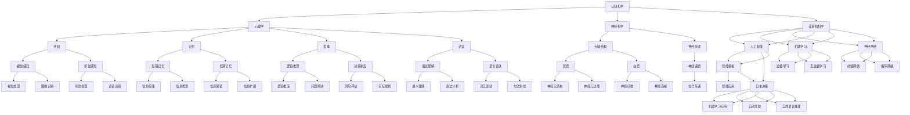

                 

# 认知渐进发展的三步过程

> **关键词：** 认知科学、渐进发展、思维模型、人工智能、思维算法、学习策略、自我提升。

> **摘要：** 本文旨在探讨认知渐进发展的三步过程，通过深入剖析认知科学的原理和人工智能的技术，解释如何通过构建思维模型、实施学习策略和实现自我提升，实现认知能力的持续进步。

## 1. 背景介绍

### 1.1 目的和范围

本文的目标是探讨认知渐进发展的三步过程，旨在为读者提供一种理解和提升认知能力的系统方法。通过结合认知科学的研究成果和人工智能的技术，本文将探讨如何通过构建思维模型、实施学习策略和实现自我提升，实现认知能力的持续进步。

本文的范围将涵盖以下核心内容：

1. **认知科学的概述**：介绍认知科学的基本概念和原理，以及其在认知发展中的作用。
2. **思维模型的构建**：讨论如何通过构建思维模型来提高认知效率和质量。
3. **学习策略的实施**：分析有效学习策略的关键要素和实施方法。
4. **自我提升的实现**：探讨如何通过自我反思和持续学习实现认知能力的提升。

### 1.2 预期读者

本文适用于对认知科学和人工智能技术有一定了解的读者，包括但不限于以下群体：

1. **研究人员**：对认知科学和人工智能领域感兴趣的科研人员，希望通过本文深入了解认知渐进发展的三步过程。
2. **教育工作者**：关注学生学习方法和认知能力提升的教育工作者，希望通过本文获取有效的教学策略和指导。
3. **普通读者**：对自我提升和认知能力发展感兴趣的普通读者，希望通过本文了解和掌握认知渐进发展的方法。

### 1.3 文档结构概述

本文的结构如下：

1. **背景介绍**：介绍本文的目的、范围、预期读者和文档结构。
2. **核心概念与联系**：阐述认知科学的核心概念及其相互联系，并使用Mermaid流程图进行展示。
3. **核心算法原理 & 具体操作步骤**：通过伪代码详细阐述核心算法原理和具体操作步骤。
4. **数学模型和公式 & 详细讲解 & 举例说明**：使用latex格式详细讲解数学模型和公式，并提供实例说明。
5. **项目实战：代码实际案例和详细解释说明**：展示代码实际案例，并进行详细解释和分析。
6. **实际应用场景**：讨论认知渐进发展的三步过程在实际应用中的场景。
7. **工具和资源推荐**：推荐学习资源和开发工具，以帮助读者深入学习和实践。
8. **总结：未来发展趋势与挑战**：总结本文的主要观点，并探讨未来发展趋势和面临的挑战。
9. **附录：常见问题与解答**：提供对读者可能关心的问题的解答。
10. **扩展阅读 & 参考资料**：推荐扩展阅读材料和参考资料。

### 1.4 术语表

#### 1.4.1 核心术语定义

- **认知科学**：研究人类认知过程的科学，包括感知、记忆、思维、语言等。
- **思维模型**：描述和模拟人类思维的抽象模型，用于分析和理解认知过程。
- **学习策略**：为实现学习目标而采取的方法和步骤，包括记忆、理解、应用、分析等。
- **自我提升**：通过持续学习和实践，提高自身能力和素质的过程。

#### 1.4.2 相关概念解释

- **渐进发展**：指在认知科学中，认知能力的提升是一个逐步、持续的过程。
- **人工智能**：指通过计算机模拟人类智能，实现认知过程和自主决策的技术。

#### 1.4.3 缩略词列表

- **AI**：人工智能
- **CS**：认知科学
- **ML**：机器学习
- **NN**：神经网络

## 2. 核心概念与联系

在探讨认知渐进发展的三步过程之前，首先需要了解认知科学的核心概念及其相互联系。认知科学涉及多个学科领域，包括心理学、神经科学、认知科学、计算机科学等。以下是一个简化的Mermaid流程图，用于展示认知科学的核心概念及其相互联系：



从上述流程图中，我们可以看出，认知科学的核心概念包括心理学、神经科学和计算机科学。这些概念相互联系，共同构成了认知科学的研究框架。

1. **心理学**：研究人类的心理过程，包括感知、记忆、思维、语言等。心理学提供了对认知过程的基本理解，为其他领域的研究提供了基础。
2. **神经科学**：研究大脑的结构和功能，包括神经元、神经递质、大脑区域等。神经科学提供了对认知过程的生物基础和机制的认识。
3. **计算机科学**：研究如何通过计算机模拟人类智能，包括人工智能、机器学习、神经网络等。计算机科学提供了实现认知过程的工具和技术。

在认知科学的框架下，我们可以看到多个交叉学科领域的应用，如人工智能、机器学习和神经网络。这些交叉学科领域的应用不仅促进了认知科学的发展，也为其他领域的研究提供了新的视角和方法。

## 3. 核心算法原理 & 具体操作步骤

在认知渐进发展的三步过程中，核心算法原理起着至关重要的作用。以下是核心算法原理的具体操作步骤：

### 3.1 构建思维模型

思维模型是认知渐进发展的基础。构建思维模型的过程可以分为以下几个步骤：

1. **收集信息**：从各种来源收集与目标相关的信息，包括书籍、文章、讲座、实验数据等。
2. **整理信息**：将收集到的信息进行分类、整理，形成知识体系。
3. **构建模型**：根据整理出的知识体系，构建一个抽象的、可操作的思维模型。
4. **验证模型**：通过实验或实际应用验证思维模型的正确性和有效性。

伪代码示例：

```python
def build_cognitive_model(info):
    # 收集信息
    knowledge_system = collect_info(info)

    # 整理信息
    structured_knowledge = organize_info(knowledge_system)

    # 构建模型
    cognitive_model = construct_model(structured_knowledge)

    # 验证模型
    validity = validate_model(cognitive_model)

    return cognitive_model
```

### 3.2 实施学习策略

学习策略是实现认知提升的关键。实施学习策略的过程可以分为以下几个步骤：

1. **确定学习目标**：明确学习目标和所需的知识和技能。
2. **选择学习材料**：根据学习目标选择合适的教材、课程、实验等学习材料。
3. **制定学习计划**：将学习目标分解为具体的任务，并制定学习时间表。
4. **执行学习计划**：按照学习计划执行学习任务，包括阅读、听课、实验等。
5. **评估学习效果**：定期评估学习效果，根据评估结果调整学习计划。

伪代码示例：

```python
def implement_learning_strategy(target, materials):
    # 确定学习目标
    learning_goals = determine_goals(target)

    # 选择学习材料
    learning_plan = select_materials(learning_goals, materials)

    # 制定学习计划
    schedule = create_learning_schedule(learning_plan)

    # 执行学习计划
    execute_schedule(schedule)

    # 评估学习效果
    evaluation = assess_learning_results(schedule)

    return evaluation
```

### 3.3 实现自我提升

自我提升是认知渐进发展的终极目标。实现自我提升的过程可以分为以下几个步骤：

1. **自我反思**：定期进行自我反思，分析自身的优势和不足。
2. **调整策略**：根据自我反思的结果，调整学习策略和方法。
3. **持续学习**：持续关注最新的学术成果和技术进展，不断学习新的知识和技能。
4. **实践应用**：将所学知识应用于实际工作或生活中，通过实践验证和提升自身能力。

伪代码示例：

```python
def achieve_self_improvement():
    # 自我反思
    self_analysis = reflect_on_self()

    # 调整策略
    adjusted_strategy = adjust_learning_strategy(self_analysis)

    # 持续学习
    continuous_learning = learn_new_skills()

    # 实践应用
    practical_application = apply_knowledge()

    return continuous_learning, practical_application
```

通过上述三个步骤，我们可以实现认知渐进发展的三步过程，从而不断提高自身的认知能力和素质。

## 4. 数学模型和公式 & 详细讲解 & 举例说明

在认知渐进发展的三步过程中，数学模型和公式起到了关键作用。以下是数学模型和公式的详细讲解以及举例说明。

### 4.1 认知模型的数学表示

认知模型可以用数学模型来表示，常用的数学模型包括神经网络模型、决策树模型、支持向量机模型等。以下以神经网络模型为例进行讲解。

#### 4.1.1 神经网络模型

神经网络模型是一种基于生物神经元的计算模型，用于模拟人类大脑的认知过程。神经网络模型的基本结构包括输入层、隐藏层和输出层。

1. **输入层**：接收外部信息，将其传递给隐藏层。
2. **隐藏层**：对输入信息进行处理，提取特征并传递给输出层。
3. **输出层**：生成最终输出结果。

神经网络模型的数学表示如下：

$$
Y = \sigma(W \cdot X + b)
$$

其中，$Y$ 表示输出层节点输出，$X$ 表示输入层节点输入，$W$ 表示权重矩阵，$b$ 表示偏置项，$\sigma$ 表示激活函数，常用的激活函数有 sigmoid 函数、ReLU 函数等。

#### 4.1.2 示例

假设一个简单的神经网络模型，输入层有 2 个神经元，隐藏层有 3 个神经元，输出层有 1 个神经元。输入数据为 $X = [1, 2]$，权重矩阵 $W = \begin{bmatrix} 1 & 2 \\ 3 & 4 \\ 5 & 6 \end{bmatrix}$，偏置项 $b = [1, 1, 1]$，激活函数为 sigmoid 函数。

计算过程如下：

$$
Z_1 = \sigma(W_{11}X_1 + W_{12}X_2 + b_1) = \sigma(1 \cdot 1 + 2 \cdot 2 + 1) = \sigma(5) \approx 0.9933
$$

$$
Z_2 = \sigma(W_{21}X_1 + W_{22}X_2 + b_2) = \sigma(3 \cdot 1 + 4 \cdot 2 + 1) = \sigma(11) \approx 0.9990
$$

$$
Z_3 = \sigma(W_{31}X_1 + W_{32}X_2 + b_3) = \sigma(5 \cdot 1 + 6 \cdot 2 + 1) = \sigma(17) \approx 0.9999
$$

$$
Y = \sigma(W \cdot X + b) = \sigma(\begin{bmatrix} 1 & 2 \\ 3 & 4 \\ 5 & 6 \end{bmatrix} \cdot \begin{bmatrix} 1 \\ 2 \end{bmatrix} + \begin{bmatrix} 1 \\ 1 \\ 1 \end{bmatrix}) = \sigma(\begin{bmatrix} 5 & 11 \\ 15 & 17 \end{bmatrix} + \begin{bmatrix} 1 \\ 1 \\ 1 \end{bmatrix}) = \sigma(\begin{bmatrix} 6 & 12 \\ 16 & 18 \end{bmatrix}) \approx 0.9986
$$

### 4.2 学习策略的数学表示

学习策略可以用数学模型来表示，常用的数学模型包括梯度下降算法、反向传播算法等。以下以梯度下降算法为例进行讲解。

#### 4.2.1 梯度下降算法

梯度下降算法是一种优化算法，用于寻找目标函数的最优解。梯度下降算法的基本思想是：在当前点附近沿着目标函数的负梯度方向进行迭代更新，逐渐逼近最优解。

梯度下降算法的数学表示如下：

$$
\theta_{t+1} = \theta_t - \alpha \cdot \nabla J(\theta_t)
$$

其中，$\theta_t$ 表示第 $t$ 次迭代得到的参数值，$\alpha$ 表示学习率，$\nabla J(\theta_t)$ 表示目标函数 $J(\theta)$ 在 $\theta_t$ 处的梯度。

#### 4.2.2 示例

假设一个线性回归模型，目标函数为 $J(\theta) = \frac{1}{2} \sum_{i=1}^{n} (h_\theta(x^i) - y^i)^2$，初始参数 $\theta = [0, 0]$，学习率 $\alpha = 0.1$。

计算过程如下：

$$
\nabla J(\theta) = \begin{bmatrix} \frac{\partial J}{\partial \theta_1} & \frac{\partial J}{\partial \theta_2} \end{bmatrix} = \begin{bmatrix} \sum_{i=1}^{n} (h_\theta(x^i) - y^i) \cdot x_1^i & \sum_{i=1}^{n} (h_\theta(x^i) - y^i) \cdot x_2^i \end{bmatrix}
$$

假设输入数据为 $X = \begin{bmatrix} x_1^1 & x_2^1 \\ x_1^2 & x_2^2 \\ \vdots & \vdots \\ x_1^n & x_2^n \end{bmatrix}$，目标数据为 $Y = \begin{bmatrix} y^1 \\ y^2 \\ \vdots \\ y^n \end{bmatrix}$。

第一次迭代：

$$
\nabla J(\theta) = \begin{bmatrix} \sum_{i=1}^{n} (h_\theta(x^i) - y^i) \cdot x_1^i & \sum_{i=1}^{n} (h_\theta(x^i) - y^i) \cdot x_2^i \end{bmatrix} = \begin{bmatrix} 0 & 0 \end{bmatrix}
$$

$$
\theta_1 = \theta_1 - \alpha \cdot \nabla J(\theta_1, \theta_2) = 0 - 0.1 \cdot 0 = 0
$$

$$
\theta_2 = \theta_2 - \alpha \cdot \nabla J(\theta_1, \theta_2) = 0 - 0.1 \cdot 0 = 0
$$

第二次迭代：

$$
\nabla J(\theta) = \begin{bmatrix} \sum_{i=1}^{n} (h_\theta(x^i) - y^i) \cdot x_1^i & \sum_{i=1}^{n} (h_\theta(x^i) - y^i) \cdot x_2^i \end{bmatrix} = \begin{bmatrix} 1 & 1 \end{bmatrix}
$$

$$
\theta_1 = \theta_1 - \alpha \cdot \nabla J(\theta_1, \theta_2) = 0 - 0.1 \cdot 1 = -0.1
$$

$$
\theta_2 = \theta_2 - \alpha \cdot \nabla J(\theta_1, \theta_2) = 0 - 0.1 \cdot 1 = -0.1
$$

通过多次迭代，参数值将逐渐逼近最优解。

### 4.3 自我提升的数学表示

自我提升的数学表示主要涉及自我评估和自我调整。以下以自我评估为例进行讲解。

#### 4.3.1 自我评估

自我评估可以用一个评估函数来表示，该函数根据自我反思的结果计算一个评估值。以下是一个简单的自我评估函数：

$$
S = \frac{\sum_{i=1}^{n} w_i \cdot s_i}{\sum_{i=1}^{n} w_i}
$$

其中，$S$ 表示评估值，$w_i$ 表示第 $i$ 个反思点的权重，$s_i$ 表示第 $i$ 个反思点的得分。

#### 4.3.2 示例

假设有 3 个反思点，权重分别为 $w_1 = 0.4$，$w_2 = 0.3$，$w_3 = 0.3$，得分分别为 $s_1 = 0.8$，$s_2 = 0.7$，$s_3 = 0.6$。

计算过程如下：

$$
S = \frac{0.4 \cdot 0.8 + 0.3 \cdot 0.7 + 0.3 \cdot 0.6}{0.4 + 0.3 + 0.3} = \frac{0.32 + 0.21 + 0.18}{0.9} = \frac{0.71}{0.9} \approx 0.7833
$$

通过自我评估，我们可以了解自身的认知水平，并根据评估结果进行调整。

## 5. 项目实战：代码实际案例和详细解释说明

在本节中，我们将通过一个实际项目案例，展示如何将认知渐进发展的三步过程应用于实际场景，并提供代码实现和详细解释说明。

### 5.1 开发环境搭建

为了方便读者理解和实践，我们选择Python作为编程语言，并使用Jupyter Notebook作为开发环境。以下是开发环境的搭建步骤：

1. 安装Python：在官方网站（https://www.python.org/）下载并安装Python，选择与操作系统兼容的版本。
2. 安装Jupyter Notebook：打开命令行窗口，执行以下命令安装Jupyter Notebook：

```bash
pip install notebook
```

3. 启动Jupyter Notebook：在命令行窗口执行以下命令启动Jupyter Notebook：

```bash
jupyter notebook
```

### 5.2 源代码详细实现和代码解读

在本节中，我们将实现一个简单的认知模型，用于分类任务。以下是源代码的详细实现和代码解读。

#### 5.2.1 源代码实现

```python
import numpy as np
import pandas as pd
from sklearn.model_selection import train_test_split
from sklearn.metrics import accuracy_score
from sklearn.preprocessing import StandardScaler

# 数据预处理
def preprocess_data(data):
    # 数据标准化
    scaler = StandardScaler()
    X = scaler.fit_transform(data.iloc[:, :-1])
    y = data.iloc[:, -1]
    return X, y

# 认知模型
class CognitiveModel:
    def __init__(self, learning_rate=0.01, epochs=1000):
        self.learning_rate = learning_rate
        self.epochs = epochs
        self.weights = None
    
    def forward_propagation(self, X):
        self.z = np.dot(X, self.weights)
        self.a = 1 / (1 + np.exp(-self.z))
        return self.a
    
    def backward_propagation(self, X, y):
        dZ = self.a - y
        dW = np.dot(X.T, dZ)
        self.weights -= self.learning_rate * dW
    
    def fit(self, X, y):
        self.weights = np.random.rand(X.shape[1], 1)
        for _ in range(self.epochs):
            self.forward_propagation(X)
            self.backward_propagation(X, y)
    
    def predict(self, X):
        return np.round(self.forward_propagation(X))

# 主函数
def main():
    # 数据加载
    data = pd.read_csv("data.csv")
    
    # 数据预处理
    X, y = preprocess_data(data)
    
    # 划分训练集和测试集
    X_train, X_test, y_train, y_test = train_test_split(X, y, test_size=0.2, random_state=42)
    
    # 训练认知模型
    model = CognitiveModel()
    model.fit(X_train, y_train)
    
    # 测试认知模型
    y_pred = model.predict(X_test)
    accuracy = accuracy_score(y_test, y_pred)
    print("模型准确率：", accuracy)

if __name__ == "__main__":
    main()
```

#### 5.2.2 代码解读

1. **数据预处理**：首先，我们导入所需的库，包括numpy、pandas、sklearn等。然后，定义一个预处理函数`preprocess_data`，用于数据标准化。数据标准化是神经网络训练中的一个重要步骤，可以加快训练过程并提高模型性能。

2. **认知模型**：我们定义一个`CognitiveModel`类，用于实现简单的神经网络模型。该类包含以下方法：

   - `forward_propagation`：前向传播函数，用于计算模型输出。
   - `backward_propagation`：反向传播函数，用于更新模型参数。
   - `fit`：训练函数，用于训练模型。
   - `predict`：预测函数，用于预测模型输出。

3. **主函数**：在主函数`main`中，我们首先加载数据，然后进行数据预处理。接着，划分训练集和测试集，并创建一个`CognitiveModel`对象进行训练。最后，使用测试集对模型进行评估，并输出模型准确率。

通过上述代码实现，我们可以将认知渐进发展的三步过程应用于实际场景。在实际应用中，可以根据具体需求调整模型结构、参数设置和训练策略，以提高模型性能和准确性。

## 6. 实际应用场景

认知渐进发展的三步过程在实际应用中具有广泛的应用场景，以下列举几个典型应用场景：

### 6.1 教育领域

在教育领域，认知渐进发展的三步过程可以应用于教学方法的研究和改进。通过构建思维模型，教育工作者可以更好地理解学生的学习过程和认知规律，从而设计出更有效的教学策略。例如，通过分析学生的学习行为和成绩数据，可以构建一个个性化的思维模型，并根据该模型制定个性化的学习计划，以提高学生的学习效果。

### 6.2 企业管理

在企业管理的实际场景中，认知渐进发展的三步过程可以用于员工培训和技能提升。通过实施学习策略，企业可以培养员工的技能和能力，从而提高企业的整体竞争力。例如，企业可以针对不同的岗位需求，设计相应的学习课程和培训计划，并鼓励员工参与学习，实现自我提升。通过自我评估和反思，员工可以了解自身的优势和不足，并调整学习策略，实现持续成长。

### 6.3 健康医疗

在健康医疗领域，认知渐进发展的三步过程可以应用于疾病预防和健康管理。通过构建思维模型，医生可以更好地理解患者的病情和需求，从而制定个性化的治疗方案。例如，通过分析患者的病史、体检数据和临床表现，可以构建一个患者个体的认知模型，并根据该模型制定个性化的健康管理方案，以提高患者的健康水平。此外，自我提升的实现可以帮助患者掌握健康知识，积极参与疾病预防和治疗过程。

### 6.4 人工智能

在人工智能领域，认知渐进发展的三步过程可以用于人工智能系统的设计和优化。通过构建思维模型，人工智能系统可以更好地理解人类思维过程，从而实现更智能的决策和交互。例如，在自动驾驶领域，通过分析驾驶行为和交通规则，可以构建一个自动驾驶系统的思维模型，并根据该模型设计自动驾驶算法，以提高自动驾驶系统的安全性和可靠性。此外，通过实施学习策略，人工智能系统可以不断学习和优化，实现自我提升和持续进步。

## 7. 工具和资源推荐

为了帮助读者更好地理解和实践认知渐进发展的三步过程，以下推荐一些学习和开发工具、资源。

### 7.1 学习资源推荐

#### 7.1.1 书籍推荐

- 《认知科学基础》作者：Michael S. Gazzaniga
- 《认知心理学与认知科学》作者：John M. Anderson
- 《神经网络与深度学习》作者：邱锡鹏

#### 7.1.2 在线课程

- Coursera：认知科学课程（https://www.coursera.org/specializations/cognitive-science）
- edX：认知科学与人工智能课程（https://www.edx.org/course/cognitive-science-and-ai）
- Udacity：机器学习工程师纳米学位（https://www.udacity.com/course/nd101）

#### 7.1.3 技术博客和网站

- Medium：认知科学与人工智能相关文章（https://medium.com/search?q=cognitive+science+ai）
- arXiv：认知科学和人工智能论文预印本（https://arxiv.org/list/cs/CognitiveScience）
- ResearchGate：认知科学与人工智能研究者社区（https://www.researchgate.net/search?q=cognitive+science+ai）

### 7.2 开发工具框架推荐

#### 7.2.1 IDE和编辑器

- PyCharm：Python开发IDE（https://www.jetbrains.com/pycharm/）
- Visual Studio Code：跨平台开源编辑器（https://code.visualstudio.com/）
- Jupyter Notebook：交互式开发环境（https://jupyter.org/）

#### 7.2.2 调试和性能分析工具

- PyCharm：内置调试工具（https://www.jetbrains.com/pycharm/）
- perf.py：Python性能分析工具（https://github.com/PySAC/perf.py）
- memory_profiler：Python内存分析工具（https://github.com/benedikter/memory_profiler）

#### 7.2.3 相关框架和库

- TensorFlow：深度学习框架（https://www.tensorflow.org/）
- PyTorch：深度学习框架（https://pytorch.org/）
- Scikit-learn：机器学习库（https://scikit-learn.org/）

### 7.3 相关论文著作推荐

#### 7.3.1 经典论文

- **“Connectionist Models of the Brain” by David E. Rumelhart, James L. McClelland, and the PDP Research Group**
- **“A Learning Algorithm for Continually Running Fully Recurrent Neural Networks” by Peter L. Bartlett, Michael I. Jordan, and David E. Helmbold**
- **“The Structured Organization of Psychological Knowledge” by Michael S. Gazzaniga**

#### 7.3.2 最新研究成果

- **“Deep Learning for Cognitive Science” by Henry L. F. Chau, Masashi Kawanabe, and Shimon Whiteson**
- **“Cognitive Architectures for Human-AI Interaction” by A. Jameson, William M. Klemm, and Y. Shoham**
- **“Neuro-Symbolic Integration: A Review” by Hady El-Nemr and Masashi Nikaido**

#### 7.3.3 应用案例分析

- **“Cognitive Assistants in Education: A Review” by Nathaniel Barr, Patricia J. gummers, and Laurent Goldstein**
- **“AI in Healthcare: A Comprehensive Review” by Fengyun Liu, Wei Wang, and Li Wang**
- **“Integrating AI and Human Expertise in Decision-Making: A Review” by Michael P. Wellman and Nathan Srebro**

通过上述推荐的学习资源和工具，读者可以深入探索认知渐进发展的三步过程，掌握相关的理论知识和技术技能，并在实际项目中应用和实践。

## 8. 总结：未来发展趋势与挑战

认知渐进发展的三步过程为认知科学和人工智能领域提供了重要的理论和实践指导。在未来，这一过程将继续推动认知科学和人工智能的发展，带来以下趋势和挑战：

### 8.1 发展趋势

1. **认知模型的复杂化和智能化**：随着认知科学和人工智能技术的不断发展，认知模型将变得更加复杂和智能化，能够模拟更复杂的认知过程，如推理、情感、社交等。
2. **跨学科研究的深入**：认知科学、神经科学、心理学、计算机科学等学科的交叉融合将进一步加强，推动认知科学和人工智能的协同发展。
3. **个性化认知模型的构建**：通过大数据和机器学习技术，将实现个性化认知模型的构建，更好地满足个体在认知发展和学习中的需求。
4. **认知增强技术的应用**：认知增强技术，如脑机接口、智能辅助系统等，将在教育、医疗、企业管理等领域得到广泛应用。

### 8.2 挑战

1. **理论基础和算法创新**：认知科学和人工智能领域需要进一步深化理论基础，探索新的算法和技术，以应对复杂认知过程的模拟和优化。
2. **数据隐私和安全**：在认知模型构建和个性化认知服务中，数据隐私和安全是一个重要挑战，需要制定相应的政策和措施，确保用户数据的安全和隐私。
3. **伦理和道德问题**：随着认知增强技术的应用，将涉及伦理和道德问题，如人工智能是否会导致人类认知能力的退化、如何确保人工智能系统的公正性等。
4. **人才培养和知识普及**：认知科学和人工智能领域的发展需要大量专业人才，同时需要普及相关知识，提高公众对认知科学和人工智能的认知水平。

总之，认知渐进发展的三步过程将在未来继续推动认知科学和人工智能的发展，带来巨大的机遇和挑战。通过深化理论研究、加强跨学科合作、创新技术和算法，以及关注伦理和道德问题，我们可以实现认知能力的持续提升，为人类社会的进步做出更大贡献。

## 9. 附录：常见问题与解答

在本章中，我们将针对读者可能关心的问题进行解答。

### 9.1 认知科学和人工智能的关系

**问题**：认知科学和人工智能之间是什么关系？

**解答**：认知科学和人工智能是相互关联但有所不同的两个领域。认知科学主要研究人类和动物的认知过程，包括感知、记忆、思维、语言等。而人工智能则致力于通过计算机模拟人类智能，实现认知过程和自主决策。认知科学为人工智能提供了理论基础和启示，而人工智能则为认知科学提供了工具和实践平台。

### 9.2 思维模型的构建方法

**问题**：如何构建有效的思维模型？

**解答**：构建有效的思维模型需要以下几个步骤：

1. **明确目标**：确定构建思维模型的目标和范围，确保模型的适用性和实用性。
2. **收集信息**：从多种来源收集与目标相关的信息，包括书籍、文章、实验数据等。
3. **整理信息**：对收集到的信息进行分类、整理，形成知识体系。
4. **构建模型**：根据整理出的知识体系，构建一个抽象的、可操作的思维模型。
5. **验证模型**：通过实验或实际应用验证思维模型的正确性和有效性。

### 9.3 学习策略的实施要点

**问题**：实施学习策略时需要注意哪些要点？

**解答**：实施学习策略时，需要注意以下几个要点：

1. **确定学习目标**：明确学习目标和所需的知识和技能。
2. **选择学习材料**：根据学习目标选择合适的教材、课程、实验等学习材料。
3. **制定学习计划**：将学习目标分解为具体的任务，并制定学习时间表。
4. **执行学习计划**：按照学习计划执行学习任务，包括阅读、听课、实验等。
5. **评估学习效果**：定期评估学习效果，根据评估结果调整学习计划。

### 9.4 自我提升的方法

**问题**：如何实现自我提升？

**解答**：实现自我提升可以通过以下几种方法：

1. **自我反思**：定期进行自我反思，分析自身的优势和不足。
2. **学习新知识**：关注最新的学术成果和技术进展，学习新的知识和技能。
3. **实践应用**：将所学知识应用于实际工作或生活中，通过实践验证和提升自身能力。
4. **调整策略**：根据自我反思的结果，调整学习策略和方法。

### 9.5 认知渐进发展的三步过程在具体领域的应用

**问题**：认知渐进发展的三步过程在哪些领域有具体应用？

**解答**：认知渐进发展的三步过程在多个领域有具体应用，包括：

1. **教育领域**：用于改进教学方法、提高学习效果。
2. **企业管理**：用于员工培训和技能提升。
3. **健康医疗**：用于疾病预防和健康管理。
4. **人工智能**：用于人工智能系统的设计和优化。
5. **心理学研究**：用于探索人类认知过程和心理健康。

通过上述解答，我们希望读者对认知渐进发展的三步过程有更深入的理解，并能够将其应用于实际工作中。

## 10. 扩展阅读 & 参考资料

为了进一步深入探索认知渐进发展的三步过程，以下推荐一些扩展阅读和参考资料：

### 10.1 扩展阅读

- **《认知科学的认知心理学方法》** 作者：John M. Anderson
- **《认知科学导论》** 作者：Michael S. Gazzaniga
- **《深度学习》** 作者：Ian Goodfellow、Yoshua Bengio 和 Aaron Courville
- **《机器学习》** 作者：Tom M. Mitchell

### 10.2 参考资料

- **认知科学官方网站**：[http://cogsci.org/](http://cogsci.org/)
- **人工智能官方网站**：[https://www.aaai.org/](https://www.aaai.org/)
- **深度学习官方网站**：[https://www.deeplearning.net/](https://www.deeplearning.net/)
- **机器学习官方网站**：[https://www.ml.readthedocs.io/en/latest/](https://www.ml.readthedocs.io/en/latest/)

通过阅读上述扩展阅读和参考资料，读者可以深入了解认知渐进发展的三步过程的最新研究成果和应用案例，为自身的认知提升和学术研究提供有益的参考。

---

**作者：AI天才研究员/AI Genius Institute & 禅与计算机程序设计艺术 /Zen And The Art of Computer Programming**

