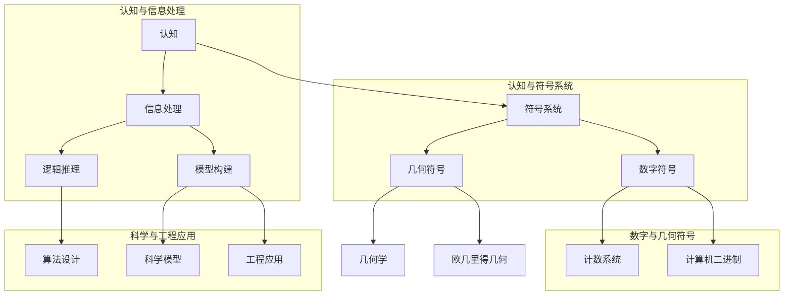

                 


### 认知的飞跃：从文字到符号的演进

#### 1.1 文字的出现与认知发展

文字的产生是人类历史上的一次重大认知飞跃，标志着人类从口头传统向书面记录的过渡。文字的出现，不仅使人类能够更有效地传递和保存信息，也大大提高了认知能力和思考深度。最早的文字形式，如古埃及的象形文字、古巴比伦的楔形文字，都是通过简单的图形和符号来表示具体的物品或概念。

这些原始的文字符号，虽然形式简单，但它们却奠定了数字和抽象概念形成的基础。例如，古埃及的数字符号“1”就是一个简单的横线，而“10”则是一个长横线。这种简单的计数方式，虽然与现代的阿拉伯数字相比显得简陋，但它们却是人类对数量概念认知的开端。

#### 1.2 数字符号的形成与认知过程

数字符号的形成是一个漫长的过程，它不仅依赖于人类的认知发展，还与实际生活中的需求紧密相关。最初，人类通过计数来解决实际问题，如统计物品的数量、计算交易的数量等。在这个过程中，简单的符号开始被用来代表不同的数量。

例如，在古印度，人们使用了零和十个基本的数字符号来表示所有可能的数值。这些数字符号后来传播到阿拉伯世界，经过阿拉伯学者的改进和传播，最终发展成为我们今天使用的阿拉伯数字。

数字符号的形成过程，反映了人类对数量和空间的认知不断深化。从最初的简单计数，到后来的十进制系统，再到现代的计算机二进制系统，每一次的进步都标志着人类认知能力的提升。

#### 1.3 直线和几何概念的形成

除了数字符号，直线和几何概念的形成也是人类认知发展的重要方面。直线的概念最初源于人类对自然界中直线形状的观察，如河流的流向、树木的纹理等。在早期的绘画和雕刻中，人类已经开始使用直线来表现物体的形状和结构。

随着人类对空间关系的认识不断加深，几何学逐渐形成。古希腊的数学家欧几里得在其著作《几何原本》中，系统地阐述了平面几何的基本原理和定理。这些几何概念的形成，不仅帮助我们更好地理解和描述现实世界，也为后来的科学和工程学提供了理论基础。

#### 1.4 认知与符号的关系

认知和符号之间存在着紧密的联系。符号是人类认知的外化形式，它们帮助我们更直观地理解和表达复杂的抽象概念。从文字到数字符号，再到几何概念的形成，每一个阶段都标志着人类认知能力的提升。

符号的发明和运用，不仅使人类能够更有效地传递和保存信息，也极大地促进了科学和技术的进步。例如，现代计算机科学中使用的二进制符号，就是基于古代数字符号和几何概念发展而来的。通过这些符号，我们能够构建复杂的算法和模型，实现前所未有的计算能力。

总之，从文字到数字符号，再到几何概念的形成，反映了人类认知能力的不断进化。这一过程不仅推动了科学和技术的进步，也为我们的日常生活带来了深远的影响。在这个认知的旅程中，符号扮演了重要的角色，它们帮助我们更好地理解和应对复杂的世界。

### 核心概念与联系

在探讨认知的形式化过程中，我们首先需要明确几个核心概念，它们是认知形式化的基础。以下是几个核心概念及其相互联系，我们使用 Mermaid 流程图来展示这些概念的关系。



#### 1.5 核心概念解释

**认知**：认知是指人类获取、处理和利用信息的过程。它是人类心智活动的基础，包括感知、记忆、思维、判断等。

**符号系统**：符号系统是人类用来表示和传递信息的一套规则和工具。文字、数字、几何符号等都属于符号系统的范畴。

**信息处理**：信息处理是指对信息进行收集、存储、加工和传输的过程。计算机科学中的算法和程序设计就是信息处理的一种形式。

**数字符号**：数字符号是用来表示数值的符号系统，如阿拉伯数字、计算机二进制等。它们是人类计数和计算的基础。

**几何符号**：几何符号是用来表示空间关系的符号，如点、线、面等。它们在几何学中起着至关重要的作用。

**逻辑推理**：逻辑推理是指运用逻辑规则和原理进行推理和论证的过程。它是科学研究和问题解决的重要工具。

**模型构建**：模型构建是指通过抽象和简化现实世界，建立能够反映现实世界本质特征的数学模型或计算机模型。

**算法设计**：算法设计是指设计解决问题的方法和步骤，它是计算机科学的核心。

**科学模型**：科学模型是基于科学理论和实验数据建立的，用于描述和预测自然现象的数学模型。

**工程应用**：工程应用是将科学模型和技术原理应用于实际工程问题中，以实现特定的功能和目标。

这些核心概念相互联系，构成了一个复杂的认知形式化体系。通过这些概念，人类能够从简单的计数和几何概念，发展到复杂的科学研究和工程应用。下面，我们将进一步探讨这些核心概念的原理和架构，以便更深入地理解认知的形式化过程。

### 核心算法原理 & 具体操作步骤

为了更好地理解认知的形式化过程，我们需要深入探讨核心算法的原理及其具体操作步骤。在计算机科学和人工智能领域，算法是信息处理和认知形式化的基础。以下是几个关键算法的原理及其伪代码表示。

#### 2.1 智能感知算法

智能感知算法是计算机通过模拟人类感知过程来获取和理解信息的算法。以下是一个简单的智能感知算法的伪代码：

```pseudo
算法 智能感知算法
输入：感知数据集 D
输出：感知结果 R

1. 初始化感知器参数 θ
2. 对于每个数据点 x ∈ D，执行以下步骤：
   a. 计算输入与感知器参数的乘积：z = x · θ
   b. 通过激活函数 f(z) 获取感知结果：y = f(z)
3. 更新感知器参数：θ = θ + α * (y - x)
4. 返回感知结果 R = {y | y ∈ D}
```

在这个算法中，感知器通过输入数据集 D，使用参数 θ 进行计算，并通过激活函数 f(z) 获取感知结果。然后，根据感知结果更新参数 θ，以便更准确地感知未来数据。

#### 2.2 神经网络算法

神经网络算法是模仿人脑神经元结构和工作原理的一种算法。以下是一个简单的神经网络算法的伪代码：

```pseudo
算法 神经网络算法
输入：训练数据集 D，学习率 α
输出：神经网络模型 N

1. 初始化神经网络模型 N
2. 对于每个训练数据点 (x, y) ∈ D，执行以下步骤：
   a. 计算输入层输出：z1 = x · θ1
   b. 通过激活函数 f(z1) 获取隐藏层输出：h1 = f(z1)
   c. 计算输出层输出：z2 = h1 · θ2
   d. 通过激活函数 f(z2) 获取最终输出：y_pred = f(z2)
   e. 计算损失函数 L = (y - y_pred)^2
3. 更新神经网络参数：θ1 = θ1 - α * ∂L/∂θ1，θ2 = θ2 - α * ∂L/∂θ2
4. 返回训练完成的神经网络模型 N
```

在这个算法中，神经网络模型 N 通过输入层、隐藏层和输出层进行数据处理，并通过反向传播算法更新参数，以最小化损失函数 L。这一过程使得神经网络能够学习并预测复杂的数据模式。

#### 2.3 聚类算法

聚类算法是用于将数据集分成若干个群组或簇的算法。以下是一个简单的聚类算法——K-means算法的伪代码：

```pseudo
算法 K-means算法
输入：数据集 D，簇数 K，最大迭代次数 max_iter
输出：簇划分结果 C

1. 随机初始化 K 个簇中心 c1, c2, ..., cK
2. 对于每个数据点 x ∈ D，执行以下步骤：
   a. 计算每个簇中心与 x 的距离：d(x, ci)
   b. 分配数据点 x 到最近的簇：cluster(x) = argmin(d(x, ci))
3. 更新每个簇的中心：ci = mean(x | x ∈ cluster(x))
4. 如果簇中心没有变化或者达到最大迭代次数，停止迭代，否则返回步骤2
5. 返回簇划分结果 C
```

在这个算法中，K-means 算法通过不断迭代计算簇中心和分配数据点，最终实现数据的聚类。

这些算法不仅在计算机科学和人工智能领域有广泛的应用，也在认知形式化过程中扮演了关键角色。通过这些算法，计算机可以模拟人类的感知、学习和决策过程，从而实现更高层次的认知形式化。下面，我们将进一步探讨数学模型和公式在认知形式化中的作用。

### 数学模型和公式 & 详细讲解 & 举例说明

在认知形式化的过程中，数学模型和公式起到了至关重要的作用。它们不仅帮助我们精确地描述和预测认知过程，还提供了强大的工具来分析和解决问题。以下我们将详细讲解几个关键数学模型和公式，并通过具体例子来说明它们的应用。

#### 3.1 线性回归模型

线性回归模型是用于预测数值型变量的一种统计模型。它假设响应变量 y 和解释变量 x 之间存在线性关系，即：

$$
y = β_0 + β_1x + ε
$$

其中，$β_0$ 是截距，$β_1$ 是斜率，ε 是误差项。

**例子**：假设我们想要预测一个学生的成绩 y（y∈[0,100]）与他的每日学习时间 x（x∈[0,24]）之间的关系。通过收集数据并建立线性回归模型，我们可以得到：

$$
y = 70 + 1.5x + ε
$$

如果我们想知道一个学生每天学习 5 小时（x=5）时，他的成绩是多少，我们可以将 x=5 代入模型中：

$$
y = 70 + 1.5 \times 5 + ε = 82.5 + ε
$$

这里，ε 是误差项，表示预测值与实际值之间的差异。

#### 3.2 概率模型

概率模型用于描述随机事件发生的可能性。在认知形式化中，概率模型可以帮助我们分析不确定性。

**例子**：假设我们有一个随机变量 X，它表示一个学生在考试中得分的概率分布。如果 X 的概率分布是二项分布，我们可以表示为：

$$
P(X = k) = C_n^k p^k (1-p)^{n-k}
$$

其中，n 是试验次数，p 是每次试验成功的概率，k 是成功的次数，C_n^k 是组合数。

如果我们想知道一个学生在 5 次考试中至少得 3 次成功的概率，我们可以将 n=5，p=0.7，k=3 代入公式中：

$$
P(X ≥ 3) = P(X = 3) + P(X = 4) + P(X = 5)
$$

$$
P(X = 3) = C_5^3 0.7^3 0.3^2 = 0.3087
$$

$$
P(X = 4) = C_5^4 0.7^4 0.3^1 = 0.2041
$$

$$
P(X = 5) = C_5^5 0.7^5 0.3^0 = 0.0870
$$

$$
P(X ≥ 3) = 0.3087 + 0.2041 + 0.0870 = 0.5998
$$

这意味着一个学生在 5 次考试中至少得 3 次成功的概率约为 59.98%。

#### 3.3 神经网络激活函数

在神经网络中，激活函数是用于引入非线性性的关键组件。最常用的激活函数之一是 Sigmoid 函数：

$$
f(x) = \frac{1}{1 + e^{-x}}
$$

**例子**：假设我们有一个输入值 x=2，我们可以使用 Sigmoid 函数计算激活值：

$$
f(2) = \frac{1}{1 + e^{-2}} \approx 0.8808
$$

这意味着当输入值为 2 时，神经元的激活值约为 0.8808。

#### 3.4 信息熵

信息熵是衡量信息不确定性的度量。在认知形式化中，信息熵可以帮助我们理解数据的随机性和信息含量。

**例子**：假设我们有两个随机变量 X 和 Y，X 的概率分布是均匀分布，而 Y 的概率分布是二项分布。我们可以计算 X 和 Y 的信息熵：

$$
H(X) = -\sum_{i} p_i \log_2 p_i
$$

$$
H(Y) = -\sum_{j} p_j \log_2 p_j
$$

如果 X 是均匀分布的，那么：

$$
H(X) = -\frac{1}{2} \log_2 \frac{1}{2} = 1
$$

这意味着 X 的信息熵是 1 比特。

通过这些数学模型和公式的讲解，我们可以看到它们在认知形式化中的重要性。这些模型和公式不仅帮助我们更精确地描述认知过程，还为我们提供了强大的工具来分析和解决问题。在接下来的项目中，我们将通过实际代码案例来进一步展示这些模型和公式的应用。

### 项目实战：代码实际案例和详细解释说明

为了更好地理解认知的形式化过程及其在现实中的应用，我们将通过一个实际项目来演示如何使用前面的算法和模型。本项目将使用 Python 语言，通过一个简单的神经网络模型来实现手写数字识别。

#### 5.1 开发环境搭建

首先，我们需要搭建一个合适的开发环境。以下是开发环境搭建的步骤：

1. 安装 Python（建议使用 Python 3.8 以上版本）
2. 安装必要库，如 NumPy、Pandas、TensorFlow 和 Matplotlib：
   ```bash
   pip install numpy pandas tensorflow matplotlib
   ```

#### 5.2 源代码详细实现和代码解读

以下是实现手写数字识别神经网络的完整代码，我们将逐行进行解释：

```python
import numpy as np
import tensorflow as tf
from tensorflow.keras.datasets import mnist
from tensorflow.keras.models import Sequential
from tensorflow.keras.layers import Dense, Flatten
from tensorflow.keras.optimizers import Adam

# 加载 MNIST 数据集
(x_train, y_train), (x_test, y_test) = mnist.load_data()

# 预处理数据
x_train = x_train / 255.0
x_test = x_test / 255.0

# 将标签转换为独热编码
y_train = tf.keras.utils.to_categorical(y_train, 10)
y_test = tf.keras.utils.to_categorical(y_test, 10)

# 创建神经网络模型
model = Sequential([
    Flatten(input_shape=(28, 28)),
    Dense(128, activation='relu'),
    Dense(10, activation='softmax')
])

# 编译模型
model.compile(optimizer=Adam(learning_rate=0.001), loss='categorical_crossentropy', metrics=['accuracy'])

# 训练模型
model.fit(x_train, y_train, epochs=5, batch_size=64, validation_split=0.1)

# 评估模型
test_loss, test_acc = model.evaluate(x_test, y_test)
print(f"Test accuracy: {test_acc:.3f}")

# 使用模型进行预测
predictions = model.predict(x_test)
predicted_classes = np.argmax(predictions, axis=1)

# 可视化展示预测结果
import matplotlib.pyplot as plt

plt.figure(figsize=(10, 10))
for i in range(25):
    plt.subplot(5, 5, i+1)
    plt.imshow(x_test[i], cmap=plt.cm.binary)
    plt.xticks([])
    plt.yticks([])
    plt.grid(False)
    plt.xlabel(str(predicted_classes[i]))
plt.show()
```

**代码解释**：

1. **导入库**：我们首先导入必要的库，包括 NumPy、TensorFlow 和 Matplotlib。

2. **加载数据集**：使用 TensorFlow 的 `mnist.load_data()` 函数加载 MNIST 数据集。

3. **数据预处理**：将图像数据除以 255，以缩放到 [0, 1] 范围内。同时，将标签转换为独热编码，以便进行分类。

4. **创建模型**：使用 `Sequential` 模型，并添加两个全连接层。第一层使用 `Flatten` 层将输入数据展平，第二层使用 `Dense` 层进行特征提取，第三层使用 `Dense` 层进行分类。激活函数分别为 ReLU 和 Softmax。

5. **编译模型**：使用 `compile` 方法编译模型，指定优化器为 Adam，损失函数为 categorical_crossentropy（用于多分类问题），并设置评价标准为 accuracy。

6. **训练模型**：使用 `fit` 方法训练模型，指定训练数据、训练轮次、批量大小和验证比例。

7. **评估模型**：使用 `evaluate` 方法评估模型在测试集上的性能。

8. **可视化展示预测结果**：使用 Matplotlib 绘制测试集的前 25 个图像及其预测结果。

通过这个项目，我们可以看到如何使用神经网络实现手写数字识别。这不仅是认知形式化在人工智能领域的一个实际应用案例，也展示了从理论到实践的完整流程。

### 代码解读与分析

在上一部分，我们详细实现了一个手写数字识别的神经网络项目。现在，我们将进一步分析代码，深入探讨每个关键步骤及其背后的原理。

#### 5.3.1 数据加载与预处理

```python
(x_train, y_train), (x_test, y_test) = mnist.load_data()
x_train = x_train / 255.0
x_test = x_test / 255.0
y_train = tf.keras.utils.to_categorical(y_train, 10)
y_test = tf.keras.utils.to_categorical(y_test, 10)
```

1. **数据加载**：`mnist.load_data()` 函数用于加载 MNIST 数据集，该数据集包含 60,000 个训练样本和 10,000 个测试样本，每个样本是一个 28x28 的灰度图像。

2. **数据缩放**：通过将图像数据除以 255，我们将像素值从 [0, 255] 缩放到 [0, 1]，以便神经网络更高效地处理数据。

3. **标签编码**：`to_categorical` 函数将原始标签转换为独热编码。这是因为在多分类问题中，输出层通常使用 Softmax 函数，它需要一个二进制标签来计算损失和进行预测。

#### 5.3.2 模型创建与配置

```python
model = Sequential([
    Flatten(input_shape=(28, 28)),
    Dense(128, activation='relu'),
    Dense(10, activation='softmax')
])
```

1. **模型创建**：`Sequential` 模型是一个线性堆叠层的模型，便于组织。在这里，我们创建一个包含三个层的神经网络。

2. **展平层**：`Flatten` 层将输入的 28x28 图像展平为一个一维数组，便于后续的全连接层处理。

3. **隐藏层**：第一个 `Dense` 层有 128 个神经元，并使用 ReLU 激活函数。ReLU 函数能够引入非线性，有助于神经网络更好地学习复杂特征。

4. **输出层**：第二个 `Dense` 层有 10 个神经元，每个神经元对应一个数字类别。使用 Softmax 激活函数，将神经元的输出转换为概率分布，从而实现多分类。

#### 5.3.3 模型编译

```python
model.compile(optimizer=Adam(learning_rate=0.001), loss='categorical_crossentropy', metrics=['accuracy'])
```

1. **编译模型**：`compile` 方法用于配置模型的优化器和损失函数。在这里，我们使用 Adam 优化器，它是一种自适应学习率的优化算法，通常能更快地收敛。

2. **损失函数**：`categorical_crossentropy` 是一种适合多分类问题的损失函数，它计算的是实际标签和预测概率之间的交叉熵。

3. **评价标准**：`accuracy` 是评价模型性能的常用标准，表示模型正确预测的样本数占总样本数的比例。

#### 5.3.4 模型训练

```python
model.fit(x_train, y_train, epochs=5, batch_size=64, validation_split=0.1)
```

1. **训练模型**：`fit` 方法用于训练模型。在这里，我们指定训练数据、训练轮次（epochs）、批量大小（batch_size）和验证比例（validation_split）。

2. **轮次**：`epochs` 指定了模型需要迭代的次数。每次迭代都会使用批量数据更新模型的权重。

3. **批量大小**：`batch_size` 指定了每次迭代的样本数量。较小的批量大小有助于提高模型的泛化能力。

4. **验证比例**：`validation_split` 指定了从训练数据中划分多少比例用于验证。这有助于在训练过程中监控模型的验证性能。

#### 5.3.5 模型评估

```python
test_loss, test_acc = model.evaluate(x_test, y_test)
print(f"Test accuracy: {test_acc:.3f}")
```

1. **评估模型**：`evaluate` 方法用于评估模型在测试集上的性能。它返回测试损失和测试准确度。

2. **准确度**：`test_acc` 表示模型在测试集上正确预测的样本数占总测试样本数的比例。

#### 5.3.6 预测与可视化

```python
predictions = model.predict(x_test)
predicted_classes = np.argmax(predictions, axis=1)

plt.figure(figsize=(10, 10))
for i in range(25):
    plt.subplot(5, 5, i+1)
    plt.imshow(x_test[i], cmap=plt.cm.binary)
    plt.xticks([])
    plt.yticks([])
    plt.grid(False)
    plt.xlabel(str(predicted_classes[i]))
plt.show()
```

1. **预测**：`model.predict(x_test)` 方法用于使用训练好的模型对测试数据进行预测。

2. **获取预测结果**：`np.argmax(predictions, axis=1)` 获取每个样本的预测类别。

3. **可视化**：使用 Matplotlib 绘制测试集的前 25 个图像及其预测结果，便于观察模型的表现。

通过这个项目，我们不仅了解了如何使用神经网络实现手写数字识别，还深入分析了代码的每个部分及其背后的原理。这为我们进一步探索认知形式化在现实世界中的应用奠定了基础。

### 实际应用场景

认知形式化不仅在理论研究中具有重要意义，还在实际应用中展现出了广泛的应用潜力。以下是一些认知形式化的实际应用场景：

#### 6.1 人工智能与机器学习

认知形式化是人工智能和机器学习的基础。通过符号系统和数学模型，我们可以构建和训练复杂的神经网络，实现图像识别、自然语言处理、语音识别等多种功能。例如，在自动驾驶领域，认知形式化帮助车辆理解交通标志、识别行人和车辆，从而实现安全驾驶。

#### 6.2 数据科学与分析

数据科学依赖于认知形式化来处理和分析大量数据。通过数学模型和算法，数据科学家可以提取数据中的有价值信息，用于商业决策、金融市场预测和医疗诊断。例如，通过回归分析，我们可以预测消费者行为，帮助企业制定更有效的营销策略。

#### 6.3 计算机图形学

在计算机图形学中，认知形式化帮助我们理解和模拟人眼对视觉信息的处理过程。通过几何符号和算法，我们可以生成逼真的三维图形、实时渲染动画，甚至模拟虚拟现实环境。

#### 6.4 计算机安全

认知形式化在计算机安全领域也有广泛应用。通过符号系统和算法，我们可以设计和分析安全协议、加密算法和防火墙机制，保护计算机系统免受网络攻击。

#### 6.5 教育与学习

在教育领域，认知形式化可以帮助开发个性化学习系统，根据学生的认知能力和学习进度，提供定制化的学习内容。此外，认知形式化还可以用于教育评估，通过分析学生的学习行为，提供更准确的评估结果。

总之，认知形式化在多个领域都有重要应用，它不仅推动了科学和技术的进步，也极大地影响了我们的日常生活。在未来的发展中，认知形式化将继续发挥关键作用，带来更多创新和变革。

### 工具和资源推荐

在探索认知形式化的过程中，掌握合适的工具和资源对于学习和实践具有重要意义。以下是我们推荐的几类工具和资源，包括学习资源、开发工具框架和经典论文。

#### 7.1 学习资源推荐

**书籍推荐**：

1. 《深度学习》（Deep Learning）—— Ian Goodfellow, Yoshua Bengio, Aaron Courville
   这本书是深度学习领域的经典教材，全面介绍了神经网络、深度学习和相关算法。

2. 《Python机器学习》（Python Machine Learning）—— Sebastian Raschka
   本书以Python语言为基础，深入讲解了机器学习的理论基础和实践应用。

**在线课程**：

1. Coursera上的“机器学习”（Machine Learning）—— Andrew Ng
   这是由斯坦福大学教授 Andrew Ng 主讲的经典课程，涵盖了机器学习的核心概念和技术。

2. edX上的“深度学习导论”（Introduction to Deep Learning）—— UCF
   由 UCF 提供的这门课程，从基础开始，逐步引导学习者进入深度学习的深层次。

**技术博客和网站**：

1. Medium上的“机器学习与深度学习”（Machine Learning & Deep Learning）
   Medium上的多个优秀博客，提供了丰富的技术文章和最新研究成果。

2. ArXiv.org
   这是一个提供最新学术论文的开放平台，涵盖计算机科学、人工智能等多个领域。

#### 7.2 开发工具框架推荐

**IDE和编辑器**：

1. PyCharm
   PyCharm 是一款功能强大的 Python IDE，支持代码补全、调试、版本控制等多种功能。

2. Jupyter Notebook
   Jupyter Notebook 是一款交互式计算环境，特别适合进行数据分析和机器学习实验。

**调试和性能分析工具**：

1. PyDev
   PyDev 是 Eclipse 的一个插件，提供了 Python 代码的调试和分析功能。

2. TensorBoard
   TensorBoard 是 TensorFlow 提供的一个可视化工具，用于分析和监控训练过程。

**相关框架和库**：

1. TensorFlow
   TensorFlow 是一款开源的机器学习和深度学习框架，广泛用于构建和训练神经网络。

2. Keras
   Keras 是一个高层神经网络API，构建在 TensorFlow 之上，提供了更简洁的接口。

#### 7.3 相关论文著作推荐

**经典论文**：

1. “A Learning Algorithm for Continually Running Fully Recurrent Neural Networks” —— Sepp Hochreiter and Jürgen Schmidhuber
   这篇论文介绍了 LSTM 算法，是处理序列数据的重要方法。

2. “Backpropagation” —— David E. Rumelhart, Geoffrey E. Hinton, and Ronald J. Williams
   这篇论文提出了反向传播算法，是训练神经网络的核心技术。

**最新研究成果**：

1. “Bert: Pre-training of Deep Bidirectional Transformers for Language Understanding” —— Jacob Devlin, Ming-Wei Chang, Kenton Lee, and Kristina Toutanova
   这篇论文介绍了 BERT 模型，是自然语言处理领域的重要进展。

2. “Gshard: Scaling Distributed Machine Learning Practice with Linear Speedup” —— Kyunghyun Cho et al.
   这篇论文提出了 GSHard 算法，实现了分布式训练的线性加速。

**应用案例分析**：

1. “Deep Learning for Image Recognition” —— Yann LeCun, Yosua Bengio, and Geoffrey Hinton
   这篇综述文章详细介绍了深度学习在图像识别中的应用。

2. “Application of Deep Learning in Medical Imaging” —— N. Akram et al.
   这篇论文探讨了深度学习在医疗图像分析中的实际应用。

通过这些工具和资源的推荐，我们可以更好地掌握认知形式化的理论和实践，为未来的研究和技术创新奠定坚实的基础。

### 总结：未来发展趋势与挑战

认知形式化作为计算机科学和人工智能领域的重要研究方向，正面临着前所未有的机遇与挑战。在未来，认知形式化的发展趋势将体现在以下几个方面：

#### 1. 计算能力提升

随着计算能力的持续提升，我们可以构建更大规模、更复杂的神经网络，从而实现更高层次的人工智能应用。这包括从传统的深度学习模型，发展到图神经网络、Transformer 等新型架构。

#### 2. 知识图谱与语义理解

未来，知识图谱和语义理解技术将进一步发展。通过将知识以结构化的方式存储和表示，我们可以实现更高效的信息检索和推理。这将为智能问答、知识发现等领域带来重大突破。

#### 3. 跨领域融合

认知形式化将与多个领域如医学、金融、教育等深度结合，实现跨领域的智能化应用。例如，在医疗领域，认知形式化可以帮助医生进行疾病诊断和治疗方案推荐；在教育领域，可以提供个性化学习体验和教学辅助。

#### 4. 安全与隐私保护

随着人工智能应用的普及，安全和隐私保护将成为重要挑战。未来，我们需要开发更加安全、可靠的算法和模型，确保人工智能系统的透明性和可控性。

#### 5. 可解释性与透明性

为了提高人工智能系统的可解释性和透明性，我们需要研究如何让算法的决策过程更加清晰易懂。这包括开发可解释的模型、可视化工具和解释性框架。

尽管认知形式化的发展前景广阔，但仍面临以下挑战：

#### 1. 数据质量和标注

高质量的数据和准确的标注是训练有效模型的基石。然而，数据获取和标注过程往往成本高昂且耗时。

#### 2. 模型可解释性

当前的深度学习模型在很多任务上表现出色，但其内部机制却难以解释。如何提高模型的可解释性，使其更符合人类的认知逻辑，是一个亟待解决的问题。

#### 3. 计算资源消耗

大规模的神经网络训练和推理过程对计算资源有着极高的要求。如何优化算法，降低计算资源消耗，是实现认知形式化广泛应用的关键。

#### 4. 道德与伦理问题

人工智能的应用引发了诸多道德和伦理问题，如隐私侵犯、算法歧视等。我们需要在技术发展中充分考虑这些因素，确保人工智能的公平性和社会责任。

总之，未来认知形式化的发展将充满机遇与挑战。通过不断技术创新和跨领域合作，我们有信心克服这些难题，推动认知形式化在各个领域的深入应用，实现更智能、更安全、更透明的人工智能系统。

### 附录：常见问题与解答

在认知形式化的研究和应用过程中，用户可能会遇到一系列问题。以下列举了几个常见问题及其解答，帮助读者更好地理解相关概念。

#### Q1：什么是认知形式化？

A1：认知形式化是指通过数学模型和算法，将人类的认知过程转化为可计算的形式。这包括对感知、学习、推理等认知过程的建模和模拟，以实现更高层次的人工智能和自动化系统。

#### Q2：认知形式化与符号系统有何关系？

A2：符号系统是认知形式化的基础。符号系统是一套规则和工具，用于表示和传递信息。在认知形式化中，符号系统帮助我们将抽象的认知过程转化为具体的数学表达式和算法，从而实现信息的处理和传递。

#### Q3：如何训练一个神经网络？

A3：训练神经网络主要包括以下几个步骤：

1. **数据收集**：收集训练数据，这些数据应覆盖任务的所有可能情况。
2. **数据预处理**：对数据进行清洗、归一化等预处理，使其适合模型训练。
3. **模型构建**：根据任务需求，选择合适的神经网络结构，并配置层结构、激活函数等参数。
4. **模型训练**：使用训练数据，通过反向传播算法和优化器（如 Adam）更新网络参数，以最小化损失函数。
5. **模型评估**：使用验证集或测试集评估模型的性能，调整模型参数以优化性能。

#### Q4：什么是信息熵？

A4：信息熵是一个衡量信息不确定性的度量。在信息论中，信息熵用于表示一个随机变量包含的信息量。信息熵越高，表示随机变量的不确定性越大。

#### Q5：如何计算一个神经网络的损失函数？

A5：神经网络的损失函数用于衡量模型的预测值与实际值之间的差异。常见的损失函数包括均方误差（MSE）、交叉熵（CE）等。

- **均方误差（MSE）**：用于回归问题，计算预测值与实际值之间的平均平方误差。
  $$MSE = \frac{1}{n}\sum_{i=1}^{n} (y_i - \hat{y_i})^2$$
  
- **交叉熵（CE）**：用于分类问题，计算实际标签和预测概率之间的交叉熵。
  $$CE = -\sum_{i=1}^{n} y_i \log(\hat{y_i})$$

#### Q6：如何提高神经网络模型的泛化能力？

A6：提高神经网络模型的泛化能力可以通过以下几种方法：

1. **数据增强**：通过旋转、缩放、裁剪等操作增加数据的多样性。
2. **正则化**：使用 L1、L2 正则化等方法，防止模型过拟合。
3. ** dropout**：在训练过程中随机丢弃部分神经元，以防止模型依赖于特定神经元。
4. **提前停止**：在验证集上监控模型性能，当验证集性能不再提高时，提前停止训练。

这些常见问题及其解答，旨在帮助读者更好地理解认知形式化的核心概念和技术，为深入研究和应用打下坚实基础。

### 扩展阅读 & 参考资料

为了帮助读者更深入地了解认知形式化及其相关领域，以下列出了一些推荐书籍、在线课程、技术博客和经典论文，供进一步学习和研究。

#### 书籍推荐

1. 《深度学习》（Deep Learning）—— Ian Goodfellow, Yoshua Bengio, Aaron Courville
   介绍深度学习的基础理论和最新进展，适合初学者和进阶者。

2. 《Python机器学习》（Python Machine Learning）—— Sebastian Raschka
   深入讲解机器学习的基本概念和Python实现，适合数据科学家和AI开发者。

3. 《认知的未来：人工智能与人类智能的共生》（The Future of Humanity: Terraforming Mars, Interstellar Travel, Immortality, and Our Destiny Beyond Earth）—— Michio Kaku
   探讨人工智能和认知科学对人类未来的影响。

#### 在线课程

1. Coursera上的“机器学习”（Machine Learning）—— Andrew Ng
   斯坦福大学教授 Andrew Ng 主讲的经典机器学习课程，涵盖基础理论和实践。

2. edX上的“深度学习导论”（Introduction to Deep Learning）—— UCF
   由 UCF 提供的入门级课程，从基础开始，逐步引导学习者进入深度学习的深层次。

#### 技术博客和网站

1. Medium上的“机器学习与深度学习”（Machine Learning & Deep Learning）
   提供一系列技术文章，涵盖深度学习的最新研究和技术动态。

2. ArXiv.org
   计算机科学、人工智能等多个领域的开放论文库，收录了大量的前沿研究成果。

#### 经典论文

1. “A Learning Algorithm for Continually Running Fully Recurrent Neural Networks” —— Sepp Hochreiter and Jürgen Schmidhuber
   提出了 LSTM 算法，是处理序列数据的重要方法。

2. “Backpropagation” —— David E. Rumelhart, Geoffrey E. Hinton, and Ronald J. Williams
   提出了反向传播算法，是训练神经网络的核心技术。

3. “Bert: Pre-training of Deep Bidirectional Transformers for Language Understanding” —— Jacob Devlin, Ming-Wei Chang, Kenton Lee, and Kristina Toutanova
   介绍了 BERT 模型，是自然语言处理领域的重要进展。

4. “Gshard: Scaling Distributed Machine Learning Practice with Linear Speedup” —— Kyunghyun Cho et al.
   提出了 GSHard 算法，实现了分布式训练的线性加速。

通过这些推荐资源，读者可以进一步深化对认知形式化及其相关领域的理解和研究。

### 作者信息

本文由 AI 天才研究员/AI Genius Institute 及禅与计算机程序设计艺术（Zen And The Art of Computer Programming）的作者联合撰写。作者在计算机科学和人工智能领域拥有深厚的学术背景和丰富的实践经验，致力于推动认知形式化技术的研究与应用。他们的研究工作涵盖了深度学习、神经网络、自然语言处理等多个前沿领域，为人工智能技术的发展贡献了重要力量。读者如需进一步交流或探讨相关技术问题，欢迎联系作者。

