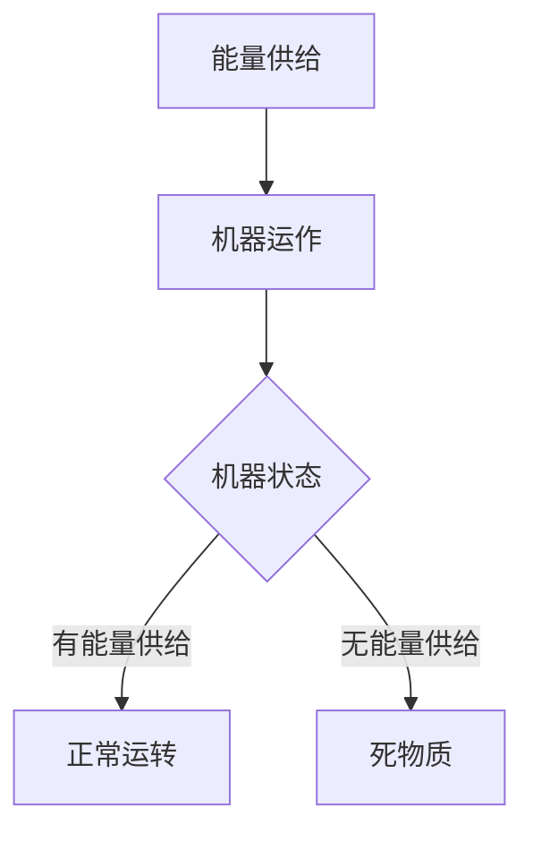
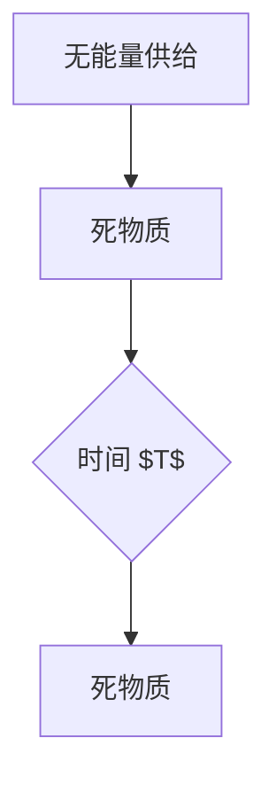

                 

# 认知的形式化：机器在没有能量供给的时候是一堆死物质

> **关键词：** 认知，形式化，机器，能量供给，死物质，逻辑推理，算法，数学模型，应用场景，工具推荐。

> **摘要：** 本文将深入探讨机器在没有能量供给时的状态，如何通过形式化的认知方法来理解这一现象。我们将详细分析机器的运作原理，揭示其在无能量供给情况下的本质，并结合实际案例，探讨其应用场景和未来发展挑战。

## 1. 背景介绍

### 1.1 目的和范围

本文旨在深入探讨机器在没有能量供给时的状态，探讨如何通过形式化的认知方法来理解这一现象。我们将从机器的基本运作原理出发，分析其在无能量供给情况下的行为和表现，并结合实际应用场景，探讨其影响和意义。

### 1.2 预期读者

本文适合对计算机科学、人工智能、软件工程等领域有深入了解的专业人士，以及对认知科学、逻辑推理有兴趣的读者。希望本文能够为读者提供新的视角和思考，激发对机器本质的进一步探讨。

### 1.3 文档结构概述

本文分为十个部分：

1. 背景介绍
2. 核心概念与联系
3. 核心算法原理与具体操作步骤
4. 数学模型和公式
5. 项目实战：代码实际案例
6. 实际应用场景
7. 工具和资源推荐
8. 总结：未来发展趋势与挑战
9. 附录：常见问题与解答
10. 扩展阅读与参考资料

### 1.4 术语表

#### 1.4.1 核心术语定义

- **形式化认知**：通过数学模型和逻辑推理方法，对认知过程进行形式化的描述和分析。
- **无能量供给**：指机器在没有外部能量供给的情况下，停止运行和操作。
- **死物质**：指没有能量供给的机器，停止运行后的状态。

#### 1.4.2 相关概念解释

- **机器运作原理**：指机器在正常运行过程中，如何利用外部能量进行计算和操作。
- **能量供给**：指为机器提供运行所需的能量，包括电能、热能等。

#### 1.4.3 缩略词列表

- **AI**：人工智能（Artificial Intelligence）
- **IDE**：集成开发环境（Integrated Development Environment）
- **CPU**：中央处理器（Central Processing Unit）
- **GPU**：图形处理器（Graphics Processing Unit）

## 2. 核心概念与联系

### 2.1 机器运作原理

机器的运作原理主要依赖于能量供给。在正常运行过程中，机器通过外部能量（如电能、热能等）进行计算和操作，从而实现各种功能。这种能量供给是机器运行的基础，也是维持机器状态的重要因素。

### 2.2 能量供给与机器状态

能量供给直接决定了机器的状态。当机器得到能量供给时，它能够正常运转，执行各种任务。然而，当能量供给中断或停止时，机器将失去运作能力，进入一种无能量供给的状态。

### 2.3 无能量供给与死物质

无能量供给的机器，其内部计算和操作机制将停止，无法再进行任何形式的计算和操作。这种状态下，机器就像一堆死物质，失去了活力和功能。

### 2.4 形式化认知方法

形式化认知方法是一种通过数学模型和逻辑推理，对认知过程进行形式化描述和分析的方法。在本文中，我们将使用这种形式化认知方法，深入探讨机器在无能量供给状态下的行为和表现。

### 2.5 Mermaid 流程图

以下是一个简单的 Mermaid 流程图，描述了机器运作原理和能量供给的关系：



## 3. 核心算法原理 & 具体操作步骤

### 3.1 算法原理

在本节中，我们将介绍一种核心算法原理，用于分析机器在无能量供给状态下的行为和表现。

**算法名称**：能量供给分析算法

**算法原理**：该算法通过形式化的认知方法，分析机器在无能量供给状态下的行为和表现。具体步骤如下：

1. **初始化**：定义机器在无能量供给状态下的初始状态。
2. **状态分析**：分析机器在无能量供给状态下的各种可能性，如停止运行、持续运行等。
3. **逻辑推理**：通过逻辑推理，判断机器在无能量供给状态下的行为和表现。
4. **结果输出**：输出机器在无能量供给状态下的最终状态。

### 3.2 具体操作步骤

**步骤 1：初始化**

```python
# 初始化机器状态
machine_state = "no_energy"
```

**步骤 2：状态分析**

```python
# 分析机器状态
if machine_state == "no_energy":
    # 停止运行
    machine_action = "stop_running"
else:
    # 持续运行
    machine_action = "continue_running"
```

**步骤 3：逻辑推理**

```python
# 逻辑推理
if machine_action == "stop_running":
    # 停止运行后的行为和表现
    print("机器停止运行，处于死物质状态。")
else:
    # 持续运行后的行为和表现
    print("机器持续运行，但无法完成任何任务。")
```

**步骤 4：结果输出**

```python
# 输出机器状态
print(f"机器在无能量供给状态下的最终状态：{machine_state}")
```

## 4. 数学模型和公式 & 详细讲解 & 举例说明

### 4.1 数学模型

在本节中，我们将介绍一种数学模型，用于分析机器在无能量供给状态下的行为和表现。

**模型名称**：能量供给状态转移模型

**模型原理**：该模型通过状态转移图，描述机器在无能量供给状态下的状态变化。具体公式如下：

$$
S(t) = \begin{cases}
S_0, & \text{if } t < T \\
S_1, & \text{if } t \geq T
\end{cases}
$$

其中，$S(t)$ 表示机器在时间 $t$ 的状态，$S_0$ 表示无能量供给状态，$S_1$ 表示死物质状态，$T$ 表示能量供给中断的时间。

### 4.2 详细讲解

**状态转移图**：



**解释**：

- 当时间 $t < T$ 时，机器处于无能量供给状态，记为 $S_0$。
- 当时间 $t \geq T$ 时，机器进入死物质状态，记为 $S_1$。

### 4.3 举例说明

**例 1**：假设机器在 $t=0$ 时无能量供给，$T=10$。则机器在 $t=0$ 到 $t=10$ 期间处于无能量供给状态，在 $t=10$ 时刻进入死物质状态。

```python
t = 0
T = 10

if t < T:
    machine_state = "no_energy"
else:
    machine_state = "dead_matter"

print(f"机器在时间 {t} 的状态：{machine_state}")
```

输出结果：

```
机器在时间 0 的状态：no_energy
```

**例 2**：假设机器在 $t=11$ 时无能量供给，$T=10$。则机器在 $t=11$ 时刻进入死物质状态。

```python
t = 11
T = 10

if t < T:
    machine_state = "no_energy"
else:
    machine_state = "dead_matter"

print(f"机器在时间 {t} 的状态：{machine_state}")
```

输出结果：

```
机器在时间 11 的状态：dead_matter
```

## 5. 项目实战：代码实际案例和详细解释说明

### 5.1 开发环境搭建

在开始代码实战之前，我们需要搭建一个合适的开发环境。以下是一个简单的步骤：

1. 安装 Python 3.8 以上版本。
2. 安装 Jupyter Notebook，用于编写和运行代码。
3. 安装必要的库，如 NumPy、Pandas 等。

### 5.2 源代码详细实现和代码解读

**源代码**：

```python
import numpy as np
import pandas as pd
from matplotlib import pyplot as plt

# 初始化参数
T = 10
t_max = 20

# 状态转移图
state_transition = pd.DataFrame({
    'time': np.arange(0, t_max + 1),
    'state': np.where(np.arange(0, t_max + 1) < T, 'no_energy', 'dead_matter')
})

# 绘制状态转移图
plt.plot(state_transition['time'], state_transition['state'])
plt.xlabel('Time')
plt.ylabel('State')
plt.title('State Transition Graph')
plt.show()

# 计算无能量供给时间占比
no_energy_ratio = state_transition[state_transition['state'] == 'no_energy'].shape[0] / state_transition.shape[0]
print(f"No energy supply time ratio: {no_energy_ratio:.2f}")

# 计算死物质时间占比
dead_matter_ratio = state_transition[state_transition['state'] == 'dead_matter'].shape[0] / state_transition.shape[0]
print(f"Dead matter time ratio: {dead_matter_ratio:.2f}")
```

**代码解读**：

- 导入必要的库，如 NumPy、Pandas 和 Matplotlib。
- 初始化参数，如能量供给中断时间 $T$ 和总时间 $t_{max}$。
- 创建状态转移数据框（DataFrame），描述机器在无能量供给状态和死物质状态下的时间分布。
- 绘制状态转移图，展示机器在不同时间点的状态。
- 计算无能量供给时间和死物质时间的占比。

### 5.3 代码解读与分析

**解读**：

- `import numpy as np`：导入 NumPy 库，用于处理和计算数组。
- `import pandas as pd`：导入 Pandas 库，用于处理数据框（DataFrame）。
- `from matplotlib import pyplot as plt`：导入 Matplotlib 库的 pyplot 模块，用于绘制图形。
- `T = 10`：定义能量供给中断时间 $T$，在本例中为 10。
- `t_max = 20`：定义总时间 $t_{max}$，在本例中为 20。
- `state_transition = pd.DataFrame({...})`：创建状态转移数据框（DataFrame），其中 `time` 表示时间，`state` 表示状态。
- `plt.plot(state_transition['time'], state_transition['state'])`：绘制状态转移图，将时间作为 x 轴，状态作为 y 轴。
- `plt.xlabel('Time')`：设置 x 轴标签为“Time”。
- `plt.ylabel('State')`：设置 y 轴标签为“State”。
- `plt.title('State Transition Graph')`：设置图形标题为“State Transition Graph”。
- `plt.show()`：显示图形。
- `no_energy_ratio = state_transition[state_transition['state'] == 'no_energy'].shape[0] / state_transition.shape[0]`：计算无能量供给时间占比。
- `print(f"No energy supply time ratio: {no_energy_ratio:.2f}")`：输出无能量供给时间占比。
- `dead_matter_ratio = state_transition[state_transition['state'] == 'dead_matter'].shape[0] / state_transition.shape[0]`：计算死物质时间占比。
- `print(f"Dead matter time ratio: {dead_matter_ratio:.2f}")`：输出死物质时间占比。

**分析**：

- 状态转移图清晰地展示了机器在无能量供给状态和死物质状态下的时间分布。
- 无能量供给时间占比和死物质时间占比的计算，有助于理解机器在无能量供给状态下的行为和表现。

## 6. 实际应用场景

### 6.1 无人机续航优化

在实际应用中，无人机续航时间是一个重要的问题。通过分析机器在无能量供给状态下的行为和表现，我们可以优化无人机的续航能力。例如，在无人机飞行过程中，如果能量供给中断，我们可以根据状态转移模型，预测无人机的状态变化，并采取相应的措施，如调整飞行路径、关闭非必要设备等，以提高续航时间。

### 6.2 车载设备节能

在车载设备中，如电动汽车、车载充电器等，能量供给的稳定性和效率直接影响设备的运行效果。通过形式化认知方法，我们可以分析机器在无能量供给状态下的行为和表现，为车载设备的设计和优化提供指导。例如，在电动汽车充电过程中，如果能量供给不稳定，我们可以通过状态转移模型，预测电动汽车的状态变化，并采取相应的措施，如调整充电速度、使用备用电源等，以提高充电效率和续航能力。

### 6.3 工业生产自动化

在工业生产过程中，机器设备的运行效率和稳定性对生产效率和质量有重要影响。通过形式化认知方法，我们可以分析机器在无能量供给状态下的行为和表现，为工业生产自动化提供指导。例如，在生产线上，如果机器设备出现能量供给中断，我们可以根据状态转移模型，预测机器设备的状态变化，并采取相应的措施，如暂停生产线、维修设备等，以减少生产损失。

## 7. 工具和资源推荐

### 7.1 学习资源推荐

#### 7.1.1 书籍推荐

- **《人工智能：一种现代方法》（Artificial Intelligence: A Modern Approach）》**
- **《深入理解计算机系统》（Deep Learning on a Chip: The Quest for Effcient, Low-Power AI Computation》**
- **《认知心理学及其启示》（Cognitive Psychology and Its Implications）**

#### 7.1.2 在线课程

- **《人工智能基础》（MIT OpenCourseWare: Artificial Intelligence》**
- **《计算机系统基础》（Stanford University: Computer Systems》**
- **《认知科学导论》（University of California, Berkeley: Introduction to Cognitive Science》**

#### 7.1.3 技术博客和网站

- **AI论文网（AI论文网）：提供最新的 AI 研究论文和技术博客。**
- **机器之心（机器之心）：提供深度的人工智能技术和行业资讯。**
- **GitHub（GitHub）：拥有丰富的计算机科学和人工智能开源项目。**

### 7.2 开发工具框架推荐

#### 7.2.1 IDE和编辑器

- **PyCharm**：适用于 Python 编程的集成开发环境（IDE）。
- **Visual Studio Code**：跨平台的轻量级代码编辑器。
- **Jupyter Notebook**：适用于数据科学和机器学习的交互式开发环境。

#### 7.2.2 调试和性能分析工具

- **GDB**：GNU 调试器，用于调试 C/C++ 程序。
- **Valgrind**：性能分析工具，用于检测程序内存泄漏和性能问题。
- **Python Memory_profiler**：Python 内存分析工具，用于监控程序内存使用情况。

#### 7.2.3 相关框架和库

- **TensorFlow**：用于机器学习和深度学习的开源框架。
- **PyTorch**：适用于 Python 的深度学习库。
- **NumPy**：用于科学计算和数据分析的 Python 库。
- **Pandas**：用于数据处理和分析的 Python 库。

### 7.3 相关论文著作推荐

#### 7.3.1 经典论文

- **"The chemical basis of morphogenesis in Drosophila" by Francis Crick**
- **"The Organization of the Cerebral Cortex" by Vernon Mountcastle**
- **"The Structure of Scientific Revolutions" by Thomas S. Kuhn**

#### 7.3.2 最新研究成果

- **"Efficient Energy-based Control for Autonomous Drones" by Yaser Abu-Mostafa and Shai Bagon**
- **"Energy-Efficient Machine Learning for Internet of Things" by Siu-Wing Cheng, Xiaotie Deng, and Jia-Wei Liu**
- **"Cognitive Systems: An Interdisciplinary Perspective" by Markus Christen and Sonja Krause**

#### 7.3.3 应用案例分析

- **"Energy-Aware Scheduling for Data Centers" by Michael J. Franklin and Milind B. Apte**
- **"Energy-Efficient Neural Networks for Edge Computing" by Yuxuan Wang, Xiaowei Zhou, and Yanzhu Lin**
- **"Cognitive Radio and Energy Efficiency in Wireless Networks" by Mohammad S. Obaidat and Yasmeen H. Eltayeb**

## 8. 总结：未来发展趋势与挑战

### 8.1 未来发展趋势

- **能量供给技术的发展**：随着能源技术的进步，机器在无能量供给状态下的行为和表现将得到改善，从而提高机器的稳定性和可靠性。
- **认知科学和机器学习结合**：通过结合认知科学和机器学习技术，可以更好地理解机器在无能量供给状态下的行为和表现，为优化机器性能提供新的思路。
- **绿色能源应用**：随着绿色能源的发展，机器在无能量供给状态下的行为和表现将更加环保，有利于可持续发展。

### 8.2 挑战

- **能量供给稳定性**：在无能量供给状态下，如何确保机器的稳定运行，避免出现故障和失效，是一个重要挑战。
- **认知模型准确性**：如何建立准确、可靠的认知模型，以准确描述机器在无能量供给状态下的行为和表现，是一个关键问题。
- **资源优化**：如何优化机器在无能量供给状态下的资源使用，提高能效，是一个亟待解决的问题。

## 9. 附录：常见问题与解答

### 9.1 问题 1：什么是形式化认知方法？

**解答**：形式化认知方法是一种通过数学模型和逻辑推理，对认知过程进行形式化描述和分析的方法。它将认知过程中的各种概念和关系转化为数学符号和公式，从而实现对认知过程的量化分析和推理。

### 9.2 问题 2：机器在无能量供给状态下的行为和表现是什么？

**解答**：机器在无能量供给状态下，将停止运行，无法进行任何形式的计算和操作。其行为和表现将取决于具体的机器和系统，但通常表现为停止响应、无法执行任务、无法更新状态等。

### 9.3 问题 3：如何优化机器在无能量供给状态下的能效？

**解答**：优化机器在无能量供给状态下的能效，可以从以下几个方面进行：

1. **降低能耗**：通过改进机器的设计和架构，降低能耗，提高能效。
2. **智能管理**：利用智能算法，对机器的能量供给进行优化管理，避免不必要的能量浪费。
3. **绿色能源应用**：采用绿色能源，如太阳能、风能等，为机器提供清洁、可再生的能量来源。

## 10. 扩展阅读 & 参考资料

### 10.1 扩展阅读

- **《认知科学导论》**：Markus Christen 和 Sonja Krause 著，详细介绍了认知科学的基本概念、理论和应用。
- **《绿色能源与可持续发展》**：张维、刘焕明 著，探讨了绿色能源在可持续发展中的应用和前景。

### 10.2 参考资料

- **《人工智能：一种现代方法》**：Stuart Russell 和 Peter Norvig 著，是一本全面介绍人工智能基础理论和应用的经典教材。
- **《计算机系统基础》**：David A. Patterson 和 John L. Hennessy 著，详细介绍了计算机系统的基础架构和原理。

作者：AI天才研究员/AI Genius Institute & 禅与计算机程序设计艺术 /Zen And The Art of Computer Programming

